# 05 - StorageImpl 与内存管理

> StorageImpl 是 PyTorch 张量数据的实际持有者，管理底层内存缓冲区的生命周期。
> 它与 Allocator、DataPtr、COW 机制共同构成了 PyTorch 的内存管理基础设施，
> 支持 CPU、CUDA、XPU 等多种设备的内存分配与回收。

---

## 目录

1. [架构概览](#1-架构概览)
2. [DataPtr — 类型安全的内存持有者](#2-dataptr--类型安全的内存持有者)
3. [UniqueVoidPtr — 分离数据与上下文](#3-uniquevoidptr--分离数据与上下文)
4. [Allocator — 内存分配器基类](#4-allocator--内存分配器基类)
5. [全局分配器注册表](#5-全局分配器注册表)
6. [CPU 内存分配](#6-cpu-内存分配)
7. [CUDA 缓存分配器](#7-cuda-缓存分配器)
8. [CachingDeviceAllocator — 通用缓存分配器](#8-cachingdeviceallocator--通用缓存分配器)
9. [StorageImpl — 存储实现](#9-storageimpl--存储实现)
10. [Storage — 存储包装器](#10-storage--存储包装器)
11. [COW 写时复制实现](#11-cow-写时复制实现)
12. [内存分配完整流程](#12-内存分配完整流程)
13. [内存回收完整流程](#13-内存回收完整流程)
14. [内存对齐与优化](#14-内存对齐与优化)
15. [内存分析与追踪](#15-内存分析与追踪)
16. [设计权衡](#16-设计权衡)

---

## 1. 架构概览

PyTorch 内存管理的层次结构：

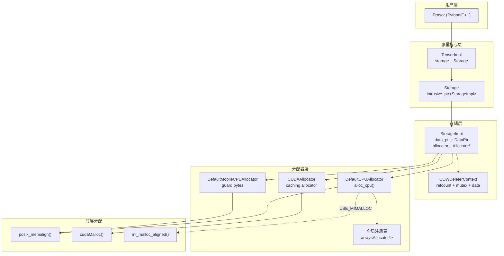
```mermaid
flowchart TD
    subgraph "用户层"
        T["Tensor (Python/C++)"]
    end
    subgraph "张量核心层"
        TI["TensorImpl<br/>storage_: Storage"]
        S["Storage<br/>intrusive_ptr&lt;StorageImpl&gt;"]
    end
    subgraph "存储层"
        SI["StorageImpl<br/>data_ptr_: DataPtr<br/>allocator_: Allocator*"]
        COW["COWDeleterContext<br/>refcount + mutex + data"]
    end
    subgraph "分配器层"
        DA["DefaultCPUAllocator<br/>alloc_cpu()"]
        MA["DefaultMobileCPUAllocator<br/>guard bytes"]
        CA["CUDAAllocator<br/>caching allocator"]
        REG["全局注册表<br/>array&lt;Allocator*&gt;"]
    end
    subgraph "底层分配"
        POSIX["posix_memalign()"]
        CUDA_MALLOC["cudaMalloc()"]
        MIMALLOC["mi_malloc_aligned()"]
    end

    T --> TI --> S --> SI
    SI --> DA
    SI --> MA
    SI --> CA
    SI --> COW
    DA --> REG
    DA --> POSIX
    MA --> POSIX
    CA --> CUDA_MALLOC
    DA -.->|"USE_MIMALLOC"| MIMALLOC
```

**关键文件索引**：

| 组件 | 文件 |
|------|------|
| DataPtr | `c10/core/Allocator.h` |
| UniqueVoidPtr | `c10/util/UniqueVoidPtr.h` |
| Allocator 基类 | `c10/core/Allocator.h`, `.cpp` |
| CPU 分配器 | `c10/core/CPUAllocator.h`, `.cpp` |
| CPU 底层分配 | `c10/core/impl/alloc_cpu.h`, `.cpp` |
| 内存对齐 | `c10/core/alignment.h` |
| CUDA 缓存分配器 | `c10/cuda/CUDACachingAllocator.h` |
| 通用缓存分配器 | `c10/core/CachingDeviceAllocator.h` |
| StorageImpl | `c10/core/StorageImpl.h`, `.cpp` |
| Storage | `c10/core/Storage.h` |
| COW 机制 | `c10/core/impl/COW.h`, `.cpp`, `COWDeleter.h`, `.cpp` |

---

## 2. DataPtr — 类型安全的内存持有者

DataPtr 拥有一块内存，记录其设备和删除器，是 PyTorch 内存所有权的核心抽象。

### 2.1 结构

```cpp
class DataPtr {
  c10::detail::UniqueVoidPtr ptr_;  // 数据指针 + 上下文 + 删除器
  Device device_;                    // 设备信息
};
```

### 2.2 构造函数

| 构造方式 | 说明 |
|----------|------|
| `DataPtr()` | 空指针，设备默认 CPU |
| `DataPtr(void* data, Device)` | 简单指针，无删除器上下文 |
| `DataPtr(void* data, void* ctx, DeleterFnPtr, Device)` | 完整：数据 + 上下文 + 删除器 + 设备 |

### 2.3 关键方法

| 方法 | 说明 |
|------|------|
| `get()` | 返回 `void*` 数据指针（只读） |
| `mutable_get()` | 返回可变 `void*` |
| `get_context()` | 返回删除器上下文指针 |
| `release_context()` | 释放上下文所有权 |
| `move_context()` | 移出上下文 unique_ptr |
| `cast_context<T>(deleter)` | 类型安全的上下文访问（需匹配删除器） |
| `get_deleter()` | 返回删除器函数指针 |
| `compare_exchange_deleter(exp, new)` | CAS 原子交换删除器 |
| `unsafe_set_device(Device)` | 修改设备（用于 CUDA 伪装） |

### 2.4 COW 与 DataPtr 的交互

DataPtr 的 `compare_exchange_deleter` 方法支持原子性地替换删除器，这是 COW 实现的关键原语：

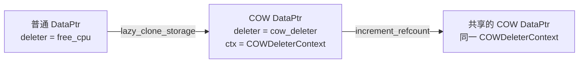
```mermaid
flowchart LR
    A["普通 DataPtr<br/>deleter = free_cpu"] -->|"lazy_clone_storage"| B["COW DataPtr<br/>deleter = cow_deleter<br/>ctx = COWDeleterContext"]
    B -->|"increment_refcount"| C["共享的 COW DataPtr<br/>同一 COWDeleterContext"]
```

---

## 3. UniqueVoidPtr — 分离数据与上下文

UniqueVoidPtr 是 DataPtr 的底层实现，核心设计是**分离数据指针和上下文指针**。

### 3.1 结构

```cpp
class UniqueVoidPtr {
  void* data_;                                // 非拥有：指向用户数据
  std::unique_ptr<void, DeleterFnPtr> ctx_;   // 拥有：上下文 + 删除器
};
```

### 3.2 为什么需要分离

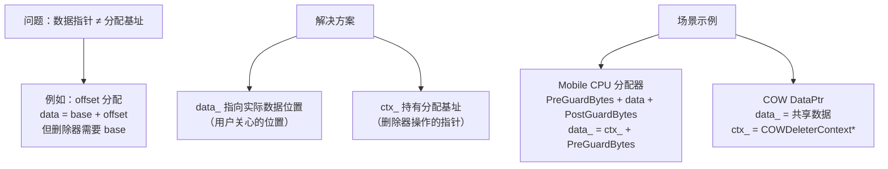
```mermaid
flowchart TD
    A["问题：数据指针 ≠ 分配基址"] --> B["例如：offset 分配<br/>data = base + offset<br/>但删除器需要 base"]
    C["解决方案"] --> D["data_ 指向实际数据位置<br/>（用户关心的位置）"]
    C --> E["ctx_ 持有分配基址<br/>（删除器操作的指针）"]

    F["场景示例"] --> G["Mobile CPU 分配器<br/>PreGuardBytes + data + PostGuardBytes<br/>data_ = ctx_ + PreGuardBytes"]
    F --> H["COW DataPtr<br/>data_ = 共享数据<br/>ctx_ = COWDeleterContext*"]
```

这种分离使得同一个分配可以被不同视图共享，同时确保内存正确释放。

---

## 4. Allocator — 内存分配器基类

Allocator 是所有内存分配器的抽象基类。

### 4.1 接口

```cpp
struct C10_API Allocator {
  virtual ~Allocator() = default;
  virtual DataPtr allocate(size_t n) = 0;        // 纯虚：分配 n 字节
  virtual DataPtr clone(const void* data, size_t n); // 复制分配
  virtual bool is_simple_data_ptr(const DataPtr&) const; // 简单指针检查
  virtual DeleterFnPtr raw_deleter() const;       // 裸删除器
  void* raw_allocate(size_t n);                    // Thrust 兼容接口
  void raw_deallocate(void* ptr);                  // Thrust 兼容接口
  virtual void copy_data(void* dst, const void* src, size_t count) const = 0;
};
```

### 4.2 关键方法语义

| 方法 | 语义 |
|------|------|
| `allocate(n)` | 分配 n 字节，返回 DataPtr（包含数据指针、删除器、设备） |
| `clone(data, n)` | 分配 + 复制：allocate(n) + copy_data() |
| `is_simple_data_ptr()` | `data == context`，表示无特殊上下文 |
| `raw_allocate(n)` | 仅用于 `is_simple_data_ptr` 的分配器，返回裸指针 |
| `raw_deallocate(ptr)` | 使用 `raw_deleter()` 释放 |
| `copy_data()` | 纯虚，设备特定的内存复制 |

### 4.3 InefficientStdFunctionContext

为用户自定义 `std::function<void(void*)>` 删除器提供包装：

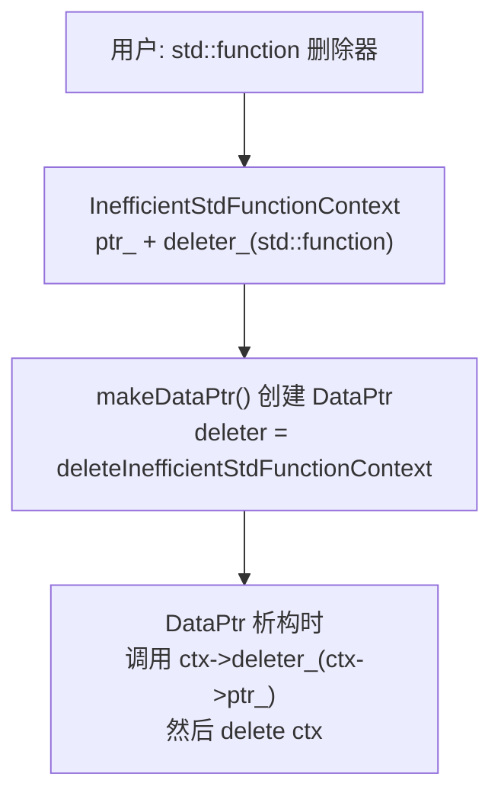
```mermaid
flowchart TD
    A["用户: std::function 删除器"] --> B["InefficientStdFunctionContext<br/>ptr_ + deleter_(std::function)"]
    B --> C["makeDataPtr() 创建 DataPtr<br/>deleter = deleteInefficientStdFunctionContext"]
    C --> D["DataPtr 析构时<br/>调用 ctx-&gt;deleter_(ctx-&gt;ptr_)<br/>然后 delete ctx"]
```

称为 "Inefficient" 因为需要两层堆分配（InefficientStdFunctionContext + std::function 内部状态）。

---

## 5. 全局分配器注册表

### 5.1 注册表结构

```cpp
// Allocator.cpp
std::array<Allocator*, COMPILE_TIME_MAX_DEVICE_TYPES> allocator_array;
std::array<uint8_t, COMPILE_TIME_MAX_DEVICE_TYPES> allocator_priority;
```

### 5.2 注册与查找

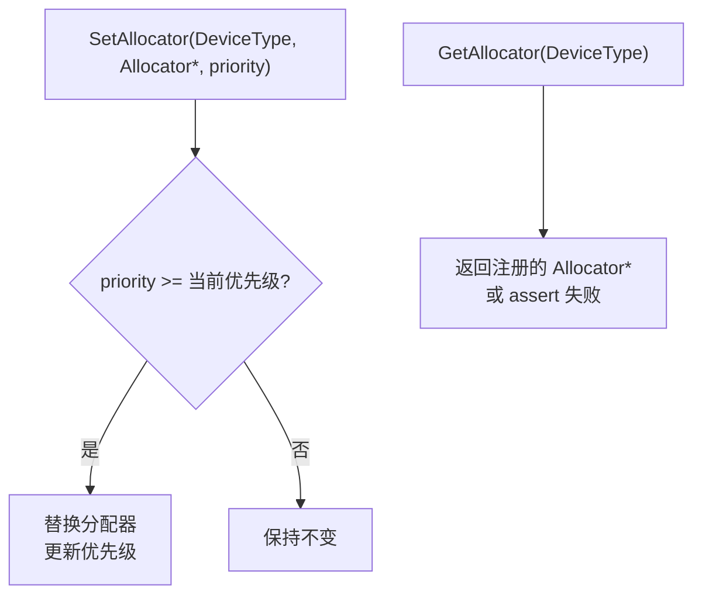
```mermaid
flowchart TD
    A["SetAllocator(DeviceType, Allocator*, priority)"] --> B{"priority >= 当前优先级?"}
    B -->|"是"| C["替换分配器<br/>更新优先级"]
    B -->|"否"| D["保持不变"]
    E["GetAllocator(DeviceType)"] --> F["返回注册的 Allocator*<br/>或 assert 失败"]
```

**注意**：
- 非线程安全，假设仅在初始化阶段调用
- Allocator 指针必须具有静态生命周期（不转移所有权）
- `REGISTER_ALLOCATOR(t, f)` 宏在静态初始化时注册

### 5.3 StorageImpl 工厂注册

```cpp
using StorageImplCreateHelper = intrusive_ptr<StorageImpl>(*)(...);

void SetStorageImplCreate(DeviceType, StorageImplCreateHelper);
StorageImplCreateHelper GetStorageImplCreate(DeviceType);
```

仅允许 `PrivateUse1` 设备类型注册自定义工厂（白名单强制），其他设备使用默认 StorageImpl 构造。

---

## 6. CPU 内存分配

### 6.1 分配流程

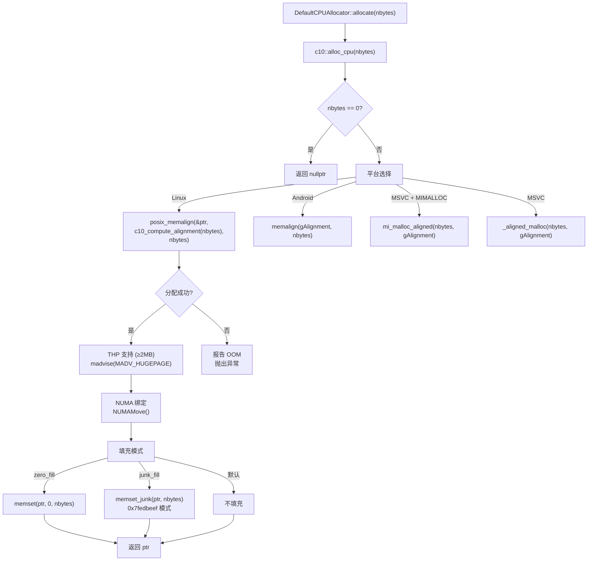
```mermaid
flowchart TD
    A["DefaultCPUAllocator::allocate(nbytes)"] --> B["c10::alloc_cpu(nbytes)"]
    B --> C{"nbytes == 0?"}
    C -->|"是"| D["返回 nullptr"]
    C -->|"否"| E["平台选择"]
    E -->|"Linux"| F["posix_memalign(&ptr,<br/>c10_compute_alignment(nbytes),<br/>nbytes)"]
    E -->|"Android"| G["memalign(gAlignment, nbytes)"]
    E -->|"MSVC + MIMALLOC"| H["mi_malloc_aligned(nbytes, gAlignment)"]
    E -->|"MSVC"| I["_aligned_malloc(nbytes, gAlignment)"]

    F --> J{"分配成功?"}
    J -->|"是"| K["THP 支持 (≥2MB)<br/>madvise(MADV_HUGEPAGE)"]
    K --> L["NUMA 绑定<br/>NUMAMove()"]
    L --> M["填充模式"]
    M -->|"zero_fill"| N["memset(ptr, 0, nbytes)"]
    M -->|"junk_fill"| O["memset_junk(ptr, nbytes)<br/>0x7fedbeef 模式"]
    M -->|"默认"| P["不填充"]
    N --> Q["返回 ptr"]
    O --> Q
    P --> Q
    J -->|"否"| R["报告 OOM<br/>抛出异常"]
```

### 6.2 对齐常量

| 常量 | 值 | 说明 |
|------|-----|------|
| `gAlignment` | 64 (desktop) / 16 (mobile) | AVX512 对齐 / NEON 对齐 |
| `gPagesize` | 4096 | 系统页大小 |
| `gAlloc_threshold_thp` | 2MB | THP 分配阈值 |

### 6.3 动态对齐计算

`c10_compute_alignment(nbytes)` 根据分配大小选择对齐：
- 小分配使用 `gAlignment`
- 大分配可能使用更大的对齐值

### 6.4 Mobile CPU 分配器

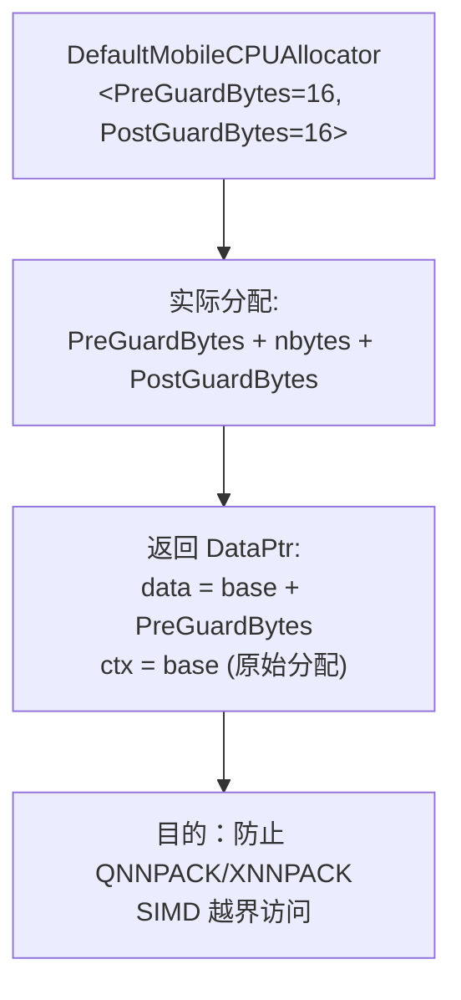
```mermaid
flowchart TD
    A["DefaultMobileCPUAllocator<br/>&lt;PreGuardBytes=16, PostGuardBytes=16&gt;"] --> B["实际分配:<br/>PreGuardBytes + nbytes + PostGuardBytes"]
    B --> C["返回 DataPtr:<br/>data = base + PreGuardBytes<br/>ctx = base (原始分配)"]
    C --> D["目的：防止 QNNPACK/XNNPACK<br/>SIMD 越界访问"]
```

### 6.5 环境变量控制

| 变量 | 效果 |
|------|------|
| `THP_MEM_ALLOC_ENABLE` | 启用透明大页（≥2MB 分配使用 `madvise`） |
| `caffe2_report_cpu_memory_usage` | 日志记录 CPU 内存分配/释放 |
| `caffe2_cpu_allocator_do_zero_fill` | 分配时零填充 |
| `caffe2_cpu_allocator_do_junk_fill` | 分配时填充 `0x7fedbeef`（调试用） |

### 6.6 释放流程

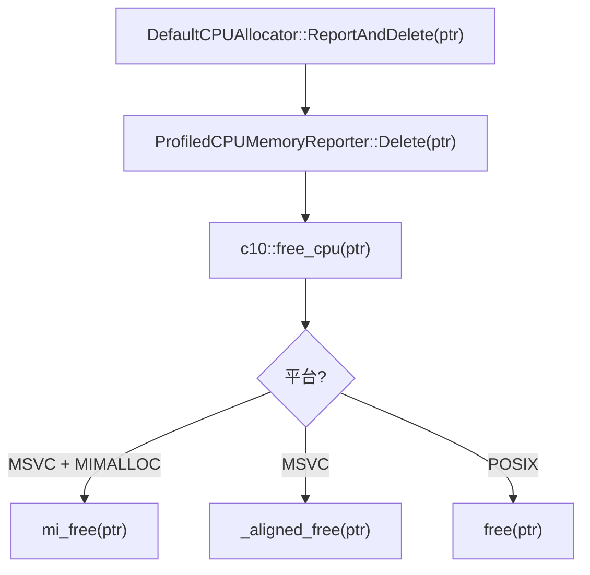
```mermaid
flowchart TD
    A["DefaultCPUAllocator::ReportAndDelete(ptr)"] --> B["ProfiledCPUMemoryReporter::Delete(ptr)"]
    B --> C["c10::free_cpu(ptr)"]
    C --> D{"平台?"}
    D -->|"MSVC + MIMALLOC"| E["mi_free(ptr)"]
    D -->|"MSVC"| F["_aligned_free(ptr)"]
    D -->|"POSIX"| G["free(ptr)"]
```

---

## 7. CUDA 缓存分配器

CUDA 缓存分配器是 PyTorch GPU 内存管理的核心，通过缓存已释放的内存块来减少 `cudaMalloc` 调用。

### 7.1 架构

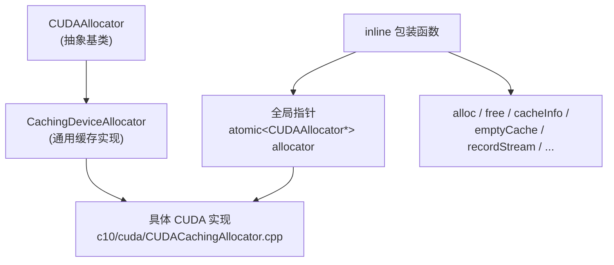
```mermaid
flowchart TD
    A["CUDAAllocator<br/>(抽象基类)"] --> B["CachingDeviceAllocator<br/>(通用缓存实现)"]
    B --> C["具体 CUDA 实现<br/>c10/cuda/CUDACachingAllocator.cpp"]

    D["全局指针<br/>atomic&lt;CUDAAllocator*&gt; allocator"] --> C

    E["inline 包装函数"] --> D
    E --> F["alloc / free / cacheInfo /<br/>emptyCache / recordStream / ..."]
```

### 7.2 核心数据结构

**BlockInfo** — 内存块元数据：

| 字段 | 类型 | 说明 |
|------|------|------|
| `size` | `size_t` | 块大小 |
| `requested_size` | `size_t` | 实际请求大小（未对齐） |
| `gc_counter` | `int32_t` | GC 计数器 |
| `allocated` | `bool` | 当前是否分配给用户 |
| `active` | `bool` | 是否活跃（分配或被流使用） |

**SegmentInfo** — 段（一次 `cudaMalloc` 调用）元数据：

| 字段 | 类型 | 说明 |
|------|------|------|
| `device` | `DeviceIndex` | CUDA 设备索引 |
| `address` | `size_t` | 基地址 |
| `total_size` | `size_t` | 段总大小 |
| `stream` | `cudaStream_t` | 关联流 |
| `is_large` | `bool` | 大池 vs 小池 |
| `is_expandable` | `bool` | 使用 `cuMemMap` 可扩展段 |
| `blocks` | `vector<BlockInfo>` | 段内的子块 |

### 7.3 分配策略

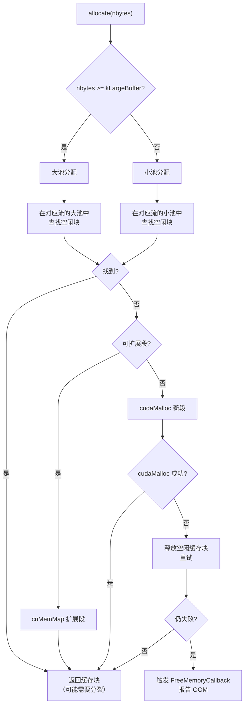
```mermaid
flowchart TD
    A["allocate(nbytes)"] --> B{"nbytes >= kLargeBuffer?"}
    B -->|"是"| C["大池分配"]
    B -->|"否"| D["小池分配"]
    C --> E["在对应流的大池中<br/>查找空闲块"]
    D --> F["在对应流的小池中<br/>查找空闲块"]
    E --> G{"找到?"}
    F --> G
    G -->|"是"| H["返回缓存块<br/>（可能需要分裂）"]
    G -->|"否"| I{"可扩展段?"}
    I -->|"是"| J["cuMemMap 扩展段"]
    I -->|"否"| K["cudaMalloc 新段"]
    J --> H
    K --> L{"cudaMalloc 成功?"}
    L -->|"是"| H
    L -->|"否"| M["释放空闲缓存块<br/>重试"]
    M --> N{"仍失败?"}
    N -->|"是"| O["触发 FreeMemoryCallback<br/>报告 OOM"]
    N -->|"否"| H
```

### 7.4 CUDAAllocator 接口

| 方法 | 说明 |
|------|------|
| `raw_alloc(nbytes)` | 快速分配，无 DataPtr 开销 |
| `raw_alloc_with_stream(nbytes, stream)` | 流感知快速分配 |
| `raw_delete(ptr)` | 快速释放 |
| `init(device_count)` | 初始化 |
| `emptyCache()` | 释放所有空闲缓存块 |
| `setMemoryFraction(fraction, device)` | 设置设备内存使用上限 |
| `recordStream(DataPtr, CUDAStream)` | 记录流使用（延迟释放） |
| `getDeviceStats(device)` | 获取设备统计信息 |
| `snapshot()` | 获取完整内存状态快照 |
| `beginAllocateToPool(device, id, filter)` | 路由分配到指定池 |
| `shareIpcHandle(ptr)` / `getIpcDevPtr(handle)` | IPC 句柄共享 |

### 7.5 MemPool 与 MemPoolContext

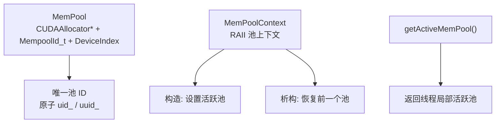
```mermaid
flowchart TD
    A["MemPool<br/>CUDAAllocator* + MempoolId_t + DeviceIndex"] --> B["唯一池 ID<br/>原子 uid_ / uuid_"]
    C["MemPoolContext<br/>RAII 池上下文"] --> D["构造: 设置活跃池"]
    C --> E["析构: 恢复前一个池"]
    F["getActiveMemPool()"] --> G["返回线程局部活跃池"]
```

### 7.6 内存追踪

**TraceEntry** 记录分配历史事件：

| Action | 说明 |
|--------|------|
| `ALLOC` | 用户分配 |
| `FREE_REQUESTED` | 用户请求释放 |
| `FREE_COMPLETED` | 释放完成（流同步后） |
| `SEGMENT_ALLOC` | 新段分配 |
| `SEGMENT_FREE` | 段释放 |
| `SEGMENT_MAP` / `SEGMENT_UNMAP` | 可扩展段映射 |
| `SNAPSHOT` | 快照点 |
| `OOM` | OOM 事件 |

**RecordContext** 控制栈追踪粒度：`NEVER` → `STATE` → `ALLOC` → `ALL`。

---

## 8. CachingDeviceAllocator — 通用缓存分配器

`CachingDeviceAllocator` 是设备无关的缓存分配器基类，CUDA 实现基于此。

### 8.1 DeviceStats 统计

```cpp
struct Stat {
  int64_t current;   // 当前值
  int64_t peak;      // 峰值
  int64_t allocated; // 累计分配
  int64_t freed;     // 累计释放
};

enum StatType { AGGREGATE, SMALL_POOL, LARGE_POOL, NUM_TYPES };

struct DeviceStats {
  Stat allocation[STAT_TYPES];       // 分配次数
  Stat segment[STAT_TYPES];          // 段数
  Stat active[STAT_TYPES];           // 活跃块数
  Stat inactive_split[STAT_TYPES];   // 不活跃分裂块数
  Stat allocated_bytes[STAT_TYPES];  // 已分配字节
  Stat reserved_bytes[STAT_TYPES];   // 保留字节
  Stat active_bytes[STAT_TYPES];     // 活跃字节
  Stat inactive_split_bytes[STAT_TYPES];
  Stat requested_bytes[STAT_TYPES];  // 请求字节（未对齐）
  // 额外标量计数器
  int64_t num_alloc_retries;
  int64_t num_ooms;
  int64_t num_sync_all_streams;
  // ...
};
```

### 8.2 统计维度

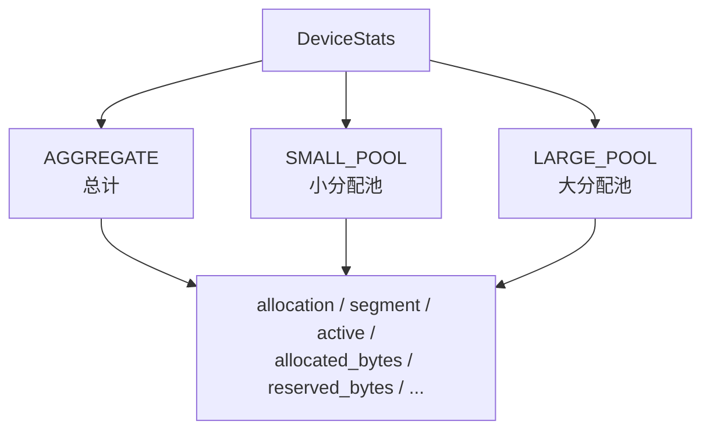
```mermaid
flowchart TD
    A["DeviceStats"] --> B["AGGREGATE<br/>总计"]
    A --> C["SMALL_POOL<br/>小分配池"]
    A --> D["LARGE_POOL<br/>大分配池"]
    B --> E["allocation / segment / active /<br/>allocated_bytes / reserved_bytes / ..."]
    C --> E
    D --> E
```

---

## 9. StorageImpl — 存储实现

StorageImpl 持有 DataPtr，是张量数据缓冲区的实际所有者。

### 9.1 核心成员

| 成员 | 类型 | 用途 |
|------|------|------|
| `data_ptr_` | `DataPtr` | 数据指针 + 删除器 + 设备 |
| `size_bytes_` | `SymInt` | 字节数（可能为符号值） |
| `size_bytes_is_heap_allocated_` | `bool` | 优化：缓存 SymInt 的堆分配状态 |
| `resizable_` | `bool` | 是否可调整大小 |
| `received_cuda_` | `bool` | 跨进程 CUDA 接收标志 |
| `has_mutable_data_ptr_check_` | `bool` | 热路径守卫：为 false 时跳过所有检查 |
| `throw_on_mutable_data_ptr_` | `bool` | 可变访问时抛异常 |
| `throw_on_immutable_data_ptr_` | `bool` | 不可变访问时抛异常 |
| `warn_deprecated_on_mutable_data_ptr_` | `bool` | 可变访问时警告 |
| `allocator_` | `Allocator*` | 分配器指针 |
| `pyobj_slot_` | `PyObjectSlot` | Python 对象槽 |
| `extra_meta_` | `unique_ptr<StorageExtraMeta>` | 扩展元数据（自定义错误信息） |

### 9.2 构造函数

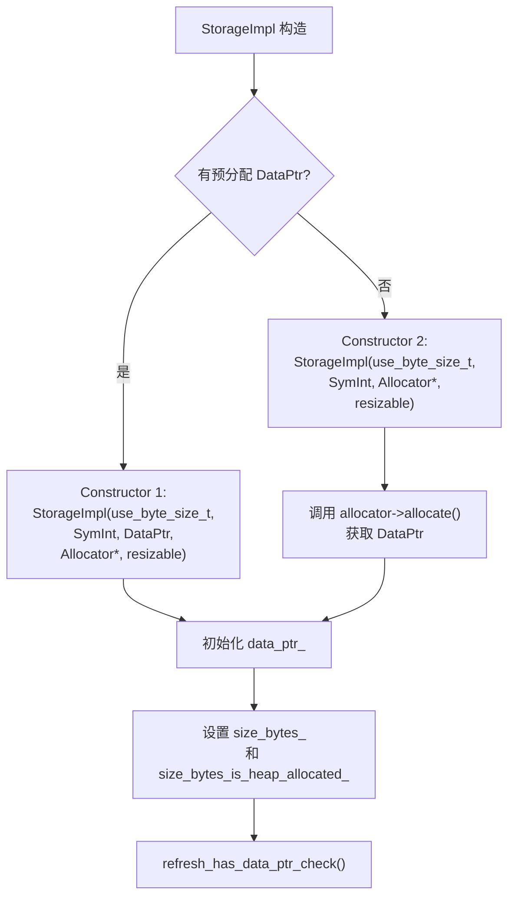
```mermaid
flowchart TD
    A["StorageImpl 构造"] --> B{"有预分配 DataPtr?"}
    B -->|"是"| C["Constructor 1:<br/>StorageImpl(use_byte_size_t,<br/>SymInt, DataPtr,<br/>Allocator*, resizable)"]
    B -->|"否"| D["Constructor 2:<br/>StorageImpl(use_byte_size_t,<br/>SymInt, Allocator*,<br/>resizable)"]
    D --> E["调用 allocator-&gt;allocate()<br/>获取 DataPtr"]
    C --> F["初始化 data_ptr_"]
    E --> F
    F --> G["设置 size_bytes_<br/>和 size_bytes_is_heap_allocated_"]
    G --> H["refresh_has_data_ptr_check()"]
```

### 9.3 数据访问层级

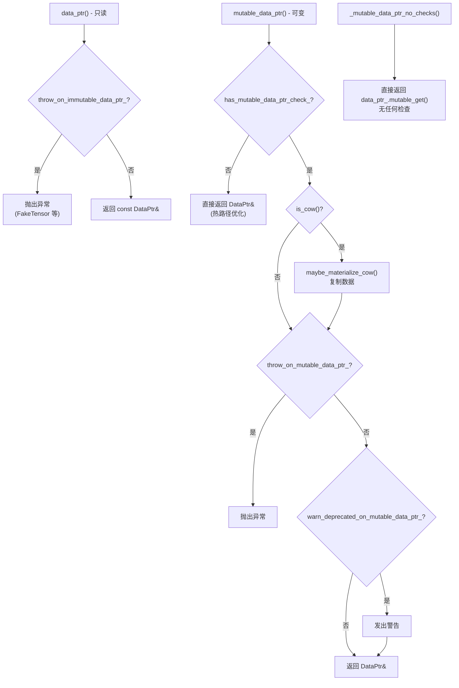
```mermaid
flowchart TD
    A["data_ptr() - 只读"] --> B{"throw_on_immutable_data_ptr_?"}
    B -->|"是"| C["抛出异常<br/>(FakeTensor 等)"]
    B -->|"否"| D["返回 const DataPtr&"]

    E["mutable_data_ptr() - 可变"] --> F{"has_mutable_data_ptr_check_?"}
    F -->|"否"| G["直接返回 DataPtr&<br/>(热路径优化)"]
    F -->|"是"| H{"is_cow()?"}
    H -->|"是"| I["maybe_materialize_cow()<br/>复制数据"]
    H -->|"否"| J{"throw_on_mutable_data_ptr_?"}
    J -->|"是"| K["抛出异常"]
    J -->|"否"| L{"warn_deprecated_on_mutable_data_ptr_?"}
    L -->|"是"| M["发出警告"]
    L -->|"否"| N["返回 DataPtr&"]
    I --> J
    M --> N

    O["_mutable_data_ptr_no_checks()"] --> P["直接返回 data_ptr_.mutable_get()<br/>无任何检查"]
```

`has_mutable_data_ptr_check_` 是关键优化：大多数 StorageImpl 不需要任何检查，该标志为 false 时完全跳过 COW/throw/warn 逻辑。

### 9.4 refresh_has_data_ptr_check

```cpp
void refresh_has_data_ptr_check() {
  has_mutable_data_ptr_check_ =
      is_cow() ||
      throw_on_mutable_data_ptr_ ||
      warn_deprecated_on_mutable_data_ptr_ ||
      throw_on_immutable_data_ptr_;
}
```

单一布尔值门控所有检查，避免热路径上的多次条件判断。

### 9.5 make_storage_impl 工厂函数

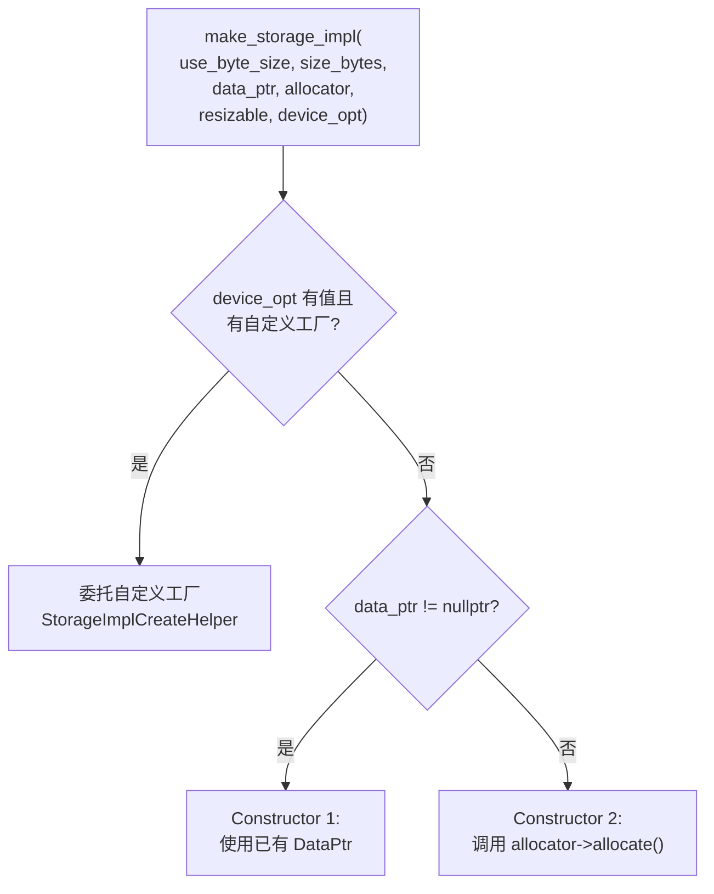
```mermaid
flowchart TD
    A["make_storage_impl(<br/>use_byte_size, size_bytes,<br/>data_ptr, allocator,<br/>resizable, device_opt)"] --> B{"device_opt 有值且<br/>有自定义工厂?"}
    B -->|"是"| C["委托自定义工厂<br/>StorageImplCreateHelper"]
    B -->|"否"| D{"data_ptr != nullptr?"}
    D -->|"是"| E["Constructor 1:<br/>使用已有 DataPtr"]
    D -->|"否"| F["Constructor 2:<br/>调用 allocator-&gt;allocate()"]
```

---

## 10. Storage — 存储包装器

Storage 是 `intrusive_ptr<StorageImpl>` 的值语义包装器。

### 10.1 MaybeOwned<Storage> 借用语义

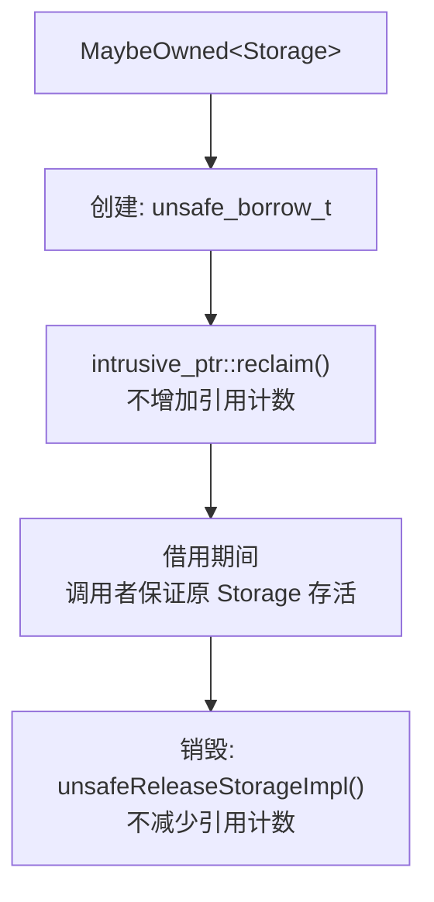
```mermaid
flowchart TD
    A["MaybeOwned&lt;Storage&gt;"] --> B["创建: unsafe_borrow_t"]
    B --> C["intrusive_ptr::reclaim()<br/>不增加引用计数"]
    C --> D["借用期间<br/>调用者保证原 Storage 存活"]
    D --> E["销毁: unsafeReleaseStorageImpl()<br/>不减少引用计数"]
```

| 操作 | refcount 变化 |
|------|---------------|
| 正常 `intrusive_ptr` 持有 | +1 |
| `unsafe_borrow_t` 借用 | 0（不增加） |
| 正常析构 | -1 |
| 借用析构 | 0（不减少） |

### 10.2 ExclusivelyOwned<Storage>

```cpp
template <>
struct ExclusivelyOwnedTraits<Storage> {
  // 跳过原子引用计数操作
  // 假设只有一个所有者，无需同步
};
```

用于已知独占所有权的场景，消除原子操作开销。

---

## 11. COW 写时复制实现

COW 机制允许多个张量共享同一存储，仅在需要可变访问时才复制数据。

### 11.1 COWDeleterContext — COW 核心数据结构

```cpp
class COWDeleterContext {
  std::shared_mutex mutex_;                    // 读写锁
  std::unique_ptr<void, DeleterFnPtr> data_;   // 原始数据 + 删除器
  std::atomic<int64_t> refcount_;              // 引用计数，初始 1
};
```

### 11.2 COW 引用计数语义

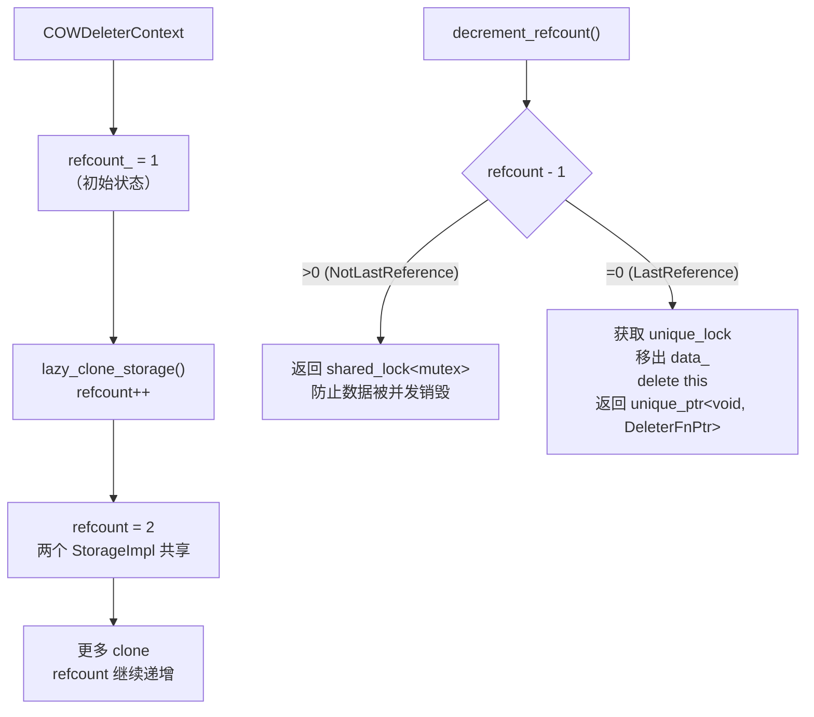
```mermaid
flowchart TD
    A["COWDeleterContext"] --> B["refcount_ = 1<br/>（初始状态）"]
    B --> C["lazy_clone_storage()<br/>refcount++"]
    C --> D["refcount = 2<br/>两个 StorageImpl 共享"]
    D --> E["更多 clone<br/>refcount 继续递增"]

    F["decrement_refcount()"] --> G{"refcount - 1"}
    G -->|">0 (NotLastReference)"| H["返回 shared_lock&lt;mutex&gt;<br/>防止数据被并发销毁"]
    G -->|"=0 (LastReference)"| I["获取 unique_lock<br/>移出 data_<br/>delete this<br/>返回 unique_ptr&lt;void, DeleterFnPtr&gt;"]
```

### 11.3 lazy_clone_storage 流程

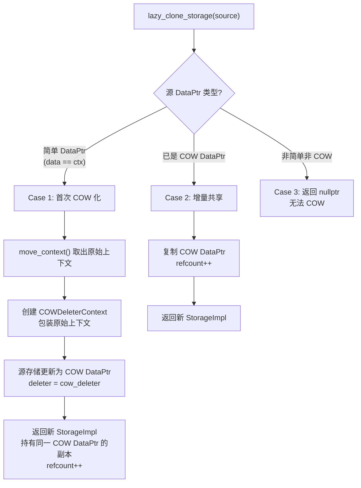
```mermaid
flowchart TD
    A["lazy_clone_storage(source)"] --> B{"源 DataPtr 类型?"}
    B -->|"简单 DataPtr<br/>(data == ctx)"| C["Case 1: 首次 COW 化"]
    B -->|"已是 COW DataPtr"| D["Case 2: 增量共享"]
    B -->|"非简单非 COW"| E["Case 3: 返回 nullptr<br/>无法 COW"]

    C --> C1["move_context() 取出原始上下文"]
    C1 --> C2["创建 COWDeleterContext<br/>包装原始上下文"]
    C2 --> C3["源存储更新为 COW DataPtr<br/>deleter = cow_deleter"]
    C3 --> C4["返回新 StorageImpl<br/>持有同一 COW DataPtr 的副本<br/>refcount++"]

    D --> D1["复制 COW DataPtr<br/>refcount++"]
    D1 --> D2["返回新 StorageImpl"]
```

### 11.4 materialize_cow_storage 流程

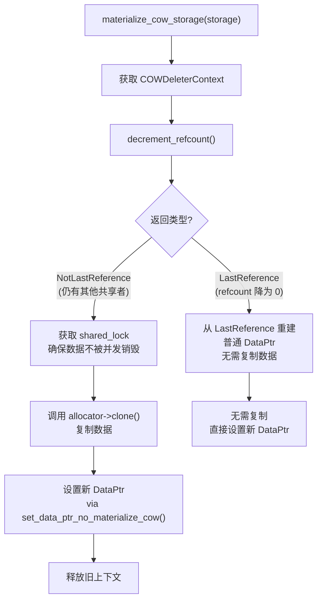
```mermaid
flowchart TD
    A["materialize_cow_storage(storage)"] --> B["获取 COWDeleterContext"]
    B --> C["decrement_refcount()"]
    C --> D{"返回类型?"}
    D -->|"LastReference<br/>(refcount 降为 0)"| E["从 LastReference 重建<br/>普通 DataPtr<br/>无需复制数据"]
    D -->|"NotLastReference<br/>(仍有其他共享者)"| F["获取 shared_lock<br/>确保数据不被并发销毁"]
    F --> G["调用 allocator-&gt;clone()<br/>复制数据"]
    G --> H["设置新 DataPtr<br/>via set_data_ptr_no_materialize_cow()"]
    H --> I["释放旧上下文"]
    E --> J["无需复制<br/>直接设置新 DataPtr"]
```

### 11.5 COW 安全性保证

| 场景 | 保护机制 |
|------|----------|
| 并发 materialize | `shared_mutex`：非最后引用者持有 shared_lock，最后引用者需 unique_lock |
| ParallelGuard | `materialize_cow_storage` 断言不在 `at::parallel_for` 循环体内 |
| 非 COW 误操作 | `is_cow()` 检查在 `maybe_materialize_cow()` 入口 |
| 嵌套 COW | `COWDeleterContext` 构造时断言原始 deleter 不是 `cow_deleter` |

---

## 12. 内存分配完整流程

从 `torch.empty()` 到物理内存分配：

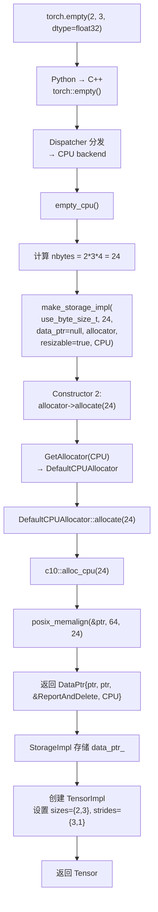
```mermaid
flowchart TD
    A["torch.empty(2, 3, dtype=float32)"] --> B["Python → C++<br/>torch::empty()"]
    B --> C["Dispatcher 分发<br/>→ CPU backend"]
    C --> D["empty_cpu()"]
    D --> E["计算 nbytes = 2*3*4 = 24"]
    E --> F["make_storage_impl(<br/>use_byte_size_t, 24,<br/>data_ptr=null, allocator,<br/>resizable=true, CPU)"]
    F --> G["Constructor 2:<br/>allocator-&gt;allocate(24)"]
    G --> H["GetAllocator(CPU)<br/>→ DefaultCPUAllocator"]
    H --> I["DefaultCPUAllocator::allocate(24)"]
    I --> J["c10::alloc_cpu(24)"]
    J --> K["posix_memalign(&ptr, 64, 24)"]
    K --> L["返回 DataPtr{ptr, ptr, &ReportAndDelete, CPU}"]
    L --> M["StorageImpl 存储 data_ptr_"]
    M --> N["创建 TensorImpl<br/>设置 sizes={2,3}, strides={3,1}"]
    N --> O["返回 Tensor"]
```

### 12.1 CUDA 分配流程

```mermaid
flowchart TD
    A["torch.empty(2, 3, device='cuda')"] --> B["Dispatcher → CUDA backend"]
    B --> C["empty_cuda()"]
    C --> D["make_storage_impl(..., CUDA)"]
    D --> E["CUDAAllocator::allocate(24)"]
    E --> F["在缓存中查找 24 字节空闲块"]
    F --> G{"找到?"}
    G -->|"是"| H["返回缓存块"]
    G -->|"否"| I["cudaMalloc 新段"]
    I --> J["从段中分裂出 24 字节块"]
    J --> H
    H --> K["返回 DataPtr(ptr, block_ctx,<br/>cuda_caching_deleter, CUDA)"]
```

---

## 13. 内存回收完整流程

### 13.1 CPU 内存回收

```mermaid
flowchart TD
    A["Python GC 回收 Tensor"] --> B["TensorImpl refcount--"]
    B --> C["TensorImpl::release_resources()"]
    C --> D["storage_ 清空<br/>StorageImpl refcount--"]
    D --> E{"StorageImpl refcount == 0?"}
    E -->|"否"| F["其他张量仍引用此存储"]
    E -->|"是"| G["StorageImpl::release_resources()"]
    G --> H["data_ptr_.clear()"]
    H --> I["UniqueVoidPtr 析构<br/>调用 deleter(ctx)"]
    I --> J["ReportAndDelete(ptr)"]
    J --> K["ProfiledCPUMemoryReporter::Delete(ptr)"]
    K --> L["c10::free_cpu(ptr)"]
    L --> M["free(ptr)"]
```

### 13.2 CUDA 内存回收

```mermaid
flowchart TD
    A["Python GC 回收 CUDA Tensor"] --> B["StorageImpl::release_resources()"]
    B --> C["data_ptr_.clear()"]
    C --> D["cuda_caching_deleter(block_ctx)"]
    D --> E["标记块为空闲<br/>但不立即 cudaFree"]
    E --> F["放入空闲列表<br/>等待后续复用"]
    F --> G{"需要实际释放?<br/>(emptyCache / OOM)"}
    G -->|"是"| H["cudaFree 段"]
    G -->|"否"| I["保持缓存<br/>下次分配可复用"]
```

**关键差异**：CPU 立即释放内存，CUDA 延迟释放以复用缓存。

### 13.3 COW 内存回收

```mermaid
flowchart TD
    A["COW StorageImpl 析构"] --> B["cow_deleter(ctx)"]
    B --> C["COWDeleterContext::decrement_refcount()"]
    C --> D{"refcount - 1"}
    D -->|"=0 (最后引用)"| E["unique_lock(mutex_)<br/>移出 data_<br/>delete this"]
    E --> F["调用原始删除器<br/>释放实际内存"]
    D -->|">0 (非最后引用)"| G["shared_lock 自动释放<br/>内存继续共享"]
```

---

## 14. 内存对齐与优化

### 14.1 对齐策略

| 平台 | 对齐值 | 原因 |
|------|--------|------|
| Desktop x86 | 64 bytes | AVX-512 512-bit = 64 bytes |
| Mobile ARM | 16 bytes | NEON 128-bit = 16 bytes |

### 14.2 Transparent Huge Pages (THP)

```mermaid
flowchart TD
    A["alloc_cpu(nbytes)"] --> B{"nbytes >= 2MB?"}
    B -->|"是"| C{"THP_MEM_ALLOC_ENABLE<br/>环境变量?"}
    C -->|"是"| D["madvise(data, nbytes,<br/>MADV_HUGEPAGE)"]
    C -->|"否"| E["普通页面"]
    B -->|"否"| E
```

THP 减少大分配的 TLB miss，提升大张量操作的内存访问性能。

### 14.3 NUMA 感知

`NUMAMove(data, nbytes, GetCurrentNUMANode())` 确保内存在当前 NUMA 节点上，减少跨节点访问延迟。

---

## 15. 内存分析与追踪

### 15.1 ProfiledCPUMemoryReporter

```cpp
class ProfiledCPUMemoryReporter {
  std::mutex mutex_;
  std::unordered_map<void*, size_t> size_table_;  // 指针 → 大小映射
  size_t allocated_ = 0;                           // 总分配字节
  size_t log_cnt_ = 0;                             // 日志计数器
};
```

| 方法 | 触发时机 | 行为 |
|------|----------|------|
| `New(ptr, nbytes)` | CPU 分配成功 | 记录 size_table_[ptr]，累加 allocated_ |
| `Delete(ptr)` | CPU 释放 | 查找并移除 size_table_[ptr]，递减 allocated_ |
| `OutOfMemory(nbytes)` | CPU OOM | 记录 OOM 事件 |

### 15.2 MemoryReportingInfoBase

```cpp
struct MemoryReportingInfoBase : public c10::DebugInfoBase {
  virtual void reportMemoryUsage(void* ptr, int64_t alloc_size,
      size_t total_allocated, size_t total_reserved, Device device) = 0;
  virtual void reportOutOfMemory(int64_t alloc_size, ...);
  virtual bool memoryProfilingEnabled() const = 0;
};
```

线程局部存储的内存分析接口，支持自定义内存追踪器。

### 15.3 CUDA 快照与追踪

| 功能 | 方法 | 说明 |
|------|------|------|
| 完整快照 | `snapshot()` | 返回所有段和块的详细信息 |
| 分配追踪 | `recordHistory()` | 控制分配事件记录 |
| OOM 观察 | `attachOutOfMemoryObserver()` | 注册 OOM 回调 |
| 检查点 | `getCheckpointState()` / `setCheckpointPoolState()` | 保存/恢复内存状态 |

---

## 16. 设计权衡

### 16.1 DataPtr 的 data/context 分离

- **收益**：支持 offset 分配、guard bytes、COW 等场景
- **代价**：每个 DataPtr 多一个指针（8 bytes），概念复杂度增加
- **替代方案**：统一指针 → 无法支持 guard bytes 和 COW

### 16.2 全局分配器注册表 vs 工厂模式

- **当前**：全局数组 + 优先级，静态初始化时注册
- **收益**：查找 O(1)，无动态分配
- **代价**：非线程安全，不支持运行时动态注册
- **适用**：分配器注册只在初始化阶段

### 16.3 CUDA 延迟释放 vs 立即释放

- **延迟释放**：缓存已释放块，复用减少 `cudaMalloc` 开销
- **代价**：内存峰值可能高于实际使用量
- **控制**：`emptyCache()` 可强制释放，`max_split_size` 控制块分裂

### 16.4 COW 的 shared_mutex 开销

- **收益**：视图张量零拷贝共享存储
- **代价**：materialize 时需要获取 shared_lock，并发场景可能有锁争用
- **约束**：禁止在 `at::parallel_for` 中 materialize

### 16.5 has_mutable_data_ptr_check_ 单标志门控

- **收益**：热路径仅检查一个 bool，避免 4 个条件分支
- **代价**：修改任何检查标志后需调用 `refresh_has_data_ptr_check()`
- **影响**：覆盖了 99%+ 的普通 StorageImpl 无需任何检查

---

## 附录：关键代码行号参考

| 内容 | 文件 | 行号 |
|------|------|------|
| DataPtr 类 | `c10/core/Allocator.h` | 26-121 |
| Allocator 基类 | `c10/core/Allocator.h` | 161-214 |
| 全局注册表 | `c10/core/Allocator.cpp` | 42-58 |
| DefaultCPUAllocator | `c10/core/CPUAllocator.cpp` | 18-47 |
| alloc_cpu | `c10/core/impl/alloc_cpu.cpp` | 86-154 |
| free_cpu | `c10/core/impl/alloc_cpu.cpp` | 156-167 |
| ProfiledCPUMemoryReporter | `c10/core/CPUAllocator.cpp` | 203-290 |
| CUDAAllocator 接口 | `c10/cuda/CUDACachingAllocator.h` | 199-310 |
| CachingDeviceAllocator 统计 | `c10/core/CachingDeviceAllocator.h` | 60-109 |
| StorageImpl 类 | `c10/core/StorageImpl.h` | 52-346 |
| make_storage_impl | `c10/core/StorageImpl.cpp` | 77-114 |
| Storage 类 | `c10/core/Storage.h` | 25-207 |
| MaybeOwnedTraits | `c10/core/Storage.h` | 209-238 |
| COWDeleterContext | `c10/core/impl/COWDeleter.h` | 16-56 |
| lazy_clone_storage | `c10/core/impl/COW.cpp` | 51-111 |
| materialize_cow_storage | `c10/core/impl/COW.cpp` | 113-151 |
| decrement_refcount | `c10/core/impl/COWDeleter.cpp` | 23-36 |
| 对齐常量 | `c10/core/alignment.h` | 11-20 |
