# 06 - IntrusivePtr 引用计数

> IntrusivePtr 是 PyTorch 的侵入式智能指针，为 TensorImpl、StorageImpl 等核心对象
> 提供零开销的共享所有权语义。与 std::shared_ptr 不同，引用计数内嵌在对象中，
> 避免了额外的控制块分配，并提供可定制的资源释放钩子。

---

## 目录

1. [架构概览](#1-架构概览)
2. [intrusive_ptr_target — 引用计数基类](#2-intrusive_ptr_target--引用计数基类)
3. [引用计数方案详解](#3-引用计数方案详解)
4. [原子操作与内存序](#4-原子操作与内存序)
5. [intrusive_ptr — 强引用智能指针](#5-intrusive_ptr--强引用智能指针)
6. [weak_intrusive_ptr — 弱引用智能指针](#6-weak_intrusive_ptr--弱引用智能指针)
7. [lock() 的 CAS 算法](#7-lock-的-cas-算法)
8. [裸指针操作 — raw 命名空间](#8-裸指针操作--raw-命名空间)
9. [非堆分配对象适配](#9-非堆分配对象适配)
10. [MaybeOwned 与借用语义](#10-maybeowned-与借用语义)
11. [ExclusivelyOwned 与独占优化](#11-exclusivelyowned-与独占优化)
12. [UniqueVoidPtr — 数据与上下文分离](#12-uniquevoidptr--数据与上下文分离)
13. [对象生命周期完整流程](#13-对象生命周期完整流程)
14. [设计权衡](#14-设计权衡)

---

## 1. 架构概览

IntrusivePtr 体系的组件关系：

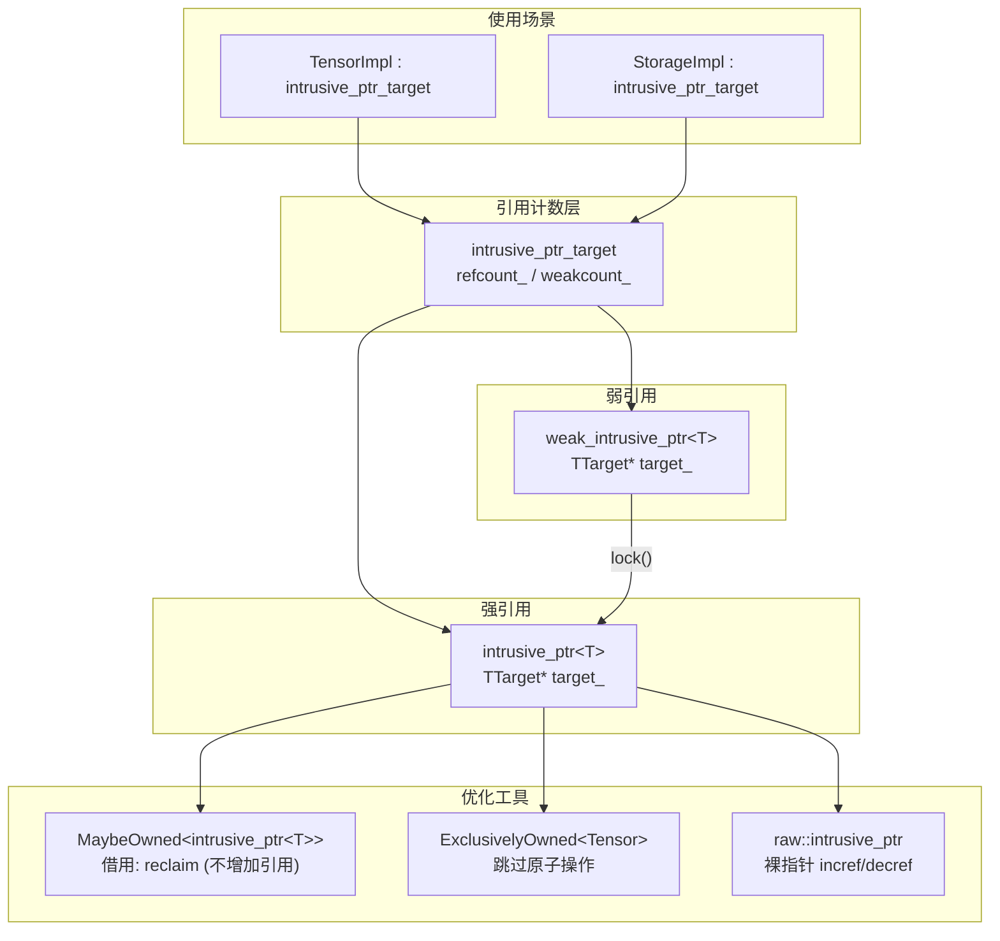

**关键文件索引**：

| 组件 | 文件 |
|------|------|
| intrusive_ptr_target | `c10/util/intrusive_ptr.h` |
| intrusive_ptr | `c10/util/intrusive_ptr.h` |
| weak_intrusive_ptr | `c10/util/intrusive_ptr.h` |
| MaybeOwned | `c10/util/MaybeOwned.h` |
| ExclusivelyOwned | `c10/util/ExclusivelyOwned.h` |
| ExclusivelyOwnedTensorTraits | `c10/util/ExclusivelyOwnedTensorTraits.h` |
| UniqueVoidPtr | `c10/util/UniqueVoidPtr.h` |

---

## 2. intrusive_ptr_target — 引用计数基类

所有使用 IntrusivePtr 管理的对象必须继承 `intrusive_ptr_target`。

### 2.1 核心成员

```cpp
struct C10_API intrusive_ptr_target {
  mutable std::atomic<uint32_t> refcount_;   // 强引用计数
  mutable std::atomic<uint32_t> weakcount_;   // 弱引用计数（含额外 1）

protected:
  virtual void release_resources() {}  // refcount 降为 0 时调用

  constexpr intrusive_ptr_target() noexcept
      : refcount_(0), weakcount_(0) {}

  // 拷贝/移动不复制引用计数
  intrusive_ptr_target(const intrusive_ptr_target&) noexcept : refcount_(0), weakcount_(0) {}
  intrusive_ptr_target(intrusive_ptr_target&&) noexcept : refcount_(0), weakcount_(0) {}

protected:
  virtual ~intrusive_ptr_target();  // 受保护析构
};
```

### 2.2 友元声明

```cpp
template <typename T, typename NullType> friend class intrusive_ptr;
template <typename T, typename NullType> friend class weak_intrusive_ptr;
friend void raw::intrusive_ptr::incref(intrusive_ptr_target*);
friend void raw::weak_intrusive_ptr::incref(intrusive_ptr_target*);
template <typename T> friend struct ExclusivelyOwnedTensorTraits;
```

### 2.3 析构函数断言

```cpp
virtual ~intrusive_ptr_target() {
  // 断言 1: refcount 为 0 或为极大值（非堆分配对象）
  TORCH_INTERNAL_ASSERT(
      refcount_.load() == 0 ||
      refcount_.load() >= kImpracticallyHugeReferenceCount);

  // 断言 2: weakcount 为 0/1 或为极大值
  // 值 1 是合法的：intrusive_ptr 析构时可能只减少了 refcount
  TORCH_INTERNAL_ASSERT(
      weakcount_.load() == 0 || weakcount_.load() == 1 ||
      weakcount_.load() >= kImpracticallyHugeReferenceCount - 1);
}
```

---

## 3. 引用计数方案详解

### 3.1 双计数器方案

```
refcount  = 强引用数量
weakcount = 弱引用数量 + (refcount > 0 ? 1 : 0)
```

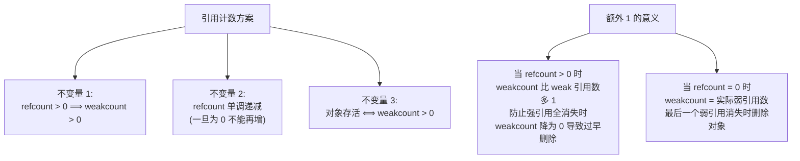

### 3.2 状态转换

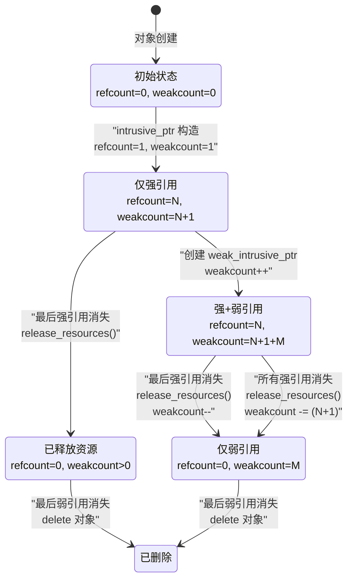

### 3.3 kImpracticallyHugeReferenceCount

```cpp
constexpr uint32_t kImpracticallyHugeReferenceCount = 0x0FFFFFFF;
// = 268,435,455
```

**用途**：为非堆分配对象（如 arena 分配、栈上对象）设置"无限"引用计数。

| 场景 | refcount 值 | weakcount 值 |
|------|-------------|--------------|
| Debug + 0 个预期减引用 | `0x0FFFFFFF + 0` | `0x0FFFFFFF` |
| Debug + N 个预期减引用 | `0x0FFFFFFF + N` | `0x0FFFFFFF` |
| Release (忽略 expected_decrefs) | `0x0FFFFFFF` | `0x0FFFFFFF` |

---

## 4. 原子操作与内存序

### 4.1 操作与内存序对照

| 操作 | 内存序 | 原因 |
|------|--------|------|
| refcount increment | `acq_rel` | 需要与 decrement 同步，保证 `use_count()`/`unique()` 可靠 |
| refcount decrement | `acq_rel` | 析构前必须看到所有写操作 |
| weakcount increment | `relaxed` | `weak_use_count()` 仅用于测试，不需要强同步 |
| weakcount decrement | `acq_rel` | 可能触发 delete，需要同步 |

### 4.2 为什么弱引用 increment 用 relaxed

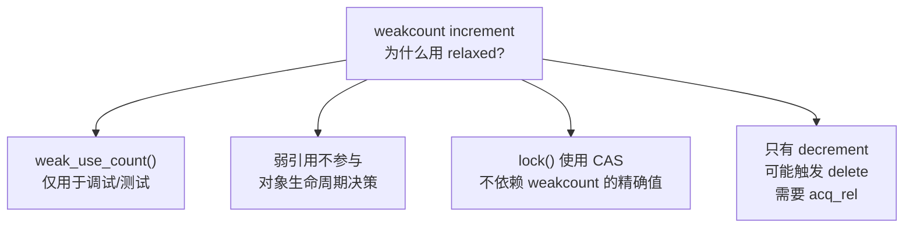

### 4.3 reset_() 中的 weakcount 加载

```cpp
bool should_delete = target_->weakcount_.load(std::memory_order_acquire) == 1;
```

使用 `acquire` 确保看到 `release_resources()` 的所有写操作。

---

## 5. intrusive_ptr — 强引用智能指针

### 5.1 核心结构

```cpp
template <typename TTarget, typename NullType = detail::intrusive_target_default_null_type<TTarget>>
class intrusive_ptr {
  TTarget* target_;
};
```

### 5.2 retain_() — 增加引用

```cpp
void retain_() {
  if (target_ != NullType::singleton()) {
    uint32_t new_refcount = detail::atomic_refcount_increment(target_->refcount_);
    TORCH_INTERNAL_ASSERT_DEBUG_ONLY(
        new_refcount != 1,
        "Cannot increase refcount after it reached zero.");
  }
}
```

断言 refcount 未从 0 变为 1——这意味着试图复活已死亡的对象。

### 5.3 reset_() — 减少引用（核心逻辑）

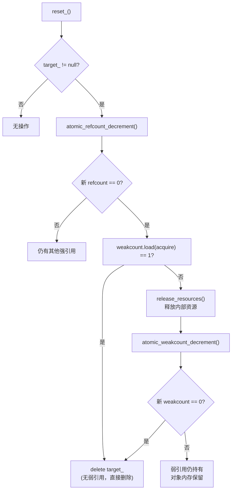

**关键优化**：如果 weakcount == 1（没有弱引用，+1 来自强引用），直接 delete，无需调用 `release_resources()` 或减少 weakcount。

### 5.4 构造函数体系

| 构造方式 | refcount 变化 | 说明 |
|----------|---------------|------|
| `intrusive_ptr(TTarget*)` | 0→1, 0→1 | 新建对象，设置两个计数为 1 |
| 默认/nullptr | — | target_ = null |
| `DontIncreaseRefcount` | — | 不增加引用，用于内部 |
| `unique_ptr` 转换 | 0→1, 0→1 | 接管所有权 |
| 拷贝构造 | +1 | 共享所有权 |
| 移动构造 | 不变 | 转移所有权 |
| 跨类型构造 | +1/不变 | 视拷贝/移动而定 |

### 5.5 从新指针构造

```cpp
explicit intrusive_ptr(TTarget* target) {
  // 断言：新对象的计数必须为 0
  TORCH_INTERNAL_ASSERT_DEBUG_ONLY(
      target_->refcount_ == 0 && target_->weakcount_ == 0);
  // 设置为 1，使用 relaxed（尚无其他线程可以访问）
  target_->refcount_.store(1, std::memory_order_relaxed);
  target_->weakcount_.store(1, std::memory_order_relaxed);
}
```

### 5.6 reclaim 与 release

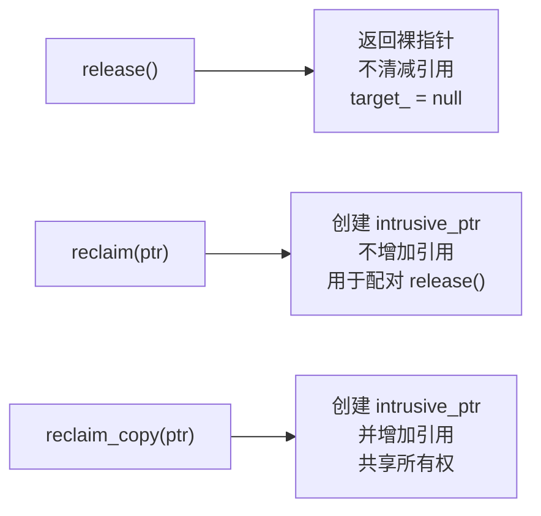

### 5.7 工厂方法

| 方法 | 说明 |
|------|------|
| `make<Args...>(args)` | `new TTarget(args)` + 设置计数为 1 |
| `unsafe_steal_from_new(ptr)` | 从 `new` 表达式接管，pybind11 兼容 |
| `unsafe_adapt_non_heap_allocated(ptr, decrefs)` | 非堆分配对象，设置极大计数 |
| `unsafe_reclaim_from_nonowning(ptr)` | 类似 `enable_shared_from_this` |

---

## 6. weak_intrusive_ptr — 弱引用智能指针

### 6.1 核心结构

```cpp
template <typename TTarget, typename NullType>
class weak_intrusive_ptr {
  TTarget* target_;
};
```

### 6.2 retain_() 与 reset_()

```cpp
void retain_() {
  if (target_ != NullType::singleton()) {
    atomic_weakcount_increment(target_->weakcount_);
    // 断言：weakcount 不能从 0 变为 1（不能复活）
  }
}

void reset_() noexcept {
  if (target_ != NullType::singleton() &&
      atomic_weakcount_decrement(target_->weakcount_) == 0) {
    delete target_;  // 完全死亡
  }
  target_ = NullType::singleton();
}
```

### 6.3 关键方法

| 方法 | 说明 |
|------|------|
| `use_count()` | 返回 **强** 引用计数（非 weakcount） |
| `weak_use_count()` | 返回弱引用计数 |
| `expired()` | `use_count() == 0` |
| `lock()` | CAS 循环提升为强引用 |
| `release()` | 返回裸指针，不减少 weakcount |
| `reclaim(ptr)` | 接管弱指针，不增加 weakcount |

---

## 7. lock() 的 CAS 算法

`lock()` 是弱引用提升为强引用的关键操作，必须处理并发竞态。

### 7.1 算法流程

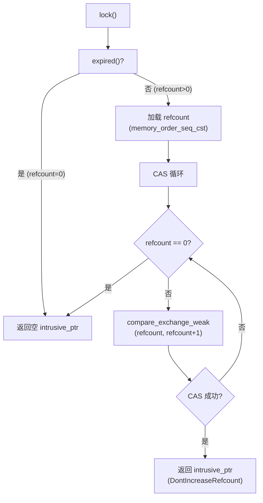

### 7.2 代码详解

```cpp
intrusive_ptr<TTarget, NullType> lock() const noexcept {
  if (expired()) {
    return intrusive_ptr<TTarget, NullType>();  // 快速路径
  }
  auto refcount = target_->refcount_.load(std::memory_order_seq_cst);
  do {
    if (refcount == 0) {
      return intrusive_ptr<TTarget, NullType>();  // 对象已死
    }
  } while (!target_->refcount_.compare_exchange_weak(refcount, refcount + 1));
  return intrusive_ptr<TTarget, NullType>(target_, raw::DontIncreaseRefcount{});
}
```

### 7.3 并发安全性分析

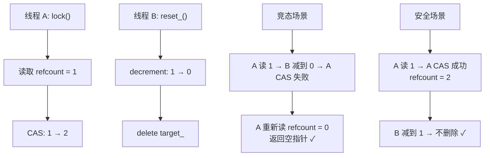

使用 `memory_order_seq_cst`（最强内存序）确保 CAS 操作的全局顺序。

---

## 8. 裸指针操作 — raw 命名空间

raw 命名空间提供不创建智能指针对象的低级操作。

### 8.1 raw::intrusive_ptr

| 函数 | 说明 |
|------|------|
| `incref(ptr)` | 原子增加 refcount（不检查 null） |
| `decref(ptr)` | 创建临时 intrusive_ptr 释放（ptr 之后无效） |
| `make_weak(ptr)` | 从强裸指针创建弱裸指针 |
| `use_count(ptr)` | 读取强引用计数 |

### 8.2 raw::weak_intrusive_ptr

| 函数 | 说明 |
|------|------|
| `incref(ptr)` | 原子增加 weakcount |
| `decref(ptr)` | 创建临时 weak_intrusive_ptr 释放 |
| `lock(ptr)` | 尝试提升为强引用 |
| `use_count(ptr)` | 读取强引用计数 |

### 8.3 使用场景

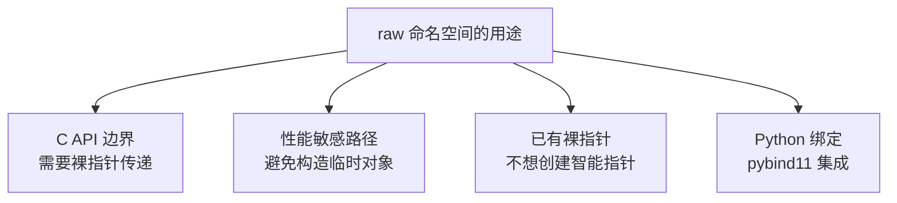

---

## 9. 非堆分配对象适配

### 9.1 unsafe_adapt_non_heap_allocated

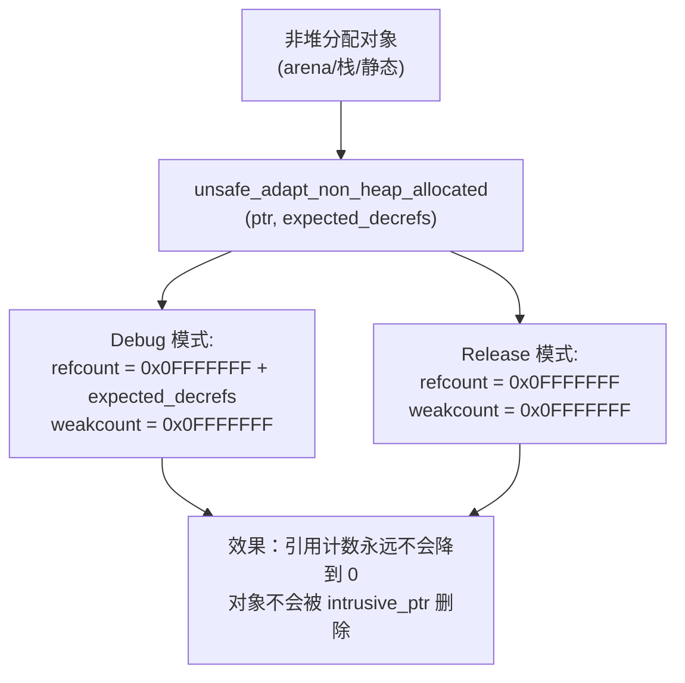

**expected_decrefs 的意义**：在 debug 模式下，追踪预期的减引用次数，确保计数不会降到 `0x0FFFFFFF` 以下（触发断言）。

### 9.2 unsafe_reclaim_from_nonowning

```cpp
static intrusive_ptr unsafe_reclaim_from_nonowning(TTarget* raw_ptr) {
  TORCH_INTERNAL_ASSERT_DEBUG_ONLY(
      raw_ptr->refcount_.load() > 0,
      "Can only reclaim pointers that are owned by someone");
  auto ptr = reclaim(raw_ptr);
  ptr.retain_();
  return ptr;
}
```

类似 `enable_shared_from_this`：从已有所有者的裸指针创建新的强引用。

---

## 10. MaybeOwned 与借用语义

MaybeOwned 提供零开销的借用，避免不必要的引用计数操作。

### 10.1 intrusive_ptr 特化

```cpp
template <typename T>
struct MaybeOwnedTraits<c10::intrusive_ptr<T>> {
  using owned_type = c10::intrusive_ptr<T>;
  using borrow_type = c10::intrusive_ptr<T>;  // 类型相同！
  // 但创建方式不同

  static borrow_type createBorrow(const owned_type& from) {
    return borrow_type::reclaim(from.get());  // 不增加引用计数
  }

  static void destroyBorrow(borrow_type& toDestroy) {
    toDestroy.release();  // 不减少引用计数
  }
};
```

### 10.2 MaybeOwned 内部结构

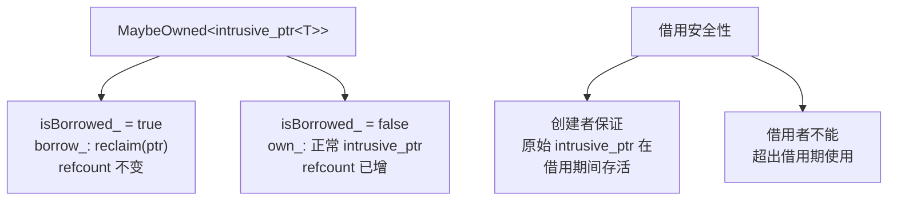

### 10.3 通用 MaybeOwned

对于非 `intrusive_ptr` 类型，借用类型为 `const T*`，增加一层间接：

| 类型 | owned_type | borrow_type | 借用开销 |
|------|------------|-------------|----------|
| `intrusive_ptr<T>` | `intrusive_ptr<T>` | `intrusive_ptr<T>` | 零（reclaim） |
| `shared_ptr<T>` | `shared_ptr<T>` | `const shared_ptr<T>*` | 一层间接 |
| 通用 `T` | `T` | `const T*` | 一层间接 |

---

## 11. ExclusivelyOwned 与独占优化

ExclusivelyOwned 在已知独占所有权时，完全跳过原子引用计数操作。

### 11.1 ExclusivelyOwnedTensorTraits

```cpp
template <typename TensorType>
struct ExclusivelyOwnedTensorTraits {
  static void destroyOwned(TensorType& x) {
    auto* ptr = x.unsafeReleaseTensorImpl();
    // Debug: 断言 refcount == 1 或 0
    // Debug: 设置 refcount = 0, weakcount = 0
    // Release: 直接 delete
    delete ptr;
  }
};
```

### 11.2 优化效果

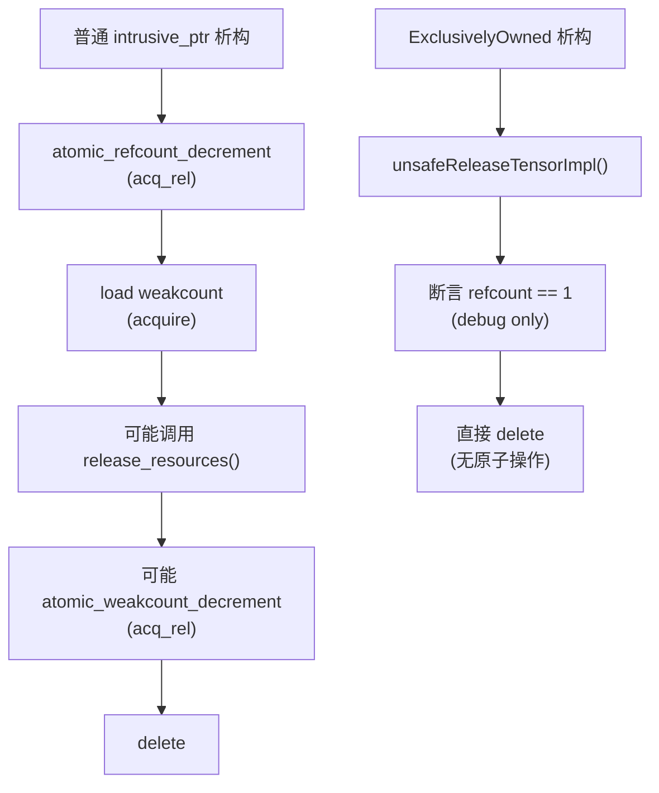

| 操作 | 普通 intrusive_ptr | ExclusivelyOwned |
|------|-------------------|------------------|
| 析构原子操作 | 2-3 次 acq_rel | 0 次 |
| 断言 | 无 | refcount == 1 (debug) |
| delete | 有条件 | 无条件 |

### 11.3 适用场景

- 函数内部的临时张量（确定无其他引用）
- 独占所有权的数据结构（如 MaybeOwned 的 owned 路径）
- 性能敏感的内循环中的临时张量创建/销毁

---

## 12. UniqueVoidPtr — 数据与上下文分离

UniqueVoidPtr 是 DataPtr 的底层组件，解决了数据指针与分配基址不一致的问题。

### 12.1 结构

```cpp
class UniqueVoidPtr {
  void* data_;                                // 非拥有：指向用户关心的数据
  std::unique_ptr<void, DeleterFnPtr> ctx_;   // 拥有：上下文 + 删除器
};
```

### 12.2 关键场景

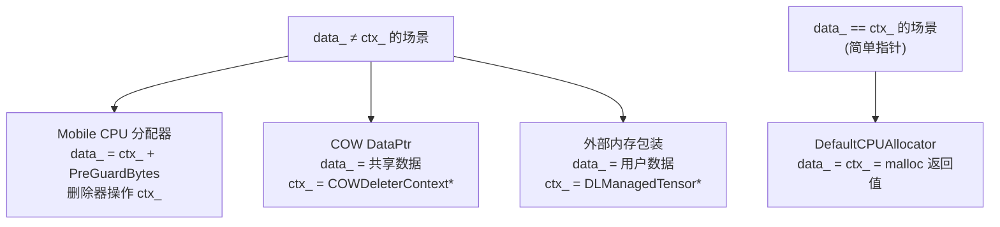

### 12.3 compare_exchange_deleter

```cpp
bool compare_exchange_deleter(DeleterFnPtr expected, DeleterFnPtr new_deleter) {
  if (get_deleter() == expected) {
    ctx_ = std::unique_ptr<void, DeleterFnPtr>(ctx_.release(), new_deleter);
    return true;
  }
  return false;
}
```

原子性地替换删除器，用于 COW 转换：将普通 DataPtr 的 `free_cpu` 替换为 `cow_deleter`。

---

## 13. 对象生命周期完整流程

### 13.1 TensorImpl 生命周期

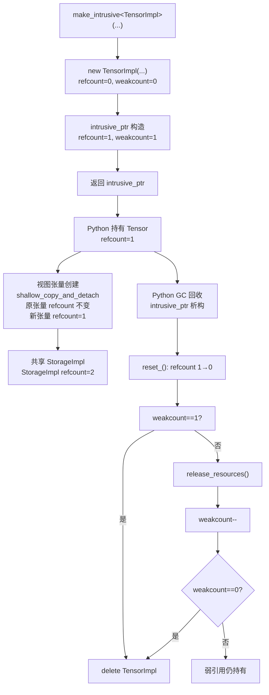

### 13.2 StorageImpl 生命周期

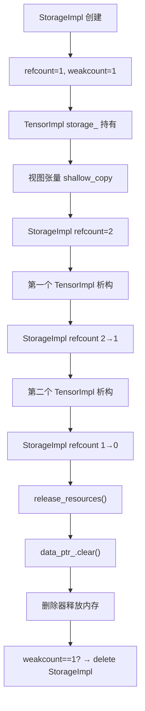

### 13.3 COW StorageImpl 生命周期

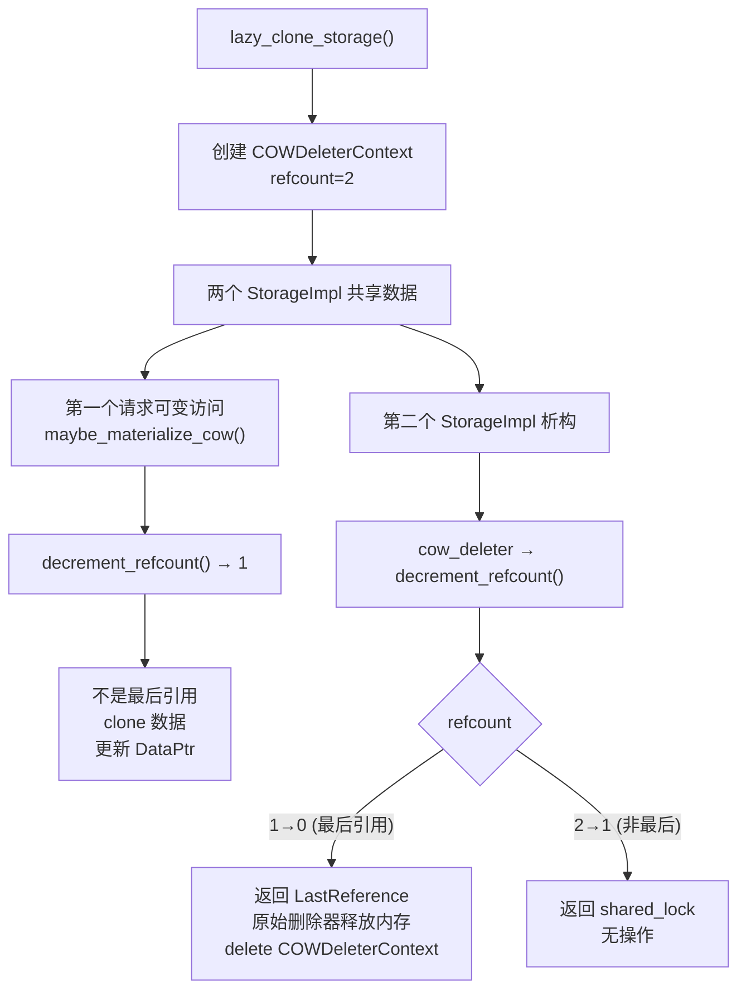

---

## 14. 设计权衡

### 14.1 侵入式 vs 非侵入式引用计数

| 方面 | intrusive_ptr | std::shared_ptr |
|------|--------------|-----------------|
| 控制块 | 内嵌在对象中 | 单独堆分配 |
| 内存开销 | 0（计数已是对象一部分） | ~32 bytes 控制块 |
| 缓存友好性 | 好（计数与数据相邻） | 差（控制块可能远） |
| 析构控制 | release_resources() 可定制 | 析构顺序不可定制 |
| 侵入性 | 必须继承基类 | 任意类型 |
| weak_ptr | 内嵌支持 | 需要控制块 |

### 14.2 双计数器方案

- **收益**：强引用降为 0 时可以释放资源（data_ptr），但弱引用仍可查询
- **代价**：weakcount 比实际弱引用数多 1，增加理解复杂度
- **替代方案**：单计数器 → 无法区分"资源已释放但弱引用仍存在"的状态

### 14.3 MaybeOwned 借用 vs intrusive_ptr 持有

- **借用（reclaim）**：不增加引用计数，零原子操作
- **持有（retain）**：增加引用计数，一次 acq_rel 原子操作
- **安全性**：借用依赖调用者保证生命周期，编译器无法检查
- **适用**：短作用域内的性能敏感路径

### 14.4 ExclusivelyOwned 的前提条件

- **前提**：确定 refcount == 1，无其他引用者
- **风险**：如果前提不满足，直接 delete 导致 use-after-free
- **防护**：Debug 模式断言 refcount == 1
- **收益**：消除 2-3 次原子操作，对频繁创建/销毁临时张量的场景有显著影响

### 14.5 lock() 的 seq_cst 内存序

- **选择**：使用最强内存序 `memory_order_seq_cst`
- **替代**：可用 `acq_rel` + `acquire` 组合
- **原因**：安全优先，lock() 不在热路径上
- **代价**：在弱内存序架构（ARM）上可能产生内存屏障开销

---

## 附录：关键代码行号参考

| 内容 | 文件 | 行号 |
|------|------|------|
| kImpracticallyHugeReferenceCount | `c10/util/intrusive_ptr.h` | 30 |
| intrusive_ptr_target 类 | `c10/util/intrusive_ptr.h` | 60-180 |
| 引用计数方案注释 | `c10/util/intrusive_ptr.h` | 61-81 |
| 析构函数断言 | `c10/util/intrusive_ptr.h` | 99-145 |
| release_resources | `c10/util/intrusive_ptr.h` | 168-179 |
| 原子操作函数 | `c10/util/intrusive_ptr.h` | 182-220 |
| intrusive_ptr 类 | `c10/util/intrusive_ptr.h` | 228-583 |
| retain_() | `c10/util/intrusive_ptr.h` | 270-278 |
| reset_() | `c10/util/intrusive_ptr.h` | 280-300 |
| unsafe_adapt_non_heap_allocated | `c10/util/intrusive_ptr.h` | 541-562 |
| unsafe_reclaim_from_nonowning | `c10/util/intrusive_ptr.h` | 574-582 |
| MaybeOwnedTraits 特化 | `c10/util/intrusive_ptr.h` | 649-680 |
| weak_intrusive_ptr 类 | `c10/util/intrusive_ptr.h` | 685-940 |
| lock() CAS 算法 | `c10/util/intrusive_ptr.h` | 868-884 |
| raw 命名空间 | `c10/util/intrusive_ptr.h` | 987-1057 |
| MaybeOwned 类 | `c10/util/MaybeOwned.h` | 64-235 |
| ExclusivelyOwned 类 | `c10/util/ExclusivelyOwned.h` | 55-138 |
| ExclusivelyOwnedTensorTraits | `c10/util/ExclusivelyOwnedTensorTraits.h` | 12-74 |
| UniqueVoidPtr 类 | `c10/util/UniqueVoidPtr.h` | 41-93 |
