# 07 - native_functions.yaml 算子定义

> native_functions.yaml 是 PyTorch 所有原生算子的主定义文件，
> 是代码生成管线的输入源。torchgen 解析此文件后生成 C++ 分发代码、
> Python 绑定、自动微分公式等，驱动整个算子注册体系。

---

## 目录

1. [架构概览](#1-架构概览)
2. [YAML 条目字段](#2-yaml-条目字段)
3. [函数模式语法](#3-函数模式语法)
4. [类型系统](#4-类型系统)
5. [别名注解](#5-别名注解)
6. [参数分类体系](#6-参数分类体系)
7. [SchemaKind 分类](#7-schemakind-分类)
8. [结构化内核模式](#8-结构化内核模式)
9. [分发键映射](#9-分发键映射)
10. [算子标签 — tags.yaml](#10-算子标签--tagsyaml)
11. [导数定义 — derivatives.yaml](#11-导数定义--derivativesyaml)
12. [代码生成管线](#12-代码生成管线)
13. [数据模型 — torchgen/model.py](#13-数据模型--torchgenmodelpy)
14. [自动生成算子](#14-自动生成算子)
15. [设计权衡](#15-设计权衡)

---

## 1. 架构概览

native_functions.yaml 在代码生成管线中的位置：

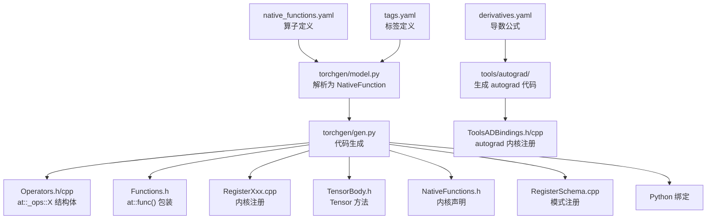

**关键文件索引**：

| 组件 | 文件 |
|------|------|
| 算子定义 | `aten/src/ATen/native/native_functions.yaml` |
| 标签定义 | `aten/src/ATen/native/tags.yaml` |
| 导数定义 | `tools/autograd/derivatives.yaml` |
| 数据模型 | `torchgen/model.py` |
| 代码生成 | `torchgen/gen.py` |
| 生成文件目录 | `tools/generated_dirs.txt` |

---

## 2. YAML 条目字段

每个算子条目是一个 YAML 字典，`func` 字段必填，其余可选：

| 字段 | 类型 | 默认值 | 说明 |
|------|------|--------|------|
| `func` | string | **必填** | 函数模式：`name.overload(args) -> returns` |
| `variants` | string | `"function"` | `"function"`, `"method"`, 或 `"function, method"` |
| `dispatch` | dict | CompositeImplicitAutograd | DispatchKey → 内核函数名映射 |
| `structured` | bool | `False` | 是否为结构化内核（仅 out= 变体） |
| `structured_delegate` | string | `None` | 委托的结构化 out= 变体名 |
| `structured_inherits` | string | `None` | 结构化 meta 函数的基类 |
| `precomputed` | list | `None` | 结构化内核的预计算参数 |
| `ufunc_inner_loop` | dict | `None` | ufunc 向量化代码生成配置 |
| `tags` | string/list | `[]` | 语义标签 |
| `autogen` | string | `""` | 代码生成应产生的算子列表 |
| `device_guard` | bool | `True` | 是否生成 DeviceGuard |
| `device_check` | string | `"ExactSame"` | `"NoCheck"` 或 `"ExactSame"` |
| `manual_kernel_registration` | bool | `False` | 跳过自动内核注册 |
| `manual_cpp_binding` | bool | `False` | 跳过普通 C++ 绑定 |
| `use_const_ref_for_mutable_tensors` | bool | `False` | 可变张量参数用 `const Tensor&` |
| `python_module` | string | `None` | Python 模块位置 |
| `category_override` | string | `None` | 覆盖类别 |
| `cpp_no_default_args` | list | `[]` | 排除默认值的参数名 |

---

## 3. 函数模式语法

### 3.1 基本格式

```
[namespace::]func_name[.overload_name](ArgType arg0[=default], ...) -> ReturnType
```

**解析正则**：
```
(?P<name>[^\(]+)\((?P<args>.*)\) -> (?P<returns>.*)
```

### 3.2 算子名结构

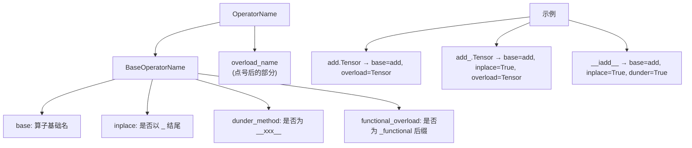

### 3.3 参数语法

```
Type[annotation] name[=default_value]
```

- 位置参数在前，`*` 后为仅关键字参数
- 仅关键字的可变参数自动分类为 out 参数
- 名为 `self` 的参数特殊分类为 SelfArgument

### 3.4 返回语法

| 格式 | 示例 |
|------|------|
| 单一返回 | `Tensor` 或 `Tensor(a!) result` |
| 元组返回 | `(Tensor(a!), Tensor(b!))` |
| 无返回 | `()` |

---

## 4. 类型系统

### 4.1 BaseTy 枚举

| 类别 | 类型 |
|------|------|
| 张量 | `Tensor`, `Tensor?`, `Tensor[]` |
| 整数 | `int`, `int[]`, `int[N]` |
| 浮点 | `float` |
| 布尔 | `bool`, `bool[N]` |
| 字符串 | `str` |
| 标量 | `Scalar`, `ScalarType`, `Layout`, `Device`, `DeviceIndex`, `MemoryFormat`, `QScheme` |
| 生成器 | `Generator?` |
| 维度 | `Dimname`, `DimVector` |
| 其他 | `Storage`, `Stream` |
| 符号 | `SymInt`, `SymBool`, `SymInt[]` |
| 自定义 | `__torch__.torch.classes.XXX` |

### 4.2 类型层次

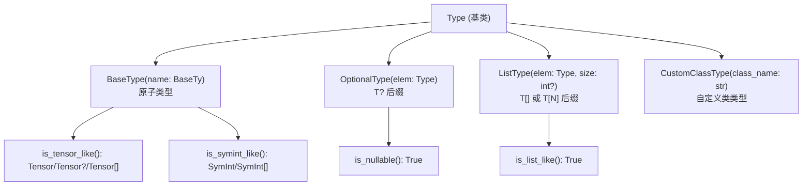

---

## 5. 别名注解

别名注解标注张量参数和返回值之间的内存别名关系。

### 5.1 语法

```
Tensor(a)     — 别名集 a（只读）
Tensor(a!)    — 别名集 a，可能被写入
Tensor(a! -> a|b) — 在集 a 中，写入后在集 a 和 b
Tensor(a -> *) — 进入通配符集（视图操作）
```

### 5.2 解析正则

```
^([a-z])(\|[a-z])*(!?)( -> (\*|[a-z](\|[a-z])*))?$
```

### 5.3 Annotation 数据结构

| 字段 | 类型 | 说明 |
|------|------|------|
| `alias_set` | `tuple[str, ...]` | 输入别名集 |
| `is_write` | `bool` | 是否有 `!` |
| `alias_set_after` | `tuple[str, ...]` | `->` 后的输出别名集 |

### 5.4 典型注解模式

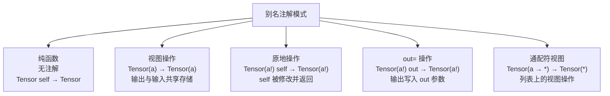

---

## 6. 参数分类体系

Arguments 数据结构将参数精确分类：

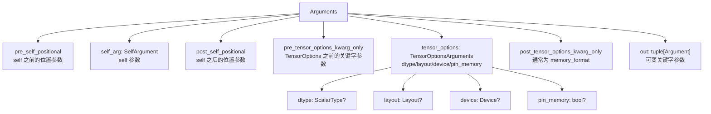

### 6.1 关键属性

| 属性 | 组成 |
|------|------|
| `flat_positional` | pre_self + self + post_self |
| `flat_kwarg_only` | pre_tensor_options + tensor_options + post_tensor_options |
| `flat_non_out` | positional + kwarg_only |
| `flat_all` | 所有参数（含 out） |

### 6.2 自动检测 TensorOptions

当关键字参数按顺序出现 `dtype: ScalarType?`, `layout: Layout?`, `device: Device?`, `pin_memory: bool?` 时，自动识别为 TensorOptionsArguments。

---

## 7. SchemaKind 分类

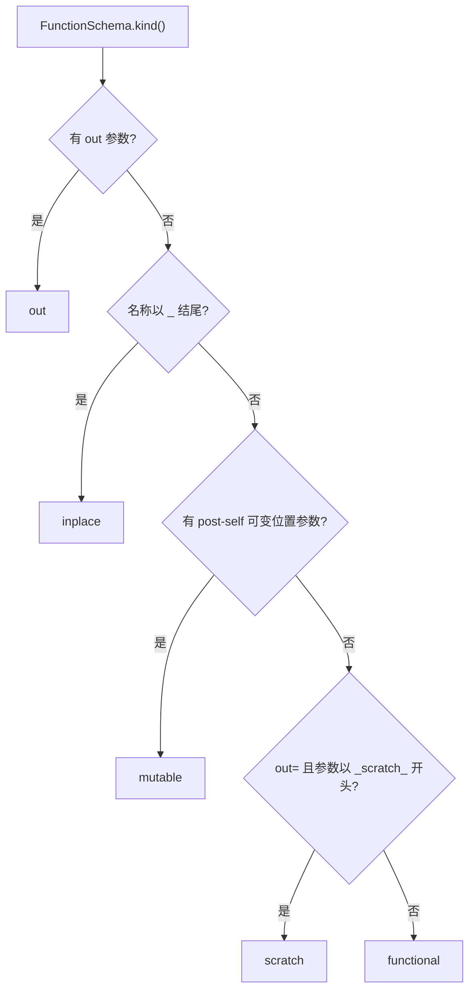

| Kind | 特征 | 示例 |
|------|------|------|
| `functional` | 无 out、无 inplace、无 post-self 可变参数 | `add.Tensor` |
| `inplace` | 名称以 `_` 结尾 | `add_.Tensor` |
| `out` | 有可变关键字参数 | `add.out` |
| `mutable` | 有 post-self 可变位置参数 | 某些特殊算子 |
| `scratch` | out= 变体且参数以 `_scratch_` 开头 | 内部使用 |

---

## 8. 结构化内核模式

结构化内核将 functional/inplace/out 三种变体统一到 out= 变体的单一实现中。

### 8.1 结构化组

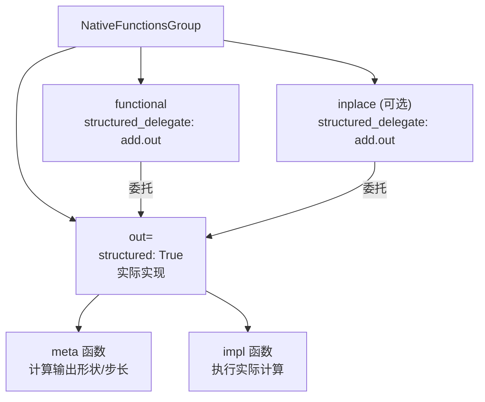

### 8.2 结构化内核示例

```yaml
# functional 变体 - 委托到 out=
- func: add.Tensor(Tensor self, Tensor other, *, Scalar alpha=1) -> Tensor
  structured_delegate: add.out
  dispatch:
    SparseCPU, SparseCUDA: add_sparse

# out= 变体 - 实际实现
- func: add.out(Tensor self, Tensor other, *, Scalar alpha=1, Tensor(a!) out) -> Tensor(a!)
  structured: True
  structured_inherits: TensorIteratorBase
  dispatch:
    CPU: add_out_cpu
    CUDA: add_out_cuda
```

### 8.3 预计算参数

```yaml
- func: cat.out(Tensor[] tensors, int dim=0, *, Tensor(a!) out) -> Tensor(a!)
  structured: True
  precomputed:
  - dim -> int dim, int valid, bool all_contiguous, bool all_same_dtype, bool all_same_sizes_and_stride, MemoryFormat memory_format
```

meta 函数计算 `dim` 的多个派生值，作为预计算参数传递给 impl 函数，避免重复计算。

### 8.4 支持结构化内核的分发键

`STRUCTURED_DISPATCH_KEYS = {CPU, CUDA, MPS, XPU}`

仅这些后端支持结构化内核生成。

---

## 9. 分发键映射

### 9.1 dispatch 字段格式

```yaml
dispatch:
  CPU: kernel_func_name
  CUDA: kernel_func_name
  CompositeExplicitAutograd: kernel_func_name
  SparseCPU, SparseCUDA: shared_kernel_name
```

### 9.2 分发键优先级

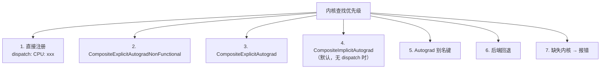

### 9.3 复合键语义

| 复合键 | 行为 |
|--------|------|
| CompositeImplicitAutograd | 所有后端 + 自动 autograd；不需要显式导数公式 |
| CompositeExplicitAutograd | 所有后端但需要显式导数公式 |
| CompositeExplicitAutogradNonFunctional | 同上，但非函数式（分解中产生别名操作） |

### 9.4 无 dispatch 时的默认行为

如果 YAML 条目没有 `dispatch` 字段且不是结构化内核，默认注册到 `CompositeImplicitAutograd`。

---

## 10. 算子标签 — tags.yaml

### 10.1 所有标签

| 标签 | 说明 |
|------|------|
| `inplace_view` | 仅修改张量元数据的原地视图操作 |
| `pt2_compliant_tag` | 保证与 torch.compile/export 兼容（自动添加到所有 aten 算子） |
| `view_copy` | 视图/别名操作的 `_copy` 变体 |
| `dynamic_output_shape` | 输出形状依赖输入张量数据 |
| `data_dependent_output` | 非张量输出依赖张量数据 |
| `generated` | 代码生成自动产生的算子 |
| `nondeterministic_seeded` | 非确定性但由 Generator 控制 |
| `nondeterministic_bitwise` | 不保证跨运行位级等价 |
| `needs_fixed_stride_order` | Inductor 必须保留 eager 步长顺序 |
| `flexible_layout` | 接受不同步长/storage_offset |
| `core` | Core ATen 算子子集 |
| `pointwise` | 输出元素从对应广播输入元素计算 |
| `maybe_aliasing_or_mutating` | 无法静态确定是否函数式 |

### 10.2 互斥关系

`needs_fixed_stride_order` 和 `flexible_layout` 互斥——最严格的胜出。

### 10.3 自动标注

所有 `aten::` 命名空间算子自动获得 `pt2_compliant_tag`。包含 "rand"/"dropout" 的算子名或有 Generator 参数的算子自动获得 `nondeterministic_seeded`。

---

## 11. 导数定义 — derivatives.yaml

### 11.1 条目格式

```yaml
- name: add.Tensor(Tensor self, Tensor other, *, Scalar alpha=1) -> Tensor
  self: handle_r_to_c(self.scalar_type(), grad)
  other: handle_r_to_c(other.scalar_type(), maybe_multiply(grad, alpha.conj()))
  result: self_t + maybe_multiply(other_t, alpha)
```

### 11.2 梯度表达式变量

| 变量 | 含义 |
|------|------|
| `grad` | 第一个可微输出的梯度 |
| `grads[i]` | 第 i 个可微输出的梯度 |
| `grad_{name}` | 命名输出的梯度 |
| `grad_input_mask` | `std::array<bool, n>` 指示哪些输入需要梯度 |
| 输入参数名 | 前向传播的值 |
| `result` / `resultX` | 前向传播结果 |

### 11.3 分发特定导数

```yaml
- name: chunk(Tensor(a -> *) self, int chunks, int dim=0) -> Tensor(a)[]
  dispatch:
    Default:
      self: not_implemented("chunk")
    AutogradNestedTensor:
      self: chunk_backward_nested(grads, self, chunks, dim)
```

### 11.4 约定

- 原地变体默认使用非原地导数定义
- `_out` 变体不可微
- `not_implemented("func")` 标记未实现但计划中的导数
- 线性函数可使用 `auto_linear`，逐元素函数可使用 `auto_element_wise`
- 多输出函数使用 `output_differentiability` 指定哪些输出可微

---

## 12. 代码生成管线

### 12.1 解析流程

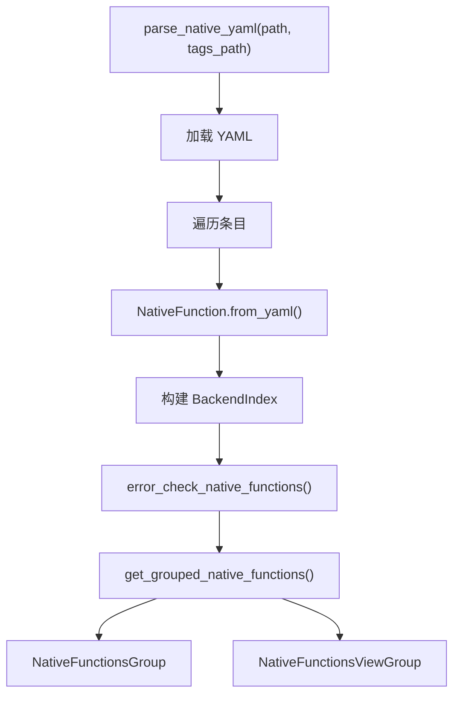

### 12.2 生成的文件

| 文件 | 生成器 | 说明 |
|------|--------|------|
| `Operators.h/cpp` | ComputeOperators | `at::_ops::X` 结构体 |
| `Functions.h` | ComputeFunction | `at::func()` 内联包装 |
| `TensorBody.h` | ComputeTensorMethod | `Tensor::method()` |
| `NativeFunctions.h` | — | 内核函数声明 |
| `RegisterXxx.cpp` | — | 每个分发键的内核注册 |
| `RegisterSchema.cpp` | RegisterSchema | 模式注册 `m.def()` |
| `RegisterBackendSelect.cpp` | ComputeBackendSelect | 工厂函数后端选择 |
| `UfuncCPU/CUDA` | — | ufunc 向量化内核 |

### 12.3 ComputeOperators 生成的结构体

```cpp
namespace at::_ops {
struct add_Tensor final {
  using schema = Tensor(const Tensor&, const Tensor&, const Scalar&);
  static constexpr auto name = "add";
  static constexpr auto overload_name = "Tensor";
  static constexpr auto schema_str = "add.Tensor(Tensor self, Tensor other, *, Scalar alpha=1) -> Tensor";
  C10_ALWAYS_INLINE static Tensor call(const Tensor& self, const Tensor& other, const Scalar& alpha);
  C10_ALWAYS_INLINE static Tensor redispatch(DispatchKeySet, const Tensor& self, const Tensor& other, const Scalar& alpha);
};
}
```

---

## 13. 数据模型 — torchgen/model.py

### 13.1 核心数据结构

| 类 | 说明 |
|-----|------|
| `NativeFunction` | 完整算子定义，包含所有 YAML 字段 |
| `FunctionSchema` | 函数模式：名称 + 参数 + 返回 |
| `Arguments` | 分类后的参数集合 |
| `Argument` | 单个参数：名称、类型、默认值、别名注解 |
| `Return` | 返回值：名称、类型、别名注解 |
| `OperatorName` | 算子名：BaseOperatorName + overload_name |
| `BaseOperatorName` | 基础名 + inplace/dunder/functional 标志 |
| `Annotation` | 别名注解：alias_set + is_write + alias_set_after |
| `Type` | 类型层次：BaseType/OptionalType/ListType/CustomClassType |
| `BackendMetadata` | 后端元数据：内核名 + 结构化标志 + 命名空间 |
| `BackendIndex` | 后端索引：DispatchKey → OperatorName → BackendMetadata |
| `NativeFunctionsGroup` | 算子变体组：functional + inplace + mutable + out |
| `NativeFunctionsViewGroup` | 视图组：view + view_copy + view_inplace |
| `UfuncInnerLoop` | Ufunc 配置：名称 + 支持的 dtype + ufunc_key |
| `Precompute` | 预计算参数定义 |

### 13.2 BackendIndex

```python
@dataclass(frozen=True)
class BackendIndex:
    dispatch_key: DispatchKey
    use_out_as_primary: bool       # True for in-tree
    device_guard: bool              # True for CUDA/XPU
    external: bool                  # True for out-of-tree (XLA)
    index: dict[OperatorName, BackendMetadata]
```

### 13.3 NativeFunctionsViewGroup

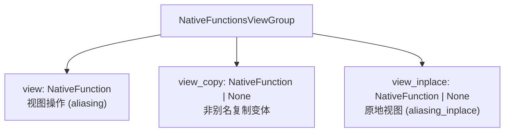

非 CompositeImplicitAutograd 的视图操作自动生成 `_copy` 变体。

---

## 14. 自动生成算子

### 14.1 autogen 字段

```yaml
- func: convolution(...)
  autogen: convolution.out
```

指定代码生成应产生的算子变体：

| 源变体 | 自动生成 |
|--------|----------|
| inplace | functional + out= |
| functional | out= |

### 14.2 自动生成流程

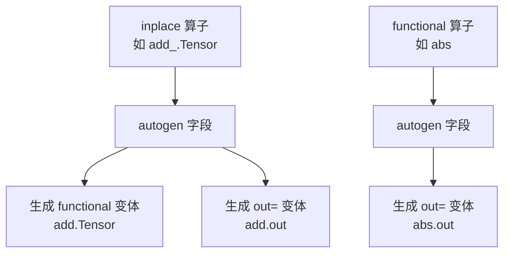

自动生成的算子获得 `generated` 标签，其签名从源算子推导。

---

## 15. 设计权衡

### 15.1 单一 YAML 作为唯一真相源

- **收益**：所有算子定义集中管理，避免 C++/Python/文档不一致
- **代价**：YAML 格式有时不够灵活，复杂模式需要用字符串约定
- **替代方案**：每个算子单独定义 → 难以全局审查和验证

### 15.2 结构化内核 vs 非结构化

- **结构化**：functional/inplace/out 统一实现，减少代码重复
- **非结构化**：每种变体独立实现，灵活性更高
- **权衡**：结构化要求后端支持，仅 CPU/CUDA/MPS/XPU 可用

### 15.3 CompositeImplicitAutograd 默认

- **收益**：简单算子无需为每个后端写实现，自动推导 autograd
- **代价**：性能可能不如专用后端实现
- **风险**：CompositeImplicitAutograd 与后端特定内核冲突时产生歧义

### 15.4 别名注解的字符串约定

- **收益**：YAML 中紧凑表达，人类可读
- **代价**：解析复杂，正则表达式脆弱
- **替代方案**：结构化 YAML 字段 → 更冗长但更安全

---

## 附录：关键代码行号参考

| 内容 | 文件 | 行号 |
|------|------|------|
| YAML 条目解析 | `torchgen/model.py` | 598-961 |
| FunctionSchema | `torchgen/model.py` | 1388-1759 |
| Arguments | `torchgen/model.py` | 2170-2476 |
| Annotation | `torchgen/model.py` | 1770-1819 |
| Type 系统 | `torchgen/model.py` | 1828-2001 |
| OperatorName | `torchgen/model.py` | 2596-2647 |
| BaseOperatorName | `torchgen/model.py` | 2502-2591 |
| NativeFunction | `torchgen/model.py` | 480-1091 |
| NativeFunctionsGroup | `torchgen/model.py` | 1107-1221 |
| BackendMetadata | `torchgen/model.py` | 1224-1245 |
| BackendIndex | `torchgen/model.py` | 1275-1333 |
| SchemaKind | `torchgen/model.py` | 1093-1098 |
| 代码生成主函数 | `torchgen/gen.py` | 2758-3063 |
| ComputeOperators | `torchgen/gen.py` | 606-694 |
| ComputeFunction | `torchgen/gen.py` | 699-742 |
| ComputeTensorMethod | `torchgen/gen.py` | 747-787 |
| ComputeBackendSelect | `torchgen/gen.py` | 966-1025 |
| tags.yaml | `aten/src/ATen/native/tags.yaml` | 全文件 |
| derivatives.yaml | `tools/autograd/derivatives.yaml` | 全文件 |
