# 08 - KernelFunction 与算子调用

> KernelFunction 是 PyTorch 调度器中内核函数的类型擦除包装，
> 支持装箱(boxed)和未装箱(unboxed)两种调用模式。
> 算子调用经过 Dispatcher 查找对应的 KernelFunction，
> 在热路径上实现零开销的间接函数调用。

---

## 目录

1. [架构概览](#1-架构概览)
2. [KernelFunction — 内核函数包装](#2-kernelfunction--内核函数包装)
3. [BoxedKernel — 装箱内核](#3-boxedkernel--装箱内核)
4. [装箱与未装箱调用](#4-装箱与未装箱调用)
5. [热路径调用流程](#5-热路径调用流程)
6. [OperatorEntry — 分发表与内核查找](#6-operatorentry--分发表与内核查找)
7. [分发表计算规则](#7-分发表计算规则)
8. [Dispatcher — 调度器](#8-dispatcher--调度器)
9. [内核注册流程](#9-内核注册流程)
10. [直通与哨兵内核](#10-直通与哨兵内核)
11. [TypedOperatorHandle — 类型安全的算子句柄](#11-typedoperatorhandle--类型安全的算子句柄)
12. [CppSignature — C++ 签名验证](#12-cppsignature--c-签名验证)
13. [DispatchKeyExtractor — 键集提取](#13-dispatchkeyextractor--键集提取)
14. [SymInt 分发处理](#14-symint-分发处理)
15. [设计权衡](#15-设计权衡)

---

## 1. 架构概览

算子调用的完整路径：

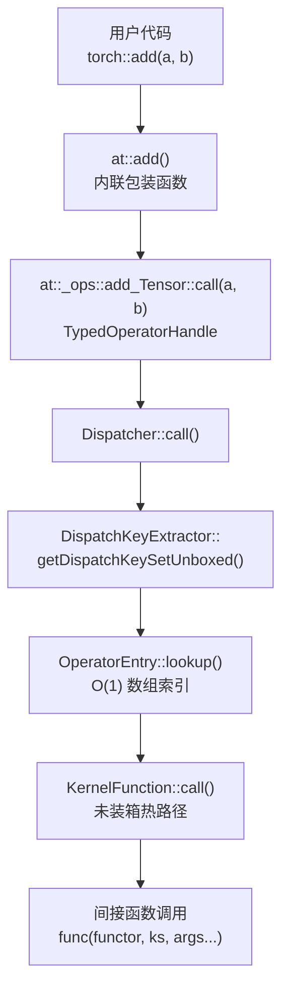

**关键文件索引**：

| 组件 | 文件 |
|------|------|
| KernelFunction | `aten/src/ATen/core/boxing/KernelFunction.h`, `_impl.h`, `.cpp` |
| BoxedKernel | `aten/src/ATen/core/boxing/BoxedKernel.h`, `_impl.h` |
| OperatorEntry | `aten/src/ATen/core/dispatch/OperatorEntry.h`, `.cpp` |
| Dispatcher | `aten/src/ATen/core/dispatch/Dispatcher.h`, `.cpp` |
| DispatchKeyExtractor | `aten/src/ATen/core/dispatch/DispatchKeyExtractor.h` |
| CppSignature | `aten/src/ATen/core/dispatch/CppSignature.h` |
| OperatorHandle | `aten/src/ATen/core/dispatch/Dispatcher.h` |

---

## 2. KernelFunction — 内核函数包装

KernelFunction 类似 `std::function`，但专门为内核函数优化，支持装箱和未装箱两种模式。

### 2.1 私有数据成员

```cpp
class KernelFunction final {
  BoxedKernel boxed_kernel_func_;     // 装箱内核（始终有效）
  void* unboxed_kernel_func_;         // 未装箱函数指针（可能为 null）
  void* sym_unboxed_kernel_func_;     // SymInt 版未装箱指针（可能为 null）
};
```

### 2.2 有效性检查

| 方法 | 条件 |
|------|------|
| `isValidUnboxed()` | `unboxed_kernel_func_ != nullptr` |
| `isValidSymUnboxed()` | `sym_unboxed_kernel_func_ != nullptr` |
| `isValid()` | 装箱内核有效（函数指针非 null） |
| `isFallthrough()` | 装箱指针 == `&fallthrough_kernel` |

### 2.3 静态工厂方法

| 方法 | 说明 |
|------|------|
| `makeFromBoxedKernel(BoxedKernel)` | 仅装箱内核，两个未装箱指针为 null |
| `makeFromBoxedFunction<func>()` | 编译时已知的装箱函数指针 |
| `makeFromUnboxedFunctor(functor)` | 核心：从 functor 创建，同时设置装箱和未装箱指针 |
| `makeFromBoxedFunctor(functor)` | 仅装箱的 functor |
| `makeFromUnboxedFunction<TORCH_FN(f)>()` | 从编译时函数指针创建 |
| `makeFromUnboxedRuntimeFunction(f*)` | 从运行时函数指针创建 |
| `makeFromUnboxedLambda(lambda)` | 从 lambda 创建 |
| `makeFallthrough()` | 直通哨兵内核 |
| `makeAmbiguousAutogradOther()` | 歧义 AutogradOther 哨兵 |
| `makeNamedNotSupported()` | 命名张量不支持哨兵 |

### 2.4 makeFromUnboxedFunctor — 核心工厂

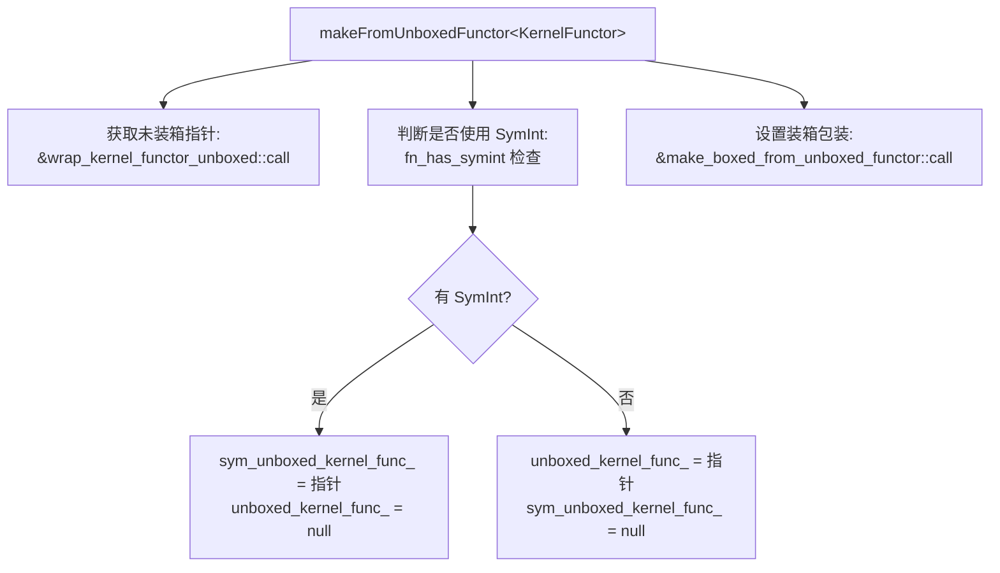

**关键设计**：SymInt 和非 SymInt 内核互斥——同一个 KernelFunction 只能是其中之一。

---

## 3. BoxedKernel — 装箱内核

BoxedKernel 是仅装箱的内核包装，KernelFunction 内部使用它。

### 3.1 类型别名

```cpp
using InternalBoxedKernelFunction =
    void(OperatorKernel*, const OperatorHandle&, DispatchKeySet, Stack*);
using BoxedKernelFunction =
    void(const OperatorHandle&, Stack*);
using BoxedKernelFunction_withDispatchKeys =
    void(const OperatorHandle&, DispatchKeySet, Stack*);
```

### 3.2 私有成员

```cpp
class BoxedKernel {
  c10::intrusive_ptr<OperatorKernel> functor_;            // 内核 functor（引用计数）
  InternalBoxedKernelFunction* boxed_kernel_func_;        // 装箱函数指针
};
```

### 3.3 callBoxed — 装箱调用

```cpp
void callBoxed(const OperatorHandle& opHandle,
               DispatchKeySet dispatchKeySet,
               Stack* stack) const {
  (*boxed_kernel_func_)(functor_.get(), opHandle, dispatchKeySet, stack);
}
```

直接的间接函数调用——通过函数指针调用，传递 functor、操作句柄、键集和栈。

### 3.4 makeFromFunctor — 类型擦除

```cpp
template <class KernelFunctor>
static BoxedKernel makeFromFunctor(std::unique_ptr<KernelFunctor> kernelFunctor) {
  return BoxedKernel(std::move(kernelFunctor),
    [](OperatorKernel* kernel, const OperatorHandle& op,
       DispatchKeySet ks, Stack* stack) {
      (*static_cast<KernelFunctor*>(kernel))(op, ks, stack);
    });
}
```

通过 lambda 将 `OperatorKernel*` 向下转型为具体 functor 类型，实现类型擦除。

---

## 4. 装箱与未装箱调用

### 4.1 对比

| 方面 | 未装箱 (Unboxed) | 装箱 (Boxed) |
|------|-------------------|--------------|
| 调用签名 | `Return(OperatorKernel*, DispatchKeySet, Args...)` | `void(OperatorKernel*, OperatorHandle&, DispatchKeySet, Stack*)` |
| 性能 | 快：直接间接调用 | 慢：需要装箱/拆箱 |
| 可用性 | 可能为 null | 始终有效 |
| 创建方式 | `makeFromUnboxedFunctor/Function/Lambda` | `makeFromBoxedFunction/Functor/Kernel` |
| 回退 | 如果为 null，回退到装箱 | 始终工作 |
| 分发表检查 | `isValidUnboxed()` 优先 | `isValid()` 次选 |

### 4.2 调用路径决策

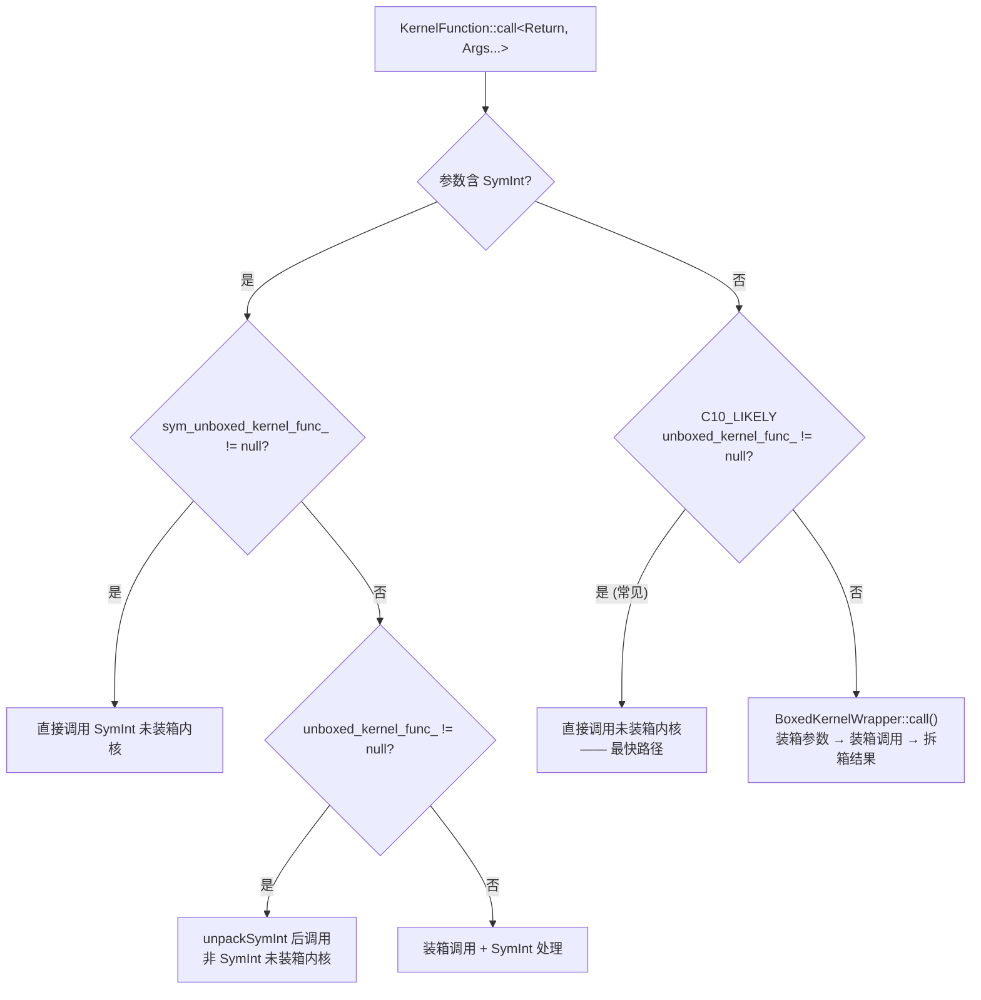

---

## 5. 热路径调用流程

### 5.1 未装箱热路径

```cpp
template <class Return, class... Args>
C10_ALWAYS_INLINE Return call(
    const OperatorHandle& opHandle,
    DispatchKeySet dispatchKeySet,
    Args... args) const {
  // 常见路径：直接调用未装箱函数指针
  if (C10_LIKELY(unboxed_kernel_func_ != nullptr)) {
    return callUnboxedKernelFunction<Return, Args...>(
        unboxed_kernel_func_, functor_.get(), dispatchKeySet,
        std::forward<Args>(args)...);
  }
  // 回退：装箱调用
  return impl::BoxedKernelWrapper<Return(Args...)>::call(
      boxed_kernel_func_, functor_.get(), opHandle, dispatchKeySet,
      std::forward<Args>(args)...);
}
```

### 5.2 callUnboxedKernelFunction — 终极热路径

```cpp
template <class Return, class... Args>
inline Return callUnboxedKernelFunction(
    void* unboxed_kernel_func,
    OperatorKernel* functor,
    DispatchKeySet dispatchKeySet,
    Args&&... args) {
  using ActualSignature = Return(OperatorKernel*, DispatchKeySet, Args...);
  ActualSignature* func = reinterpret_cast<ActualSignature*>(unboxed_kernel_func);
  return (*func)(functor, dispatchKeySet, std::forward<Args>(args)...);
}
```

类型擦除的间接函数调用：将 `void*` 重新解释为具体签名，然后直接调用。

### 5.3 热路径总开销


**总成本**：1 次 TLS 读取 + 位运算 + 1 次数组索引 + 1 次间接调用。无装箱、无分配、无互斥锁。

---

## 6. OperatorEntry — 分发表与内核查找

OperatorEntry 存储每个算子的分发表和注册的内核。

### 6.1 核心数据成员

```cpp
class OperatorEntry {
  OperatorName name_;
  std::optional<AnnotatedSchema> schema_;
  std::vector<at::Tag> tags_;

  // 分发表 — 热路径使用
  std::array<KernelFunction, c10::num_runtime_entries> dispatchTable_;

  DispatchKeyExtractor dispatchKeyExtractor_;
  c10::PyHandleCache py_cache_;

  // 内核注册表 — 冷路径使用
  ska::flat_hash_map<DispatchKey, AnnotatedKernelContainer> kernels_;

  // C++ 签名验证
  std::optional<CppSignatureWithDebug> cpp_signature_;
  std::optional<CppSignatureWithDebug> sym_cpp_signature_;
};
```

### 6.2 lookup() — 热路径内核查找

```cpp
const KernelFunction& lookup(DispatchKeySet ks) const {
  const auto idx = ks.getDispatchTableIndexForDispatchKeySet();
  if (C10_UNLIKELY(idx == -1)) {
    reportError(ks.highestPriorityTypeId());
  }
  const auto& kernel = dispatchTable_[idx];
  if (C10_UNLIKELY(!kernel.isValidUnboxed())) {
    if (!kernel.isValid()) {
      reportError(ks.highestPriorityTypeId());
    }
  }
  return kernel;
}
```

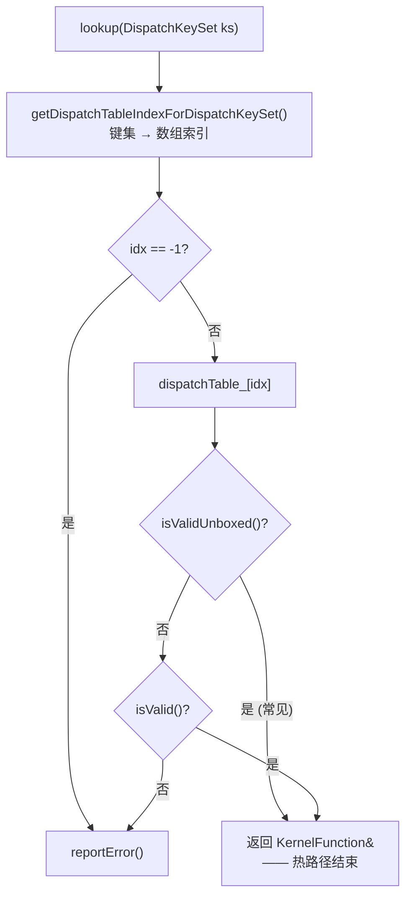

**关键**：先检查 `isValidUnboxed()`（常见路径），仅失败时才检查 `isValid()`。返回 const 引用，零拷贝。

### 6.3 两级存储

| 存储 | 类型 | 用途 |
|------|------|------|
| `dispatchTable_` | `array<KernelFunction, N>` | 热路径 O(1) 查找，缓存友好 |
| `kernels_` | `flat_hash_map<DK, list<AnnotatedKernel>>` | 冷路径注册/反注册，保留所有版本 |

**不变量**：`dispatchTable_[dk] == kernels_[dk].front().kernel`（对于有直接注册的键）。

---

## 7. 分发表计算规则

当内核注册/反注册时，分发表需要重新计算。`computeDispatchTableEntryWithDebug` 实现了优先级规则：

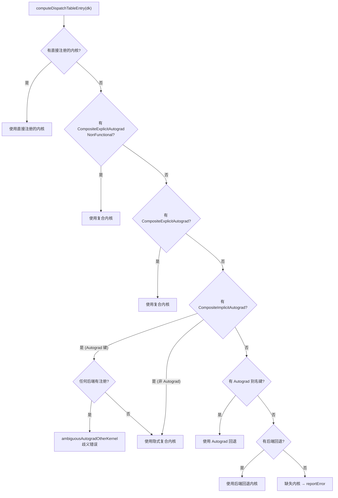

### 7.1 更新策略

| 方法 | 范围 | 触发时机 |
|------|------|----------|
| `updateDispatchTableEntry_` | 单个键 | 内核注册/反注册 |
| `updateDispatchTable_` | 单键 + 关联运行时键 + 别名传播 | 内核注册/反注册 |
| `updateDispatchTableFull_` | 所有条目 | 初始化、后端回退变更 |

---

## 8. Dispatcher — 调度器

Dispatcher 是全局单例，管理所有算子的注册和调度。

### 8.1 核心成员

```cpp
class Dispatcher final {
  std::list<OperatorDef> operators_;
  LeftRight<ska::flat_hash_map<OperatorName, OperatorHandle>> operatorLookupTable_;
  std::array<impl::AnnotatedKernel, num_runtime_entries> backendFallbackKernels_;
  std::unique_ptr<detail::RegistrationListenerList> listeners_;
  std::shared_ptr<Guard> guard_;
};
```

### 8.2 单例访问

```cpp
static Dispatcher& singleton();  // C10_ALWAYS_INLINE，缓存引用
```

非移动端：函数局部静态缓存，零开销。移动端：始终调用 `realSingleton()` 避免代码膨胀。

### 8.3 OperatorDef

```cpp
struct OperatorDef final {
  impl::OperatorEntry op;
  size_t def_count = 0;           // def() 注册计数
  size_t def_and_impl_count = 0;  // def() + impl() 注册计数
};
```

`operatorLookupTable_` 使用 `LeftRight` 数据结构：无锁读取，排他写入。

---

## 9. 内核注册流程

### 9.1 registerDef — 模式注册

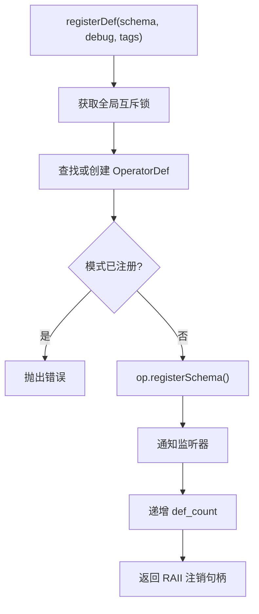

### 9.2 registerImpl — 内核注册

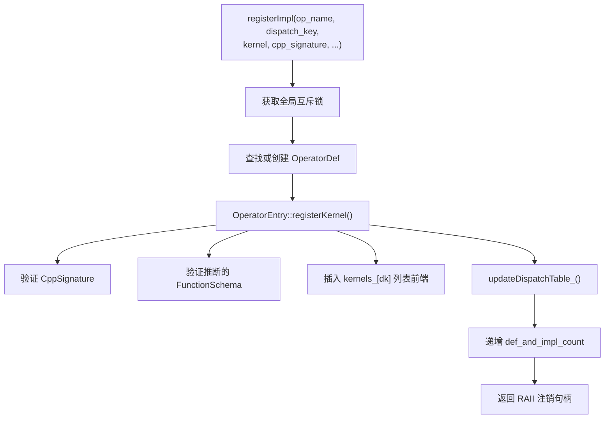

### 9.3 registerFallback — 后端回退注册

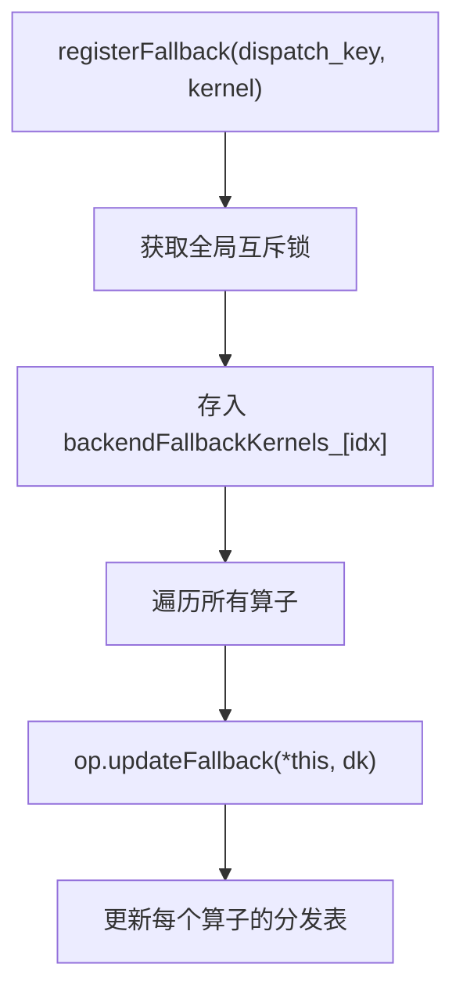

**代价**：后端回退注册需要更新所有算子的分发表，是 O(N) 操作。

---

## 10. 直通与哨兵内核

### 10.1 Fallthrough 内核

```cpp
void fallthrough_kernel(OperatorKernel*, const OperatorHandle&,
                        DispatchKeySet, Stack*) {
  TORCH_INTERNAL_ASSERT(0,
    "fallthrough_kernel was executed but it should have been "
    "short-circuited by the dispatcher...");
}
```

**永远不会被执行**。调度器检测到 fallthrough 后跳过该键，自动查找下一个优先级更低的键。

检测方式：`boxed_kernel_func_ == &fallthrough_kernel`（指针比较，极快）。

### 10.2 歧义 AutogradOther 内核

```cpp
void ambiguous_autogradother_kernel(...) {
  TORCH_INTERNAL_ASSERT(0,
    op.operator_name(),
    " has kernels registered to both CompositeImplicitAutograd "
    "and a backend mapped to AutogradOther...");
}
```

当 CompositeImplicitAutograd 和后端特定内核同时存在时，AutogradOther 无法确定使用哪个，报错。

### 10.3 命名张量不支持内核

```cpp
void named_not_supported_kernel(...) {
  TORCH_CHECK(0, op.operator_name(),
    " is not yet supported with named tensors...");
}
```

### 10.4 直通键与 DispatchKeyExtractor

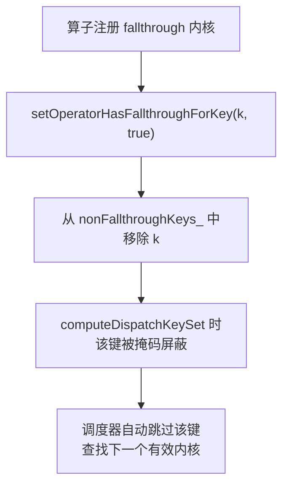

---

## 11. TypedOperatorHandle — 类型安全的算子句柄

### 11.1 OperatorHandle

```cpp
class OperatorHandle {
  Dispatcher::OperatorDef* operatorDef_;
  std::list<Dispatcher::OperatorDef>::iterator operatorIterator_;
};
```

### 11.2 TypedOperatorHandle

```cpp
template <class Return, class... Args>
class TypedOperatorHandle<Return(Args...)> final : public OperatorHandle {
  C10_ALWAYS_INLINE Return call(Args... args) const {
    return c10::Dispatcher::singleton().call<Return, Args...>(
        *this, std::forward<Args>(args)...);
  }
  C10_ALWAYS_INLINE Return redispatch(
      DispatchKeySet currentDispatchKeySet, Args... args) const {
    return c10::Dispatcher::singleton().redispatch<Return, Args...>(
        *this, currentDispatchKeySet, std::forward<Args>(args)...);
  }
};
```

`call()` 是 `C10_ALWAYS_INLINE`，直接转发到 `Dispatcher::call()`。

### 11.3 类型转换

```cpp
OperatorHandle::typed<Return(Args...)>()
```

通过 `assertSignatureIsCorrect<FuncType>()` 验证 C++ 签名与注册签名一致，然后创建 `TypedOperatorHandle`。

---

## 12. CppSignature — C++ 签名验证

### 12.1 机制

```cpp
class CppSignature {
  std::type_index signature_;  // RTTI 类型信息
};
```

### 12.2 两阶段比较

```cpp
bool operator==(const CppSignature& lhs, const CppSignature& rhs) {
  // 快速路径：type_index 相等（RTLD_GLOBAL 时有效）
  if (lhs.signature_ == rhs.signature_) return true;
  // 慢速路径：strcmp 类型名（RTLD_GLOBAL 缺失时）
  if (0 == strcmp(lhs.signature_.name(), rhs.signature_.name())) return true;
  return false;
}
```

### 12.3 签名规范化

```cpp
template <class FuncType>
static CppSignature make() {
  using decayed = remove_DispatchKeySet_arg_from_func<std::decay_t<FuncType>>::func_type;
  return CppSignature(std::type_index(typeid(decayed)));
}
```

移除 `DispatchKeySet` 首参数，将 functor/lambda/函数指针统一为纯函数类型。

---

## 13. DispatchKeyExtractor — 键集提取

### 13.1 computeDispatchKeySet 核心公式

```
最终键集 = ((张量键集 | TLS包含) - TLS排除) & 非直通掩码
```

```cpp
inline DispatchKeySet computeDispatchKeySet(
    DispatchKeySet ks, DispatchKeySet key_mask) {
  c10::impl::LocalDispatchKeySet local = c10::impl::tls_local_dispatch_key_set();
  return (((ks | local.included_) - local.excluded_) & key_mask);
}
```

### 13.2 MultiDispatchKeySet — 参数遍历

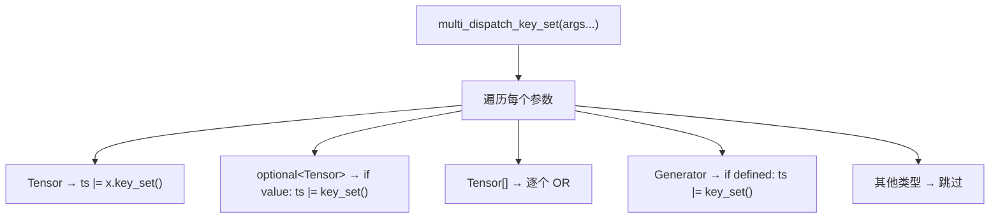

### 13.3 非直通键掩码

```cpp
c10::utils::bitset dispatch_arg_indices_reverse_;  // 张量参数位置
DispatchKeySet nonFallthroughKeys_;                 // 单一掩码（快速路径）
std::array<DispatchKeySet, num_backends> nonFallthroughKeysPerBackend_;  // 每后端掩码
bool requiresBitsetPerBackend_;                     // 是否需要慢路径
```

- **快速路径**：所有后端直通状态相同时，使用单一 `nonFallthroughKeys_`
- **慢速路径**：不同后端直通状态不同时，使用 `nonFallthroughKeysPerBackend_[backend_idx]`

---

## 14. SymInt 分发处理

### 14.1 SymInt 类型特征

```cpp
has_symint<T>       // T 是否为 SymInt/SymIntArrayRef/OptionalSymIntArrayRef
remove_symint<T>    // SymInt → int64_t, SymIntArrayRef → IntArrayRef
fn_has_symint<T>    // 函数类型是否含 SymInt 参数
fn_remove_symint<T> // 移除函数签名中的 SymInt
```

### 14.2 SymInt 调用路径

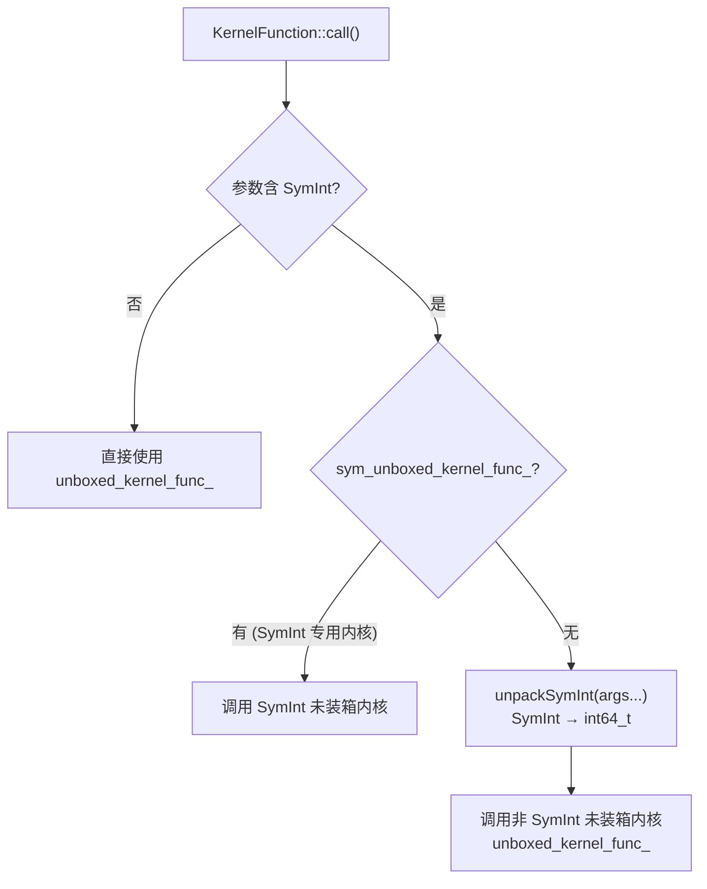

**unpackSymInt**：将 `SymInt` 转换为 `int64_t`（断言是具体值），然后调用非 SymInt 版本的内核。

---

## 15. 设计权衡

### 15.1 未装箱优先策略

- **收益**：热路径零装箱开销，直接间接调用
- **代价**：每个 KernelFunction 额外存储 2 个 `void*`（16 bytes）
- **数据**：绝大多数算子调用走未装箱路径

### 15.2 分发表 vs 哈希表

- **分发表**（当前）：`array<KernelFunction, N>`，O(1) 索引，缓存友好
- **哈希表**：更灵活，但查找有额外开销
- **代价**：分发表约 131 个槽位 × ~40 bytes = ~5KB 每算子

### 15.3 直通键掩码优化

- **收益**：跳过不需要的调度层，减少无效查找
- **代价**：每次 fallthrough 注册变更时需更新掩码
- **慢路径**：每后端掩码增加复杂度，仅在必要时启用

### 15.4 全局互斥锁

- **当前**：所有注册操作获取全局互斥锁
- **收益**：简单、安全
- **代价**：注册/反注册是全局串行的
- **合理性**：注册仅在初始化和库加载时发生，不影响热路径

### 15.5 LeftRight 查找表

- **收益**：查找无锁，注册时仅影响写端
- **代价**：写入需要双缓冲，内存翻倍
- **适用**：读远多于写的场景（查找 >> 注册）

---

## 附录：关键代码行号参考

| 内容 | 文件 | 行号 |
|------|------|------|
| KernelFunction 类声明 | `KernelFunction.h` | 85 |
| 私有成员 | `KernelFunction.h` | 266-278 |
| call() 热路径 | `KernelFunction_impl.h` | 113-158 |
| callUnboxedKernelFunction | `KernelFunction_impl.h` | 68-77 |
| makeFromUnboxedFunctor | `KernelFunction_impl.h` | 192-214 |
| 哨兵内核实现 | `KernelFunction.cpp` | 13-43 |
| BoxedKernel 类 | `BoxedKernel.h` | 86 |
| callBoxed | `BoxedKernel_impl.h` | 41-49 |
| makeFromFunctor | `BoxedKernel_impl.h` | 83-97 |
| OperatorEntry 类 | `OperatorEntry.h` | 70 |
| lookup() 热路径 | `OperatorEntry.h` | 182-200 |
| 分发表 | `OperatorEntry.h` | 236 |
| computeDispatchTableEntry | `OperatorEntry.cpp` | 262-381 |
| Dispatcher 类 | `Dispatcher.h` | 71 |
| Dispatcher::call() | `Dispatcher.h` | 760-810 |
| Dispatcher::redispatch() | `Dispatcher.h` | 814-830 |
| 注册方法 | `Dispatcher.cpp` | 236-460 |
| TypedOperatorHandle | `Dispatcher.h` | 594 |
| OperatorHandle | `Dispatcher.h` | 435 |
| computeDispatchKeySet | `DispatchKeyExtractor.h` | 24-47 |
| MultiDispatchKeySet | `DispatchKeyExtractor.h` | 54-101 |
| CppSignature | `CppSignature.h` | 13-67 |
