# 09 - OperatorEntry 分发表

> OperatorEntry 是 PyTorch 调度器中每个算子的内部数据结构，
> 维护分发表（dispatch table）和内核注册表（kernels map），
> 确保热路径 O(1) 查找，同时支持别名键传播和后端回退。

---

## 目录

1. [架构概览](#1-架构概览)
2. [AnnotatedKernel — 带注解的内核](#2-annotatedkernel--带注解的内核)
3. [分发表不变量](#3-分发表不变量)
4. [内核注册流程](#4-内核注册流程)
5. [内核反注册流程](#5-内核反注册流程)
6. [分发表计算 — 优先级解析](#6-分发表计算--优先级解析)
7. [别名键传播机制](#7-别名键传播机制)
8. [后端到 Autograd 键传播](#8-后端到-autograd-键传播)
9. [分发表更新策略](#9-分发表更新策略)
10. [PyHandleCache — Python 算子缓存](#10-pyhandlecache--python-算子缓存)
11. [错误报告](#11-错误报告)
12. [移动端优化](#12-移动端优化)
13. [设计权衡](#13-设计权衡)

---

## 1. 架构概览

OperatorEntry 的双存储架构：

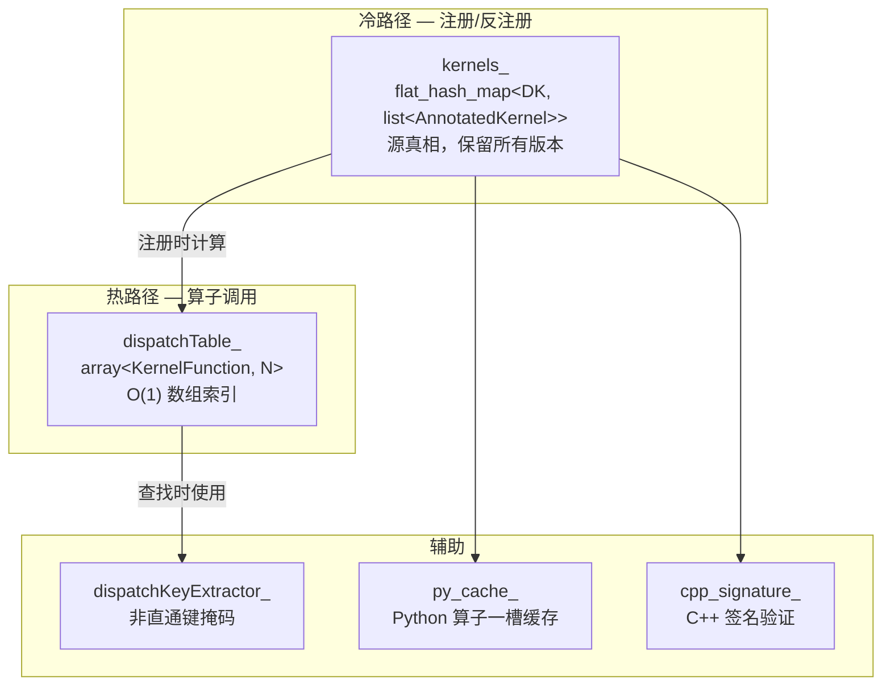

**关键文件索引**：

| 组件 | 文件 |
|------|------|
| OperatorEntry | `aten/src/ATen/core/dispatch/OperatorEntry.h`, `.cpp` |
| PyHandleCache | `c10/core/PyHandleCache.h` |
| 别名键映射 | `c10/core/DispatchKeySet.cpp` |
| 后端映射 | `c10/core/DispatchKeySet.h` |

---

## 2. AnnotatedKernel — 带注解的内核

### 2.1 结构

```cpp
struct AnnotatedKernel final {
  KernelFunction kernel;                              // 实际可调用内核
  std::unique_ptr<FunctionSchema> inferred_function_schema;  // 从 C++ 签名推断的模式
  std::string debug;                                  // 注册来源标识
};
```

### 2.2 AnnotatedKernelContainer

| 构建模式 | 容器类型 | 说明 |
|----------|----------|------|
| Mobile (`C10_DISPATCHER_ONE_KERNEL_PER_DISPATCH_KEY`) | `std::array<AnnotatedKernel, 1>` | 每键仅一个内核 |
| Desktop | `std::list<AnnotatedKernel>` | 支持多版本，最新在前 |

Desktop 使用 list 的原因：支持 Jupyter 风格的内核覆盖（新注册的内核插入前端，旧内核保留在列表中）。

### 2.3 AnnotatedSchema

```cpp
struct AnnotatedSchema final {
  FunctionSchema schema;
  std::string debug;
};
```

---

## 3. 分发表不变量

OperatorEntry 维护三个关键不变量：

| 不变量 | 说明 |
|--------|------|
| `dispatchTable_[dk] == kernels_[dk].front()` | 分发表始终指向最新内核 |
| `dispatchTable_[dk]` 不存在 ⟺ `kernels_[dk]` 不存在 | 两级存储一致 |
| `kernels_[dk]` 非空（如果存在） | 列表永不为空 |

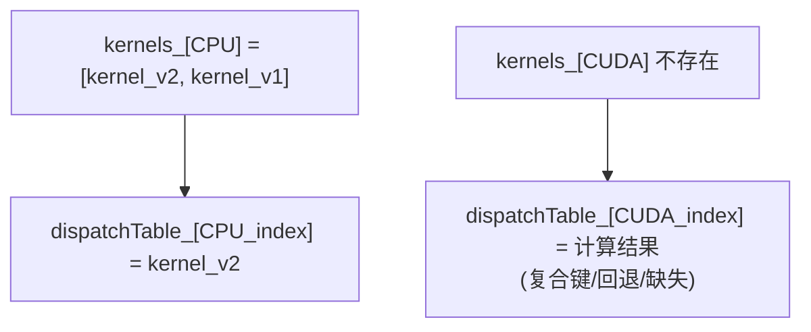

**设计理由**：`kernels_` 较大但仅注册/反注册时访问；`dispatchTable_` 紧凑且每次算子调用都访问，需缓存友好。

---

## 4. 内核注册流程

### 4.1 完整流程

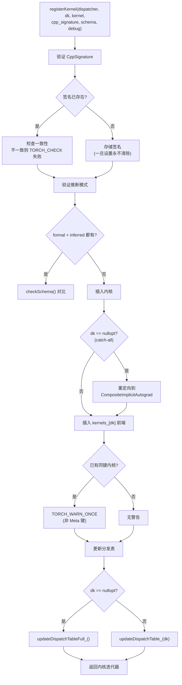

### 4.2 C++ 签名验证

- SymInt 内核使用 `sym_cpp_signature_`，非 SymInt 使用 `cpp_signature_`
- 签名一旦设置，即使内核被反注册也不会清除
- 签名不匹配会触发 `TORCH_CHECK` 失败，附带详细诊断信息

---

## 5. 内核反注册流程

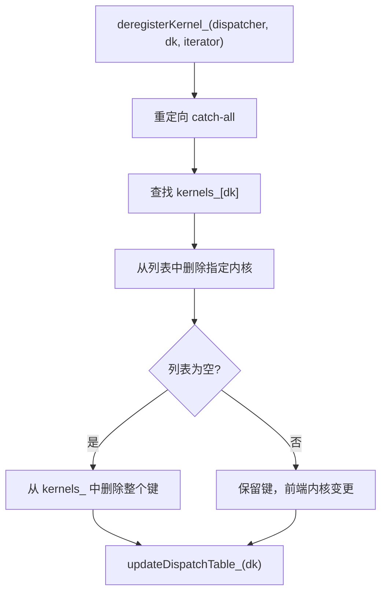

---

## 6. 分发表计算 — 优先级解析

`computeDispatchTableEntryWithDebug()` 实现了严格的优先级规则：

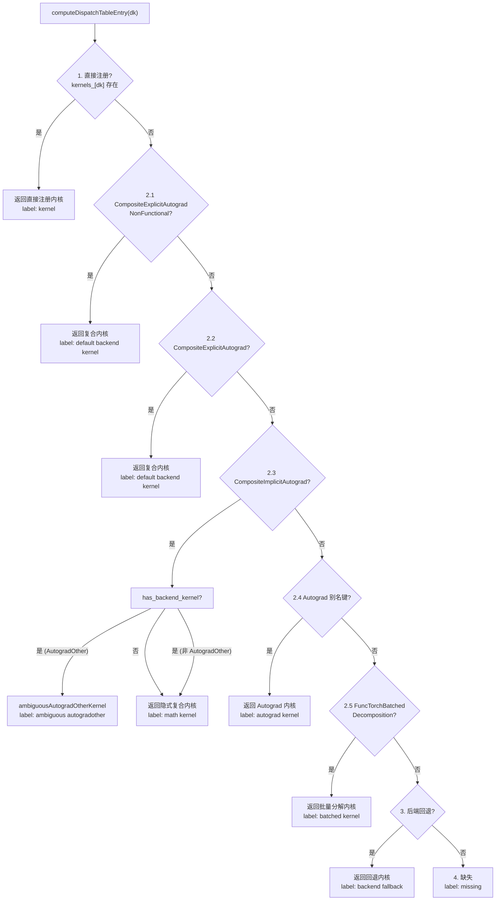

### 6.1 复合键优先级

```
CompositeExplicitAutogradNonFunctional > CompositeExplicitAutograd > CompositeImplicitAutograd > Autograd
```

### 6.2 has_backend_kernel 检查

在步骤 2.3 中，`has_backend_kernel` 通过以下方式计算：

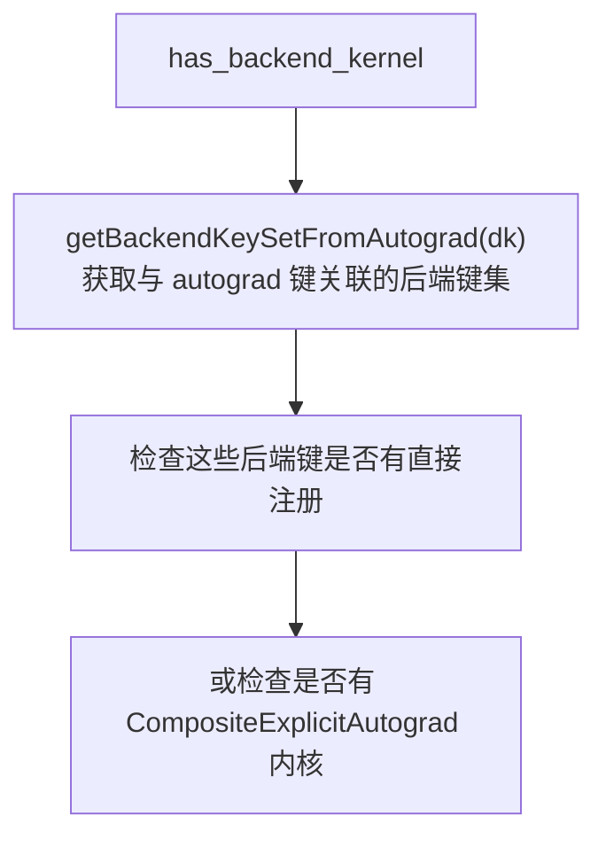

如果 `has_backend_kernel == True`，则 `CompositeImplicitAutograd` 内核不会用于 autograd 键，避免与后端特定内核冲突。

### 6.3 歧义 AutogradOther

当 `CompositeImplicitAutograd` 和后端特定内核同时存在，且 autograd 键为 `AutogradOther` 时，产生歧义。此时返回 `ambiguousAutogradOtherKernel`，运行时报错并建议用户请求专用的 autograd 键。

---

## 7. 别名键传播机制

### 7.1 getRuntimeDispatchKeySet 映射

| 别名键 | 运行时键集 |
|--------|------------|
| `Autograd` | `{AutogradFunctionality, AutogradOther, AutogradNestedTensor}` × 所有后端 |
| `CompositeImplicitAutograd` | 后端键集 ∪ autograd 键集 ∪ {NestedTensor, Functionalize} × 所有后端 |
| `CompositeImplicitAutogradNestedTensor` | `{AutogradNestedTensor, NestedTensor}` × 所有后端 |
| `CompositeExplicitAutograd` | autogradother_backends ∪ {Dense} |
| `CompositeExplicitAutogradNonFunctional` | 上者减去 {Sparse, XLABit, LazyBit} |
| 非 别名 键 | 仅自身 |

### 7.2 传播流程

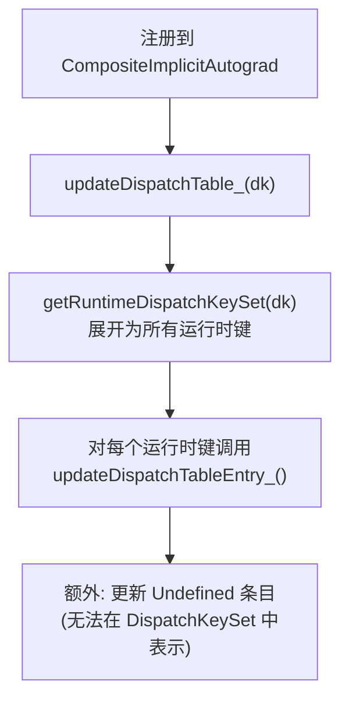

**Undefined 特殊处理**：`Undefined` 不能包含在 `DispatchKeySet` 中，因此 `getRuntimeDispatchKeySet()` 不会返回它。对于 `CompositeImplicitAutograd`、`CompositeExplicitAutograd`、`CompositeExplicitAutogradNonFunctional`，需要额外显式更新 Undefined 条目。

---

## 8. 后端到 Autograd 键传播

注册后端内核时，对应的 autograd 键也需要刷新。

### 8.1 映射关系

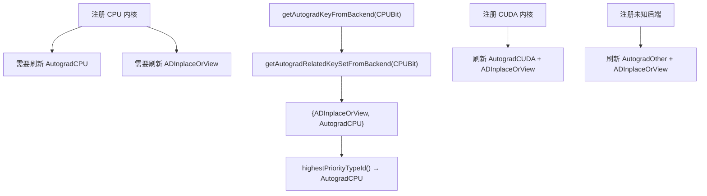

### 8.2 为什么需要刷新

注册后端内核可能改变 `has_backend_kernel` 的值，从而影响 `CompositeImplicitAutograd` 是否应该用于 autograd 键。

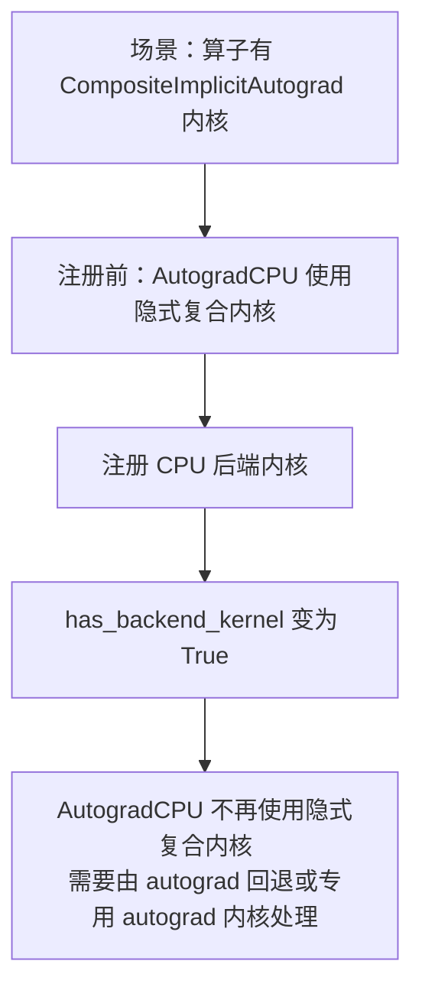

---

## 9. 分发表更新策略

| 方法 | 触发时机 | 更新范围 |
|------|----------|----------|
| `updateDispatchTableEntry_()` | 内部辅助 | 单个键的数组槽位 |
| `updateDispatchTable_()` | 注册/反注册/回退变更 | 单键 + 运行时键展开 + Undefined + Autograd 传播 |
| `updateDispatchTableFull_()` | 初始化、catch-all 注册 | 所有分发表条目 |

### 9.1 updateDispatchTable_ 完整流程

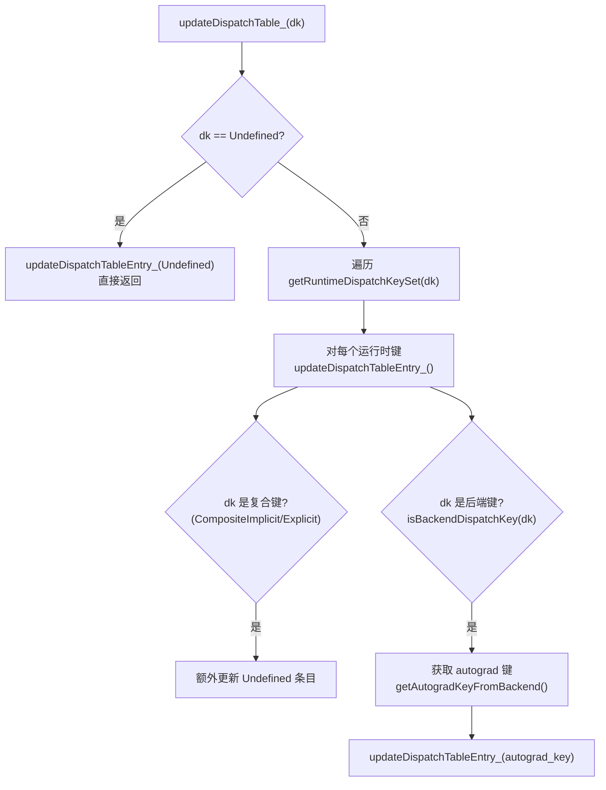

### 9.2 updateDispatchTableEntry_ 内部

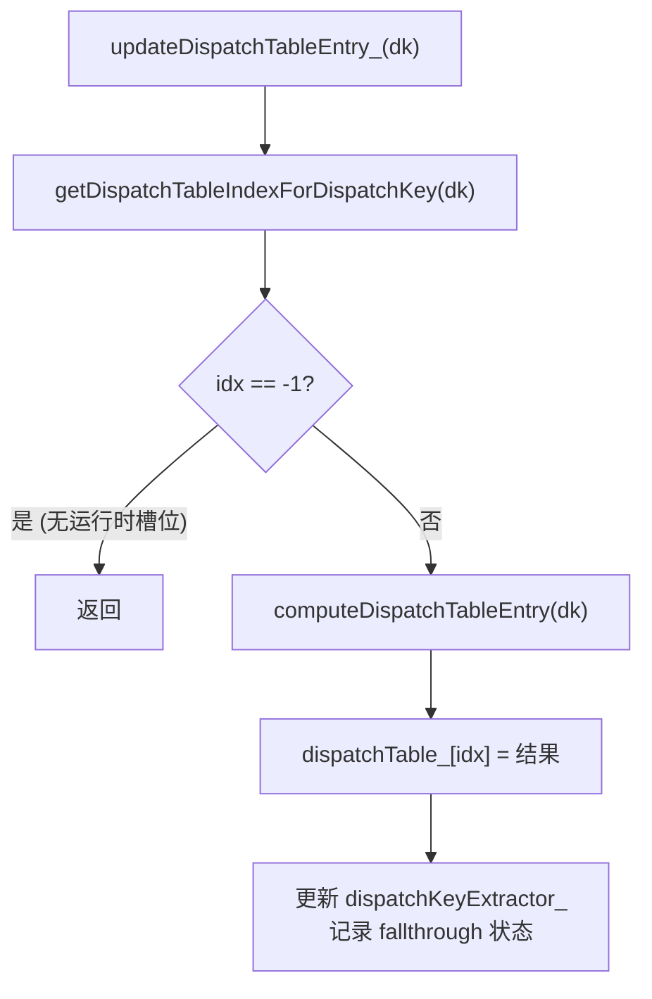

---

## 10. PyHandleCache — Python 算子缓存

PyHandleCache 是一个单槽缓存，加速 Python 算子查找路径。

### 10.1 结构

```cpp
class PyHandleCache {
  mutable std::atomic<impl::PyInterpreter*> pyinterpreter_;
  mutable PyObject* data_{nullptr};
};
```

### 10.2 ptr_or 查找逻辑

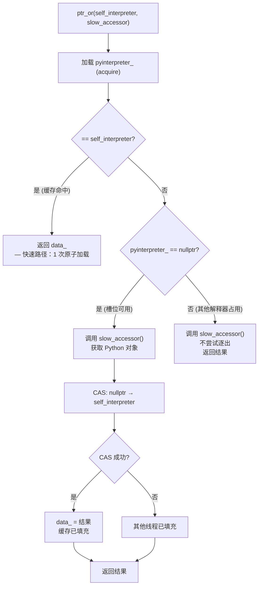

**torchdeploy 场景**：多解释器环境下，一旦一个解释器占据缓存槽位，其他解释器无法使用——但这是可接受的权衡。

---

## 11. 错误报告

### 11.1 reportError 流程

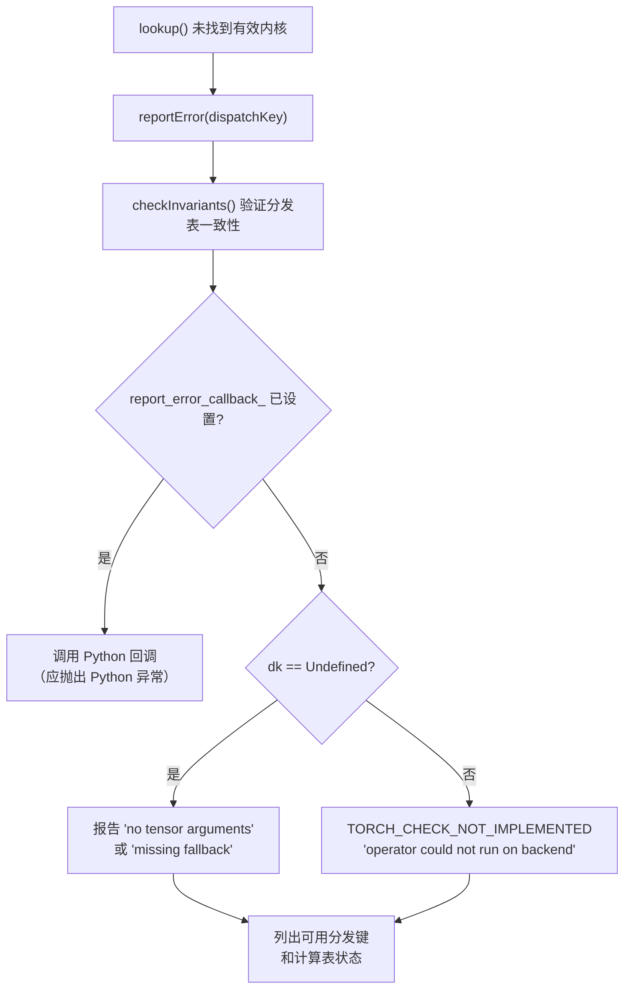

### 11.2 PrivateUse1 名称替换

`post_process_dispatch_key_str()` 将 `PrivateUse1` 后缀替换为用户注册的后端名（如 `AutogradPrivateUse1` → `AutogradFoo`）。

---

## 12. 移动端优化

| 方面 | Desktop | Mobile |
|------|---------|--------|
| 内核容器 | `std::list<AnnotatedKernel>` | `std::array<AnnotatedKernel, 1>` |
| 分发表大小 | ~131 条目 | 8 条目 |
| 内核覆盖 | 支持多版本 | 仅最新版本 |
| 查找 | 通用索引计算 | switch-case 直接映射 |
| 签名检查 | 完整 | 简化 |

---

## 13. 设计权衡

### 13.1 双存储架构

- **收益**：热路径紧凑数组 O(1)，冷路径完整列表支持版本管理
- **代价**：两级存储一致性需维护
- **不变量**：`dispatchTable_[dk] == kernels_[dk].front()` 必须始终成立

### 13.2 别名键展开式传播

- **当前**：注册别名键时，展开为所有运行时键逐个更新
- **替代**：运行时动态计算 → 每次查找额外开销
- **权衡**：注册时多做一些工作，换取查找时零开销

### 13.3 签名永不清除

- **行为**：`cpp_signature_` 一旦设置，即使内核被反注册也不清除
- **原因**：签名验证是全局性的——同一算子的所有内核必须签名一致
- **代价**：反注册后签名信息残留，但不影响正确性

### 13.4 后端回退 O(N) 更新

- **行为**：注册后端回退时遍历所有算子更新分发表
- **原因**：回退影响所有算子的分发表计算
- **权衡**：回退注册仅在初始化时发生，O(N) 可接受

---

## 附录：关键代码行号参考

| 内容 | 文件 | 行号 |
|------|------|------|
| AnnotatedKernel | `OperatorEntry.h` | 37-52 |
| AnnotatedKernelContainer | `OperatorEntry.h` | 117-122 |
| 分发表不变量 | `OperatorEntry.h` | 241-259 |
| dispatchTable_ | `OperatorEntry.h` | 236 |
| kernels_ | `OperatorEntry.h` | 272 |
| py_cache_ | `OperatorEntry.h` | 239 |
| registerKernel | `OperatorEntry.cpp` | 103-181 |
| deregisterKernel_ | `OperatorEntry.cpp` | 183-203 |
| computeDispatchTableEntryWithDebug | `OperatorEntry.cpp` | 262-381 |
| updateDispatchTableEntry_ | `OperatorEntry.cpp` | 389-396 |
| updateDispatchTable_ | `OperatorEntry.cpp` | 403-430 |
| updateDispatchTableFull_ | `OperatorEntry.cpp` | 442-458 |
| reportError | `OperatorEntry.cpp` | 532-558 |
| getRuntimeDispatchKeySet | `DispatchKeySet.cpp` | 63-85 |
| isIncludedInAlias | `DispatchKeySet.cpp` | 150 |
| getAutogradKeyFromBackend | `DispatchKey.h` | 254 |
| getBackendKeySetFromAutograd | `DispatchKeySet.cpp` | 114-148 |
| PyHandleCache | `PyHandleCache.h` | 全文件 |
