# 10 - Dynamo 字节码捕获

> Dynamo 是 PyTorch 的动态编译前端，通过拦截 Python 帧评估、
> 符号解释字节码，将张量操作捕获为 FX 图。
> 它不需要用户修改代码，在运行时自动加速 PyTorch 程序。

---

## 目录

1. [架构概览](#1-架构概览)
2. [帧拦截入口](#2-帧拦截入口)
3. [编译编排 — _compile()](#3-编译编排--_compile)
4. [符号解释器 — InstructionTranslator](#4-符号解释器--instructiontranslator)
5. [字节码处理器](#5-字节码处理器)
6. [VariableTracker 体系](#6-variabletracker-体系)
7. [FX 图构建 — OutputGraph](#7-fx-图构建--outputgraph)
8. [图中断处理](#8-图中断处理)
9. [内联函数调用](#9-内联函数调用)
10. [字节码变换](#10-字节码变换)
11. [Guard 守卫生成](#11-guard-守卫生成)
12. [端到端编译流程](#12-端到端编译流程)
13. [设计权衡](#13-设计权衡)

---

## 1. 架构概览

Dynamo 的编译管线：

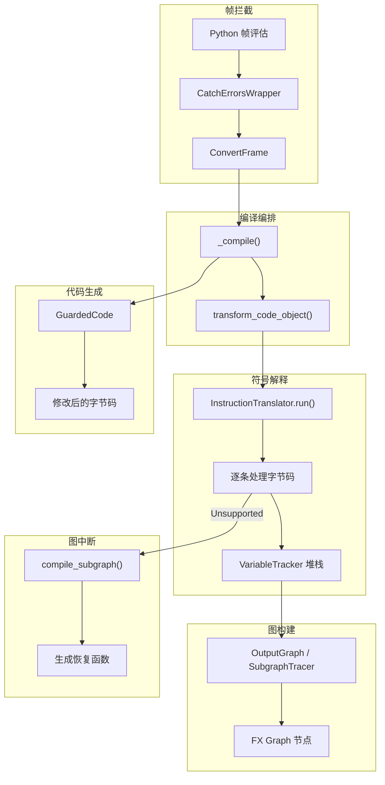

**关键文件索引**：

| 组件 | 文件 |
|------|------|
| 帧拦截 | `torch/_dynamo/convert_frame.py` |
| 符号解释器 | `torch/_dynamo/symbolic_convert.py` |
| FX 图输出 | `torch/_dynamo/output_graph.py` |
| 变量追踪 | `torch/_dynamo/variables/` |
| 字节码变换 | `torch/_dynamo/bytecode_transformation.py` |
| 守卫系统 | `torch/_dynamo/guards.py` |

---

## 2. 帧拦截入口

### 2.1 调用层次

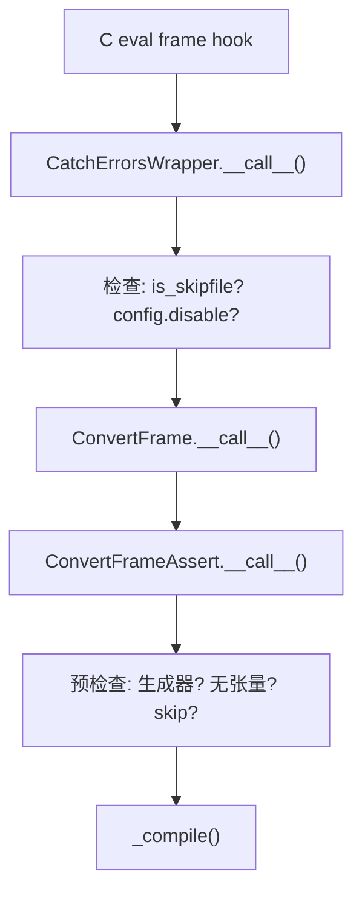

### 2.2 ConvertFrameAssert 预检查

| 检查 | 跳过原因 |
|------|----------|
| 生成器帧 | 不支持追踪生成器 |
| 帧中无张量 | 不需要编译 |
| `__setattr__` 帧 | 避免递归 |
| optimizer `__init__` | 避免追踪初始化 |
| `exec` 生成的帧 | 不支持 |

### 2.3 ConvertFrame — 错误处理

- 捕获 `Unsupported` 错误，回退到 eager 模式
- `config.suppress_errors` 为 True 时静默回退
- `SkipCodeRecursiveException` 设置跳过标志
- `RecompileLimitExceeded` 设置缓存限制标志

---

## 3. 编译编排 — _compile()

### 3.1 完整流程

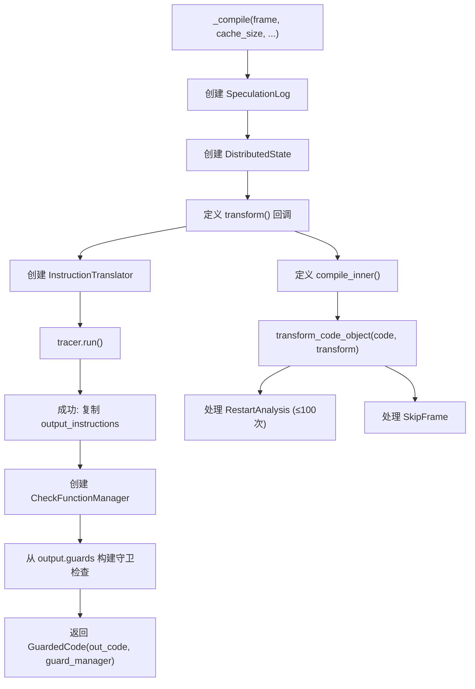

### 3.2 SpeculationLog — 推测日志

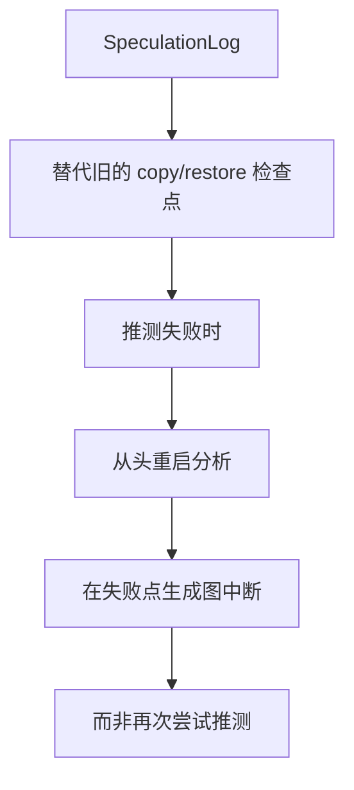

---

## 4. 符号解释器 — InstructionTranslator

### 4.1 核心属性

```python
class InstructionTranslatorBase:
    output: OutputGraph                      # FX 图输出
    symbolic_locals: Dict[str, VariableTracker]  # 追踪的局部变量
    symbolic_globals: Dict[str, VariableTracker]  # 追踪的全局变量
    stack: List[VariableTracker]             # 模拟的 Python 栈
    instruction_pointer: Optional[int]       # 当前指令位置
    block_stack: List[BlockStackEntry]       # 活跃的 with/try 块
    speculation_log: SpeculationLog          # 推测检查点
```

### 4.2 字节码分发表

`BytecodeDistpatchTableMeta` 元类构建 256 条目的分发表（每字节码操作码一个），映射到类方法。未处理的操作码调用 `_missing` → `unimplemented()`。

### 4.3 step() — 处理单条指令

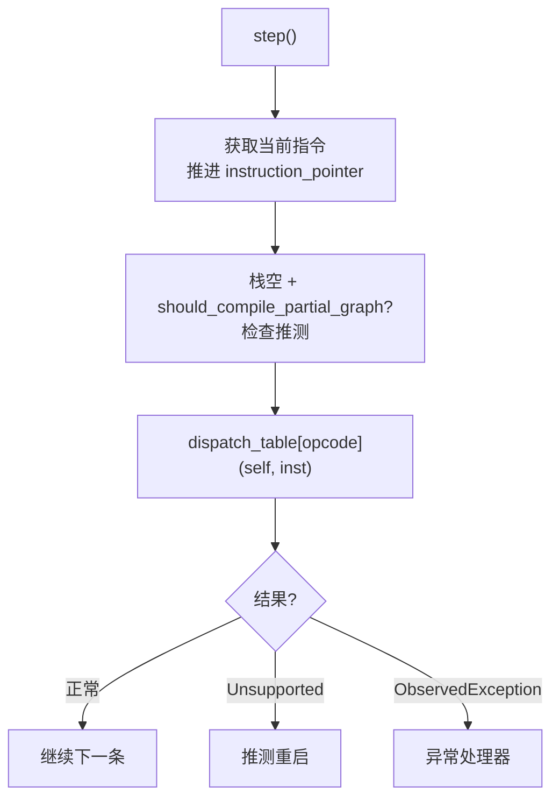

### 4.4 InstructionTranslator vs InliningInstructionTranslator

| 特性 | InstructionTranslator | InliningInstructionTranslator |
|------|----------------------|------------------------------|
| 用途 | 顶层帧 | 内联函数调用 |
| OutputGraph | 独立创建 | 与父级共享 |
| should_compile_partial_graph | 可为 True | 始终 False（全有或全无） |
| RETURN_VALUE | 编译子图 + ReturnValueOp | 设置 symbolic_result |
| 图中断 | 支持 | 不支持（必须全部可内联） |

---

## 5. 字节码处理器

### 5.1 关键处理器

| 操作码 | 处理器 | 说明 |
|--------|--------|------|
| `LOAD_FAST` | 从 symbolic_locals 加载 | 处理字典推导隐式名 |
| `LOAD_CONST` | 创建 ConstantVariable | 缓存常量 |
| `LOAD_GLOBAL` | 查找 symbolic_globals → f_globals → builtins | — |
| `STORE_FAST` | 存入 symbolic_locals | — |
| `CALL_FUNCTION` | call_function(fn, args, {}) | @break_graph_if_unsupported |
| `CALL_FUNCTION_EX` | 处理 *args, **kwargs | @break_graph_if_unsupported |
| `CALL_FUNCTION_KW` | 处理 key=val 调用 | @break_graph_if_unsupported |
| `LOAD_METHOD` | _load_attr + 推入 NULL+fn | 3.11+ 约定 |
| `CALL_METHOD` | 弹出 NULL, fn, args; call_function | — |
| `LOAD_ATTR` | BuiltinVariable(getattr).call_function | — |
| `STORE_ATTR` | BuiltinVariable(setattr).call_function | 推测性，失败则图中断 |
| `STORE_SUBSCR` | obj.call_method("__setitem__") | @break_graph_if_unsupported |
| `BUILD_TUPLE` | 创建 TupleVariable | — |
| `BUILD_LIST` | 创建 ListVariable | — |
| `BUILD_MAP` | 创建 ConstDictVariable | — |
| `FOR_ITER` | it.next_variable(self) | StopIteration 时跳转 |
| `COMPARE_OP` | compare_op_handlers 分发 | — |
| `POP_JUMP_IF_FALSE/TRUE` | generic_jump | — |

### 5.2 call_function — 核心调用分发

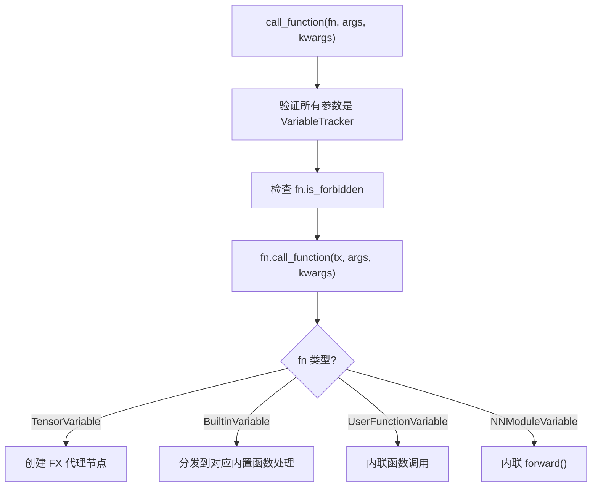

---

## 6. VariableTracker 体系

### 6.1 类层次

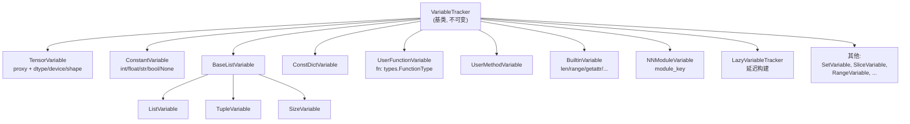

### 6.2 VariableTracker 核心方法

| 方法 | 说明 |
|------|------|
| `as_python_constant()` | 返回 Python 常量值（非常量则 NotImplementedError） |
| `call_function(tx, args, kwargs)` | 模拟函数调用 |
| `call_method(tx, name, args, kwargs)` | 模拟方法调用 |
| `var_getattr(tx, name)` | 获取属性为新 VariableTracker |
| `reconstruct(codegen)` | 发出重建此值的字节码 |
| `build(tx, value, source)` | 工厂方法，委托给 VariableBuilder |

### 6.3 变异追踪

| 类型 | 说明 |
|------|------|
| `ValueMutationNew` | 新值，变异不需要字节码 |
| `ValueMutationExisting` | 已有值，变异必须回放 |
| `AttributeMutationNew` | 新属性变异 |
| `AttributeMutationExisting` | 已有属性变异 |

### 6.4 VariableBuilder — 核心工厂

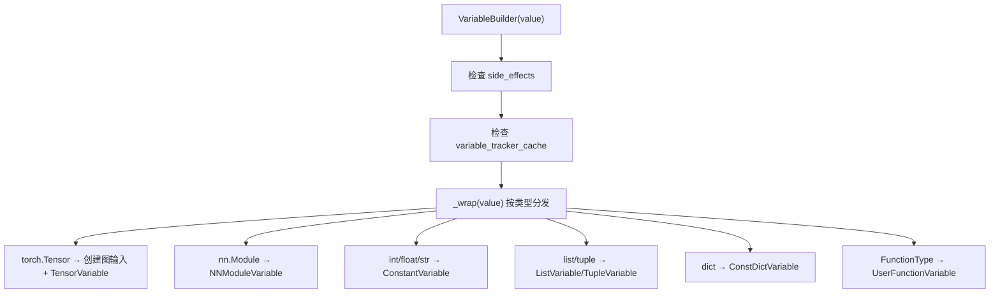

### 6.5 LazyVariableTracker

延迟构建 VariableTracker，直到值实际被需要时才调用 VariableBuilder。优化启动性能，避免为不使用的变量支付构建开销。

---

## 7. FX 图构建 — OutputGraph

### 7.1 OutputGraph 核心成员

```python
class OutputGraph:
    tracers: List[SubgraphTracer]     # 子图追踪器列表
    input_source_to_var: Dict          # 去重图输入
    side_effects: SideEffects          # 变异追踪
    variable_tracker_cache             # VT 查找缓存
    # FakeTensorMode + ShapeEnv
    tracing_context                    # 追踪上下文
```

### 7.2 SubgraphTracer — FX 图追踪器

```python
class SubgraphTracer(fx.Tracer):
    graph: torch.fx.Graph              # 实际 FX 图
    input_name_to_proxy: Dict          # 输入名 → 代理映射
    real_value_cache: Dict             # 真实值缓存
    parent: Optional[SubgraphTracer]   # 父追踪器
    lifted_freevars: Set               # 提升的自由变量
```

### 7.3 图构建流程

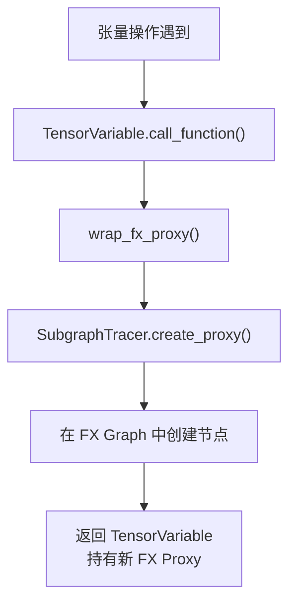

### 7.4 compile_and_call_fx_graph

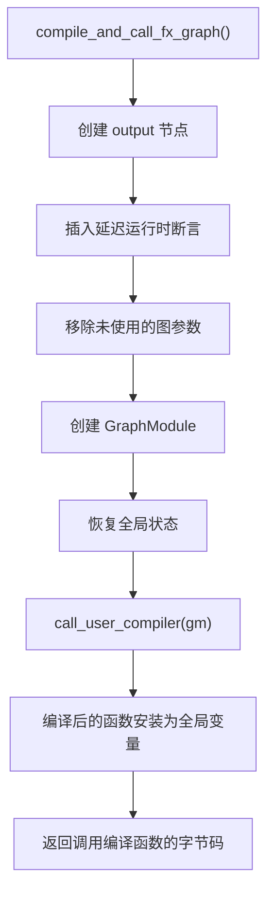

---

## 8. 图中断处理

### 8.1 break_graph_if_unsupported 装饰器

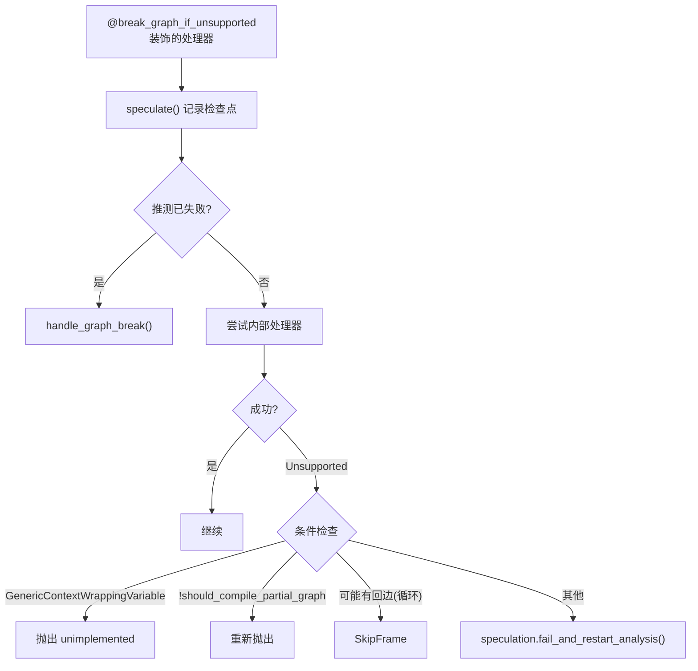

### 8.2 handle_graph_break 流程

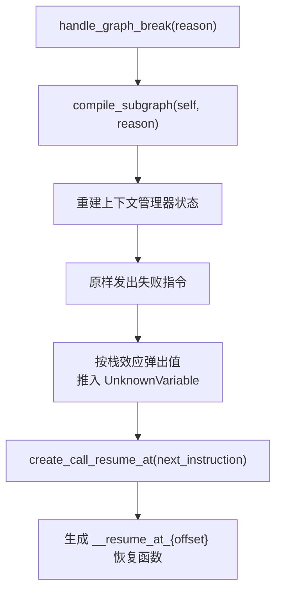

### 8.3 compile_subgraph — 编译子图

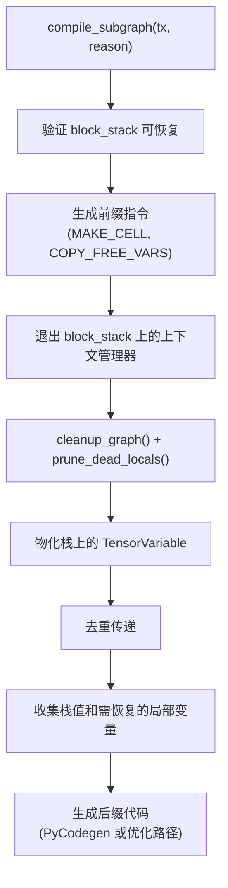

---

## 9. 内联函数调用

### 9.1 InliningInstructionTranslator

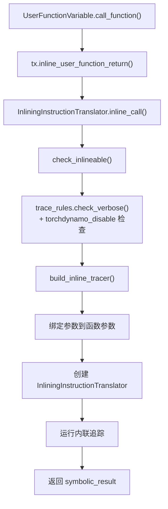

### 9.2 内联 vs 图中断

| 情况 | 处理方式 |
|------|----------|
| 纯张量计算函数 | 内联到当前 FX 图 |
| 调用 torch API | 内联（通常可追踪） |
| 含数据依赖控制流 | 图中断 |
| 调用不支持的操作 | 图中断 |
| 装饰 @torchdynamo.disable | 图中断 |

### 9.3 InliningGeneratorInstructionTranslator

处理生成器函数：收集 `yield` 的值到 `generated_items`，如果 `stop_generator_on_yield` 则在首次 yield 时抛出 `YieldValueOp`。

---

## 10. 字节码变换

### 10.1 transform_code_object 流程

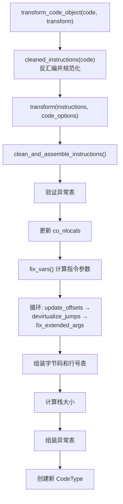

### 10.2 cleaned_instructions 规范化

| 步骤 | 说明 |
|------|------|
| 转换为 Instruction 对象 | 可变版本，含 target 指针 |
| 填充 KW_NAMES argvals | 关键字参数名 |
| 虚拟化异常表条目 | 3.11+ |
| 虚拟化跳转目标 | 偏移量 → Instruction* |
| 剥离 EXTENDED_ARG | 统一处理 |
| 转换 LOAD_METHOD/CALL_METHOD | → LOAD_ATTR/CALL_FUNCTION（<3.11） |
| 处理 super() 无参调用 | 特殊处理 |
| 移除平台特有指令 | 3.12+/3.13+ 适配 |

### 10.3 恢复函数生成

`create_call_resume_at(offset)` 创建 `__resume_at_{offset}` 函数：
- 接收剩余栈值和活跃局部变量作为参数
- 恢复上下文管理器状态
- 从中断点继续执行

---

## 11. Guard 守卫生成

### 11.1 CheckFunctionManager

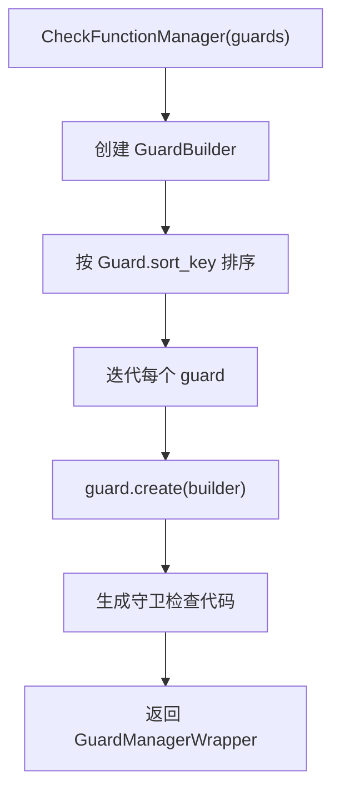

### 11.2 环境守卫

OutputGraph 初始化时安装的环境守卫：

| 守卫 | 说明 |
|------|------|
| SHAPE_ENV | 符号形状环境 |
| DETERMINISTIC_ALGORITHMS | 确定性算法设置 |
| GRAD_MODE | 梯度模式 |
| DEFAULT_DEVICE | 默认设备 |
| TORCH_FUNCTION_STATE | __torch_function__ 状态 |

### 11.3 守卫检查流程

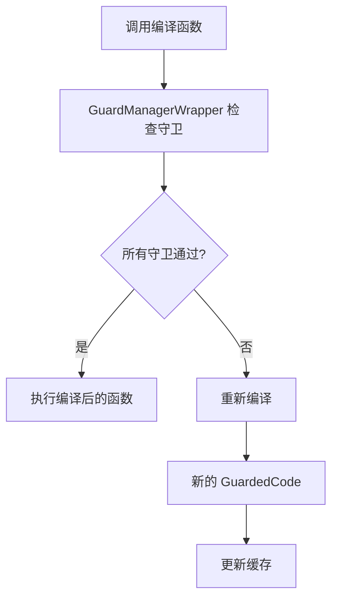

---

## 12. 端到端编译流程

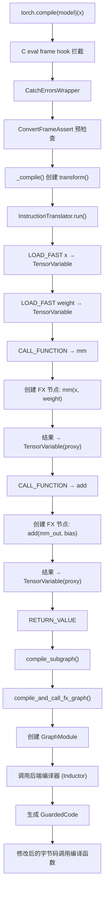

---

## 13. 设计权衡

### 13.1 符号解释 vs 追踪

- **符号解释**（Dynamo 选择）：逐条处理字节码，支持控制流
- **追踪**（TorchScript）：仅记录执行路径，不支持数据依赖控制流
- **权衡**：符号解释更完整但更慢，追踪更快但受限

### 13.2 图中断 vs 全图编译

- **图中断**：遇到不支持的操作时编译当前子图，然后恢复
- **全图编译**：要求整个函数可追踪
- **Dynamo 选择**：支持图中断，提供更好的兼容性

### 13.3 LazyVariableTracker 延迟构建

- **收益**：避免为不使用的变量支付构建开销
- **代价**：首次访问时的 realize() 开销
- **适用**：函数有大量局部变量但只使用少数的场景

### 13.4 SpeculationLog vs 检查点恢复

- **SpeculationLog**（当前）：失败时从头重启，在失败点生成图中断
- **检查点恢复**（旧方案）：保存/恢复完整状态
- **权衡**：SpeculationLog 更简单但重启开销更大

### 13.5 内联深度限制

- **InliningInstructionTranslator** 共享父级 OutputGraph
- 深度内联可能导致 FX 图过大
- `inline_depth` 计数器追踪嵌套深度

---

## 附录：关键代码行号参考

| 内容 | 文件 | 行号 |
|------|------|------|
| ConvertFrameAssert | `convert_frame.py` | 439 |
| _compile() | `convert_frame.py` | 617 |
| InstructionTranslatorBase | `symbolic_convert.py` | 807 |
| step() | `symbolic_convert.py` | 958 |
| break_graph_if_unsupported | `symbolic_convert.py` | 674 |
| InstructionTranslator | `symbolic_convert.py` | 2712 |
| InliningInstructionTranslator | `symbolic_convert.py` | 3102 |
| call_function | `symbolic_convert.py` | 901 |
| OutputGraph | `output_graph.py` | 255 |
| compile_subgraph | `output_graph.py` | 964 |
| compile_and_call_fx_graph | `output_graph.py` | 1306 |
| SubgraphTracer | `output_graph.py` | 1891 |
| VariableTracker | `variables/base.py` | 199 |
| TensorVariable | `variables/tensor.py` | 104 |
| VariableBuilder | `variables/builder.py` | 357 |
| transform_code_object | `bytecode_transformation.py` | 1406 |
| CheckFunctionManager | `guards.py` | 2215 |
