# 11 - FX 图与 IR

> FX 是 PyTorch 的图中间表示框架，提供符号追踪、图变换和代码生成能力。
> 它是 Dynamo 与 Inductor 之间的桥梁：Dynamo 生成 FX 图，Inductor 消费 FX 图。

---

## 目录

1. [架构概览](#1-架构概览)
2. [Node — 图的基本单元](#2-node--图的基本单元)
3. [Graph — 节点容器与 SSA 形式](#3-graph--节点容器与-ssa-形式)
4. [GraphModule — 可执行的图包装](#4-graphmodule--可执行的图包装)
5. [Proxy 与符号追踪](#5-proxy-与符号追踪)
6. [Interpreter 模式](#6-interpreter-模式)
7. [图变换与子图重写](#7-图变换与子图重写)
8. [Dynamo 与 FX 的衔接](#8-dynamo-与-fx-的衔接)
9. [代码生成机制](#9-代码生成机制)
10. [设计权衡](#10-设计权衡)

---

## 1. 架构概览

FX 图框架在编译管线中的位置：

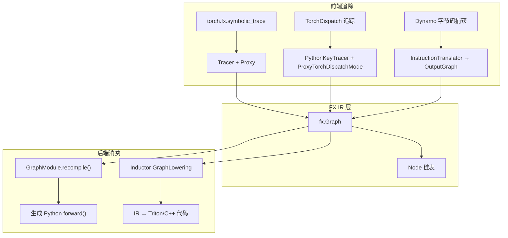

**三种追踪方式对比**：

| 方式 | 入口 | 控制流 | 捕获粒度 | 典型用途 |
|------|------|--------|----------|----------|
| 符号追踪 | `symbolic_trace()` | 不支持数据依赖 | Python 层 | 简单模型分析 |
| TorchDispatch | `make_fx()` | 不支持 | ATen 算子层 | 算子级别变换 |
| Dynamo | `torch.compile()` | 支持 | ATen 算子层 | 生产编译 |

**关键文件索引**：

| 组件 | 文件 |
|------|------|
| 节点 | `torch/fx/node.py` |
| 图 | `torch/fx/graph.py` |
| 图模块 | `torch/fx/graph_module.py` |
| 代理 | `torch/fx/proxy.py` |
| 符号追踪器 | `torch/fx/_symbolic_trace.py` |
| 解释器 | `torch/fx/interpreter.py` |
| 子图重写 | `torch/fx/subgraph_rewriter.py` |
| 不可变集合 | `torch/fx/immutable_collections.py` |
| TorchDispatch 追踪 | `torch/fx/experimental/proxy_tensor.py` |

---

## 2. Node — 图的基本单元

### 2.1 Node 类结构

`Node` (`node.py:202`) 继承自 `_NodeBase`（C++ 实现，定义在 `torch/csrc/fx/node.cpp`），提供双向链表的底层字段。

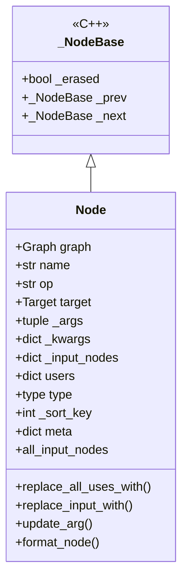

**初始化** (`node.py:244`)：

| 字段 | 类型 | 说明 |
|------|------|------|
| `graph` | `Graph` | 所属图 |
| `name` | `str` | 唯一名称（由 `_Namespace` 分配） |
| `op` | `str` | 操作类型，必须是 `_legal_ops` 之一 |
| `target` | `Callable \| str` | `call_function` 时为可调用对象，其余为字符串 |
| `_args` | `tuple` | 位置参数（不可变） |
| `_kwargs` | `dict` | 关键字参数（不可变） |
| `_input_nodes` | `Dict[Node, None]` | 所有 Node 类型的输入（有序集合） |
| `users` | `Dict[Node, None]` | 所有消费此节点的节点（有序集合） |
| `meta` | `dict` | 元数据（如 tensor shape/dtype） |

### 2.2 节点操作类型

`_legal_ops` (`node.py:70`) 定义了合法的操作类型：

| op | target 类型 | 语义 | args/kwargs |
|----|-----------|------|------------|
| `placeholder` | `str`（参数名） | 函数输入 | `args` 存默认值或为空 |
| `get_attr` | `str`（限定名） | 从 Module 获取属性 | 不使用 |
| `call_function` | `Callable` | 调用自由函数 | Python 调用约定 |
| `call_method` | `str`（方法名） | 在 `args[0]` 上调用方法 | self 在 args[0] |
| `call_module` | `str`（限定名） | 调用子模块的 forward | 无 self |
| `output` | `"output"` | 返回语句 | `args[0]` 为返回值 |

### 2.3 使用-定义链维护

`__update_args_kwargs` (`node.py:576`) 是核心变更引擎：

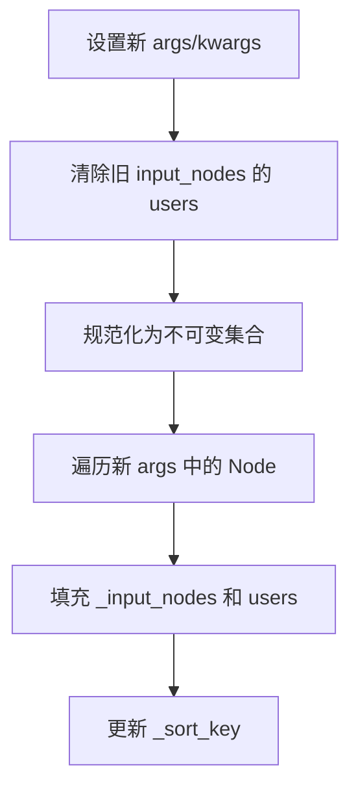

关键替换操作：

- **`replace_all_uses_with(replace_with)`** (`node.py:701`)：遍历 `self.users`，对每个用户调用 `map_arg` 将 `self` 替换为 `replace_with`
- **`replace_input_with(old, new)`** (`node.py:844`)：替换单个输入引用
- **`update_arg(idx, arg)`**：更新指定位置的参数

### 2.4 Argument 类型系统

`Argument` (`node.py:58`) 是递归联合类型，定义了可出现在 args/kwargs 中的值：

```
Argument = Union[str, int, float, bool, complex, None, slice,
                 range, dtype, Tensor, Node, device,
                 Tuple[Argument, ...], List[Argument],
                 Dict[str, Argument]]
```

`map_arg(fn, arg)` (`node.py:898`) 递归遍历 Argument 树，对每个 Node 应用 `fn`。底层引擎为 `map_aggregate` (`node.py:907`)。

---

## 3. Graph — 节点容器与 SSA 形式

### 3.1 Graph 类结构

`Graph` (`graph.py:936`) 使用循环双向链表存储节点：

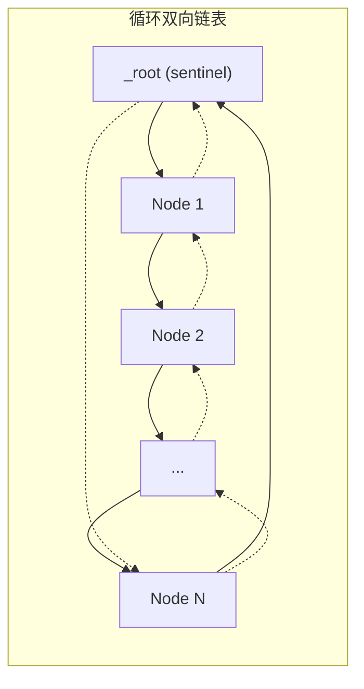

**初始化** (`graph.py:985`)：

| 字段 | 说明 |
|------|------|
| `_root` | 哨兵节点，链表头尾锚点 |
| `_used_names` | 已用名称集合 |
| `_insert` | 当前插入位置（某节点的 `prepend` 方法） |
| `_len` | 节点计数 |
| `_graph_namespace` | `_Namespace` 实例，管理唯一命名 |
| `_codegen` | `CodeGen` 实例，控制代码生成 |
| `_find_nodes_lookup_table` | 副表，加速 (op, target) 查询 |

### 3.2 节点创建

`create_node` (`graph.py:1112`) 是核心工厂方法：

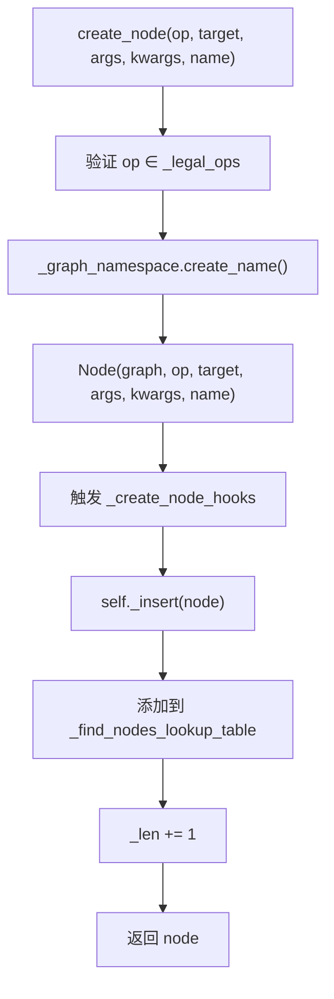

便捷方法均调用 `create_node`：

| 方法 | 行号 | 生成的 op |
|------|------|----------|
| `placeholder(name)` | 1272 | `placeholder` |
| `get_attr(name)` | 1305 | `get_attr` |
| `call_module(name, args, kwargs)` | 1373 | `call_module` |
| `call_method(name, args, kwargs)` | 1423 | `call_method` |
| `call_function(target, args, kwargs)` | 1462 | `call_function` |
| `output(args)` | 1536 | `output` |

### 3.3 节点删除与插入

**删除** — `erase_node` (`graph.py:1182`)：
1. 验证 `node.users` 为空（无消费者）
2. 触发 `_erase_node_hooks`
3. 从链表和查询表中移除
4. 清空 args/kwargs 以更新上游 users

**插入点** — `inserting_before`/`inserting_after` (`graph.py:1224`/`1248`)：
- 上下文管理器，临时修改 `_insert` 指向
- 退出时恢复原插入位置

### 3.4 SSA 形式保证

Graph 维护 SSA 不变量：

1. **单赋值**：每个 Node 的 `name` 在图中唯一（由 `_Namespace` 保证）
2. **不可变参数**：args/kwargs 使用 `immutable_list`/`immutable_dict`（`immutable_collections.py`）
3. **拓扑序**：`lint()` (`graph.py:1707`) 验证节点按拓扑序排列
4. **无悬挂引用**：`erase_node` 要求 users 为空

### 3.5 图操作

| 操作 | 方法 | 行号 |
|------|------|------|
| 复制图 | `graph_copy` | 1062 |
| 复制节点 | `node_copy` | 1501 |
| 死代码消除 | `eliminate_dead_code` | 1816 |
| 图验证 | `lint` | 1707 |
| 生成 Python 代码 | `python_code` | 1570 |
| 按模式查找节点 | `find_nodes` | — |

`eliminate_dead_code` 反向遍历节点，删除 users 为空且无副作用的节点。

---

## 4. GraphModule — 可执行的图包装

### 4.1 GraphModule 类结构

`GraphModule` (`graph_module.py:404`) 继承 `torch.nn.Module`，将 FX 图包装为可执行模块：

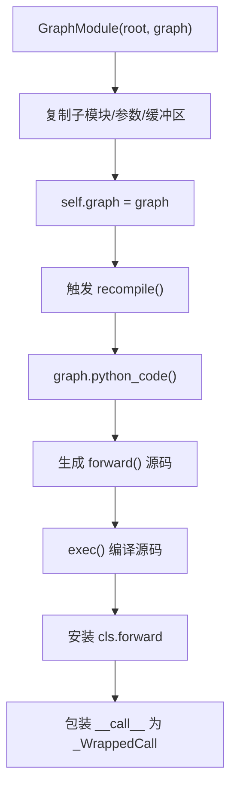

**`__new__`** (`graph_module.py:418`)：为每个实例创建单例子类 `GraphModuleImpl`，使每个实例拥有独立的 `forward` 方法。

**`__init__`** (`graph_module.py:438`)：
1. 复制 `root` 中 `get_attr`/`call_module` 引用的子模块/参数/缓冲区
2. 设置 `self.graph = graph`（触发 `recompile()`）

### 4.2 重新编译

`recompile` (`graph_module.py:795`) 是 GraphModule 的核心——将 Graph 转为可执行 Python 代码：

```
Graph → python_code() → Python 源码 → exec() → forward() 方法
```

1. 调用 `self._graph.python_code()` 生成 Python 源码
2. `_forward_from_src` (`graph_module.py:91`) 执行 `exec()` 编译
3. 安装 `cls.forward`
4. `_WrappedCall` 包装 `__call__` 提供错误定位

### 4.3 _LazyGraphModule

`_LazyGraphModule` (`torch/fx/_lazy_graph_module.py:65`) 延迟 recompile 到 `forward` 或 `code` 被访问时。Inductor 使用此类避免频繁重编译开销。

### 4.4 错误报告

`_WrappedCall` (`graph_module.py:344`) 包装 `Module.__call__`：
- 捕获执行异常
- 在错误消息中指向生成的源码行号
- 大幅改善调试体验

### 4.5 序列化

`__reduce__` (`graph_module.py:857`)：序列化生成后的 Python 代码而非 Graph 对象。反序列化时重新追踪代码重建 Graph。

---

## 5. Proxy 与符号追踪

### 5.1 Proxy 机制

`Proxy` (`proxy.py:413`) 包装一个 `Node` 和 `TracerBase`，使 Python 操作自动记录为图节点：

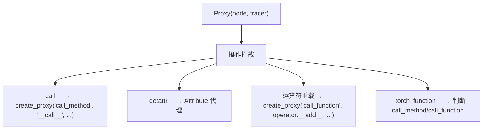

**运算符重载** (`proxy.py:705-717`)：模块加载时为 `magic_methods`（add, sub, mul 等）动态安装重载，每个调用 `tracer.create_proxy("call_function", operator.<method>, ...)`。

### 5.2 数据依赖控制流

- **`__bool__`** (`proxy.py:519`)：调用 `tracer.to_bool()`，默认抛出 `TraceError`——这是符号追踪不支持数据依赖控制流的根因
- **`__iter__`** (`proxy.py:496`)：检查调用字节码是否为 `UNPACK_SEQUENCE`，是则生成分片 getitem 代理；否则调用 `tracer.iter()` 抛出错误
- **`__len__`** (`proxy.py:555`)：默认抛出 `RuntimeError`

### 5.3 TracerBase

`TracerBase` (`proxy.py:119`) 提供追踪基础设施：

| 方法 | 行号 | 说明 |
|------|------|------|
| `create_node` | 144 | 委托 `graph.create_node`，附加 scope/stack 元数据 |
| `create_proxy` | 210 | 创建 Node 并包装为 Proxy |
| `create_arg` | 283 | 将 Python 值转为 IR Argument |

`create_proxy` 流程：

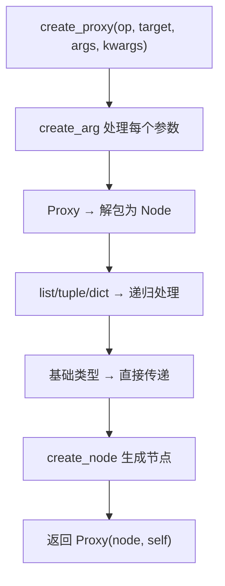

### 5.4 特殊代理

| 类 | 行号 | 说明 |
|----|------|------|
| `Attribute` | 643 | 延迟属性代理，`get_attr`/`call_method` 在实际使用时才创建 |
| `ParameterProxy` | 668 | 特殊代理，将 shape/size/dim/ndim/numel 透传给真实参数 |
| `GraphAppendingTracer` | 393 | 最小追踪器，用于非追踪环境下创建 Proxy |

### 5.5 Tracer — 完整符号追踪器

`Tracer` (`_symbolic_trace.py:242`) 继承 `TracerBase`，实现完整的符号追踪：

**`trace`** (`_symbolic_trace.py:712`) 主要流程：

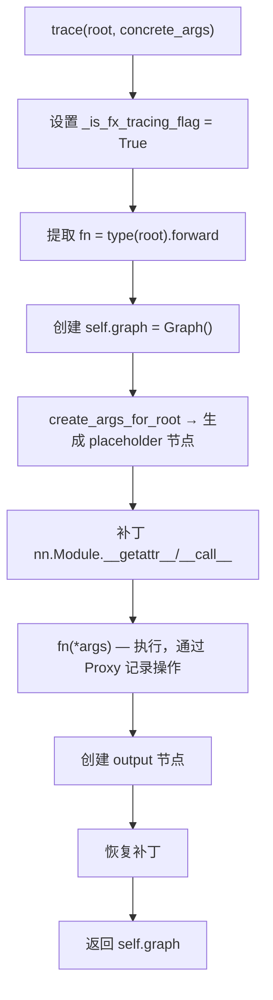

**`is_leaf_module`** (`_symbolic_trace.py:439`)：默认规则——`torch.nn`/`torch.ao.nn` 下的模块（除 Sequential）是叶节点，不展开追踪。

**`call_module`** (`_symbolic_trace.py:491`)：检查 `is_leaf_module`；叶模块发出 `call_module` 节点，否则正常调用 forward 继续追踪。

**`wrap`** (`_symbolic_trace.py:1189`)：注册叶函数，使函数作为 `call_function` 节点而非被展开追踪。

### 5.6 TorchDispatch 追踪

`make_fx` (`proxy_tensor.py:2169`) 使用 `PythonKeyTracer` + `ProxyTorchDispatchMode`：

- 在 `FakeTensorMode` + `TorchDispatchMode` 下运行函数
- 每个 `torch.ops.aten` dispatch 被拦截并记录为 `call_function` 节点
- 支持三种追踪模式：`"real"`, `"fake"`, `"symbolic"`
- 捕获粒度为 ATen 算子层，比符号追踪更底层

---

## 6. Interpreter 模式

### 6.1 Interpreter 类

`Interpreter` (`interpreter.py:24`) 提供逐节点执行图的能力：

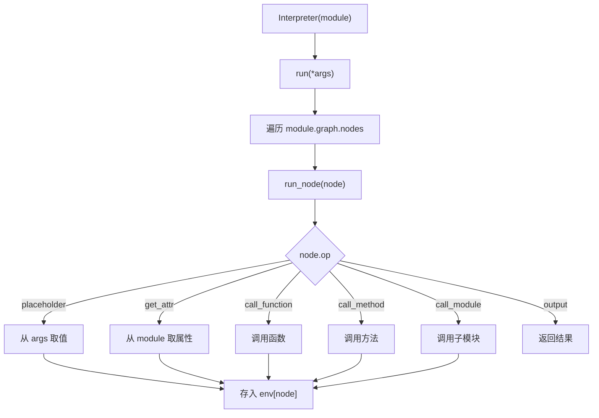

**用途**：
- 分析：收集统计信息、验证正确性
- 变换：子类覆盖 `run_node` 以修改执行行为
- 调试：逐节点执行以定位问题

### 6.2 Transformer

`Transformer` (`interpreter.py`) 继承 `Interpreter`，在执行过程中生成新图。每个节点的结果被映射到新图的节点。

---

## 7. 图变换与子图重写

### 7.1 直接图操作

| 操作 | API | 说明 |
|------|-----|------|
| 添加节点 | `Graph.call_function()` 等 | 便捷方法创建节点 |
| 删除节点 | `Graph.erase_node()` | 要求 users 为空 |
| 替换使用 | `Node.replace_all_uses_with()` | SSA 风格全量替换 |
| 插入位置 | `Graph.inserting_before()` | 上下文管理器 |
| 触发重编译 | `GraphModule.recompile()` | 变更后必须调用 |

### 7.2 子图重写

`replace_pattern` (`subgraph_rewriter.py:105`) 匹配并替换图中所有非重叠模式子图：

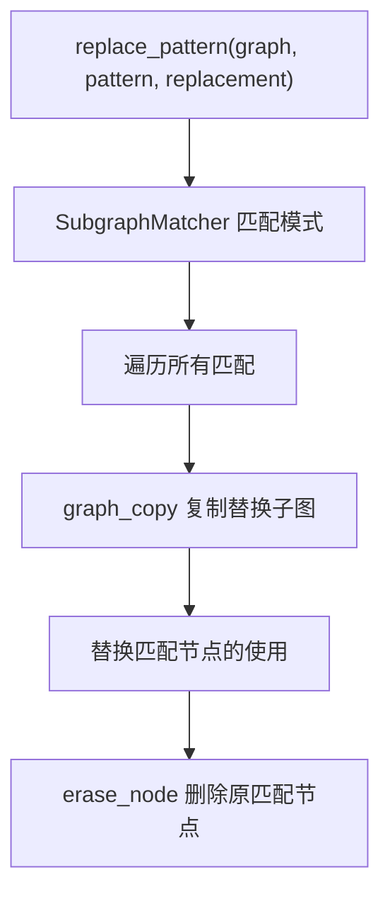

`replace_pattern_with_filters` (`subgraph_rewriter.py:235`)：扩展版本，支持匹配过滤器和替换回调。

### 7.3 PassManager

`PassManager` (`passes/pass_manager.py:178`) 管理有序的变换管线：

- `add_pass` / `remove_pass` / `replace_pass`：管理 pass 列表
- `add_constraint`：添加偏序约束（如 `this_before_that_pass_constraint`）
- `loop_pass`：包装 pass 重复执行 N 次或直到谓词为假

### 7.4 关键 Pass

| Pass | 文件 | 说明 |
|------|------|------|
| `ShapeProp` | `passes/shape_prop.py` | 使用 FakeTensor 传播 shape/dtype 元数据 |
| `split_module` | `passes/split_module.py` | 按回调分区 GraphModule |
| `FakeTensorProp` | `passes/fake_tensor_prop.py` | 传播 FakeTensor 值 |
| `reinplace` | `passes/reinplace.py` | 将 out-of-place 算子转为 in-place |

---

## 8. Dynamo 与 FX 的衔接

### 8.1 OutputGraph → SubgraphTracer → fx.Graph

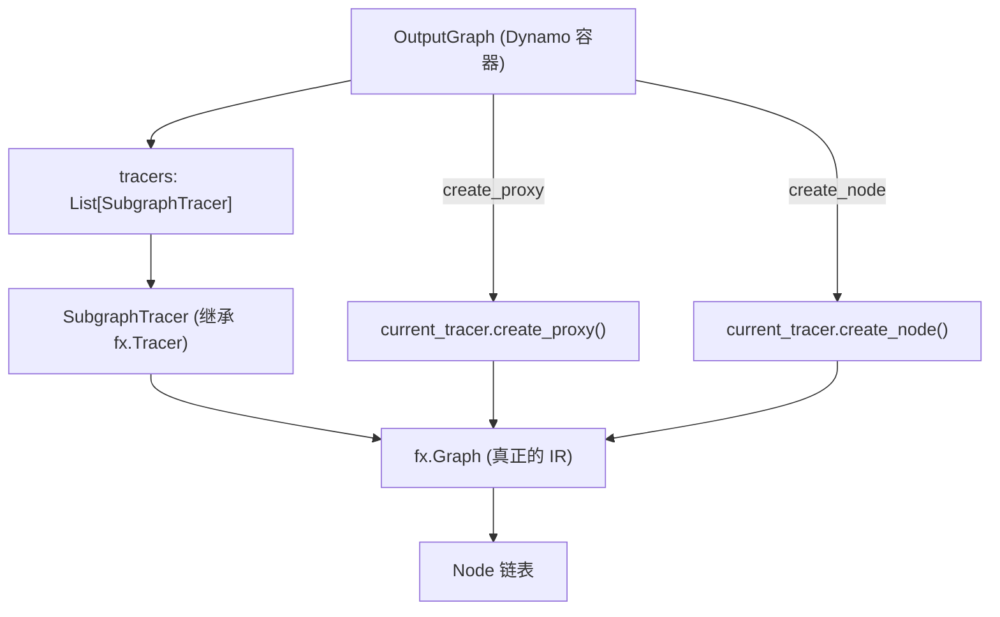

**OutputGraph** (`output_graph.py:255`) 不是 `fx.Graph` 的子类，而是管理 FX 图构建过程的容器。

- `OutputGraph.create_proxy` (`output_graph.py:583`)：委托 `current_tracer.create_proxy()`
- `current_tracer`：返回 `self.tracers[-1]`——最近推入的子追踪器
- `SubgraphTracer` (`output_graph.py:1891`)：继承 `fx.Tracer`，每个实例拥有独立的 `fx.Graph()`

### 8.2 追踪嵌套

Dynamo 使用 SubgraphTracer 栈支持 HigherOrderOperator 的嵌套追踪：

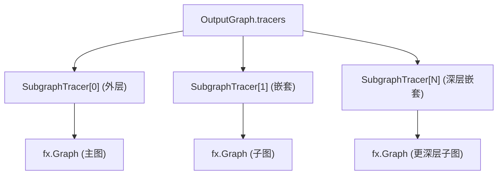

`SubgraphTracer.create_proxy` (`output_graph.py:1984`)：处理嵌套子图的自由变量提升。

### 8.3 关键差异

| 特性 | FX 符号追踪 | Dynamo 追踪 |
|------|-----------|------------|
| 追踪方式 | 执行 forward，Proxy 记录 | 解释字节码，调用 create_proxy |
| 控制流 | 不支持数据依赖 | 支持（通过图中断） |
| 算子粒度 | Python 层 + ATen 层 | ATen 层 |
| 输出 | 单个 fx.Graph | 可能多个子图（图中断） |

---

## 9. 代码生成机制

### 9.1 CodeGen 类

`CodeGen` (`graph.py:357`) 控制 Graph 到 Python 源码的生成：

`_gen_python_code` (`graph.py:408`) 主流程：

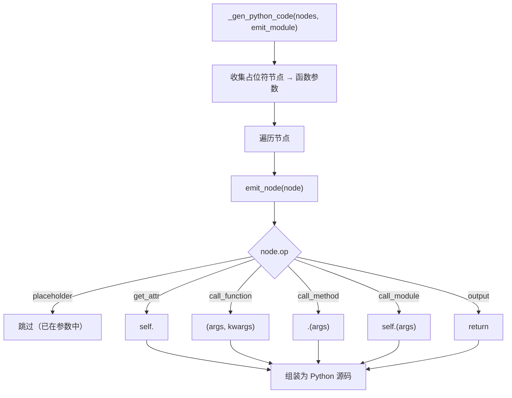

### 9.2 _PyTreeCodeGen

`_PyTreeCodeGen` (`graph.py:814`) 扩展 `CodeGen`，支持 pytree 展平的输入/输出。Dynamo 生成的图使用此代码生成器。

### 9.3 生成的代码示例

对于图：
```
placeholder x
placeholder weight
call_function torch.mm (x, weight)
call_function torch.add (mm_out, bias)
output add_out
```

生成：
```python
def forward(self, x, weight, bias):
    mm = torch.mm(x, weight)
    add = torch.add(mm, bias)
    return add
```

---

## 10. 设计权衡

### 10.1 双向链表 vs 数组

- **链表**（当前）：O(1) 插入/删除，支持任意位置插入
- **数组**：O(n) 插入/删除，但缓存友好
- **选择链表**：图变换频繁在中间插入/删除节点，链表更合适

### 10.2 不可变参数 vs 可变参数

- **不可变**（当前）：`immutable_list`/`immutable_dict` 防止意外修改
- **可变**：更灵活但容易引入 bug
- **权衡**：不可变参数确保 use-def 链一致性，但增加了更新开销

### 10.3 代码生成 vs 解释执行

- **代码生成**（当前）：`python_code()` 生成 Python 源码，`exec()` 编译
- **解释执行**：`Interpreter` 逐节点执行
- **选择代码生成**：生成的 forward() 与手写代码等价，运行时零开销

### 10.4 exec 编译 vs compile

- **exec**（当前）：直接执行源码字符串
- **compile + exec**：先编译为代码对象
- **权衡**：exec 更简单，调试时可直接查看源码

### 10.5 延迟重编译

- **`_LazyGraphModule`**：推迟 recompile 直到 forward/code 被访问
- **收益**：多次图变换只需一次重编译
- **代价**：首次访问时才编译，可能延迟错误发现
- **适用**：Inductor 等频繁修改图的场景

### 10.6 C++ NodeBase vs 纯 Python

- **C++ NodeBase**（当前）：链表操作用 C++ 实现，性能更好
- **纯 Python**：更易调试和扩展
- **权衡**：大型图中链表遍历是热路径，C++ 实现显著提速

---

## 附录：关键代码行号参考

| 内容 | 文件 | 行号 |
|------|------|------|
| Node 类 | `torch/fx/node.py` | 202 |
| Node.__init__ | `torch/fx/node.py` | 244 |
| __update_args_kwargs | `torch/fx/node.py` | 576 |
| replace_all_uses_with | `torch/fx/node.py` | 701 |
| replace_input_with | `torch/fx/node.py` | 844 |
| map_arg | `torch/fx/node.py` | 898 |
| _legal_ops | `torch/fx/node.py` | 70 |
| Argument 类型 | `torch/fx/node.py` | 58 |
| Graph 类 | `torch/fx/graph.py` | 936 |
| Graph.__init__ | `torch/fx/graph.py` | 985 |
| create_node | `torch/fx/graph.py` | 1112 |
| erase_node | `torch/fx/graph.py` | 1182 |
| inserting_before | `torch/fx/graph.py` | 1224 |
| placeholder | `torch/fx/graph.py` | 1272 |
| get_attr | `torch/fx/graph.py` | 1305 |
| call_module | `torch/fx/graph.py` | 1373 |
| call_method | `torch/fx/graph.py` | 1423 |
| call_function | `torch/fx/graph.py` | 1462 |
| output | `torch/fx/graph.py` | 1536 |
| node_copy | `torch/fx/graph.py` | 1501 |
| python_code | `torch/fx/graph.py` | 1570 |
| eliminate_dead_code | `torch/fx/graph.py` | 1816 |
| lint | `torch/fx/graph.py` | 1707 |
| _Namespace | `torch/fx/graph.py` | 136 |
| CodeGen | `torch/fx/graph.py` | 357 |
| _gen_python_code | `torch/fx/graph.py` | 408 |
| emit_node | `torch/fx/graph.py` | 634 |
| _PyTreeCodeGen | `torch/fx/graph.py` | 814 |
| GraphModule 类 | `torch/fx/graph_module.py` | 404 |
| GraphModule.__init__ | `torch/fx/graph_module.py` | 438 |
| recompile | `torch/fx/graph_module.py` | 795 |
| _WrappedCall | `torch/fx/graph_module.py` | 344 |
| _LazyGraphModule | `torch/fx/_lazy_graph_module.py` | 65 |
| Proxy 类 | `torch/fx/proxy.py` | 413 |
| TracerBase | `torch/fx/proxy.py` | 119 |
| create_proxy | `torch/fx/proxy.py` | 210 |
| create_arg | `torch/fx/proxy.py` | 283 |
| Attribute | `torch/fx/proxy.py` | 643 |
| ParameterProxy | `torch/fx/proxy.py` | 668 |
| GraphAppendingTracer | `torch/fx/proxy.py` | 393 |
| Tracer 类 | `torch/fx/_symbolic_trace.py` | 242 |
| Tracer.trace | `torch/fx/_symbolic_trace.py` | 712 |
| is_leaf_module | `torch/fx/_symbolic_trace.py` | 439 |
| call_module | `torch/fx/_symbolic_trace.py` | 491 |
| create_args_for_root | `torch/fx/_symbolic_trace.py` | 614 |
| symbolic_trace | `torch/fx/_symbolic_trace.py` | 1253 |
| wrap | `torch/fx/_symbolic_trace.py` | 1189 |
| _Patcher | `torch/fx/_symbolic_trace.py` | 1043 |
| Interpreter | `torch/fx/interpreter.py` | 24 |
| replace_pattern | `torch/fx/subgraph_rewriter.py` | 105 |
| PassManager | `torch/fx/passes/pass_manager.py` | 178 |
| PythonKeyTracer | `torch/fx/experimental/proxy_tensor.py` | 1015 |
| make_fx | `torch/fx/experimental/proxy_tensor.py` | 2169 |
| OutputGraph | `torch/_dynamo/output_graph.py` | 255 |
| SubgraphTracer | `torch/_dynamo/output_graph.py` | 1891 |
