# 12 - Inductor 编译后端

> Inductor 是 PyTorch 的编译后端，消费 FX 图并生成高性能代码。
> 它将 FX 算子降低为 Inductor IR，经过调度、融合、内存规划，
> 最终生成 Triton GPU 核函数或 C++ CPU 核函数。

---

## 目录

1. [架构概览](#1-架构概览)
2. [编译入口 — compile_fx](#2-编译入口--compile_fx)
3. [GraphLowering — FX 图解释器](#3-graphlowering--fx-图解释器)
4. [IR 体系](#4-ir-体系)
5. [Lowering — 算子降低](#5-lowering--算子降低)
6. [Virtualized — 动态作用域](#6-virtualized--动态作用域)
7. [Scheduler — 调度与融合](#7-scheduler--调度与融合)
8. [代码生成](#8-代码生成)
9. [Autotuning — 自动调优](#9-autotuning--自动调优)
10. [内存规划](#10-内存规划)
11. [端到端编译流程](#11-端到端编译流程)
12. [设计权衡](#12-设计权衡)

---

## 1. 架构概览

Inductor 在编译管线中的位置：

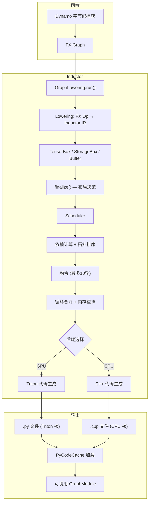

**关键文件索引**：

| 组件 | 文件 |
|------|------|
| 编译入口 | `torch/_inductor/compile_fx.py` |
| 图降低 | `torch/_inductor/graph.py` |
| IR 定义 | `torch/_inductor/ir.py` |
| 算子降低 | `torch/_inductor/lowering.py` |
| 调度器 | `torch/_inductor/scheduler.py` |
| 虚拟化 | `torch/_inductor/virtualized.py` |
| Triton 代码生成 | `torch/_inductor/codegen/triton.py` |
| C++ 代码生成 | `torch/_inductor/codegen/cpp.py` |
| SIMD 公共 | `torch/_inductor/codegen/simd.py` |
| 公共代码生成 | `torch/_inductor/codegen/common.py` |
| 内存规划 | `torch/_inductor/codegen/memory_planning.py` |
| 内存优化 | `torch/_inductor/memory.py` |
| 自动调优 | `torch/_inductor/autotune_process.py` |
| 算法选择 | `torch/_inductor/select_algorithm.py` |
| 运行时 | `torch/_inductor/runtime/` |

---

## 2. 编译入口 — compile_fx

### 2.1 调用层次

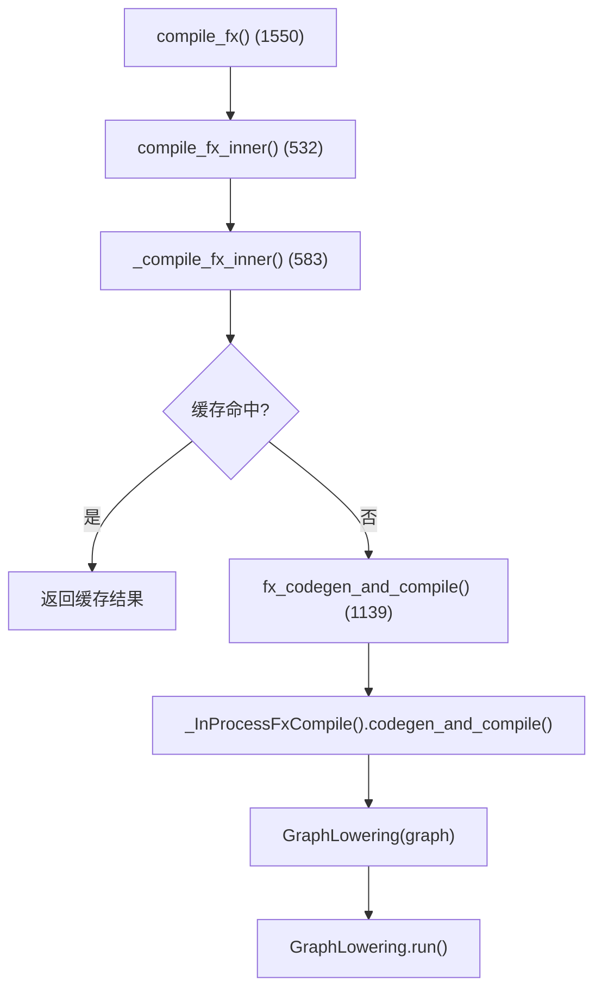

### 2.2 关键函数

| 函数 | 行号 | 说明 |
|------|------|------|
| `compile_fx` | 1550 | 顶层公共 API |
| `compile_fx_inner` | 532 | 包装计时、缓存、调试上下文 |
| `_compile_fx_inner` | 583 | 缓存查找，未命中则调用 `fx_codegen_and_compile` |
| `fx_codegen_and_compile` | 1139 | 委托 `_InProcessFxCompile` |

---

## 3. GraphLowering — FX 图解释器

### 3.1 类结构

`GraphLowering` (`graph.py:284`) 继承 `torch.fx.Interpreter`，遍历 FX 图并将每个节点转为 Inductor IR：

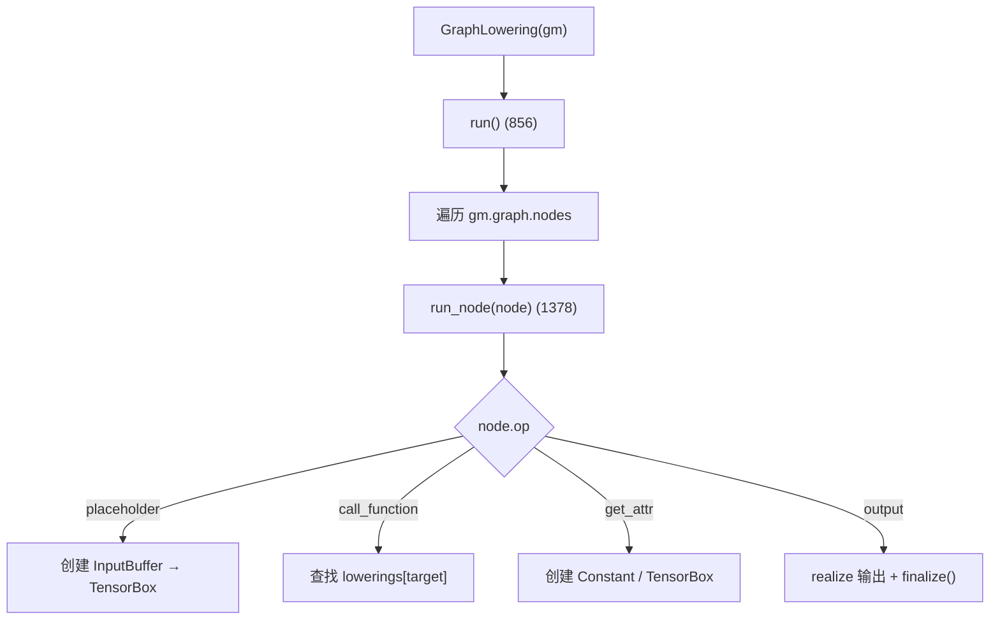

### 3.2 节点处理

**`placeholder()`** (`graph.py:997`)：将 FX 输入转为 `TensorBox(InputBuffer(...))` 或 `TensorBox(DonatedBuffer(...))`，使用 `FixedLayout`。

**`call_function()`** (`graph.py:1075`)：
1. 在 `lowerings` 字典中查找 target
2. 若无降低，调用 `make_fallback()` 创建回退
3. 调用 `lowerings[target](*args, **kwargs)` 生成 Inductor IR

**`get_attr()`** (`graph.py:1157`)：处理常量张量属性，创建 `Constant`、`TensorBox` 或 `TorchBindObject`。

**`output()`** (`graph.py:1205`)：处理图输出，realize 所有输出缓冲区，处理步幅匹配，调用 `self.finalize()`。

### 3.3 run_node — 节点处理主逻辑

`run_node` (`graph.py:1378`) 是核心分发：

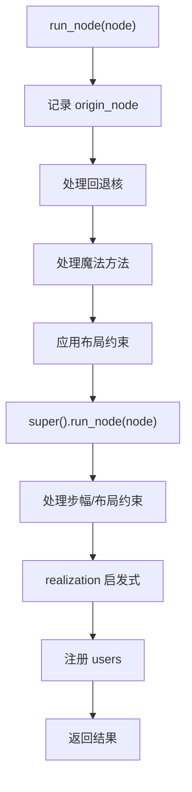

### 3.4 finalize — 布局冻结

`finalize()` (`graph.py:1292`)：遍历所有缓冲区，调用 `buf.decide_layout()` 将 `FlexibleLayout` 冻结为 `FixedLayout`。

### 3.5 codegen — 触发代码生成

`codegen` (`graph.py:1905`)：

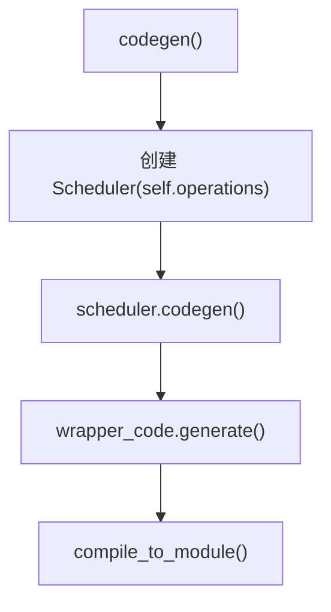

`compile_to_module` (`graph.py:1970`)：调用 `codegen()` 或 `codegen_with_cpp_wrapper()`，写入代码到磁盘（`PyCodeCache.write()`），加载结果模块。

---

## 4. IR 体系

### 4.1 IR 层次结构

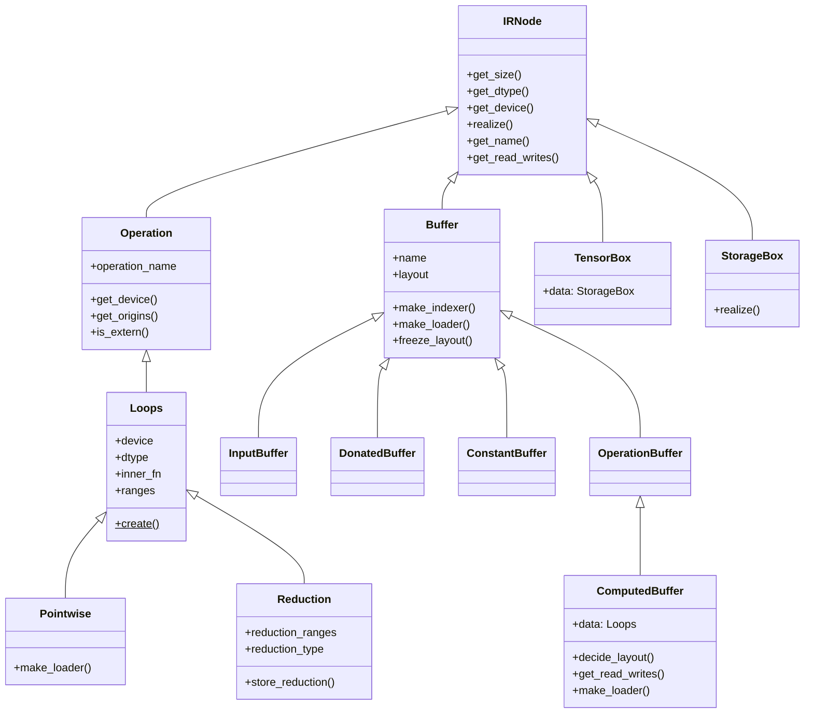

### 4.2 核心抽象

**TensorBox** (`ir.py:6994`)：顶层包装，映射到 `torch.Tensor`。`TensorBox.create(data)` 将数据包装为 `TensorBox(StorageBox(data))`。

**StorageBox** (`ir.py:7000`)：引入布局概念，管理 Buffer 与 Layout 的关系。

**`realize()`** (`ir.py:7012`)：将 `Pointwise`/`Reduction` 转为 `ComputedBuffer`，物化到内存。此操作终止融合机会但允许多个读者。

### 4.3 计算节点

**Pointwise** (`ir.py:874`)：逐元素计算，无归约。`make_loader()` 返回 `self.inner_fn`。

**Reduction** (`ir.py:1028`)：归约计算，增加 `reduction_ranges`、`reduction_type`、`src_dtype`、`reduction_hint`。

**ComputedBuffer** (`ir.py:3900`)：核心计算缓冲区，组合 `Buffer` 和 `Operation`：
- `decide_layout()` (`ir.py:4019`)：根据步幅分析冻结 `FlexibleLayout`
- `get_read_writes()` (`ir.py:3923`)：提取内存依赖
- `make_loader()` (`ir.py:3962`)：内联 pointwise 操作或回退到 `ops.load()`

### 4.4 Buffer 类型

| 类 | 行号 | 说明 |
|----|------|------|
| `Buffer` | 3695 | 基础缓冲区，管理内存分配 |
| `InputBuffer` | 3833 | 图输入缓冲区，`num_reads()` 返回 1 |
| `DonatedBuffer` | 3838 | 反向传播中可原地复用的输入缓冲区 |
| `ConstantBuffer` | 3848 | 编译时常量缓冲区，支持跨设备 `override_device` |
| `OperationBuffer` | 3817 | 组合 Buffer + Operation |
| `ComputedBuffer` | 3900 | 计算缓冲区，data 为 Loops |

### 4.5 Layout 体系

**Layout** (`ir.py:3157`)：基础布局，含 `device`、`dtype`、`size`、`stride`、`offset`。

**FixedLayout** (`ir.py:3360`)：不可变布局，步幅固定。

**FlexibleLayout** (`ir.py:3378`)：可变布局，支持优化。关键方法：

| 方法 | 行号 | 说明 |
|------|------|------|
| `contiguous_strides` | 3385 | NCHW 连续步幅 |
| `fill_ordered` | 3393 | 按填充顺序的步幅 |
| `stride_ordered` | 3411 | 按步幅顺序（如 NHWC） |
| `as_stride_order` | — | 转为 FixedLayout（步幅序） |
| `as_fill_order` | — | 转为 FixedLayout（填充序） |
| `as_exact_strides` | — | 转为 FixedLayout（精确步幅） |

### 4.6 View 体系

**BaseView** (`ir.py:2415`)：视图 IR 基类，委托给底层 `data`，通过 `make_reindexer()` 和 `make_loader()` 实现重索引。

---

## 5. Lowering — 算子降低

### 5.1 降低注册

`lowerings` (`lowering.py:93`)：全局字典，映射 `OpOverload → lowering 函数`。

`register_lowering` (`lowering.py:465`)：装饰器/注册函数，将函数注册为特定 aten 操作的降低：

```python
@register_lowering(aten.add, type_promotion_kind=...)
def add(x, y, alpha=1):
    ...
```

内部 `_register_lowering` 包装降低函数，添加类型提升、常量提升和广播逻辑。

### 5.2 降低模式

典型降低流程：

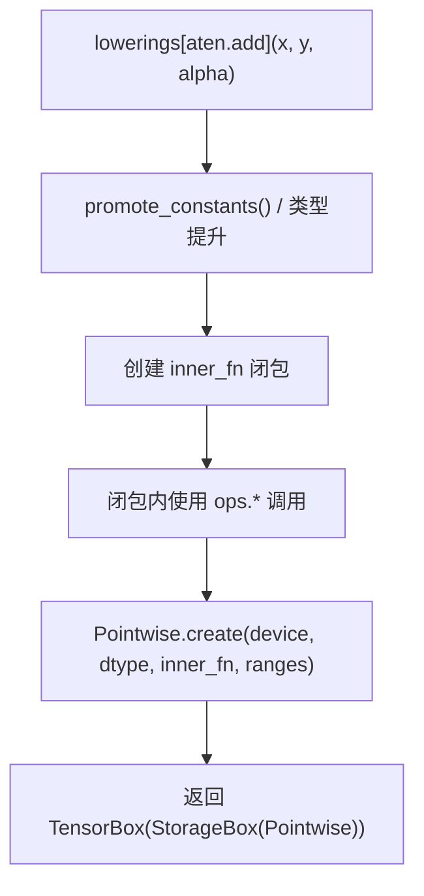

**关键**：降低函数不直接执行计算，而是构建 `inner_fn` 闭包，闭包内通过 `V.ops.*` 调用描述计算。`V.ops` 的具体实现在不同阶段不同（降低时为 `MockHandler`，代码生成时为 `CSEProxy`）。

### 5.3 回退机制

`make_fallback` (`lowering.py:1967`)：为无自定义降低的算子创建回退。包装为 `FallbackKernel`，运行时调用原始 aten 算子。验证不存在分解。

### 5.4 布局约束

| 函数 | 说明 |
|------|------|
| `maybe_layout_constraints` | 根据 op tag 返回布局约束处理器 |
| `constrain_to_fx_strides` | 强制输入匹配 FX 图元数据中的步幅 |
| `require_contiguous` | 强制输入为连续布局 |

---

## 6. Virtualized — 动态作用域

### 6.1 设计思想

`virtualized.py` 提供线程局部动态作用域变量，使同一 IR 可在不同解释下运行。

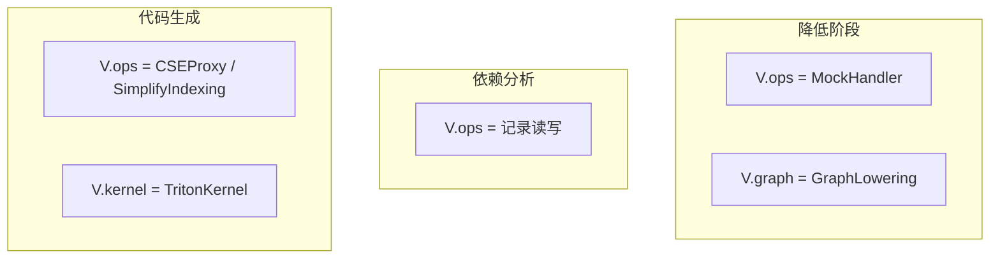

### 6.2 核心组件

| 组件 | 行号 | 说明 |
|------|------|------|
| `Virtualized<T>` | 98 | 泛型线程局部变量重定向类 |
| `V` | 385 | 单例 `_V` 实例，访问所有虚拟化全局变量 |
| `ops` | 309 | `OpsWrapper` 实例，调用当前 ops handler |
| `OpsValue` | 189 | ops 调用的返回类型，重载算术运算符 |

**V 的全局变量**：

| 变量 | 行号 | 说明 |
|------|------|------|
| `V.graph` | 341 | 当前 `GraphLowering` |
| `V.ops` | 336 | 当前 ops handler |
| `V.kernel` | 356 | 当前生成的核 |
| `V.fake_mode` | 349 | 当前 FakeTensorMode |
| `V.debug` | 362 | 调试上下文 |
| `V.interpreter` | 366 | 当前解释器 shim |
| `V.choices` | 381 | 当前 `InductorChoices` |

### 6.3 OpsValue — 流式数学表达式

`OpsValue` (`virtualized.py:189`) 重载 `__add__`、`__mul__` 等运算符，使数学表达式自然编写：

```python
# 无需: ops.add(ops.mul(x, y), z)
# 可以: x * y + z  （OpsValue 自动链式调用 ops）
```

---

## 7. Scheduler — 调度与融合

### 7.1 Scheduler 初始化

`Scheduler` (`scheduler.py:1888`) 接收 IR 操作，执行完整的调度管线：

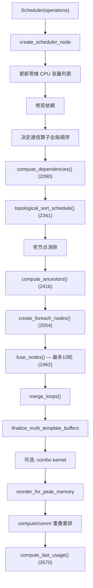

### 7.2 调度节点类型

| 类 | 行号 | 说明 |
|----|------|------|
| `BaseSchedulerNode` | 177 | 基类 |
| `SchedulerNode` | 945 | 包装 `ComputedBuffer`/`TemplateBuffer`，计算大小、循环体、读写依赖 |
| `FusedSchedulerNode` | 1238 | 融合节点组，维护未满足依赖的并集 |
| `ExternKernelSchedulerNode` | 921 | 包装 `ExternKernel`（如 cuBLAS 调用） |
| `NopKernelSchedulerNode` | 938 | 包装空操作 |
| `SchedulerBuffer` | 75 | 缓冲区调度信息 |

### 7.3 融合逻辑

**`fuse_nodes`** (`scheduler.py:2462`)：最多 10 轮调用 `fuse_nodes_once()`。

**`fuse_nodes_once`** (`scheduler.py:2776`)：

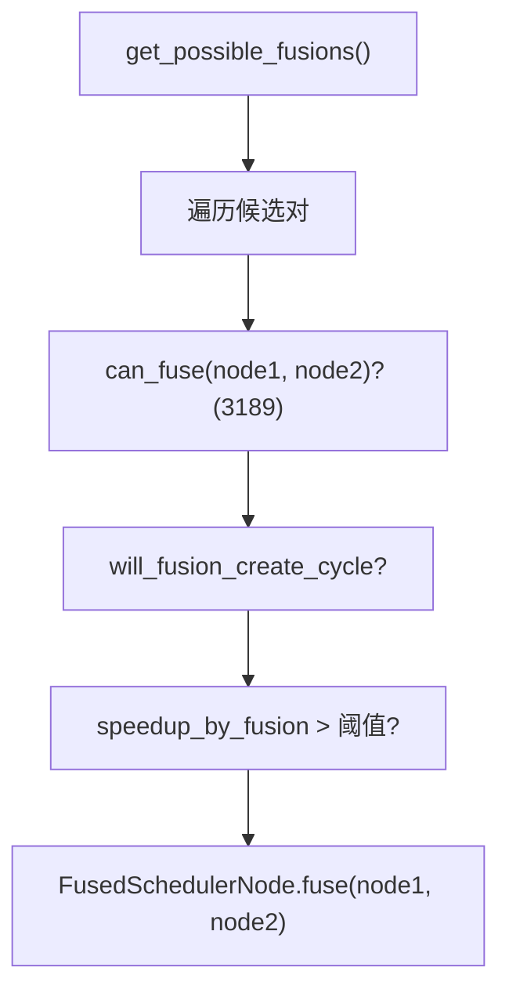

**`can_fuse`** (`scheduler.py:3189`) 验证融合合法性：
- 两个节点不能都是 extern/nop（模板除外）
- node2 不能是 node1 的祖先
- 模板序言融合限制
- 委托后端特定规则：`SIMDScheduling.can_fuse()` / `TritonScheduling.can_fuse()`

### 7.4 代码生成调度

**`Scheduler.codegen`** (`scheduler.py:3677`)：遍历 `self.nodes`，根据类型分发：

| 节点类型 | 调用 |
|----------|------|
| 模板节点 | `backend.codegen_template()` |
| 外部核 | `self.codegen_extern_call()` (`scheduler.py:3604`) |
| foreach 节点 | `backend.codegen_combo_kernel()` |
| 融合/调度节点 | `backend.codegen_node()` |
| nop 节点 | `node.mark_run()` |

### 7.5 BaseScheduling

`BaseScheduling` (`scheduler.py:3891`)：后端调度抽象基类，定义 `can_fuse_vertical()`、`can_fuse_horizontal()`、`fuse()`、`codegen_node()`、`codegen_template()`、`codegen_sync()`、`ready_to_flush()`。

---

## 8. 代码生成

### 8.1 Triton GPU 代码生成

`TritonKernel` (`codegen/triton.py:1534`) 继承 `SIMDKernel`，生成 Triton 核函数：

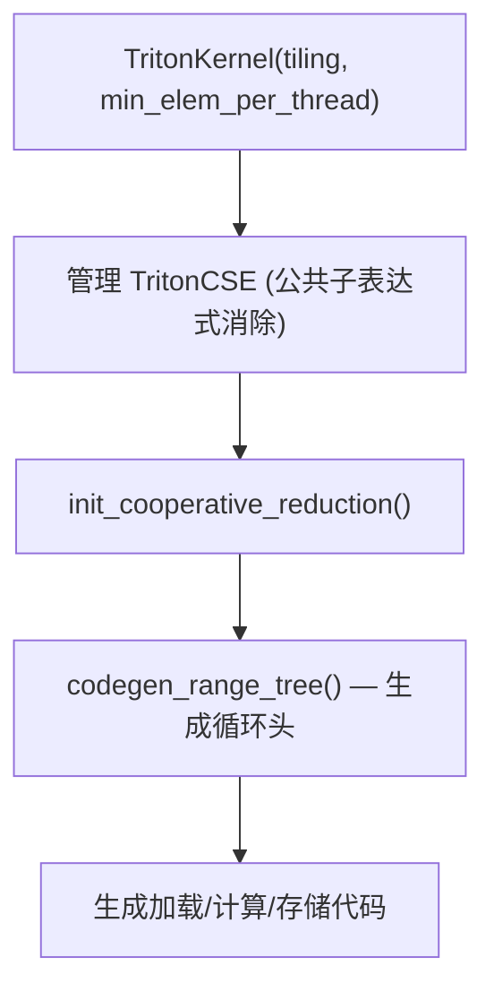

**TritonScheduling** (`codegen/triton.py:3802`) 继承 `SIMDScheduling`：
- `define_kernel()` (`codegen/triton.py:3871`)：生成核名，写入 `.py` 文件
- 后端特性：`FOREACH`、`BUCKETIZE`、`INPLACE_BUFFERS`、`TRITON_TEMPLATES` 等

**TritonPrinter** (`codegen/triton.py:532`)：自定义 sympy 打印器，生成 Triton 语法。

### 8.2 C++ CPU 代码生成

`torch/_inductor/codegen/cpp.py` 生成 C++ 循环嵌套：
- OpenMP 并行
- 向量化操作（`cpu_vec_isa`）
- 归约操作的组合函数

### 8.3 公共代码生成基础设施

**Kernel** (`codegen/common.py:1631`)：核生成基类，含 `CSEProxy` (`common.py:1819`) 用于公共子表达式消除。

**KernelArgs** (`codegen/common.py:1126`)：管理核参数（TensorArg、SizeArg、WorkspaceArg）。

**SIMDKernel** (`codegen/simd.py:336`)：Triton/Halide 公共基类，使用扁平索引而非循环嵌套：
- `range_trees`：层次迭代结构（x, y, z, r0, r1）
- `simplify_indexing()`：基于 CSE 的索引简化
- `construct_range_trees()`：构建迭代层次

**SIMDScheduling** (`codegen/simd.py:1039`)：公共调度逻辑：
- `can_fuse()` (`codegen/simd.py:1049`)：后端特定融合规则
- `group_fn()` (`codegen/simd.py:1046`)：将大小分组为迭代描述符
- `select_tiling()`：选择融合核的分块策略

**DeferredLine** (`codegen/common.py:1075`)：延迟代码行，允许核名和缓冲区地址的后期绑定。

---

## 9. Autotuning — 自动调优

### 9.1 调优流程

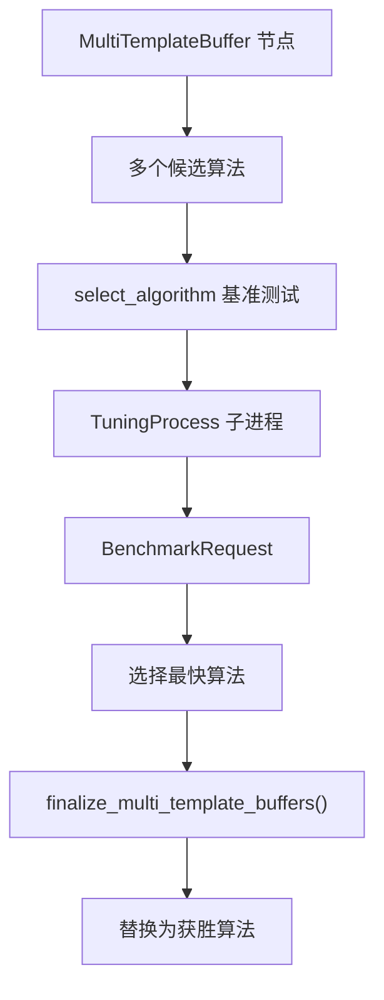

### 9.2 核心组件

**TuningProcess** (`autotune_process.py:99`)：在子进程中启动基准测试的抽象：
- `process_main()` (`autotune_process.py:112`)：子进程入口
- `workloop()` (`autotune_process.py:129`)：从队列处理基准测试请求

**TritonTemplateCaller** (`select_algorithm.py:1285`)：继承 `ir.TritonTemplateCallerBase`，代表使用 Triton 模板核的候选算法。

**ExternKernelCaller** (`select_algorithm.py:1375`)：代表使用外部核（如 cuBLAS、aten）的候选算法。

### 9.3 Triton 启发式

Triton 核的自动调优选择分块大小（XBLOCK、YBLOCK 等），由 `TritonScheduling` 和 `torch/_inductor/runtime/triton_heuristics.py` 中的启发式规则驱动。

---

## 10. 内存规划

### 10.1 MemoryPlanner

`MemoryPlanner` (`codegen/memory_planning.py:604`) 在 wrapper 代码生成期间协调内存规划：

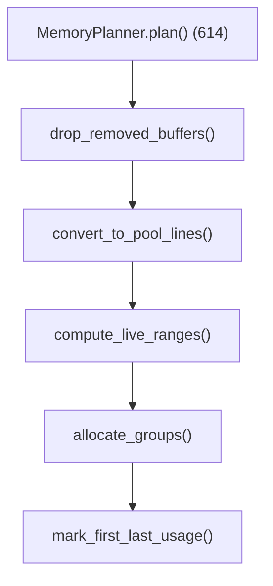

### 10.2 核心抽象

| 类 | 行号 | 说明 |
|----|------|------|
| `LiveRange` | 29 | 张量活跃的时间范围（左闭右开） |
| `LiveRanges` | 53 | 非重叠 LiveRange 集合，用于重叠检测 |
| `AllocationPool` | 363 | 单次 `torch.empty()` 生成的分配池 |
| `Allocation` | 129 | 分配池中特定节点的内存分配 |
| `TemporalSplit` | 236 | 时间不重叠的分配（时分复用） |
| `SpatialSplit` | 317 | 空间不重叠的分配（池内空间分割） |
| `BufferGroup` | 505 | 共享底层内存的缓冲区组（原地复用） |

### 10.3 峰值内存优化

`reorder_for_peak_memory` (`memory.py:581`)：重排调度节点以最小化峰值内存。在 `config.reorder_for_peak_memory` 启用时由 `Scheduler._init()` 调用。

**辅助数据结构**：

| 类 | 行号 | 说明 |
|----|------|------|
| `MemoryPlanningInfoForBuffer` | 26 | 每个缓冲区的分配/释放大小和后继节点 |
| `MemoryPlanningInfoForNode` | 35 | 每个调度节点的索引、大小、前驱/后继 |
| `get_freeable_input_buf` | 63 | 标识执行期间可释放的输入缓冲区 |

---

## 11. 端到端编译流程

以 `y = x @ W + b` 为例：

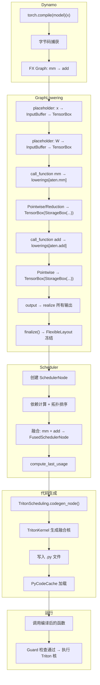

---

## 12. 设计权衡

### 12.1 延迟物化 vs 立即物化

- **延迟物化**（当前）：Pointwise/Reduction 以闭包形式存在，可被融合
- **立即物化**：每个操作立即生成 ComputedBuffer
- **选择延迟**：保持融合机会，`StorageBox.realize()` 在必要时才物化

### 12.2 FlexibleLayout vs FixedLayout

- **FlexibleLayout**：允许步幅优化，在 finalize 时决策
- **FixedLayout**：步幅固定，无优化空间
- **权衡**：FlexibleLayout 增加复杂度但允许生成更高效的内存访问模式

### 12.3 融合轮数上限

- **10 轮**（当前）：`fuse_nodes()` 最多迭代 10 次
- **无上限**：可能收敛慢或死循环
- **权衡**：10 轮对大多数模型足够，避免极端情况

### 12.4 子进程 Autotuning

- **子进程**（当前）：`TuningProcess` 在子进程中运行基准测试
- **进程内**：更简单但可能影响主进程
- **选择子进程**：隔离基准测试噪声，避免干扰主进程

### 12.5 Virtualized 动态作用域

- **动态作用域**（当前）：`V.ops`、`V.graph` 等通过线程局部变量切换
- **显式传参**：将 handler 作为参数传递
- **权衡**：动态作用域使 lowering 代码更简洁（无需传递 handler），但增加隐式依赖

### 12.6 代码生成 vs JIT 编译

- **文件写入**（当前）：生成 `.py`/`.cpp` 文件，由 `PyCodeCache` 加载
- **JIT 编译**：运行时直接编译
- **选择文件写入**：便于调试（可查看生成代码），支持缓存复用

---

## 附录：关键代码行号参考

| 内容 | 文件 | 行号 |
|------|------|------|
| compile_fx | `compile_fx.py` | 1550 |
| compile_fx_inner | `compile_fx.py` | 532 |
| fx_codegen_and_compile | `compile_fx.py` | 1139 |
| GraphLowering | `graph.py` | 284 |
| GraphLowering.run | `graph.py` | 856 |
| GraphLowering.run_node | `graph.py` | 1378 |
| GraphLowering.call_function | `graph.py` | 1075 |
| GraphLowering.placeholder | `graph.py` | 997 |
| GraphLowering.get_attr | `graph.py` | 1157 |
| GraphLowering.output | `graph.py` | 1205 |
| GraphLowering.finalize | `graph.py` | 1292 |
| GraphLowering.codegen | `graph.py` | 1905 |
| compile_to_module | `graph.py` | 1970 |
| IRNode | `ir.py` | 424 |
| Operation | `ir.py` | 668 |
| Loops | `ir.py` | 738 |
| Pointwise | `ir.py` | 874 |
| Reduction | `ir.py` | 1028 |
| Buffer | `ir.py` | 3695 |
| InputBuffer | `ir.py` | 3833 |
| DonatedBuffer | `ir.py` | 3838 |
| ConstantBuffer | `ir.py` | 3848 |
| ComputedBuffer | `ir.py` | 3900 |
| TensorBox | `ir.py` | 6994 |
| StorageBox | `ir.py` | 7000 |
| BaseView | `ir.py` | 2415 |
| Layout | `ir.py` | 3157 |
| FixedLayout | `ir.py` | 3360 |
| FlexibleLayout | `ir.py` | 3378 |
| lowerings 字典 | `lowering.py` | 93 |
| register_lowering | `lowering.py` | 465 |
| make_fallback | `lowering.py` | 1967 |
| Scheduler | `scheduler.py` | 1888 |
| SchedulerNode | `scheduler.py` | 945 |
| FusedSchedulerNode | `scheduler.py` | 1238 |
| ExternKernelSchedulerNode | `scheduler.py` | 921 |
| SchedulerBuffer | `scheduler.py` | 75 |
| BaseSchedulerNode | `scheduler.py` | 177 |
| fuse_nodes | `scheduler.py` | 2462 |
| fuse_nodes_once | `scheduler.py` | 2776 |
| can_fuse | `scheduler.py` | 3189 |
| codegen | `scheduler.py` | 3677 |
| compute_dependencies | `scheduler.py` | 2090 |
| topological_sort_schedule | `scheduler.py` | 2341 |
| compute_ancestors | `scheduler.py` | 2416 |
| compute_last_usage | `scheduler.py` | 3570 |
| BaseScheduling | `scheduler.py` | 3891 |
| TritonKernel | `codegen/triton.py` | 1534 |
| TritonScheduling | `codegen/triton.py` | 3802 |
| TritonPrinter | `codegen/triton.py` | 532 |
| SIMDKernel | `codegen/simd.py` | 336 |
| SIMDScheduling | `codegen/simd.py` | 1039 |
| Kernel | `codegen/common.py` | 1631 |
| KernelArgs | `codegen/common.py` | 1126 |
| DeferredLine | `codegen/common.py` | 1075 |
| MemoryPlanner | `codegen/memory_planning.py` | 604 |
| AllocationPool | `codegen/memory_planning.py` | 363 |
| TemporalSplit | `codegen/memory_planning.py` | 236 |
| SpatialSplit | `codegen/memory_planning.py` | 317 |
| reorder_for_peak_memory | `memory.py` | 581 |
| TuningProcess | `autotune_process.py` | 99 |
| TritonTemplateCaller | `select_algorithm.py` | 1285 |
| ExternKernelCaller | `select_algorithm.py` | 1375 |
| V / _V | `virtualized.py` | 385 / 312 |
| ops / OpsWrapper | `virtualized.py` | 309 / 275 |
| OpsValue | `virtualized.py` | 189 |
| Virtualized | `virtualized.py` | 98 |
