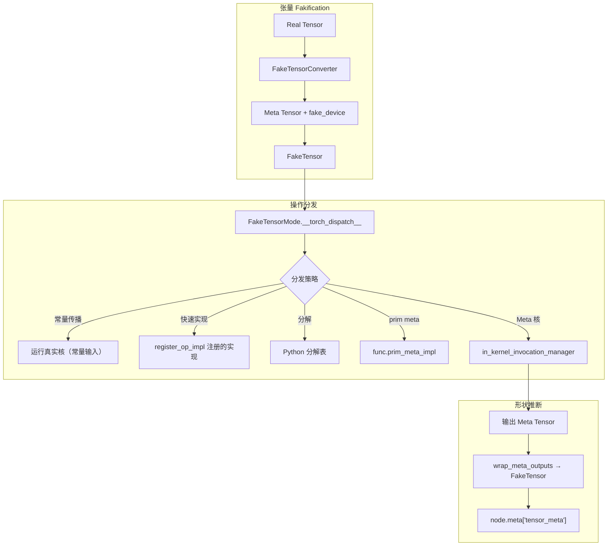
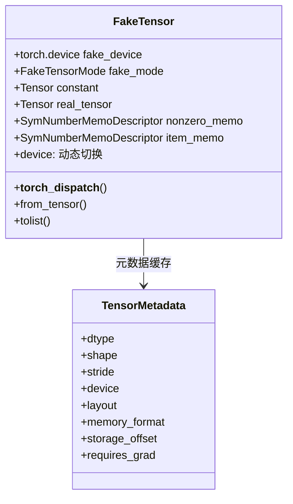
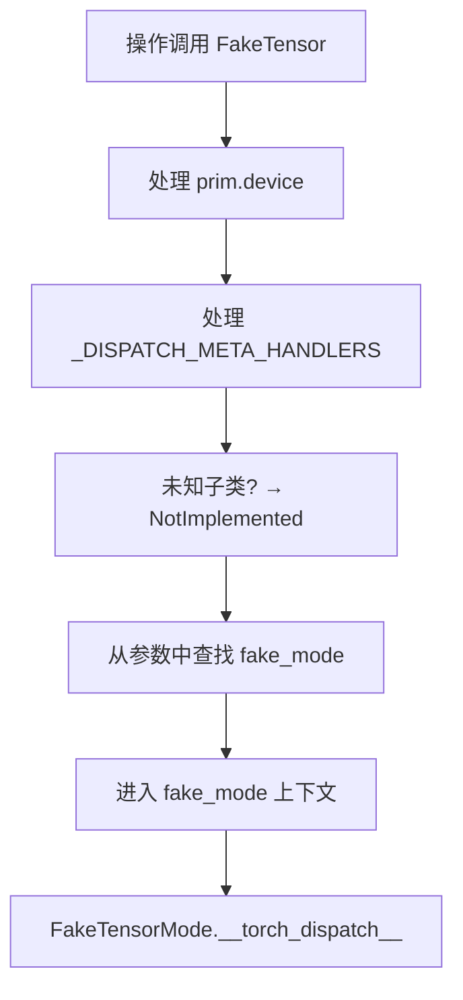
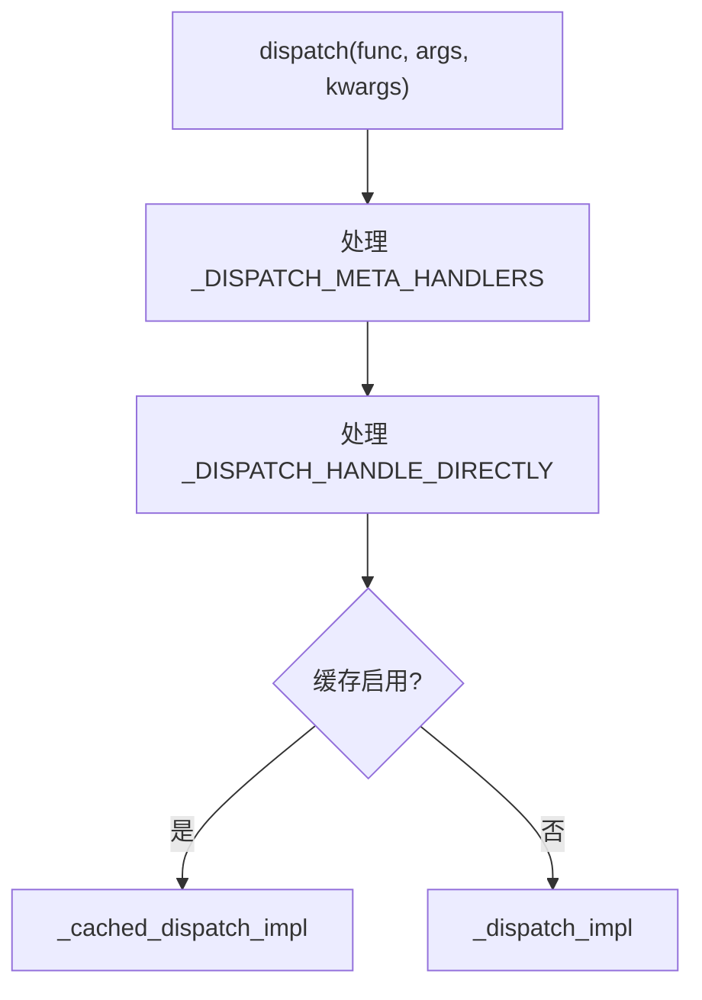
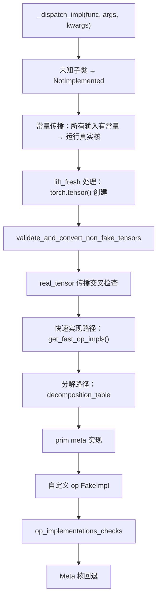
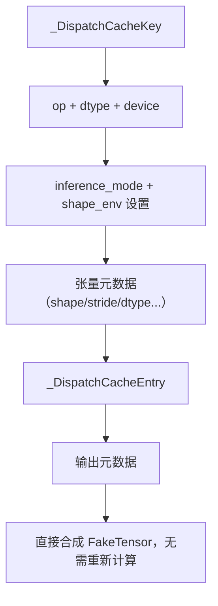
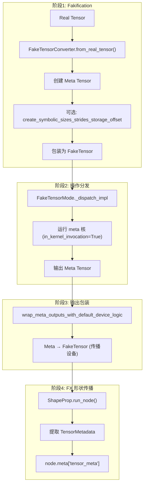
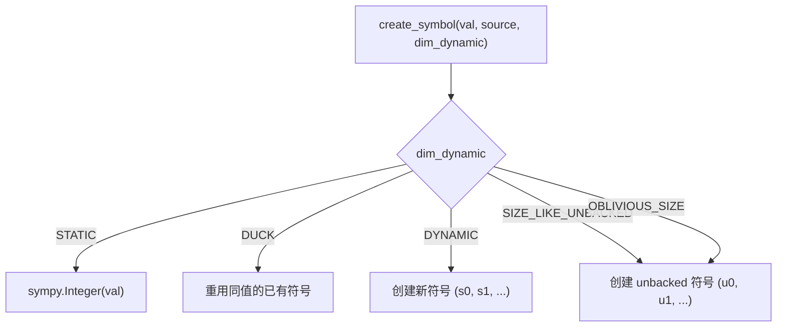
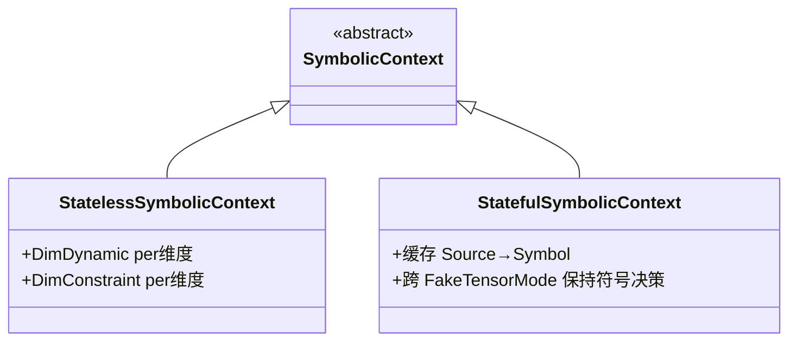

# 13 - FakeTensor 与形状推断

> FakeTensor 是 PyTorch 的无数据张量模拟器，在不执行实际计算的情况下
> 推断张量的形状、数据类型和设备。它是 Dynamo、Inductor 和
> 动态形状系统的基础设施。

---

## 目录

1. [架构概览](#1-架构概览)
2. [FakeTensor — 无数据张量](#2-faketensor--无数据张量)
3. [FakeTensorMode — 操作拦截](#3-faketensormode--操作拦截)
4. [调度缓存](#4-调度缓存)
5. [形状推断管线](#5-形状推断管线)
6. [SymInt 与符号形状](#6-symint-与符号形状)
7. [ShapeEnv — 符号形状环境](#7-shapeenv--符号形状环境)
8. [Dynamo/Inductor 中的 FakeTensor](#8-dynamoinductor-中的-faketensor)
9. [辅助子系统](#9-辅助子系统)
10. [设计权衡](#10-设计权衡)

---

## 1. 架构概览

FakeTensor 在编译管线中的角色：



**关键文件索引**：

| 组件 | 文件 |
|------|------|
| FakeTensor 核心 | `torch/_subclasses/fake_tensor.py` |
| FakeTensor 工具 | `torch/_subclasses/_fake_tensor_utils.py` |
| FakeTensor 辅助 | `torch/_subclasses/fake_utils.py` |
| Fake 快速实现 | `torch/_subclasses/fake_impls.py` |
| FunctionalTensor | `torch/_subclasses/functional_tensor.py` |
| Meta 工具 | `torch/_subclasses/meta_utils.py` |
| 符号形状 | `torch/fx/experimental/symbolic_shapes.py` |
| SymNode | `torch/fx/experimental/sym_node.py` |
| Sympy 符号 | `torch/utils/_sympy/symbol.py` |
| 形状传播 | `torch/fx/passes/shape_prop.py` |
| C++ SymInt | `c10/core/SymInt.h` |

---

## 2. FakeTensor — 无数据张量

### 2.1 类结构

`FakeTensor` (`fake_tensor.py:611`) 继承 `torch.Tensor`，内部持有 meta tensor 但携带 `fake_device` 以建模设备传播：



### 2.2 双设备技巧

`device` 属性 (`fake_tensor.py:641`) 根据上下文返回不同设备：

| 上下文 | 返回值 | 原因 |
|--------|--------|------|
| `in_kernel_invocation=True`（核内） | `torch.device("meta")` | 核函数将张量视为 meta |
| 其他 | `fake_device` | 用户代码 `x.is_cuda` 等正确工作 |

### 2.3 构造

`__new__` (`fake_tensor.py:679`)：使用 `Tensor._make_subclass(cls, elem, ...)` 创建子类，`elem` 为 meta tensor。关键参数：
- `device_for_backend_keys=device`：更新 dispatch key 以反映 fake device
- `dispatch_device=True`：确保设备特定分派路由正确

`from_tensor` (`fake_tensor.py:761`)：静态方法，委托 `fake_mode.from_tensor(t)`。

### 2.4 __torch_dispatch__ 拦截

`__torch_dispatch__` (`fake_tensor.py:764`) 是第一层拦截：



### 2.5 TensorMetadata

`TensorMetadata` (`fake_tensor.py:929`) 数据类，缓存张量元数据：

| 字段 | 说明 |
|------|------|
| dtype | 数据类型 |
| shape | 形状（含 SymInt） |
| stride | 步幅 |
| device | 设备 |
| layout | 内存布局 |
| memory_format | 内存格式 |
| storage_offset | 存储偏移 |
| requires_grad | 是否需要梯度 |

`_flatten_into` 方法序列化元数据用于哈希计算。

---

## 3. FakeTensorMode — 操作拦截

### 3.1 类结构

`FakeTensorMode` (`fake_tensor.py:1104`) 继承 `TorchDispatchMode`，`_mode_key = FAKE`（基础设施模式，更低调度优先级）。

**类级状态**：

| 字段 | 说明 |
|------|------|
| `cache` | 类级别调度缓存（无 ShapeEnv 时共享） |
| `cache_hits/misses` | 缓存统计 |
| `epoch` | 重追踪时递增，使未支撑备忘失效 |

**实例属性** (`fake_tensor.py:1112-1126`)：

| 字段 | 说明 |
|------|------|
| `in_kernel_invocation` | 是否在核调用内 |
| `static_shapes` | 是否使用静态形状 |
| `shape_env` | 符号形状环境 |
| `allow_meta` | 是否允许 meta tensor 直接转换 |
| `allow_non_fake_inputs` | 是否允许混合真实和 fake tensor |

### 3.2 上下文管理

**`__enter__`** (`fake_tensor.py:1282`)：处理 fake mode 栈叠。若已激活则 no-op，否则推入栈并激活。

**`__exit__`** (`fake_tensor.py:1302`)：弹出栈，恢复前一个 fake mode。

### 3.3 dispatch — 主分发入口

`dispatch` (`fake_tensor.py:1788`)：



### 3.4 _dispatch_impl — 核心分发逻辑

`_dispatch_impl` (`fake_tensor.py:1974`) 是一个大型方法，实现完整的分发策略链：



**各路径说明**：

| 优先级 | 路径 | 行号 | 说明 |
|--------|------|------|------|
| 1 | 未知子类检查 | 1991-1999 | 返回 NotImplemented |
| 2 | 常量传播 | 2010-2111 | 所有输入有常量时运行真实核 |
| 3 | lift_fresh | 2047-2051 | `torch.tensor()` 创建的张量转换 |
| 4 | 输入验证 | 2068-2070 | 自动转换真实张量为 fake |
| 5 | 真实张量交叉检查 | 2148-2175 | propagate_real_tensors 模式 |
| 6 | 快速实现 | 2268-2271 | register_op_impl 注册的实现 |
| 7 | 分解路径 | 2273-2298 | Python 分解表 |
| 8 | prim meta | 2300-2314 | func.prim_meta_impl |
| 9 | 自定义 FakeImpl | 2339-2348 | 用户注册的 FakeImpl 核 |
| 10 | Meta 核回退 | 2376-2396 | 最后手段：运行 meta 核 |

### 3.5 in_kernel_invocation_manager

`in_kernel_invocation_manager` (`fake_tensor.py:502`)：上下文管理器，在核执行期间设置 `in_kernel_invocation=True`，使 FakeTensor 的 `device` 属性返回 `meta`。

### 3.6 回退核

`run_fallback_kernel` (`fake_tensor.py:2624`)：当无 meta 核时回退到真实核：
1. 将 fake tensor 转为真实零填充张量
2. 运行实际核
3. 将真实输出转回 FakeTensor

---

## 4. 调度缓存

### 4.1 缓存结构



| 类 | 行号 | 说明 |
|----|------|------|
| `_DispatchCacheKey` | 1014 | 可哈希的缓存键 |
| `_DispatchCacheEntryOutputInfo` | 1040 | 单个输出的元数据 |
| `_DispatchCacheEntry` | 1059 | 缓存条目 |

### 4.2 缓存流程

`_cached_dispatch_impl` (`fake_tensor.py:1348`)：
1. 构建 `_cache_key` (`fake_tensor.py:1391`)
2. 查询缓存
3. 命中：合成 FakeTensor（不运行 meta 核）
4. 未命中：运行 `_dispatch_impl`，存入缓存

有 ShapeEnv 时每个 ShapeEnv 有独立缓存；无 ShapeEnv 时类级别共享。

---

## 5. 形状推断管线

### 5.1 四阶段流程



### 5.2 FakeTensorConverter

`FakeTensorConverter` (`fake_tensor.py:266`)：管理真实张量到 FakeTensor 的转换，维护 memo 避免重复转换。

`from_real_tensor` (`fake_tensor.py:331`)：
1. 检查 memo（已转换的跳过）
2. 查找 `symbolic_context`（从 TracingContext）
3. 使用 `MetaConverter` 创建 meta tensor
4. 若有 `shape_env`，调用 `create_symbolic_sizes_strides_storage_offset` 引入符号尺寸
5. 包装为 `FakeTensor(fake_mode, meta_t, device)`

`from_meta_and_device` (`fake_tensor.py:475`)：从 meta tensor 和设备创建 FakeTensor。

### 5.3 ShapeProp

`ShapeProp` (`shape_prop.py:85`) 继承 `torch.fx.Interpreter`：
- `__init__` (`shape_prop.py:132`)：创建 fake module
- `run_node` (`shape_prop.py:156`)：在 fake_mode 下执行节点，提取 `TensorMetadata` 存入 `node.meta["tensor_meta"]`
- `propagate` (`shape_prop.py:193`)：将真实输入转为 fake，运行整个图

---

## 6. SymInt 与符号形状

### 6.1 C++ SymInt

`SymInt` (`c10/core/SymInt.h:35`)：C++ 符号整数，使用紧凑的单字表示：
- 若值为常量，直接存储 `int64_t`
- 若为符号，存储指向 `SymNode` 的指针

### 6.2 Python SymNode

`SymNode` (`sym_node.py:66`)：Python 端的符号节点：

| 属性 | 行号 | 说明 |
|------|------|------|
| `_expr` | 81 | sympy 表达式 |
| `shape_env` | — | 所属 ShapeEnv |
| `pytype` | — | `int`/`float`/`bool` |
| `_hint` | — | 当前追踪的具体值 |
| `constant` | — | 不变常量（仅文字设置） |
| `fx_node` | — | FX 节点（翻译验证） |

**关键方法**：

| 方法 | 行号 | 说明 |
|------|------|------|
| `expr` 属性 | 183 | 返回 `shape_env.replace(self._expr)` |
| `has_hint` | 190 | 是否有可用具体值 |
| `require_hint` | 193 | 返回 hint，无则报错 |
| `guard_int/float/bool` | 489-518 | 安装守卫 |

### 6.3 Backed vs Unbacked SymInt

| 类型 | 前缀 | hint | 来源 | 限制 |
|------|------|------|------|------|
| Backed | `s` | 有 | 追踪时已知维度 | 可用于大多数操作 |
| Unbacked | `u` | 无 | 数据依赖操作（`.item()`, `nonzero()`） | 需要具体值时必须安装守卫 |

### 6.4 符号命名约定

`SymT` (`symbol.py:21`) 定义符号类型前缀：

| 类型 | 前缀 | 说明 |
|------|------|------|
| `SIZE` | `s` | Backed 符号尺寸 |
| `UNBACKED_INT` | `u` | Unbacked 符号整数 |
| `FLOAT` | `zf` | 符号浮点数 |
| Inductor 专用 | `TMP`, `INDEX`, `XBLOCK` 等 | 内部使用 |

---

## 7. ShapeEnv — 符号形状环境

### 7.1 类结构

`ShapeEnv` (`symbolic_shapes.py:3014`) 是符号形状推理的核心，管理符号变量、约束和守卫。

**核心状态** (`_init`, `symbolic_shapes.py:3088`)：

| 字段 | 行号 | 说明 |
|------|------|------|
| `settings` | 3132 | `ShapeEnvSettings` — 影响 FakeTensor 分发的设置 |
| `guards` | 3144 | 收集的守卫列表 |
| `var_to_val` | 3148 | 符号 → 具体值映射 |
| `var_to_range` | 3160 | 符号 → 值范围映射 |
| `var_to_sources` | 3163 | 符号 → 源位置映射 |
| `source_to_var` | 3166 | 源名 → 原始符号映射 |
| `replacements` | 3169 | 符号替换（等式守卫产生） |
| `divisible` | 3174 | 已知可整除的表达式集合 |
| `deferred_runtime_asserts` | 3213 | unbacked 符号的运行时断言 |
| `pending_fresh_unbacked_symbols` | 3251 | 尚未绑定的 unbacked 符号 |

### 7.2 符号创建

`create_symbol` (`symbolic_shapes.py:4273`)：



**DimDynamic 枚举** (`symbolic_shapes.py:1470`)：

| 值 | 说明 |
|----|------|
| `DYNAMIC` (0) | 始终符号化 |
| `DUCK` (1) | 符号化，同值维度共享符号 |
| `STATIC` (2) | 具体整数 |
| `SIZE_LIKE_UNBACKED` (3) | Unbacked，类尺寸约束 |
| `INFER_STRIDE` (4) | 从尺寸推断步幅 |
| `OBLIVIOUS_SIZE` (5) | Unbacked 但有 hint |

### 7.3 符号化尺寸/步幅

`create_symbolic_sizes_strides_storage_offset` (`symbolic_shapes.py:3775`)：张量符号化的主入口，将具体尺寸替换为 SymInt，尝试用尺寸表达步幅以避免引入新变量。

### 7.4 SymInt/SymFloat 节点创建

| 方法 | 行号 | 说明 |
|------|------|------|
| `create_symintnode` | 4034 | 将 sympy 表达式包装为 SymInt |
| `create_symfloatnode` | 4078 | 将 sympy 表达式包装为 SymFloat |

常量表达式直接返回 `int`，否则创建 `SymInt(SymNode(expr, self, pytype, hint))`。

### 7.5 守卫生成

| 方法 | 行号 | 说明 |
|------|------|------|
| `produce_guards` | 4555 | 生成守卫字符串 |
| `produce_guards_verbose` | 4562 | 详细守卫生成 |

守卫编码追踪期间的假设，运行时检查编译代码是否仍然有效。

### 7.6 表达式求值与简化

| 方法 | 行号 | 说明 |
|------|------|------|
| `simplify` | 5632 | 利用约束、替换和可整除信息简化表达式 |
| `_maybe_evaluate_static` | 5522 | 尝试静态求值（不引入守卫） |
| `size_hint` | 5680 | 返回具体 hint 值（缓存，不引入守卫） |
| `evaluate_expr` | 6340 | 求值表达式（必要时引入守卫） |
| `replace` | 5605 | 应用替换到表达式 |

### 7.7 约束类型

| 类 | 行号 | 说明 |
|----|------|------|
| `StrictMinMaxConstraint` | 1529 | 约束维度在 `[lower, upper]` 范围 |
| `RelaxedUnspecConstraint` | 1557 | 无显式约束，推断决定 |

### 7.8 SymbolicContext 层次



---

## 8. Dynamo/Inductor 中的 FakeTensor

### 8.1 Dynamo 的 FakeTensorMode

`OutputGraph` (`output_graph.py:333`) 创建 FakeTensorMode：

```python
fake_mode = torch._subclasses.FakeTensorMode(
    shape_env=shape_env,
    allow_non_fake_inputs=True if self.export else False,
    export=self.export,
)
```

**后端 fake mode** (`output_graph.py:1382`)：为 AOT Autograd 创建新的 FakeTensorMode，共享同一 ShapeEnv（因追踪期间元数据变异改变 fake tensor 状态，AOT Autograd 需要全新起点）。

### 8.2 deepcopy_to_fake_tensor

`deepcopy_to_fake_tensor` (`torch/_dynamo/utils.py:2358`)：在 `FakeCopyMode` 下执行 `copy.deepcopy`，将真实张量转为 fake。

`FakeCopyMode` (`fake_tensor.py:2691`)：`TorchFunctionMode` 拦截 `clone` 和 `__deepcopy__`，用 `fake_mode.from_tensor` 转换。

### 8.3 Inductor 的形状使用

Inductor 使用 `node.meta["tensor_meta"]`（由 ShapeProp 填充）确定核代码生成的输出形状。ShapeEnv 的符号尺寸流入 Inductor 的调度和代码生成。

---

## 9. 辅助子系统

### 9.1 fake_impls — 快速 Fake 实现

`fake_impls.py` 提供特定算子的优化 fake 实现：

| 组件 | 行号 | 说明 |
|------|------|------|
| `op_implementations_dict` | 42 | 注册的快速实现字典 |
| `register_op_impl` | 127 | 装饰器，注册快速 fake 实现 |
| `has_meta` | 580 | 检查算子是否有 meta 核 |
| `get_fast_op_impls` | 998 | 获取快速实现查找函数 |

### 9.2 fake_utils — 交叉引用与转换

| 组件 | 行号 | 说明 |
|------|------|------|
| `try_convert_fake_to_real` | 104 | Fake → Real 转换 |
| `CrossRefFakeMode` | 205 | 交叉引用测试模式 |

### 9.3 meta_utils — Meta 转换基础

`meta_utils.py` 提供 `MetaConverter`、`MetaTensorDesc`、`MetaStorageDesc`，是 meta tensor 转换的基础设施。

### 9.4 functional_tensor — 函数化

`FunctionalTensor` (`functional_tensor.py`) 用于变异消除（functionalization），将原地操作转为函数式操作。

### 9.5 _fake_tensor_utils — 缓存键辅助

| 组件 | 行号 | 说明 |
|------|------|------|
| `_DeconstructedSymNode` | 22 | SymNode 解构表示 |
| `_CacheKeyState` | 210 | 缓存键状态管理 |

---

## 10. 设计权衡

### 10.1 双设备 vs 单设备

- **双设备**（当前）：`device` 属性根据上下文返回 meta 或 fake_device
- **单设备**：始终返回 fake_device，核内部特殊处理
- **选择双设备**：使现有代码（`x.is_cuda`）无需修改，同时核内部正确处理

### 10.2 调度缓存 vs 无缓存

- **缓存**（当前）：避免重复运行 meta 核
- **无缓存**：每次计算更简单
- **权衡**：缓存在大型模型中显著提速，但增加了内存和复杂度

### 10.3 Duck Shaping vs 完全动态

- **Duck Shaping**（当前，DimDynamic.DUCK）：同值维度共享符号
- **完全动态**：每个维度独立符号
- **权衡**：Duck Shaping 减少符号数量，简化守卫，但假设同值维度行为相同

### 10.4 Unbacked SymInt 的限制

- **严格限制**（当前）：unbacked 符号不能用于需要具体值的操作（除非安装守卫）
- **宽松限制**：允许更多操作但可能产生不安全代码
- **选择严格**：确保编译代码的运行时正确性

### 10.5 常量传播 vs 纯形状推断

- **常量传播**（当前）：所有输入有常量时运行真实核
- **纯形状推断**：仅推断形状，不传播值
- **权衡**：常量传播可优化特定模式但增加复杂度

### 10.6 真实张量交叉检查

- **交叉检查**（propagate_real_tensors）：同时运行真实核，对比结果
- **无检查**：仅运行 meta 核
- **用途**：调试模式验证形状推断正确性

---

## 附录：关键代码行号参考

| 内容 | 文件 | 行号 |
|------|------|------|
| FakeTensor 类 | `fake_tensor.py` | 611 |
| FakeTensor.device 属性 | `fake_tensor.py` | 641 |
| FakeTensor.__new__ | `fake_tensor.py` | 679 |
| FakeTensor.__torch_dispatch__ | `fake_tensor.py` | 764 |
| TensorMetadata | `fake_tensor.py` | 929 |
| _DispatchCacheKey | `fake_tensor.py` | 1014 |
| _DispatchCacheEntry | `fake_tensor.py` | 1059 |
| FakeTensorMode 类 | `fake_tensor.py` | 1104 |
| FakeTensorMode.__init__ | `fake_tensor.py` | 1128 |
| FakeTensorMode.__enter__ | `fake_tensor.py` | 1282 |
| FakeTensorMode.__exit__ | `fake_tensor.py` | 1302 |
| _cached_dispatch_impl | `fake_tensor.py` | 1348 |
| _cache_key | `fake_tensor.py` | 1391 |
| FakeTensorMode.dispatch | `fake_tensor.py` | 1788 |
| _dispatch_impl | `fake_tensor.py` | 1974 |
| wrap_meta_outputs | `fake_tensor.py` | 2469 |
| FakeTensorConverter | `fake_tensor.py` | 266 |
| from_real_tensor | `fake_tensor.py` | 331 |
| from_meta_and_device | `fake_tensor.py` | 475 |
| in_kernel_invocation_manager | `fake_tensor.py` | 502 |
| run_fallback_kernel | `fake_tensor.py` | 2624 |
| FakeCopyMode | `fake_tensor.py` | 2691 |
| _DISPATCH_META_HANDLERS | `fake_tensor.py` | 2763 |
| SymNode 类 | `sym_node.py` | 66 |
| SymNode.expr 属性 | `sym_node.py` | 183 |
| SymNode.has_hint | `sym_node.py` | 190 |
| SymNode.guard_int | `sym_node.py` | 489 |
| ShapeEnv 类 | `symbolic_shapes.py` | 3014 |
| ShapeEnv.__init__ | `symbolic_shapes.py` | 3025 |
| ShapeEnv._init | `symbolic_shapes.py` | 3088 |
| DimDynamic 枚举 | `symbolic_shapes.py` | 1470 |
| StrictMinMaxConstraint | `symbolic_shapes.py` | 1529 |
| StatelessSymbolicContext | `symbolic_shapes.py` | 1744 |
| StatefulSymbolicContext | `symbolic_shapes.py` | 1805 |
| ShapeEnvSettings | `symbolic_shapes.py` | 2980 |
| create_symbolic_sizes_strides_storage_offset | `symbolic_shapes.py` | 3775 |
| create_symintnode | `symbolic_shapes.py` | 4034 |
| create_symfloatnode | `symbolic_shapes.py` | 4078 |
| create_symbol | `symbolic_shapes.py` | 4273 |
| produce_guards | `symbolic_shapes.py` | 4555 |
| simplify | `symbolic_shapes.py` | 5632 |
| _maybe_evaluate_static | `symbolic_shapes.py` | 5522 |
| replace | `symbolic_shapes.py` | 5605 |
| size_hint | `symbolic_shapes.py` | 5680 |
| evaluate_expr | `symbolic_shapes.py` | 6340 |
| SymT 枚举 | `symbol.py` | 21 |
| ShapeProp 类 | `shape_prop.py` | 85 |
| ShapeProp.run_node | `shape_prop.py` | 156 |
| ShapeProp.propagate | `shape_prop.py` | 193 |
| register_op_impl | `fake_impls.py` | 127 |
| get_fast_op_impls | `fake_impls.py` | 998 |
| CrossRefFakeMode | `fake_utils.py` | 205 |
| try_convert_fake_to_real | `fake_utils.py` | 104 |
| SymInt (C++) | `c10/core/SymInt.h` | 35 |