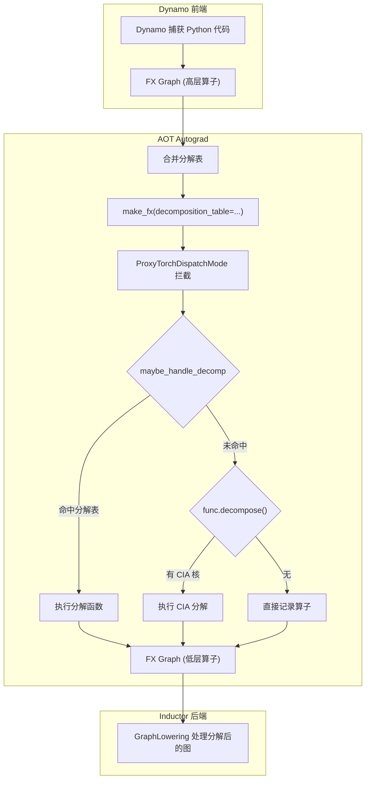
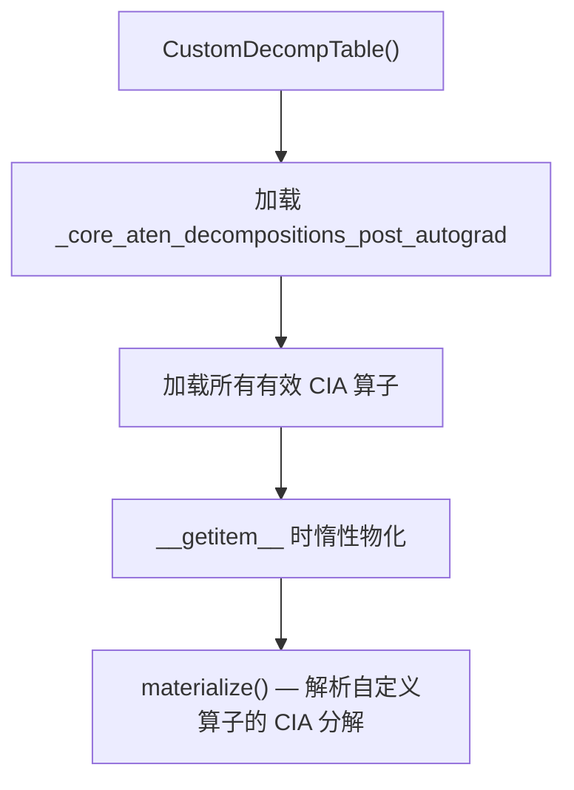
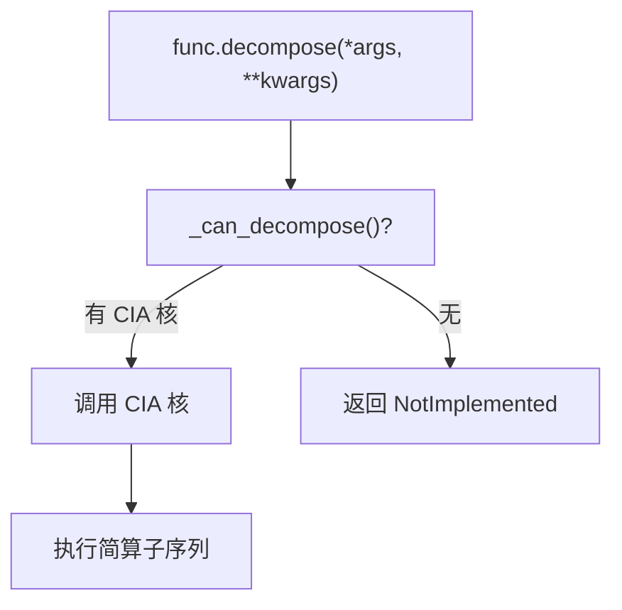
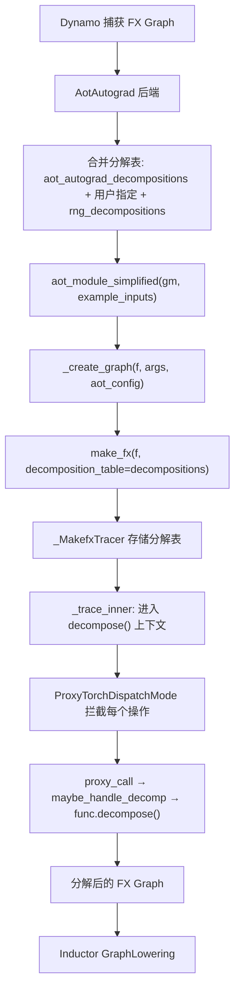
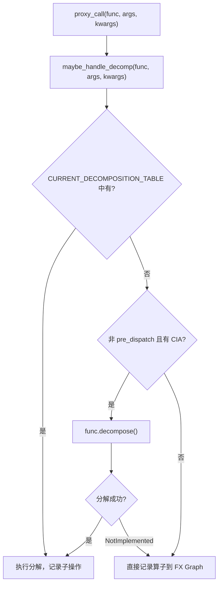
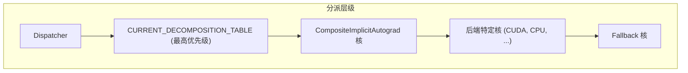

# 14 - 算子分解

> 算子分解将复杂的 ATen 算子拆解为更简单的算子序列，
> 使 FX 图从高层算子（如 `aten.gelu`）转为低层算子（如 `aten.erf` + `aten.exp` + `aten.mul`）。
> 这是 Dynamo → Inductor 管线中的关键预处理步骤。

---

## 目录

1. [架构概览](#1-架构概览)
2. [分解注册表](#2-分解注册表)
3. [注册 API](#3-注册-api)
4. [分解集合](#4-分解集合)
5. [CompositeImplicitAutograd](#5-compositeimplicitautograd)
6. [分解管线 — Dynamo 到 Inductor](#6-分解管线--dynamo-到-inductor)
7. [分解上下文与调度](#7-分解上下文与调度)
8. [典型分解模式](#8-典型分解模式)
9. [Inductor 专用分解](#9-inductor-专用分解)
10. [RNG 分解](#10-rng-分解)
11. [设计权衡](#11-设计权衡)

---

## 1. 架构概览

算子分解在编译管线中的位置：



**关键文件索引**：

| 组件 | 文件 |
|------|------|
| 分解注册 | `torch/_decomp/__init__.py` |
| 分解实现 | `torch/_decomp/decompositions.py` |
| JVP 分解 | `torch/_decomp/decompositions_for_jvp.py` |
| RNG 分解 | `torch/_decomp/decompositions_for_rng.py` |
| Inductor 分解 | `torch/_inductor/decomposition.py` |
| Export 分解 | `torch/export/decomp_utils.py` |
| 追踪分解 | `torch/fx/experimental/proxy_tensor.py` |
| OpOverload.decompose | `torch/_ops.py` |
| AOT Autograd | `torch/_functorch/aot_autograd.py` |
| Dynamo 后端 | `torch/_dynamo/backends/common.py` |

---

## 2. 分解注册表

### 2.1 全局注册表

`global_decomposition_table` (`__init__.py:47-49`)：两级字典结构：

```
global_decomposition_table: Dict[str, Dict[OperatorBase, Callable]]
```

第一级键为分解类型，第二级为算子到分解函数的映射：

| 键 | 别名 | 说明 |
|----|------|------|
| `"post_autograd"` | `decomposition_table` | 自动梯度后应用（标准分解） |
| `"pre_autograd"` | `pre_autograd_decomposition_table` | 自动梯度前应用 |
| `"meta"` | `meta_table` | 用于形状/类型推断 |

### 2.2 CURRENT_DECOMPOSITION_TABLE

`CURRENT_DECOMPOSITION_TABLE` (`proxy_tensor.py:114`)：全局变量，追踪当前活跃的分解表。由 `decompose()` 上下文管理器设置/恢复。

---

## 3. 注册 API

### 3.1 register_decomposition

`register_decomposition` (`__init__.py:185-229`)：主要注册装饰器：

```python
@register_decomposition(aten.add, registry=None, type="post_autograd")
def add(x, y, alpha=1):
    return x + alpha * y
```

流程：

```mermaid
flowchart TD
    A["@register_decomposition(aten_op)"] --> B["验证 type ∈ {post_autograd, pre_autograd, meta}"]
    B --> C["_convert_out_params(fn) — 处理 out= 参数"]
    C --> D{"registry 指定?"}
    D -->|"否"| E["global_decomposition_table[type]"]
    D ->|"是"| F["自定义 registry"]
    E --> G["_add_op_to_registry(registry, op, fn)"]
    F --> G
    G --> H["支持多算子同时注册 (tree_map)"]
```

### 3.2 _add_op_to_registry

`_add_op_to_registry` (`__init__.py:74-101`)：内部注册逻辑：

| 输入类型 | 处理方式 |
|----------|----------|
| HigherOrderOperator | 直接注册（无 overload 概念） |
| OpOverloadPacket | 注册所有有效 overload |
| OpOverload | 直接注册 |
| 重复注册 | 抛出异常 |

过滤：仅注册有 dispatch kernel 的 overload（`torch._C._dispatch_has_kernel`），排除 TorchScript 伪 overload。

### 3.3 out 参数处理

`_convert_out_params` (`__init__.py:103-182`)：包装分解函数以处理 `out=` 关键字参数：

| 情况 | 处理 |
|------|------|
| 元组 out 参数 | 解包为独立关键字参数 |
| 单个自定义 out 参数 | 通过 `CustomOutParamAnnotation` 处理 |

### 3.4 get_decompositions / remove_decompositions

| 函数 | 行号 | 说明 |
|------|------|------|
| `get_decompositions` | 232 | 检索指定算子列表的分解 |
| `remove_decompositions` | 264 | 从注册表移除分解 |

---

## 4. 分解集合

### 4.1 core_aten_decompositions

`core_aten_decompositions` (`__init__.py:288-291`)：委托 `default_decompositions()` (`exported_program.py:346-352`)，返回 `CustomDecompTable()`。

`_core_aten_decompositions_post_autograd` (`__init__.py:299-553`)：约 200+ 个 ATen 算子的显式列表，分解到核心 ATen 算子。

### 4.2 CustomDecompTable（Export 用）

`CustomDecompTable` (`decomp_utils.py:16-145`)：Export 专用的惰性字典：



| 方法 | 行号 | 说明 |
|------|------|------|
| `__init__` | 33-46 | 加载核心 ATen 和 CIA 分解 |
| `__getitem__` | 48-50 | 读取时物化 |
| `pop` | 95-123 | 删除算子（保留不分解的算子） |
| `materialize` | 129-140 | 解析待处理的自定义算子 |

### 4.3 Inductor 分解表

`torch/_inductor/decomposition.py`：

```python
# 行 54-97: Inductor 专用分解
inductor_decompositions = get_decompositions([...])

# 行 98: 合并表
decompositions = {**core_aten_decompositions(), **inductor_decompositions}

# 行 102-121: 排除列表
decomps_to_exclude = [...]  # Inductor 不分解的算子
```

`select_decomp_table` (`decomposition.py:822-826`)：根据配置选择分解表（非 `fallback_random` 时包含额外随机分解）。

---

## 5. CompositeImplicitAutograd

### 5.1 概念

`CompositeImplicitAutograd` (CIA) 是一种 dispatch key，标记那些自动梯度公式可从更简操作推导的算子。这些算子的 C++ 核实现等价于一组更简算子的序列。

### 5.2 OpOverload.decompose

`OpOverload.decompose` (`torch/_ops.py:786-803`)：



### 5.3 CIA 注册

`decompositions.py` 中大量分解同时注册为 CIA 核：

```python
@aten.dropout.default.py_impl(DispatchKey.CompositeImplicitAutograd)
def dropout(self, p=0.5, train=True):
    ...
```

CIA 注册的双重作用：
1. 通过分解表可用
2. 通过正常调度器分派可用

### 5.4 Python Dispatcher

`enable_python_dispatcher` (`torch/_dispatch/python.py:17`)：C++ 上下文管理器，激活 Python 级分派。确保 CIA 分解在自动梯度前应用。

---

## 6. 分解管线 — Dynamo 到 Inductor

### 6.1 完整流程



### 6.2 分解表合并

`aot_autograd.py:620-633`：分解表合并顺序：

1. `aot_autograd_decompositions`（默认为空，行 448）
2. 用户提供的分解
3. 可选的 `rng_decompositions`

### 6.3 proxy_call — 分解决策点

`proxy_call` (`proxy_tensor.py:766-797`) 是分解决策的核心：



**关键**：分解表优先级高于 CIA 核。

### 6.4 maybe_handle_decomp

`maybe_handle_decomp` (`proxy_tensor.py:2252-2272`)：
1. 查找 `CURRENT_DECOMPOSITION_TABLE[op]`
2. 若存在，调用分解函数
3. 若不存在，返回 `NotImplemented`

### 6.5 decompose 上下文管理器

`decompose` (`proxy_tensor.py:144-154`)：

```python
@contextmanager
def decompose(decomposition_table):
    global CURRENT_DECOMPOSITION_TABLE
    old = CURRENT_DECOMPOSITION_TABLE
    CURRENT_DECOMPOSITION_TABLE = decomposition_table or {}
    try:
        yield CURRENT_DECOMPOSITION_TABLE
    finally:
        CURRENT_DECOMPOSITION_TABLE = old
```

在 `make_fx` 追踪期间激活（`proxy_tensor.py:2097`）。

---

## 7. 分解上下文与调度

### 7.1 分解类型与时机

| 类型 | 应用时机 | 典型用途 |
|------|----------|----------|
| `pre_autograd` | 自动梯度前 | 需要在自动梯度公式前展开的算子 |
| `post_autograd` | 自动梯度后（默认） | 标准分解，大多数情况 |
| `meta` | Meta tensor 分发 | 形状/类型推断 |

### 7.2 与 Dispatcher 的交互



当 `enable_python_dispatcher()` 激活时，所有操作通过 Python 调度，确保 CIA 分解可见。

---

## 8. 典型分解模式

### 8.1 激活函数分解

```python
# decompositions.py:277-281
@register_decomposition(aten.silu)
def silu(self):
    return self * torch.sigmoid(self)

# decompositions.py:112-116
@register_decomposition(aten.tanh_backward)
def tanh_backward(out_grad, y):
    return out_grad * (1 - y * y).conj_physical()
```

### 8.2 类型提升包装

`type_casts` (`decompositions.py:56-99`)：包装分解函数处理类型提升：

```python
@pw_cast_for_opmath  # type_casts 的常用偏应用
@register_decomposition(aten.mse_loss)
def mse_loss(self, target, reduction=...):
    return (self - target) ** 2  # 自动处理类型提升
```

### 8.3 反向算子分解（out_wrapper）

```python
@out_wrapper("grad_input")
@register_decomposition(aten.slice_backward)
def slice_backward(grad_output, input_sizes, dim, start, end, step=1):
    grad_input = torch.zeros(input_sizes)
    return aten.slice_scatter(grad_input, grad_output, dim, start, end, step)
```

模式：创建零梯度输入 → 使用 scatter 系列算子填充 → 返回。

### 8.4 Softmax 反向

```python
# decompositions.py:849-864
@register_decomposition(aten._softmax_backward_data)
def _softmax_backward_data(grad, output, dim, input_dtype):
    new_grad = grad * output
    return new_grad - output * aten.sum(new_grad, dim, keepdim=True)
```

### 8.5 条件分解（返回 NotImplemented）

Inductor 中部分分解仅对特定输入模式生效：

```python
# decomposition.py:256-276
@register_decomposition([aten.bmm])
def bmm(self, mat2):
    # 仅对 CPU 小矩阵分解
    if not (self.device.type == "cpu" and ...):
        return NotImplemented  # 不分解，保留原算子
    return aten.mm(self, mat2.unsqueeze(0)).squeeze(0)
```

`NotImplemented` 返回值意味着算子不被分解，原样记录到 FX 图。

---

## 9. Inductor 专用分解

### 9.1 Inductor 额外分解

`inductor_decompositions` (`decomposition.py:54-97`)：约 30+ 个 Inductor 特有分解，如 `clamp`、`bmm`（条件）、`mm`（条件）、`cat`（消除空张量）。

### 9.2 排除列表

`decomps_to_exclude` (`decomposition.py:102-121`)：从核心 ATen 表移除的算子，因为 Inductor 对它们有不同处理：

| 算子 | 排除原因 |
|------|----------|
| `aten._unsafe_index` | Inductor 有专用 lower |
| `aten.clamp_max` | Inductor 保持不分解 |
| `aten.squeeze` | Inductor 有优化处理 |
| `aten.sum` | Inductor 有专用 reduction lower |
| `aten.unbind` | Inductor 有优化处理 |

### 9.3 Inductor 的 softmax 反向优化

```python
# decomposition.py:889-908
# Inductor 使用 FMA (fused multiply-add) 优化
@register_decomposition([aten._softmax_backward_data])
def _softmax_backward_data(grad, output, dim, input_dtype):
    new_grad_output = grad * output
    return inductor_prims.fma(-output, aten.sum(new_grad_output, ...), new_grad_output)
```

### 9.4 Inductor 注册 API

`register_decomposition` (`decomposition.py:124-130`)：Inductor 的包装器，注册到本地 `decompositions` 字典。

---

## 10. RNG 分解

### 10.1 函数化随机数

`rng_decompositions` (`decompositions_for_rng.py:15`)：将随机数生成器转为函数式操作，支持 AOT 追踪。

| 组件 | 行号 | 说明 |
|------|------|------|
| `rng_decompositions` | 15 | RNG 分解字典 |
| `register_rng_decomposition` | 18-19 | RNG 分解注册装饰器 |
| `aten.rand` 分解 | 32-43 | 替换为 `rngprims.philox_rand` |
| `PhiloxStateTracker` | 110-159 | 单例，追踪 AOT 追踪期间的 Philox RNG 状态 |

### 10.2 JVP 分解

`decomposition_table_for_jvp` (`decompositions_for_jvp.py:13`)：前向模式自动微分的专用分解。

---

## 11. 设计权衡

### 11.1 分解粒度

- **激进分解**：更多算子被拆解，Inductor 优化空间更大
- **保守分解**：保留高层算子，利用后端库（cuBLAS 等）优化实现
- **当前策略**：Inductor 对 GEMM 类算子保守（条件分解），对逐元素算子激进

### 11.2 分解表优先级 vs CIA

- **分解表优先**（当前）：用户可覆盖 CIA 分解
- **CIA 优先**：保证所有算子走同一分解路径
- **选择分解表优先**：用户可定制，灵活性更高

### 11.3 条件分解 vs 无条件分解

- **条件分解**（`return NotImplemented`）：仅对特定输入模式分解
- **无条件分解**：所有情况都分解
- **权衡**：条件分解保留后端优化路径但增加复杂度

### 11.4 惰性 CustomDecompTable vs 急切加载

- **惰性**（当前，Export）：按需物化分解
- **急切**：启动时加载所有分解
- **选择惰性**：减少初始化开销，支持延迟注册自定义算子

### 11.5 out 参数处理

- **_convert_out_params 包装**（当前）：自动处理 `out=` 参数
- **无包装**：分解函数需自行处理
- **选择包装**：降低分解函数编写复杂度，统一 out 参数约定

---

## 附录：关键代码行号参考

| 内容 | 文件 | 行号 |
|------|------|------|
| global_decomposition_table | `torch/_decomp/__init__.py` | 47-49 |
| decomposition_table (post_autograd) | `torch/_decomp/__init__.py` | 51 |
| pre_autograd_decomposition_table | `torch/_decomp/__init__.py` | 52 |
| meta_table | `torch/_decomp/__init__.py` | 53 |
| _add_op_to_registry | `torch/_decomp/__init__.py` | 74-101 |
| _convert_out_params | `torch/_decomp/__init__.py` | 103-182 |
| register_decomposition | `torch/_decomp/__init__.py` | 185-229 |
| get_decompositions | `torch/_decomp/__init__.py` | 232-261 |
| remove_decompositions | `torch/_decomp/__init__.py` | 264-281 |
| core_aten_decompositions | `torch/_decomp/__init__.py` | 288-291 |
| _core_aten_decompositions_post_autograd | `torch/_decomp/__init__.py` | 299-553 |
| type_casts / pw_cast_for_opmath | `torch/_decomp/decompositions.py` | 56-99 |
| tanh_backward | `torch/_decomp/decompositions.py` | 112-116 |
| sigmoid_backward | `torch/_decomp/decompositions.py` | 119-123 |
| silu | `torch/_decomp/decompositions.py` | 277-281 |
| mse_loss | `torch/_decomp/decompositions.py` | 366-373 |
| binary_cross_entropy | `torch/_decomp/decompositions.py` | 602-621 |
| slice_backward | `torch/_decomp/decompositions.py` | 689-700 |
| _softmax_backward_data | `torch/_decomp/decompositions.py` | 849-864 |
| embedding | `torch/_decomp/decompositions.py` | 1208-1226 |
| split.Tensor | `torch/_decomp/decompositions.py` | 1390-1430 |
| native_layer_norm_backward | `torch/_decomp/decompositions.py` | 1621-1700 |
| native_batch_norm_helper | `torch/_decomp/decompositions.py` | 1731-1799 |
| _to_copy | `torch/_decomp/decompositions.py` | 2087-2098 |
| rng_decompositions | `torch/_decomp/decompositions_for_rng.py` | 15 |
| PhiloxStateTracker | `torch/_decomp/decompositions_for_rng.py` | 110-159 |
| decomposition_table_for_jvp | `torch/_decomp/decompositions_for_jvp.py` | 13 |
| inductor_decompositions | `torch/_inductor/decomposition.py` | 54-97 |
| decompositions (合并表) | `torch/_inductor/decomposition.py` | 98 |
| decomps_to_exclude | `torch/_inductor/decomposition.py` | 102-121 |
| bmm 条件分解 | `torch/_inductor/decomposition.py` | 256-276 |
| mm 条件分解 | `torch/_inductor/decomposition.py` | 308-338 |
| cat 分解 | `torch/_inductor/decomposition.py` | 345-396 |
| select_decomp_table | `torch/_inductor/decomposition.py` | 822-826 |
| CustomDecompTable | `torch/export/decomp_utils.py` | 16-145 |
| default_decompositions | `torch/export/exported_program.py` | 346-352 |
| CURRENT_DECOMPOSITION_TABLE | `torch/fx/experimental/proxy_tensor.py` | 114 |
| decompose 上下文管理器 | `torch/fx/experimental/proxy_tensor.py` | 144-154 |
| proxy_call | `torch/fx/experimental/proxy_tensor.py` | 766-797 |
| ProxyTorchDispatchMode | `torch/fx/experimental/proxy_tensor.py` | 1300 |
| maybe_handle_decomp | `torch/fx/experimental/proxy_tensor.py` | 2252-2272 |
| make_fx | `torch/fx/experimental/proxy_tensor.py` | 2169-2200 |
| OpOverload.decompose | `torch/_ops.py` | 786-803 |
| AotAutograd 后端 | `torch/_dynamo/backends/common.py` | 22-90 |
| aot_autograd_decompositions | `torch/_functorch/aot_autograd.py` | 448 |
| 分解表合并 | `torch/_functorch/aot_autograd.py` | 620-633 |
| _create_graph | `torch/_functorch/_aot_autograd/dispatch_and_compile_graph.py` | 46-62 |
| enable_python_dispatcher | `torch/_dispatch/python.py` | 17 |