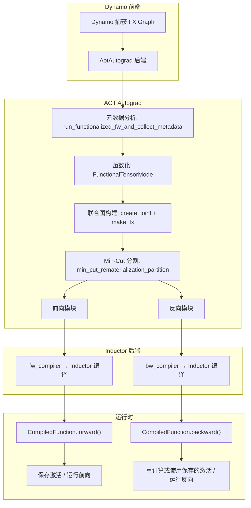
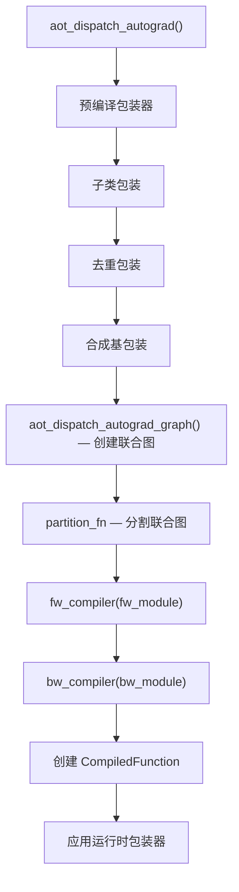
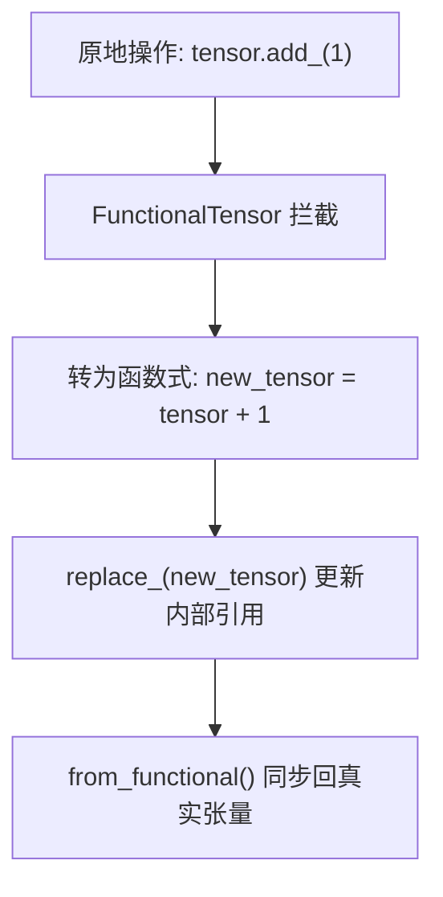
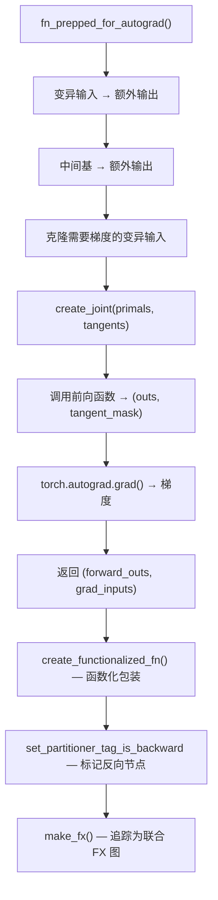
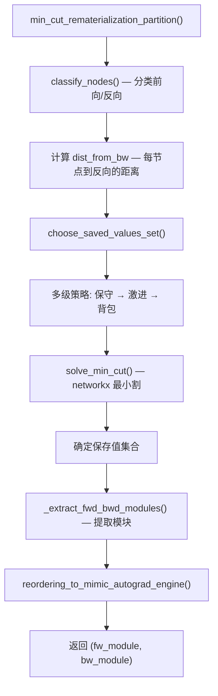
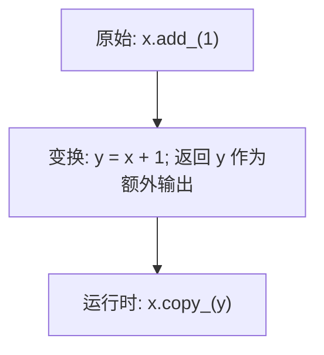
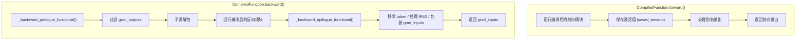

# 15 - AOT Autograd

> AOT Autograd 是 Dynamo 与 Inductor 之间的桥梁，负责提前追踪前向和反向传播，
> 将联合图分割为独立的前向和反向子图，交给 Inductor 分别编译。
> 它是 PyTorch 训练编译的关键组件。

---

## 目录

1. [架构概览](#1-架构概览)
2. [入口与配置](#2-入口与配置)
3. [编译编排流程](#3-编译编排流程)
4. [函数化 — FunctionalTensor](#4-函数化--functionaltensor)
5. [联合图构建](#5-联合图构建)
6. [Min-Cut 分割](#6-min-cut-分割)
7. [变异处理](#7-变异处理)
8. [运行时包装器](#8-运行时包装器)
9. [反向图合成与执行](#9-反向图合成与执行)
10. [设计权衡](#10-设计权衡)

---

## 1. 架构概览

AOT Autograd 在编译管线中的位置：



**关键文件索引**：

| 组件 | 文件 |
|------|------|
| 主入口 | `torch/_functorch/aot_autograd.py` |
| 数据模式 | `torch/_functorch/_aot_autograd/schemas.py` |
| 联合图/函数化变换 | `torch/_functorch/_aot_autograd/traced_function_transforms.py` |
| 图创建与分派 | `torch/_functorch/_aot_autograd/dispatch_and_compile_graph.py` |
| JIT 编译与运行时 | `torch/_functorch/_aot_autograd/jit_compile_runtime_wrappers.py` |
| 元数据分析 | `torch/_functorch/_aot_autograd/collect_metadata_analysis.py` |
| 函数化工具 | `torch/_functorch/_aot_autograd/functional_utils.py` |
| 输入输出分析 | `torch/_functorch/_aot_autograd/input_output_analysis.py` |
| 运行时包装器 | `torch/_functorch/_aot_autograd/runtime_wrappers.py` |
| 分割器 | `torch/_functorch/partitioners.py` |
| FunctionalTensor | `torch/_subclasses/functional_tensor.py` |

---

## 2. 入口与配置

### 2.1 入口函数

| 函数 | 行号 | 说明 |
|------|------|------|
| `aot_function()` | 841 | 公共 API：追踪并编译函数 |
| `aot_module()` | 957 | 包装 nn.Module，提升参数/缓冲区为输入 |
| `aot_module_simplified()` | 1071 | **Dynamo 主入口**，低开销版本 |
| `aot_export_module()` | 1221 | Export API，产出 FX 图 + GraphSignature |

### 2.2 AOTConfig

`AOTConfig` (`schemas.py:872`)：编译配置数据类：

| 字段 | 说明 |
|------|------|
| `fw_compiler` | 前向编译器（通常为 Inductor） |
| `bw_compiler` | 反向编译器 |
| `inference_compiler` | 推理编译器 |
| `partition_fn` | 分割函数（默认 min-cut） |
| `decompositions` | 分解表 |
| `num_params_buffers` | 参数/缓冲区数量 |
| `keep_inference_input_mutations` | 推理模式是否保留变异 |
| `is_export` | 是否为 Export 编译 |
| `dynamic_shapes` | 是否使用动态形状 |
| `pre_dispatch` | 是否使用 pre-dispatch 模式 |

### 2.3 辅助入口

| 函数 | 行号 | 说明 |
|------|------|------|
| `process_inputs()` | 494 | 将真实张量转为 fake tensor |
| `construct_fake_mode()` | 562 | 创建或检测 FakeTensorMode |

---

## 3. 编译编排流程

### 3.1 _create_aot_dispatcher_function

`_create_aot_dispatcher_function` (`aot_autograd.py:587`) 是核心编排入口：

```mermaid
flowchart TD
    A["_create_aot_dispatcher_function()"] --> B["run_functionalized_fw_and_collect_metadata()"]
    B --> C["构建 ViewAndMutationMeta"]
    C --> D{"分派路径选择"}
    D -->|"训练"| E["aot_dispatch_autograd()"]
    D -->|"推理"| F["aot_dispatch_base()"]
    D ->|"导出"| G["aot_dispatch_export()"]
```

### 3.2 aot_dispatch_autograd

`aot_dispatch_autograd` (`jit_compile_runtime_wrappers.py:373`) 实现训练路径：



### 3.3 元数据分析

`run_functionalized_fw_and_collect_metadata` (`collect_metadata_analysis.py:146`)：
- 在 FunctionalTensorMode 下运行前向
- 检查输入/输出的变异和别名
- 构建 `ViewAndMutationMeta`

### 3.4 ViewAndMutationMeta

`ViewAndMutationMeta` (`schemas.py:317`)：核心元数据，追踪变异和别名信息：

| 字段 | 说明 |
|------|------|
| `input_info` | 每个输入的 `InputAliasInfo` 列表 |
| `output_info` | 每个输出的 `OutputAliasInfo` 列表 |
| `num_mutated_inp_runtime_indices` | 运行时变异输入索引 |
| `keep_input_mutations` | 是否保留输入变异 |
| `traces_len` | 追踪长度 |

---

## 4. 函数化 — FunctionalTensor

### 4.1 概念

函数化将原地操作转为函数式操作，使程序可被追踪为纯 FX 图。

### 4.2 FunctionalTensor

`FunctionalTensor` (`functional_tensor.py:45`)：张量子类，消除变异：



| 方法 | 行号 | 说明 |
|------|------|------|
| `to_functional()` | 209 | 包装张量为 FunctionalTensor |
| `from_functional()` | 233 | 解包并同步回常规张量 |
| `replace_()` | 254 | 替换内部张量（用于变异） |
| `commit_update()` | 262 | 提交待处理更新 |
| `sync()` | 268 | 同步内部张量状态 |

### 4.3 FunctionalTensorMode

`FunctionalTensorMode` (`functional_tensor.py:297`)：TorchDispatchMode，拦截操作并应用函数化：

`__torch_dispatch__` (`functional_tensor.py:352`) 核心逻辑：
1. 分解可能别名/变异的操作
2. 处理可变操作的 auto_functionalize
3. 处理 effect token
4. 分派到 C++ 函数化核
5. 通过 `return_and_correct_aliasing` 修正输出别名

### 4.4 函数化工具

| 函数 | 文件:行号 | 说明 |
|------|----------|------|
| `to_fun()` | `functional_utils.py:35` | 转为 FunctionalTensor |
| `from_fun()` | `functional_utils.py:62` | 解包 FunctionalTensor |
| `is_fun()` | `functional_utils.py:81` | 检查是否为 FunctionalTensor |
| `has_data_mutation()` | `functional_utils.py:101` | 检查数据变异 |
| `has_metadata_mutation()` | `functional_utils.py:163` | 检查元数据变异 |
| `gen_alias_from_base()` | `functional_utils.py:226` | 从基张量重建别名输出 |
| `assert_functional_graph()` | `functional_utils.py:437` | 验证图无变异操作 |

---

## 5. 联合图构建

### 5.1 构建流程



### 5.2 关键函数

| 函数 | 行号 | 说明 |
|------|------|------|
| `fn_input_mutations_to_outputs()` | `traced_function_transforms.py:71` | 变异输入转为额外输出 |
| `fn_prepped_for_autograd()` | `traced_function_transforms.py:105` | 准备前向用于联合追踪 |
| `create_joint()` | `traced_function_transforms.py:192` | 创建联合前向+反向函数 |
| `create_functionalized_fn()` | `traced_function_transforms.py:388` | 函数化包装 |
| `set_partitioner_tag_is_backward()` | `traced_function_transforms.py:368` | 标记反向节点 |
| `aot_dispatch_autograd_graph()` | `dispatch_and_compile_graph.py:251` | 追踪联合图 |

### 5.3 联合图结构

联合图是一个 FX Graph，包含前向和反向的所有操作：

```
输入: primals (前向输入) + tangents (反向梯度)
...
前向操作 (未标记)
...
反向操作 (标记 is_backward=True)
...
输出: forward_outs + grad_inputs
```

---

## 6. Min-Cut 分割

### 6.1 分割目标

将联合图分割为前向和反向两个独立子图，最小化前向需要保存的激活值数量（节省内存），同时控制反向重计算开销。

### 6.2 min_cut_rematerialization_partition

`min_cut_rematerialization_partition` (`partitioners.py:1726`)：生产环境主分割器：



### 6.3 最小割算法

`solve_min_cut` (`partitioners.py:816`)：
1. 构建 networkx DiGraph，添加 source 和 sink 节点
2. 根据张量大小和重计算启发式分配边容量
3. 运行 `nx.minimum_cut()` 找到最优割
4. 返回源侧节点集合（需要保存的值）

### 6.4 保存值选择策略

`choose_saved_values_set` (`partitioners.py:1489`)：多级策略：

| 级别 | 策略 | 说明 |
|------|------|------|
| 1 | 保守 min-cut | 最少重计算 |
| 2 | 更激进 | 允许更多重计算 |
| 3 | 完全激进 | 最大化重计算 |
| 4 | 背包求解 | 给定内存预算下优化运行时 |

`_optimize_runtime_with_given_memory` (`partitioners.py:1393`)：背包求解器，在内存预算内决定哪些"禁止重计算"的操作允许重计算。

### 6.5 节点分类与权重

`classify_nodes` (`partitioners.py:1775`)：根据节点标记和依赖关系分类前向/反向。

`get_node_weight` (`partitioners.py:958`)：计算边权重，表示"保存值 vs 重计算"的代价。

`should_ban_recomputation` (`partitioners.py:902`)：禁止重计算的启发式规则。

### 6.6 操作类型

`OpTypes` (`partitioners.py:55`)：

| 类别 | 说明 |
|------|------|
| `fusible_ops` | 可融合操作 |
| `compute_intensive_ops` | 计算密集操作 |
| `random_ops` | 随机操作（不可重计算） |
| `view_ops` | 视图操作 |
| `recomputable_ops` | 可重计算操作 |

### 6.7 反向重排序

`reordering_to_mimic_autograd_engine` (`partitioners.py:547`)：重排反向节点以最小化峰值内存，交替重计算的前向操作和反向操作。

### 6.8 图提取

| 函数 | 行号 | 说明 |
|------|------|------|
| `_extract_graph_with_inputs_outputs()` | 159 | 给定输入/输出提取子图 |
| `_extract_fwd_bwd_modules()` | 291 | 从联合图构建前向/反向 GraphModule |
| `default_partition()` | 390 | 简单分割器（回退） |

---

## 7. 变异处理

### 7.1 变异分类

`MutationType` (`schemas.py:106`)：

| 值 | 说明 |
|----|------|
| `NOT_MUTATED` | 未变异 |
| `MUTATED_IN_GRAPH` | 图内变异 |
| `MUTATED_OUT_GRAPH` | 图外变异 |

`InputAliasInfo` (`schemas.py:113`)：追踪每个输入的变异信息：`mutates_data`、`mutates_metadata`、`mutations_hidden_from_autograd` 等。

### 7.2 变异转输出

`fn_input_mutations_to_outputs` (`traced_function_transforms.py:71`)：将变异输入转为额外输出：



### 7.3 合成基（Synthetic Base）

当输入之间存在别名关系且一个被变异时，需要合成基：

`AOTSyntheticBaseWrapper` (`runtime_wrappers.py:1006`)：创建合成基输入，在追踪函数内部重建视图。

`merge_view_inputs` (`runtime_wrappers.py:1250`)：将别名的视图输入合并为合成基。

### 7.4 变异运行时处理

运行时包装器在编译函数执行后，将变异结果写回原始张量：

| 处理器 | 行号 | 说明 |
|--------|------|------|
| `NoopAliasHandler` | 153 | 无需变异 |
| `AliasOfInputHandler` | 170 | 从输入重建别名输出 |
| `IsInputHandler` | 189 | 直接使用变异输入 |
| `AliasOfIntermediateHandler` | 199 | 从中间基重建别名输出 |

---

## 8. 运行时包装器

### 8.1 CompilerWrapper 体系

`CompilerWrapper` (`runtime_wrappers.py:74`)：编译前后变换的抽象基类。

| 包装器 | 行号 | 说明 |
|--------|------|------|
| `AOTDispatchSubclassWrapper` | 592 | 张量子类包装/解包 |
| `EffectTokensWrapper` | 653 | Effect token 线程化 |
| `AOTDedupeWrapper` | 766 | 重复输入处理 |
| `AOTSyntheticBaseWrapper` | 1006 | 合成基处理 |
| `RuntimeWrapper` | 131 | 运行时收尾：变异/别名处理 |
| `FunctionalizedRngRuntimeWrapper` | 440 | RNG 状态处理 |
| `FakifiedOutWrapper` | 515 | Fake 输出（cudagraphs 预热） |

### 8.2 运行时包装创建

`_create_runtime_wrapper` (`runtime_wrappers.py:243`)：创建运行时包装函数，处理：
1. 编译函数的执行
2. 变异结果写回（`copy_`、`set_`、`as_strided_`）
3. 别名输出重建

---

## 9. 反向图合成与执行

### 9.1 CompiledFunction

`AOTDispatchAutograd` (`runtime_wrappers.py:1697`) 创建 `CompiledFunction(torch.autograd.Function)`：



### 9.2 前向保存

`CompiledFunction.forward()` (`runtime_wrappers.py:1809`)：
- 运行编译后的前向模块
- 保存激活值（用于反向）
- 处理别名输出

### 9.3 反向执行

`CompiledFunction.backward()` (`runtime_wrappers.py:1934`)：
1. `_backward_prologue_functional()` (`runtime_wrappers.py:1465`)：准备反向参数
2. 运行编译后的反向模块（支持延迟编译）
3. `_backward_epilogue_functional()` (`runtime_wrappers.py:1670`)：后处理反向输出

### 9.4 双重反向支持

`CompiledFunction.backward()` 检测 grad_inputs 是否需要梯度，若需要则创建嵌套 `autograd.Function` 支持高阶梯度。

### 9.5 捐赠缓冲区

`collect_fw_donated_buffer_idxs` (`jit_compile_runtime_wrappers.py:285`)：识别"捐赠缓冲区"——不被任何前向输入/输出或反向输出别名的保存张量，允许其内存被释放或重用。

---

## 10. 设计权衡

### 10.1 联合追踪 vs 分别追踪

- **联合追踪**（当前）：前向和反向一起追踪为联合图，分割器全局优化
- **分别追踪**：前向/反向独立追踪，更简单但优化空间受限
- **选择联合**：分割器可全局决定保存 vs 重计算，最小化内存

### 10.2 Min-Cut vs 简单分割

- **Min-Cut**（当前）：基于图论的优化分割，权衡保存 vs 重计算
- **简单分割**：保存所有中间值，零重计算但内存最大
- **权衡**：Min-Cut 计算开销更大但内存效率显著提升

### 10.3 重计算策略

- **保守**：最少重计算，保存更多激活
- **激进**：更多重计算，更少内存占用
- **当前**：多级策略，从保守到激进逐步尝试

### 10.4 函数化 vs 原地操作

- **函数化**（当前）：所有变异转为函数式操作
- **保留变异**：直接追踪原地操作
- **选择函数化**：FX 图要求纯函数语义，函数化确保正确性

### 10.5 合成基开销

- **合成基**（当前）：别名输入变异时创建合成基
- **直接处理**：信任别名关系不变
- **选择合成基**：正确性保证，代价是额外输入和视图重建

### 10.6 延迟反向编译

- **延迟编译**（当前）：反向模块在首次调用时才编译
- **立即编译**：前向编译时同时编译反向
- **权衡**：延迟编译减少首次编译开销，但首次反向调用有延迟

---

## 附录：关键代码行号参考

| 内容 | 文件 | 行号 |
|------|------|------|
| aot_function | `aot_autograd.py` | 841 |
| aot_module | `aot_autograd.py` | 957 |
| aot_module_simplified | `aot_autograd.py` | 1071 |
| aot_export_module | `aot_autograd.py` | 1221 |
| process_inputs | `aot_autograd.py` | 494 |
| construct_fake_mode | `aot_autograd.py` | 562 |
| _create_aot_dispatcher_function | `aot_autograd.py` | 587 |
| AOTConfig | `schemas.py` | 872 |
| ViewAndMutationMeta | `schemas.py` | 317 |
| MutationType | `schemas.py` | 106 |
| InputAliasInfo | `schemas.py` | 113 |
| OutputAliasInfo | `schemas.py` | 67 |
| OutputType | `schemas.py` | 33 |
| fn_input_mutations_to_outputs | `traced_function_transforms.py` | 71 |
| fn_prepped_for_autograd | `traced_function_transforms.py` | 105 |
| create_joint | `traced_function_transforms.py` | 192 |
| create_functionalized_fn | `traced_function_transforms.py` | 388 |
| set_partitioner_tag_is_backward | `traced_function_transforms.py` | 368 |
| aot_dispatch_autograd_graph | `dispatch_and_compile_graph.py` | 251 |
| _create_graph | `dispatch_and_compile_graph.py` | 46 |
| aot_dispatch_base_graph | `dispatch_and_compile_graph.py` | 73 |
| aot_dispatch_autograd | `jit_compile_runtime_wrappers.py` | 373 |
| aot_dispatch_base | `jit_compile_runtime_wrappers.py` | 137 |
| aot_dispatch_export | `jit_compile_runtime_wrappers.py` | 97 |
| collect_fw_donated_buffer_idxs | `jit_compile_runtime_wrappers.py` | 285 |
| run_functionalized_fw_and_collect_metadata | `collect_metadata_analysis.py` | 146 |
| to_fun / from_fun / is_fun | `functional_utils.py` | 35/62/81 |
| has_data_mutation | `functional_utils.py` | 101 |
| has_metadata_mutation | `functional_utils.py` | 163 |
| gen_alias_from_base | `functional_utils.py` | 226 |
| assert_functional_graph | `functional_utils.py` | 437 |
| _check_if_mutation_can_be_in_graph | `functional_utils.py` | 491 |
| CompilerWrapper | `runtime_wrappers.py` | 74 |
| RuntimeWrapper | `runtime_wrappers.py` | 131 |
| AOTDispatchSubclassWrapper | `runtime_wrappers.py` | 592 |
| EffectTokensWrapper | `runtime_wrappers.py` | 653 |
| AOTDedupeWrapper | `runtime_wrappers.py` | 766 |
| AOTSyntheticBaseWrapper | `runtime_wrappers.py` | 1006 |
| merge_view_inputs | `runtime_wrappers.py` | 1250 |
| _backward_prologue_functional | `runtime_wrappers.py` | 1465 |
| _backward_epilogue_functional | `runtime_wrappers.py` | 1670 |
| AOTDispatchAutograd / CompiledFunction | `runtime_wrappers.py` | 1697 |
| CompiledFunction.forward | `runtime_wrappers.py` | 1809 |
| CompiledFunction.backward | `runtime_wrappers.py` | 1934 |
| OpTypes | `partitioners.py` | 55 |
| NodeInfo | `partitioners.py` | 81 |
| MinCutOptions | `partitioners.py` | 111 |
| _extract_graph_with_inputs_outputs | `partitioners.py` | 159 |
| _extract_fwd_bwd_modules | `partitioners.py` | 291 |
| default_partition | `partitioners.py` | 390 |
| reordering_to_mimic_autograd_engine | `partitioners.py` | 547 |
| solve_min_cut | `partitioners.py` | 816 |
| should_ban_recomputation | `partitioners.py` | 902 |
| get_node_weight | `partitioners.py` | 958 |
| get_default_op_list | `partitioners.py` | 1221 |
| _optimize_runtime_with_given_memory | `partitioners.py` | 1393 |
| choose_saved_values_set | `partitioners.py` | 1489 |
| min_cut_rematerialization_partition | `partitioners.py` | 1726 |
| classify_nodes | `partitioners.py` | 1775 |
| FunctionalTensor | `functional_tensor.py` | 45 |
| FunctionalTensorMode | `functional_tensor.py` | 297 |
| FunctionalTensorMode.__torch_dispatch__ | `functional_tensor.py` | 352 |