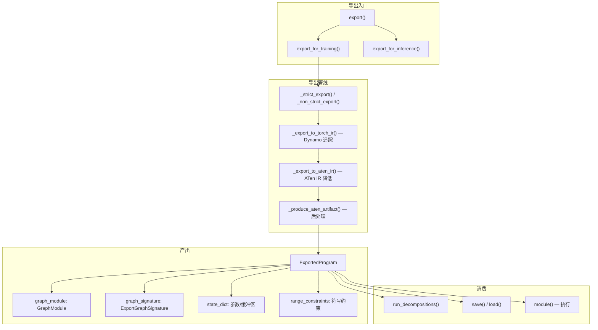
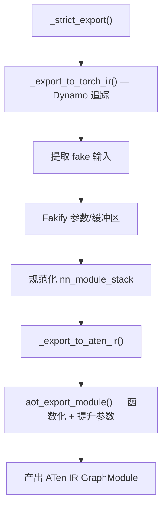
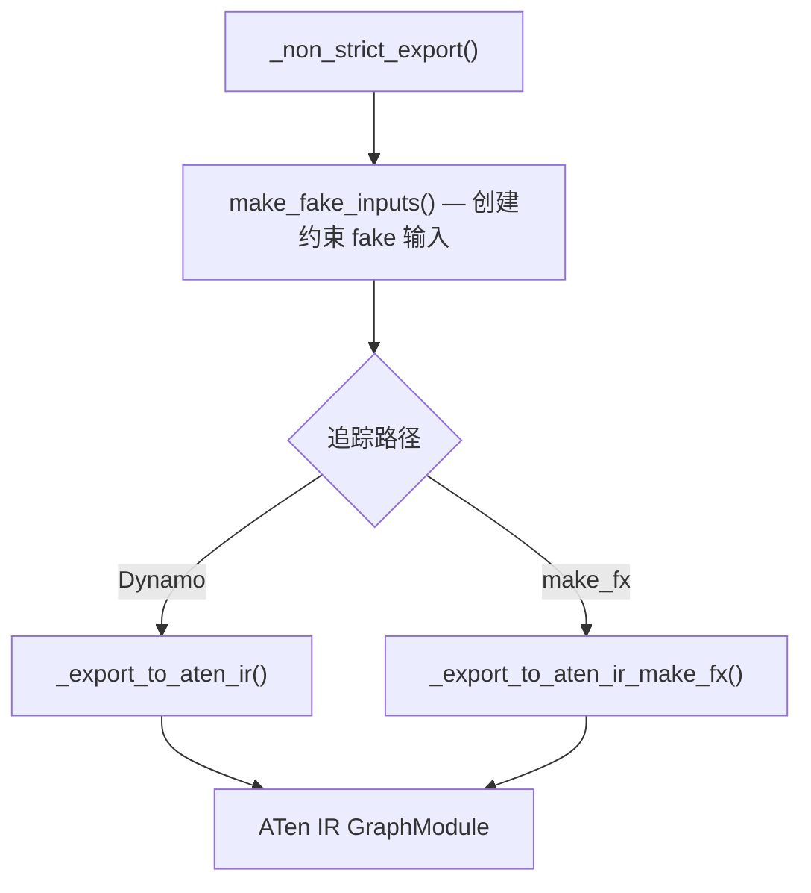
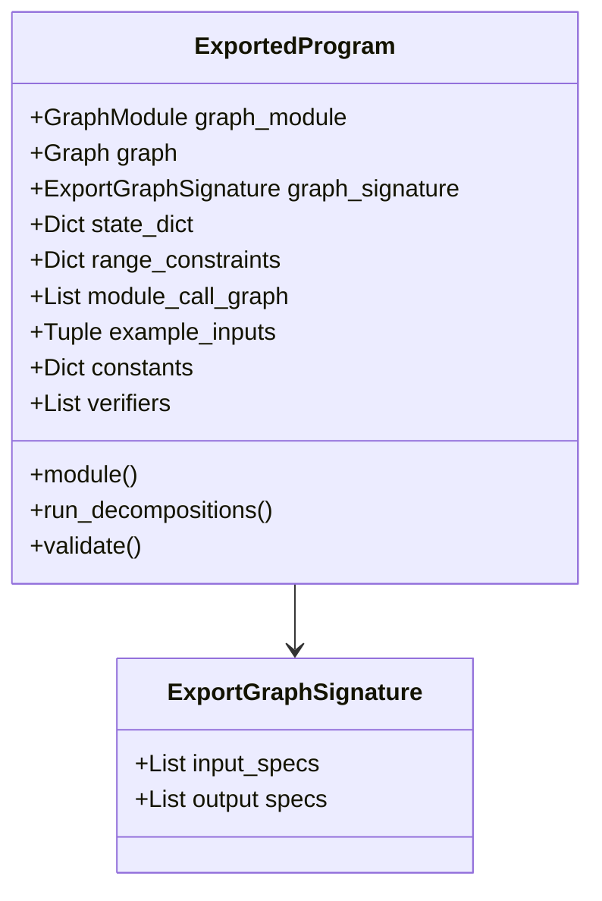
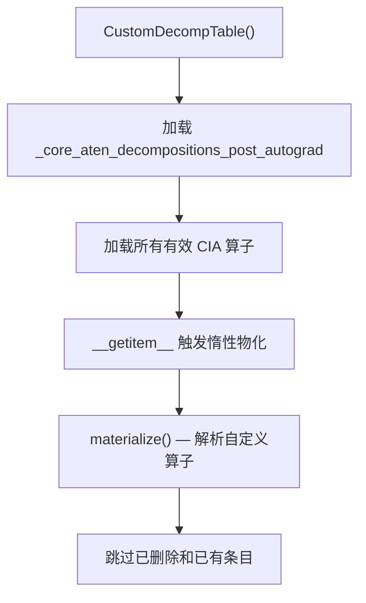

# 16 - torch.export

> torch.export 是 PyTorch 的模型导出系统，将模型捕获为可移植、可序列化的
> ExportedProgram。与 torch.compile 不同，它不生成运行时代码，
> 而是产出完全函数化的 ATen IR 图，支持动态形状约束。

---

## 目录

1. [架构概览](#1-架构概览)
2. [导出管线](#2-导出管线)
3. [ExportedProgram](#3-exportedprogram)
4. [ExportGraphSignature](#4-exportgraphsignature)
5. [动态形状约束](#5-动态形状约束)
6. [变异与副作用处理](#6-变异与副作用处理)
7. [联合追踪（前向+反向）](#7-联合追踪前向反向)
8. [CustomDecompTable 与分解](#8-customdectable-与分解)
9. [序列化与反序列化](#9-序列化与反序列化)
10. [Export vs torch.compile](#10-export-vs-torchcompile)
11. [设计权衡](#11-设计权衡)

---

## 1. 架构概览

torch.export 在编译生态中的位置：



**关键文件索引**：

| 组件 | 文件 |
|------|------|
| 导出入口 | `torch/export/__init__.py` |
| 导出追踪 | `torch/export/_trace.py` |
| ExportedProgram | `torch/export/exported_program.py` |
| 图签名 | `torch/export/graph_signature.py` |
| 动态形状 | `torch/export/dynamic_shapes.py` |
| 分解工具 | `torch/export/decomp_utils.py` |
| Unlift | `torch/export/_unlift.py` |
| 非严格工具 | `torch/_export/non_strict_utils.py` |
| 验证器 | `torch/_export/verifier.py` |
| 序列化 | `torch/_export/serde/serialize.py` |
| 安全守卫 | `torch/export/_safeguard.py` |

---

## 2. 导出管线

### 2.1 入口

| 函数 | 文件:行号 | 说明 |
|------|----------|------|
| `export()` | `__init__.py:263` | 公共入口 |
| `export_for_training()` | `__init__.py:83` | 训练模式导出 |
| `export_for_inference()` | `__init__.py:178` | 推理模式导出 |

### 2.2 严格导出

`_strict_export` (`_trace.py:1249`)：



### 2.3 非严格导出

`_non_strict_export` (`_trace.py:1723`)：



### 2.4 _export_to_torch_ir

`_export_to_torch_ir` (`_trace.py:635`)：使用 Dynamo 追踪，关键配置：

| 配置 | 值 | 说明 |
|------|-----|------|
| `assume_static_by_default` | True | 默认假设静态形状 |
| `tracing_mode` | "symbolic" | 符号追踪 |
| `prefer_deferred_runtime_asserts_over_guards` | True | 运行时断言代替守卫 |
| `do_not_emit_runtime_asserts` | True | 延迟到 AOTAutograd 后 |

### 2.5 _export_to_aten_ir

`_export_to_aten_ir` (`_trace.py:707`)：将 Torch IR 降低到 ATen IR：
- 调用 `aot_export_module()` 函数化图
- 提升参数/缓冲区为输入
- 产出纯 ATen 算子图

### 2.6 后处理

`_produce_aten_artifact` (`_trace.py:420`)：

1. 运行时断言 pass
2. 填充缺失 meta 值
3. 转为 `ExportGraphSignature`
4. 常量提升为 placeholder
5. 替换 autocast/set_grad 为 HOP
6. 美化 placeholder 名称
7. 保留 `requires_grad` 值

---

## 3. ExportedProgram

### 3.1 类结构

`ExportedProgram` (`exported_program.py:823`)：



### 3.2 构造

`__init__` (`exported_program.py:839`)：
- 接收 root、graph、graph_signature、state_dict、range_constraints 等
- 将 codegen 替换为纯 `CodeGen`
- 创建 GraphModule
- 运行 `_common_getitem_elimination_pass`
- 调用 `validate()`

### 3.3 关键方法

| 方法 | 行号 | 说明 |
|------|------|------|
| `module()` | 1220 | 返回可执行的 GraphModule（unlift） |
| `run_decompositions()` | 1248 | 应用分解，返回新 ExportedProgram |
| `validate()` | 1422 | 运行所有验证器 |
| `_graph_module_flat_inputs()` | 1101 | 将用户输入转为图模块的扁平输入 |
| `_postprocess_graph_module_outputs()` | 1153 | 处理缓冲区变异和输入变异 |

### 3.4 module() — Unlift 执行

`module()` 调用 `_unlift_exported_program_lifted_states` (`_unlift.py:369`)：
- 内联参数/缓冲区为属性
- 重新插入变异（`copy_` 操作）
- 包装为 `_StatefulGraphModule`（含约束检查前钩子）

---

## 4. ExportGraphSignature

### 4.1 InputKind

`InputKind` (`graph_signature.py:79`)：

| 值 | 说明 |
|----|------|
| `USER_INPUT` | 用户提供的输入 |
| `PARAMETER` | 模型参数 |
| `BUFFER` | 模型缓冲区 |
| `CONSTANT_TENSOR` | 常量张量 |
| `CUSTOM_OBJ` | 自定义对象 |
| `TOKEN` | Effect token |

### 4.2 OutputKind

`OutputKind` (`graph_signature.py:114`)：

| 值 | 说明 |
|----|------|
| `USER_OUTPUT` | 用户输出 |
| `LOSS_OUTPUT` | 损失值（联合追踪） |
| `BUFFER_MUTATION` | 缓冲区变异 |
| `GRADIENT_TO_PARAMETER` | 参数梯度（联合追踪） |
| `GRADIENT_TO_USER_INPUT` | 用户输入梯度（联合追踪） |
| `USER_INPUT_MUTATION` | 用户输入变异 |
| `TOKEN` | Effect token |

### 4.3 ExportBackwardSignature

`ExportBackwardSignature` (`graph_signature.py:145`)：

| 字段 | 说明 |
|------|------|
| `gradients_to_parameters` | 梯度节点名 → 参数目标映射 |
| `gradients_to_user_inputs` | 梯度节点名 → 用户输入目标映射 |
| `loss_output` | 损失输出节点名 |

### 4.4 ExportGraphSignature

`ExportGraphSignature` (`graph_signature.py:153`)：核心签名类，描述图的输入/输出规格。

---

## 5. 动态形状约束

### 5.1 Dim API

`Dim` (`dynamic_shapes.py:209`)：创建符号维度：

```python
dim = Dim("batch", min=1, max=1024)
# 用于: export(model, (dim, 3, 224, 224))
```

| 类型 | 行号 | 说明 |
|------|------|------|
| `Dim.AUTO` | 238 | 自动推断约束 |
| `Dim.STATIC` | 239 | 静态维度 |
| `Dim.DYNAMIC` | 240 | 完全动态 |

### 5.2 派生维度

`_DerivedDim` (`dynamic_shapes.py:142`)：支持算术运算创建派生维度：

```python
dim = Dim("d")
derived = 2 * dim + 1  # _DerivedDim
```

仅支持递增线性表达式（Ax + B，A > 0）。

### 5.3 约束类型

| 类 | 行号 | 说明 |
|----|------|------|
| `_Constraint` | 265 | 基本约束：tensor_id + dim + 范围 |
| `_DerivedConstraint` | 355 | 派生维度约束 |
| `_RelaxedConstraint` | 382 | 自动/动态模式的宽松约束 |
| `_PhantomRoot` | 337 | 不直接描述输入维度的派生根 |

约束支持比较运算符（`>=`, `>`, `<=`, `<`）细化范围。

### 5.4 ShapesCollection

`ShapesCollection` (`dynamic_shapes.py:601`)：构建器，将张量对象映射到动态形状规格。

### 5.5 约束处理

| 函数 | 行号 | 说明 |
|------|------|------|
| `_process_dynamic_shapes()` | 801 | 将动态形状规格转为约束列表 |
| `_process_equalities()` | 402 | 更新等式对和派生等式 |

### 5.6 非严格模式约束求解

| 函数 | 文件:行号 | 说明 |
|------|----------|------|
| `make_fake_inputs()` | `non_strict_utils.py:130` | 创建带约束的 fake 输入 |
| `produce_guards_and_solve_constraints()` | `non_strict_utils.py:271` | 生成守卫并求解约束 |
| `make_constraints()` | `non_strict_utils.py:336` | 提取最终范围约束 |

---

## 6. 变异与副作用处理

### 6.1 缓冲区变异

检测方式：`aot_export_module()` 发现变异缓冲区。

处理：变异值成为额外输出，`OutputKind.BUFFER_MUTATION`。运行时 `_postprocess_graph_module_outputs()` (`exported_program.py:1153`) 写回 `self.state_dict[target]`。

### 6.2 用户输入变异

处理类似缓冲区变异，使用 `OutputKind.USER_INPUT_MUTATION`。运行时调用 `flat_args[index].copy_(value)`。

### 6.3 Effect Token

某些副作用使用 token 系统：`InputKind.TOKEN` 和 `OutputKind.TOKEN`。

`_remove_effect_tokens` (`_remove_effect_tokens_pass.py:121`)：移除 token 输入/输出，替换 `with_effects(token, func, args)` 为 `func(args)`。

### 6.4 自动梯度状态安全守卫

`AutogradStateOpsFailSafeguard` (`_safeguard.py:7`)：检测 `torch._C._set_grad_enabled` 等操作，防止静默不正确行为。

### 6.5 完全函数化

`aot_export_module()` (`aot_autograd.py:1221`)：函数化整个图，所有原地操作转为 out-of-place 等价，变异追踪为额外输出。

---

## 7. 联合追踪（前向+反向）

### 7.1 联合 IR

`aot_export_module(trace_joint=True)` (`aot_autograd.py:1221`)：
- 模型必须返回标量损失
- 其他前向输出必须不需要梯度（自动 detach）
- 图输出格式：`(*updated_inputs, *user_outputs, *param_gradients)`

### 7.2 联合分解

`_decompose_and_get_gm_with_new_signature_constants` (`exported_program.py:355`)：
- 检查是否为联合 IR（`joint_loss_index is not None` 或有 `backward_signature`）
- 调用 `aot_export_module(trace_joint=True)`
- 构建包含 `GRADIENT_TO_PARAMETER` 和 `GRADIENT_TO_USER_INPUT` 的输出规格

### 7.3 限制

`run_decompositions()` 当前不支持联合图。

---

## 8. CustomDecompTable 与分解

### 8.1 CustomDecompTable

`CustomDecompTable` (`decomp_utils.py:16`)：惰性字典，专用于 Export：



| 方法 | 行号 | 说明 |
|------|------|------|
| `__init__` | 33 | 加载核心 ATen + CIA 分解 |
| `__getitem__` | 48 | 读取时物化 |
| `pop` | 95 | 删除算子（保留不分解） |
| `materialize` | 129 | 解析待处理的自定义算子 |

### 8.2 default_decompositions

`default_decompositions` (`exported_program.py:346`)：返回新的 `CustomDecompTable()`。

### 8.3 CIA 覆盖机制

`_override_composite_implicit_decomp` (`exported_program.py:196`)：
1. 覆盖 Autograd dispatch key 为 `autograd_not_implemented`
2. 删除原始 CIA 核，可选替换为自定义实现
3. 注册 fake tensor 规则强制分派到原始 CIA
4. 在后端 dispatch key 上注册原始 CIA 行为

### 8.4 run_decompositions

`run_decompositions` (`exported_program.py:1248`)：
1. 物化 CustomDecompTable
2. 通过 `_split_decomp_table_to_cia_and_python_decomp` (`exported_program.py:302`) 分离 CIA 和 Python 分解
3. 调用 `_decompose_exported_program` 重新追踪

---

## 9. 序列化与反序列化

### 9.1 save / load

| 函数 | 文件:行号 | 说明 |
|------|----------|------|
| `save(ep, f)` | `__init__.py:379` | 保存 ExportedProgram |
| `load(f)` | `__init__.py:461` | 加载 ExportedProgram |

### 9.2 序列化格式

`serialize` (`serialize.py:2490`) 产出的 `SerializedArtifact` 包含：

| 组件 | 格式 | 说明 |
|------|------|------|
| `serialized_exported_program.json` | JSON | 图结构、签名、模块调用图 |
| `serialized_state_dict.pt` | PyTorch | 参数/缓冲区张量数据 |
| `serialized_constants.pt` | PyTorch | 常量张量数据 |
| `serialized_example_inputs.pt` | PyTorch | 示例输入数据 |

所有内容写入 zip 文件。

### 9.3 序列化内部

| 组件 | 行号 | 说明 |
|------|------|------|
| `GraphModuleSerializer.serialize()` | 1415 | 序列化节点、元数据、签名 |
| `GraphModuleDeserializer.deserialize()` | 1922 | 重建 FX 图、签名和模块调用图 |

### 9.4 版本兼容

加载时检查 schema 版本兼容性。

---

## 10. Export vs torch.compile

| 特性 | torch.export | torch.compile |
|------|-------------|---------------|
| 目的 | AOT 追踪，产出可移植产物 | JIT 编译，运行时优化 |
| 守卫 | 运行时断言（不重编译） | 守卫可能触发重编译 |
| 函数化 | 完全函数化 | 不函数化 |
| 可序列化 | 是（save/load） | 否（临时的） |
| 动态形状 | 显式约束系统 | 从数据推断守卫 |
| 参数/缓冲区 | 提升为图输入 | 保持在模块内 |
| 验证 | 严格 Verifier | 无 |
| 算子级别 | 核心 ATen | 全 ATen |
| 副作用 | 追踪为额外输出 | 原始行为 |

### 10.1 ExportDynamoConfig

`ExportDynamoConfig` (`_trace.py:104`)：Export 专用 Dynamo 设置：

| 配置 | 值 | 与 compile 的区别 |
|------|-----|------------------|
| `assume_static_by_default` | True | compile 默认 False |
| `prefer_deferred_runtime_asserts_over_guards` | True | compile 使用守卫 |
| `do_not_emit_runtime_asserts` | True | 延迟到后处理 |

---

## 11. 设计权衡

### 11.1 严格 vs 非严格导出

- **严格导出**（默认）：使用 Dynamo 追踪，保证完整性但可能因不支持操作失败
- **非严格导出**：使用 make_fx 追踪，更宽松但可能丢失控制流信息
- **权衡**：严格导出更可靠，非严格导出覆盖更多模型

### 11.2 运行时断言 vs 守卫

- **运行时断言**（Export 选择）：假设失败时报错，不重编译
- **守卫**（Compile 选择）：假设失败时重编译
- **权衡**：断言保证稳定行为，但不如守卫灵活

### 11.3 参数提升 vs 内联

- **提升为输入**（Export）：参数/缓冲区成为图输入，签名描述映射
- **内联为属性**（Compile）：参数/缓冲区保留在模块内
- **选择提升**：导出产物自包含，不依赖原始模块

### 11.4 惰性 CustomDecompTable

- **惰性物化**（当前）：按需加载分解，支持延迟注册的自定义算子
- **急切加载**：启动时加载所有分解
- **权衡**：惰性减少初始化开销但增加首次访问延迟

### 11.5 完全函数化 vs 部分函数化

- **完全函数化**（当前）：所有变异转为额外输出
- **部分函数化**：保留安全的原地操作
- **选择完全函数化**：保证图可追踪、可序列化、可移植

### 11.6 联合追踪支持

- **当前状态**：支持联合 IR 导出但 `run_decompositions` 尚不支持
- **未来方向**：完整的训练导出支持

---

## 附录：关键代码行号参考

| 内容 | 文件 | 行号 |
|------|------|------|
| export() | `torch/export/__init__.py` | 263 |
| export_for_training() | `torch/export/__init__.py` | 83 |
| export_for_inference() | `torch/export/__init__.py` | 178 |
| save() | `torch/export/__init__.py` | 379 |
| load() | `torch/export/__init__.py` | 461 |
| ExportDynamoConfig | `torch/export/_trace.py` | 104 |
| _export_to_torch_ir | `torch/export/_trace.py` | 635 |
| _export_to_aten_ir | `torch/export/_trace.py` | 707 |
| _produce_aten_artifact | `torch/export/_trace.py` | 420 |
| _strict_export | `torch/export/_trace.py` | 1249 |
| _non_strict_export | `torch/export/_trace.py` | 1723 |
| _export_to_aten_ir_make_fx | `torch/export/_trace.py` | 1427 |
| _export | `torch/export/_trace.py` | 1981 |
| ExportedProgram | `torch/export/exported_program.py` | 823 |
| ExportedProgram.__init__ | `torch/export/exported_program.py` | 839 |
| module() | `torch/export/exported_program.py` | 1220 |
| run_decompositions() | `torch/export/exported_program.py` | 1248 |
| validate() | `torch/export/exported_program.py` | 1422 |
| _graph_module_flat_inputs | `torch/export/exported_program.py` | 1101 |
| _postprocess_graph_module_outputs | `torch/export/exported_program.py` | 1153 |
| default_decompositions | `torch/export/exported_program.py` | 346 |
| _split_decomp_table_to_cia_and_python_decomp | `torch/export/exported_program.py` | 302 |
| _override_composite_implicit_decomp | `torch/export/exported_program.py` | 196 |
| _decompose_and_get_gm_with_new_signature_constants | `torch/export/exported_program.py` | 355 |
| _decompose_exported_program | `torch/export/exported_program.py` | 773 |
| InputKind | `torch/export/graph_signature.py` | 79 |
| OutputKind | `torch/export/graph_signature.py` | 114 |
| ExportBackwardSignature | `torch/export/graph_signature.py` | 145 |
| ExportGraphSignature | `torch/export/graph_signature.py` | 153 |
| TensorArgument | `torch/export/graph_signature.py` | 31 |
| Dim() | `torch/export/dynamic_shapes.py` | 209 |
| _Dim 元类 | `torch/export/dynamic_shapes.py` | 56 |
| _DerivedDim | `torch/export/dynamic_shapes.py` | 142 |
| _Constraint | `torch/export/dynamic_shapes.py` | 265 |
| _DerivedConstraint | `torch/export/dynamic_shapes.py` | 355 |
| _RelaxedConstraint | `torch/export/dynamic_shapes.py` | 382 |
| _PhantomRoot | `torch/export/dynamic_shapes.py` | 337 |
| ShapesCollection | `torch/export/dynamic_shapes.py` | 601 |
| _process_dynamic_shapes | `torch/export/dynamic_shapes.py` | 801 |
| _process_equalities | `torch/export/dynamic_shapes.py` | 402 |
| CustomDecompTable | `torch/export/decomp_utils.py` | 16 |
| CustomDecompTable.materialize | `torch/export/decomp_utils.py` | 129 |
| CustomDecompTable.pop | `torch/export/decomp_utils.py` | 95 |
| _unlift_exported_program_lifted_states | `torch/export/_unlift.py` | 369 |
| _StatefulGraphModule | `torch/export/_unlift.py` | 268 |
| _insert_copy_for_mutations | `torch/export/_unlift.py` | 85 |
| AutogradStateOpsFailSafeguard | `torch/export/_safeguard.py` | 7 |
| _remove_effect_tokens | `torch/export/_remove_effect_tokens_pass.py` | 121 |
| Verifier | `torch/_export/verifier.py` | 113 |
| TrainingIRVerifier | `torch/_export/verifier.py` | 279 |
| make_fake_inputs | `torch/_export/non_strict_utils.py` | 130 |
| produce_guards_and_solve_constraints | `torch/_export/non_strict_utils.py` | 271 |
| make_constraints | `torch/_export/non_strict_utils.py` | 336 |
| GraphModuleSerializer | `torch/_export/serde/serialize.py` | 1415 |
| GraphModuleDeserializer | `torch/_export/serde/serialize.py` | 1922 |
| serialize() | `torch/_export/serde/serialize.py` | 2490 |
| deserialize() | `torch/_export/serde/serialize.py` | 2409 |
| ModuleCallSignature | `torch/export/exported_program.py` | 101 |
| ModuleCallEntry | `torch/export/exported_program.py` | 118 |