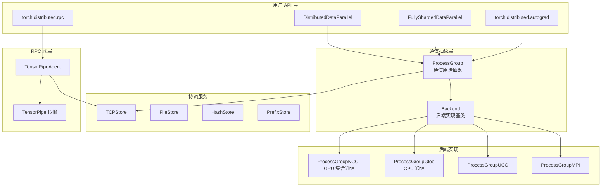
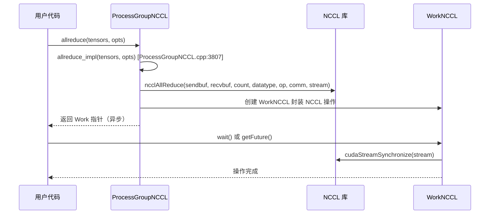
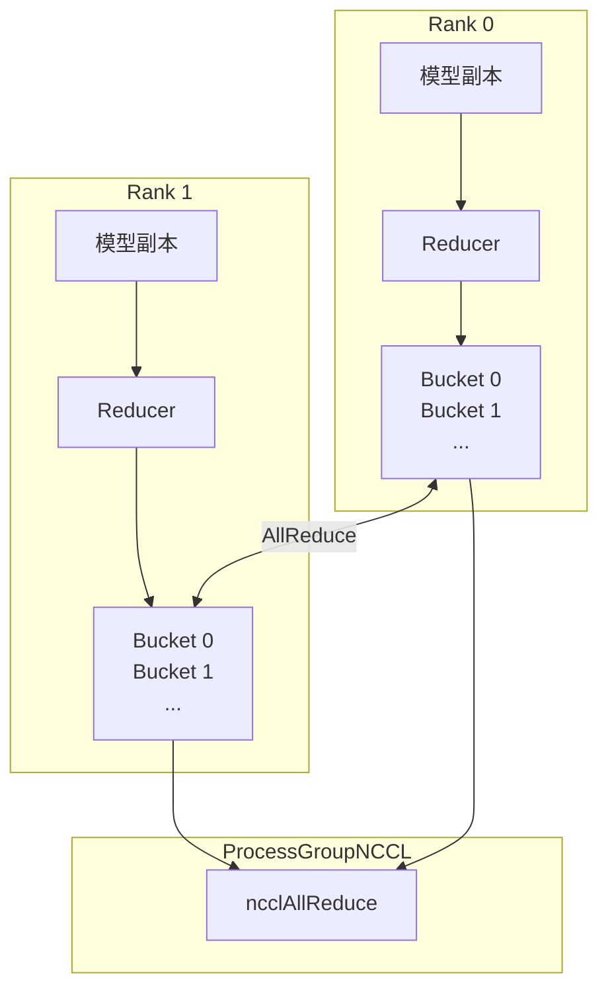
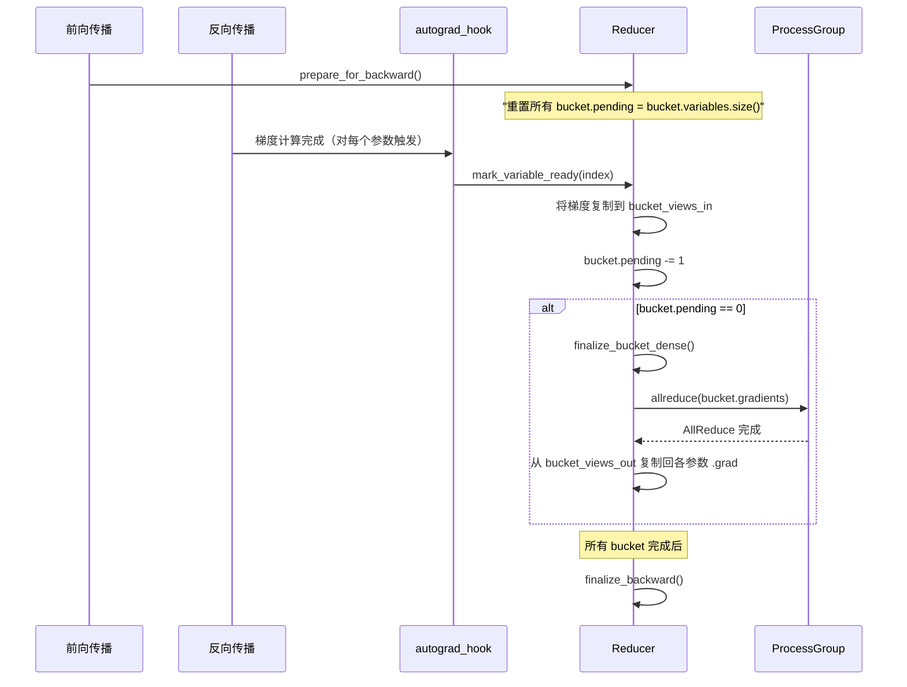
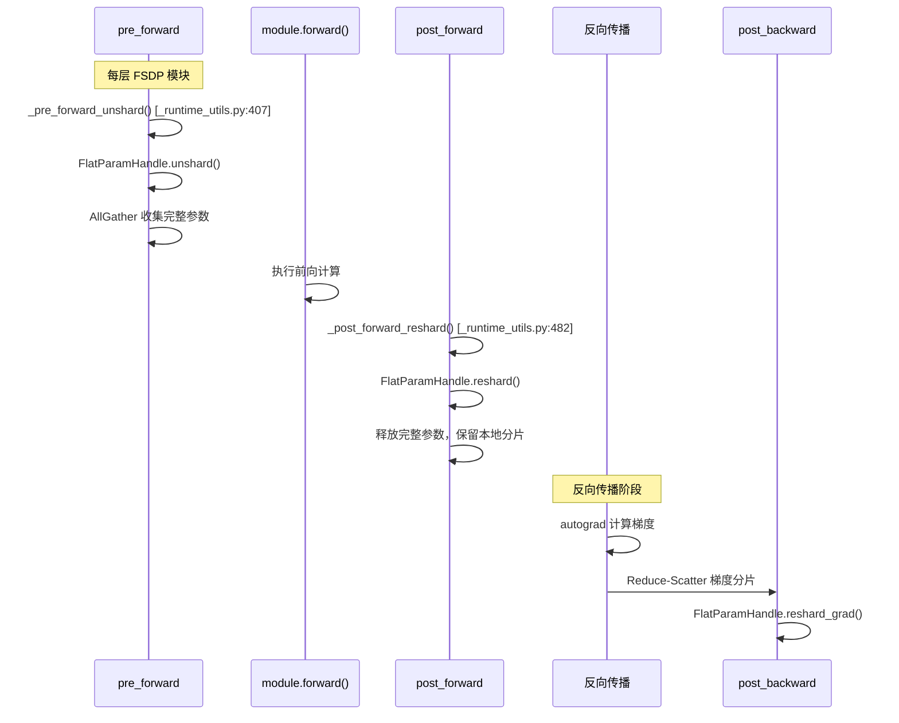
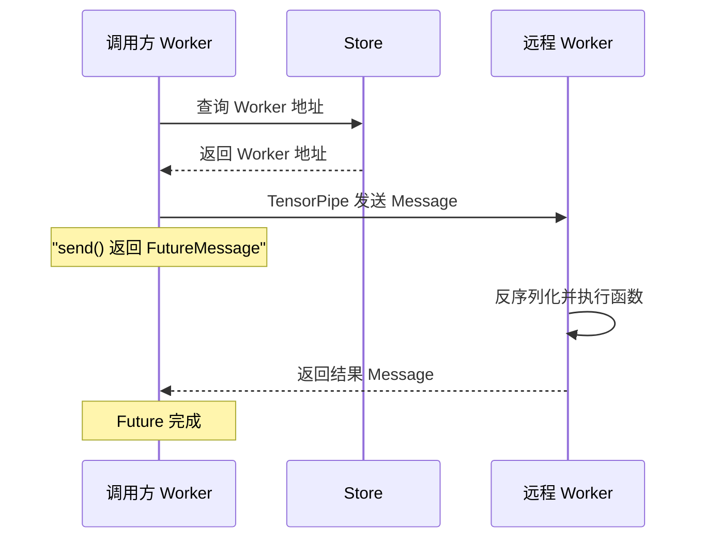
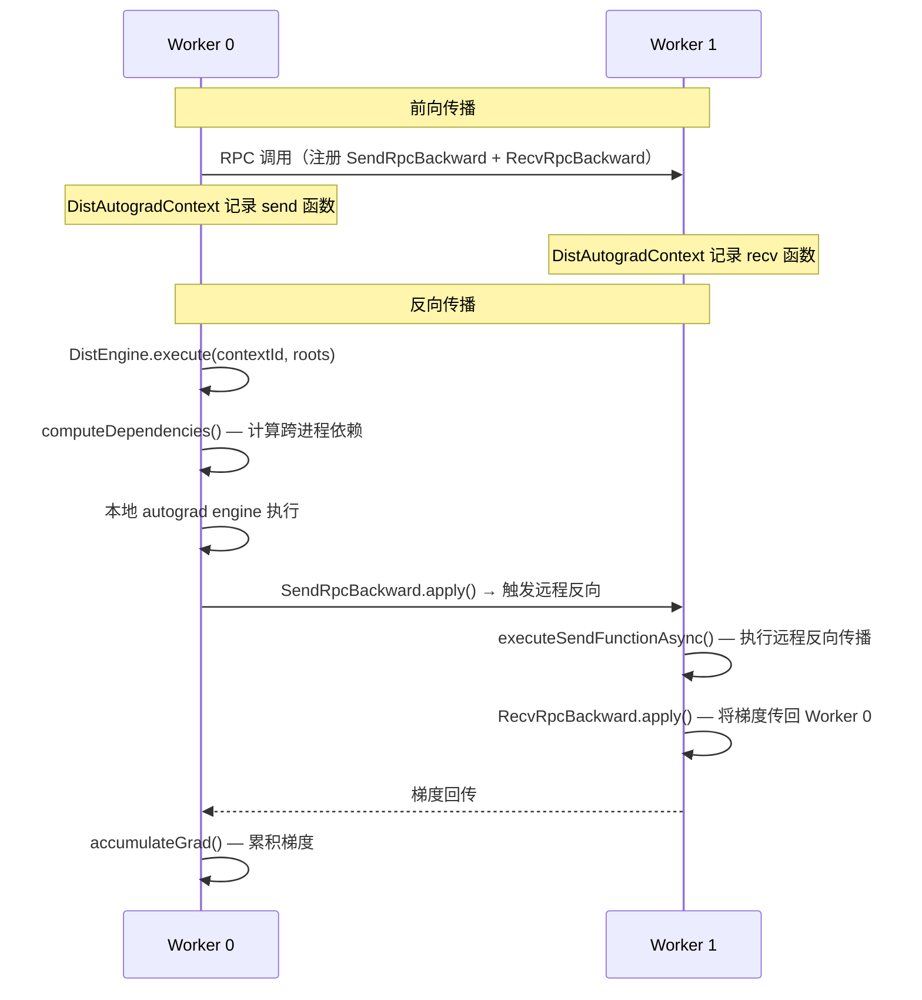

# 17. PyTorch 分布式训练系统

## 目录

- [17.1 整体架构](#171-整体架构)
- [17.2 Store：分布式键值存储](#172-store分布式键值存储)
- [17.3 ProcessGroup 与 Backend](#173-processgroup-与-backend)
- [17.4 ProcessGroupNCCL](#174-processgroupnccl)
- [17.5 DDP：分布式数据并行](#175-ddp分布式数据并行)
- [17.6 FSDP：全分片数据并行](#176-fsdp全分片数据并行)
- [17.7 RPC 框架](#177-rpc-框架)
- [17.8 分布式自动微分](#178-分布式自动微分)
- [17.9 设计权衡](#179-设计权衡)
- [17.10 关键文件索引](#1710-关键文件索引)

---

## 17.1 整体架构

PyTorch 分布式训练系统采用分层设计：



核心通信模型：**集合通信（Collective Communication）** — 所有进程执行相同操作（broadcast、allreduce、allgather 等），通过 ProcessGroup 抽象后端差异。

---

## 17.2 Store：分布式键值存储

Store 提供分布式环境中的**键值协调服务**，用于进程发现、屏障同步和元数据交换。

### 类层次

| 类 | 文件 | 行号 | 用途 |
|---|---|---|---|
| `Store` | `torch/csrc/distributed/c10d/Store.hpp` | 18 | 抽象基类 |
| `TCPStore` | `torch/csrc/distributed/c10d/TCPStore.hpp` | 72 | 基于 TCP 的集中式 KV 存储 |
| `FileStore` | `torch/csrc/distributed/c10d/FileStore.hpp` | 12 | 基于文件系统的 KV 存储 |
| `HashStore` | `torch/csrc/distributed/c10d/HashStore.hpp` | 11 | 进程内哈希表存储（单进程测试用） |
| `PrefixStore` | `torch/csrc/distributed/c10d/PrefixStore.hpp` | 7 | 装饰器，为 key 添加前缀实现命名空间隔离 |

### Store 核心接口

```cpp
// Store.hpp:18 — 抽象基类
class TORCH_API Store : public torch::CustomClassHolder {
    virtual void set(const std::string& key, const std::vector<uint8_t>& value) = 0;  // :37
    virtual std::vector<uint8_t> get(const std::string& key) = 0;                     // :55
    virtual int64_t add(const std::string& key, int64_t value) = 0;                   // :57
    virtual bool deleteKey(const std::string& key) = 0;                               // :59
    virtual bool check(const std::vector<std::string>& keys) = 0;                     // :61
    virtual void wait(const std::vector<std::string>& keys,
                      const std::chrono::milliseconds& timeout) = 0;                  // :67
    virtual int64_t getNumKeys() = 0;                                                 // :63
};
```

### TCPStore 详解

TCPStore 是生产环境的主要实现，采用 **client-server 架构**：

- **服务端**：一个 rank（通常是 rank 0）运行 TCPStore daemon，监听连接
- **客户端**：其他 rank 连接到 daemon 进行 KV 操作
- **两种后端**：传统 socket 后端（`TCPStoreBackend.cpp`）和 libuv 后端（`TCPStoreLibUvBackend.cpp`）

```cpp
// TCPStore.hpp:50 — 配置选项
struct TCPStoreOptions {
    int port = 0;                  // 端口，0 表示自动选择
    bool isServer = false;         // 是否为服务端
    int numWorkers = 1;            // 期望的工作进程数
    bool waitWorkers = true;       // 是否等待所有 worker 就绪
    std::chrono::milliseconds timeout = kDefaultStoreTimeout;
    bool multiTenant = false;      // 多客户端复用
    bool useLibUv = true;          // 是否使用 libuv 后端
};
```

关键方法（`TCPStore.hpp`）：

| 方法 | 行号 | 说明 |
|---|---|---|
| `set()` | 80 | 写入键值对 |
| `compareSet()` | 82 | CAS 操作，用于分布式锁 |
| `get()` | 87 | 读取值（阻塞直到 key 存在） |
| `add()` | 89 | 原子递增（用于计数器同步） |
| `wait()` | 97/99 | 阻塞等待指定 key 出现 |
| `waitForWorkers()` | 116 | 等待所有 worker 注册完毕 |

### PrefixStore

PrefixStore 是装饰器模式，所有 key 操作自动添加前缀：

```cpp
// PrefixStore.hpp:7
class PrefixStore : public Store {
    std::string prefix_;
    std::shared_ptr<Store> store_;
    // set("key") 实际调用 store_->set(prefix_ + "key", ...)
};
```

用途：同一 Store 实例服务多个 ProcessGroup 时，通过前缀避免 key 冲突。

### Store 典型使用流程

1. Rank 0 创建 `TCPStore(isServer=True)`
2. 其他 rank 创建 `TCPStore(isServer=False, host=rank0_addr, port=...)`
3. 各 rank 通过 `store.add("rank_count", 1)` 注册
4. Rank 0 调用 `store.wait(["rank_count"], numWorkers)` 等待所有 rank 就绪
5. 使用 `store.broadcast()` 或直接通过 ProcessGroup 通信

---

## 17.3 ProcessGroup 与 Backend

### ProcessGroup

ProcessGroup 是**集合通信的高层抽象**，管理一组进程的通信能力。

```cpp
// ProcessGroup.hpp:72
class TORCH_API ProcessGroup : public torch::CustomClassHolder {
    const int rank_;           // 当前进程的 rank
    const int size_;           // 进程总数
    std::shared_ptr<Store> store_;  // 协调服务

    // 集合通信操作（返回 c10::intrusive_ptr<Work>）
    virtual c10::intrusive_ptr<Work> broadcast(
        std::vector<at::Tensor>& tensors,
        const BroadcastOptions& opts = BroadcastOptions());               // :175
    virtual c10::intrusive_ptr<Work> allreduce(
        std::vector<at::Tensor>& tensors,
        const AllreduceOptions& opts = AllreduceOptions());              // :208
    virtual c10::intrusive_ptr<Work> allgather(
        std::vector<std::vector<at::Tensor>>& outputTensors,
        std::vector<at::Tensor>& inputTensors,
        const AllgatherOptions& opts = AllgatherOptions());              // :290
    virtual c10::intrusive_ptr<Work> reduce_scatter(
        std::vector<at::Tensor>& outputTensors,
        std::vector<std::vector<at::Tensor>>& inputTensors,
        const ReduceScatterOptions& opts = ReduceScatterOptions());      // :470
    virtual c10::intrusive_ptr<Work> alltoall_base(
        at::Tensor& outputTensor, at::Tensor& inputTensor,
        std::vector<int64_t>& outputSplitSizes,
        std::vector<int64_t>& inputSplitSizes,
        const AllToAllOptions& opts = AllToAllOptions());               // :559
    virtual c10::intrusive_ptr<Work> barrier(
        const BarrierOptions& opts = BarrierOptions());                  // :746
    virtual c10::intrusive_ptr<Work> send(
        std::vector<at::Tensor>& tensors, int dstRank, int tag);         // :677
    virtual c10::intrusive_ptr<Work> recv(
        std::vector<at::Tensor>& tensors, int srcRank, int tag);         // :701
};
```

关键设计：

| 特性 | 说明 |
|---|---|
| **异步操作** | 所有集合通信返回 `Work` 对象，支持异步等待 |
| **Coalescing** | `startCoalescing()` / `endCoalescing()` 将多个操作合并为一次通信 |
| **Backend 委托** | `getBackend(device)` 获取设备对应的 Backend 实例 |
| **多 Backend** | 同一 ProcessGroup 可管理多个 Backend（CPU 用 Gloo，GPU 用 NCCL） |

### Backend

Backend 是**设备相关的通信后端基类**，ProcessGroup 通过 Backend 路由到具体实现。

```cpp
// Backend.hpp:20
class TORCH_API Backend : public torch::CustomClassHolder {
    const int rank_;
    const int size_;

    // 与 ProcessGroup 接口对应的集合通信方法
    virtual c10::intrusive_ptr<Work> broadcast(...) = 0;    // :82
    virtual c10::intrusive_ptr<Work> allreduce(...) = 0;    // :90
    virtual c10::intrusive_ptr<Work> allgather(...) = 0;    // :129
    // ...

    // 完成钩子
    virtual void registerOnCompletionHook(
        std::function<void(std::shared_ptr<Work>)> hook);   // :331
};
```

### BackendType 枚举

```cpp
// ProcessGroup.hpp:74
enum BackendType {
    UNDEFINED,  GLOO,  NCCL,  UCC,  MPI,  XCCL,  CUSTOM
};
```

| 后端 | 适用设备 | 说明 |
|---|---|---|
| NCCL | GPU | 高性能 GPU 集合通信，生产环境首选 |
| Gloo | CPU/GPU | CPU 通信为主，也支持 GPU 但性能不如 NCCL |
| UCC | CPU/GPU | 统一集合通信库 |
| MPI | CPU | 传统 MPI 后端 |
| XCCL | XPU | Intel GPU 专用 |

---

## 17.4 ProcessGroupNCCL

ProcessGroupNCCL 是 GPU 分布式训练的核心后端，封装 NVIDIA NCCL 库。

```cpp
// ProcessGroupNCCL.hpp:263
class TORCH_API ProcessGroupNCCL : public Backend {
    class WorkNCCL : public Work { ... };  // :265 — 封装 ncclComm_t 操作

    // 集合通信实现
    c10::intrusive_ptr<Work> allreduce(
        std::vector<at::Tensor>& tensors,
        const AllreduceOptions& opts) override;              // :622
    c10::intrusive_ptr<Work> broadcast(...) override;        // :609
    c10::intrusive_ptr<Work> reduce_scatter(...) override;   // :660
    c10::intrusive_ptr<Work> allgather(...) override;        // :640
    c10::intrusive_ptr<Work> alltoall_base(...) override;    // :678
    c10::intrusive_ptr<Work> barrier(...) override;          // :675
    c10::intrusive_ptr<Work> send(...) override;             // :690
    c10::intrusive_ptr<Work> recv(...) override;             // :695

    // Coalescing 支持
    void startCoalescing() override;                          // :602
    c10::intrusive_ptr<Work> endCoalescing() override;        // :604

    // 序列号管理
    void setSequenceNumberForGroup() override;                // :723
    int64_t getSequenceNumberForGroup() override;             // :728
};
```

### allreduce 内部流程



### Coalescing 机制

多个小张量的集合通信可以合并为一次 NCCL 调用，减少内核启动开销：

```python
pg.startCoalescing()
for t in small_tensors:
    pg.allreduce([t])
work = pg.endCoalescing()  # 合并为一次 NCCL 调用
work.wait()
```

### 序列号与调试

ProcessGroupNCCL 维护全局序列号来检测死锁和挂起：

- `setSequenceNumberForGroup()` — 所有 rank 同步序列号
- `getSequenceNumberForGroup()` — 获取当前序列号
- 当检测到 rank 间序列号不一致时，报告潜在死锁

---

## 17.5 DDP：分布式数据并行

DDP（DistributedDataParallel）实现**数据并行**：每个进程持有完整模型副本，处理不同数据子集，反向传播时 allreduce 梯度。

### DDP 架构



### DistributedDataParallel 类

```python
# torch/nn/parallel/distributed.py:326
class DistributedDataParallel(Module, Joinable):
    def __init__(self, module, device_ids=None,
                 output_device=None, dim=0,
                 broadcast_buffers=True, ...):     # :634
        # 1. 参数分桶（bucket）
        # 2. 广播初始参数确保一致性
        # 3. 注册 autograd_hook

    def forward(self, *inputs, **kwargs):          # :1648
        # 1. 调用 module.forward()
        # 2. 通过 _DDPSink 确保反向传播时触发梯度同步
```

### Reducer：梯度同步引擎

Reducer 是 DDP 的核心 C++ 组件，负责梯度的分桶、AllReduce 和同步。

```cpp
// torch/csrc/distributed/c10d/reducer.hpp:44
class TORCH_API Reducer {
    // 初始化
    Reducer(std::vector<at::Tensor> tensors,
            std::vector<std::vector<size_t>> bucket_indices,
            c10::intrusive_ptr<c10d::ProcessGroup> process_group,
            std::vector<bool> expect_sparse_gradients,
            int64_t bucket_bytes_per_bucket,
            bool find_unused_parameters);              // :51

    void initialize_buckets(std::vector<std::vector<size_t>> bucket_indices);  // :69

    // 反向传播钩子
    void autograd_hook(size_t index);                   // :71
    void prepare_for_backward(const std::vector<at::Tensor>& outputs);  // :77
    void prepare_for_forward();                         // :81

    // 通信钩子
    void register_comm_hook(
        std::function<void(Reducer&)> hook);            // :94
    void register_builtin_comm_hook(
        CommHookType hook_type);                        // :99

    // 桶操作
    void mark_variable_ready(size_t index);             // :277
    void mark_bucket_ready(size_t bucket_index);        // :279
    void finalize_bucket_dense(size_t bucket_index);    // :281
    void finalize_backward();                           // :283
};
```

### Bucket 结构

```cpp
// reducer.hpp:344
struct Bucket {
    at::Tensor gradients;              // :346 — 展平后的 1D 梯度缓冲区
    std::vector<at::Tensor> bucket_views_in;   // :360 — 输入视图（写入梯度）
    std::vector<at::Tensor> bucket_views_out;  // :361 — 输出视图（AllReduce 结果）
    std::vector<size_t> variables;     // :367 — 桶内参数索引
    std::vector<size_t> offsets;       // :371 — 各参数在展平缓冲区的偏移
    std::vector<size_t> lengths;       // :372 — 各参数的元素数
    std::vector<c10::IntArrayRef> sizes_vec;  // :375 — 各参数原始形状
    size_t pending;                    // :379 — 尚未就绪的参数计数
};
```

### DDP 反向传播流程



关键设计决策：

| 特性 | 说明 |
|---|---|
| **分桶（Bucketing）** | 将参数按逆序分组，相邻层参数在同一桶，减少 AllReduce 次数 |
| **异步 AllReduce** | 桶就绪即发起 AllReduce，与反向传播计算重叠 |
| **通信钩子** | `register_comm_hook()` 允许自定义梯度压缩/融合算法 |
| **find_unused_parameters** | 处理部分参数未参与前向的情况，避免死锁 |

---

## 17.6 FSDP：全分片数据并行

FSDP（FullyShardedDataParallel）实现**参数分片**：每个进程只保存模型参数的一个分片，前向/反向时按需聚合。

### ShardingStrategy

```python
# torch/distributed/fsdp/api.py:32
class ShardingStrategy(Enum):
    FULL_SHARD = auto()          # :65 — 完全分片（参数+梯度+优化器状态）
    SHARD_GRAD_OP = auto()       # :66 — 仅分片梯度和优化器状态（类似 ZeRO-2）
    NO_SHARD = auto()            # :67 — 不分片（类似 DDP）
    HYBRID_SHARD = auto()        # :68 — 节点内完全分片 + 节点间复制
    _HYBRID_SHARD_ZERO2 = auto() # :69 — HYBRID_SHARD 的 ZERO2 变体
```

| 策略 | 参数 | 梯度 | 优化器状态 | 内存节省 |
|---|---|---|---|---|
| NO_SHARD | 复制 | 复制 | 复制 | 无 |
| SHARD_GRAD_OP | 复制 | 分片 | 分片 | ~2x |
| FULL_SHARD | 分片 | 分片 | 分片 | ~N 倍 |
| HYBRID_SHARD | 节点内分片 | 节点内分片 | 节点内分片 | ~节点内GPU数倍 |

### FlatParamHandle

FlatParamHandle 是 FSDP 的核心数据结构，将多个原始参数拼接为单个扁平参数。

```python
# torch/distributed/fsdp/_flat_param.py:469
class FlatParamHandle:
    def __init__(self, params, device_id, ...):       # :502
        # 将多个参数拼接为一个 flat_param

    def shard(self):                                    # :925
        # 将 flat_param 按世界大小分片
        # self.flat_param = full_param.chunk(world_size)[rank]

    def shard_metadata(self):                           # :1146
        # 返回分片元数据

    def unshard(self, async_op=False):                  # :1332
        # AllGather 收集完整参数
        # full_param = allgather(local_shard)

    def needs_unshard(self):                            # :1358
        # 判断是否需要 unshard

    def reshard(self, free_unsharded_flat_param):       # :1741
        # 释放完整参数，只保留本地分片

    def post_reshard(self):                             # :1759
        # reshard 后的清理

    def unshard_grad(self):                             # :1522
        # AllGather 收集完整梯度

    def reshard_grad(self):                             # :1579
        # 释放完整梯度

    @property
    def sharded_grad(self):                             # :2530
        # 返回本地梯度分片
```

### FullyShardedDataParallel

```python
# torch/distributed/fsdp/fully_sharded_data_parallel.py:127
class FullyShardedDataParallel(nn.Module, _FSDPState):
    def forward(self, *args, **kwargs):       # :842
        # 1. pre_forward: unshard 参数
        # 2. 执行 module.forward()
        # 3. post_forward: reshard 参数

    def _unshard(self, ...):                  # :2054
        # 触发 AllGather 收集完整参数
```

### FSDP 前向/反向生命周期



### 运行时工具函数

```python
# torch/distributed/fsdp/_runtime_utils.py
def _unshard(fsdp_state, handle, async_op=False):     # :273
def _reshard(fsdp_state, handle, free_unsharded):      # :306
def _pre_forward_unshard(fsdp_state, handle, ...):     # :407
def _post_forward(fsdp_state, handle, ...):            # :434
def _post_forward_reshard(fsdp_state, handle, ...):    # :482
```

---

## 17.7 RPC 框架

RPC 框架支持**跨进程远程调用**，用于参数服务器、流水线并行等场景。

### RpcAgent 基类

```cpp
// torch/csrc/distributed/rpc/rpc_agent.h:120
class TORCH_API RpcAgent {
    // 核心方法
    virtual std::shared_ptr<FutureMessage> send(
        const WorkerInfo& to, Message message,
        const float rpcTimeoutSeconds) = 0;          // :149
    virtual void join() = 0;                          // :198
    virtual void sync() = 0;                          // :202
    virtual void startImpl() = 0;                     // :212
    virtual void shutdownImpl() = 0;                  // :221

    // Worker 信息
    virtual WorkerInfo getWorkerInfo(const std::string& name) = 0;  // :179
    virtual WorkerInfo getWorkerInfo(int64_t id) = 0;               // :182
    virtual std::vector<WorkerInfo> getWorkerInfos() = 0;           // :184

    // 全局单例
    static bool isCurrentRpcAgentSet();               // :224
    static std::shared_ptr<RpcAgent> getCurrentRpcAgent();  // :227
    static void setCurrentRpcAgent(std::shared_ptr<RpcAgent>);  // :230
};
```

### WorkerInfo 与 RpcBackendOptions

```cpp
// rpc_agent.h:51
struct WorkerInfo {
    std::string name_;      // Worker 名称
    int64_t id_;            // Worker ID
    // 比较/哈希支持
};

// rpc_agent.h:36
struct RpcBackendOptions {
    int64_t numWorkers;     // Worker 总数
    std::chrono::milliseconds rpcTimeout;  // RPC 超时
};
```

### TensorPipeAgent

TensorPipeAgent 是 RPC 的主要实现，基于 TensorPipe 库提供多传输、多通道通信。

```cpp
// torch/csrc/distributed/rpc/tensorpipe_agent.h:163
class TORCH_API TensorPipeAgent : public RpcAgent {
    TensorPipeAgent(
        const WorkerInfo& localWorker,
        std::shared_ptr<c10d::Store> store,
        int64_t worldSize,
        std::chrono::milliseconds rpcTimeout);        // :165

    c10::intrusive_ptr<JitFuture> send(
        const WorkerInfo& to, Message message,
        const float rpcTimeoutSeconds) override;      // :178

    void join() override;                              // :186
    void sync() override;                              // :187
    void startImpl() override;                         // :188
    void shutdownImpl() override;                      // :189

    // TensorPipe 特有
    std::shared_ptr<c10d::Store> getStore();           // :208
    std::unordered_map<std::string, std::string> getDeviceMap() override;  // :210
};
```

```cpp
// tensorpipe_agent.h:79
struct TensorPipeRpcBackendOptions : public RpcBackendOptions {
    int numWorkerThreads;                    // Worker 线程数
    std::chrono::milliseconds rpcTimeout;    // RPC 超时
    std::string initMethod;                  // 初始化 URL
    std::vector<std::string> deviceMap;      // 设备映射
};
```

### RPC 消息流程



---

## 17.8 分布式自动微分

分布式自动微分扩展了 PyTorch autograd 到多进程场景，支持 RPC 调用链上的梯度传播。

### DistAutogradContext

```cpp
// torch/csrc/distributed/autograd/context/context.h:18
class TORCH_API DistAutogradContext {
    // Context ID
    int64_t contextId() const;                   // :26

    // Send/Recv 函数注册
    void addSendFunction(const c10::intrusive_ptr<SendRpcBackward>& func,
                         int64_t autogradMessageId);    // :30
    void addRecvFunction(RecvrpcBackward* func,
                         int64_t autogradMessageId);    // :36

    // 梯度管理
    const std::map<at::Tensor, at::Tensor> getGradients() const;  // :56
    void runGradCallbackForVariable(
        const at::Tensor& variable,
        std::function<void(at::Tensor)> callback);       // :61

    // 内部状态
    int64_t contextId_;                                    // :117
    std::set<int64_t> knownWorkerIds_;                     // :122
    std::unordered_map<int64_t, c10::intrusive_ptr<SendRpcBackward>>
        sendAutogradFunctions_;                            // :125
    std::unordered_map<int64_t, RecvRpcBackward*>
        recvAutogradFunctions_;                            // :129
    std::unordered_map<at::TensorImpl*, at::Tensor>
        accumulatedGrads_;                                 // :135
    std::shared_ptr<torch::autograd::GraphTask> graphTask_;  // :142
};
```

### DistEngine

DistEngine 是分布式反向传播的执行引擎，单例模式。

```cpp
// torch/csrc/distributed/autograd/engine/dist_engine.h:25
class TORCH_API DistEngine {
    static DistEngine& getInstance();            // :28 — 单例

    // 执行分布式反向传播
    void execute(
        int64_t contextId,
        const std::vector<torch::autograd::Variable>& roots,
        bool retainGraph);                       // :34

    // 执行 Send 函数的反向
    c10::intrusive_ptr<torch::autograd::GraphTask>
    executeSendFunctionAsync(
        int64_t contextId,
        const c10::intrusive_ptr<SendRpcBackward>& sendFunction,
        bool retainGraph);                       // :45

    // 内部方法
    void validateRootsAndRetrieveEdges(...);      // :71
    void computeDependencies(...);                // :81
    void runEngineAndAccumulateGradients(...);    // :126
    void cleanupBackwardPass(int64_t contextId);  // :133
};
```

### SendRpcBackward / RecvRpcBackward

这两个 autograd 函数是跨进程梯度传播的关键节点。

```cpp
// sendrpc_backward.h:15
struct TORCH_API SendRpcBackward : public torch::autograd::Node {
    variable_list apply(variable_list&& grads) override;  // :17
    void setGrads(const std::vector<at::Tensor>& grads); // :24
    std::vector<at::Tensor> getGrads() const;             // :27
private:
    std::vector<at::Tensor> grads_;                       // :30
};

// recvrpc_backward.h:18
class TORCH_API RecvRpcBackward : public torch::autograd::Node {
    variable_list apply(variable_list&& grads) override;  // :26
private:
    std::tuple<int64_t, int64_t> autogradMetadata_;       // :30
    std::weak_ptr<DistAutogradContext> autogradContext_;   // :35
    int64_t fromWorkerId_;                                 // :39
    std::unordered_map<std::string, std::string> deviceMap_;  // :42
};
```

### 分布式反向传播流程



---

## 17.9 设计权衡

| 设计决策 | 选择 | 原因 |
|---|---|---|
| Store 抽象 | TCP 集中式 vs 分布式 | TCPStore 简单可靠，单点瓶颈可通过 PrefixStore 分区缓解 |
| DDP 桶化 | 逆序分桶 | 与反向传播顺序一致，AllReduce 可与计算重叠 |
| DDP 同步点 | 梯度就绪即同步 | 通信/计算重叠最大化，而非等所有梯度完成 |
| FSDP 分片粒度 | FlatParam 按模块 | 减少小 AllGather 次数；过粗则浪费内存 |
| FSDP unshard 时机 | pre-forward 时 AllGather | 只在需要时聚合，其他时间释放完整参数 |
| ProcessGroup 多 Backend | 设备路由 | 同一 ProcessGroup 支持混合 CPU/GPU 通信 |
| RPC 传输 | TensorPipe | 支持多传输（TCP/SHM/UV）和多通道（RPC/Tensor） |
| DistAutograd Context | 每次前向/反向独立 Context | 避免跨调用梯度混淆，支持并发训练 |
| NCCL Coalescing | 可选合并 | 小张量场景显著减少内核启动开销 |

---

## 17.10 关键文件索引

| 文件 | 说明 |
|---|---|
| `torch/csrc/distributed/c10d/ProcessGroup.hpp` | ProcessGroup 基类（:72） |
| `torch/csrc/distributed/c10d/ProcessGroup.cpp` | ProcessGroup 实现 |
| `torch/csrc/distributed/c10d/Backend.hpp` | Backend 基类（:20） |
| `torch/csrc/distributed/c10d/ProcessGroupNCCL.hpp` | NCCL 后端（:263） |
| `torch/csrc/distributed/c10d/ProcessGroupNCCL.cpp` | NCCL 实现，allreduce_impl（:3807） |
| `torch/csrc/distributed/c10d/Store.hpp` | Store 抽象基类（:18） |
| `torch/csrc/distributed/c10d/TCPStore.hpp` | TCPStore（:72） |
| `torch/csrc/distributed/c10d/TCPStore.cpp` | TCPStore 实现 |
| `torch/csrc/distributed/c10d/TCPStoreBackend.hpp` | TCPStore daemon 后端 |
| `torch/csrc/distributed/c10d/TCPStoreLibUvBackend.cpp` | libuv 后端 |
| `torch/csrc/distributed/c10d/FileStore.hpp` | FileStore（:12） |
| `torch/csrc/distributed/c10d/HashStore.hpp` | HashStore（:11） |
| `torch/csrc/distributed/c10d/PrefixStore.hpp` | PrefixStore（:7） |
| `torch/nn/parallel/distributed.py` | DDP（:326） |
| `torch/csrc/distributed/c10d/reducer.hpp` | Reducer（:44）、Bucket（:344） |
| `torch/csrc/distributed/c10d/reducer.cpp` | Reducer 实现 |
| `torch/distributed/fsdp/api.py` | ShardingStrategy（:32）等配置 |
| `torch/distributed/fsdp/fully_sharded_data_parallel.py` | FSDP（:127） |
| `torch/distributed/fsdp/_flat_param.py` | FlatParamHandle（:469） |
| `torch/distributed/fsdp/_runtime_utils.py` | FSDP 运行时工具 |
| `torch/csrc/distributed/rpc/rpc_agent.h` | RpcAgent（:120） |
| `torch/csrc/distributed/rpc/tensorpipe_agent.h` | TensorPipeAgent（:163） |
| `torch/csrc/distributed/rpc/tensorpipe_agent.cpp` | TensorPipeAgent 实现 |
| `torch/csrc/distributed/autograd/context/context.h` | DistAutogradContext（:18） |
| `torch/csrc/distributed/autograd/engine/dist_engine.h` | DistEngine（:25） |
| `torch/csrc/distributed/autograd/functions/sendrpc_backward.h` | SendRpcBackward（:15） |
| `torch/csrc/distributed/autograd/functions/recvrpc_backward.h` | RecvRpcBackward（:18） |
| `torch/csrc/distributed/autograd/context/container.h` | Context ID 容器 |
| `torch/distributed/autograd/__init__.py` | 分布式 autograd Python API |
