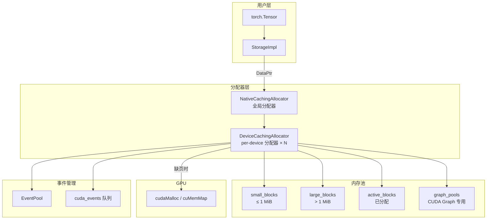
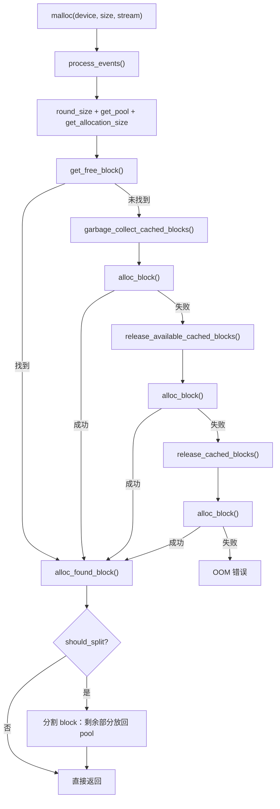
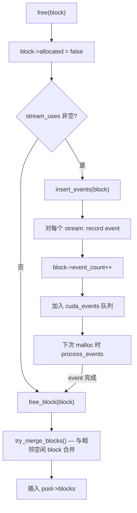
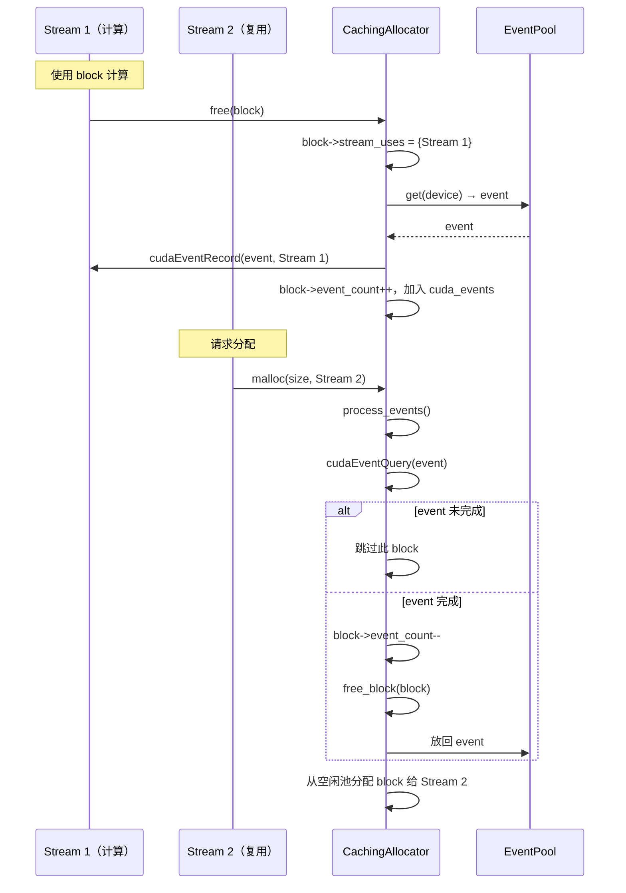
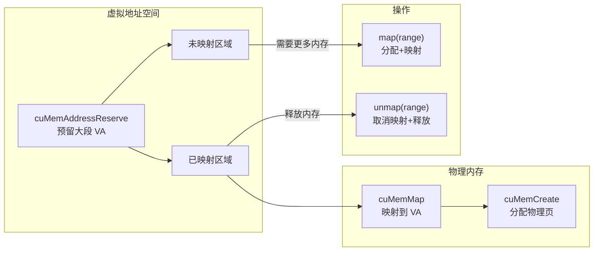
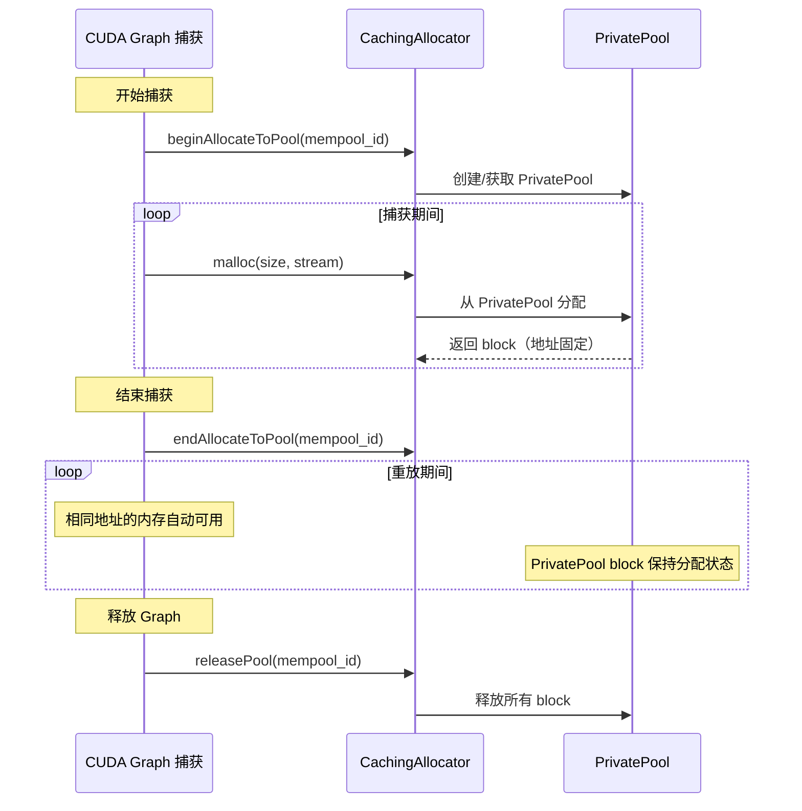
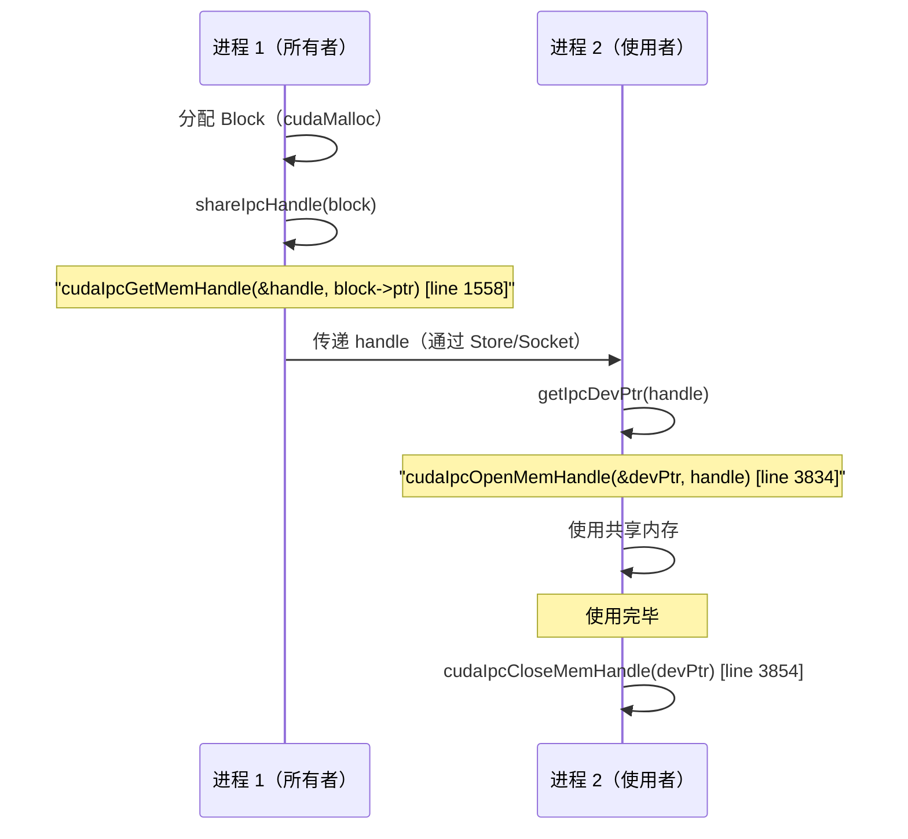

# 18. PyTorch CUDA 内存管理

## 目录

- [18.1 整体架构](#181-整体架构)
- [18.2 核心数据结构](#182-核心数据结构)
- [18.3 分配流程](#183-分配流程)
- [18.4 释放流程](#184-释放流程)
- [18.5 大小阈值与分桶策略](#185-大小阈值与分桶策略)
- [18.6 CUDA Stream/Event 交互](#186-cuda-streamevent-交互)
- [18.7 OOM 处理](#187-oom-处理)
- [18.8 ExpandableSegments](#188-expandablesegments)
- [18.9 CUDA Graph 交互](#189-cuda-graph-交互)
- [18.10 IPC 跨进程共享](#1810-ipc-跨进程共享)
- [18.11 DataPtr 与 StorageImpl](#1811-dataptr-与-storageimpl)
- [18.12 配置选项](#1812-配置选项)
- [18.13 设计权衡](#1813-设计权衡)
- [18.14 关键文件索引](#1814-关键文件索引)

---

## 18.1 整体架构

PyTorch CUDA 内存管理采用**缓存分配器（Caching Allocator）**模式：已释放的 CUDA 内存不立即归还 GPU，而是缓存在池中供后续分配复用，避免频繁 `cudaMalloc`/`cudaFree` 的开销。



### 三层类结构

| 类 | 文件 | 行号 | 职责 |
|---|---|---|---|
| `CUDAAllocator` | `CUDACachingAllocator.h` | 199 | 抽象接口（继承 `c10::Allocator`） |
| `DeviceCachingAllocator` | `CUDACachingAllocator.cpp` | 1034 | per-device 实现，管理 Block/BlockPool |
| `NativeCachingAllocator` | `CUDACachingAllocator.cpp` | 3302 | 全局入口，shard 路由到各 DeviceCachingAllocator |

---

## 18.2 核心数据结构

### Block

Block 是内存管理的基本单元，代表一段连续的 CUDA 内存。

```cpp
// CUDACachingAllocator.cpp:179
struct Block {
    int device;                    // GPU 设备号
    cudaStream_t stream;           // 分配时的 CUDA stream
    std::unordered_set<cudaStream_t> stream_uses;  // 使用该 block 的 stream 集合
    size_t size;                   // block 大小（字节）
    size_t requested_size;         // 用户请求的大小（可能 < size，因对齐）
    BlockPool* pool;               // 所属池（small_blocks 或 large_blocks）
    void* ptr;                     // CUDA 内存地址
    bool allocated;                // 是否已分配给用户
    bool mapped;                   // 是否已映射（ExpandableSegments 用）
    Block* prev;                   // 双向链表前驱（物理相邻 block）
    Block* next;                   // 双向链表后继（物理相邻 block）
    int event_count;               // 未完成的 CUDA event 计数
    int64_t gc_count_base;         // GC 计数基准
    void* context_when_allocated;         // 分配时的上下文（调试）
    void* context_when_segment_allocated; // 段分配时的上下文
    bool expandable_segment_;      // 是否属于 ExpandableSegment
};
```

### BlockPool

BlockPool 管理同一类别的空闲 block 集合。

```cpp
// CUDACachingAllocator.cpp:156
struct BlockPool {
    std::set<Block*, Comparison> blocks;          // 空闲 block 集合（按大小排序）
    std::set<Block*, Comparison> unmapped;         // 未映射的 expandable block
    const bool is_small;                           // 是否为小内存池
    PrivatePool* owner_PrivatePool;                // 所属 PrivatePool（CUDA Graph 用）
    int64_t get_free_blocks_call_count;            // GC 计数器
};
```

### AllocParams

```cpp
// CUDACachingAllocator.cpp:739
struct AllocParams {
    int device;                    // 目标设备
    size_t size;                   // 请求大小
    cudaStream_t stream;           // 目标 stream
    BlockPool* pool;               // 目标池
    size_t alloc_size;             // 实际分配大小
    Block* block;                  // 找到的 block（或 nullptr）
    // ... 搜索状态
};
```

### 辅助结构

| 结构 | 行号 | 用途 |
|---|---|---|
| `BlockState` | 686 | Block 状态快照（用于 checkpoint） |
| `SegmentRange` | 251 | ExpandableSegment 中的虚拟地址范围 |
| `PrivatePool` | 822 | CUDA Graph 专用内存池 |
| `PrivatePoolState` | 707 | PrivatePool 状态快照 |
| `EventPool` | 773 | CUDA Event 复用池 |

---

## 18.3 分配流程

### 入口

```cpp
// CUDACachingAllocator.cpp:3369
void NativeCachingAllocator::malloc(DeviceCachingAllocator::DevPtr* devPtr,
                                     int device, size_t size,
                                     cudaStream_t stream) {
    // 路由到 device_allocator[device]->malloc(...)
}
```

### DeviceCachingAllocator::malloc

```cpp
// CUDACachingAllocator.cpp:1185
void DeviceCachingAllocator::malloc(DeviceCachingAllocator::DevPtr* devPtr,
                                     int device, size_t orig_size,
                                     cudaStream_t stream) {
    // 1. process_events() — 处理已完成的 CUDA event，回收 block
    // 2. round_size(size) — 对齐大小
    // 3. get_pool(size, stream) — 选择 small_blocks 或 large_blocks
    // 4. get_allocation_size(size) — 计算实际分配大小
    // 5. 创建 AllocParams

    // 6. 尝试分配（多轮递进）
    //    a. get_free_block(params)              — 从缓存池查找  [line 1217]
    //    b. garbage_collect + alloc_block       — GC 后分配    [line 1227]
    //    c. release_available + alloc_block     — 释放缓存后分配 [line 1237]
    //    d. release_cached + alloc_block        — 全量释放后分配 [line 1240]
    //    e. OOM                                — 分配失败     [line 1245]

    // 7. alloc_found_block(params) — 处理找到的 block（可能 split）
}
```

### get_free_block

```cpp
// CUDACachingAllocator.cpp:2560
Block* DeviceCachingAllocator::get_free_block(AllocParams& params) {
    // 在 pool->blocks 中查找大小 >= params.size 的最小 block
    // 考虑 stream 兼容性：
    //   - 同 stream：直接可用
    //   - 不同 stream：需要通过 event 同步后才能复用
    // 返回找到的 block 或 nullptr
}
```

### alloc_block

```cpp
// CUDACachingAllocator.cpp:2693
bool DeviceCachingAllocator::alloc_block(AllocParams& params,
                                          bool isRetry,
                                          std::shared_ptr<LocalCache> ctx,
                                          std::shared_ptr<mutex> lock) {
    // 1. 计算分配大小
    // 2. 尝试 ExpandableSegment 分配（如果启用）
    // 3. 否则调用 cudaMalloc 分配新段
    // 4. 创建 Block 并加入 active_blocks
    // 5. 如果启用 ExpandableSegments，可能尝试虚拟地址预留
}
```

### 辅助函数

| 函数 | 行号 | 说明 |
|---|---|---|
| `round_size(size)` | 2063 | 对齐到 kMinBlockSize (512 B) 的倍数 |
| `get_pool(size, stream)` | 2507 | size ≤ kSmallSize → small_blocks，否则 → large_blocks |
| `get_allocation_size(size)` | 2550 | 计算实际分配的段大小 |
| `should_split(block, size)` | 2540 | 判断是否需要分割 block（剩余部分 ≥ kMinBlockSize） |
| `alloc_found_block(params, orig_size, ctx, split_remainder)` | 1371 | 处理找到的 block：分割、设置 allocated、更新统计 |

### 分配流程图



---

## 18.4 释放流程

### 入口

```cpp
// CUDACachingAllocator.cpp:3389
void NativeCachingAllocator::free(void* ptr) {
    // 查找 allocated_blocks[ptr] → Block*
    // 路由到 device_allocator[block->device]->free(block)
}
```

### DeviceCachingAllocator::free

```cpp
// CUDACachingAllocator.cpp:1469
void DeviceCachingAllocator::free(Block* block) {
    block->allocated = false;
    // 更新统计信息

    if (!block->stream_uses.empty()) {
        // block 被其他 stream 使用，需要等待异步操作完成
        insert_events(block);       // :3139 — 记录 CUDA event
    } else {
        // 无异步使用，直接释放
        free_block(block, ctx);     // :2397
    }
}
```

### insert_events

```cpp
// CUDACachingAllocator.cpp:3139
void DeviceCachingAllocator::insert_events(Block* block) {
    // 对 block->stream_uses 中的每个 stream：
    //   1. 从 EventPool 获取 CUDA event
    //   2. cudaEventRecord(event, stream)
    //   3. block->event_count++
    //   4. 将 (event, block) 加入 cuda_events 队列
    // block 暂时不能放回空闲池，等待 event 完成
}
```

### process_events

```cpp
// CUDACachingAllocator.cpp:3177
void DeviceCachingAllocator::process_events(std::shared_ptr<LocalCache> ctx) {
    // 遍历 cuda_events 队列
    //   对每个 (event, block)：
    //     如果 cudaEventQuery(event) == cudaSuccess：
    //       block->event_count--
    //       如果 event_count == 0：free_block(block)
    //       将 event 放回 EventPool
    // 调用时机：每次 malloc 开头
}
```

### free_block

```cpp
// CUDACachingAllocator.cpp:2397
void DeviceCachingAllocator::free_block(Block* block,
                                         std::shared_ptr<LocalCache> ctx) {
    // 1. 尝试与物理相邻的空闲 block 合并（try_merge_blocks）
    // 2. 插入 pool->blocks（空闲集合）
    // 3. 更新统计信息
    // 4. 如果是 ExpandableSegment 的 block，可能 unmap
}
```

### try_merge_blocks

```cpp
// CUDACachingAllocator.cpp:2474
Block* DeviceCachingAllocator::try_merge_blocks(Block* dst, Block* src,
                                                  BlockPool* pool) {
    // 合并两个物理相邻的空闲 block：
    //   dst->size += src->size
    //   dst->next = src->next
    //   从 pool->blocks 中移除 src
    //   删除 src
    //   返回合并后的 dst
}
```

### 释放流程图



---

## 18.5 大小阈值与分桶策略

### 关键常量

| 常量 | 行号 | 值 | 说明 |
|---|---|---|---|
| `kMinBlockSize` | 121 | 512 B | 最小 block 大小（对齐粒度） |
| `kSmallSize` | 123 | 1 MiB (1048576) | 小/大内存分界线 |
| `kSmallBuffer` | 124 | 2 MiB (2097152) | 小内存段分配大小 |
| `kMinLargeAlloc` | 126 | 10 MiB (10485760) | 需要精确大小分配的阈值 |
| `kLargeBuffer` | 51 | 20 MiB (20971520) | 大内存段分配大小 |
| `kRoundLarge` | 128 | 2 MiB (2097152) | 大分配的对齐粒度 |

### 分桶逻辑

```
get_allocation_size(size):           [行 2550]
├── size ≤ kSmallSize (1 MiB)  → kSmallBuffer (2 MiB)
├── size < kMinLargeAlloc (10 MiB) → kLargeBuffer (20 MiB)
└── size ≥ kMinLargeAlloc        → 向上取整到 kRoundLarge (2 MiB) 的倍数
```

### 池选择

```
get_pool(size, stream):              [行 2507]
├── size ≤ kSmallSize (1 MiB)  → small_blocks
└── size > kSmallSize           → large_blocks
```

### Split 决策

```
should_split(block, size):           [行 2540]
└── 剩余部分 (block->size - size) ≥ kMinBlockSize (512 B)
    → 是：分割为两个 block
    → 否：整个 block 返回给用户（略大于请求）
```

---

## 18.6 CUDA Stream/Event 交互

### 问题背景

CUDA 操作是异步的。当一个 block 在 stream A 上使用完毕后，如果 stream B 想复用该 block，必须确保 stream A 上的操作已完成。

### recordStream 机制

```cpp
// CUDACachingAllocator.cpp:1569
void DeviceCachingAllocator::recordStream(Block* block, CUDAStream stream) {
    // 将 stream 添加到 block->stream_uses
    // 表示该 block 正在被此 stream 使用
    // 释放时需要等待此 stream 完成后才能回收
}
```

```cpp
// CUDACachingAllocator.cpp:3515
void NativeCachingAllocator::recordStream(DataPtr& ptr, CUDAStream stream) {
    // 1. 检查 ptr 的 deleter 是否为 local_raw_delete
    // 2. 查找对应的 Block
    // 3. 调用 device_allocator[block->device]->recordStream(block, stream)
}
```

### EventPool

EventPool 复用 CUDA event 对象，避免频繁创建/销毁。

```cpp
// CUDACachingAllocator.cpp:773
class EventPool {
    using Event = std::unique_ptr<cudaEvent_t, std::function<void(cudaEvent_t*)>>;

    Event get(int device);            // :779 — 获取 event（从池中或新建）
    void empty_cache();               // :806 — 清空池中未使用的 event

    struct PerDevicePool {             // :814
        std::deque<Event> pool;       // 空闲 event 队列
        std::mutex mutex;
    };
    std::vector<PerDevicePool> pools_; // per-device event 池
};
```

### Stream/Event 交互流程



---

## 18.7 OOM 处理

### OOM 升级路径

在 `DeviceCachingAllocator::malloc` 中，分配失败时按以下顺序尝试回收内存：

```cpp
// CUDACachingAllocator.cpp:1214-1363
// 1. 尝试从空闲池获取
get_free_block(params)                          // :1217

// 2. 触发空闲内存回调 + 重试
trigger_free_memory_callbacks(params)           // :1221
get_free_block(params)                          // :1224

// 3. GC + 重新分配
garbage_collect_cached_blocks(ctx)              // :1227
alloc_block(params, false, ctx, lock)           // :1234

// 4. 释放可用缓存 + 重新分配
release_available_cached_blocks(params, ctx)    // :1237
alloc_block(params, false, ctx, lock)           // :1238

// 5. 全量释放（包括同步 event）+ 重新分配
release_cached_blocks(ctx)                      // :1240
alloc_block(params, true, ctx, lock)            // :1242

// 6. OOM
// 报告详细内存信息，调用 oom_observers_
```

### garbage_collect_cached_blocks

```cpp
// CUDACachingAllocator.cpp:2629
void DeviceCachingAllocator::garbage_collect_cached_blocks(
    std::shared_ptr<LocalCache> ctx) {
    // 基于 GC 阈值（garbage_collection_threshold）决定是否执行
    // 遍历空闲 block，释放长时间未使用的（基于 gc_count_base 判断）
}
```

### release_cached_blocks

```cpp
// CUDACachingAllocator.cpp:2859
void DeviceCachingAllocator::release_cached_blocks(
    std::shared_ptr<LocalCache> ctx) {
    // 1. 同步所有未完成的 CUDA event（synchronize_and_free_events）
    // 2. 释放所有非 split 的空闲 block（release_block）
    //    split block 不能单独释放（它们是更大段的一部分）
}
```

### OOM 错误信息

```cpp
// CUDACachingAllocator.cpp:1338
TORCH_CHECK_WITH(OutOfMemoryError, false,
    "CUDA out of memory. Tried to allocate ", format_size(orig_size),
    ". GPU ", device, " has a total capacity of ...",
    "Process ... has ... bytes in use",
    "... bytes freed by the caching allocator",
    ...);
```

### OutOfMemoryObserver

```cpp
// CUDACachingAllocator.h:186
using OutOfMemoryObserver = std::function<void(
    int device, size_t allocated, size_t total,
    size_t free, size_t requested)>;

// CUDACachingAllocator.cpp:1165
void DeviceCachingAllocator::attachOutOfMemoryObserver(
    OutOfMemoryObserver observer) {
    oom_observers_.push_back(std::move(observer));
}
```

---

## 18.8 ExpandableSegments

ExpandableSegments 是基于 CUDA Virtual Memory Management API（cuMemMap）的优化，允许段动态增长而无需重新分配。

### ExpandableSegment 结构

```cpp
// CUDACachingAllocator.cpp:353
struct ExpandableSegment {
    // 构造：预留虚拟地址空间
    ExpandableSegment(int device, size_t size)
        // :372 — cuMemAddressReserve_(size, alignment, 0)
        // 预留虚拟地址但未分配物理内存

    // 映射物理内存到虚拟地址范围
    void map(SegmentRange range) {
        // :384 — 为 [range.begin, range.end) 分配物理内存
        // cuMemCreate_ → cuMemMap_ → cuMemSetAccess_
    }

    // 取消映射
    void unmap(SegmentRange range) {
        // :427 — cuMemUnmap_ → 释放物理内存
        // 虚拟地址保留，物理内存归还
    }

    // 跨进程共享
    void share(SegmentRange range, std::ostream& out) {
        // :442 — cuMemExportToShareableHandle_
    }

    // 从共享句柄重建
    static ExpandableSegment fromShared(int device, ...) {
        // :462 — cuMemImportFromShareableHandle_
    }

    ~ExpandableSegment() {
        // :537 — cuMemAddressFree_ 释放虚拟地址空间
    }

private:
    void setAccess(int device, size_t begin, size_t end);    // :545
    void mapAndSetAccess(size_t begin, size_t end);           // :555
    void unmapHandles(size_t begin, size_t end);              // :571
};
```

### 虚拟地址管理流程



### ExpandableSegments 分配

```cpp
// CUDACachingAllocator.cpp:2239
Block* DeviceCachingAllocator::find_expandable_block(
    int device, cudaStream_t stream, BlockPool* pool, size_t size) {
    // 在 expandable_segments_ 中查找有足够未映射空间的段
}

// CUDACachingAllocator.cpp:2363
Block* DeviceCachingAllocator::try_allocate_expandable_block(
    int device, cudaStream_t stream, size_t size,
    BlockPool* pool) {
    // 尝试通过 ExpandableSegment 分配
    // 1. find_expandable_block — 查找现有段
    // 2. 如果没有，创建新 ExpandableSegment
    // 3. map(range) — 映射物理内存
    // 4. 创建 Block 并返回
}
```

### ExpandableSegments 的优势

| 特性 | 传统分配 | ExpandableSegments |
|---|---|---|
| 段大小 | 固定（分配时确定） | 动态增长 |
| 碎片化 | 段间碎片无法合并 | 同一虚拟地址空间内减少碎片 |
| 释放 | 整段释放或部分空闲 | unmap 部分范围，归还物理内存 |
| 开销 | 多次 cudaMalloc | 一次 VA 预留，多次 map/unmap |

---

## 18.9 CUDA Graph 交互

CUDA Graph 捕获一系列 GPU 操作为图，重放时避免 CPU 端开销。内存分配器需要确保重放时地址不变。

### PrivatePool

```cpp
// CUDACachingAllocator.cpp:822
struct PrivatePool {
    int64_t use_count;              // :833 — 引用计数
    int64_t cudaMalloc_count;       // :837 — cudaMalloc 调用次数
    BlockPool large_blocks;         // :843 — 大块池
    BlockPool small_blocks;         // :844 — 小块池
    MempoolId_t id;                 // 池 ID

    // PrivatePool 拥有独立的 BlockPool
    // 与默认池隔离，确保 CUDA Graph 重放时地址不变
};
```

### CUDA Graph 分配流程

```cpp
// CUDACachingAllocator.cpp:2086
void DeviceCachingAllocator::beginAllocateToPool(
    MempoolId_t mempool_id,
    std::function<bool(cudaStream_t)> filter) {
    // 进入 CUDA Graph 捕获模式
    // 1. captures_underway++  [line 1056]
    // 2. 创建/获取 PrivatePool
    // 3. 后续 malloc 路由到 PrivatePool 的 BlockPool
}

// CUDACachingAllocator.cpp:2101
void DeviceCachingAllocator::endAllocateToPool(
    MempoolId_t mempool_id) {
    // 退出 CUDA Graph 捕获模式
    // captures_underway--
}

// CUDACachingAllocator.cpp:2115
void DeviceCachingAllocator::releasePool(
    MempoolId_t mempool_id) {
    // 释放 PrivatePool 中的所有 block
    // 只有当 use_count == 0 时才真正释放
}
```

### CUDA Graph 内存管理策略



### 捕获期间的 Event 处理

```cpp
// CUDACachingAllocator.cpp:3158
void DeviceCachingAllocator::insert_events_deferred_until_no_capture(
    std::shared_ptr<LocalCache> ctx) {
    // CUDA Graph 捕获期间不能调用 cudaEventRecord
    // 延迟到捕获结束后再处理
}
```

---

## 18.10 IPC 跨进程共享

IPC（Inter-Process Communication）允许不同进程共享 CUDA 内存，用于多进程数据加载等场景。

### IPC 流程



### 关键方法

| 方法 | 类 | 行号 | 说明 |
|---|---|---|---|
| `shareIpcHandle(Block*)` | DeviceCachingAllocator | 1545 | 导出 IPC 句柄 |
| `shareIpcHandle(void*)` | NativeCachingAllocator | 3507 | 全局入口 |
| `getIpcDevPtr(string)` | NativeCachingAllocator | 3876 | 导入 IPC 句柄 |

### IPC 数据结构

```cpp
// CUDACachingAllocator.h:194
struct ShareableHandle {
    // 封装 IPC 句柄
};

// CUDACachingAllocator.cpp:130
constexpr int SHAREABLE_HANDLE_VERSION = 1;

// CUDACachingAllocator.cpp:131
enum class ShareableHandleType { ... };
```

### MemHandleCacheEntry

```cpp
// 在 NativeCachingAllocator 内部（:3815）
struct MemHandleCacheEntry {
    void* dev_ptr;           // 设备指针
    int64_t refcount;        // 引用计数
};
// ipcMemHandle_to_devptr: 缓存 handle → dev_ptr 映射
```

### ExpandableSegment IPC

ExpandableSegment 也支持跨进程共享，使用 `cuMemExportToShareableHandle`：

```cpp
// CUDACachingAllocator.cpp:442
void ExpandableSegment::share(SegmentRange range, std::ostream& out) {
    // cuMemExportToShareableHandle_(handle, ...)  [line 452]
}

// CUDACachingAllocator.cpp:462
ExpandableSegment ExpandableSegment::fromShared(int device, ...) {
    // cuMemImportFromShareableHandle_(...)
}
```

---

## 18.11 DataPtr 与 StorageImpl

### DataPtr

DataPtr 是分配器返回给用户的智能指针，封装了设备指针和释放器。

```cpp
// CUDACachingAllocator.cpp:3621
DataPtr NativeCachingAllocator::allocate(size_t size) {
    // 1. 选择设备（当前 CUDA 设备）
    // 2. 调用 malloc 分配
    // 3. 创建 DataPtr(ptr, device, &local_raw_delete)
    //                                            ^^^^^^^^^^^^^^^^
    //                                            自定义 deleter
}

// CUDACachingAllocator.cpp:3918
void local_raw_delete(void* ptr) {
    // 获取全局分配器
    // 调用 allocator->free(ptr)
    // 这将触发 DeviceCachingAllocator::free → insert_events 或 free_block
}
```

### StorageImpl 与分配器

```
Tensor → StorageImpl → DataPtr → Block → CUDA 内存
                      ↑
                      分配器通过 DataPtr 管理 CUDA 内存生命周期
```

- `StorageImpl` 持有 `DataPtr`，当引用计数归零时自动调用 `local_raw_delete`
- `local_raw_delete` 调用 `NativeCachingAllocator::free`，将 block 归还缓存池
- 全局分配器通过原子指针设置：`c10::cuda::CUDACachingAllocator::allocator`（`CUDACachingAllocator.h:317`）

---

## 18.12 配置选项

### CUDAAllocatorConfig

```cpp
// c10/cuda/CUDAAllocatorConfig.h
class CUDAAllocatorConfig {
    // 可通过环境变量 PYTORCH_CUDA_ALLOC_CONF 设置
    // 格式：key1:value1,key2:value2,...

    size_t max_split_size;              // 最大 split 大小
    double garbage_collection_threshold; // GC 阈值（0.0-1.0）
    bool expandable_segments;           // 是否启用 ExpandableSegments
    bool release_lock_on_cudamalloc;    // cudaMalloc 时是否释放锁
    size_t roundup_power2_divisions;    // 2 的幂次对齐
    size_t max_non_split_rounding_size; // 非 split 分配的最大取整大小
};
```

### 环境变量

| 变量 | 说明 |
|---|---|
| `PYTORCH_CUDA_ALLOC_CONF` | 分配器配置（格式见上） |
| `PYTORCH_NO_CUDA_MEMORY_CACHING` | 禁用缓存（每次直接 cudaMalloc/cudaFree） |

---

## 18.13 设计权衡

| 设计决策 | 选择 | 原因 |
|---|---|---|
| 缓存分配 | 不立即归还 GPU | 避免 cudaMalloc/cudaFree 的同步开销 |
| 双池（small/large） | 按 1 MiB 分界 | 小分配使用小块段，减少内部碎片 |
| 分段分配 | 2 MiB/20 MiB 批量分配 | 减少 cudaMalloc 调用次数 |
| Block split/merge | 分配时 split，释放时 merge | 适配不同大小请求，减少外部碎片 |
| Event 延迟释放 | 等待异步操作完成 | 正确性优先，避免 use-after-free |
| EventPool | 复用 CUDA event | event 创建有开销（~10us） |
| ExpandableSegments | 虚拟地址预留 | 减少段碎片，支持动态增长 |
| PrivatePool | CUDA Graph 专用池 | 确保重放时地址不变 |
| IPC handle 缓存 | MemHandleCacheEntry | 避免重复 open/close 开销 |
| 分配器全局原子指针 | 运行时切换实现 | 支持 PluggableAllocator |
| 67 shard mutex | allocated_blocks 分片锁 | 减少多线程分配时的锁竞争 |

---

## 18.14 关键文件索引

| 文件 | 说明 |
|---|---|
| `c10/cuda/CUDACachingAllocator.h` | 公共头文件：CUDAAllocator 接口（:199）、BlockInfo/SegmentInfo/SnapshotInfo/TraceEntry/MemPool/MemPoolContext |
| `c10/cuda/CUDACachingAllocator.cpp` | 完整实现：DeviceCachingAllocator（:1034）、NativeCachingAllocator（:3302）、Block（:179）、BlockPool（:156）、ExpandableSegment（:353）、PrivatePool（:822）、EventPool（:773） |
| `c10/cuda/CUDAAllocatorConfig.h` | CUDAAllocatorConfig 类声明 |
| `c10/cuda/CUDAAllocatorConfig.cpp` | 配置解析实现 |
| `c10/core/CachingDeviceAllocator.h` | 通用 CachingDeviceAllocator 基类、DeviceStats |
