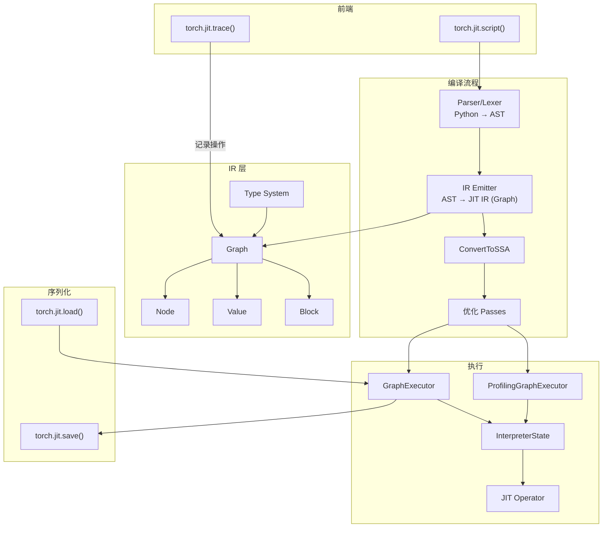
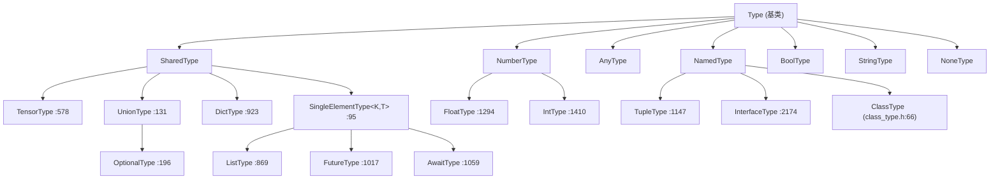
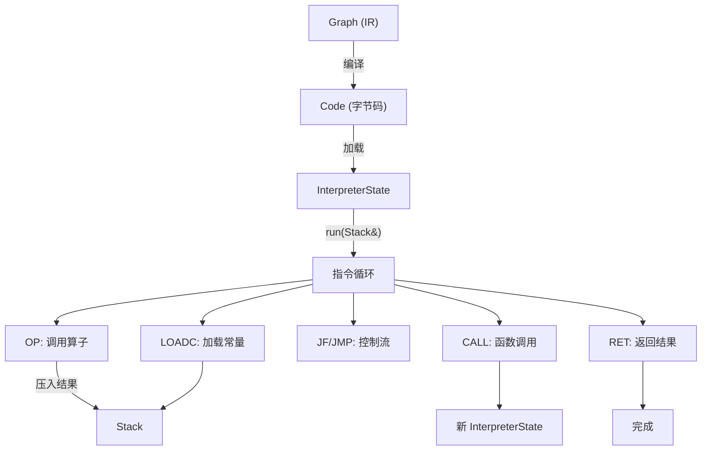
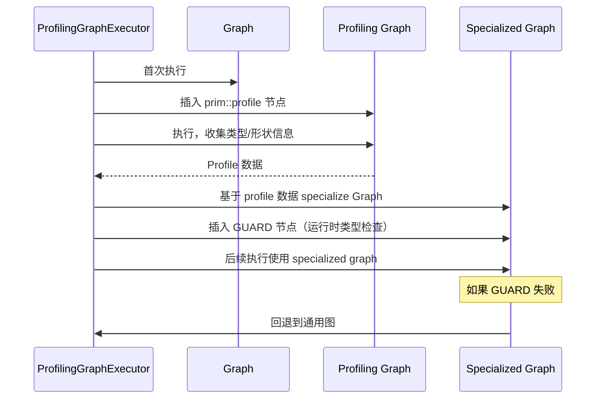

# 19. PyTorch JIT / TorchScript 编译系统

## 目录

- [19.1 整体架构](#191-整体架构)
- [19.2 JIT IR：Graph、Node、Value、Block](#192-jit-irgraphnodevalueblock)
- [19.3 JIT 类型系统](#193-jit-类型系统)
- [19.4 前端：Python 到 IR 的编译](#194-前端python-到-ir-的编译)
- [19.5 优化 Pass](#195-优化-pass)
- [19.6 JIT 解释器](#196-jit-解释器)
- [19.7 GraphExecutor](#197-graphexecutor)
- [19.8 TorchScript Python API](#198-torchscript-python-api)
- [19.9 JIT 算子注册](#199-jit-算子注册)
- [19.10 设计权衡](#1910-设计权衡)
- [19.11 关键文件索引](#1911-关键文件索引)

---

## 19.1 整体架构

PyTorch JIT（Just-In-Time Compiler）将 Python 模型编译为**类型化的中间表示（IR）**，经过优化后可序列化保存或在 C++ 中执行。TorchScript 是 JIT 的用户面向 API。



两种编译方式：

| 方式 | 方法 | 原理 | 限制 |
|---|---|---|---|
| **Script** | `torch.jit.script()` | 解析 Python 源码 → AST → IR | 支持完整控制流，但需 TorchScript 子集 |
| **Trace** | `torch.jit.trace()` | 运行示例输入，记录张量操作 | 不记录数据依赖控制流（if/for） |

---

## 19.2 JIT IR：Graph、Node、Value、Block

JIT IR 是**纯函数式 SSA（Static Single Assignment）**表示，核心定义在 `torch/csrc/jit/ir/ir.h`。

### Value

Value 表示 Node 的一个输入或输出，是 SSA 中的值定义。

```cpp
// ir.h:178
struct Value {
    Node* node_;              // 定义此 Value 的 Node
    size_t offset_;           // 在 Node 输出中的位置
    size_t unique_;           // 全局唯一 ID
    use_list uses_;           // 所有使用此 Value 的 (Node*, offset) 列表
    TypePtr type_;            // JIT 类型

    TypePtr type() const;                          // :199
    size_t unique() const;                          // :214
    void setDebugName(const std::string&);          // :221
    const std::string& debugName() const;           // :222
    Node* node() const;                             // :229
    Graph* owningGraph() const;                     // :246
    const use_list& uses() const;                   // :249
    void replaceFirstUseWith(Value* newValue);      // :257
    void replaceAllUsesWith(Value* newValue);       // :268
    void replaceAllUsesAfterNodeWith(const Node*, Value*);  // :282
    void replaceAllUsesDominatedByNodeWith(const Node*, Value*);  // :296
};
```

### Node

Node 表示一个计算操作，拥有输入 Value 列表和输出 Value 列表。

```cpp
// ir.h:316
struct TORCH_API Node {
    const NodeKind kind_;                    // 操作类型（Symbol）
    std::vector<Value*> inputs_;             // 输入值
    std::vector<Value*> outputs_;            // 输出值
    std::vector<Block*> blocks_;             // 子块（If/Loop 的结构化控制流）
    Graph* graph_;                           // 所属 Graph
    Block* owning_block_;                    // 所属 Block

    NodeKind kind() const;                   // :396
    Graph* owningGraph() const;              // :409
    Block* owningBlock() const;              // :415
    const std::vector<Value*>& inputs() const;   // :457
    const std::vector<Value*>& outputs() const;  // :471
    bool hasUses() const;                    // :482
    Value* addInput(Value* value);           // :574
    void replaceInput(size_t i, Value*);     // :586
    Value* addOutput();                      // :596
    Block* addBlock();                       // :602
    void destroy();                          // :743
    const FunctionSchema& schema() const;    // :797
    Operation getOperation();                // :800
};
```

Node 的关键属性：

| 属性 | 类型 | 说明 |
|---|---|---|
| `kind_` | `NodeKind` (Symbol) | 操作类型，如 `prim::If`、`aten::add` |
| `inputs_` | `vector<Value*>` | 输入值列表 |
| `outputs_` | `vector<Value*>` | 输出值列表 |
| `blocks_` | `vector<Block*>` | 子块（控制流节点专用） |
| 属性 | `i_`, `f_`, `s_`, `g_`, `ty_`, `ival_` | 常量属性（整型/浮点/字符串/子图/类型/IValue） |

### Block

Block 是 Node 的有序列表，拥有输入参数和输出返回值，用于结构化控制流。

```cpp
// ir.h:1024
struct Block {
    Graph* const graph_;              // 所属 Graph
    Node* const output_;              // 返回节点
    Node* const input_;               // 参数节点
    Node* const owning_node_;         // 拥有此 Block 的 Node（If/Loop）

    const std::vector<Value*>& inputs() const;    // :1031
    const std::vector<Value*>& outputs() const;   // :1038
    graph_node_list nodes() const;                // :1044
    Node* return_node() const;                    // :1050
    Node* param_node() const;                     // :1056
    Value* addInput(const std::string&);          // :1079
    Value* registerOutput(Value*);                // :1095
    void appendNode(Node*);                       // :1120
};
```

控制流节点的 Block 结构：

```
prim::If(cond)
  block0():     ← True 分支
    ...
    → outputs
  block1():     ← False 分支
    ...
    → outputs

prim::Loop(max_trip_count, start_condition)
  block0(i, carried):   ← 循环体
    ...
    → (continue_condition, carried_values)
```

### Graph

Graph 表示一个完整的计算函数，拥有所有 Node/Value/Block 的所有权。

```cpp
// ir.h:1180
struct Graph : std::enable_shared_from_this<Graph> {
    std::unordered_set<const Node*> all_nodes;     // 所有 Node（所有权）
    std::unordered_set<const Value*> all_values;   // 所有 Value（所有权）
    size_t next_unique_;                           // 下一个唯一 ID
    Block* const block_;                           // 顶层 Block

    std::vector<Value*>& inputs();                  // :1218
    std::vector<Value*>& outputs();                 // :1225
    graph_node_list nodes() const;                 // :1232
    Value* addInput(const std::string&);            // :1274
    Value* registerOutput(Value*);                  // :1283

    // Node 创建
    Node* create(NodeKind, size_t n_outputs);       // :1290
    Node* createWithSubgraph(Symbol kind);          // :1299
    Node* createTuple(...);                         // :1301
    Node* createList(...);                          // :1316
    Node* createDict(...);                          // :1320

    // 常量和插入
    Value* insertConstant(const IValue&, ...);      // :1367
    Value* insert(Symbol, args, kwargs, range);     // :1379
    Node* insertNode(Node*);                        // :1396

    // 插入点管理
    void setInsertPoint(Block*);                    // :1403
    void setInsertPoint(Node*);                     // :1410
};
```

### IR 示例

```python
# Python 代码
def foo(x: Tensor, y: Tensor) -> Tensor:
    z = x + y
    if z.sum() > 0:
        return z * 2
    else:
        return z * -1
```

对应的 JIT IR：

```
graph(%x.1 : Tensor, %y.1 : Tensor):
  %z.1 : Tensor = aten::add(%x.1, %y.1, %3)       # z = x + y
  %4 : Tensor = aten::sum(%z.1, %5, %6)            # z.sum()
  %7 : bool = aten::gt(%4, %8)                      # z.sum() > 0
  %9 : Tensor = prim::If(%7)                        # if 语句
    block0():
      %10 : Tensor = aten::mul(%z.1, %11)           # z * 2
      → (%10)
    block1():
      %12 : Tensor = aten::mul(%z.1, %13)           # z * -1
      → (%12)
  return (%9)
```

---

## 19.3 JIT 类型系统

JIT 拥有独立的类型系统，用于 IR 中的类型标注和类型推导。

所有类型定义在 `aten/src/ATen/core/jit_type.h`。

### 类型层次



### 核心类型

| 类型 | 行号 | 说明 | 示例 |
|---|---|---|---|
| `TensorType` | 578 | 张量类型（可选形状/stride/dtype/device） | `Float(3, 4, strides=[4, 1], device=cuda:0)` |
| `ListType` | 869 | 列表类型 | `int[]`, `Tensor[]` |
| `DictType` | 923 | 字典类型 | `Dict(str, Tensor)` |
| `TupleType` | 1147 | 元组类型 | `Tuple[int, Tensor]` |
| `OptionalType` | 196 | 可选类型 | `Optional[Tensor]` |
| `FutureType` | 1017 | Future 类型 | `Future[Tensor]` |
| `ClassType` | class_type.h:66 | 类类型（ScriptModule/自定义类） | `__torch__.MyModule` |
| `InterfaceType` | 2174 | 接口类型 | `ModuleInterface` |
| `NumberType` | 1268 | 数值类型（int/float 的联合） | Python `numbers.Number` |
| `IntType` | 1410 | 整型 | `int` |
| `FloatType` | 1294 | 浮点型 | `float` |
| `BoolType` | 1436 | 布尔型 | `bool` |
| `StringType` | 1454 | 字符串型 | `str` |
| `NoneType` | 1530 | 空类型 | `None` |

### TensorType 详解

```cpp
// jit_type.h:578
struct TORCH_API TensorType : public SharedType {
    static TensorTypePtr create(const at::Tensor&);           // 从实际 Tensor 推导
    static TensorTypePtr create(scalar_type, device,
                                 sizes, strides, requires_grad, ...);
    static TensorTypePtr createContiguous(...);

    std::optional<int64_t> dim() const;         // 维度数（可能未知）
    std::optional<std::vector<int64_t>> sizes() const;    // 形状
    std::optional<std::vector<int64_t>> strides() const;  // 步长
    std::optional<Device> device() const;       // 设备
    std::optional<ScalarType> scalarType() const;  // 数据类型
    std::optional<bool> requiresGrad() const;   // 是否需要梯度
};
```

TensorType 的每个属性都是 `optional` 的——JIT IR 允许部分类型信息未知，优化 pass 可以逐渐精化（refinement）。

---

## 19.4 前端：Python 到 IR 的编译

### Script 编译流程


### IR Emitter

IR Emitter 将 AST 节点转换为 JIT IR：

```cpp
// ir_emitter.cpp:769
FunctionSchema emitDef(const Def& def, const Self* self, Block* block);
// 将函数定义 AST (Def) 转换为 Graph 中的 Node

// ir_emitter.cpp:917, 1114
void emitStatements(...);
// 将语句列表转换为 IR
```

编译后立即执行的 Pass 链（`ir_emitter.cpp:678+`）：

| Pass | 行号 | 说明 |
|---|---|---|
| `ReplaceOldOperatorsWithUpgraders` | 683 | 替换已弃用的算子为新版本 |
| `ConvertToSSA` | 689 | 将局部变量赋值转换为 SSA 形式 |
| `CanonicalizeModifiedLoops` | 695 | 规范化循环结构 |
| `NormalizeOps` | 698 | 规范化算子表示 |

### SugaredValue

Python 的高级语义在 JIT 中通过 SugaredValue 进行脱糖（desugaring）：

```cpp
// sugared_value.h:27
struct TORCH_API SugaredValue {
    virtual std::string kind() const = 0;
    virtual Value* asValue(const SourceRange&, GraphFunction&);  // :34
    virtual std::shared_ptr<SugaredValue> attr(...);             // :39
    virtual void setAttr(...);                                    // :54
    virtual std::shared_ptr<SugaredValue> asTuple(...);          // :66
};
```

SugaredValue 子类将 Python 语义映射到 IR：

| 子类 | 说明 |
|---|---|
| `Self` | `self` 引用（ScriptModule 属性访问） |
| `ModuleValue` | 模块属性和方法 |
| `ClassValue` | 类构造 |
| `FunctionValue` | 函数调用 |
| `BuiltinFunction` | 内置函数 |

### Trace 编译流程

```cpp
// tracer.h:42
struct TORCH_API TracingState {
    std::shared_ptr<Graph> graph;     // 记录的操作图
    bool warn;                        // 是否警告不支持的构造
    bool strict;                      // 严格模式
    bool force_outplace;              // 强制原地操作转为非原地

    void setValue(const IValue&, Value*);
    Value* getValue(const IValue&);
    Node* createNode(Symbol kind, size_t n);
    void insertNode(Node*);
};

// tracer.h:219
std::pair<std::shared_ptr<TracingState>, Stack> trace(...);
// 核心追踪函数：在给定输入上运行函数，记录所有操作
```

---

## 19.5 优化 Pass

所有优化 Pass 在 `torch/csrc/jit/passes/` 目录下。

### 核心 Pass 列表

| Pass | 文件 | 行号 | 说明 |
|---|---|---|---|
| `EliminateCommonSubexpression` | `common_subexpression_elimination.h` | 7 | 公共子表达式消除 |
| `ConstantPooling` | `constant_pooling.h` | 7 | 常量池化（相同常量共享） |
| `EliminateDeadCode` | `dead_code_elimination.h` | 24 | 死代码消除 |
| `ConstantPropagation` | `constant_propagation.h` | 13 | 常量传播（在编译期计算常量表达式） |
| `PeepholeOptimize` | `peephole.h` | 8 | 窥孔优化（模式匹配的局部优化） |
| `FuseAddMM` | `peephole.h` | 16 | 融合 add + matmul → addmm |
| `FuseGraph` | `graph_fuser.h` | 13 | 传统图融合 |
| `FuseTensorExprs` | `tensorexpr_fuser.h` | 13 | TensorExpr 融合 |
| `FuseLinear` | `fuse_linear.h` | 14 | 融合线性层 |
| `FuseAddRelu` | `fuse_relu.h` | 7 | 融合 add + relu |
| `Canonicalize` | `canonicalize.h` | 7 | 规范化 |
| `Inline` | `inliner.h` | 8 | 函数内联 |
| `PropagateInputShapes` | `shape_analysis.h` | 34 | 形状传播 |
| `freeze_module` | `freeze_module.h` | 21 | 模块冻结（内联属性为常量） |

### Pass 管理器

```cpp
// pass_manager.h:23
using GraphPass = std::function<void(std::shared_ptr<Graph>&)>;

// pass_manager.h:34, 36
std::vector<std::pair<GraphPass, std::string>>& getCustomPrePasses();
std::vector<std::pair<GraphPass, std::string>>& getCustomPostPasses();

// pass_manager.h:50
struct TORCH_API RegisterPostPass {
    // RAII 注册自定义后处理 Pass
};
```

### 优化 Pass 执行顺序

典型 GraphExecutor 的优化链：

```
原始 Graph
  → EliminateDeadCode
  → EliminateCommonSubexpression
  → ConstantPooling
  → ConstantPropagation
  → PeepholeOptimize
  → FuseGraph / FuseTensorExprs
  → Inline
  → Canonicalize
  → 用户自定义 PostPasses
优化后 Graph
```

### SubgraphRewriter

模式匹配和替换的通用工具：

```cpp
// subgraph_rewrite.h:47
class TORCH_API SubgraphRewriter {
    // 定义模式图和替换图
    SubgraphRewriter& rewritePattern(const std::string& pattern,
                                      const std::string& replacement);
    void runOnGraph(std::shared_ptr<Graph>&);
};
```

---

## 19.6 JIT 解释器

JIT 解释器将优化后的 Graph 编译为**字节码指令**并执行。

### 指令集

```cpp
// instruction.h:21 — 完整操作码列表
#define FORALL_OPCODES(_)
  _(OP)            // 调用 JIT Operator
  _(OPN)           // 带参数数量的 OP
  _(LOAD)          // 加载寄存器值
  _(MOVE)          // 移动寄存器值
  _(STOREN)        // 存储 N 个值
  _(STORE)         // 存储值
  _(DROP)          // 丢弃值
  _(DROPR)         // 丢弃寄存器值
  _(LOADC)         // 加载常量
  _(JF)            // 条件跳转（假）
  _(JMP)           // 无条件跳转
  _(LOOP)          // 循环
  _(RET)           // 返回
  _(CALL)          // 函数调用
  _(GUARD)         // 类型守卫
  _(TAIL_CALL)     // 尾调用
  _(GET_ATTR)      // 获取属性
  _(SET_ATTR)      // 设置属性
  _(LIST_CONSTRUCT)   // 构建列表
  _(DICT_CONSTRUCT)   // 构建字典
  _(TUPLE_CONSTRUCT)  // 构建元组
  _(CREATE_OBJECT)    // 创建对象
  _(ISINSTANCE)       // isinstance 检查
  _(FORK)            // fork 异步执行
  ...
```

```cpp
// instruction.h:84
struct Instruction {
    OpCode op;         // 操作码
    uint8_t unused;
    uint16_t N;        // 操作数 N
    int32_t X;         // 操作数 X
};
```

### Code

Code 是 Graph 的编译表示，包含指令序列和常量表。

```cpp
// interpreter.h:45
struct TORCH_API Code {
    Code(const std::shared_ptr<Graph>&, std::string function_name,
         size_t remaining_bailout_depth);         // :51

    size_t num_inputs() const;                    // :62
    size_t num_outputs() const;                   // :63
    const std::vector<Instruction>& instructions() const;  // :67
    const std::vector<IValue>& constant_table() const;      // :65
    const std::vector<TypePtr>& type_table() const;         // :66
    size_t register_size() const;                 // :72
    const std::shared_ptr<Graph>& graph() const;  // :73
};
```

### InterpreterState

InterpreterState 是解释器的运行时状态，执行 Code 中的指令。

```cpp
// interpreter.h:91
struct InterpreterState {
    InterpreterState(const Code&, TaskLauncher);   // :92
    void run(Stack&);                              // :95 — 同步执行
    c10::intrusive_ptr<Future> runAsync(Stack&);   // :96 — 异步执行
    c10::intrusive_ptr<Future> getFuture();        // :97
};
```

### 执行模型



---

## 19.7 GraphExecutor

GraphExecutor 管理 Graph 的执行策略，包括优化和 profiling。

### 基类

```cpp
// graph_executor.h:63
struct TORCH_API GraphExecutor {
    GraphExecutor(const std::shared_ptr<Graph>&, std::string);  // :65
    void run(Stack&);                                            // :72
    void runAsync(...);                                          // :73
    ExecutionPlan getPlanFor(Stack&, remaining_bailout_depth);   // :88
};
```

### 两种执行模式

```cpp
// graph_executor.h:20
enum ExecutorExecutionMode { SIMPLE, PROFILING };
```

| 模式 | 实现类 | 说明 |
|---|---|---|
| `SIMPLE` | `SimpleGraphExecutorImpl` | 直接执行，不做 profiling |
| `PROFILING` | `ProfilingGraphExecutorImpl` | 先插入 profiling 节点，收集类型信息后 specialize |

### Profiling 执行流程



### ExecutionPlan

```cpp
// graph_executor.h:25
struct ExecutionPlan {
    std::shared_ptr<Graph> graph;    // 优化后的 Graph
    Code code;                       // 编译后的字节码
};
```

---

## 19.8 TorchScript Python API

### torch.jit.script

```python
# torch/jit/_script.py:1218
def script(obj, optimize=None, _frames_up=0, _rcb=None, example_inputs=None):
    """将 Python 函数/模块编译为 TorchScript

    - 函数：源码解析 → IR
    - nn.Module：递归编译所有方法和子模块
    """
```

### torch.jit.trace

```python
# torch/jit/_trace.py:825
def trace(func, example_inputs, optimize=True, check_trace=True, ...):
    """追踪函数执行，记录张量操作

    - 运行 func(example_inputs)
    - 记录所有张量操作为 Graph
    - check_trace=True 时用随机输入验证一致性
    """

# torch/jit/_trace.py:1118
def trace_module(mod, inputs, optimize=True, check_trace=True, ...):
    """追踪 nn.Module"""
```

### torch.jit.save / torch.jit.load

```python
# torch/jit/_serialization.py:21
def save(m, f, _extra_files=None):
    """保存 ScriptModule 到文件"""

# torch/jit/_serialization.py:90
def load(f, map_location=None, _extra_files=None, _restore_shapes=False):
    """加载 ScriptModule"""
```

### RecursiveScriptModule

```python
# torch/jit/_script.py:595
class RecursiveScriptModule(ScriptModule):
    """JIT 编译后的 Python 侧表示"""
    def __init__(self, cpp_module):       # :625
    def _construct(cpp_module, init_fn):  # :635
```

### CompilationUnit

```cpp
// torch/csrc/jit/api/compilation_unit.h:46
struct TORCH_API CompilationUnit {
    Function* find_function(const QualifiedName&);   // :58
    Function* get_function(const QualifiedName&);    // :66
    void define(prefix, properties, definitions, resolvers, ...);  // :88
    void define(prefix, source, resolver, self);     // :113
};
```

---

## 19.9 JIT 算子注册

### jit::Operator

```cpp
// torch/csrc/jit/runtime/operator.h:61
struct TORCH_API Operator {
    // 内部变体
    struct C10Operator { c10::OperatorHandle; Operation; };   // :64 — c10 算子包装
    struct JitOnlyOperator { Operation; ... };                // :73 — 仅 JIT 算子

    // 构造
    Operator(c10::OperatorHandle, Operation);            // :82 — 从 c10 算子
    Operator(string schema, Operation, alias_analysis);  // :85 — JIT 专用
    Operator(Symbol name, OperationCreator, ...);        // :121 — 延迟创建

    Operation getOperation(const Node* node);            // :129 — 获取 Node 的执行函数
    const FunctionSchema& schema() const;                // :163
    bool isC10Op() const;                                // :203
};
```

### 算子注册函数

```cpp
// operator.h:263-294
std::vector<std::shared_ptr<Operator>> getAllOperators();            // :265
const std::vector<std::shared_ptr<Operator>>&
    getAllOperatorsFor(Symbol name);                                  // :266
std::shared_ptr<Operator> findOperatorFor(const c10::OperatorName&); // :274
void registerOperator(Operator&&);                                   // :279
void deregisterOperator(const FunctionSchema&);                      // :280
```

### c10 算子桥接

JIT 解释器执行 Node 时，通过 `getOperation()` 获取执行函数：

1. 如果 `isC10Op()` → 直接路由到 c10 Dispatcher
2. 如果是 JIT-only → 执行注册的 `Operation` 函数

`register_c10_ops.cpp` 将 c10 算子包装为 JIT Operator。

---

## 19.10 设计权衡

| 设计决策 | 选择 | 原因 |
|---|---|---|
| SSA 形式 | 纯函数式 IR | 简化优化 pass 的实现（数据流分析、CSE 等） |
| Block 结构化控制流 | prim::If/Loop + Block | 比 goto 更易分析和变换 |
| 两种编译方式 | script + trace | script 覆盖完整语义，trace 简单但有限制 |
| Profiling 执行 | 运行时 specialize | 利用实际数据类型优化，但增加编译延迟 |
| 独立类型系统 | TensorType 可选形状 | 支持渐进类型精化，兼顾灵活性和优化 |
| 字节码解释 | 而非直接编译到机器码 | 可移植性优先，TensorExpr 提供 JIT 编译路径 |
| 算子双注册 | JIT Operator + c10 Dispatcher | 允许 JIT-only 算子和标准 c10 算子共存 |

---

## 19.11 关键文件索引

| 文件 | 说明 |
|---|---|
| `torch/csrc/jit/ir/ir.h` | IR 核心：Value（:178）、Node（:316）、Block（:1024）、Graph（:1180） |
| `aten/src/ATen/core/jit_type.h` | 类型系统：TensorType（:578）、ListType（:869）、DictType（:923）等 |
| `aten/src/ATen/core/class_type.h` | ClassType（:66） |
| `torch/csrc/jit/frontend/parser.h` | Parser（:10） |
| `torch/csrc/jit/frontend/lexer.h` | Lexer（:408） |
| `torch/csrc/jit/frontend/tree_views.h` | AST：Def（:404）、ClassDef（:459） |
| `torch/csrc/jit/frontend/ir_emitter.cpp` | IR 生成：emitDef（:769） |
| `torch/csrc/jit/frontend/sugared_value.h` | SugaredValue（:27） |
| `torch/csrc/jit/frontend/tracer.h` | TracingState（:42）、trace（:219） |
| `torch/csrc/jit/api/compilation_unit.h` | CompilationUnit（:46） |
| `torch/csrc/jit/api/module.h` | Module（:87） |
| `torch/csrc/jit/runtime/instruction.h` | 指令集和 Instruction 结构（:84） |
| `torch/csrc/jit/runtime/interpreter.h` | Code（:45）、InterpreterState（:91） |
| `torch/csrc/jit/runtime/graph_executor.h` | GraphExecutor（:63） |
| `torch/csrc/jit/runtime/profiling_graph_executor_impl.h` | ProfilingGraphExecutorImpl（:14） |
| `torch/csrc/jit/runtime/operator.h` | jit::Operator（:61）、注册函数（:263-294） |
| `torch/csrc/jit/passes/` | 优化 Pass 目录 |
| `torch/csrc/jit/passes/pass_manager.h` | Pass 管理器（:23） |
| `torch/jit/_script.py` | torch.jit.script（:1218）、RecursiveScriptModule（:595） |
| `torch/jit/_trace.py` | torch.jit.trace（:825）、trace_module（:1118） |
| `torch/jit/_serialization.py` | save（:21）、load（:90） |
| `torch/jit/_recursive.py` | 递归编译：create_script_module（:536） |
