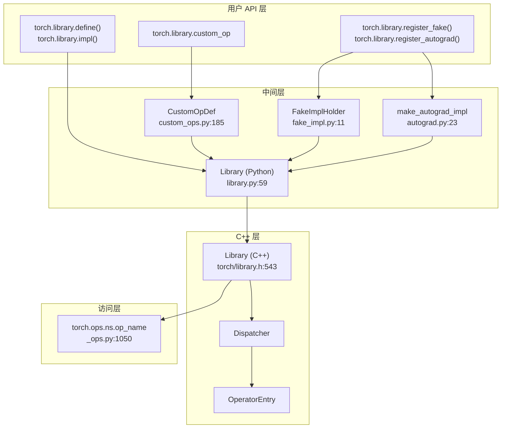
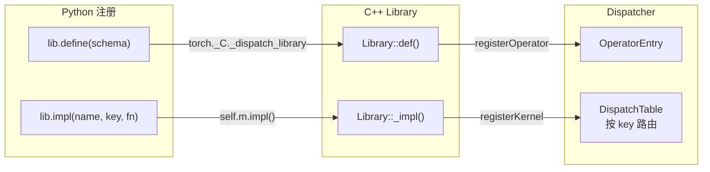
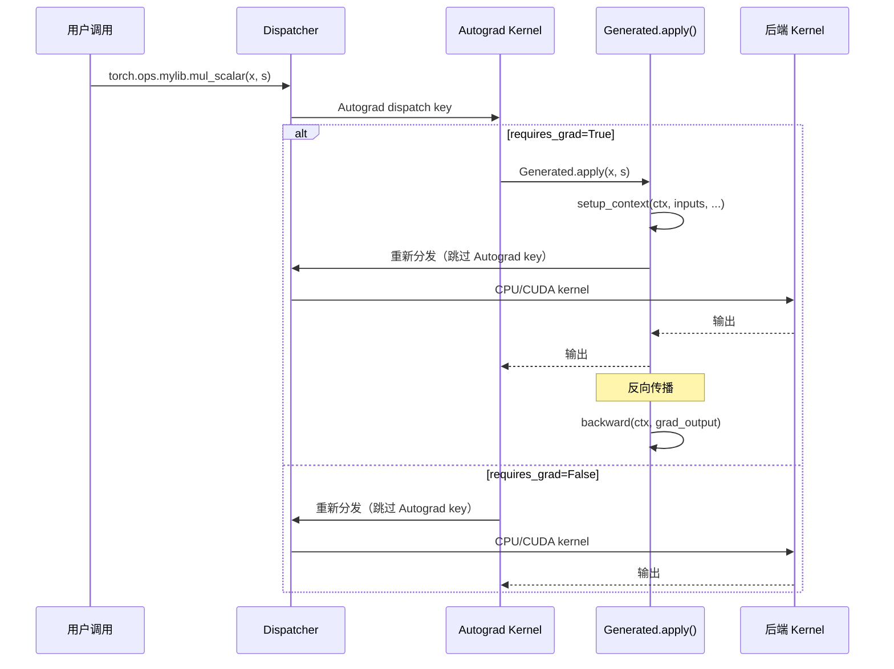
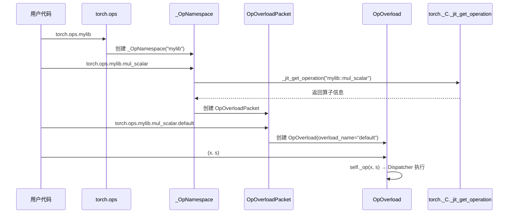

# 20. PyTorch 自定义算子系统（torch.library）

## 目录

- [20.1 整体架构](#201-整体架构)
- [20.2 torch.library 公共 API](#202-torchlibrary-公共-api)
- [20.3 Library 类（Python 侧）](#203-library-类python-侧)
- [20.4 Library 类（C++ 侧）](#204-library-类c-侧)
- [20.5 CustomOpDef 与 custom_op 装饰器](#205-customopdef-与-custom_op-装饰器)
- [20.6 与 Dispatcher 的集成](#206-与-dispatcher-的集成)
- [20.7 register_fake：FakeTensor 支持](#207-register_fakefaketensor-支持)
- [20.8 register_autograd：自动微分公式注册](#208-register_autograd自动微分公式注册)
- [20.9 torch.ops 命名空间](#209-torchops-命名空间)
- [20.10 TorchBind：自定义 C++ 类](#2010-torchbind自定义-c-类)
- [20.11 设计权衡](#2011-设计权衡)
- [20.12 关键文件索引](#2012-关键文件索引)

---

## 20.1 整体架构

PyTorch 自定义算子系统允许用户注册新的算子及其在 Dispatcher 各 dispatch key 上的实现，从而与 `torch.compile`、autograd、FakeTensor 等子系统无缝集成。



两种主要使用模式：

| 模式 | API | 适用场景 |
|---|---|---|
| **分步注册** | `torch.library.define()` + `torch.library.impl()` + `register_fake()` + `register_autograd()` | 灵活控制每一步注册 |
| **声明式** | `@torch.library.custom_op` | 一站式注册算子 + 实现 + fake + autograd |

---

## 20.2 torch.library 公共 API

所有公共 API 在 `torch/library.py` 中。

### 顶层函数

| 函数 | 行号 | 说明 |
|---|---|---|
| `define(qualname, schema)` | 452 | 定义新算子及其 schema |
| `impl(qualname, types)` | 533 | 注册算子实现（按设备类型） |
| `register_kernel(op, device_types)` | 677 | 注册设备特定实现 |
| `register_fake(op, func)` | 743 | 注册 FakeTensor 实现 |
| `register_autograd(op, backward, setup_context=)` | 864 | 注册自动微分公式 |
| `register_torch_dispatch(op, class, func)` | 994 | 注册 `__torch_dispatch__` 规则 |
| `register_vmap(op, func)` | 1075 | 注册 vmap 实现 |
| `get_ctx()` | 1259 | 获取 fake impl 上下文（数据依赖形状） |
| `opcheck(op, args)` | 1276 | 验证自定义算子正确性 |

### 使用示例

```python
import torch
from torch.library import define, impl, register_fake, register_autograd

# 1. 定义算子 schema
define("mylib::mul_scalar(Tensor x, Scalar s) -> Tensor")

# 2. 注册 CPU 实现
@impl("mylib::mul_scalar", "cpu")
def mul_scalar_cpu(x, s):
    return x * s

# 3. 注册 CUDA 实现
@impl("mylib::mul_scalar", "cuda")
def mul_scalar_cuda(x, s):
    return x * s

# 4. 注册 FakeTensor 实现
@register_fake("mylib::mul_scalar")
def mul_scalar_fake(x, s):
    return torch.empty_like(x)

# 5. 注册 autograd 公式
@register_autograd("mylib::mul_scalar")
def mul_scalar_backward(ctx, grad_output):
    s = ctx.s
    return grad_output * s, None

def mul_scalar_setup_context(ctx, inputs, output):
    _, s = inputs
    ctx.s = s

# 使用
y = torch.ops.mylib.mul_scalar(x, 2.0)
```

---

## 20.3 Library 类（Python 侧）

Library 是算子注册的核心句柄，管理一组算子的定义和实现。

```python
# torch/library.py:59
class Library:
    def __init__(self, ns, kind, dispatch_key=""):    # :78
        """创建 Library 句柄

        Args:
            ns: 命名空间（如 "mylib"）
            kind: "DEF"（定义新算子）/ "IMPL"（注册实现）/ "FRAGMENT"（可重复注册）
            dispatch_key: 默认 dispatch key
        """

    def define(self, schema, alias_analysis="", *, tags=()):  # :119
        """定义新算子及其 schema"""

    def impl(self, name, dispatch_key, fn, *, with_keyset=False):  # :277
        """注册实现函数"""

    def fallback(self, fn, *, with_keyset=False):  # :359
        """注册 fallback 实现（仅全局命名空间 "_"）"""

    def _register_fake(self, name, fn, ...):  # :171
        """内部：注册 fake/meta 实现"""

    def _destroy(self):  # :396
        """注销此 Library 的所有注册"""
```

### Library Kind

| Kind | 说明 | 约束 |
|---|---|---|
| `DEF` | 定义新算子 | 命名空间必须唯一 |
| `IMPL` | 注册实现 | 不能定义新算子 |
| `FRAGMENT` | 混合定义和实现 | 无唯一性约束，可重复创建 |

### 注册生命周期

Library 使用 RAII 模式：当 Library 对象被垃圾回收或调用 `_destroy()` 时，所有注册自动撤销。

```python
lib = Library("mylib", "FRAGMENT")
lib.define("myop(Tensor x) -> Tensor")
lib.impl("myop", "cpu", my_impl)
# lib 被回收时，myop 的 CPU 实现和定义都会被撤销
```

---

## 20.4 Library 类（C++ 侧）

C++ Library 类是 Python Library 的底层实现，直接与 Dispatcher 交互。

```cpp
// torch/library.h:543
class TORCH_API Library final {
    enum Kind { DEF, IMPL, FRAGMENT };              // :548

    Library(Kind kind, std::string ns,
            optional<DispatchKey> k,
            const char* file, uint32_t line);       // :558

    // 定义算子
    template <typename Schema>
    Library& def(Schema&& raw_schema, ...);          // :608 — 仅 schema
    template <typename NameOrSchema, typename Func>
    Library& def(NameOrSchema&&, Func&&, ...);       // :656 — schema + 实现

    // 注册实现
    template <typename Name, typename Func>
    Library& impl(Name name, Func&& raw_f);           // :685 — 默认 dispatch key
    template <typename Name, typename Dispatch, typename Func>
    Library& impl(Name name, Dispatch&& key, Func&&); // :727 — 指定 dispatch key

    // 注册 fallback
    template <typename Func>
    Library& fallback(Func&& raw_f);                  // :833

    // TorchBind 类注册
    template <typename CurClass>
    class_<CurClass> class_(const char* className);   // :839

    void reset();                                     // :853 — 撤销所有注册
};
```

### 注册宏

```cpp
// torch/library.h:934
#define TORCH_LIBRARY(ns, m)  \
    static void TORCH_LIBRARY_init_##ns(Library& m); \
    static Registerer TORCH_LIBRARY_registerer_##ns( \
        #ns, Library::Kind::DEF, TORCH_LIBRARY_init_##ns); \
    void TORCH_LIBRARY_init_##ns(Library& m)

// torch/library.h:953
#define TORCH_LIBRARY_FRAGMENT(ns, m)  \
    // 类似但使用 Library::Kind::FRAGMENT

// 使用示例
TORCH_LIBRARY(mylib, m) {
    m.def("mul_scalar(Tensor x, Scalar s) -> Tensor");
}

TORCH_LIBRARY_IMPL(mylib, CPU, m) {
    m.impl("mul_scalar", mul_scalar_cpu);
}
```

---

## 20.5 CustomOpDef 与 custom_op 装饰器

`torch.library.custom_op` 是声明式 API，一站式完成算子注册。

### custom_op 函数

```python
# torch/_library/custom_ops.py:58
def custom_op(
    qualname: str = "",
    fn: Optional[Callable] = None,
    *,
    mutates_args: Union[str, Tuple[str, ...]] = (),
    device_types: Union[str, Iterable[str]] = (),
    schema: Optional[str] = None,
    tags: Tuple[Tag, ...] = (),
) -> CustomOpDef:
    """装饰器：将函数注册为自定义算子

    Args:
        qualname: 算子全限定名（如 "mylib::mul_scalar"）
        fn: 被包装的函数
        mutates_args: 标记哪些参数被原地修改
        device_types: 默认支持的设备类型
        schema: 可选手动指定的 schema
        tags: 算子标签
    """
```

### CustomOpDef 类

```python
# torch/_library/custom_ops.py:185
class CustomOpDef:
    def __init__(self, namespace, name, schema, fn):  # :195

    def register_kernel(self, device_types, fn=None):  # :292
        """注册设备特定实现"""

    def register_fake(self, fn=None):                  # :394
        """注册 FakeTensor 实现"""

    def register_autograd(self, backward, *, setup_context=None):  # :499
        """注册 autograd 公式"""

    def register_torch_dispatch(self, cls, fn=None):   # :468
        """注册 __torch_dispatch__ 规则"""

    def register_vmap(self, fn=None):                  # :680
        """注册 vmap 实现"""

    def set_kernel_enabled(self, device_type, enabled=True):  # :222
        """启用/禁用特定设备的 kernel"""

    def _register_to_dispatcher(self):                 # :596
        """内部：将算子注册到 Dispatcher"""

    def __call__(self, *args, **kwargs):               # :677
        """调用算子（通过 OpOverload）"""
```

### 使用示例

```python
import torch
from torch.library import custom_op

@custom_op("mylib::silu")
def silu(x: torch.Tensor) -> torch.Tensor:
    """SiLU 激活函数"""
    return x * torch.sigmoid(x)

# 注册 CUDA 实现（如果默认实现不满足性能需求）
@silu.register_kernel("cuda")
def silu_cuda(x):
    # 使用 CUDA 优化的实现
    return torch.ops.aten.silu(x)

# 注册 FakeTensor 实现（如果默认推导不正确）
@silu.register_fake
def silu_fake(x):
    return torch.empty_like(x)

# 注册 autograd 公式
def silu_backward(ctx, grad_output):
    x = ctx.x
    sigmoid_x = torch.sigmoid(x)
    return grad_output * sigmoid_x * (1 + x * (1 - sigmoid_x))

def silu_setup_context(ctx, inputs, output):
    ctx.x = inputs[0]

silu.register_autograd(silu_backward, setup_context=silu_setup_context)

# 使用
y = silu(x)  # 或 torch.ops.mylib.silu(x)
```

### CustomOpDef._register_to_dispatcher 流程

```python
# custom_ops.py:596
def _register_to_dispatcher(self):
    # 1. 创建 Library fragment
    lib = get_library_allowing_overwrite(...)

    # 2. 定义 schema
    lib.define(schema_str, tags=[...])                   # :613

    # 3. 获取 OpOverload
    self._opoverload = utils.lookup_op(self._qualname)   # :617

    # 4. 注册 fake impl（Meta dispatch key）
    lib._register_fake(self._name, fake_impl, ...)       # :631

    # 5. 注册 autograd impl（Autograd dispatch key）
    lib.impl(self._name, autograd_impl, "Autograd", with_keyset=True)  # :633

    # 6. 如果是 mutable op，注册 ADInplaceOrView kernel
    if self._is_mutable:
        lib.impl(self._name, inplace_or_view_impl, "ADInplaceOrView")  # :650
```

---

## 20.6 与 Dispatcher 的集成

自定义算子通过 Library 类桥接到 PyTorch Dispatcher：



关键桥接点（`torch/library.py`）：

| Python 调用 | 行号 | C++ 入口 |
|---|---|---|
| `Library.__init__` → `torch._C._dispatch_library(kind, ns, ...)` | 93-95 | 创建 C++ Library 对象 |
| `Library.define` → `self.m.define(schema, ...)` | 156 | `Library::def()` |
| `Library.impl` → `self.m.impl(name, key, fn, ...)` | 349-354 | `Library::_impl()` |
| `Library.fallback` → `self.m.fallback(key, fn, ...)` | 394 | `Library::_fallback()` |

### Dispatch Key 注册映射

| 注册 API | Dispatch Key | 说明 |
|---|---|---|
| `impl("cpu")` | `CPU` | CPU 实现 |
| `impl("cuda")` | `CUDA` | CUDA 实现 |
| `register_fake()` | `Meta` | FakeTensor/形状推导 |
| `register_autograd()` | `Autograd` | 自动微分公式 |
| `_impl_with_aoti_compile()` | `CompiledAutograd` | AOTI 编译的 autograd |

---

## 20.7 register_fake：FakeTensor 支持

register_fake 为自定义算子注册 Meta dispatch key 的实现，使 `torch.compile` 等工具能进行形状推导。

### 注册流程

```python
# torch/library.py:743
def register_fake(op, func=None, *, _library=None):
    """注册 FakeTensor 实现"""
    # 内部调用 FakeImplHolder.register(func)
```

### FakeImplHolder

```python
# torch/_library/fake_impl.py:11
class FakeImplHolder:
    def register(self, func):
        """注册 fake impl 并创建 Meta kernel"""
        # 1. 保存 func
        # 2. 构造 meta kernel（包裹 func 处理 get_ctx() 错误）
        # 3. 注册到 Meta dispatch key
        # 4. 返回 RegistrationHandle
```

### construct_meta_kernel

```python
# torch/_library/fake_impl.py:74
def construct_meta_kernel(func):
    """将 fake impl 包裹为 meta kernel

    - 处理 FakeImplCtx（数据依赖输出形状）
    - 捕获 get_ctx() 调用
    """
```

### FakeImplCtx

```python
# torch/_library/fake_impl.py:118
class FakeImplCtx:
    def new_dynamic_size(self):             # :135
        """创建 unbacked SymInt（数据依赖的输出大小）

        当输出形状依赖于输入数据（如 nonzero），
        fake impl 无法确定具体大小，使用 new_dynamic_size() 标记
        """
```

### 数据依赖形状示例

```python
from torch.library import custom_op, get_ctx

@custom_op("mylib::topk_indices")
def topk_indices(x: torch.Tensor, k: int) -> torch.Tensor:
    return torch.topk(x, k).indices

@topk_indices.register_fake
def topk_indices_fake(x, k):
    # 输出形状依赖输入数据（topk 的结果），无法仅从形状推导
    # 使用 get_ctx().new_dynamic_size() 标记
    ctx = get_ctx()
    return x.new_empty(x.shape[:-1] + (ctx.new_dynamic_size(),))
```

---

## 20.8 register_autograd：自动微分公式注册

register_autograd 为自定义算子注册 Autograd dispatch key 的实现。

### 注册 API

```python
# torch/library.py:864
def register_autograd(op, backward, *, setup_context=None, _library=None):
    """注册 autograd 公式

    Args:
        op: 算子全限定名或 OpOverload
        backward: 反向传播函数，签名 backward(ctx, *grad_outputs) -> Tuple[Tensor, ...]
        setup_context: 可选，设置 ctx 供 backward 使用
    """
```

### autograd 内部实现

```python
# torch/_library/autograd.py:18
class Info:
    _backward_fn: Callable      # 反向传播函数
    _setup_context_fn: Callable  # 上下文设置函数

# torch/_library/autograd.py:23
def make_autograd_impl(op, info):
    """构造 autograd kernel"""
```

### 动态生成 autograd.Function

```python
# torch/_library/autograd.py:23-116 (核心逻辑)
def make_autograd_impl(op, info):
    # 1. 动态创建 torch.autograd.Function 子类
    class Generated(torch.autograd.Function):
        @staticmethod
        def forward(ctx, *args):
            if info._setup_context_fn:
                info._setup_context_fn(ctx, args, output)
            # 重新分发到低于 Autograd 的 dispatch key
            return torch._C._dispatch_call_boxed(...)

        @staticmethod
        def backward(ctx, *grad_outputs):
            return info._backward_fn(ctx, *grad_outputs)

    # 2. 构造 dispatcher kernel
    def autograd_impl(keyset, *args, **kwargs):
        if any(t.requires_grad for t in tensors):
            return Generated.apply(*args, **kwargs)
        else:
            return torch._C._dispatch_call_boxed(...)

    return autograd_impl
```

### autograd 执行流程



---

## 20.9 torch.ops 命名空间

`torch.ops` 是所有已注册算子的 Python 访问入口。

### 命名空间链

```
torch.ops            → _Ops 对象 (_ops.py:1322)
torch.ops.mylib      → _OpNamespace("mylib") (_ops.py:1220)
torch.ops.mylib.op   → OpOverloadPacket (_ops.py:1050)
torch.ops.mylib.op.default → OpOverload (_ops.py:691)
```

### _Ops 类

```python
# torch/_ops.py:1322
class _Ops:
    def __getattr__(self, name):     # :1333
        """按需创建 _OpNamespace"""
        return _OpNamespace(name)

    def load_library(self, path):    # :1366
        """加载共享库注册自定义算子"""
```

### _OpNamespace

```python
# torch/_ops.py:1220
class _OpNamespace:
    def __getattr__(self, op_name):  # :1249
        """按需查找并创建 OpOverloadPacket

        调用 torch._C._jit_get_operation(qualname) 获取算子
        缓存结果到 self.ops[op_name]
        """
```

### OpOverloadPacket

```python
# torch/_ops.py:1050
class OpOverloadPacket:
    """同一算子的所有重载的集合"""

    def __getattr__(self, overload_name):  # :1089
        """获取特定重载的 OpOverload"""
        return OpOverload(self, overload_name)

    def __call__(self, *args, **kwargs):   # :1147
        """默认调用 .default 重载"""
```

### OpOverload

```python
# torch/_ops.py:691
class OpOverload:
    """一个具体的算子重载，可直接调用"""

    def __call__(self, *args, **kwargs):   # :757
        """通过 Dispatcher 执行算子"""
        return self._op(*args, **kwargs)

    def redispatch(self, keyset, *args, **kwargs):  # :762
        """从指定 keyset 重新分发"""
```

### 动态查找流程



---

## 20.10 TorchBind：自定义 C++ 类

TorchBind 允许注册 C++ 类到 TorchScript，使其可在 ScriptModule 中使用。

### C++ 侧注册

```cpp
// torch/custom_class.h:63
template <typename CurClass>
class class_ : public detail::class_base {
    class_(const char* namespaceName, const char* className,
           const char* doc_string = "");                // :76

    // 注册构造函数
    class_& def(torch::init<Types...>());               // :92
    class_& def(InitLambda&& func);                      // :113

    // 注册方法
    template <typename Func>
    class_& def(const std::string& name, Func&& func);
};
```

### 使用示例（C++）

```cpp
TORCH_LIBRARY(mylib, m) {
    m.class_<MyClass>("MyClass")
        .def(torch::init<std::string>())
        .def("get_name", &MyClass::getName)
        .def("set_name", &MyClass::setName);
}
```

### Python 侧访问

```python
# torch/_classes.py:7
class _ClassNamespace:
    def __getattr__(self, name):  # :12
        """获取自定义类的 Python 包装"""
        return torch._C._get_custom_class_python_wrapper(...)

class _Classes:
    def __getattr__(self, name):  # :25
        """按需创建 _ClassNamespace"""
    def load_library(self, path):  # :34
        """加载共享库"""
```

```python
# 在 Python 中使用
obj = torch.classes.mylib.MyClass("hello")
obj.get_name()  # "hello"
obj.set_name("world")
```

### TorchBindOpOverload

当 TorchBind 类的脚本对象作为自定义算子参数时，使用特殊的 OpOverload 子类：

```python
# torch/_ops.py:932
class TorchBindOpOverload(OpOverload):
    """处理包含 ScriptObject 参数的算子调用"""

    def __call__(self, *args, **kwargs):  # :981
        """如果输入包含 FakeScriptObject，在 Python 侧分发"""
```

### FakeScriptObject

`torch.compile` 追踪时，TorchBind 对象需要 fake 实现：

```python
# torch/_library/fake_class_registry.py:14
class FakeScriptObject:
    """追踪期间替代 ScriptObject 的假对象"""

# torch/_library/fake_class_registry.py:57
class FakeClassRegistry:
    """管理 TorchBind 类的 fake 实现"""

# torch/_library/fake_class_registry.py:181
def register_fake_class(qualname, fake_class):
    """注册 TorchBind 类的 fake 实现"""
```

---

## 20.11 设计权衡

| 设计决策 | 选择 | 原因 |
|---|---|---|
| 双层 API（Library + custom_op） | Library 底层 + custom_op 声明式 | 灵活性与易用性兼顾 |
| Library RAII 模式 | 注册随 Library 生命周期 | 避免注册泄漏，支持动态注册/注销 |
| 动态生成 autograd.Function | 运行时创建 Function 子类 | 无需用户理解 autograd.Function 细节 |
| Meta dispatch key 用于 fake | 复用 Dispatcher 机制 | fake impl 与真实 impl 平等地位，统一管理 |
| Schema 推断 | 从类型注解自动推断 | 减少手动编写 schema 的负担 |
| torch.ops 延迟加载 | 首次访问时查找 | 避免启动时加载所有算子 |
| TorchBind 类注册 | 通过 torch::class_ 模板 | 与 C++ Library 宏体系一致 |
| OpOverloadPacket 缓存 | 按需创建并缓存 | 避免重复查找开销 |
| mutates_args 标记 | 显式声明原地修改 | Dispatcher 需要知道哪些参数被修改以正确处理 autograd |
| SimpleRegistry 独立管理 | fake/torch_dispatch 不走 Dispatcher | 这些注册不需要 Dispatcher 路由，简化管理 |

---

## 20.12 关键文件索引

| 文件 | 说明 |
|---|---|
| `torch/library.py` | Python 公共 API：Library（:59）、define（:452）、impl（:533）、register_fake（:743）、register_autograd（:864） |
| `torch/_library/custom_ops.py` | CustomOpDef（:185）、custom_op 装饰器（:58） |
| `torch/_library/autograd.py` | autograd kernel 构建：Info（:18）、make_autograd_impl（:23） |
| `torch/_library/fake_impl.py` | FakeImplHolder（:11）、FakeImplCtx（:118）、construct_meta_kernel（:74） |
| `torch/_library/simple_registry.py` | SimpleLibraryRegistry、SimpleOperatorEntry |
| `torch/_library/infer_schema.py` | 从类型注解推断 schema（:12） |
| `torch/_library/utils.py` | 工具函数：Kernel、RegistrationHandle、parse_namespace、lookup_op |
| `torch/_library/fake_class_registry.py` | FakeScriptObject（:14）、FakeClassRegistry（:57）、register_fake_class（:181） |
| `torch/_ops.py` | OpOverload（:691）、OpOverloadPacket（:1050）、_OpNamespace（:1220）、_Ops（:1322）、TorchBindOpOverload（:932） |
| `torch/_classes.py` | _ClassNamespace（:7）、_Classes（:19） |
| `torch/_custom_op/impl.py` | 已弃用 CustomOp（:114）、custom_op 装饰器（:51） |
| `torch/_custom_op/autograd.py` | 已弃用 autograd kernel 构建 |
| `torch/library.h` | C++ Library 类（:543）、TORCH_LIBRARY 宏（:934）、TORCH_LIBRARY_FRAGMENT 宏（:953） |
| `torch/custom_class.h` | torch::class_（:63）、torch::init（:26） |
