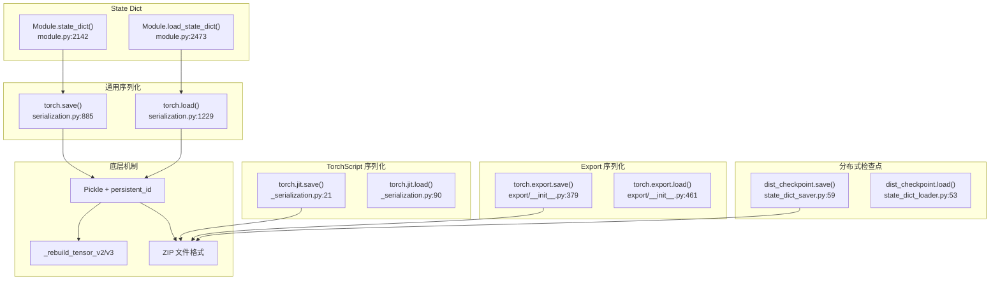
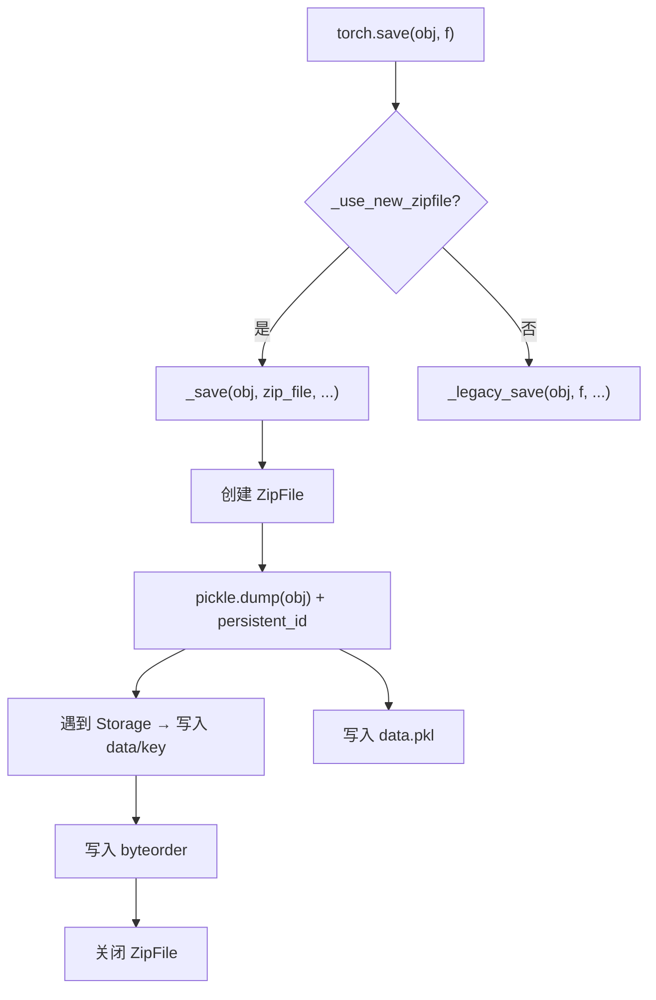
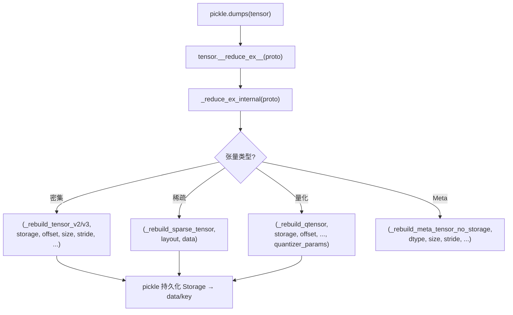
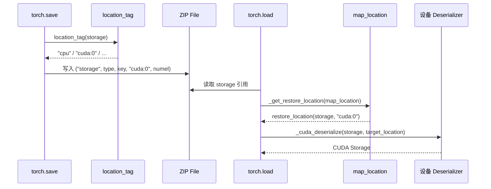
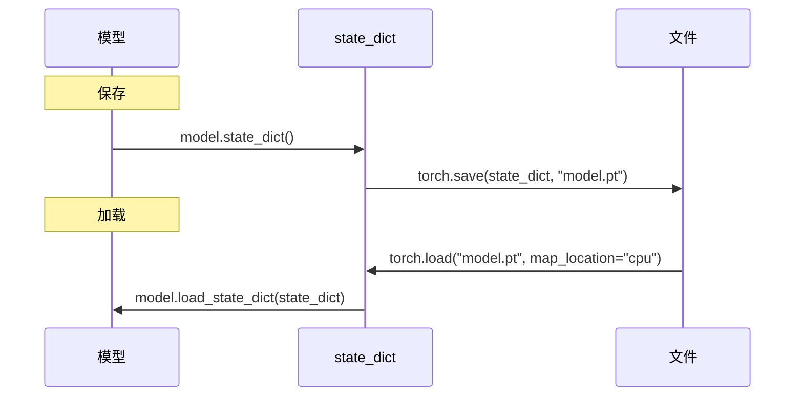

# 21. PyTorch 模型序列化与状态管理

## 目录

- [21.1 整体架构](#211-整体架构)
- [21.2 torch.save / torch.load](#212-torchsave--torchload)
- [21.3 张量 Pickle 机制](#213-张量-pickle-机制)
- [21.4 Storage 序列化](#214-storage-序列化)
- [21.5 map_location 处理](#215-map_location-处理)
- [21.6 State Dict 机制](#216-state-dict-机制)
- [21.7 TorchScript 序列化](#217-torchscript-序列化)
- [21.8 torch.export 序列化](#218-torchexport-序列化)
- [21.9 分布式检查点](#219-分布式检查点)
- [21.10 weights_only 安全加载](#2110-weights_only-安全加载)
- [21.11 设计权衡](#2111-设计权衡)
- [21.12 关键文件索引](#2112-关键文件索引)

---

## 21.1 整体架构

PyTorch 提供多种序列化机制，覆盖不同使用场景：



---

## 21.2 torch.save / torch.load

### torch.save

```python
# torch/serialization.py:885
def save(obj, f, pickle_module=pickle,
         pickle_protocol=DEFAULT_PROTOCOL,
         _use_new_zipfile_serialization=True,
         _disable_byteorder_record=False):
    """将对象保存到文件

    Args:
        obj: 要保存的对象（通常是 dict 或 state_dict）
        f: 文件路径或文件对象
        pickle_module: pickle 模块（默认标准 pickle）
        pickle_protocol: pickle 协议版本
        _use_new_zipfile_serialization: 使用 ZIP 格式（True，推荐）
    """
```

### torch.load

```python
# torch/serialization.py:1229
def load(f, map_location=None, pickle_module=None, *,
         weights_only=None, mmap=None, **pickle_load_args):
    """从文件加载对象

    Args:
        f: 文件路径或文件对象
        map_location: 存储位置映射（设备转移）
        pickle_module: pickle 模块
        weights_only: 仅加载张量（安全模式）
        mmap: 使用内存映射加载
    """
```

### 两种保存格式

| 格式 | 函数 | 行号 | 说明 |
|---|---|---|---|
| 旧格式（非 ZIP） | `_legacy_save` | 957 | PyTorch 1.5 之前的格式 |
| 新格式（ZIP） | `_save` | 1115 | 当前默认，支持追加、随机访问 |

### ZIP 文件结构

新格式将模型保存为 ZIP 文件：

```
model.pt (ZIP archive)
├── data.pkl           # pickle 序列化的对象（引用 storage key）
├── data/0             # 第一个 Storage 的原始字节
├── data/1             # 第二个 Storage 的原始字节
├── ...
├── byteorder          # 字节序标记（little/big）
└── data.version       # 格式版本号
```

### 保存流程



`persistent_id` 回调（`:1131`）拦截 Storage 对象：

```python
# _save 内部，serialization.py:1131
def persistent_id(obj):
    if isinstance(obj, (TypedStorage, UntypedStorage)):
        key = f"data/{storage_key}"
        # 将 Storage 的原始字节写入 zip 文件的 data/key
        zip_file.write_record(key, obj.data_ptr(), obj.nbytes())
        return ("storage", storage_type, key, obj.device(), obj.nbytes())
```

### 加载流程

```python
# _load 内部，serialization.py:1844
def _load(zip_file, map_location, pickle_module, ...):
    # 1. 读取 data.pkl
    # 2. unpickle 时通过 persistent_load 解析 storage 引用
    # 3. persistent_load 从 zip 文件读取对应 key 的字节
    # 4. 应用 map_location 转移设备
    # 5. 返回反序列化的对象
```

```python
# serialization.py:1923
def persistent_load(saved_id):
    # saved_id = ("storage", storage_type, key, location, numel)
    # 从 zip_file 读取 key 对应的字节
    # 创建 Storage 并恢复到目标设备
```

---

## 21.3 张量 Pickle 机制

### Tensor.__reduce_ex__

张量的 pickle 序列化入口：

```python
# torch/_tensor.py:264
def __reduce_ex__(self, proto):
    # 对有 Python 状态的子类，包裹 _rebuild_from_type_v2
    # 否则调用 _reduce_ex_internal
```

### Tensor._reduce_ex_internal

```python
# torch/_tensor.py:313
def _reduce_ex_internal(self, proto):
    # 根据张量类型选择不同的重建函数：

    # XLA/MAIA 张量 (:327)
    # → (torch._utils._rebuild_device_tensor_from_cpu_tensor, ...)

    # MTIA 张量 (:351)
    # → (torch._utils._rebuild_device_tensor_from_numpy, ...)

    # Meta 张量 (:368)
    # → (torch._utils._rebuild_meta_tensor_no_storage, ...)

    # 量化张量 (:382)
    # → (torch._utils._rebuild_qtensor, ...)

    # 稀疏 COO 张量 (:430)
    # → (torch._utils._rebuild_sparse_tensor, ...)

    # 稀疏 CSR/CSC/BSR/BSC 张量 (:441)
    # → (torch._utils._rebuild_sparse_tensor, ...)

    # 嵌套张量 (:467)
    # → (torch._utils._rebuild_nested_tensor, ...)

    # Wrapper 子类张量 (:482, :504)
    # → (torch._utils._rebuild_wrapper_subclass, ...)

    # 密集张量 (:523)
    # → (torch._utils._rebuild_tensor_v2, ...) 或
    #   (torch._utils._rebuild_tensor_v3, ...)
```

### Rebuild 函数

所有 rebuild 函数在 `torch/_utils.py` 中：

| 函数 | 行号 | 用途 |
|---|---|---|
| `_rebuild_tensor` | 183 | 基础重建：从 Storage + offset + size + stride |
| `_rebuild_tensor_v2` | 204 | 增加 `requires_grad`、`backward_hooks`、`metadata` |
| `_rebuild_tensor_v3` | 225 | 增加显式 `dtype`（用于 float8 等新类型） |
| `_rebuild_sparse_tensor` | 298 | 稀疏张量（COO/CSR/CSC/BSR/BSC） |
| `_rebuild_nested_tensor` | 340 | 嵌套张量 |
| `_rebuild_device_tensor_from_cpu_tensor` | 344 | XLA/MAIA 设备张量 |
| `_rebuild_device_tensor_from_numpy` | 351 | MTIA numpy 设备张量 |
| `_rebuild_meta_tensor_no_storage` | 362 | Meta 张量（无数据） |
| `_rebuild_wrapper_subclass` | 368 | 子类包装张量 |
| `_rebuild_qtensor` | 393 | 量化张量 |

### _rebuild_tensor_v2 详解

```python
# torch/_utils.py:204
def _rebuild_tensor(storage, storage_offset, size, stride,
                     requires_grad, backward_hooks, metadata=None):
    """从序列化数据重建张量

    Args:
        storage: 底层 Storage 对象
        storage_offset: 在 Storage 中的偏移
        size: 张量形状
        stride: 张量步长
        requires_grad: 是否需要梯度
        backward_hooks: 反向传播钩子
        metadata: 元数据字典
    """
    tensor = torch._utils._rebuild_tensor(storage, storage_offset, size, stride)
    tensor.requires_grad = requires_grad
    return tensor
```

### 张量序列化流程



---

## 21.4 Storage 序列化

### Storage 类层次

```python
# torch/storage.py
class _StorageBase:           # :50 — 基础混入类
class UntypedStorage:         # :465 — 现代无类型 Storage
class TypedStorage:           # :668 — 已弃用的有类型 Storage
```

### Storage Pickle

Storage 的 `__reduce__` 方法将自身保存到 BytesIO 缓冲区：

```python
# torch/storage.py:248
class _StorageBase:
    def __reduce__(self):
        # 调用 torch.save(self, buffer) 序列化
        # 返回 (_load_from_bytes, (buffer.getvalue(),))
```

### 在 ZIP 格式中的 Storage 处理

**保存时**（`_save` 内的 `persistent_id`，`:1131`）：

1. 拦截 pickle 流中的 Storage 对象
2. 分配唯一 key（如 `data/0`、`data/1`）
3. 将 Storage 原始字节写入 ZIP 文件的 `data/key` 条目
4. 在 pickle 流中写入引用 `("storage", type, key, device, numel)`

**加载时**（`_load` 内的 `persistent_load`，`:1923`）：

1. 解析 pickle 流中的 storage 引用
2. 从 ZIP 文件读取 `data/key` 条目的字节
3. 创建 Storage 并恢复数据
4. 应用 `map_location` 转移设备

### 新类型映射

```python
# torch/storage.py:537
def _new_dtypes():
    """返回需要使用 v3 rebuild 的新数据类型集合"""
    return {float8_e5m2, float8_e4m3fn, ...}

# torch/storage.py:557
def _dtype_to_storage_type_map():
    """dtype → TypedStorage 类名映射"""
    # torch.float → "FloatStorage"
    # torch.int → "LongStorage"
    # ...
```

---

## 21.5 map_location 处理

`map_location` 参数控制加载时 Storage 的设备放置。

### 类型签名

```python
# serialization.py:81
MAP_LOCATION: TypeAlias = Optional[
    Union[
        Callable[[Storage, str], Storage],  # 函数：storage + location_tag → storage
        torch.device,                        # 设备对象
        str,                                  # 设备字符串（如 "cuda:0"）
        Dict[str, str],                       # 位置映射表
    ]
]
```

### _get_restore_location

```python
# serialization.py:1802
def _get_restore_location(map_location):
    # 将各种 map_location 形式统一为 (storage, location) → storage 回调

    if map_location is None:           # :1803
        return default_restore_location

    if isinstance(map_location, dict): # :1805
        # {"cuda:0": "cpu"} → 查表替换 location tag
        def closure(storage, location):
            location = map_location.get(location, location)
            return default_restore_location(storage, location)

    if isinstance(map_location, str):  # :1811
        # "cuda:0" → 所有 storage 放到 cuda:0
        def closure(storage, location):
            return default_restore_location(storage, map_location)

    if isinstance(map_location, torch.device):  # :1816
        # 同上，转为字符串

    if callable(map_location):         # :1821
        # 自定义函数，回退到 default_restore_location
```

### 设备注册机制

```python
# serialization.py:433
def register_package(priority, tagger, deserializer):
    """注册存储设备的 tagger 和 deserializer"""
```

| 设备 | 优先级 | Tag 函数 | Deserialize 函数 | 行号 |
|---|---|---|---|---|
| CPU | 10 | `_cpu_tag` | `_cpu_deserialize` | 630 |
| CUDA | 20 | — | — | 631-635 |
| MPS | 21 | `_mps_tag` | `_mps_deserialize` | 636 |
| Meta | 22 | `_meta_tag` | `_meta_deserialize` | 637 |
| privateuse1 | 23 | — | — | 638-642 |
| HPU | 24 | — | — | 643-647 |
| XPU | 25 | — | — | 648-652 |

### 保存/加载时的设备流程



---

## 21.6 State Dict 机制

### Module.state_dict

```python
# torch/nn/modules/module.py:2142
def state_dict(self, *, destination=None, prefix="", keep_vars=False):
    """返回包含模块整个状态的字典

    Args:
        destination: 存放结果的字典
        prefix: 参数名前缀
        keep_vars: 是否保留梯度信息（默认分离梯度）
    """
    # 遍历 _parameters 和 _buffers
    # 收集为 OrderedDict
```

### Module.load_state_dict

```python
# torch/nn/modules/module.py:2473
def load_state_dict(self, state_dict, strict=True, assign=False):
    """将参数和缓冲区从 state_dict 复制到模块

    Args:
        state_dict: 包含参数和缓冲区的字典
        strict: 是否严格要求 key 完全匹配
        assign: 是否赋值而非 copy_（避免 inplace 修改）
    """
    # strict=True 时：
    #   缺少 key → 错误
    #   多余 key → 错误
    # strict=False 时：
    #   返回 (missing_keys, unexpected_keys)
```

### State Dict 典型流程



---

## 21.7 TorchScript 序列化

```python
# torch/jit/_serialization.py:21
def save(m, f, _extra_files=None):
    """保存 ScriptModule 到文件

    内部委托到 C++ 实现序列化模块的 Graph、属性和权重
    """

# torch/jit/_serialization.py:90
def load(f, map_location=None, _extra_files=None, _restore_shapes=False):
    """加载 ScriptModule

    Args:
        map_location: 设备映射
        _extra_files: 额外文件映射
        _restore_shapes: 是否恢复形状信息
    """
```

TorchScript 序列化将整个编译后的图（Graph + 权重 + 属性）保存为 ZIP 文件，C++ 端可以直接加载执行，无需 Python 环境。

---

## 21.8 torch.export 序列化

```python
# torch/export/__init__.py:379
def save(ep, f, *, extra_files=None, opset_version=None):
    """保存 ExportedProgram 到文件"""

# torch/export/__init__.py:461
def load(f, *, extra_files=None, expected_opset_version=None):
    """加载 ExportedProgram"""
```

与 TorchScript 序列化的区别：

| 特性 | TorchScript | torch.export |
|---|---|---|
| IR 格式 | JIT IR（Node/Value/Graph） | FX Graph（ATen 算子集） |
| 算子集 | 包含 prim:: 和 aten:: | 仅 ATen 核心算子 |
| 控制流 | prim::If/Loop | torch.cond/torch.while_loop |
| 动态形状 | 有限支持 | 完整约束系统 |
| Python 依赖 | 无 | 无 |

---

## 21.9 分布式检查点

`torch.distributed.checkpoint` 提供分片检查点，每个 rank 只保存自己的参数分片。

### 保存

```python
# torch/distributed/checkpoint/state_dict_saver.py:59
def save(state_dict, *, checkpoint_id=None, storage_writer=None,
         planner=None, process_group=None):
    """SPMD 风格分布式保存

    - 每个 rank 保存自己的参数分片
    - 通过 StorageWriter 控制存储后端
    - 通过 Planner 控制分片策略
    """
```

### 加载

```python
# torch/distributed/checkpoint/state_dict_loader.py:53
def load(state_dict, *, checkpoint_id=None, storage_reader=None,
         planner=None, process_group=None):
    """SPMD 风格分布式加载

    - 每个 rank 加载自己的参数分片
    - 支持重新分片（resharding）
    - 通过 StorageReader 控制读取后端
    """
```

### 与普通 torch.save 的区别

| 特性 | torch.save | dist_checkpoint |
|---|---|---|
| 文件格式 | 单个 ZIP 文件 | 每个 rank 一个分片文件 |
| 内存占用 | 每个进程加载完整模型 | 只加载本地分片 |
| 重新分片 | 不支持 | 支持不同并行策略加载 |
| 存储后端 | 本地文件系统 | 可扩展（文件系统、云存储等） |

---

## 21.10 weights_only 安全加载

`weights_only=True` 限制 `torch.load` 只加载张量数据，防止恶意 pickle 执行。

### Unpickler

```python
# torch/_weights_only_unpickler.py:300
class Unpickler:
    """自定义 Unpickler，仅允许安全的重建函数"""
```

### 允许的重建函数

```python
# torch/_weights_only_unpickler.py:149
def _tensor_rebuild_functions():
    return {
        torch._utils._rebuild_tensor,        # :154
        torch._utils._rebuild_tensor_v2,     # :155
        torch._utils._rebuild_tensor_v3,     # :156
        torch._utils._rebuild_sparse_tensor, # :157
        # ... 其他安全函数
    }
```

### 安全策略

| weights_only | 行为 |
|---|---|
| `True` | 仅加载张量、Storage 和基本类型 |
| `False` | 允许任意 Python 对象（有安全风险） |
| `None` | 默认行为（未来趋向 True） |

---

## 21.11 设计权衡

| 设计决策 | 选择 | 原因 |
|---|---|---|
| ZIP 文件格式 | 替代旧的连续字节格式 | 支持随机访问、追加、多文件 |
| persistent_id 机制 | Storage 与 pickle 分离 | 大型 Storage 不参与 pickle 序列化，提高效率 |
| 多版本 rebuild 函数 | v1/v2/v3 逐步扩展 | 向后兼容旧格式，支持新 dtype |
| TypedStorage 弃用 | 迁移到 UntypedStorage + dtype | 统一 Storage 类型，减少类型爆炸 |
| map_location 多态 | 函数/字符串/字典/设备 | 覆盖所有常见设备转移场景 |
| register_package 可扩展 | 第三方后端可注册 | 支持 XPU/HPU/privateuse1 等自定义设备 |
| weights_only 默认值 | 逐渐过渡到 True | 安全性优先，防止 pickle 反序列化攻击 |
| 分布式检查点分片 | 每 rank 一个文件 | 避免单节点内存瓶颈 |

---

## 21.12 关键文件索引

| 文件 | 说明 |
|---|---|
| `torch/serialization.py` | torch.save（:885）、torch.load（:1229）、_save（:1115）、_load（:1844）、map_location 处理（:1802）、设备注册（:433） |
| `torch/_utils.py` | _rebuild_tensor（:183）、_rebuild_tensor_v2（:204）、_rebuild_tensor_v3（:225）、_rebuild_sparse_tensor（:298）、_rebuild_qtensor（:393） |
| `torch/_tensor.py` | Tensor.__reduce_ex__（:264）、_reduce_ex_internal（:313） |
| `torch/storage.py` | _StorageBase（:50）、UntypedStorage（:465）、TypedStorage（:668）、__reduce__（:248） |
| `torch/_weights_only_unpickler.py` | Unpickler（:300）、安全重建函数列表（:149） |
| `torch/nn/modules/module.py` | state_dict（:2142）、load_state_dict（:2473） |
| `torch/jit/_serialization.py` | torch.jit.save（:21）、torch.jit.load（:90） |
| `torch/export/__init__.py` | torch.export.save（:379）、torch.export.load（:461） |
| `torch/distributed/checkpoint/state_dict_saver.py` | 分布式检查点保存（:59） |
| `torch/distributed/checkpoint/state_dict_loader.py` | 分布式检查点加载（:53） |