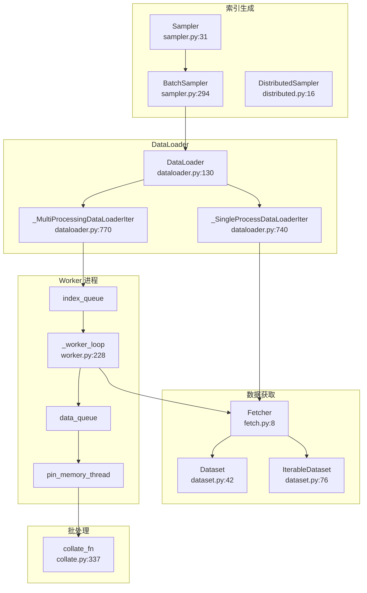
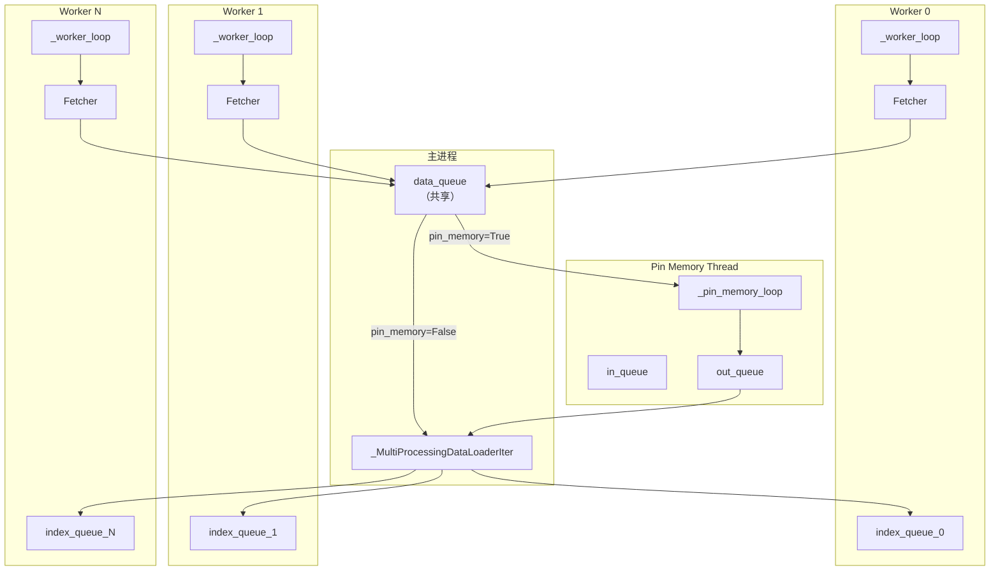
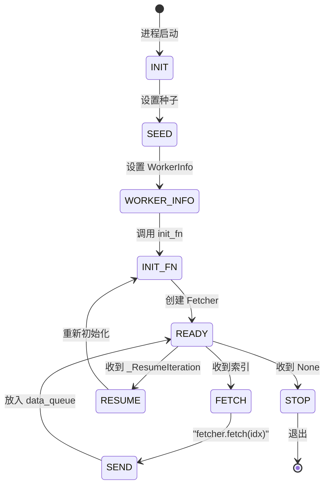
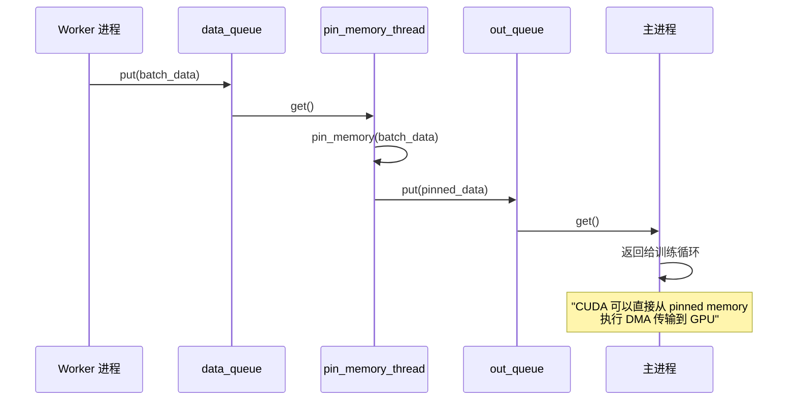

# 22. PyTorch 数据加载与处理管线

## 目录

- [22.1 整体架构](#221-整体架构)
- [22.2 Dataset 体系](#222-dataset-体系)
- [22.3 Sampler 采样器](#223-sampler-采样器)
- [22.4 DataLoader 核心类](#224-dataloader-核心类)
- [22.5 单进程迭代器](#225-单进程迭代器)
- [22.6 多进程迭代器](#226-多进程迭代器)
- [22.7 Worker 进程管理](#227-worker-进程管理)
- [22.8 Collate 批处理](#228-collate-批处理)
- [22.9 Fetch 数据获取](#229-fetch-数据获取)
- [22.10 Pin Memory 机制](#2210-pin-memory-机制)
- [22.11 设计权衡](#2211-设计权衡)
- [22.12 关键文件索引](#2212-关键文件索引)

---

## 22.1 整体架构

PyTorch 数据加载管线采用**生产者-消费者**模型：Sampler 产生索引 → Fetcher 获取数据 → Collate 组装批次 → 可选 Pin Memory → 返回给训练循环。



---

## 22.2 Dataset 体系

### 核心类

| 类 | 文件 | 行号 | 说明 |
|---|---|---|---|
| `Dataset` | `torch/utils/data/dataset.py` | 42 | Map-style 数据集基类（支持 `__getitem__` + `__len__`） |
| `IterableDataset` | `torch/utils/data/dataset.py` | 76 | Iterable-style 数据集基类（支持 `__iter__`） |
| `TensorDataset` | `torch/utils/data/dataset.py` | 192 | 包装张量为数据集 |
| `StackDataset` | `torch/utils/data/dataset.py` | 216 | 堆叠多个数据集 |
| `ConcatDataset` | `torch/utils/data/dataset.py` | 303 | 拼接多个 Map-style 数据集 |
| `ChainDataset` | `torch/utils/data/dataset.py` | 360 | 链接多个 Iterable 数据集 |
| `Subset` | `torch/utils/data/dataset.py` | 392 | 数据集子集 |

### Dataset 基类

```python
# dataset.py:42
class Dataset(Generic[_T_co]):
    def __getitem__(self, index) -> _T_co:
        raise NotImplementedError                    # :61

    def __add__(self, other):
        return ConcatDataset([self, other])          # :68
```

### IterableDataset 基类

```python
# dataset.py:76
class IterableDataset(Dataset[_T_co], Iterable[_T_co]):
    def __iter__(self) -> Iterator[_T_co]:
        raise NotImplementedError

    def __add__(self, other):
        return ChainDataset([self, other])           # :185
```

### TensorDataset

```python
# dataset.py:192
class TensorDataset(Dataset[tuple[Tensor, ...]]):
    def __init__(self, *tensors):                    # :203
        # 验证所有张量在 dim 0 上大小一致
        assert all(t.size(0) == tensors[0].size(0) for t in tensors)

    def __getitem__(self, index):                    # :209
        return tuple(tensor[index] for tensor in self.tensors)

    def __len__(self):                               # :212
        return self.tensors[0].size(0)
```

### ConcatDataset

```python
# dataset.py:303
class ConcatDataset(Dataset[_T_co]):
    def __init__(self, datasets):                    # :324
        # 验证无 IterableDataset
        # 计算累积大小

    def __len__(self):                               # :334
        return self.cumulative_sizes[-1]

    def __getitem__(self, idx):                      # :337
        # 二分查找定位子数据集
        dataset_idx = bisect_right(self.cumulative_sizes, idx)
        sample_idx = idx - self.cumulative_sizes[dataset_idx - 1]
        return self.datasets[dataset_idx][sample_idx]
```

### Subset 与 random_split

```python
# dataset.py:392
class Subset(Dataset[_T_co]):
    def __init__(self, dataset, indices):            # :404
        self.dataset = dataset
        self.indices = indices

    def __getitem__(self, idx):                      # :408
        return self.dataset[self.indices[idx]]

    def __len__(self):                               # :421
        return len(self.indices)

# dataset.py:425
def random_split(dataset, lengths, generator=None):
    """将数据集随机分割为不重叠的 Subset"""
    # 使用 torch.randperm 生成随机排列
    # 按长度切割为多个 Subset
```

---

## 22.3 Sampler 采样器

### 核心采样器

| 类 | 文件 | 行号 | 说明 |
|---|---|---|---|
| `Sampler` | `sampler.py` | 31 | 采样器基类 |
| `SequentialSampler` | `sampler.py` | 113 | 顺序采样 |
| `RandomSampler` | `sampler.py` | 132 | 随机采样 |
| `SubsetRandomSampler` | `sampler.py` | 207 | 子集随机采样 |
| `WeightedRandomSampler` | `sampler.py` | 229 | 加权随机采样 |
| `BatchSampler` | `sampler.py` | 294 | 批量采样器 |
| `DistributedSampler` | `distributed.py` | 16 | 分布式采样器 |

### Sampler 基类

```python
# sampler.py:31
class Sampler(Generic[_T_co]):
    def __init__(self, data_source=None):            # :73
        # data_source 参数已弃用

    def __iter__(self) -> Iterator[_T_co]:
        raise NotImplementedError                    # :82
```

### SequentialSampler

```python
# sampler.py:113
class SequentialSampler(Sampler[int]):
    def __iter__(self):                              # :125
        return iter(range(len(self.data_source)))
```

### RandomSampler

```python
# sampler.py:132
class RandomSampler(Sampler[int]):
    def __init__(self, data_source, replacement=False,
                 num_samples=None, generator=None):  # :147

    def __iter__(self):                              # :176
        if self.replacement:
            # torch.randint 生成随机索引
        else:
            # torch.randperm 生成随机排列
```

### WeightedRandomSampler

```python
# sampler.py:229
class WeightedRandomSampler(Sampler[int]):
    def __init__(self, weights, num_samples,
                 replacement=True, generator=None):  # :252

    def __iter__(self):                              # :284
        # torch.multinomial(self.weights, self.num_samples, self.replacement)
```

### BatchSampler

```python
# sampler.py:294
class BatchSampler(Sampler[List[int]]):
    def __init__(self, sampler, batch_size, drop_last):  # :310

    def __iter__(self):                              # :335
        # 从基础 sampler 取 batch_size 个索引
        # drop_last=True 时丢弃最后不完整的批次

    def __len__(self):                               # :349
        # 计算批次数
```

### DistributedSampler

```python
# torch/utils/data/distributed.py:16
class DistributedSampler(Sampler[_T_co]):
    def __init__(self, dataset, num_replicas=None, rank=None,
                 shuffle=True, seed=0, drop_last=False):  # :65

    def __iter__(self):                              # :106
        # 1. 打乱索引（如果 shuffle）
        # 2. 填充使长度整除 num_replicas
        # 3. 按 rank 步幅取子集：indices[rank::num_replicas]

    def set_epoch(self, epoch):                      # :138
        """设置 epoch，确保每个 epoch 的打乱不同"""
        self.epoch = epoch
```

分布式采样逻辑：

```
总索引（8 个样本）：[0, 1, 2, 3, 4, 5, 6, 7]
2 个 GPU，每个 GPU 取步幅为 2 的子集：
  GPU 0: [0, 2, 4, 6]
  GPU 1: [1, 3, 5, 7]
```

---

## 22.4 DataLoader 核心类

```python
# torch/utils/data/dataloader.py:130
class DataLoader(Generic[_T_co]):
    def __init__(self, dataset, batch_size=1, shuffle=False,
                 sampler=None, batch_sampler=None,
                 num_workers=0, collate_fn=None,
                 pin_memory=False, drop_last=False,
                 timeout=0, worker_init_fn=None,
                 multiprocessing_context=None,
                 generator=None, *,
                 prefetch_factor=None,
                 persistent_workers=False,
                 pin_memory_device=""):             # :237

    def _get_iterator(self):                         # :417
        if self.num_workers == 0:
            return _SingleProcessDataLoaderIter(self)
        else:
            return _MultiProcessingDataLoaderIter(self)

    def __iter__(self):                              # :478
        # 处理 persistent_workers 逻辑
        return self._get_iterator()

    def __len__(self):                               # :509
        # 根据 dataset 长度和 batch_size 计算
```

### 参数约束关系

| 参数组合 | 约束 |
|---|---|
| `shuffle=True` | 自动创建 `RandomSampler`，不能同时指定 `sampler` |
| `sampler` 指定 | `shuffle` 必须为 `False` |
| `batch_sampler` 指定 | 不能同时指定 `batch_size`、`shuffle`、`sampler`、`drop_last` |
| `IterableDataset` | 忽略 `shuffle`、`sampler`、`batch_sampler` |
| `num_workers > 0` | 使用多进程，需要 `multiprocessing_context` |
| `pin_memory=True` | 需要 CUDA 设备 |

### _DatasetKind

```python
# dataloader.py:70
class _DatasetKind:
    Map = 0       # Map-style (支持 __getitem__)
    Iterable = 1  # Iterable-style (支持 __iter__)

    @staticmethod
    def create_fetcher(kind, dataset, ...):          # :74
        # 根据 kind 返回 _MapDatasetFetcher 或 _IterableDatasetFetcher
```

---

## 22.5 单进程迭代器

```python
# dataloader.py:740
class _SingleProcessDataLoaderIter(_BaseDataLoaderIter):
    def __init__(self, loader):                      # :741
        # 直接创建 Fetcher（无子进程）
        # 应用 DataPipe sharding

    def _next_data(self):                            # :762
        # 1. 获取下一个索引（_next_index）
        # 2. 通过 Fetcher 获取数据
        # 3. 可选 pin_memory
        index = self._next_index()
        data = self._dataset_fetcher.fetch(index)
        if self._pin_memory:
            data = _utils.pin_memory.pin_memory(data, self._pin_memory_device)
        return data
```

单进程模式流程简单，适合小数据集或调试：


---

## 22.6 多进程迭代器

```python
# dataloader.py:770
class _MultiProcessingDataLoaderIter(_BaseDataLoaderIter):
    def __init__(self, loader):                      # :1080
        # 1. 创建 num_workers 个 worker 进程
        # 2. 每个 worker 有自己的 index_queue 和共享的 data_queue
        # 3. 可选创建 pin_memory_thread

    def _reset(self):                                # :1201
        # 重置所有 task 追踪
        # 重新预取（prefetch）

    def _try_get_data(self):                         # :1243
        # 尝试从 _data_queue 获取数据（带超时）

    def _get_data(self):                             # :1394
        # 获取数据（带超时或 pin_memory 检查）

    def _next_data(self):                            # :1429
        # 核心数据获取：处理乱序结果
        # 处理 _IterableDatasetStopIteration
        # 维护 in_order 标志

    def _try_put_index(self):                        # :1489
        # 将索引分发到 worker 队列
        # 遵守 prefetch_factor 限制

    def _process_data(self, data):                   # :1518
        # 递减 worker 任务计数，重新预取

    def _shutdown_workers(self):                     # :1553
        # 优雅关闭所有 worker 和 pin_memory_thread
```

### 多进程架构



### 预取机制

```
prefetch_factor=2, num_workers=4

每个 worker 最多同时处理 2 个任务
总预取 = prefetch_factor × num_workers = 8 个批次

Worker 0: [task_A, task_B]  ← 最多 2 个待处理
Worker 1: [task_C, task_D]
Worker 2: [task_E, task_F]
Worker 3: [task_G, task_H]
```

### _try_put_index 逻辑

```python
# dataloader.py:1489
def _try_put_index(self):
    # 1. 检查是否还有待分发的索引
    # 2. 选择任务最少的 worker
    # 3. 检查该 worker 的待处理任务 < prefetch_factor
    # 4. 将索引放入 worker 的 index_queue
```

---

## 22.7 Worker 进程管理

### _worker_loop

```python
# torch/utils/data/_utils/worker.py:228
def _worker_loop(index_queue, data_queue, ...):
    """Worker 进程主循环"""

    # 1. 信号处理器设置 (:253)
    _set_worker_signal_handlers()

    # 2. 线程设置 (:255-257)
    _set_thread_name("pt_data_worker")
    torch.set_num_threads(1)  # 避免过度订阅

    # 3. 随机种子设置 (:258-265)
    random.seed(base_seed + worker_id)
    torch.manual_seed(base_seed + worker_id)
    numpy.random.seed(_generate_state(base_seed, worker_id))

    # 4. WorkerInfo 设置 (:276-279)
    global _worker_info
    _worker_info = WorkerInfo(id=worker_id, num_workers=num_workers,
                               seed=seed, dataset=dataset)

    # 5. 调用 init_fn (:286-287)
    if init_fn is not None:
        init_fn(worker_id)

    # 6. 创建 Fetcher (:289-291)
    fetcher = _DatasetKind.create_fetcher(...)

    # 7. 主循环 (:313-368)
    while True:
        # 从 index_queue 获取索引
        idx = index_queue.get()

        # 特殊信号处理
        if isinstance(idx, _ResumeIteration):
            # persistent_workers: 重新初始化
            continue
        if idx is None:
            # 正常退出信号
            break

        # 获取数据
        data = fetcher.fetch(idx)                   # :349

        # 发送到 data_queue
        data_queue.put((idx, data))                  # :360
```

### WorkerInfo

```python
# worker.py:76
class WorkerInfo:
    """Worker 元数据，可通过 torch.utils.data.get_worker_info() 获取"""
    id: int           # Worker ID
    num_workers: int  # Worker 总数
    seed: int         # 此 worker 的随机种子
    dataset: Dataset  # 数据集引用

    def __setattr__(self, key, val):                 # :89
        # 初始化后锁定，防止修改
```

### _generate_state

```python
# worker.py:176
def _generate_state(base_seed, worker_id):
    """从 base_seed 和 worker_id 生成 numpy 种子

    适配自 NumPy SeedSequence 算法
    确保不同 worker 获得不同的随机序列
    """
```

### Worker 生命周期



---

## 22.8 Collate 批处理

### default_collate

```python
# torch/utils/data/_utils/collate.py:337
def default_collate(batch):
    """将样本列表组装为批次

    委托到 collate(batch, collate_fn_map=default_collate_fn_map)
    """
```

### 可扩展的 Collate 类型注册表

```python
# collate.py:320
default_collate_fn_map = {
    torch.Tensor: collate_tensor_fn,           # :243 — torch.stack
    numpy.ndarray: collate_numpy_array_fn,     # :275 — 转 Tensor 后 stack
    numpy.number: collate_numpy_scalar_fn,     # :288 — torch.as_tensor
    float: collate_float_fn,                    # :296 — torch.tensor(dtype=float64)
    int: collate_int_fn,                        # :304 — torch.tensor
    str: collate_str_fn,                        # :312 — 返回原列表
}
```

### collate_tensor_fn

```python
# collate.py:243
def collate_tensor_fn(batch, *, collate_fn_map):
    """将张量列表堆叠为批次

    在 worker 进程中使用共享内存
    """
    return torch.stack(batch, 0, out=out)
```

### 递归处理

`collate` 函数递归处理嵌套结构：

```python
# collate.py:118
def collate(batch, *, collate_fn_map):
    # 1. 查找 batch[0] 的类型
    # 2. 在 collate_fn_map 中查找对应的处理函数
    # 3. 对 Mapping: 递归 collate 每个值
    # 4. 对 namedtuple: 递归 collate 每个字段，重建 namedtuple
    # 5. 对 Sequence: 递归 collate 每个元素
```

| 输入类型 | 处理方式 |
|---|---|
| `List[Tensor]` | `torch.stack(tensors)` |
| `List[numpy.ndarray]` | 转 Tensor 后 stack |
| `List[int]` | `torch.tensor(ints)` |
| `List[float]` | `torch.tensor(floats, dtype=float64)` |
| `List[str]` | 原样返回列表 |
| `Dict[str, Any]` | 递归 collate 每个值 |
| `NamedTuple` | 递归 collate 每个字段 |
| `Tuple[Any, ...]` | 递归 collate 每个元素 |

---

## 22.9 Fetch 数据获取

### Fetcher 类

```python
# torch/utils/data/_utils/fetch.py:8
class _BaseDatasetFetcher:
    def __init__(self, dataset, auto_collation, collate_fn, drop_last):  # :9

    def fetch(self, item):                          # :15
        raise NotImplementedError

# fetch.py:19
class _IterableDatasetFetcher(_BaseDatasetFetcher):
    def __init__(self, dataset, auto_collation, collate_fn, drop_last):  # :20
        self.dataset_iter = iter(dataset)
        self.ended = False

    def fetch(self, possibly_batched_index):         # :25
        # IterableDataset 不使用索引，直接从迭代器获取
        # 处理 auto_collation 批量和 StopIteration

# fetch.py:46
class _MapDatasetFetcher(_BaseDatasetFetcher):
    def fetch(self, possibly_batched_index):         # :47
        # Map-style: 使用 __getitem__ 或 __getitems__
        if hasattr(self.dataset, "__getitems__"):
            data = self.dataset.__getitems__(possibly_batched_index)
        else:
            data = [self.dataset[idx] for idx in possibly_batched_index]
        return self.collate_fn(data)
```

### __getitems__ 优化

如果 Dataset 实现了 `__getitems__`，可以一次性批量获取，比逐个 `__getitem__` 更高效（例如数据库批量查询）。

---

## 22.10 Pin Memory 机制

Pin Memory 将数据锁定在主机分页内存中，加速 CPU→GPU 的 DMA 传输。

### _pin_memory_loop

```python
# torch/utils/data/_utils/pin_memory.py:18
def _pin_memory_loop(in_queue, out_queue, device_id, done_event, device):
    """Pin Memory 线程主循环（守护线程）"""

    def do_one_step():                               # :33
        # 1. 从 in_queue 获取数据
        # 2. 调用 pin_memory(data, device)
        # 3. 放入 out_queue

    while not done_event.is_set():                    # :56
        do_one_step()
```

### pin_memory 递归处理

```python
# pin_memory.py:62
def pin_memory(data, device=None):
    """递归 pin memory 处理任意数据结构"""

    if isinstance(data, torch.Tensor):                # :63
        return data.pin_memory(device)

    if isinstance(data, (str, bytes)):                # :65
        return data

    if isinstance(data, Mapping):                     # :67
        # 递归 pin 每个值

    if isinstance(data, tuple) and hasattr(data, '_fields'):  # :84
        # namedtuple: 重建

    if isinstance(data, tuple):                       # :86
        # 返回列表

    if isinstance(data, Sequence):                    # :90
        # 递归 pin 每个元素

    if hasattr(data, 'pin_memory'):                   # :105
        return data.pin_memory()  # 自定义 pin_memory 方法

    return data                                       # :107 — 不变
```

### Pin Memory 交互流程



---

## 22.11 设计权衡

| 设计决策 | 选择 | 原因 |
|---|---|---|
| 两种 Dataset 模式 | Map + Iterable | Map 支持随机访问，Iterable 支持流式数据 |
| 多进程而非多线程 | Python GIL 限制 | CPU 密集的数据预处理需要真并行 |
| Worker 线程数=1 | `torch.set_num_threads(1)` | 避免 worker 间 CPU 过度订阅 |
| 共享 data_queue | 所有 worker 共用 | 简化实现，通过 task_id 跟踪顺序 |
| 独立 index_queue | 每个 worker 一个 | 避免全局锁竞争，支持预取 |
| Pin Memory 独立线程 | 异步 pin | 与数据获取并行，减少延迟 |
| prefetch_factor | 可配置预取深度 | 平衡内存占用和数据可用性 |
| persistent_workers | 可选保活 | 避免每个 epoch 重新初始化，但占用内存 |
| Collate 类型注册表 | 可扩展 | 支持自定义数据类型的批处理 |
| WorkerInfo 只读 | 初始化后锁定 | 防止用户意外修改影响可复现性 |
| DistributedSampler 步幅取子集 | rank::num_replicas | 确保每个 rank 获取不重叠的数据分片 |

---

## 22.12 关键文件索引

| 文件 | 说明 |
|---|---|
| `torch/utils/data/dataloader.py` | DataLoader（:130）、_SingleProcessDataLoaderIter（:740）、_MultiProcessingDataLoaderIter（:770）、_DatasetKind（:70） |
| `torch/utils/data/dataset.py` | Dataset（:42）、IterableDataset（:76）、TensorDataset（:192）、ConcatDataset（:303）、ChainDataset（:360）、Subset（:392）、random_split（:425） |
| `torch/utils/data/sampler.py` | Sampler（:31）、SequentialSampler（:113）、RandomSampler（:132）、SubsetRandomSampler（:207）、WeightedRandomSampler（:229）、BatchSampler（:294） |
| `torch/utils/data/distributed.py` | DistributedSampler（:16） |
| `torch/utils/data/_utils/worker.py` | _worker_loop（:228）、WorkerInfo（:76）、get_worker_info（:101）、_generate_state（:176） |
| `torch/utils/data/_utils/collate.py` | default_collate（:337）、collate（:118）、default_collate_fn_map（:320） |
| `torch/utils/data/_utils/fetch.py` | _BaseDatasetFetcher（:8）、_IterableDatasetFetcher（:19）、_MapDatasetFetcher（:46） |
| `torch/utils/data/_utils/pin_memory.py` | _pin_memory_loop（:18）、pin_memory（:62） |