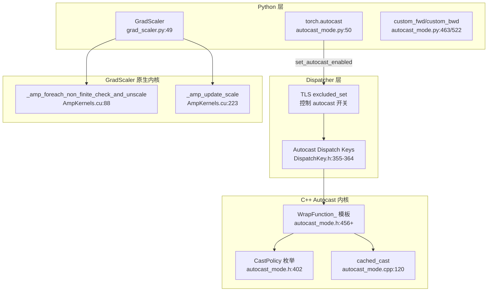
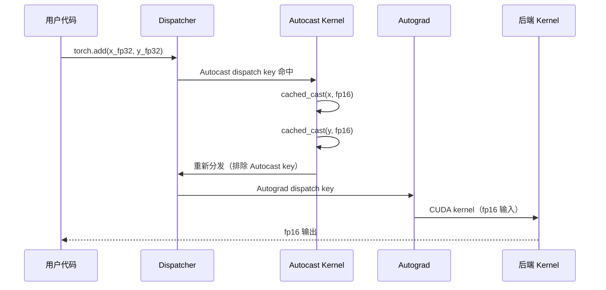

# 23. PyTorch 自动混合精度（AMP）

## 目录

- [23.1 整体架构](#231-整体架构)
- [23.2 autocast 上下文管理器](#232-autocast-上下文管理器)
- [23.3 Dispatcher 层的 Autocast 机制](#233-dispatcher-层的-autocast-机制)
- [23.4 CastPolicy 类型转换策略](#234-castpolicy-类型转换策略)
- [23.5 cached_cast 权重缓存](#235-cached_cast-权重缓存)
- [23.6 GradScaler 梯度缩放](#236-gradscaler-梯度缩放)
- [23.7 原生 AMP 内核](#237-原生-amp-内核)
- [23.8 custom_fwd / custom_bwd](#238-custom_fwd--custom_bwd)
- [23.9 Bfloat16 vs Float16](#239-bfloat16-vs-float16)
- [23.10 设计权衡](#2310-设计权衡)
- [23.11 关键文件索引](#2311-关键文件索引)

---

## 23.1 整体架构

PyTorch AMP（Automatic Mixed Precision）系统通过两个核心组件实现混合精度训练：

1. **autocast**：自动将 eligible 操作的输入转换为低精度类型（fp16/bf16）
2. **GradScaler**：通过 loss scaling 防止 fp16 梯度下溢



---

## 23.2 autocast 上下文管理器

```python
# torch/amp/autocast_mode.py:50
class autocast:
    def __init__(self, device_type, dtype=None, enabled=True, cache_enabled=True):  # :218
        # device_type: "cuda"/"cpu"/"xpu"/"mps"
        # dtype: 低精度目标类型（默认按设备选择）
        # enabled: 是否启用 autocast
        # cache_enabled: 是否缓存权重类型转换

        # 默认 dtype 选择（:230）
        # self.fast_dtype = torch.get_autocast_dtype(device_type)

    def __enter__(self):                              # :353
        # 1. 保存前一个 autocast 状态
        # 2. torch.set_autocast_enabled(device, True)
        # 3. torch.set_autocast_dtype(device, self.fast_dtype)
        # 4. torch.autocast_increment_nesting()
        # 5. torch.set_autocast_cache_enabled(cache_enabled)

    def __exit__(self, exc_type, exc_val, exc_tb):    # :384
        # 1. 如果嵌套层数归零，清除缓存
        # 2. 恢复之前的 autocast 状态
```

### 各设备默认低精度类型

| 设备 | 默认 dtype | 行号 |
|---|---|---|
| CPU | bfloat16 | autocast_mode.cpp:59 |
| CUDA | float16 | autocast_mode.cpp:60 |
| XPU | float16 | autocast_mode.cpp:71 |
| MPS | float16 | autocast_mode.cpp:72 |
| XLA/TPU | bfloat16 | autocast_mode.cpp:68 |

### 支持的 dtype

| 设备 | 支持的 dtype | 行号 |
|---|---|---|
| CPU | [bfloat16, float16] | autocast_mode.py:276 |
| XPU | [bfloat16, float16] | autocast_mode.py:286 |
| MPS | [bfloat16, float16] | autocast_mode.py:326 |

---

## 23.3 Dispatcher 层的 Autocast 机制

### Autocast Dispatch Keys

```cpp
// c10/core/DispatchKey.h
AutocastCPU       = ...,  // :355
AutocastXPU       = ...,  // :356
AutocastIPU       = ...,  // :357
AutocastHPU       = ...,  // :358
AutocastXLA       = ...,  // :359
AutocastMPS       = ...,  // :362
AutocastCUDA      = ...,  // :363
AutocastPrivateUse1 = ..., // :364
Autocast = AutocastCUDA,  // :496 (别名)
```

Autocast dispatch key 在 Dispatcher 中位于 **Autograd key 之前**，确保类型转换在 autograd 之前执行，这样保存的中间值是转换后的低精度值。

### TLS 控制机制

```cpp
// aten/src/ATen/autocast_mode.cpp:9
bool is_autocast_enabled() {
    // 检查 autocast dispatch key 是否不在 TLS excluded_set 中
}

// autocast_mode.cpp:14
void set_autocast_enabled(DeviceType device_type, bool enabled) {
    // enabled=true: 从 excluded_set 移除 autocast key
    // enabled=false: 将 autocast key 加入 excluded_set
}
```

### Autocast 拦截流程



### Fallback 处理

```cpp
// autocast_mode.cpp:165
TORCH_LIBRARY_IMPL(_, Autocast, m) {
    m.fallback(torch::CppFunction::makeFallthrough());
    // 未注册的算子直接穿透，不进行类型转换
}
```

---

## 23.4 CastPolicy 类型转换策略

```cpp
// aten/src/ATen/autocast_mode.h:402
enum class CastPolicy {
    lower_precision_fp = 0,   // :403 — 转换为低精度（fp16/bf16）
    fp32,                      // :407 — 强制转换为 fp32
    fp32_set_opt_dtype,        // :408 — 设置可选 dtype 参数为 fp32
    fp32_append_dtype,         // :415 — 追加 fp32 dtype 参数
    promote,                   // :423 — 提升为最宽类型
};
```

### 各策略说明

| 策略 | 逻辑 | 典型算子 |
|---|---|---|
| `lower_precision_fp` | 所有浮点输入转换为 fp16/bf16 | conv2d, linear, matmul |
| `fp32` | 所有浮点输入转换为 fp32 | log_softmax, layer_norm |
| `fp32_set_opt_dtype` | 设置 `dtype` 可选参数为 fp32 | softmax, cross_entropy |
| `fp32_append_dtype` | 追加 `dtype=torch.float32` 参数 | norm, matrix_norm |
| `promote` | 提升为输入中最宽的类型 | add, cat, stack |

### WrapFunction_ 模板

```cpp
// autocast_mode.h — 每种 CastPolicy 对应一个 WrapFunction_ 特化

// lower_precision_fp (:456)
// → cached_cast(get_lower_precision_fp_from_device_type(device_type), args, ...)

// fp32 (:480)
// → cached_cast(at::kFloat, args, ...)

// fp32_set_opt_dtype (:500)
// → set_opt_dtype(at::kFloat, args)

// fp32_append_dtype (:529)
// → type_from_firstarg(device_type, at::kFloat, args)

// promote (:552)
// → promote_type(...) then cached_cast(to_type, ...)
```

### 算子注册宏

```cpp
// autocast_mode.h — 用于批量注册 autocast 行为
KERNEL1(op, policy)     // 1 个输入的算子
KERNEL2(op, policy)     // 2 个输入的算子
KERNEL3(op, policy)     // 3 个输入的算子
KERNEL4(op, policy)     // 4 个输入的算子
KERNEL5(op, policy)     // 5 个输入的算子
```

---

## 23.5 cached_cast 权重缓存

```cpp
// aten/src/ATen/autocast_mode.cpp:120
Tensor cached_cast(ScalarType to_type, const Tensor& arg, DeviceType device_type) {
    // 如果不需要转换（已是目标类型）→ 直接返回
    // 如果 cache_enabled 且是模型权重（leaf, fp32）→ 缓存转换结果
    //   key = TensorImpl*（权重指针）
    //   value = 转换后的低精度张量
    // 否则 → 即时转换

    // 缓存命中时避免重复类型转换
    // 同一权重在多次前向传播中只需转换一次
}
```

### 缓存生命周期

```
autocast.__enter__()  → 启用缓存
  forward pass 1:
    conv2d(weight_fp32) → cached_cast → weight_fp16 (缓存)
    linear(weight_fp32) → cached_cast → weight_fp16 (缓存)
  forward pass 2:
    conv2d(weight_fp32) → 缓存命中，直接使用 weight_fp16
    linear(weight_fp32) → 缓存命中，直接使用 weight_fp16
autocast.__exit__()   → 嵌套归零时清除缓存
```

缓存清除（`autocast_mode.cpp:87`）：

```cpp
void clear_cache() {
    // 清除所有缓存的类型转换结果
    // 在 autocast 嵌套层级归零时调用
}
```

---

## 23.6 GradScaler 梯度缩放

GradScaler 通过 **loss scaling** 防止 fp16 梯度下溢为 0。

```python
# torch/amp/grad_scaler.py:49
class GradScaler:
    def __init__(self, device="cuda", init_scale=2.**16,
                 growth_factor=2.0, backoff_factor=0.5,
                 growth_interval=2000, enabled=True):  # :119
        # init_scale: 初始缩放因子（默认 65536）
        # growth_factor: 无 inf 时缩放因子增长倍数
        # backoff_factor: 发现 inf 时缩放因子缩减倍数
        # growth_interval: 连续无 inf 的步数，达到后增长缩放

    def scale(self, outputs):                         # :189
        """缩放 loss/输出"""
        # self._lazy_init_scale_growth_tracker()  # :166
        # return outputs * self._scale

    def unscale_(self, optimizer):                    # :287
        """反缩放梯度并检查 inf/NaN"""
        # 1. 计算 inv_scale = 1.0 / scale（使用 FP64 精度）
        # 2. 调用 _unscale_grads_() 将梯度乘以 inv_scale
        # 3. 检测 inf/NaN

    def step(self, optimizer, *args, **kwargs):       # :355
        """执行优化器步（仅当梯度中无 inf 时）"""
        # 1. 如果未手动调用 unscale_，先调用
        # 2. 检查 found_inf
        # 3. 如果 found_inf 为 0 → 调用 optimizer.step()
        # 4. 如果 found_inf 非零 → 跳过此步

    def update(self, new_scale=None):                 # :463
        """更新缩放因子"""
        # 1. 收集所有 optimizer 的 found_inf
        # 2. 调用 torch._amp_update_scale_() 原地更新 scale
        #    - 如果 found_inf: scale *= backoff_factor, 重置 growth_tracker
        #    - 如果无 inf 且 growth_tracker >= growth_interval:
        #      scale *= growth_factor, 重置 growth_tracker
        # 3. 清除 per-optimizer 状态
```

### GradScaler 工作流程

```mermaid
sequenceDiagram
    participant M as 模型
    participant GS as GradScaler
    participant OPT as Optimizer

    Note over M: 前向传播（autocast）
    M->>GS: scaler.scale(loss)
    GS-->>M: loss * scale

    Note over M: 反向传播
    M->>GS: scaler.scale(loss).backward()
    Note over M: 梯度 = 原始梯度 * scale

    M->>GS: scaler.step(optimizer)
    GS->>GS: unscale_(optimizer)
    Note over GS: "梯度 /= scale<br/>检查 inf/NaN"

    alt 无 inf/NaN
        GS->>OPT: optimizer.step()
        GS->>GS: update(): scale *= growth_factor（如果达到间隔）
    else 发现 inf/NaN
        Note over GS: "跳过 optimizer.step()"
        GS->>GS: update(): scale *= backoff_factor
    end
```

### OptState 状态机

```python
# grad_scaler.py:39
class OptState(Enum):
    READY = 0      # 初始状态
    UNSCALED = 1   # 已调用 unscale_
    STEPPED = 2    # 已调用 step
```

---

## 23.7 原生 AMP 内核

### 非有限检查 + 反缩放

```cpp
// aten/src/ATen/native/cuda/AmpKernels.cu:88
void _amp_foreach_non_finite_check_and_unscale_cuda_(
    TensorList grads, Tensor found_inf, Tensor inv_scale) {
    // 1. 遍历所有梯度张量
    // 2. 对每个元素：检查是否为 inf/NaN
    // 3. 同时乘以 inv_scale（反缩放）
    // 4. 使用 multi-tensor apply 向量化处理
    // 5. 如果发现 inf/NaN，设置 found_inf = 1.0
}
```

### 缩放因子更新

```cpp
// AmpKernels.cu:181 — CUDA 内核
void amp_update_scale_cuda_kernel(
    Tensor current_scale, Tensor growth_tracker,
    Tensor found_inf, double growth_factor,
    double backoff_factor, int64_t growth_interval) {
    // 如果 found_inf:
    //   current_scale *= backoff_factor
    //   growth_tracker = 0
    // 否则:
    //   growth_tracker++
    //   if growth_tracker >= growth_interval:
    //     current_scale *= growth_factor
    //     growth_tracker = 0
}

// AmpKernels.cu:223 — 异步启动（无 CPU-GPU 同步）
void _amp_update_scale_cuda_(...)
```

CPU 端对应实现在 `aten/src/ATen/native/cpu/AmpGradScalerKernels.cpp`，使用 SIMD 向量化。

---

## 23.8 custom_fwd / custom_bwd

自定义 autograd 函数在 autocast 下的行为控制：

```python
# torch/amp/autocast_mode.py:463
def custom_fwd(func=None, /, *, cast_inputs=None):
    """装饰器：控制自定义函数前向传播在 autocast 中的行为

    Args:
        cast_inputs: 指定输入转换的目标 dtype
            - None: 不转换（保持原精度）
            - torch.float16/bfloat16: 强制转换为指定类型
    """

# torch/amp/autocast_mode.py:522
def custom_bwd(func=None, /):
    """装饰器：禁用反向传播中的 autocast"""
```

### 使用示例

```python
class MyFunction(torch.autograd.Function):
    @staticmethod
    @custom_fwd  # autocast 下前向传播不自动转换
    def forward(ctx, x):
        return x * 2

    @staticmethod
    @custom_bwd  # 反向传播禁用 autocast
    def backward(ctx, grad_output):
        return grad_output * 2

# 强制转换输入
class MyCastingFunction(torch.autograd.Function):
    @staticmethod
    @custom_fwd(cast_inputs=torch.float16)  # 强制输入转 fp16
    def forward(ctx, x):
        return x * 2
```

---

## 23.9 Bfloat16 vs Float16

| 特性 | float16 | bfloat16 |
|---|---|---|
| 指数位数 | 5 位 | 8 位 |
| 尾数位数 | 10 位 | 7 位 |
| 动态范围 | 与 float32 相同 | 与 float32 相同 |
| 精度 | 更高 | 更低 |
| 需要 GradScaler | 通常需要 | 通常不需要 |
| 默认设备 | CUDA, XPU, MPS | CPU, XLA |
| 硬件支持 | 广泛 | 较新（Ampere+, AVX512_BF16） |

### 动态范围对比

```
float32:  1.2e-38  ~  3.4e+38   (8 位指数)
float16:  5.9e-8   ~  6.5e+4    (5 位指数) ← 动态范围小，容易下溢/上溢
bfloat16: 1.2e-38  ~  3.4e+38   (8 位指数) ← 与 float32 相同动态范围
```

### 选择建议

| 场景 | 推荐 | 原因 |
|---|---|---|
| GPU 训练 | float16 | GPU 对 fp16 计算优化更好 |
| CPU 训练 | bfloat16 | 无需 GradScaler，动态范围够 |
| 大模型训练 | bfloat16 | 梯度不易下溢 |
| 混合精度推理 | float16 | 更高精度 |

---

## 23.10 设计权衡

| 设计决策 | 选择 | 原因 |
|---|---|---|
| Dispatcher 层实现 | Autocast dispatch key | 透明拦截所有算子，无需修改用户代码 |
| 5 种 CastPolicy | 按语义分类 | 不同算子对精度的敏感度不同 |
| 权重缓存 | cached_cast | 避免每次前向传播重复转换权重 |
| 缓存按 TensorImpl* 键 | 指针而非值 | 高效，无需比较张量内容 |
| Loss scaling 异步 | GPU kernel 更新 scale | 避免 CPU-GPU 同步瓶颈 |
| unscale + inf 检查合并 | 单次遍历 | 减少内存读写 |
| Autocast 在 Autograd 前 | dispatch key 顺序 | 确保低精度值被 autograd 保存 |
| custom_fwd/custom_bwd | 细粒度控制 | 某些算子需要特定精度行为 |

---

## 23.11 关键文件索引

| 文件 | 说明 |
|---|---|
| `torch/amp/autocast_mode.py` | Python autocast（:50）、_cast（:436）、custom_fwd（:463）、custom_bwd（:522） |
| `torch/amp/grad_scaler.py` | GradScaler（:49）、scale（:189）、unscale_（:287）、step（:355）、update（:463） |
| `torch/cuda/amp/autocast_mode.py` | 遗留 CUDA autocast（:12，已弃用） |
| `torch/cpu/amp/autocast_mode.py` | 遗留 CPU autocast（:11，已弃用） |
| `aten/src/ATen/autocast_mode.h` | C++ CastPolicy（:402）、cached_cast（:309+）、WrapFunction_（:456+）、KERNEL 宏 |
| `aten/src/ATen/autocast_mode.cpp` | C++ autocast 实现：cached_cast（:120）、状态管理（:9,14）、设备注册（:165+） |
| `c10/core/DispatchKey.h` | Autocast dispatch key 定义（:355-364） |
| `c10/core/DispatchKeySet.h` | autocast_dispatch_keyset（:656） |
| `aten/src/ATen/native/AmpKernels.h` | GradScaler 内核声明 |
| `aten/src/ATen/native/cuda/AmpKernels.cu` | CUDA GradScaler 内核：unscale+inf 检查（:88）、scale 更新（:223） |
| `aten/src/ATen/native/cpu/AmpGradScalerKernels.cpp` | CPU GradScaler 内核 |