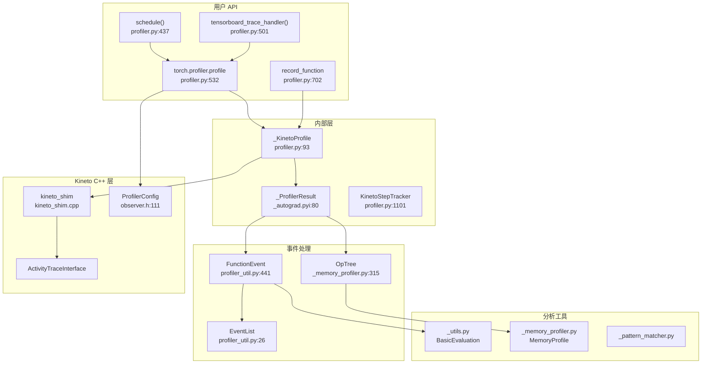
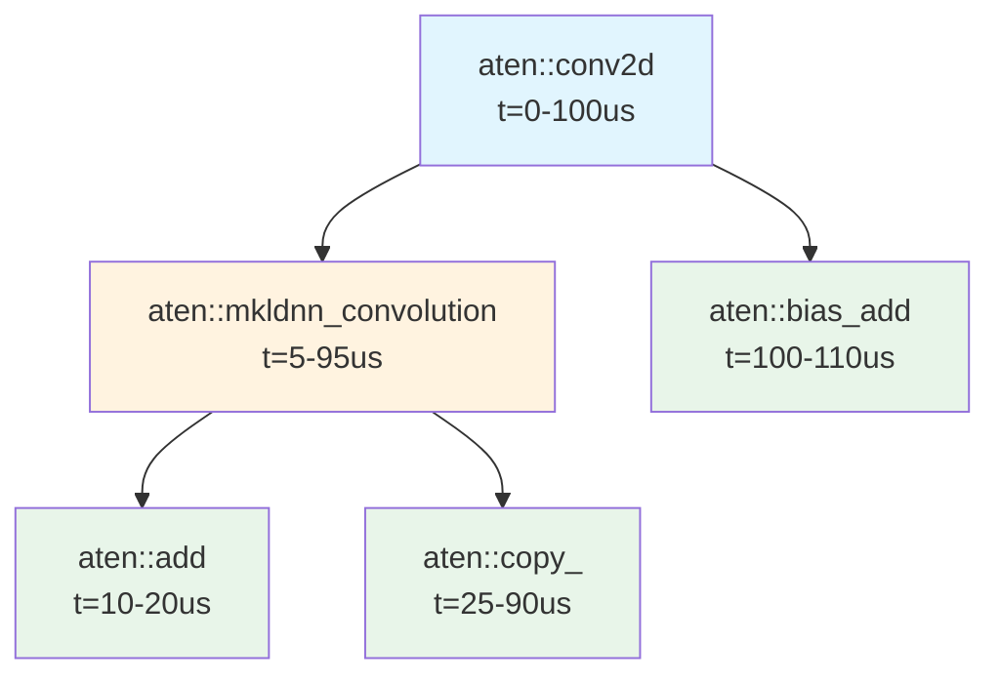
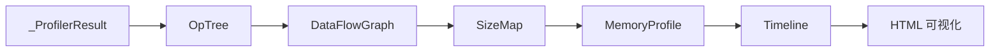

# 24. PyTorch Profiler 性能分析系统

## 目录

- [24.1 整体架构](#241-整体架构)
- [24.2 torch.profiler.profile](#242-torchprofilerprofile)
- [24.3 schedule 与 trace_handler](#243-schedule-与-trace_handler)
- [24.4 _KinetoProfile 底层实现](#244-_kinetoprofile-底层实现)
- [24.5 Kineto 集成](#245-kineto-集成)
- [24.6 事件模型](#246-事件模型)
- [24.7 record_function 自定义标注](#247-record_function-自定义标注)
- [24.8 遗留 Profiler](#248-遗留-profiler)
- [24.9 emit_nvtx / emit_itt](#249-emit_nvtx--emit_itt)
- [24.10 GPU 利用率与队列深度分析](#2410-gpu-利用率与队列深度分析)
- [24.11 内存 Profiling](#2411-内存-profiling)
- [24.12 设计权衡](#2412-设计权衡)
- [24.13 关键文件索引](#2413-关键文件索引)

---

## 24.1 整体架构

PyTorch Profiler 基于 Kineto 库，采集 CPU 和 GPU 上的操作时间线，支持 Chrome Trace 导出和 TensorBoard 可视化。



---

## 24.2 torch.profiler.profile

```python
# torch/profiler/profiler.py:532
class profile(_KinetoProfile):
    def __init__(self, activities=None, schedule=None,
                 on_trace_ready=None, record_shapes=False,
                 profile_memory=False, with_stack=False,
                 with_flops=False, with_modules=False,
                 experimental_config=None,
                 accumulator_size=None):             # :668

    def __enter__(self):                              # :791
    def __exit__(self, exc_type, exc_val, exc_tb):    # :795
    def start(self):                                  # :801
    def stop(self):                                   # :809
    def step(self):                                   # :814
```

### 参数说明

| 参数 | 说明 |
|---|---|
| `activities` | 要记录的活动类型：`ProfilerActivity.CPU`、`ProfilerActivity.CUDA` |
| `schedule` | 采样调度（`schedule()` 函数返回） |
| `on_trace_ready` | 每次 trace 完成时的回调 |
| `record_shapes` | 是否记录张量形状 |
| `profile_memory` | 是否记录内存分配/释放 |
| `with_stack` | 是否记录调用栈 |
| `with_flops` | 是否估算 FLOPS |
| `with_modules` | 是否记录模块层次 |

### 基本用法

```python
with torch.profiler.profile(
    activities=[ProfilerActivity.CPU, ProfilerActivity.CUDA],
    schedule=torch.profiler.schedule(wait=1, warmup=1, active=3, repeat=1),
    on_trace_ready=torch.profiler.tensorboard_trace_handler("./log"),
    record_shapes=True,
    profile_memory=True,
    with_flops=True,
) as prof:
    for idx, (data, target) in enumerate(train_loader):
        model(data)
        prof.step()  # 通知 profiler 当前 step 结束
```

---

## 24.3 schedule 与 trace_handler

### schedule

```python
# torch/profiler/profiler.py:437
def schedule(wait, warmup, active, repeat=0, skip_first=0):
    """创建采样调度

    Args:
        wait: 等待的 step 数
        warmup: 预热的 step 数（profiler 开启但不保存）
        active: 实际记录的 step 数
        repeat: 重复次数（0=无限）
        skip_first: 跳过初始 step 数

    Returns:
        schedule_fn 闭包（:461）
    """
```

### ProfilerAction

```python
# torch/profiler/profiler.py:426
class ProfilerAction(Enum):
    NONE = 0            # 不记录
    WARMUP = 1          # 预热（记录但不保存）
    RECORD = 2          # 记录
    RECORD_AND_SAVE = 3 # 记录并保存
```

### 调度示例

```
wait=1, warmup=1, active=3, repeat=0

Step 0: NONE       （等待）
Step 1: WARMUP     （预热）
Step 2: RECORD     （记录）
Step 3: RECORD     （记录）
Step 4: RECORD_AND_SAVE  （记录+保存+触发 on_trace_ready）
Step 5: NONE       （循环重新开始）
Step 6: WARMUP
Step 7: RECORD
Step 8: RECORD
Step 9: RECORD_AND_SAVE
...
```

### tensorboard_trace_handler

```python
# torch/profiler/profiler.py:501
def tensorboard_trace_handler(dir_name, use_gzip=False):
    """创建 TensorBoard trace 保存回调

    将 trace 导出为 Chrome Trace JSON 格式，
    可通过 TensorBoard 的 Profile 插件查看
    """
```

---

## 24.4 _KinetoProfile 底层实现

```python
# torch/profiler/profiler.py:93
class _KinetoProfile:
    def __init__(self, activities=None, record_shapes=False,
                 profile_memory=False, with_stack=False,
                 with_flops=False, with_modules=False,
                 experimental_config=None):          # :133

    def start(self):                                  # :172
    def stop(self):                                   # :176
    def prepare_trace(self):                          # :179
    def start_trace(self):                            # :196
    def stop_trace(self):                             # :236

    def export_chrome_trace(self, path):              # :242
        """导出 Chrome Trace JSON"""

    def export_stacks(self, path, metric="self_cpu_time_total"):  # :260
        """导出调用栈统计"""

    def key_averages(self, group_by_input_shape=False,
                     group_by_stack_n=0):             # :303
        """按键分组的平均统计"""

    def events(self):                                 # :316
        """返回事件列表"""

    def add_metadata(self, key, value):               # :324
    def add_metadata_json(self, key, value):          # :332

    def _memory_profile(self):                        # :366
    def export_memory_timeline(self, path, ...):      # :375
```

---

## 24.5 Kineto 集成

Kineto 是 Meta 开发的性能分析库，PyTorch 通过 C++ shim 层与之集成。

### Kineto Shim

```cpp
// torch/csrc/profiler/kineto_shim.h

// Activity 类型映射到 libkineto（:38-52）
// ActivityTraceWrapper（:93）— 包装 libkineto::ActivityTraceInterface
// TraceWrapper（:68）— 包装 libkineto::CpuTraceBuffer

// 核心接口
ActivitySet prepareTrace(ActivityType, ...);  // :116
void startTrace();                            // :117
ActivityTraceWrapper stopTrace();             // :118
```

```cpp
// torch/csrc/profiler/kineto_shim.cpp
// CPU 活动类型（:18）
kCpuTypes = {libkineto::ActivityType::CPU_OP, ...}

// CUDA 活动类型（:31）
kCudaTypes = {libkineto::ActivityType::GPU_MEMCPY, ...}

// XPU 活动类型（:41）
kXpuTypes = {...}

// MTIA 活动类型（:48）
kMtiaTypes = {...}
```

### ProfilerConfig

```cpp
// torch/csrc/profiler/orchestration/observer.h:111
struct ProfilerConfig {
    ProfilerState state;                // 分析器状态
    ActivityType activities;            // 活动类型
    bool report_input_shapes;           // 记录形状
    bool profile_memory;               // 记录内存
    bool with_stack;                   // 记录调用栈
    bool with_flops;                   // 估算 FLOPS
    bool with_modules;                 // 记录模块
    ExperimentalConfig experimental_config;  // 实验性配置
};
```

### ProfilerActivity

```python
# torch/_C/_profiler.pyi:39
class ProfilerActivity(Enum):
    CPU = 0
    CUDA = 1
    XPU = 2
    MTIA = 3
    PrivateUse1 = 4
```

---

## 24.6 事件模型

### _ProfilerEvent

```python
# torch/_C/_profiler.pyi:78
class _ProfilerEvent:
    start_time_ns: int
    end_time_ns: int
    children: List[_ProfilerEvent]
    typed: _TypedEvent  # 类型化的事件详情
    name: str
    tag: _EventType
    id: int
    parent: Optional[int]
    correlation_id: int
```

### _EventType

```python
# torch/_C/_profiler.pyi:46
class _EventType(Enum):
    TorchOp = 0         # PyTorch 操作
    Backend = 1          # 后端操作
    Allocation = 2       # 内存分配
    OutOfMemory = 3      # OOM 事件
    PyCall = 4           # Python 函数调用
    PyCCall = 5          # Python C 扩展调用
    Kineto = 6           # Kineto 事件
```

### FunctionEvent

```python
# torch/autograd/profiler_util.py:441
class FunctionEvent(FormattedTimesMixin):
    def __init__(self, id, name, thread, start_us, ...):  # :444

    def append_kernel(self, kernel):                # :506
    def append_cpu_child(self, child):              # :510

    # 关键属性
    id, name, thread, start_time, end_time
    cpu_time, cuda_time, cpu_time_total, cuda_time_total
    cpu_children, cuda_children
    shapes, stack, module_hierarchy
    count, flops, memory_usage
```

### EventList

```python
# torch/autograd/profiler_util.py:26
class EventList(list):
    def _build_tree(self):                          # :39
        """构建事件树（父子关系）"""
        # _populate_cpu_children()  — 按时间区间嵌套建立父子关系
        # _remove_dup_nodes()       — 去重
        # _set_backward_stacktraces() — 设置反向传播栈
```

### 事件树构建



事件树的父子关系基于**时间区间嵌套**：如果事件 B 的时间范围完全包含在事件 A 内，则 B 是 A 的子事件。

---

## 24.7 record_function 自定义标注

```python
# torch/autograd/profiler.py:702
class record_function(_ContextDecorator):
    def __init__(self, name):                        # :740
        """创建自定义性能标注

        用法:
            with record_function("my_custom_op"):
                # 这段代码会被 profiler 标记为 "my_custom_op"
        """

    def __enter__(self):                              # :751
        # 调用 C++ _record_function_enter(name)

    def __exit__(self, exc_type, exc_val, exc_tb):    # :757
        # 调用 C++ _record_function_exit()

    def _call_end_callbacks_on_future(self, future):  # :773
        """异步结束时调用回调（用于 CUDA 流同步）"""
```

### 使用示例

```python
with torch.profiler.profile(activities=[ProfilerActivity.CPU, ProfilerActivity.CUDA]):
    with record_function("data_preprocessing"):
        data = preprocess(batch)

    with record_function("forward_pass"):
        output = model(data)

    with record_function("loss_computation"):
        loss = criterion(output, target)
```

---

## 24.8 遗留 Profiler

```python
# torch/autograd/profiler.py:106
class profile:
    """遗留 Profiler（不推荐使用，请用 torch.profiler.profile）"""
    def __init__(self, enabled=True, use_cuda=False, ...):  # :198
    def __enter__(self):                              # :338
    def __exit__(self, exc_type, exc_val, exc_tb):    # :363
    def export_chrome_trace(self, path):              # :472
    def key_averages(self, group_by_input_shape=False):  # :499
    def total_average(self):                          # :508
```

| 特性 | 遗留 profiler | torch.profiler |
|---|---|---|
| GPU 事件 | 手动 `use_cuda=True` | 自动（`ProfilerActivity.CUDA`） |
| 调度 | 不支持 | `schedule()` 支持 |
| Kineto 集成 | 有限 | 完整 |
| 内存分析 | 不支持 | `profile_memory=True` |
| FLOPS 估算 | 不支持 | `with_flops=True` |

---

## 24.9 emit_nvtx / emit_itt

### emit_nvtx

```python
# torch/autograd/profiler.py:889
class emit_nvtx:
    """将 PyTorch 操作标注为 NVTX range，供 NVIDIA Nsight 工具使用"""
    def __init__(self, enabled=True, record_shapes=False):  # :974
    def __enter__(self):                              # :979
    def __exit__(self, exc_type, exc_val, exc_tb):    # :1001
```

### emit_itt

```python
# torch/autograd/profiler.py:818
class emit_itt:
    """将 PyTorch 操作标注为 ITT range，供 Intel VTune 工具使用"""
    def __init__(self, enabled=True, record_shapes=False):  # :855
    def __enter__(self):                              # :860
    def __exit__(self, exc_type, exc_val, exc_tb):    # :881
```

### ITT 底层绑定

```python
# torch/profiler/itt.py
def is_available():        # :30
def range_push(name):      # :37
def range_pop():           # :48
def mark(name):            # :56
def range(name):           # :66 — 上下文管理器
```

### 使用场景

| 工具 | 使用方式 | 说明 |
|---|---|---|
| NVIDIA Nsight Systems | `emit_nvtx` + `nsys profile` | GPU kernel 时间线分析 |
| Intel VTune | `emit_itt` + VTune | CPU 性能分析 |
| Chrome Trace | `torch.profiler.profile` + `export_chrome_trace` | 通用时间线分析 |
| TensorBoard | `torch.profiler.profile` + `tensorboard_trace_handler` | 交互式可视化 |

---

## 24.10 GPU 利用率与队列深度分析

### BasicEvaluation

```python
# torch/profiler/_utils.py
class EventMetrics:                                  # :34
    idle_time_ns: int       # GPU 空闲时间
    queue_depth: int        # CPU→GPU 队列深度
    fraction_idle_time: float  # 空闲时间比例

class BasicEvaluation:                               # :100
    def compute_queue_depth(self):                   # :135
        """计算 CPU→GPU 调度队列深度"""

    def compute_idle_time(self):                     # :229
        """计算 GPU 空闲时间"""

    def rank_events(self, fraction_idle_time=0.1):   # :257
        """按空闲时间排序事件（找到可优化的瓶颈）"""

    def get_optimizable_events(self, ...):           # :330
        """返回可优化的事件列表"""
```

### GPU 利用率

```python
# torch/cuda/__init__.py:1248
def utilization(device=None):
    """返回 GPU 利用率百分比（0-100）"""
    # 使用 pynvml.nvmlDeviceGetUtilizationRates()
    # AMD GPU 使用 _get_amdsmi_utilization()
```

### 分析示意

```
时间线:
CPU: |--enqueue kernel1--|--enqueue kernel2--|--gap--|--enqueue kernel3--|
GPU:                    |--kernel1--|--kernel2--|       idle       |--kernel3--|

问题: CPU 和 GPU 之间存在 gap → GPU 空闲
优化: 增加 CPU→GPU 调度速度，或增大 batch size
```

---

## 24.11 内存 Profiling

### MemoryProfile

```python
# torch/profiler/_memory_profiler.py:652
class MemoryProfile:
    def __init__(self, result, ...):                 # :653
        # 从 _ProfilerResult 构建内存时间线

    @property
    def timeline(self):                              # :668
        # 返回 MemoryProfileTimeline
```

### Category 内存分类

```python
# _memory_profiler.py:31
class Category(Enum):
    INPUT = 0            # 输入数据
    TEMPORARY = 1        # 临时变量
    ACTIVATION = 2       # 激活值
    GRADIENT = 3         # 梯度
    AUTOGRAD_DETAIL = 4  # autograd 内部数据
    PARAMETER = 5        # 模型参数
    OPTIMIZER_STATE = 6  # 优化器状态
```

### MemoryProfileTimeline

```python
# _memory_profiler.py:975
class MemoryProfileTimeline:
    def _coalesce_timeline(self):                    # :987
        """合并相邻的同类内存事件"""

    def export_memory_timeline(self, path, ...):     # :1047
    def export_memory_timeline_raw(self, path):      # :1058
    def export_memory_timeline_html(self, path):     # :1124
```

### 内存分析流程



### torch.cuda 内存统计

```python
# torch/cuda/memory.py
def memory_stats(device=None):              # :221
    """返回详细内存统计"""

def memory_snapshot():                       # :517
    """返回内存快照（Block 级别）"""

def memory_summary(device=None):            # :530
    """返回人类可读的内存摘要"""
```

---

## 24.12 设计权衡

| 设计决策 | 选择 | 原因 |
|---|---|---|
| Kineto 集成 | 外部库 + C++ shim | 利用成熟的性能分析库，支持 CPU/GPU/XPU |
| Chrome Trace 格式 | JSON 导出 | 通用格式，Chrome DevTools 和 TensorBoard 都支持 |
| 调度机制 | wait/warmup/active | 减少 profiling 开销，只分析稳态性能 |
| 异步回调 | on_trace_ready | 避免阻塞训练主循环 |
| 事件树嵌套 | 时间区间推导 | 无需显式记录父子关系，后处理构建 |
| record_function | 用户标注 | 关键代码段的自定义命名 |
| emit_nvtx/emit_itt | 硬件工具集成 | 利用 GPU 厂商的专业分析工具 |
| 内存分类 | 7 种 Category | 帮助定位内存瓶颈（参数、激活、梯度等） |
| 队列深度分析 | BasicEvaluation | 识别 CPU→GPU 调度瓶颈 |

---

## 24.13 关键文件索引

| 文件 | 说明 |
|---|---|
| `torch/profiler/profiler.py` | profile（:532）、_KinetoProfile（:93）、schedule（:437）、tensorboard_trace_handler（:501）、ExecutionTraceObserver（:866） |
| `torch/profiler/_utils.py` | BasicEvaluation（:100）、EventMetrics（:34）、traverse_dfs/bfs |
| `torch/profiler/_memory_profiler.py` | MemoryProfile（:652）、MemoryProfileTimeline（:975）、Category（:31）、OpTree（:315）、DataFlowGraph（:503） |
| `torch/profiler/_pattern_matcher.py` | Pattern 基类（:21） |
| `torch/profiler/itt.py` | ITT 底层绑定：range_push（:37）、range_pop（:48）、range（:66） |
| `torch/autograd/profiler.py` | 遗留 profile（:106）、record_function（:702）、emit_itt（:818）、emit_nvtx（:889）、KinetoStepTracker（:1101） |
| `torch/autograd/profiler_util.py` | EventList（:26）、FunctionEvent（:441）、FunctionEventAvg（:645）、MemRecordsAcc（:732） |
| `torch/_C/_profiler.pyi` | _ProfilerEvent（:78）、_EventType（:46）、ProfilerActivity（:39）、ProfilerState（:21） |
| `torch/_C/_autograd.pyi` | _ProfilerResult（:80）、_KinetoEvent（:54） |
| `torch/csrc/profiler/kineto_shim.h` | Kineto shim 接口 |
| `torch/csrc/profiler/kineto_shim.cpp` | Kineto shim 实现 |
| `torch/csrc/profiler/orchestration/observer.h` | ProfilerConfig（:111）、ProfilerState（:30）、ActivityType（:13） |
| `torch/csrc/autograd/profiler_kineto.h` | ProfilerResult（:84）、KinetoEvent（:24） |
| `torch/cuda/memory.py` | memory_stats（:221）、memory_snapshot（:517）、memory_summary（:530） |