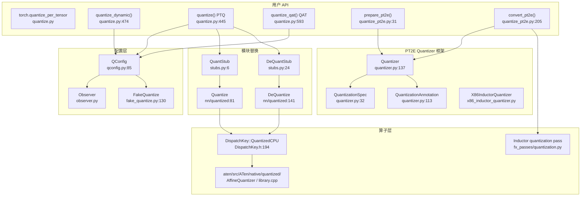

# 25. PyTorch 量化系统

## 目录

- [25.1 整体架构](#251-整体架构)
- [25.2 QConfig 量化配置](#252-qconfig-量化配置)
- [25.3 Observer 观察器](#253-observer-观察器)
- [25.4 FakeQuantize 伪量化](#254-fakequantize-伪量化)
- [25.5 QuantStub / DeQuantStub 与量化模块](#255-quantstub--dequantstub-与量化模块)
- [25.6 四种量化工作流](#256-四种量化工作流)
- [25.7 PT2E 量化](#257-pt2e-量化)
- [25.8 Quantizer 框架](#258-quantizer-框架)
- [25.9 量化调度键与算子实现](#259-量化调度键与算子实现)
- [25.10 torch.compile 量化集成](#2510-torchcompile-量化集成)
- [25.11 设计权衡](#2511-设计权衡)
- [25.12 关键文件索引](#2512-关键文件索引)

---

## 25.1 整体架构

PyTorch 量化系统支持四种工作流（Eager PTQ、Eager QAT、动态量化、PT2E），核心流程为：**观察/校准 → 伪量化训练（可选）→ 转换**。



---

## 25.2 QConfig 量化配置

QConfig 是量化的核心配置元组，指定激活和权重的观察器/伪量化器。

```python
# torch/ao/quantization/qconfig.py:85
class QConfig(namedtuple('QConfig', ['activation', 'weight'])):
    def __new__(cls, activation, weight):
        # 拒绝传入 nn.Module 实例，必须传入类
        if isinstance(activation, nn.Module) or isinstance(weight, nn.Module):
            raise ValueError(...)
```

### 关键 QConfig 实例

| QConfig | 行号 | 激活 | 权重 | 用途 |
|---------|------|------|------|------|
| `default_qconfig` | 146 | MinMaxObserver | default_weight_observer | 静态 PTQ |
| `default_dynamic_qconfig` | 165 | default_dynamic_quant_observer | default_weight_observer | 动态量化 |
| `default_qat_qconfig` | 207 | default_fake_quant | default_weight_fake_quant | QAT 训练 |

### 后端感知 QConfig

```python
# torch/ao/quantization/qconfig.py:252
def get_default_qconfig(backend='x86', version=0):
    """返回后端感知的 PTQ qconfig（fbgemm/x86/qnnpack/onednn）"""

# torch/ao/quantization/qconfig.py:366
def get_default_qat_qconfig(backend='x86', version=0):
    """返回后端感知的 QAT qconfig"""
```

| 类型 | 行号 | 说明 |
|------|------|------|
| `QConfigDynamic` | 119 | 已废弃，使用 QConfig 替代 |
| `QConfigAny` | 565 | `Optional[QConfig]` 类型别名 |
| `_PartialWrapper` | 75 | 包装 `functools.partial`，支持 `with_args` 链式配置 |

---

## 25.3 Observer 观察器

Observer 在校准阶段收集张量的统计信息（min/max/直方图），用于计算量化参数 scale 和 zero_point。

### 类继承体系

| 类名 | 行号 | 基类 | 说明 |
|------|------|------|------|
| `ObserverBase` | 148 | `nn.Module` | 抽象基类，需实现 `forward()` 和 `calculate_qparams()` |
| `UniformQuantizationObserverBase` | 181 | `ObserverBase` | 均匀量化基类（scale + zero_point） |
| `MinMaxObserver` | 431 | `UniformQuantizationObserverBase` | 逐张量 min/max 跟踪 |
| `MovingAverageMinMaxObserver` | 577 | `MinMaxObserver` | 指数移动平均 min/max |
| `PerChannelMinMaxObserver` | 676 | `UniformQuantizationObserverBase` | 逐通道 min/max 跟踪 |
| `MovingAveragePerChannelMinMaxObserver` | 884 | `PerChannelMinMaxObserver` | 逐通道移动平均 |
| `HistogramObserver` | 974 | `UniformQuantizationObserverBase` | 直方图统计，校准选择最优 scale/zero_point |
| `FixedQParamsObserver` | 1399 | `UniformQuantizationObserverBase` | 固定量化参数 |
| `PlaceholderObserver` | 1445 | `ObserverBase` | 透传，不计算 qparams |
| `RecordingObserver` | 1516 | `ObserverBase` | 记录所有观察到的张量值 |
| `NoopObserver` | 1546 | `ObserverBase` | 无操作观察器 |
| `ReuseInputObserver` | 1575 | `ObserverBase` | 复用输入张量的 qparams |
| `AffineQuantizedObserverBase` | 1797 | `ObserverBase` | 新式仿射量化观察器（支持 PerToken、PerBlock 粒度） |

### MinMaxObserver 核心逻辑

```python
# torch/ao/quantization/observer.py:431
class MinMaxObserver(UniformQuantizationObserverBase):
    def forward(self, x_orig):
        # 记录 min/max
        x = x_orig.detach()
        self.min_val = torch.min(self.min_val, x.min())
        self.max_val = torch.max(self.max_val, x.max())
        return x_orig

    def calculate_qparams(self):
        # 根据 min/max 计算 scale 和 zero_point
        scale, zero_point = self._calculate_qparams(self.min_val, self.max_val)
        return scale, zero_point
```

### HistogramObserver 校准

```python
# torch/ao/quantization/observer.py:974
class HistogramObserver(UniformQuantizationObserverBase):
    def forward(self, x_orig):
        # 累积直方图
        self.histogram += np.histogram(x, bins=self.bins, ...)
        return x_orig

    def calculate_qparams(self):
        # 通过校准（entropy / percentile / mse）选择最优参数
```

---

## 25.4 FakeQuantize 伪量化

FakeQuantize 在训练时模拟量化-反量化过程（伪量化），使模型适应量化带来的信息损失。

### 类继承体系

| 类名 | 行号 | 说明 |
|------|------|------|
| `FakeQuantizeBase` | 72 | 抽象基类，管理 `fake_quant_enabled` 和 `observer_enabled` 缓冲 |
| `FakeQuantize` | 130 | 模拟量化+反量化，内嵌 Observer 计算 scale/zero_point |
| `FusedMovingAvgObsFakeQuantize` | 358 | 融合观察+伪量化的优化模块 |

### FakeQuantize 核心

```python
# torch/ao/quantization/fake_quantize.py:130
class FakeQuantize(FakeQuantizeBase):
    def __init__(self, observer=MinMaxObserver, quant_min=0, quant_max=255,
                 is_dynamic=False, **observer_kwargs):
        # 行 169: 创建内嵌 observer 实例
        self.activation_post_process = observer(**observer_kwargs)

    def forward(self, X):
        if self.observer_enabled[0] == 1:
            self.activation_post_process(X)  # 观察统计
        if self.fake_quant_enabled[0] == 1:
            # 伪量化: quantize → dequantize
            X = torch.fake_quantize_per_tensor_affine(
                X, self.scale, self.zero_point, self.quant_min, self.quant_max)
        return X
```

### FakeQuantizeBase 控制

| 方法/属性 | 行号 | 说明 |
|-----------|------|------|
| `fake_quant_enabled` | 88 | uint8 缓冲，DDP 兼容的开关 |
| `observer_enabled` | 88 | uint8 缓冲，控制观察开关 |
| `enable_fake_quant()` | 106 | 开启伪量化 |
| `disable_fake_quant()` | 106 | 关闭伪量化 |
| `with_args()` | 121 | 类方法，创建参数化工厂 |

### FusedMovingAvgObsFakeQuantize

```python
# torch/ao/quantization/fake_quantize.py:358
class FusedMovingAvgObsFakeQuantize(FakeQuantizeBase):
    """融合观察+伪量化的优化模块，用于 QAT 性能优化"""
    # 使用移动平均更新 scale/zero_point
    # 单次前向完成观察+伪量化，减少 kernel launch 开销
```

---

## 25.5 QuantStub / DeQuantStub 与量化模块

### 量化桩模块

| 模块 | 行号 | 说明 |
|------|------|------|
| `QuantStub` | stubs.py:6 | 占位符，`convert()` 时替换为 `nnq.Quantize` |
| `DeQuantStub` | stubs.py:24 | 占位符，`convert()` 时替换为 `nnq.DeQuantize` |
| `QuantWrapper` | stubs.py:42 | 包裹模块，自动添加 QuantStub/DeQuantStub |

### 量化执行模块

| 模块 | 行号 | 说明 |
|------|------|------|
| `Quantize` | nn/quantized/modules/\_\_init\_\_.py:81 | 执行 `torch.quantize_per_tensor` |
| `DeQuantize` | nn/quantized/modules/\_\_init\_\_.py:141 | 执行 `Xq.dequantize()` |

### Quantize / DeQuantize 实现

```python
# torch/ao/nn/quantized/modules/__init__.py:81
class Quantize(nn.Module):
    def __init__(self, scale, zero_point, dtype):  # 行 108
        self.register_buffer('scale', scale)
        self.register_buffer('zero_point', zero_point)
        self.dtype = dtype

    def forward(self, X):  # 行 122
        return torch.quantize_per_tensor(X, self.scale, self.zero_point, self.dtype)

    @classmethod
    def from_float(cls, mod):  # 行 127
        # 从 observer 提取 scale/zero_point

class DeQuantize(nn.Module):  # 行 141
    def forward(self, Xq):  # 行 157
        return Xq.dequantize()

    @classmethod
    def from_float(cls, mod):  # 行 161
        return cls()
```

---

## 25.6 四种量化工作流

### 工作流总览

| 工作流 | 入口函数 | 行号 | 特点 |
|--------|----------|------|------|
| Eager PTQ（静态） | `quantize()` | quantize.py:445 | `prepare → 校准 → convert` |
| Eager QAT | `quantize_qat()` | quantize.py:593 | `prepare_qat → 训练 → convert` |
| 动态量化 | `quantize_dynamic()` | quantize.py:474 | 仅权重量化，激活运行时量化 |
| PT2E | `prepare_pt2e() / convert_pt2e()` | quantize_pt2e.py:31/205 | 基于 FX 图，Quantizer 框架 |

### Eager PTQ 流程

```python
# torch/ao/quantization/quantize.py:445
def quantize(model, run_fn, run_args, mapping=None, inplace=False):
    # 行 462-471:
    # 1. prepare(model) — 插入 Observer
    model = prepare(model, inplace=True)
    # 2. run_fn(model) — 校准数据
    run_fn(model, *run_args)
    # 3. convert(model) — 替换为量化模块
    model = convert(model, mapping, inplace=True)
```

### Eager QAT 流程

```python
# torch/ao/quantization/quantize.py:564
def prepare_qat(model, mapping=None, inplace=False):
    # 行 579-590:
    # 1. propagate_qconfig_ — 传播 QConfig
    # 2. convert (to QAT mapping) — 将 FakeQuantize 插入模型
    # 3. prepare — 插入 Observer

# torch/ao/quantization/quantize.py:593
def quantize_qat(model, run_fn, run_args, inplace=False):
    # 行 606-613:
    # 1. prepare_qat(model) — 插入 FakeQuantize
    # 2. run_fn(model) — QAT 训练
    # 3. convert(model) — 替换为量化模块
```

### 动态量化流程

```python
# torch/ao/quantization/quantize.py:474
def quantize_dynamic(model, qconfig_spec=None, dtype=torch.qint8,
                     mapping=None, inplace=False):
    # 行 505-561:
    # 仅替换指定模块（如 Linear, LSTM），权重预量化
    # 激活在推理时动态量化，不需要校准数据
```

### convert 核心

```python
# torch/ao/quantization/quantize.py:616
def convert(module, mapping=None, inplace=False, remove_qconfig=True):
    """将观察/伪量化模块替换为量化模块
    通过 from_float() 类方法创建量化版本
    QuantStub → Quantize, DeQuantStub → DeQuantize
    ObservedLinear → QuantizedLinear, etc.
    """
```

---

## 25.7 PT2E 量化

PT2E（Post-Training Export）是基于 FX 图的现代量化路径，使用 Quantizer 框架进行标注。

### prepare_pt2e

```python
# torch/ao/quantization/quantize_pt2e.py:31
def prepare_pt2e(model, quantizer):
    # 行 89-107:
    # 1. _fuse_conv_bn_(model) — 融合 Conv+BN
    # 2. quantizer.transform_for_annotation(model) — 图变换
    # 3. quantizer.annotate(model) — 标注量化规格
    # 4. quantizer.validate(model) — 验证标注
    # 5. prepare(model) — 插入 Observer/FakeQuantize 节点
```

### prepare_qat_pt2e

```python
# torch/ao/quantization/quantize_pt2e.py:110
def prepare_qat_pt2e(model, quantizer):
    # 行 166-184:
    # 与 prepare_pt2e 类似，但 is_qat=True
    # 使用 _fuse_conv_bn_qat 替代 _fuse_conv_bn_
    # 插入 FakeQuantize 节点而非 Observer
```

### convert_pt2e

```python
# torch/ao/quantization/quantize_pt2e.py:205
def convert_pt2e(model, use_reference_representation=False):
    # 行 231-250:
    # 1. _convert_to_reference_decomposed_fx — 转换为 QDQ 表示
    # 2. DuplicateDQPass — 复制共享的 DeQuantize 节点
    # 3. PortNodeMetaForQDQ — 迁移节点元数据
    # 4. 可选 constant_fold — 常量折叠优化
```

### 内部 prepare 函数

```python
# torch/ao/quantization/pt2e/prepare.py:31
def prepare(model, node_type_to_io_type_map=None):
    """根据 QuantizationAnnotation 元数据插入 Observer/FakeQuantize 节点"""

# torch/ao/quantization/pt2e/prepare.py:111
def _get_edge_or_node_to_qspec(graph):
    """从图注解中提取 edge/node → QuantizationSpec 映射"""
```

---

## 25.8 Quantizer 框架

Quantizer 框架是 PT2E 量化的核心抽象，将后端特定的量化策略与通用流程解耦。

### 核心类

| 类名 | 行号 | 说明 |
|------|------|------|
| `QuantizationSpecBase` | quantizer.py:25 | 量化规格抽象基类 |
| `QuantizationSpec` | quantizer.py:32 | 数据类：dtype, observer_or_fake_quant_ctr, quant_min, quant_max, qscheme, ch_axis, is_dynamic |
| `FixedQParamsQuantizationSpec` | quantizer.py:68 | 固定 scale/zero_point 量化规格 |
| `SharedQuantizationSpec` | quantizer.py:89 | 共享观察器/伪量化实例规格 |
| `DerivedQuantizationSpec` | quantizer.py:99 | 派生量化规格（qparams 从其他张量推导） |
| `QuantizationAnnotation` | quantizer.py:113 | 数据类：`input_qspec_map`, `output_qspec`, `allow_implicit_sharing`, `_annotated` |
| `Quantizer` | quantizer.py:137 | 抽象基类，后端量化器 |

### Quantizer 接口

```python
# torch/ao/quantization/quantizer/quantizer.py:137
class Quantizer:
    def transform_for_annotation(self, model):  # 行 138
        """可选：标注前的图变换（如算子分解）"""
        return model

    @abstractmethod
    def annotate(self, model):  # 行 155
        """核心方法：为节点标注 QuantizationAnnotation"""

    @abstractmethod
    def validate(self, model):  # 行 160
        """验证标注后的图是否被后端支持"""

    def prepare_obs_or_fq_callback(self):  # 行 163
        """返回创建 Observer 或 FakeQuantize 实例的回调"""
```

### EdgeOrNode 类型

```python
# torch/ao/quantization/quantizer/quantizer.py:84
EdgeOrNode = Union[tuple[Node, Node], Node]
# tuple[Node, Node] 表示边（producer, consumer）
# Node 表示节点（输出张量）
```

### X86InductorQuantizer

| 组件 | 行号 | 说明 |
|------|------|------|
| `_X86InductorQuantizationAnnotation` | 69 | 扩展的 QuantizationAnnotation，含 `_is_output_of_quantized_pattern` |
| `int8_in_int8_out_ops` | 81 | int8 输入/输出优化的算子集合（max_pool2d, cat, avg_pool2d 等） |
| `default_quantizable_ops` | 95 | 默认可量化算子（conv2d, linear） |
| `quantizable_ops` | 102 | 扩展可量化算子（含 matmul） |
| `QUANT_ANNOTATION_KEY` | 106 | `"quantization_annotation"` — node.meta 中的注解键 |

---

## 25.9 量化调度键与算子实现

### 量化 Dispatch Key

```
# c10/core/DispatchKey.h

行 56-58: C10_FORALL_FUNCTIONALITY_KEYS 宏包含 Quantized 功能键
行 194:   Quantized 功能性调度键
行 36-51: C10_FORALL_BACKEND_COMPONENTS 定义后端组件
          (CPU:37, CUDA:38, HIP:39, XLA:40, MPS:41, ...)
行 436-442: DEFINE_PER_BACKEND_KEYS 宏展开生成:
          QuantizedCPU, QuantizedCUDA, QuantizedMeta, ...
行 626:   StartOfQuantizedBackends
行 627:   EndOfQuantizedBackends (= QuantizedMeta)
```

量化调度键路由：`aten::add(Tensor, Tensor)` → 当输入为量化张量时，Dispatcher 自动路由到 `QuantizedCPU` 后端实现。

### 量化算子注册

```cpp
// aten/src/ATen/native/quantized/library.cpp:4
TORCH_LIBRARY(quantized, m) {
    m.def("add(Tensor qa, Tensor qb, float scale, int zero_point) -> Tensor qc");
    // 行 11: quantized::add
    // 行 55: quantized::conv2d.new
    // 行 72: quantized::conv2d_prepack
    // ... 更多量化算子
}
```

### 仿射量化核心函数

```cpp
// aten/src/ATen/native/quantized/AffineQuantizer.h
行 10:  quantize_tensor_per_tensor_affine   — 逐张量仿射量化
行 15:  quantize_tensor_per_channel_affine   — 逐通道仿射量化
行 29:  dequantize_tensor_per_tensor_affine  — 逐张量仿射反量化
行 34:  dequantize_tensor_per_channel_affine — 逐通道仿射反量化
行 88:  quantize_tensor_per_tensor_affine_stub — 分发 stub
```

### 量化算子实现目录

| 文件 | 说明 |
|------|------|
| `AffineQuantizer.h/.cpp` | 量化/反量化核心实现 |
| `AffineQuantizerBase.h/.cpp` | 仿射量化操作基类 |
| `FakeQuantPerChannelAffine.cpp` | 逐通道伪量化 |
| `FakeQuantPerTensorAffine.cpp` | 逐张量伪量化 |
| `QTensor.cpp` | 量化张量操作 |
| `TensorFactories.cpp` | 量化张量工厂函数 |
| `library.cpp` | 算子模式注册 |

---

## 25.10 torch.compile 量化集成

Inductor 通过 FX Pass 将 QDQ（Quantize-DeQuantize）图模式转换为高效的后端内核。

### 量化 Lowering 注册

```python
# torch/_inductor/quantized_lowerings.py:30
def register_quantized_ops():
    """注册量化算子的 fallback lowering"""

# torch/_inductor/quantized_lowerings.py:43
def register_woq_mm_ops():
    """注册 aten._weight_int8pack_mm — 权重仅量化矩阵乘"""
```

### Inductor 量化 FX Pass

| 函数 | 行号 | 说明 |
|------|------|------|
| `_PER_TENSOR_QUANTIZE_OPS` | 28 | 逐张量量化算子列表 |
| `get_dequantize_per_tensor_activation_pattern` | 120 | 匹配逐张量反量化激活模式 |
| `_register_quantized_conv_lowering` | 305 | 注册 Conv2d 量化 lowering |
| `_register_quantized_linear_lowering` | 400 | 注册 Linear 量化 lowering |
| `_register_quantization_unary_fusion` | 707 | 一元融合（conv+relu, linear+relu 等） |
| `_register_quantization_binary_fusion` | 832 | 二元融合模式 |
| `_register_quantization_lowerings` | 1541 | 主函数：注册所有量化 lowering |
| `_register_woq_lowerings` | 1549 | 权重仅量化 lowering |
| `_register_dequant_promotion_pass` | 1602 | DeQuant 提升优化 |
| `_register_qconv_weight_prepack_pass` | 1741 | Conv 权重预打包（oneDNN） |
| `_register_qlinear_weight_prepack_pass` | 2060 | Linear 权重预打包（oneDNN） |
| `quant_lift_up` | 3179 | 量化操作上提优化 |

### 量化融合模式

```
典型融合: conv2d + dequant → quantized_conv2d
         linear + dequant → quantized_linear
         conv2d + relu + dequant → quantized_conv2d_relu
```

---

## 25.11 设计权衡

| 权衡点 | 选择 | 原因 |
|--------|------|------|
| Eager vs FX/PT2E | 两者并存 | Eager 灵活直观，FX/PT2E 可自动分析图结构并支持更高级优化 |
| Observer vs FakeQuantize | QAT 用 FakeQuantize | Observer 仅统计，FakeQuantize 在训练中模拟量化误差 |
| 逐张量 vs 逐通道 | 均支持 | 逐张量简单高效，逐通道精度更高但存储开销大 |
| 静态 vs 动态量化 | 均支持 | 静态精度高但需校准数据，动态灵活但运行时开销大 |
| QDQ 表示 vs 原生量化模块 | PT2E 使用 QDQ | QDQ 图模式对编译器友好，易于 Inductor 优化融合 |
| 后端硬编码 vs Quantizer 框架 | Quantizer 抽象 | 将后端量化策略（X86/GPU/DSP）从通用流程解耦 |
| 共享 Observer | SharedQuantizationSpec | 减少内存和计算开销，但需保证语义正确性 |

---

## 25.12 关键文件索引

| 文件 | 核心内容 |
|------|----------|
| `torch/ao/quantization/qconfig.py` | QConfig、default_qconfig、get_default_qconfig |
| `torch/ao/quantization/observer.py` | ObserverBase、MinMaxObserver、HistogramObserver 等全部观察器 |
| `torch/ao/quantization/fake_quantize.py` | FakeQuantizeBase、FakeQuantize、FusedMovingAvgObsFakeQuantize |
| `torch/ao/quantization/stubs.py` | QuantStub、DeQuantStub、QuantWrapper |
| `torch/ao/quantization/quantize.py` | quantize、quantize_dynamic、prepare_qat、quantize_qat、convert |
| `torch/ao/quantization/quantize_pt2e.py` | prepare_pt2e、prepare_qat_pt2e、convert_pt2e |
| `torch/ao/quantization/pt2e/prepare.py` | PT2E 内部 prepare、_get_edge_or_node_to_qspec |
| `torch/ao/quantization/quantizer/quantizer.py` | Quantizer、QuantizationSpec、QuantizationAnnotation |
| `torch/ao/quantization/quantizer/x86_inductor_quantizer.py` | X86InductorQuantizer 后端实现 |
| `torch/ao/nn/quantized/modules/__init__.py` | Quantize、DeQuantize 量化执行模块 |
| `c10/core/DispatchKey.h` | QuantizedCPU/QuantizedCUDA 调度键 |
| `aten/src/ATen/native/quantized/library.cpp` | 量化算子模式注册 |
| `aten/src/ATen/native/quantized/AffineQuantizer.h` | 仿射量化核心函数 |
| `torch/_inductor/fx_passes/quantization.py` | Inductor 量化融合 Pass |
| `torch/_inductor/quantized_lowerings.py` | 量化算子 Lowering 注册 |
