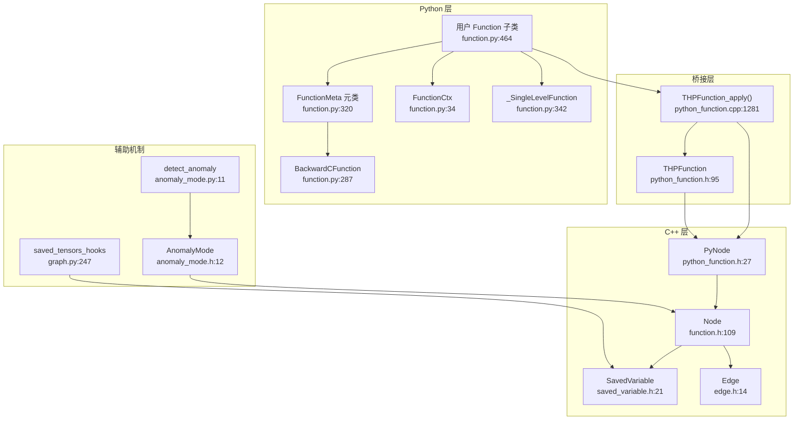
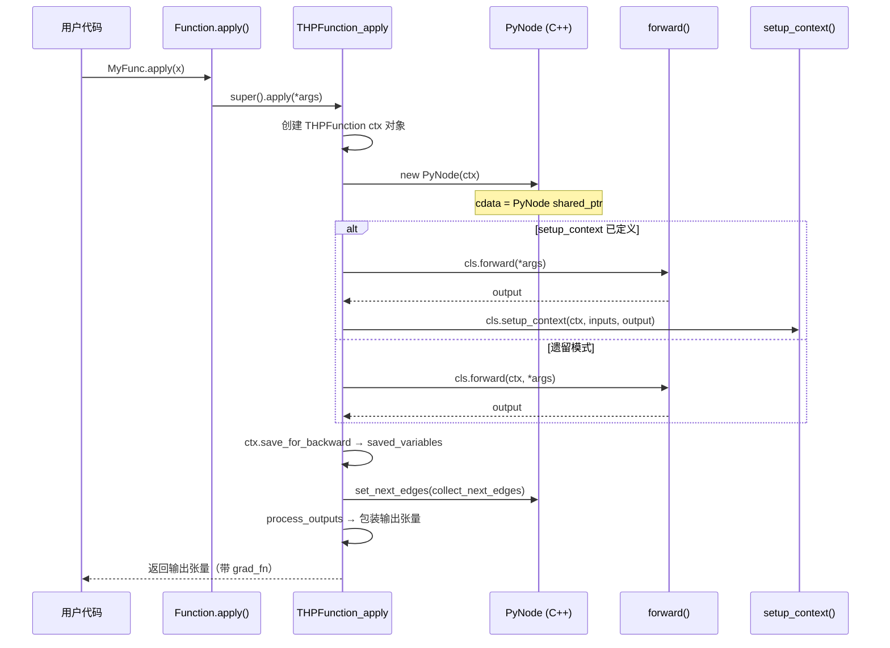

# 26. PyTorch Autograd Function 自定义梯度机制

## 目录

- [26.1 整体架构](#261-整体架构)
- [26.2 torch.autograd.Function Python 类](#262-torchautogradfunction-python-类)
- [26.3 FunctionMeta 元类与 BackwardCFunction](#263-functionmeta-元类与-backwardcfunction)
- [26.4 FunctionCtx 上下文对象](#264-functionctx-上下文对象)
- [26.5 C++ Node 类](#265-c-node-类)
- [26.6 SavedVariable 保存变量](#266-savedvariable-保存变量)
- [26.7 Edge 边连接](#267-edge-边连接)
- [26.8 THPFunction_apply 调度流程](#268-thpfunction_apply-调度流程)
- [26.9 PyNode Python 节点桥接](#269-pynode-python-节点桥接)
- [26.10 THPFunction C 结构体](#2610-thpfunction-c-结构体)
- [26.11 saved_tensors_hooks 钩子](#2611-saved_tensors_hooks-钩子)
- [26.12 detect_anomaly 异常检测](#2612-detect_anomaly-异常检测)
- [26.13 设计权衡](#2613-设计权衡)
- [26.14 关键文件索引](#2614-关键文件索引)

---

## 26.1 整体架构

`torch.autograd.Function` 允许用户自定义前向/反向传播逻辑。其核心机制涉及 Python 层的类定义、元类自动生成反向类、以及 C++ 层的计算图节点（Node）桥接。



---

## 26.2 torch.autograd.Function Python 类

`Function` 是用户自定义梯度函数的基类，子类需实现 `forward` 和 `backward` 静态方法。

### 类定义层次

| 类名 | 行号 | 说明 |
|------|------|------|
| `FunctionCtx` | 34 | 上下文基类（原 `_ContextMethodMixin`） |
| `BackwardCFunction` | 287 | 内部反向执行类，继承 `_C._FunctionBase` + `FunctionCtx` + `_HookMixin` |
| `FunctionMeta(type)` | 320 | 元类，自动生成 `_backward_cls` |
| `_SingleLevelFunction` | 342 | 中间基类，定义 `forward`/`backward`/`setup_context`/`jvp` 桩方法 |
| `Function` | 464 | 用户面向的主基类 |

### Function 核心方法

| 方法 | 行号 | 说明 |
|------|------|------|
| `Function.forward` | 346 | 静态方法桩，子类必须覆盖 |
| `Function.setup_context` | 392 | 静态方法桩，分离上下文设置逻辑 |
| `Function.backward` | 409 | 静态方法桩，子类必须覆盖 |
| `Function.vjp` | 438 | `vjp = backward` 别名 |
| `Function.jvp` | 441 | 前向模式 AD 桩方法 |
| `Function.apply` | 559 | 类方法：自定义 Function 的主入口 |
| `Function.vmap` | 527 | `torch.vmap` 支持桩方法 |
| `Function.generate_vmap_rule` | 524 | 布尔类变量，自动生成 vmap 规则 |
| `Function._compiled_autograd_key` | 588 | 返回 `(ctx._autograd_function_id,)` 用于编译 autograd |
| `Function.__init__` | 498 | 发出弃用警告——不应实例化 |
| `Function.__call__` | 508 | 报错——遗留非静态 forward 已弃用 |

### Function.apply 调用链

```python
# torch/autograd/function.py:559
@classmethod
def apply(cls, *args, **kwargs):
    # 1. 检查 functorch 是否活跃 → custom_function_call
    # 2. 否则委托给 super().apply() (C++ 层 THPFunction_apply)
```

### once_differentiable 装饰器

```python
# torch/autograd/function.py:596
def once_differentiable(fn):
    """装饰器：防止二次反向传播"""
    # 在 backward 执行后释放保存的张量
```

---

## 26.3 FunctionMeta 元类与 BackwardCFunction

### FunctionMeta 元类

```python
# torch/autograd/function.py:320
class FunctionMeta(type):
    def __init__(cls, name, bases, attrs):
        # 行 329: 自动创建 "<name>Backward" 类
        # 从 BackwardCFunction 派生
        # 存储为 cls._backward_cls
```

当用户定义 `class MyFunc(torch.autograd.Function)` 时：
1. `FunctionMeta.__init__` 自动创建 `MyFuncBackward` 类（继承 `BackwardCFunction`）
2. `MyFuncBackward.forward` → 调用 `MyFunc.backward`
3. `MyFuncBackward.backward` → 链式调用上一层的 backward
4. `MyFunc._backward_cls` → 指向自动生成的 `MyFuncBackward`

### BackwardCFunction

```python
# torch/autograd/function.py:287
class BackwardCFunction(_C._FunctionBase, FunctionCtx, _HookMixin):
    def apply(self, *args):
        # 行 292: 分发到 backward 或 vjp
        # 执行 pre-hook → backward → post-hook

    def apply_jvp(self, *args):
        # 行 309: 分发到 jvp（前向模式 AD）

    def _compiled_autograd_key(self):
        # 行 316: 委托给 _forward_cls._compiled_autograd_key
```

### 元类自动生成过程

```
用户定义:
  class MyFunc(Function):
      @staticmethod
      def forward(ctx, x): ...
      @staticmethod
      def backward(ctx, grad): ...

FunctionMeta 自动生成:
  class MyFuncBackward(BackwardCFunction):
      @staticmethod
      def forward(ctx, *args): return MyFunc.backward(ctx, *args)
      ...
  MyFunc._backward_cls = MyFuncBackward
```

---

## 26.4 FunctionCtx 上下文对象

`FunctionCtx` 是传递给 `forward`/`backward` 的上下文对象，用于保存张量和传递元信息。

| 方法/属性 | 行号 | 说明 |
|-----------|------|------|
| `save_for_backward(*tensors)` | 35 | 保存张量供 backward 使用（主 API） |
| `save_for_forward(*tensors)` | 94 | 保存张量供前向模式 AD（jvp）使用 |
| `mark_dirty(*args)` | 148 | 标记被原地修改的张量 |
| `mark_non_differentiable(*args)` | 194 | 标记不需要梯度的输出 |
| `set_materialize_grads(value)` | 226 | 控制 undefined 梯度是否零填充（默认 True） |
| `saved_tensors` | C++ 属性 | 已保存的张量元组（THPFunction_properties 提供 getter） |
| `needs_input_grad` | C++ 属性 | 各输入是否需要梯度的布尔元组 |

### save_for_backward 约束

```python
# torch/autograd/function.py:35
def save_for_backward(self, *tensors):
    """只能保存张量，且只能调用一次
    保存的张量在 backward 后自动释放
    如果需要在 backward 之外使用，应直接存为 self.attr
    """
```

### _ContextMethodMixin 别名

```python
# torch/autograd/function.py:274
_ContextMethodMixin = FunctionCtx  # 向后兼容别名
```

---

## 26.5 C++ Node 类

`Node` 是 C++ autograd 计算图的核心节点类，每个 `Function.apply` 调用在图中创建一个 Node。

### Node 类定义

```cpp
// torch/csrc/autograd/function.h:109
struct TORCH_API Node {
    // 核心数据成员
    edge_list next_edges_;      // 行 674: 出边列表
    SmallVector<InputMetadata> input_metadata_;  // 行 693: 输入元数据
    uint64_t sequence_nr_;      // 行 617: 拓扑序号
```

### Node 关键方法

| 方法 | 行号 | 说明 |
|------|------|------|
| `operator()` | 150 | 调用运算符：在给定输入上执行函数 |
| `apply` (纯虚) | 609 | 保护：节点执行的实际操作 |
| `set_next_edges(edge_list&&)` | 303 | 设置出边并更新拓扑编号 |
| `add_next_edge(Edge&&)` | 298 | 添加单条出边 |
| `next_edge(size_t)` | 310 | 返回指定索引的出边 |
| `next_edges()` | 314 | 返回出边列表的 const 引用 |
| `num_outputs()` | 322 | 返回 `next_edges_.size()` |
| `num_inputs()` | 220 | 返回基于 `input_metadata_` 的输入数 |
| `add_input_metadata(...)` | 195 | 添加输入元数据并返回输入索引 |

### TraceableFunction

```cpp
// torch/csrc/autograd/function.h:697
struct TraceableFunction : public Node {
    // is_traceable() 返回 true
    // 用于 JIT 追踪时标记可追踪的函数节点
};
```

---

## 26.6 SavedVariable 保存变量

`SavedVariable` 在前向传播时快照变量，在反向传播时解包恢复，是 autograd 节省内存的核心机制。

```cpp
// torch/csrc/autograd/saved_variable.h:21
class TORCH_API SavedVariable {
    // 构造函数
    SavedVariable(const Variable& variable, bool is_output,
                  bool is_inplace_on_view = false);  // 行 24

    // 核心方法
    Variable unpack(std::shared_ptr<Node> saved_for = ...) const;  // 行 46
    void reset_data();           // 行 50: 重置保存的数据
    void register_hooks(...);    // 行 48: 注册 pack/unpack 钩子

    // 数据成员
    at::Tensor data_;            // 行 76: 实际存储的张量数据
    std::unique_ptr<SavedVariableHooks> hooks_;  // 行 104: pack/unpack 钩子
    bool saved_original_;        // 行 96: 是否保存了原始变量（vs tensor_data）
};
```

### SavedVariable 生命周期

```
前向传播:
  ctx.save_for_backward(x)
  → SavedVariable(x, is_output=False)
  → 快照: 记录 data_, 版本号, 设备信息

反向传播:
  ctx.saved_tensors
  → SavedVariable.unpack()
  → 版本检查: 如果数据被原地修改则报错
  → 返回 Tensor

反向传播结束:
  SavedVariable.reset_data()
  → 释放保存的张量数据
```

---

## 26.7 Edge 边连接

`Edge` 表示计算图中从一个 Node 的输出到另一个 Node 的输入的连接。

```cpp
// torch/csrc/autograd/edge.h:14
struct Edge {
    std::shared_ptr<Node> function;  // 行 35: 目标函数节点
    uint32_t input_nr;               // 行 38: 目标函数的输入编号

    bool is_valid() const {          // 行 21
        return function != nullptr;
    }

    Edge() : function(nullptr), input_nr(0) {}              // 行 15
    Edge(std::shared_ptr<Node> function_, uint32_t input_nr_)  // 行 17
        : function(std::move(function_)), input_nr(input_nr_) {}
};
```

### Edge 在计算图中的作用

```
Node A (forward) ──Edge(function=NodeB, input_nr=0)──→ Node B (backward)
                 ──Edge(function=NodeC, input_nr=1)──→ Node C (backward)

每个输出张量对应一条 Edge:
  output.grad_fn → Node
  output.output_nr → input_nr
```

---

## 26.8 THPFunction_apply 调度流程

`THPFunction_apply` 是 Python `Function.apply()` 的 C++ 实现，完成从前向调用到计算图构建的全部流程。

```cpp
// torch/csrc/autograd/python_function.cpp:1281
PyObject* THPFunction_apply(PyObject* cls, PyObject* inputs) {
    // 行 1316-1317: 创建 PyNode
    //   auto cdata = std::make_shared<PyNode>(std::move(ctx_obj));

    // 行 1325: 设置计算图边
    //   cdata->set_next_edges(collect_next_edges(output_vars));

    // 行 1353-1371: 新式 setup_context 路径
    //   forward_output = cls.forward(*args)
    //   cls.setup_context(ctx, inputs, forward_output)

    // 行 1372-1379: 遗留 ctx 路径
    //   forward_output = cls.forward(ctx, *args)

    // 行 1385: 处理输出
    //   return process_outputs(cdata, inputs, output_vars)
}
```

### 调度流程图



---

## 26.9 PyNode Python 节点桥接

`PyNode` 是 C++ `Node` 的子类，桥接 Python 自定义 Function 到 C++ autograd 引擎。

```cpp
// torch/csrc/autograd/python_function.h:27
struct PyNode : public Node {
    PyNode(THPObjectPtr obj);  // 行 28: 接管 Python 对象所有权

    variable_list apply(variable_list&& inputs) override;  // 行 37
    void release_variables() override;  // 行 42
    std::string name() const override;  // 行 43

    PyObject* obj;                    // 行 54: 拥有的 THPFunction 引用
    std::optional<int> _backward_idx; // 行 57: 编译 autograd 索引

    ~PyNode() {  // 行 64: 获取 GIL 后 decref Python 对象
        if (obj) Py_DECREF(obj);
    }
};
```

### PyNode::apply 实现

```cpp
// torch/csrc/autograd/python_function.cpp:140
auto PyNode::apply(variable_list&& inputs) -> variable_list {
    // 1. 获取 GIL
    // 2. 将 C++ variable_list 转为 Python 元组
    // 3. 调用 obj.apply(inputs)  → Python BackwardCFunction.apply
    // 4. 将 Python 返回值转回 C++ variable_list
    // 5. 释放 GIL
}
```

### PyNode 在反向传播中的角色

```
C++ Autograd Engine 执行反向传播:
  Engine::execute(task)
  → Node::operator()(inputs)
  → 对于 PyNode: PyNode::apply(inputs)
    → 获取 GIL
    → 调用 Python BackwardCFunction.apply()
    → 调用用户定义的 backward()
    → 返回梯度张量
  → 继续遍历计算图
```

---

## 26.10 THPFunction C 结构体

`THPFunction` 是 Python 端 Function 上下文对象的 C 层表示，存储所有反向传播所需的状态。

```cpp
// torch/csrc/autograd/python_function.h:95
struct THPFunction {
    // 核心属性
    std::weak_ptr<PyNode> cdata;       // 行 150: 弱引用底层图节点
    PyObject* to_save;                  // 行 103: save_for_backward 保存的张量元组
    PyObject* saved_for_forward;        // 行 138: save_for_forward 保存的张量元组
    bool materialize_grads;             // 行 116: 是否零填充 undefined 梯度（默认 true）

    // 输入追踪
    PyObject* needs_input_grad;         // 行 98: 各输入是否需要梯度的元组
    std::vector<bool> is_variable_input; // 行 135: 各输入是否为 Variable
    char has_freed_buffers;             // 行 136: 双重反向传播错误检测标志

    // C++ 保存变量存储
    std::vector<SavedVariable> saved_variables;  // 行 133: 实际保存的变量
};
```

### THPFunction 类型注册

```cpp
// torch/csrc/autograd/python_function.cpp

行 1702: THPFunction_properties[]  — getset 表
  包含: saved_tensors, to_save, materialize_grads, needs_input_grad 等

行 1773: THPFunction_methods[]  — 方法表
  包含: name, apply, register_hook, register_prehook 等

行 1798: PyTypeObject THPFunctionType — Python 类型对象
  对应 torch._C._FunctionBase

行 1841: THPFunction_initModule — 注册类型到 Python 模块
```

---

## 26.11 saved_tensors_hooks 钩子

`saved_tensors_hooks` 是上下文管理器，用于自定义 autograd 保存张量的打包/解包行为，常用于张量压缩或 Offload。

```python
# torch/autograd/graph.py:247
class saved_tensors_hooks:
    def __init__(self, pack_hook, unpack_hook):  # 行 309
        """
        pack_hook(tensor) → Any     # 打包（如压缩、Offload）
        unpack_hook(packed) → Tensor  # 解包（如解压、加载回 GPU）
        """
        self.pack_hook = pack_hook    # 行 314
        self.unpack_hook = unpack_hook  # 行 315

    def __enter__(self):  # 行 317
        torch._C._autograd._push_saved_tensors_default_hooks(
            self.pack_hook, self.unpack_hook)

    def __exit__(self, *args):  # 行 322
        torch._C._autograd._pop_saved_tensors_default_hooks()
```

### 典型用法

```python
# GPU → CPU Offload 示例
def pack_hook(tensor):
    return tensor.to("cpu")

def unpack_hook(packed):
    return packed.to("cuda")

with torch.autograd.graph.saved_tensors_hooks(pack_hook, unpack_hook):
    output = model(input)
    output.backward()  # 保存的张量被 offload 到 CPU
```

### 内部机制

```
save_for_backward(tensor)
  → SavedVariable 构造时检查默认 hooks 栈
  → 如果有 hooks: data_ = pack_hook(tensor)
  → 否则: data_ = tensor

SavedVariable.unpack()
  → 如果有 hooks: return unpack_hook(data_)
  → 否则: return data_
```

---

## 26.12 detect_anomaly 异常检测

`detect_anomaly` 是上下文管理器，用于检测反向传播中的 NaN 梯度并定位产生问题的前向操作。

### Python 层

```python
# torch/autograd/anomaly_mode.py:11
class detect_anomaly:
    def __init__(self, check_nan=True):  # 行 77
        self.prev = torch.is_anomaly_enabled()
        self.check_nan = check_nan

    def __enter__(self):  # 行 88
        torch.set_anomaly_enabled(True, self.check_nan)

    def __exit__(self, *args):  # 行 91
        torch.set_anomaly_enabled(self.prev)
```

### C++ 层

```cpp
// torch/csrc/autograd/anomaly_mode.h

struct TORCH_API AnomalyMode {     // 行 12
    static bool is_enabled();       // 行 13
    static bool should_check_nan(); // 行 16
    static void set_enabled(bool enabled, bool check_nan);  // 行 19
};

class TORCH_API DetectAnomalyGuard {  // 行 51
    // RAII 守卫，C++ 层异常检测
};

struct TORCH_API AnomalyMetadata {  // 行 60
    // 存储回溯信息和父节点，用于异常报告
    // 在 Node 执行时记录 Python traceback
};
```

### 异常检测工作流程

```
1. 开启 detect_anomaly
   → AnomalyMode::set_enabled(true)

2. 前向传播
   → 每个 Node 执行时，AnomalyMetadata 记录 traceback

3. 反向传播
   → Engine 执行 Node::operator()
   → 如果 AnomalyMode::is_enabled():
     → 执行前存储 traceback
     → 执行后检查输出梯度是否含 NaN
     → 如果含 NaN，打印 traceback 指向问题前向操作

4. 关闭 detect_anomaly
   → AnomalyMode::set_enabled(false)
```

---

## 26.13 设计权衡

| 权衡点 | 选择 | 原因 |
|--------|------|------|
| 静态方法 vs 实例方法 | 静态方法 + setup_context | 避免在 Function 实例上存储状态，与编译路径兼容 |
| 元类自动生成 Backward | FunctionMeta 生成 `_backward_cls` | 自动将用户的 backward 映射为计算图 Node，无需手动注册 |
| save_for_backward vs 直接存储 | 推荐用 save_for_backward | 支持版本检查、自动释放、saved_tensors_hooks；直接存储绕过安全机制 |
| PyNode vs 纯 C++ Node | PyNode 桥接 | Python 自定义函数需要 GIL，PyNode 封装了 GIL 管理和类型转换 |
| 弱引用 cdata | THPFunction 持有 weak_ptr | 避免循环引用（THPFunction ↔ PyNode），由 Node 引用计数控制生命周期 |
| materialize_grads 默认 True | 零填充 undefined 梯度 | 简化用户 backward 实现，但可能掩盖错误；可手动关闭 |
| once_differentiable | 可选装饰器 | 释放保存的张量防止内存泄漏，但不支持高阶梯度 |

---

## 26.14 关键文件索引

| 文件 | 核心内容 |
|------|----------|
| `torch/autograd/function.py` | Function、FunctionMeta、BackwardCFunction、FunctionCtx |
| `torch/csrc/autograd/function.h` | C++ Node 类、TraceableFunction |
| `torch/csrc/autograd/saved_variable.h` | SavedVariable 保存变量 |
| `torch/csrc/autograd/edge.h` | Edge 计算图边 |
| `torch/csrc/autograd/python_function.cpp` | THPFunction_apply、PyNode::apply、THPFunction 类型定义 |
| `torch/csrc/autograd/python_function.h` | PyNode、THPFunction 结构体 |
| `torch/autograd/graph.py` | saved_tensors_hooks |
| `torch/autograd/anomaly_mode.py` | detect_anomaly Python 接口 |
| `torch/csrc/autograd/anomaly_mode.h` | AnomalyMode C++ 实现 |
