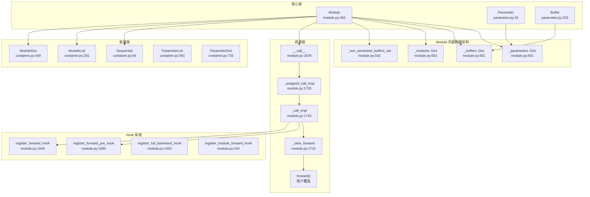
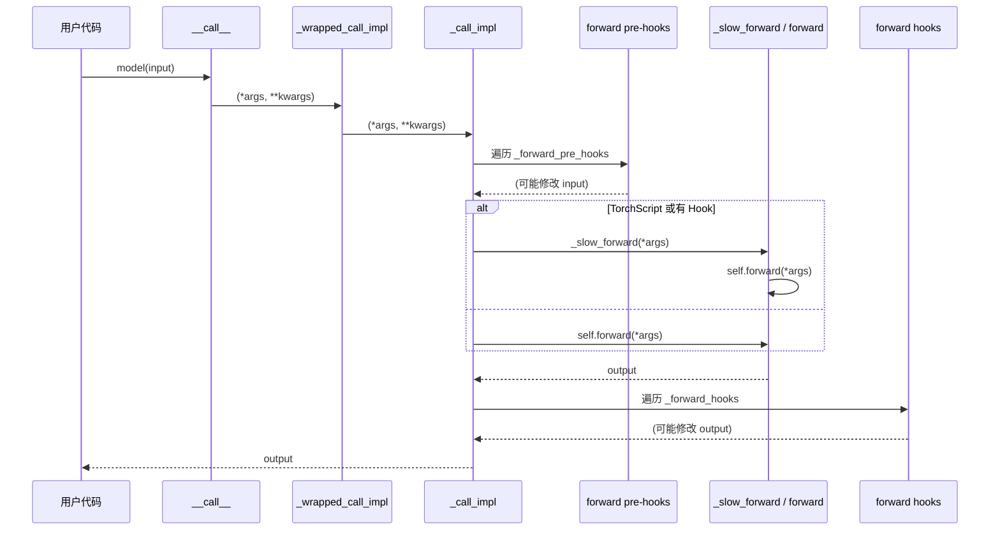

# 27. PyTorch nn.Module 模块系统

## 目录

- [27.1 整体架构](#271-整体架构)
- [27.2 Module 基类](#272-module-基类)
- [27.3 Parameter 与 Buffer](#273-parameter-与-buffer)
- [27.4 容器类](#274-容器类)
- [27.5 前向调用链](#275-前向调用链)
- [27.6 属性管理](#276-属性管理)
- [27.7 Hook 系统](#277-hook-系统)
- [27.8 state_dict 与序列化](#278-state_dict-与序列化)
- [27.9 nn.functional 函数式 API](#279-nnfunctional-函数式-api)
- [27.10 设计权衡](#2710-设计权衡)
- [27.11 关键文件索引](#2711-关键文件索引)

---

## 27.1 整体架构

`nn.Module` 是 PyTorch 所有神经网络模块的基类，管理参数、缓冲区、子模块的注册与生命周期，并提供训练/推理模式切换、设备转移、序列化等基础设施。



---

## 27.2 Module 基类

### 核心初始化

```python
# torch/nn/modules/module.py:402
class Module:
    def __init__(self):  # 行 476
        self.training = True
        self._parameters: Dict[str, Optional[Parameter]] = {}      # 行 501
        self._buffers: Dict[str, Optional[Tensor]] = {}            # 行 501
        self._non_persistent_buffers_set: Set[str] = set()         # 行 502
        self._modules: Dict[str, Optional[Module]] = {}            # 行 503
        self._forward_pre_hooks: Dict[int, Callable] = {}
        self._forward_hooks: Dict[int, Callable] = {}
        self._backward_hooks: Dict[int, Callable] = {}
        self._backward_pre_hooks: Dict[int, Callable] = {}
```

### 关键方法索引

| 方法 | 行号 | 说明 |
|------|------|------|
| `forward` | 520 | 默认 `_forward_unimplemented`，子类必须覆盖 |
| `register_buffer` | 522 | 注册缓冲区（非梯度张量），可选持久化 |
| `register_parameter` | 584 | 注册参数（可训练张量） |
| `add_module` | 634 | 注册子模块 |
| `apply` | 995 | 递归对自身及子模块应用函数 |
| `cuda` | 1036 | 将参数和缓冲区移到 GPU |
| `cpu` | 1112 | 将参数和缓冲区移到 CPU |
| `float` | 1137 | 转为 float32 |
| `half` | 1159 | 转为 float16 |
| `to` | 1200 | 设备/dtype 转移（重载组） |
| `train` | 2824 | 设置训练模式（递归） |
| `eval` | 2846 | 设置推理模式（递归） |
| `requires_grad_` | 2864 | 设置参数是否需要梯度 |
| `zero_grad` | 2887 | 清零参数梯度 |
| `__repr__` | 2931 | 模块树形字符串表示 |

### 遍历方法

| 方法 | 行号 | 返回类型 | 说明 |
|------|------|----------|------|
| `parameters` | 2608 | `Iterator[Parameter]` | 所有参数 |
| `named_parameters` | 2633 | `Iterator[Tuple[str, Parameter]]` | 带名称参数 |
| `buffers` | 2665 | `Iterator[Tensor]` | 所有缓冲区 |
| `named_buffers` | 2688 | `Iterator[Tuple[str, Tensor]]` | 带名称缓冲区 |
| `children` | 2719 | `Iterator[Module]` | 直接子模块 |
| `modules` | 2748 | `Iterator[Module]` | 所有模块（递归） |
| `named_modules` | 2775 | `Iterator[Tuple[str, Module]]` | 带名称模块（递归） |

---

## 27.3 Parameter 与 Buffer

### Parameter

```python
# torch/nn/parameter.py:19
class Parameter(Tensor):
    """表示模块参数的张量子类，默认 requires_grad=True"""

    def __new__(cls, data=None, requires_grad=True):  # 行 40
        # 创建 Tensor 实例，设置 requires_grad
        # 标记 _is_param = True

    def __repr__(self):  # 行 73
        return f'Parameter containing:\n{super().__repr__()}'

    def __reduce_ex__(self, proto):  # 行 76
        # 支持序列化（pickle）
```

### Buffer

```python
# torch/nn/parameter.py:225
class Buffer(Tensor):
    """表示模块缓冲区的张量子类，默认 requires_grad=False
    由 Module.__setattr__ 自动检测并注册"""

    def __new__(cls, data=None, requires_grad=False, persistent=True):  # 行 242
        # persistent=True: 出现在 state_dict 中
        # persistent=False: 不序列化（如 running_mean 在某些场景）
```

### Uninitialized 变体

| 类名 | 行号 | 说明 |
|------|------|------|
| `UninitializedTensorMixin` | 95 | 延迟初始化混入类 |
| `UninitializedParameter` | 180 | 未初始化参数（shape 未知） |
| `UninitializedBuffer` | 254 | 未初始化缓冲区 |

```python
# torch/nn/parameter.py:95
class UninitializedTensorMixin:
    def materialize(self, shape, device=None, dtype=None):  # 行 116
        """将未初始化张量实例化为指定 shape"""

    @property
    def shape(self):  # 行 137
        raise RuntimeError("...")

    def __torch_function__(self, ...):  # 行 161
        raise RuntimeError("...")
```

### Parameter vs Buffer vs Tensor

| 属性 | Parameter | Buffer | 普通 Tensor |
|------|-----------|--------|-------------|
| `requires_grad` | 默认 True | 默认 False | 取决于设置 |
| 出现在 `parameters()` | 是 | 否 | 否 |
| 出现在 `buffers()` | 否 | 是 | 否 |
| 出现在 `state_dict()` | 是 | 仅 persistent | 否 |
| 自动注册 | `__setattr__` 检测 | `__setattr__` 检测 | 不注册 |

---

## 27.4 容器类

### Sequential

```python
# torch/nn/modules/container.py:64
class Sequential(Module):
    """顺序容器，前向传播按序调用子模块"""

    def __getitem__(self, idx):  # 行 139
        # 支持整数索引和切片

    def forward(self, input):  # 行 248
        for module in self:
            input = module(input)
        return input
```

### ModuleList

```python
# torch/nn/modules/container.py:281
class ModuleList(Module):
    """模块列表，像 Python list 一样使用，子模块自动注册"""

    def __init__(self, modules=None):  # 行 307
        for i, module in enumerate(modules):
            self[i] = module

    def __getitem__(self, idx):  # 行 322/326/330
    def __len__(self):  # 行 351
    def __iter__(self):  # 行 355
```

### ModuleDict

```python
# torch/nn/modules/container.py:449
class ModuleDict(Module):
    """模块字典，子模块按键名自动注册"""

    def __init__(self, modules=None):  # 行 495
    def keys(self):  # 行 537
    def items(self):  # 行 542
    def values(self):  # 行 547
    def update(self, modules):  # 行 551
```

### ParameterList / ParameterDict

| 类 | 行号 | 说明 |
|----|------|------|
| `ParameterList` | 591 | 参数列表，参数自动注册 |
| `ParameterDict` | 735 | 参数字典，参数按键名自动注册 |

---

## 27.5 前向调用链

Module 的 `__call__` 不是直接调用 `forward`，而是经过多层包装以支持 Hook、TorchScript、编译等特性。

```python
# torch/nn/modules/module.py:1878
Module.__call__ = Module._wrapped_call_impl

# 行 1735
def _wrapped_call_impl(self, *args, **kwargs):
    # 分发到 _call_impl 或 TorchScript 编译路径

# 行 1743
def _call_impl(self, *args, **kwargs):
    # 1. 执行 forward pre-hooks
    # 2. 调用 _slow_forward 或 forward
    # 3. 执行 forward hooks
    # 4. 处理编译/跟踪逻辑

# 行 1715
def _slow_forward(self, *args, **kwargs):
    # TorchScript 兼容路径
    # 如果有 forward hooks 或需要跟踪
```

### 调用流程



---

## 27.6 属性管理

Module 通过自定义 `__setattr__`、`__getattr__`、`__delattr__` 实现参数/缓冲区/子模块的自动注册。

### __setattr__

```python
# torch/nn/modules/module.py:1932
def __setattr__(self, name, value):
    # 1. 如果 value 是 Parameter → self._parameters[name] = value
    # 2. 如果 value 是 Buffer → self.register_buffer(name, value)
    # 3. 如果 value 是 Module → self._modules[name] = value
    # 4. 否则 → object.__setattr__(self, name, value)
    #
    # 移除旧值：
    #   如果 name 原在 _parameters 中 → 删除
    #   如果 name 原在 _buffers 中 → 删除
    #   如果 name 原在 _modules 中 → 删除
```

### __getattr__

```python
# torch/nn/modules/module.py:1915
def __getattr__(self, name):
    # 查找顺序：
    # 1. self._parameters[name]
    # 2. self._buffers[name]
    # 3. self._modules[name]
    # 4. 抛出 AttributeError
```

### __delattr__

```python
# torch/nn/modules/module.py:2031
def __delattr__(self, name):
    # 从 _parameters / _buffers / _modules 中删除
    # 如果都不存在 → object.__delattr__(self, name)
```

### 自动注册规则

```python
class MyModule(nn.Module):
    def __init__(self):
        super().__init__()
        self.weight = nn.Parameter(torch.randn(10, 5))  # → _parameters
        self.running_mean = torch.zeros(10)              # → _buffers（Buffer 自动检测）
        self.linear = nn.Linear(5, 10)                   # → _modules
        self.my_list = [nn.Linear(5, 10)]               # → 普通 Python 属性（不会注册！）
```

---

## 27.7 Hook 系统

Hook 允许在不修改模块代码的情况下注入自定义逻辑。

### 实例级 Hook

| 方法 | 行号 | 签名 | 触发时机 |
|------|------|------|----------|
| `register_forward_pre_hook` | 1580 | `hook(module, input) → None or modified input` | forward 前执行 |
| `register_forward_hook` | 1646 | `hook(module, input, output) → None or modified output` | forward 后执行 |
| `register_full_backward_hook` | 1420 | `hook(module, grad_input, grad_output) → modified grad` | backward 后执行 |

### 全局 Hook

| 函数 | 行号 | 说明 |
|------|------|------|
| `register_module_forward_pre_hook` | 212 | 所有模块的前向前置 Hook |
| `register_module_forward_hook` | 244 | 所有模块的前向后置 Hook |
| `register_module_backward_hook` | 291 | 所有模块的反向 Hook（已弃用） |
| `register_module_full_backward_hook` | 347 | 所有模块的完整反向 Hook |
| `register_module_parameter_registration_hook` | 186 | 参数注册全局 Hook |
| `register_module_buffer_registration_hook` | 134 | 缓冲区注册全局 Hook |
| `register_module_module_registration_hook` | 160 | 子模块注册全局 Hook |

### RemovableHandle

```python
# torch/utils/hooks.py:10
class RemovableHandle:
    """Hook 注册返回的句柄，调用 remove() 可移除 Hook"""
```

### Hook 执行顺序

```
_forward_pre_hooks (按注册顺序)
  → forward()
  → _forward_hooks (按注册顺序)

_backward_pre_hooks (反向前)
  → autograd backward
  → _backward_hooks / _full_backward_hooks (反向后)
```

---

## 27.8 state_dict 与序列化

### state_dict

```python
# torch/nn/modules/module.py:2131
def state_dict(self, *, prefix='', keep_vars=False):
    """收集所有参数和持久化缓冲区
    _parameters → 包含
    _buffers (persistent=True) → 包含
    递归收集子模块
    """
```

### _load_from_state_dict

```python
# torch/nn/modules/module.py:2292
def _load_from_state_dict(self, state_dict, prefix, local_metadata,
                          strict, missing_keys, unexpected_keys,
                          error_msgs):
    """底层加载逻辑：
    1. 匹配 _parameters 中的键
    2. 匹配 _buffers 中的键
    3. 递归处理 _modules
    4. strict=True 时报告 missing/unexpected keys
    """
```

### load_state_dict

```python
# torch/nn/modules/module.py:2473
def load_state_dict(self, state_dict, strict=True):
    """加载 state_dict 到模块
    strict=True: 要求完全匹配
    strict=False: 允许缺失和多余的键
    返回 _IncompatibleKeys(missing_keys, unexpected_keys)
    """
```

### _IncompatibleKeys

```python
# torch/nn/modules/module.py:52
_IncompatibleKeys = namedtuple('_IncompatibleKeys', ['missing_keys', 'unexpected_keys'])
```

---

## 27.9 nn.functional 函数式 API

`nn.functional` 提供无状态的函数式接口，与 `nn.Module` 的有状态接口互补。

### 关键函数

| 函数 | 行号 | 说明 |
|------|------|------|
| `conv1d` | 41 | 一维卷积（C++ 绑定 + `_add_docstr`） |
| `conv2d` | 92 | 二维卷积 |
| `conv3d` | 145 | 三维卷积 |
| `avg_pool1d` | 345 | 平均池化 |
| `max_pool2d_with_indices` | 754 | 最大池化（返回索引） |
| `dropout` | 1401 | Dropout（Python 定义） |
| `relu` | 1693 | ReLU 激活 |
| `softmax` | 2103 | Softmax |
| `log_softmax` | 2220 | Log-Softmax |
| `linear` | 2309 | 线性变换 |
| `embedding` | 2437 | 嵌入查找 |
| `batch_norm` | 2791 | 批归一化 |
| `cross_entropy` | 3404 | 交叉熵损失 |
| `mse_loss` | 3835 | 均方误差损失 |

### Module vs Functional 对应关系

| Module (有状态) | Functional (无状态) |
|----------------|---------------------|
| `nn.Conv2d(weight, bias)` | `F.conv2d(input, weight, bias)` |
| `nn.BatchNorm2d(running_mean, running_var)` | `F.batch_norm(input, running_mean, running_var, weight, bias)` |
| `nn.Linear(weight, bias)` | `F.linear(input, weight, bias)` |
| `nn.ReLU()` | `F.relu(input)` |
| `nn.CrossEntropyLoss()` | `F.cross_entropy(input, target)` |

---

## 27.10 设计权衡

| 权衡点 | 选择 | 原因 |
|--------|------|------|
| `__call__` vs 直接调用 `forward` | `__call__` 包装 | 支持 Hook、TorchScript、编译，但增加调用开销 |
| `__setattr__` 自动注册 | 隐式约定 | 便捷但容易出错（列表/字典中的模块不会注册） |
| Parameter 默认 requires_grad=True | 隐式梯度 | 适合训练场景，推理时需手动关闭 |
| Buffer persistent 选项 | 可选持久化 | 减少 state_dict 体积，但需手动管理非持久化缓冲区 |
| UninitializedParameter | 延迟初始化 | 支持动态 shape（如根据输入确定），但增加复杂度 |
| 全局 Hook | 模块级函数 | 方便框架级注入（如 Profiler），但影响所有模块 |
| state_dict 递归收集 | 扁平化键名 | `prefix.module.param` 格式统一，但深层嵌套键名冗长 |

---

## 27.11 关键文件索引

| 文件 | 核心内容 |
|------|----------|
| `torch/nn/modules/module.py` | Module 基类、Hook、state_dict、遍历方法 |
| `torch/nn/parameter.py` | Parameter、UninitializedParameter、Buffer、UninitializedBuffer |
| `torch/nn/modules/container.py` | Sequential、ModuleList、ModuleDict、ParameterList、ParameterDict |
| `torch/nn/functional.py` | 函数式 API（conv、pool、activation、loss 等） |
| `torch/utils/hooks.py` | RemovableHandle |
