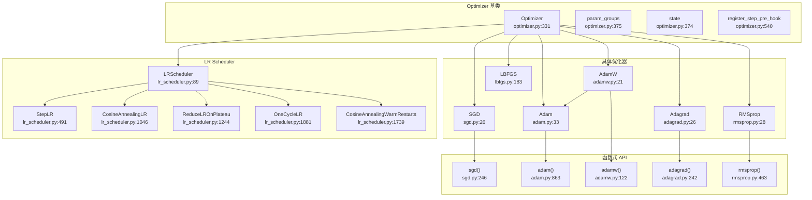

# 28. PyTorch Optimizer 与 LR Scheduler 优化器系统

## 目录

- [28.1 整体架构](#281-整体架构)
- [28.2 Optimizer 基类](#282-optimizer-基类)
- [28.3 SGD 优化器](#283-sgd-优化器)
- [28.4 Adam / AdamW 优化器](#284-adam--adamw-优化器)
- [28.5 Adagrad / RMSprop 优化器](#285-adagrad--rmsprop-优化器)
- [28.6 LBFGS 优化器](#286-lbfgs-优化器)
- [28.7 函数式优化器 API](#287-函数式优化器-api)
- [28.8 LR Scheduler 基类](#288-lr-scheduler-基类)
- [28.9 常用 Scheduler](#289-常用-scheduler)
- [28.10 自适应 Scheduler](#2810-自适应-scheduler)
- [28.11 设计权衡](#2811-设计权衡)
- [28.12 关键文件索引](#2812-关键文件索引)

---

## 28.1 整体架构

PyTorch 优化器系统由 `Optimizer` 基类、多种具体优化器实现、函数式 API 和 LR Scheduler 组成。



---

## 28.2 Optimizer 基类

### 核心数据结构

```python
# torch/optim/optimizer.py:331
class Optimizer:
    def __init__(self, params, defaults):  # 行 356
        self.defaults = defaults                          # 行 358: 默认超参数
        self.state: DefaultDict[Tensor, Any] = {}         # 行 374: 参数状态
        self.param_groups: List[Dict] = []                # 行 375: 参数组
        self._optimizer_step_pre_hooks: Dict[int, Callable] = {}   # 行 359
        self._optimizer_step_post_hooks: Dict[int, Callable] = {}  # 行 360
```

### 核心方法

| 方法 | 行号 | 说明 |
|------|------|------|
| `zero_grad` | 947 | 清零所有参数的梯度 |
| `step` | 1001/1005/1009 | 执行一次参数更新（子类必须覆盖） |
| `add_param_group` | 1019 | 添加新的参数组 |
| `state_dict` | 651 | 序列化优化器状态 |
| `load_state_dict` | 848 | 反序列化优化器状态 |

### Hook 系统

| 方法 | 行号 | 说明 |
|------|------|------|
| `register_step_pre_hook` | 540 | 注册 step 前置 Hook |
| `register_step_post_hook` | 563 | 注册 step 后置 Hook |
| `register_state_dict_pre_hook` | 584 | 注册 state_dict 前置 Hook |
| `register_state_dict_post_hook` | 616 | 注册 state_dict 后置 Hook |
| `register_load_state_dict_pre_hook` | 774 | 注册 load_state_dict 前置 Hook |
| `register_load_state_dict_post_hook` | 813 | 注册 load_state_dict 后置 Hook |

### 全局 Hook

```python
# torch/optim/optimizer.py
_global_optimizer_pre_hooks: Dict[int, Callable] = {}   # 行 59
_global_optimizer_post_hooks: Dict[int, Callable] = {}  # 行 60

def register_optimizer_step_pre_hook(hook):  # 行 283
    """注册全局 step 前置 Hook（影响所有优化器实例）"""

def register_optimizer_step_post_hook(hook):  # 行 303
    """注册全局 step 后置 Hook"""
```

### profile_hook_step

```python
# torch/optim/optimizer.py:479
@staticmethod
def profile_hook_step(func):
    """包装 step 函数，确保所有 Hook 都被正确执行
    执行顺序: 全局 pre-hook → 实例 pre-hook → step → 实例 post-hook → 全局 post-hook
    """
```

### CUDA Graph 检查

```python
# torch/optim/optimizer.py:427
def _cuda_graph_capture_health_check(self):
    """检查 CUDA Graph 捕获期间优化器状态是否安全"""
```

### param_groups 结构

```python
param_groups = [
    {
        'params': [tensor1, tensor2],  # 参数列表
        'lr': 0.01,                    # 该组学习率
        'momentum': 0.9,               # 该组动量
        ...                            # 其他超参数（来自 defaults）
    },
    {
        'params': [tensor3],
        'lr': 0.001,                   # 不同学习率
        ...
    }
]
```

---

## 28.3 SGD 优化器

```python
# torch/optim/sgd.py:26
class SGD(Optimizer):
    def __init__(self, params, lr=..., momentum=0, dampening=0,
                 weight_decay=0, nesterov=False):  # 行 27

    def _init_group(self, group, params_with_grad, ...):  # 行 82

    def step(self, closure=None):  # 行 104
        # 分发策略:
        # 1. _fused_sgd (行 464) — CUDA 融合内核
        # 2. _multi_tensor_sgd (行 371) — 多张量内核
        # 3. _single_tensor_sgd (行 316) — 单张量内核
```

### SGD 多级实现

| 实现 | 行号 | 说明 |
|------|------|------|
| `_single_tensor_sgd` | 316 | 逐参数循环，最通用 |
| `_multi_tensor_sgd` | 371 | 批量参数处理，减少 kernel launch |
| `_fused_sgd` | 464 | CUDA 融合内核，最高性能 |
| `sgd()` 函数式 | 246 | 无状态函数式接口 |

### SGD 更新公式

```
标准:       w = w - lr * grad
动量:       buf = momentum * buf + grad
            w = w - lr * buf
Nesterov:   buf = momentum * buf + grad
            w = w - lr * (grad + momentum * buf)
Weight Decay: grad = grad + weight_decay * w
```

---

## 28.4 Adam / AdamW 优化器

### Adam

```python
# torch/optim/adam.py:33
class Adam(Optimizer):
    def __init__(self, params, lr=1e-3, betas=(0.9, 0.999), eps=1e-8,
                 weight_decay=0, amsgrad=False, *, maximize=False,
                 foreach=None, capturable=False, differentiable=False,
                 fused=None):  # 行 34

    def _init_group(self, group, ...):  # 行 137

    def step(self, closure=None):  # 行 213
        # 分发: _fused_adam → _multi_tensor_adam → _single_tensor_adam
```

### Adam 多级实现

| 实现 | 行号 | 说明 |
|------|------|------|
| `_single_tensor_adam` | 341 | 逐参数循环 |
| `_multi_tensor_adam` | 531 | 批量参数处理 |
| `_fused_adam` | 763 | CUDA 融合内核 |
| `adam()` 函数式 | 863 | 无状态函数式接口 |

### AdamW

```python
# torch/optim/adamw.py:21
class AdamW(Adam):
    """AdamW: 解耦权重衰减的 Adam
    与 Adam 的区别：weight decay 在更新步骤中直接应用，而非加到梯度上"""

    def __init__(self, params, lr=1e-3, betas=(0.9, 0.999), eps=1e-8,
                 weight_decay=1e-2, ...):  # 行 22

# AdamW 继承 Adam.step (adam.py:213)
```

| 实现 | 行号 | 说明 |
|------|------|------|
| `adamw()` 函数式 | 122 | 无状态函数式接口 |

### Adam 更新公式

```
m = β₁ * m + (1 - β₁) * grad          # 一阶矩
v = β₂ * v + (1 - β₂) * grad²         # 二阶矩
m̂ = m / (1 - β₁ᵗ)                      # 偏差修正
v̂ = v / (1 - β₂ᵗ)                      # 偏差修正
w = w - lr * m̂ / (√v̂ + ε)

AdamW 权重衰减:
w = w - lr * weight_decay * w           # 解耦，直接对 w 操作

Adam 权重衰减:
grad = grad + weight_decay * w          # 耦合，加到梯度上
```

---

## 28.5 Adagrad / RMSprop 优化器

### Adagrad

```python
# torch/optim/adagrad.py:26
class Adagrad(Optimizer):
    def __init__(self, params, lr=0.01, lr_decay=0, weight_decay=0,
                 initial_accumulator_value=0, eps=1e-10, ...):  # 行 27

    def _init_group(self, group, ...):  # 行 124

    def step(self, closure=None):  # 行 146
```

| 实现 | 行号 | 说明 |
|------|------|------|
| `_single_tensor_adagrad` | 321 | 逐参数循环 |
| `_multi_tensor_adagrad` | 382 | 批量参数处理 |
| `_fused_adagrad` | 489 | CUDA 融合内核 |
| `adagrad()` 函数式 | 242 | 无状态函数式接口 |

### RMSprop

```python
# torch/optim/rmsprop.py:28
class RMSprop(Optimizer):
    def __init__(self, params, lr=0.01, alpha=0.99, eps=1e-8,
                 weight_decay=0, momentum=0, centered=False, ...):  # 行 29

    def _init_group(self, group, ...):  # 行 91

    def step(self, closure=None):  # 行 143
```

| 实现 | 行号 | 说明 |
|------|------|------|
| `_single_tensor_rmsprop` | 263 | 逐参数循环 |
| `_multi_tensor_rmsprop` | 334 | 批量参数处理 |
| `rmsprop()` 函数式 | 463 | 无状态函数式接口 |

> RMSprop 无融合内核实现。

### 更新公式

```
Adagrad:
  state_sum += grad²
  w = w - lr * grad / (√state_sum + ε)

RMSprop:
  v = α * v + (1 - α) * grad²
  w = w - lr * grad / (√v + ε)

Centered RMSprop:
  mg = α * mg + (1 - α) * grad
  v = α * v + (1 - α) * grad²
  w = w - lr * grad / (√(v - mg²) + ε)
```

---

## 28.6 LBFGS 优化器

```python
# torch/optim/lbfgs.py:183
class LBFGS(Optimizer):
    def __init__(self, params, lr=1, max_iter=20, max_eval=None,
                 tolerance_grad=1e-7, tolerance_change=1e-9,
                 history_size=100, line_search_fn=None):  # 行 217

    def step(self, closure):  # 行 302
        # LBFGS 需要闭包函数（重新计算损失）
        # 使用拟牛顿法近似 Hessian 逆
```

### 线搜索

```python
# torch/optim/lbfgs.py
def _cubic_interpolate(x1, f1, g1, x2, f2, g2):  # 行 13
    """三次插值"""

def _strong_wolfe(obj_func, x, t, d, f, g, ...):  # 行 41
    """Strong Wolfe 线搜索条件"""
```

---

## 28.7 函数式优化器 API

函数式 API 提供无状态的优化器步骤，适用于编译和自定义训练循环。

```python
# torch/optim/_functional.py
from .adagrad import adagrad    # 行 9
from .adam import adam          # 行 10
from .adamw import adamw        # 行 12
from .rmsprop import rmsprop    # 行 16
from .sgd import sgd            # 行 18

# sparse_adam 直接定义在此文件
# 行 24: sparse_adam 函数
```

### 函数式 API 签名

```python
# torch/optim/sgd.py:246
def sgd(params, d_p_list, momentum_buffer_list, *,
        weight_decay, momentum, lr, dampening, nesterov, maximize, foreach, ...)

# torch/optim/adam.py:863
def adam(params, grads, exp_avgs, exp_avg_sqs, max_exp_avg_sqs,
         state_steps, *, amsgrad, beta1, beta2, lr, weight_decay, eps, ...)

# torch/optim/adamw.py:122
def adamw(params, grads, exp_avgs, exp_avg_sqs, max_exp_avg_sqs,
          state_steps, *, amsgrad, beta1, beta2, lr, weight_decay, eps, ...)

# torch/optim/adagrad.py:242
def adagrad(params, grads, state_sums, state_steps, *, lr, weight_decay, lr_decay, eps, ...)

# torch/optim/rmsprop.py:463
def rmsprop(params, grads, square_avgs, grad_avgs, momentum_buffer_list, *,
            weight_decay, lr, momentum, alpha, eps, centered, ...)

# torch/optim/_functional.py:24
def sparse_adam(params, grads, exp_avgs, exp_avg_sqs, state_steps, *, beta1, beta2, eps, ...)
```

### 优化器分发策略

```
step() 被调用
  → 检查 fused (CUDA) 可用性
    → 可用: _fused_xxx()     # 单次 CUDA kernel
  → 检查 foreach (多张量) 可用性
    → 可用: _multi_tensor_xxx()  # 批量处理，减少 launch
  → 默认: _single_tensor_xxx()   # 逐参数循环
```

---

## 28.8 LR Scheduler 基类

```python
# torch/optim/lr_scheduler.py:89
class LRScheduler:
    def __init__(self, optimizer, last_epoch=-1, verbose="deprecated"):  # 行 94
        self.optimizer = optimizer
        self.last_epoch = last_epoch
        self.base_lrs = [group['lr'] for group in optimizer.param_groups]
        self.step()  # 初始化时执行一次 step

    def step(self, epoch=None):  # 行 211
        """更新学习率"""

    def get_lr(self):  # 行 179
        """子类覆盖，返回新的学习率列表"""

    def get_last_lr(self):  # 行 175
        """返回最后一次更新的学习率"""

    def state_dict(self):  # 行 156
        """序列化 scheduler 状态"""

    def load_state_dict(self, state_dict):  # 行 166
        """反序列化 scheduler 状态"""
```

### 向后兼容

```python
# torch/optim/lr_scheduler.py:273
class _LRScheduler(LRScheduler):
    """向后兼容别名"""
```

---

## 28.9 常用 Scheduler

### StepLR

```python
# torch/optim/lr_scheduler.py:491
class StepLR(LRScheduler):
    def __init__(self, optimizer, step_size, gamma=0.1, last_epoch=-1):  # 行 524

    def get_lr(self):  # 行 536
        # 每 step_size 个 epoch，lr *= gamma
```

### MultiStepLR

```python
# torch/optim/lr_scheduler.py:551
class MultiStepLR(LRScheduler):
    def __init__(self, optimizer, milestones, gamma=0.1, last_epoch=-1):  # 行 583

    def get_lr(self):  # 行 595
        # 在指定 milestones epoch，lr *= gamma
```

### ExponentialLR

```python
# torch/optim/lr_scheduler.py:790
class ExponentialLR(LRScheduler):
    def __init__(self, optimizer, gamma, last_epoch=-1):  # 行 807

    def get_lr(self):  # 行 817
        # 每个 epoch: lr *= gamma
```

### LambdaLR

```python
# torch/optim/lr_scheduler.py:289
class LambdaLR(LRScheduler):
    def __init__(self, optimizer, lr_lambda, last_epoch=-1):  # 行 320

    def get_lr(self):  # 行 382
        # lr = base_lr * lr_lambda(epoch)
```

### CosineAnnealingLR

```python
# torch/optim/lr_scheduler.py:1046
class CosineAnnealingLR(LRScheduler):
    def __init__(self, optimizer, T_max, eta_min=0, last_epoch=-1):  # 行 1091

    def get_lr(self):  # 行 1103
        # lr = eta_min + (base_lr - eta_min) * (1 + cos(π * epoch / T_max)) / 2
```

---

## 28.10 自适应 Scheduler

### ReduceLROnPlateau

```python
# torch/optim/lr_scheduler.py:1244
class ReduceLROnPlateau:
    """不继承 LRScheduler！根据指标自适应调整学习率"""

    def __init__(self, optimizer, mode='min', factor=0.1, patience=10,
                 threshold=1e-4, threshold_mode='rel', cooldown=0,
                 min_lr=0, eps=1e-8, verbose="deprecated"):  # 行 1305

    def step(self, metrics, epoch=None):  # 行 1363
        # 当指标停止改善时降低学习率
        # patience: 容忍多少个 epoch 无改善
        # factor: lr *= factor
```

### CyclicLR

```python
# torch/optim/lr_scheduler.py:1458
class CyclicLR(LRScheduler):
    def __init__(self, optimizer, base_lr, max_lr, step_size_up=2000,
                 step_size_down=None, mode='triangular', ...):  # 行 1557

    def get_lr(self):  # 行 1669
        # 在 base_lr 和 max_lr 之间循环
        # 模式: triangular / triangular2 / exp_range
```

### CosineAnnealingWarmRestarts

```python
# torch/optim/lr_scheduler.py:1739
class CosineAnnealingWarmRestarts(LRScheduler):
    def __init__(self, optimizer, T_0, T_mult=1, eta_min=0,
                 last_epoch=-1, verbose="deprecated"):  # 行 1773

    def get_lr(self):  # 行 1797
        # 余弦退火 + 热重启

    def step(self, epoch=None):  # 行 1809
        # 覆盖基类 step，支持批次级调用
```

### OneCycleLR

```python
# torch/optim/lr_scheduler.py:1881
class OneCycleLR(LRScheduler):
    def __init__(self, optimizer, max_lr, total_steps=None, epochs=None,
                 steps_per_epoch=None, pct_start=0.3, anneal_strategy='cos',
                 cycle_momentum=True, base_momentum=0.85,
                 max_momentum=0.95, div_factor=25, ...):  # 行 1988

    def get_lr(self):  # 行 2145
        # 单周期策略：warmup → 退火
        # 同时调整学习率和动量
```

---

## 28.11 设计权衡

| 权衡点 | 选择 | 原因 |
|--------|------|------|
| 单张量 vs 多张量 vs 融合 | 三级实现 | 性能递增，但兼容性递减；自动选择最佳可用实现 |
| 函数式 vs 面向对象 | 两者并存 | 函数式支持编译和自定义循环，面向对象更易用 |
| Adam vs AdamW | 两者并存 | AdamW 解耦权重衰减，理论上更优；Adam 兼容历史代码 |
| Scheduler 作为独立类 | 独立于 Optimizer | 解耦学习率策略与优化算法，但需手动调用 `scheduler.step()` |
| ReduceLROnPlateau 不继承 LRScheduler | 独立实现 | 需要传入 metrics 参数，接口与 epoch-based scheduler 不兼容 |
| state 存储在 Optimizer 上 | Dict[Tensor, Any] | 参数级别状态存储，支持参数组独立管理，但内存开销大 |
| foreach 默认值 | 自动检测 | 优先使用多张量实现，回退到单张量 |

---

## 28.12 关键文件索引

| 文件 | 核心内容 |
|------|----------|
| `torch/optim/optimizer.py` | Optimizer 基类、Hook 系统、state_dict |
| `torch/optim/sgd.py` | SGD 优化器 + 函数式 sgd() |
| `torch/optim/adam.py` | Adam 优化器 + 函数式 adam() |
| `torch/optim/adamw.py` | AdamW 优化器 + 函数式 adamw() |
| `torch/optim/adagrad.py` | Adagrad 优化器 + 函数式 adagrad() |
| `torch/optim/rmsprop.py` | RMSprop 优化器 + 函数式 rmsprop() |
| `torch/optim/lbfgs.py` | LBFGS 优化器 + 线搜索 |
| `torch/optim/_functional.py` | 函数式 API 统一导出 |
| `torch/optim/lr_scheduler.py` | LRScheduler 基类 + 全部 Scheduler 实现 |
