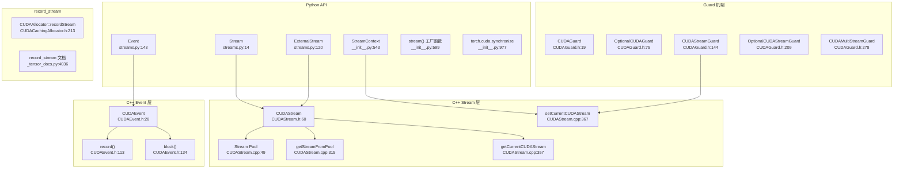
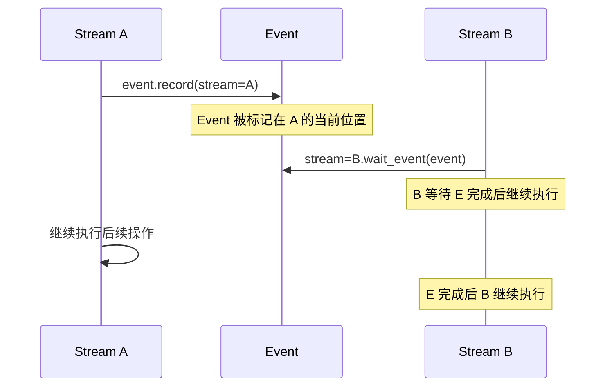

# 29. PyTorch CUDA Stream 与 Event 异步执行系统

## 目录

- [29.1 整体架构](#291-整体架构)
- [29.2 Stream 流](#292-stream-流)
- [29.3 Event 事件](#293-event-事件)
- [29.4 C++ CUDAStream 与流池](#294-c-cudastream-与流池)
- [29.5 C++ CUDAEvent](#295-c-cudaevent)
- [29.6 Stream Guard 守卫](#296-stream-guard-守卫)
- [29.7 Stream 上下文管理](#297-stream-上下文管理)
- [29.8 record_stream 张量-流关联](#298-record_stream-张量-流关联)
- [29.9 CUDA Graph 与 Stream](#299-cuda-graph-与-stream)
- [29.10 设计权衡](#2910-设计权衡)
- [29.11 关键文件索引](#2911-关键文件索引)

---

## 29.1 整体架构

CUDA Stream 和 Event 是 PyTorch GPU 异步执行的基石。Stream 是 GPU 操作的执行队列，Event 是流间同步的轻量级信号量。



---

## 29.2 Stream 流

### Python Stream 类

```python
# torch/cuda/streams.py:14
class Stream:
    def __new__(cls, device=None, priority=0, **kwargs):  # 行 34
        # 创建 CUDAStream 并包装

    def wait_event(self, event):  # 行 42
        """等待指定 Event 完成后再执行本流后续操作"""

    def wait_stream(self, stream):  # 行 59
        """等待指定 Stream 的所有操作完成"""

    def record_event(self, event=None):  # 行 73
        """在当前流位置记录一个 Event，返回该 Event"""

    def query(self):  # 行 88
        """查询流是否完成所有操作"""

    def synchronize(self):  # 行 96
        """阻塞直到流中所有操作完成"""

    @property
    def _as_parameter_(self):  # 行 104-106
        """返回 ctypes 兼容的 cudaStream_t 指针"""
```

### ExternalStream

```python
# torch/cuda/streams.py:120
class ExternalStream(Stream):
    """包装外部创建的 CUDA Stream（如 cuBLAS/cuDNN 内部流）"""

    def __new__(cls, stream_ptr, device=None, **kwargs):  # 行 138
        # 从 cudaStream_t 指针创建，不拥有所有权
```

### Stream 属性

| 属性 | 说明 |
|------|------|
| `stream_ptr` | 底层 cudaStream_t 指针值 |
| `device` | 所属 CUDA 设备 |
| `priority` | 流优先级（0=默认，负数=高优先级） |

---

## 29.3 Event 事件

### Python Event 类

```python
# torch/cuda/streams.py:143
class Event:
    def __new__(cls, enable_timing=False, blocking=False,
                interprocess=False, disable_timing=True):  # 行 166

    @staticmethod
    def from_ipc_handle(device, handle):  # 行 174
        """从 IPC 句柄创建跨进程 Event"""

    def record(self, stream=None):  # 行 179
        """在指定流上记录 Event"""

    def wait(self, stream=None):  # 行 189
        """使指定流等待此 Event"""

    def query(self):  # 行 201
        """查询 Event 是否已被记录且完成"""

    def elapsed_time(self, end_event):  # 行 210
        """计算两个 Event 之间的耗时（毫秒）"""

    def synchronize(self):  # 行 218
        """阻塞 CPU 直到 Event 完成"""

    @property
    def ipc_handle(self):  # 行 229
        """获取 IPC 句柄（用于跨进程同步）"""

    @property
    def _as_parameter_(self):  # 行 236-238
        """返回 ctypes 兼容的 cudaEvent_t 指针"""
```

### Event 创建标志

| 标志 | 默认 | 说明 |
|------|------|------|
| `enable_timing` | False | 启用计时（`elapsed_time` 需要此标志） |
| `blocking` | False | `synchronize` 将阻塞 CPU 线程 |
| `interprocess` | False | 允许跨进程共享（需 IPC 句柄） |
| `disable_timing` | True | 禁用计时（减少开销） |

### Stream-Event 协作模式



---

## 29.4 C++ CUDAStream 与流池

### CUDAStream 类

```cpp
// c10/cuda/CUDAStream.h:60
class CUDAStream {
    // 构造函数
    CUDAStream(Stream);                              // 行 66: 检查构造
    CUDAStream(Unchecked, Stream);                   // 行 73: 非检查构造

    // 类型转换
    operator cudaStream_t() const;                   // 行 84: 隐式转换

    // 属性
    DeviceIndex device_index() const;                // 行 100
    Device device() const;                           // 行 106
    int64_t id() const;                              // 行 111
    int priority() const;                            // 行 136

    // 操作
    bool query() const;                              // 行 115
    void synchronize() const;                        // 行 131

    // 显式转换
    cudaStream_t stream() const;                     // 行 144
    Stream unwrap() const;                           // 行 147

    // 序列化
    std::tuple<int64_t, int64_t, int64_t> pack3() const;  // 行 160
    static CUDAStream unpack3(int64_t, int64_t, int64_t);  // 行 165

    // 优先级范围
    static std::tuple<int, int> priority_range();    // 行 172

    // 流池
    static CUDAStream getStreamFromPool(bool, DeviceIndex);  // 行 212
    static CUDAStream getStreamFromPool(int, DeviceIndex);    // 行 215
    static CUDAStream getStreamFromExternal(...);             // 行 225
    static CUDAStream getDefaultCUDAStream(DeviceIndex);      // 行 234
    static CUDAStream getCurrentCUDAStream(DeviceIndex);      // 行 243
    static void setCurrentCUDAStream(CUDAStream);             // 行 255
};
```

### Stream Pool 实现

```cpp
// c10/cuda/CUDAStream.cpp

// 行 20-21: 流池常量
constexpr int kStreamsPerPoolBits = 3;
constexpr int kStreamsPerPool = 1 << kStreamsPerPoolBits;  // 8

// 行 22: 默认标志
constexpr unsigned int kDefaultFlags = cudaStreamNonBlocking;

// 行 49-54: 流池存储
// streams[pool_type][device_index][stream_index]
// pool_type: DEFAULT(0), HIGH_PRIORITY(1)

// 行 98: StreamIdType 枚举
// DEFAULT, EXT (external), priority variants

// 行 169: 线程局部当前流
// thread_local current_streams[MaxDevices]
```

### 流池分配

```cpp
// c10/cuda/CUDAStream.cpp:315
CUDAStream getStreamFromPool(int priority, DeviceIndex device) {
    // 按优先级选择池
    // Round-robin 分配: get_idx()
    // 返回池中的 CUDAStream
}

// c10/cuda/CUDAStream.cpp:334
CUDAStream getStreamFromPool(bool isHighPriority, DeviceIndex device) {
    // isHighPriority=true → 高优先级池
    // isHighPriority=false → 默认池
}

// c10/cuda/CUDAStream.cpp:340
CUDAStream getStreamFromExternal(cudaStream_t, DeviceIndex) {
    // 包装外部流，不拥有所有权
}
```

### 流 ID 编码

```
Stream ID 编码方案 (CUDAStream.cpp:140-159):
  正数 → 池内流 (pool=DEFAULT/HIGH_PRIORITY, index=0..7)
  -1   → 外部流
  负数 → 特殊用途流

  编码: makeStreamId(type, pool, index)
  解码: streamIdType() 解析 ID 类型
```

---

## 29.5 C++ CUDAEvent

```cpp
// aten/src/ATen/cuda/CUDAEvent.h:28
struct CUDAEvent {
    CUDAEvent();                                     // 行 31: 默认构造
    CUDAEvent(unsigned int flags);                   // 行 32: 指定标志
    CUDAEvent(DeviceIndex, cudaIpcEventHandle_t*);   // 行 34: IPC 构造
    ~CUDAEvent();                                    // 行 44: cudaEventDestroy

    // 移动语义
    CUDAEvent(CUDAEvent&& other);                    // 行 60
    CUDAEvent& operator=(CUDAEvent&& other);         // 行 65

    // 类型转换
    operator cudaEvent_t() const;                    // 行 68

    // 属性
    Device device() const;                           // 行 75
    bool isCreated() const;                          // 行 83

    // 操作
    bool query() const;                              // 行 88
    void record();                                   // 行 106: 在当前流记录
    void recordOnce();                               // 行 108: 仅记录一次
    void record(const CUDAStream& stream);           // 行 113: 在指定流记录
    void block(const CUDAStream& stream);            // 行 134: 使流等待此 Event
    float elapsed_time(const CUDAEvent& end) const;  // 行 149: 两个 Event 间耗时
    void synchronize();                              // 行 163: CPU 阻塞等待
    cudaIpcEventHandle_t ipc_handle();               // 行 174: IPC 句柄

private:
    void createEvent();                              // 行 191
};
```

### CUDAEvent 与 Python Event 对应

| Python Event 方法 | C++ CUDAEvent 方法 |
|-------------------|-------------------|
| `event.record(stream)` | `CUDAEvent::record(CUDAStream)` |
| `event.wait(stream)` | `CUDAStream.wait(CUDAEvent)` / `CUDAEvent::block(CUDAStream)` |
| `event.query()` | `CUDAEvent::query()` |
| `event.elapsed_time(end)` | `CUDAEvent::elapsed_time(CUDAEvent)` |
| `event.synchronize()` | `CUDAEvent::synchronize()` |
| `event.ipc_handle` | `CUDAEvent::ipc_handle()` |

---

## 29.6 Stream Guard 守卫

Guard 类使用 RAII 模式自动管理流和设备的切换与恢复。

```cpp
// c10/cuda/CUDAGuard.h

struct CUDAGuard {              // 行 19: 仅设备守卫
    CUDAGuard(DeviceIndex device);
    ~CUDAGuard();  // 恢复原设备
};

struct OptionalCUDAGuard {       // 行 75: 可选设备守卫
    OptionalCUDAGuard(optional<DeviceIndex>);
};

struct CUDAStreamGuard {         // 行 144: 流+设备守卫
    CUDAStreamGuard(Stream stream);           // 行 151
    void reset_stream(Stream stream);         // 行 175
    Stream original_stream() const;           // 行 181
    Stream current_stream() const;            // 行 187
    ~CUDAStreamGuard();  // 恢复原流和设备
};

struct OptionalCUDAStreamGuard {  // 行 209: 可选流守卫
    OptionalCUDAStreamGuard(optional<Stream>);
};

struct CUDAMultiStreamGuard {     // 行 278: 多流守卫
    CUDAMultiStreamGuard(ArrayRef<Stream> streams);  // 行 279
};
```

### Guard 使用场景

```cpp
// 典型用法：临时切换流
{
    CUDAStreamGuard guard(side_stream);
    // 在 side_stream 上执行操作
    tensor.add_(1);  // 在 side_stream 上执行
}  // 离开作用域，自动恢复原流

// 多设备场景
{
    CUDAGuard device_guard(1);  // 切换到 GPU 1
    CUDAStreamGuard stream_guard(stream_on_gpu1);
    // 在 GPU 1 的指定流上操作
}
```

---

## 29.7 Stream 上下文管理

### StreamContext

```python
# torch/cuda/__init__.py:543
class StreamContext:
    def __init__(self, stream):  # 行 556
        self.stream = stream
        self.src_prev_stream = None

    def __enter__(self):  # 行 570
        self.src_prev_stream = torch.cuda.current_stream()
        torch.cuda.set_stream(self.stream)

    def __exit__(self, *args):  # 行 585
        torch.cuda.set_stream(self.src_prev_stream)
```

### stream() 工厂函数

```python
# torch/cuda/__init__.py:599
def stream(stream):
    """返回 StreamContext 上下文管理器
    用法: with torch.cuda.stream(s): ...
    """
    return StreamContext(stream)
```

### 流管理函数

| 函数 | 行号 | 说明 |
|------|------|------|
| `current_stream(device=None)` | 1003 | 获取当前流 |
| `default_stream(device=None)` | 1021 | 获取默认流 |
| `set_stream(stream)` | 627 | 设置当前流 |
| `_set_stream_by_id(stream_id, device_index, ...)` | 612 | 按 ID 设置流 |
| `get_stream_from_external(stream_ptr, device)` | 1039 | 从外部指针创建 Stream |
| `synchronize()` | 977 | 等待所有 GPU 操作完成 |

---

## 29.8 record_stream 张量-流关联

`record_stream` 告知 CUDA 缓存分配器：某张量正在特定流上使用，不要在其他流回收其内存。

### 工作机制

```
张量 A 在 Stream 0 上创建
  → A 的内存由 Stream 0 的缓存分配器管理

张量 A 被传递到 Stream 1 上使用
  → 调用 A.record_stream(stream1)
  → 分配器记录：A 的内存关联了 Stream 1

Stream 0 释放 A 的内存
  → 分配器检查：A 是否还在 Stream 1 上使用？
  → 如果 Stream 1 仍在使用，延迟回收
  → 等 Stream 1 完成后才回收
```

### C++ 接口

```cpp
// c10/cuda/CUDACachingAllocator.h:213
class CUDAAllocator {
    virtual void recordStream(const DataPtr&, CUDAStream) = 0;
};

// c10/cuda/CUDACachingAllocator.h:368
void recordStream(DataPtr& ptr, CUDAStream stream);
    // 委托给分配器的 recordStream
```

### Python 接口

```python
# torch/_tensor_docs.py:4036
# Tensor.record_stream(stream) 文档
# 确保张量内存在指定流上使用完毕前不被回收
```

### 常见陷阱

```python
# 错误：多流使用未调用 record_stream
s1 = torch.cuda.Stream()
s2 = torch.cuda.Stream()

with torch.cuda.stream(s1):
    x = torch.randn(1000, device='cuda')

with torch.cuda.stream(s2):
    y = x * 2  # x 可能在 s1 上被回收！

# 正确：调用 record_stream
with torch.cuda.stream(s1):
    x = torch.randn(1000, device='cuda')

with torch.cuda.stream(s2):
    x.record_stream(s2)  # 通知分配器 x 在 s2 上使用
    y = x * 2
```

---

## 29.9 CUDA Graph 与 Stream

CUDA Graph 在捕获期间需要专用流，重放时在捕获流上执行。

### CUDAGraph 类

```python
# torch/cuda/graphs.py:46
class CUDAGraph:
    def capture_begin(self, pool=None, capture_error_mode='thread-local'):  # 行 56
        """开始 CUDA Graph 捕获"""

    def capture_end(self):  # 行 75
        """结束 CUDA Graph 捕获"""

    def replay(self):  # 行 86
        """重放捕获的 CUDA Graph"""
```

### graph 上下文管理器

```python
# torch/cuda/graphs.py:117
class graph:
    default_capture_stream = None  # 行 147: 类变量

    def __init__(self, cuda_graph, ..., stream=None):  # 行 149
        self.stream = stream or self.default_capture_stream
        # 设置 capture_stream 和 stream_ctx

    def __enter__(self):  # 行 171
        # 1. 同步默认流
        # 2. 进入 StreamContext（切换到捕获流）
        # 3. 开始捕获

    def __exit__(self, *args):  # 行 185
        # 1. 结束捕获
        # 2. 退出 StreamContext
```

### make_graphed_callables

```python
# torch/cuda/graphs.py:191
def make_graphed_callables(callables, sample_inputs, ...):
    """创建图化的可调用对象
    为每个 callable 分配专用流
    行 317: 在 side stream 上预热
    """
```

### is_current_stream_capturing

```python
# torch/cuda/graphs.py:25
def is_current_stream_capturing():
    """检查当前流是否正在捕获 CUDA Graph"""
```

---

## 29.10 设计权衡

| 权衡点 | 选择 | 原因 |
|--------|------|------|
| Non-blocking 默认流 | `cudaStreamNonBlocking` | 避免与默认流隐式同步，提高并发度 |
| Round-robin 流池 | 8 流/池/设备 | 平衡并发性与资源开销，避免创建过多流 |
| 线程局部当前流 | `thread_local current_streams` | 不同线程可使用不同流，天然支持多线程并发 |
| Event 默认禁用计时 | `disable_timing=True` | 计时 Event 开销更大；仅在需要 `elapsed_time` 时启用 |
| Guard RAII 模式 | 异常安全的流/设备恢复 | 防止异常路径忘记恢复流状态 |
| record_stream 显式调用 | 用户负责 | 自动追踪成本太高；常见场景（DataLoader pin_memory）由框架自动处理 |
| ExternalStream 不拥有 | 无所有权 | 外部流的生命周期由创建者管理，避免 double-free |
| CUDA Graph 专用流 | 捕获期间切换流 | Graph 捕获要求流处于捕获模式，不能在默认流上操作 |

---

## 29.11 关键文件索引

| 文件 | 核心内容 |
|------|----------|
| `torch/cuda/streams.py` | Stream、Event、ExternalStream Python 类 |
| `torch/cuda/__init__.py` | stream()、current_stream、set_stream、synchronize |
| `torch/cuda/graphs.py` | CUDAGraph、graph 上下文管理器、make_graphed_callables |
| `c10/cuda/CUDAStream.h` | CUDAStream C++ 类声明 |
| `c10/cuda/CUDAStream.cpp` | CUDAStream 实现、流池、流 ID 编码 |
| `aten/src/ATen/cuda/CUDAEvent.h` | CUDAEvent C++ 类 |
| `c10/cuda/CUDAGuard.h` | CUDAGuard、CUDAStreamGuard、CUDAMultiStreamGuard |
| `c10/cuda/CUDACachingAllocator.h` | recordStream 分配器接口 |
| `torch/_tensor_docs.py` | record_stream 文档 |