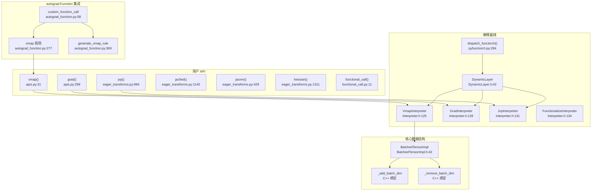
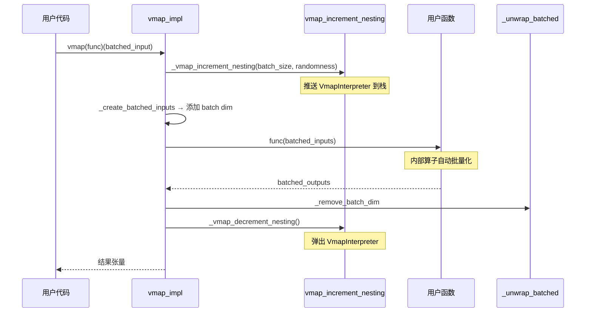

# 30. PyTorch torch.func 函数变换系统

## 目录

- [30.1 整体架构](#301-整体架构)
- [30.2 vmap 向量化映射](#302-vmap-向量化映射)
- [30.3 grad 梯度变换](#303-grad-梯度变换)
- [30.4 jvp 前向模式自动微分](#304-jvp-前向模式自动微分)
- [30.5 jacfwd / jacrev / hessian](#305-jacfwd--jacrev--hessian)
- [30.6 BatchedTensorImpl 批量张量](#306-batchedtensorimpl-批量张量)
- [30.7 解释器栈机制](#307-解释器栈机制)
- [30.8 autograd.Function 的 vmap 支持](#308-autogradfunction-的-vmap-支持)
- [30.9 functional_call 模块函数化](#309-functional_call-模块函数化)
- [30.10 设计权衡](#3010-设计权衡)
- [30.11 关键文件索引](#3011-关键文件索引)

---

## 30.1 整体架构

`torch.func`（原 functorch）提供函数变换：vmap（向量化）、grad（反向微分）、jvp（前向微分）等，可自由组合嵌套。核心机制是解释器栈（Interpreter Stack）和 BatchedTensor。



---

## 30.2 vmap 向量化映射

`vmap` 将函数映射到批处理输入，自动批量化而非显式循环。

### vmap API

```python
# torch/_functorch/apis.py:31
@exposed_in("torch.func")
def vmap(func, in_dims=0, out_dims=0, randomness='error', chunk_size=None):
    """向量化映射
    func: 逐元素函数
    in_dims: 指定哪些输入的哪个维度是批处理维度
    out_dims: 输出的批处理维度位置
    randomness: 'error' / 'different' / 'same'
    chunk_size: 分块处理大小
    """
```

### vmap 实现层次

| 函数 | 行号 | 说明 |
|------|------|------|
| `vmap()` | apis.py:31 | 公共 API，参数校验 |
| `vmap_impl()` | vmap.py:309 | 核心实现：处理批量输入，分发到 `_flat_vmap` 或 `_chunked_vmap` |
| `_flat_vmap()` | vmap.py:472 | 主执行路径：包装批量输入 → 调用函数 → 解包输出 |
| `_chunked_vmap()` | vmap.py:406 | 分块 vmap：按 chunk_size 分块执行，拼接结果 |
| `vmap_increment_nesting()` | vmap.py:464 | 管理嵌套层级，调用 C++ `_vmap_increment_nesting` |

### vmap 辅助函数

| 函数 | 行号 | 说明 |
|------|------|------|
| `_create_batched_inputs()` | vmap.py:154 | 通过 `_add_batch_dim` 为输入添加批量维度 |
| `_unwrap_batched()` | vmap.py:188 | 通过 `_remove_batch_dim` 移除批量维度 |
| `_validate_and_get_batch_size()` | vmap.py:54 | 校验输入批量大小一致性 |
| `_process_batched_inputs()` | vmap.py:92 | 处理和校验 in_dims 与参数 |
| `restore_vmap()` | vmap.py:503 | 在 autograd.Function vmap 规则中暂停/恢复 vmap |
| `doesnt_support_saved_tensors_hooks()` | vmap.py:39 | 装饰器：禁用 saved tensor hooks |

### vmap 嵌套执行流程



---

## 30.3 grad 梯度变换

`grad` 将函数转换为其梯度函数，使用反向模式自动微分。

### grad API

```python
# torch/_functorch/apis.py:299
@exposed_in("torch.func")
def grad(func, argnums=0, has_aux=False):
    """返回 func 的梯度函数
    argnums: 指定对哪些参数求梯度
    has_aux: func 是否返回 (output, aux) 元组
    """
```

### grad 实现

| 函数 | 行号 | 说明 |
|------|------|------|
| `grad_impl()` | eager_transforms.py:1405 | 调用 `grad_and_value_impl` 并丢弃值 |
| `grad_and_value_impl()` | eager_transforms.py:1354 | 核心实现：`grad_increment_nesting` → `torch.enable_grad()` → 包装/解包 |
| `grad_increment_nesting()` | eager_transforms.py:303 | 管理嵌套层级，调用 C++ `_grad_increment_nesting` |
| `_create_differentiable()` | eager_transforms.py:71 | 设置 `requires_grad` |
| `_undo_create_differentiable()` | eager_transforms.py:83 | 通过 `_unwrap_for_grad` 解包梯度张量 |

### grad 执行流程

```python
# grad_and_value_impl 核心逻辑 (eager_transforms.py:1354)
def grad_and_value_impl(func, argnums, has_aux, args, kwargs):
    # 1. grad_increment_nesting() — 推送 GradInterpreter
    # 2. _create_differentiable() — 对指定参数设置 requires_grad
    # 3. torch.enable_grad() — 启用梯度计算
    # 4. output = func(*args, **kwargs)
    # 5. grad = torch.autograd.grad(output, diff_args)
    # 6. _undo_create_differentiable() — 解包
    # 7. grad_decrement_nesting() — 弹出 GradInterpreter
```

---

## 30.4 jvp 前向模式自动微分

`jvp` 计算函数在给定切向量下的雅可比-向量积（前向模式 AD）。

### jvp API

```python
# torch/_functorch/eager_transforms.py:984
@exposed_in("torch.func")
def jvp(func, primals, tangents, *, strict=False, has_aux=False):
    """前向模式自动微分
    primals: 函数输入点
    tangents: 切向量（方向）
    返回: (func(primals), jvp(primals, tangents))
    """
```

### jvp 实现

| 函数 | 行号 | 说明 |
|------|------|------|
| `_jvp_with_argnums()` | eager_transforms.py:1047 | 核心实现：`jvp_increment_nesting` → `fwAD.make_dual` → 调用函数 → `fwAD.unpack_dual` |
| `jvp_increment_nesting()` | eager_transforms.py:325 | 管理嵌套层级，调用 C++ `_jvp_increment_nesting` |
| `enter_jvp_nesting()` / `exit_jvp_nesting()` | eager_transforms.py:311-321 | 手动嵌套管理 |
| `_wrap_tensor_for_grad()` | eager_transforms.py:107 | 通过 `_wrap_for_grad` 包装张量 |

### jvp 执行流程

```python
# _jvp_with_argnums 核心逻辑 (eager_transforms.py:1047)
def _jvp_with_argnums(func, primals, tangents, argnums, strict):
    # 1. jvp_increment_nesting() — 推送 JvpInterpreter
    # 2. fwAD.make_dual(primals, tangents) — 创建对偶数
    # 3. result = func(*duals)
    # 4. primals_out, tangents_out = fwAD.unpack_dual(result)
    # 5. jvp_decrement_nesting() — 弹出 JvpInterpreter
```

### 辅助函数

| 函数 | 行号 | 说明 |
|------|------|------|
| `_autograd_grad()` | eager_transforms.py:126 | 处理零依赖输出的 `torch.autograd.grad` 辅助 |

---

## 30.5 jacfwd / jacrev / hessian

### jacrev — 反向模式雅可比

```python
# torch/_functorch/eager_transforms.py:429
@exposed_in("torch.func")
def jacrev(func, argnums=0, has_aux=False, *, randomness='error'):
    """反向模式雅可比矩阵
    实现: 对每个输出元素调用 grad
    等价于 vmap(grad(func))
    """
```

### jacfwd — 前向模式雅可比

```python
# torch/_functorch/eager_transforms.py:1140
@exposed_in("torch.func")
def jacfwd(func, argnums=0, has_aux=False, *, randomness='error'):
    """前向模式雅可比矩阵
    实现: 对每个输入方向调用 jvp
    等价于 vmap(jvp(func, ...), in_dims=tangents)
    """
```

### safe_unflatten

```python
# torch/_functorch/eager_transforms.py:1132
def safe_unflatten(tensor, dim, size):
    """jacfwd 输出重塑辅助函数"""
```

### hessian — 海森矩阵

```python
# torch/_functorch/eager_transforms.py:1311
@exposed_in("torch.func")
def hessian(func, argnums=0):
    """海森矩阵 = jacfwd(jacrev(func))
    行 1350: return jacfwd(jacrev(func, argnums), argnums)
    """
```

### 雅可比计算方式对比

| 方法 | 实现 | 前向传播次数 | 反向传播次数 | 适合场景 |
|------|------|-------------|-------------|----------|
| `jacrev` | `vmap(grad(func))` | 1 | n_output | 输出维度 < 输入维度 |
| `jacfwd` | `vmap(jvp(func))` | n_input | 0 | 输入维度 < 输出维度 |
| `hessian` | `jacfwd(jacrev(func))` | n_input | n_output | 海森矩阵 |

---

## 30.6 BatchedTensorImpl 批量张量

`BatchedTensorImpl` 是 vmap 的核心数据结构，在张量上隐藏一个批量维度，使普通算子自动批量化。

### C++ BatchedTensorImpl

```cpp
// aten/src/ATen/functorch/BatchedTensorImpl.h:42
struct BatchedTensorImpl : public c10::TensorImpl {
    // 核心数据
    Tensor value_;           // 底层实际张量（包含 batch dim）
    int64_t bdim_;           // batch 维度位置
    int64_t level_;          // vmap 嵌套层级

    // 关键方法
    void refreshTensorMetadata();  // BatchedTensorImpl.cpp:40: 更新 sizes/strides（隐藏 batch dim）
    int64_t actualDim(int64_t) const;  // .cpp:70: 将公开维度映射到底层维度
};

// 行 21-25: 常量
constexpr int kVmapMaxTensorDims = 64;
constexpr int kVmapNumLevels = 64;
```

### 批量张量工具函数

| 函数 | 行号 | 说明 |
|------|------|------|
| `isBatchedTensor()` | BatchedTensorImpl.h:114 | 判断是否为 BatchedTensor |
| `unsafeGetBatchedImpl()` | h:121 | 获取 BatchedTensorImpl 指针 |
| `maybeGetBatchedImpl()` | h:125 | 安全获取（可能返回 nullptr） |
| `makeBatched()` | h:147 | 从普通 Tensor + bdim 创建 BatchedTensor |
| `addBatchDim()` | h:150 | 添加批量维度 |
| `createBatchDimBitset()` | h:133 | 创建批量维度位集 |
| `createVmapLevelsBitset()` | h:140 | 创建 vmap 层级位集 |

### BatchedTensor 维度映射

```
底层张量 (value_):  [B, C, H, W]  (4D)
batch dim (bdim_):  0
                     ↑
BatchedTensor 表现: [C, H, W]     (3D, 隐藏了 batch dim)

用户访问 dim=0 → actualDim(0) = 1 (映射到底层 dim 1)
用户访问 dim=1 → actualDim(1) = 2
用户访问 dim=2 → actualDim(2) = 3
```

### Python 侧绑定

```python
# torch/_functorch/vmap.py:20-24
from torch._C._functorch import (
    _add_batch_dim,      # 添加 batch dim → 创建 BatchedTensor
    _remove_batch_dim,   # 移除 batch dim → 还原普通 Tensor
    is_batchedtensor,    # 检查是否为 BatchedTensor
)
```

---

## 30.7 解释器栈机制

解释器栈是函数变换组合的核心：每个变换（vmap/grad/jvp）作为一层解释器推入栈，算子分发时从栈顶开始处理。

### C++ 解释器栈

```cpp
// aten/src/ATen/functorch/Interpreter.h:123
struct Interpreter {
    // 工厂方法
    static Interpreter Vmap(VmapInterpreterMeta);    // 行 125
    static Interpreter Grad(GradInterpreterMeta);    // 行 128
    static Interpreter Jvp(JvpInterpreterMeta);      // 行 131
    static Interpreter Functionalize(FunctionalizeInterpreterMeta);  // 行 134

    // 核心方法
    void process();              // 行 143: 处理当前操作
    void sendToNextInterpreter(); // 行 144: 传递给下一层
};

// 元数据结构
struct VmapInterpreterMeta { int batchSize; RandomnessType randomness; };  // 行 91
struct GradInterpreterMeta { bool prevGradMode; };                          // 行 98
struct JvpInterpreterMeta { bool prevFwdGradMode; };                        // 行 103
struct FunctionalizeInterpreterMeta { /* ... */ };                          // 行 108
```

### DynamicLayer

```cpp
// aten/src/ATen/functorch/DynamicLayer.h:42
struct DynamicLayer {
    // 包装 Interpreter，构成动态层栈
};

// 行 66: 推入层
void initAndPushDynamicLayer(Interpreter);

// 行 73: 弹出层
void popDynamicLayerAndDeleteMetadata();
```

### Python 解释器

```python
# torch/_functorch/pyfunctorch.py:54
class FuncTorchInterpreter:
    def process(self): ...    # 行 61: 抽象方法
    def lower(self): ...      # 行 67: 弹出当前解释器，传递到下一层

class VmapInterpreter(FuncTorchInterpreter):       # 行 119
class GradInterpreter(FuncTorchInterpreter):       # 行 157: 与 no_grad 交互
class JvpInterpreter(FuncTorchInterpreter):        # 行 191: 与 no_fwd_grad 交互
class FunctionalizeInterpreter(FuncTorchInterpreter):  # 行 225
```

### 解释器辅助

| 函数 | 行号 | 说明 |
|------|------|------|
| `coerce_cinterpreter()` | pyfunctorch.py:242 | CInterpreter → FuncTorchInterpreter 转换 |
| `retrieve_current_functorch_interpreter()` | pyfunctorch.py:255 | 获取当前解释器 |
| `retrieve_all_functorch_interpreters()` | pyfunctorch.py:261 | 获取完整解释器栈 |
| `dispatch_functorch()` | pyfunctorch.py:284 | PyDispatcher 的 functorch 分发入口 |
| `temporarily_pop_interpreter_stack()` | pyfunctorch.py:84 | 临时弹出解释器栈 |
| `temporarily_clear_interpreter_stack()` | pyfunctorch.py:93 | 临时清空解释器栈 |

### 嵌套变换执行

```
用户: vmap(grad(func))(x)

解释器栈（从底到顶）:
  [GradInterpreter] → [VmapInterpreter]

算子调用流程:
  op.dispatch()
  → VmapInterpreter.process(op)    # 处理批量维度
    → GradInterpreter.process(op)  # 处理梯度
      → 实际执行 op
```

---

## 30.8 autograd.Function 的 vmap 支持

自定义 `autograd.Function` 在 vmap 下需要特殊处理。用户可通过 `vmap` 静态方法或 `generate_vmap_rule` 提供规则。

### Function.vmap 声明

```python
# torch/autograd/function.py:524
class Function:
    generate_vmap_rule = False  # 是否自动生成 vmap 规则

    @staticmethod
    def vmap(info, in_dims, *args):  # 行 527
        """用户可覆盖，提供自定义 vmap 规则"""
        raise NotImplementedError
```

### custom_function_call 高阶算子

```python
# torch/_functorch/autograd_function.py:32
class CustomFunctionHigherOrderOperator:
    """处理 autograd.Function 在函数变换中的调度"""

# 行 58: custom_function_call HOP 定义

# 行 90: custom_function_call_grad() — grad/jvp 规则
#   动态创建 _SingleLevelFunction 子类

# 行 97: generate_single_level_function() — 动态生成单层 Function
```

### vmap 调度

| 函数 | 行号 | 说明 |
|------|------|------|
| `custom_function_call_vmap()` | 277 | vmap 分发：选择自动规则或用户规则 |
| `custom_function_call_vmap_helper()` | 320 | 调用用户的 `vmap` 静态方法 |
| `custom_function_call_vmap_generate_rule()` | 369 | 自动生成 vmap 规则（`generate_vmap_rule=True`） |
| `vmapify_autograd_function()` | 389 | 将 autograd.Function 包装为 vmap 兼容 |
| `has_overriden_vmap_rule()` | 261 | 检查用户是否定义了自定义 vmap 规则 |

### VmapInfo

```python
# torch/_functorch/autograd_function.py:256
VmapInfo = NamedTuple('VmapInfo', [
    ('batch_size', int),
    ('randomness', str),
])
# 传递给用户定义的 Function.vmap(info, in_dims, *args)
```

### 三种 vmap 策略

```
1. 用户定义 vmap 静态方法:
   class MyFunc(Function):
       @staticmethod
       def vmap(info, in_dims, *args): ...
   → custom_function_call_vmap_helper() 调用用户方法

2. generate_vmap_rule = True:
   → custom_function_call_vmap_generate_rule() 自动生成规则
   → 将 forward 中的每个操作逐一 vmap 化

3. 无规则（默认）:
   → 报错："vmap: encountered a custom Function without a vmap rule"
```

---

## 30.9 functional_call 模块函数化

`functional_call` 将有状态的 `nn.Module` 调用转换为纯函数调用，使 vmap/grad/jvp 可作用于模块。

```python
# torch/_functorch/functional_call.py:11
@exposed_in("torch.func")
def functional_call(module, parameter_and_buffer_dicts, args, kwargs=None):
    """用指定的参数和缓冲区执行模块前向传播
    不修改模块原始参数，适用于函数变换
    """

# torch/_functorch/functional_call.py:158
@exposed_in("torch.func")
def stack_module_state(modules):
    """堆叠多个模块的参数和缓冲区
    配合 vmap 实现集成（ensemble）推理
    """
```

### functional_call 使用示例

```python
# vmap 应用于模块
from torch.func import functional_call, vmap

model = nn.Linear(10, 5)
params = dict(model.named_parameters())
buffers = dict(model.named_buffers())

# 函数化调用
output = functional_call(model, (params, buffers), input)

# vmap 集成
params_stack = stack_module_state([model1, model2, model3])
output = vmap(lambda p: functional_call(model, (p, buffers), input))(params_stack)
```

---

## 30.10 设计权衡

| 权衡点 | 选择 | 原因 |
|--------|------|------|
| 解释器栈 vs 编译期变换 | 运行时解释器栈 | 支持 Python 灵活性（动态控制流），但性能不如编译期 |
| BatchedTensor 隐藏维度 | 隐藏 batch dim 而非显式传递 | 复用现有算子实现，但增加 `actualDim` 映射开销 |
| 嵌套层级限制 | kVmapNumLevels=64 | 用位集快速检测层级，64 位足够绝大多数场景 |
| chunked_vmap | 可选分块 | 避免大批量导致的 OOM，但增加拼接开销 |
| autograd.Function vmap 规则 | 用户可选提供 | 默认报错确保正确性；自动规则覆盖常见场景但不保证全部 |
| hessian = jacfwd(jacrev) | 前向+反向组合 | 比纯反向模式更高效（利用前向模式内层） |
| functional_call vs 修改模块 | 纯函数式 | 不修改模块状态，与函数变换兼容；但每次调用重建图 |
| Python 解释器 + C++ 解释器 | 双层实现 | C++ 处理热路径分发，Python 处理复杂逻辑 |

---

## 30.11 关键文件索引

| 文件 | 核心内容 |
|------|----------|
| `torch/func/__init__.py` | torch.func 公共 API 导出 |
| `torch/_functorch/apis.py` | vmap、grad 公共 API 定义 |
| `torch/_functorch/vmap.py` | vmap 实现（_flat_vmap、_chunked_vmap、辅助函数） |
| `torch/_functorch/eager_transforms.py` | grad、jvp、jacfwd、jacrev、hessian 实现 |
| `torch/_functorch/functional_call.py` | functional_call、stack_module_state |
| `torch/_functorch/pyfunctorch.py` | Python 解释器栈（FuncTorchInterpreter 及子类） |
| `torch/_functorch/autograd_function.py` | autograd.Function 的函数变换支持 |
| `aten/src/ATen/functorch/BatchedTensorImpl.h` | BatchedTensorImpl C++ 类 |
| `aten/src/ATen/functorch/BatchedTensorImpl.cpp` | BatchedTensorImpl 实现 |
| `aten/src/ATen/functorch/Interpreter.h` | Interpreter 结构体、元数据 |
| `aten/src/ATen/functorch/Interpreter.cpp` | 解释器分发实现 |
| `aten/src/ATen/functorch/DynamicLayer.h` | DynamicLayer 动态层栈 |
| `torch/autograd/function.py` | Function.vmap、generate_vmap_rule 声明 |