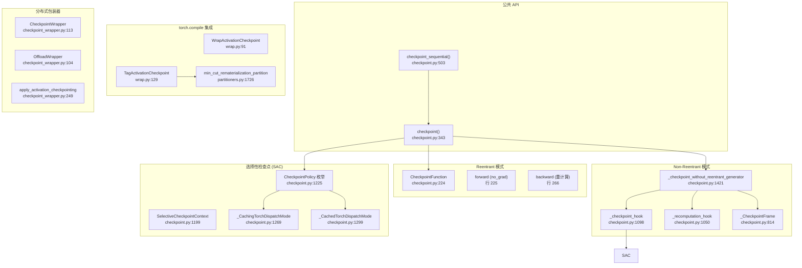
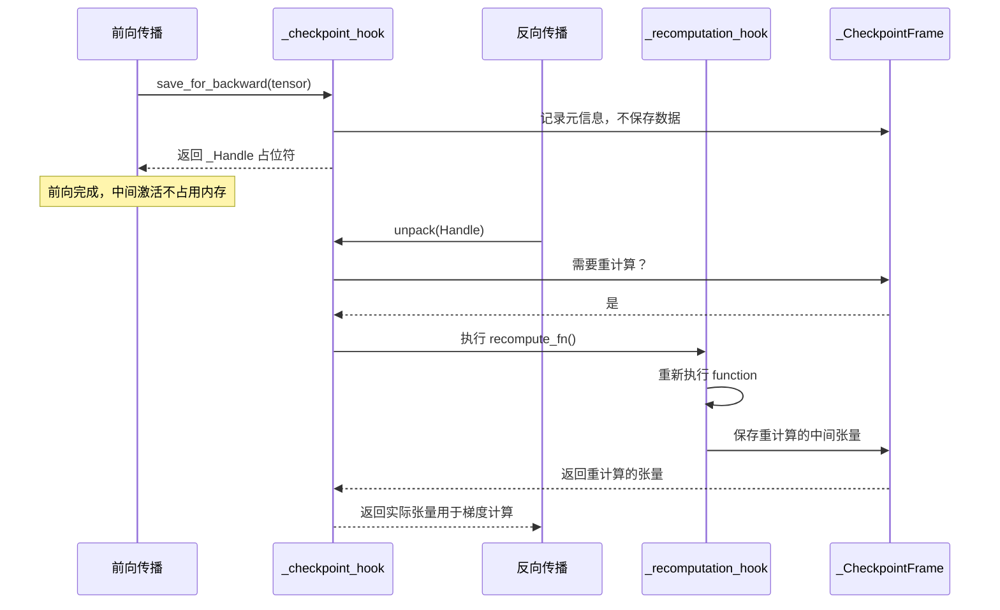

# 31. PyTorch 梯度检查点（Activation Checkpointing）

## 目录

- [31.1 整体架构](#311-整体架构)
- [31.2 checkpoint 公共 API](#312-checkpoint-公共-api)
- [31.3 Reentrant 模式（CheckpointFunction）](#313-reentrant-模式checkpointfunction)
- [31.4 Non-Reentrant 模式（_checkpoint_without_reentrant_generator）](#314-non-reentrant-模式_checkpoint_without_reentrant_generator)
- [31.5 saved_tensors_hooks 机制](#315-saved_tensors_hooks-机制)
- [31.6 选择性激活检查点（SAC）](#316-选择性激活检查点sac)
- [31.7 checkpoint_sequential](#317-checkpoint_sequential)
- [31.8 torch.compile 集成](#318-torchcompile-集成)
- [31.9 分布式检查点包装器](#319-分布式检查点包装器)
- [31.10 设计权衡](#3110-设计权衡)
- [31.11 关键文件索引](#3111-关键文件索引)

---

## 31.1 整体架构

梯度检查点通过在前向传播时不保存中间激活、反向传播时重新计算来换取内存节省。PyTorch 提供两种实现：Reentrant（基于 autograd.Function）和 Non-Reentrant（基于 saved_tensors_hooks）。



---

## 31.2 checkpoint 公共 API

```python
# torch/utils/checkpoint.py:343
def checkpoint(function, *args, use_reentrant=True, preserve_rng_state=True,
               context_fn=noop_context_fn, determinism_check="default",
               debug=False, mode=None, block=None):
    """梯度检查点主入口
    use_reentrant=True:  使用 CheckpointFunction（reentrant）
    use_reentrant=False: 使用 _checkpoint_without_reentrant_generator
    preserve_rng_state:  是否保存/恢复 RNG 状态
    context_fn:          自定义上下文管理器（如 autocast）
    determinism_check:   重计算结果一致性检查
    debug:               调试模式
    mode:                SAC 策略函数
    """
```

### 分发逻辑

```python
# checkpoint.py:488-500
if use_reentrant:
    # Reentrant 路径
    return CheckpointFunction.apply(function, preserve_rng_state, *args)
else:
    # Non-reentrant 路径
    return _checkpoint_without_reentrant_generator(
        function, preserve_rng_state, context_fn, determinism_check,
        debug, mode, block, *args)
```

### 辅助函数

| 函数 | 行号 | 说明 |
|------|------|------|
| `detach_variable` | 65 | 从输出中 detach 变量，保留 requires_grad |
| `check_backward_validity` | 84 | 检查是否有输出需要梯度 |
| `get_device_states` | 165 | 获取所有 CUDA 设备的 RNG 状态 |
| `set_device_states` | 185 | 恢复所有 CUDA 设备的 RNG 状态 |
| `noop_context_fn` | 329 | 默认空上下文函数 |
| `DefaultDeviceType` | 98 | 设备类型辅助类 |

---

## 31.3 Reentrant 模式（CheckpointFunction）

Reentrant 模式通过自定义 `autograd.Function` 实现，在 forward 中不保存中间结果，在 backward 中重新计算。

```python
# torch/utils/checkpoint.py:224
class CheckpointFunction(torch.autograd.Function):
    @staticmethod
    def forward(ctx, run_function, preserve_rng_state, *args):  # 行 225
        # 1. 保存 RNG 状态
        # 2. torch.no_grad() 下执行 run_function
        # 3. 保存输出（不保存中间激活）
        ctx.run_function = run_function
        ctx.preserve_rng_state = preserve_rng_state
        with torch.no_grad():
            outputs = run_function(*args)
        return outputs

    @staticmethod
    def backward(ctx, *output_grads):  # 行 266
        # 1. 恢复 RNG 状态
        # 2. detach 输入，启用梯度
        # 3. 重新执行 forward
        # 4. 调用 torch.autograd.backward(outputs, output_grads)
        # 5. 返回输入梯度
        with torch.enable_grad():
            # fork RNG 以避免影响全局状态
            outputs = ctx.run_function(*detached_inputs)
        torch.autograd.backward(outputs, output_grads)
        return (None, None) + input_grads
```

### Reentrant 模式问题

- 重入 autograd 引擎：backward 中调用 `torch.autograd.backward`，可能与其他 autograd 操作冲突
- RNG 状态管理：需要 fork RNG，否则随机操作结果不同
- 不支持自定义 saved tensor hooks

---

## 31.4 Non-Reentrant 模式（_checkpoint_without_reentrant_generator）

Non-Reentrant 模式使用 Python 生成器和 `saved_tensors_hooks` 避免 reentrant 问题。

```python
# torch/utils/checkpoint.py:1421
def _checkpoint_without_reentrant_generator(function, preserve_rng_state,
    context_fn, determinism_check, debug, mode, block, *args):

    # 创建 _CheckpointFrame 保存检查点状态
    frame = _CheckpointFrame(...)  # 行 1520

    # 保存输入张量
    _NoopSaveInputs.apply(frame, *args)  # 行 1522

    # 生成器：分两个阶段
    # 阶段 1: 前向传播
    with _checkpoint_hook(frame, ...):    # 行 1525: 拦截 saved tensors
        outputs = function(*args)
        yield outputs                      # 行 1536: 返回输出

    # 阶段 2: 在 backward 时由 _recomputation_hook 触发重计算
```

### recompute_fn 闭包

```python
# checkpoint.py:1499-1518
def recompute_fn():
    """重计算函数：在 backward 时调用"""
    # 1. 恢复 RNG 状态
    # 2. 恢复 autocast 上下文
    # 3. 重新执行 function
    # 4. 将结果填入 _CheckpointFrame
    with restore_rng(), restore_autocast():
        with _recomputation_hook(frame, ...):  # 拦截重计算中的 saved tensors
            function(*args)
```

### _CheckpointFrame

```python
# torch/utils/checkpoint.py:814
class _CheckpointFrame:
    """核心状态容器，保存前向/重计算阶段的中间张量"""

    def check_recomputed_tensors_match(self):  # 行 840
        """确定性检查：重计算结果是否与前向一致"""

    # 管理两阶段：
    # forward 阶段: 捕获 saved tensors 的引用
    # recompute 阶段: 实际执行重计算并填充
```

### 辅助类

| 类 | 行号 | 说明 |
|----|------|------|
| `_Handle` | 768 | 句柄封装 |
| `_Holder` | 772 | 持有者封装 |
| `_NoopSaveInputs` | 777 | autograd Function，保存输入张量 |
| `CheckpointError` | 969 | 检查点错误异常 |
| `_StopRecomputationError` | 1046 | 早期停止重计算异常 |

---

## 31.5 saved_tensors_hooks 机制

Non-Reentrant 模式的核心是利用 `saved_tensors_hooks` 拦截张量的保存和解包操作。

### _checkpoint_hook（前向阶段）

```python
# torch/utils/checkpoint.py:1098
class _checkpoint_hook:
    """前向阶段: 不实际保存张量，只记录元信息
    当 backward 解包时触发重计算"""

    def pack_hook(self, tensor):
        # 不保存实际数据，返回 _Handle 占位符
        return _Handle()

    def unpack_hook(self, handle):
        # 触发重计算，返回重计算后的张量
        if not frame.recomputed:
            recompute_fn()
        return frame.get_saved_tensor(handle)
```

### _recomputation_hook（重计算阶段）

```python
# torch/utils/checkpoint.py:1050
class _recomputation_hook:
    """重计算阶段: 保存重计算产生的中间张量
    这些张量将用于 backward"""

    def pack_hook(self, tensor):
        # 保存重计算产生的张量
        return tensor

    def unpack_hook(self, tensor):
        # 直接返回保存的张量
        return tensor
```

### 两种 Hook 的协作



---

## 31.6 选择性激活检查点（SAC）

SAC 允许细粒度控制哪些操作保存输出、哪些重计算，通过 `CheckpointPolicy` 策略函数实现。

### CheckpointPolicy 枚举

```python
# torch/utils/checkpoint.py:1225
class CheckpointPolicy(int):
    MUST_SAVE = 0          # 必须保存（不重计算）
    PREFER_SAVE = 1        # 倾向保存
    MUST_RECOMPUTE = 2     # 必须重计算
    PREFER_RECOMPUTE = 3   # 倾向重计算
```

### SelectiveCheckpointContext

```python
# torch/utils/checkpoint.py:1199
class SelectiveCheckpointContext:
    """传递给策略函数的上下文，提供操作信息"""
    # 包含: op 名称、输入输出信息等
```

### _CachingTorchDispatchMode（前向阶段）

```python
# torch/utils/checkpoint.py:1269
class _CachingTorchDispatchMode(TorchDispatchMode):
    """前向阶段: 根据 policy 决定是否缓存操作输出
    MUST_SAVE/PREFER_SAVE → 保存输出
    MUST_RECOMPUTE/PREFER_RECOMPUTE → 不保存"""
```

### _CachedTorchDispatchMode（重计算阶段）

```python
# torch/utils/checkpoint.py:1299
class _CachedTorchDispatchMode(TorchDispatchMode):
    """重计算阶段: 重放缓存的输出，避免重复计算已保存的操作"""
```

### create_selective_checkpoint_contexts

```python
# torch/utils/checkpoint.py:1333
def create_selective_checkpoint_contexts(policy_fn):
    """创建 SAC 的前向和重计算上下文对
    policy_fn: Callable[SelectiveCheckpointContext, CheckpointPolicy]
    """
```

### SAC 使用示例

```python
def my_policy(ctx):
    if "aten::mm" in ctx.op:  # 矩阵乘法重计算（计算密集）
        return CheckpointPolicy.MUST_RECOMPUTE
    if "aten::softmax" in ctx.op:  # softmax 保存（数值敏感）
        return CheckpointPolicy.MUST_SAVE
    return CheckpointPolicy.PREFER_RECOMPUTE

checkpoint(model, x, use_reentrant=False, mode=my_policy)
```

---

## 31.7 checkpoint_sequential

```python
# torch/utils/checkpoint.py:503
def checkpoint_sequential(functions, segments, input, **kwargs):
    """对顺序模型分段检查点
    functions: 顺序函数列表（如 nn.Sequential 的子模块）
    segments: 分段数量
    input: 输入张量

    行 570-576: 内部 run_function 辅助
    """
```

### 工作原理

```
functions = [f1, f2, f3, f4, f5, f6]
segments = 2

分段:
  段 1: [f1, f2, f3]  → checkpoint 包装
  段 2: [f4, f5, f6]  → checkpoint 包装

内存节省: 仅保存段间输出，段内中间激活重计算
```

---

## 31.8 torch.compile 集成

### WrapActivationCheckpoint HOP

```python
# torch/_higher_order_ops/wrap.py:91
class WrapActivationCheckpoint(HigherOrderOperator):
    """编译友好的检查点 HOP
    use_reentrant=False, preserve_rng_state=False"""
```

### TagActivationCheckpoint HOP

```python
# torch/_higher_order_ops/wrap.py:129
class TagActivationCheckpoint(HigherOrderOperator):
    """基于标签的检查点 HOP
    在 FX 图中标记节点，由分区器决定保存/重计算"""

    def divide_kwargs(self, kwargs):  # 行 152
        """分离检查点参数和函数参数"""

    def tag_nodes(self, gm):  # 行 188
        """为 FX 节点添加 ac_graph_id 和 recompute 元数据"""
```

### Min-Cut 分区器

```python
# torch/_functorch/partitioners.py

def must_recompute(node):  # 行 119
    """检查节点是否标记为 MUST_RECOMPUTE 或 PREFER_RECOMPUTE"""

def min_cut_rematerialization_partition(gm, *args):  # 行 1726
    """基于最小割的重物化分区
    根据 CheckpointPolicy 标签决定哪些节点重计算
    优化正向/反向图之间的激活传输"""

def default_partition(gm, *args):  # 行 390
    """默认分区策略"""
```

### Dynamo 处理

```python
# torch/_dynamo/variables/higher_order_ops.py:2054
class CheckpointHigherOrderVariable:
    """Dynamo 对 torch.utils.checkpoint.checkpoint 的处理
    提取 context_fn，调用 TagActivationCheckpoint.divide_kwargs
    创建包装子图"""
```

---

## 31.9 分布式检查点包装器

### CheckpointImpl 枚举

```python
# torch/distributed/algorithms/_checkpoint/checkpoint_wrapper.py:19
class CheckpointImpl(Enum):
    REENTRANT = 0       # 使用 CheckpointFunction
    NO_REENTRANT = 1    # 使用 non-reentrant 生成器
```

### CheckpointWrapper

```python
# torch/distributed/algorithms/_checkpoint/checkpoint_wrapper.py:113
class CheckpointWrapper(ActivationWrapper):
    """nn.Module 包装器，自动对子模块应用检查点"""

    def __init__(self, mod, checkpoint_impl=CheckpointImpl.NO_REENTRANT,
                 checkpoint_fn=None, ...):  # 行 113

    def forward(self, *args, **kwargs):  # 行 148
        return self.checkpoint_fn(self.mod, *args, **kwargs)
```

### OffloadWrapper

```python
# torch/distributed/algorithms/_checkpoint/checkpoint_wrapper.py:104
class OffloadWrapper(ActivationWrapper):
    """将激活 offload 到 CPU 以节省 GPU 内存
    使用 save_on_cpu 机制"""
```

### apply_activation_checkpointing

```python
# torch/distributed/algorithms/_checkpoint/checkpoint_wrapper.py:249
def apply_activation_checkpointing(model, checkpoint_wrapper_fn=None,
                                   check_fn=None, auto_wrap_policy=None):
    """递归地对模型应用检查点
    check_fn: 判断哪些模块需要检查点
    auto_wrap_policy: 自动包装策略
    """
```

### 可组合 API

```python
# torch/distributed/_composable/checkpoint_activation.py:37
def checkpoint(module, **kwargs):
    """可组合的检查点 API（基于 forward hook）
    行 87-109: forward_pre_hook 启动检查点
    行 111-126: forward_hook 完成生成器
    """
```

---

## 31.10 设计权衡

| 权衡点 | 选择 | 原因 |
|--------|------|------|
| Reentrant vs Non-Reentrant | 默认迁移至 Non-Reentrant | Non-Reentrant 不重入 autograd 引擎，更安全；Reentrant 存在潜在死锁和 Hook 冲突 |
| RNG 状态保存 | 默认保存 | 随机操作（Dropout）需要确定性，但保存/恢复 RNG 有性能开销 |
| saved_tensors_hooks vs autograd.Function | Non-Reentrant 用 hooks | hooks 不重入引擎，与 autograd 更兼容；但需要生成器管理两阶段 |
| SAC 策略 vs 全量重计算 | 可选 SAC | SAC 精细控制内存/计算权衡，但策略函数增加用户负担 |
| 确定性检查 | 可配置 | 开启时验证重计算结果一致，但增加开销；生产环境可关闭 |
| Offload vs 重计算 | 两种方案 | Offload 节省 GPU 内存但增加 CPU-GPU 传输；重计算节省所有内存但增加计算 |
| torch.compile 集成 | TagActivationCheckpoint | 编译器可见的 HOP 标签，分区器做全局优化；优于运行时检查点 |

---

## 31.11 关键文件索引

| 文件 | 核心内容 |
|------|----------|
| `torch/utils/checkpoint.py` | 全部核心实现：checkpoint、CheckpointFunction、_checkpoint_without_reentrant_generator、SAC |
| `torch/_higher_order_ops/wrap.py` | WrapActivationCheckpoint、TagActivationCheckpoint HOP |
| `torch/_functorch/partitioners.py` | min_cut_rematerialization_partition 分区器 |
| `torch/_dynamo/variables/higher_order_ops.py` | Dynamo 对检查点的处理 |
| `torch/distributed/algorithms/_checkpoint/checkpoint_wrapper.py` | CheckpointWrapper、OffloadWrapper、apply_activation_checkpointing |
| `torch/distributed/_composable/checkpoint_activation.py` | 可组合检查点 API |
| `torch/distributed/_tools/sac_estimator.py` | SAC 估计器（内存/计算权衡分析） |