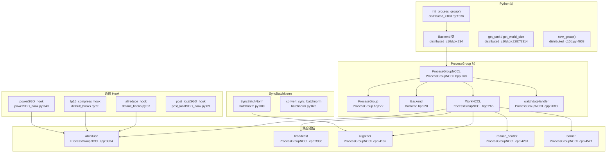

# 32. PyTorch NCCL 后端与集合通信

## 目录

- [32.1 整体架构](#321-整体架构)
- [32.2 ProcessGroup 基类](#322-processgroup-基类)
- [32.3 ProcessGroupNCCL](#323-processgroupnccl)
- [32.4 WorkNCCL 与 Watchdog](#324-worknccl-与-watchdog)
- [32.5 集合通信操作](#325-集合通信操作)
- [32.6 torch.distributed 初始化](#326-torchdistributed-初始化)
- [32.7 Backend 注册机制](#327-backend-注册机制)
- [32.8 集合通信函数式 API](#328-集合通信函数式-api)
- [32.9 DDP 通信 Hook](#329-ddp-通信-hook)
- [32.10 SyncBatchNorm](#3210-syncbatchnorm)
- [32.11 设计权衡](#3211-设计权衡)
- [32.12 关键文件索引](#3212-关键文件索引)

---

## 32.1 整体架构

NCCL 是 PyTorch GPU 分布式训练的默认后端，提供高性能集合通信原语。ProcessGroupNCCL 封装 NCCL 库调用，支持异步执行和 Watchdog 超时检测。



---

## 32.2 ProcessGroup 基类

```cpp
// torch/csrc/distributed/c10d/ProcessGroup.hpp:72
class TORCH_API ProcessGroup : public torch::CustomClassHolder {
    // 行 74-82: 后端类型枚举
    enum BackendType : uint8_t {
        UNDEFINED=0, GLOO=1, NCCL=2, UCC=3, MPI=4, XCCL=5, CUSTOM=6
    };
};
```

### ProcessGroup 虚方法

| 方法 | 行号 | 说明 |
|------|------|------|
| `broadcast` | 175 | 广播 |
| `allreduce` | 208 | 全归约 |
| `allreduce_coalesced` | 237 | 合并全归约 |
| `reduce` | 262 | 归约 |
| `allgather` | 290 | 全收集 |
| `_allgather_base` | 324 | 全收集（基础版） |
| `gather` | 410 | 收集 |
| `scatter` | 439 | 散射 |
| `reduce_scatter` | 470 | 归约散射 |
| `_reduce_scatter_base` | 499 | 归约散射（基础版） |
| `alltoall_base` | 559 | 全互通 |
| `alltoall` | 588 | 全互通 |
| `send` | 677 | 点对点发送 |
| `recv` | 701 | 点对点接收 |
| `recvAnysource` | 725 | 接收任意源 |
| `barrier` | 746 | 屏障同步 |
| `monitoredBarrier` | 615 | 监控屏障 |

### Backend 基类

```cpp
// torch/csrc/distributed/c10d/Backend.hpp:20
class TORCH_API Backend : public torch::CustomClassHolder {
    struct Options : torch::CustomClassHolder;  // 行 26-38
    // 与 ProcessGroup 类似的虚方法集
};
```

---

## 32.3 ProcessGroupNCCL

```cpp
// torch/csrc/distributed/c10d/ProcessGroupNCCL.hpp:263
class TORCH_API ProcessGroupNCCL : public Backend {
    // 行 566-570: 构造函数
    ProcessGroupNCCL(const c10::intrusive_ptr<Store>& store,
                     int rank, int size,
                     c10::intrusive_ptr<Options> options);

    // 行 594: 后端名称
    const std::string getBackendName() const override { return "nccl"; }

    // 合并操作
    void startCoalescing() override;    // 行 602
    c10::intrusive_ptr<Work> endCoalescing() override;  // 行 604
};
```

### 常量与枚举

| 项目 | 行号 | 值 |
|------|------|-----|
| `NCCL_BACKEND_NAME` | 127 | `"nccl"` |
| `kProcessGroupNCCLDefaultTimeout` | 133-134 | 10 分钟 |
| `ErrorHandlingMode` | 143-148 | NoHandling, TearDown, CleanUpOnly, SkipCleanUp |

### Options

```cpp
// ProcessGroupNCCL.cpp:2917
ProcessGroupNCCL::Options::Options(bool is_high_priority_stream)
    : is_high_priority_stream(is_high_priority_stream),
      split_from(nullptr), split_color(0) {}
```

### 构造函数

```cpp
// ProcessGroupNCCL.cpp:875-879
ProcessGroupNCCL::ProcessGroupNCCL(
    const c10::intrusive_ptr<Store>& store,
    int rank, int size,
    c10::intrusive_ptr<Options> options)
    : Backend(store, rank, size), options_(std::move(options)) {
    // 初始化 NCCL 通信器
    // 启动 watchdog 线程
}
```

### NCCL 后端注册（PyBind）

```cpp
// torch/csrc/distributed/c10d/init.cpp:2928-2930
intrusive_ptr_no_gil_destructor_class_<ProcessGroupNCCL>(
    module, "ProcessGroupNCCL", backend)
    // 行 2941-2942: 构造函数绑定
    // 行 3064-3112: Options 绑定 (is_high_priority_stream, split_from, etc.)
    // 行 2465: BackendType::NCCL 枚举值
```

---

## 32.4 WorkNCCL 与 Watchdog

### WorkNCCL

```cpp
// ProcessGroupNCCL.hpp:265
class WorkNCCL : public Work, public std::enable_shared_from_this<WorkNCCL> {
    // 行 270-283: 构造函数声明
};

// ProcessGroupNCCL.cpp:456 — 构造函数实现
// ProcessGroupNCCL.cpp:500 — 拷贝构造
// ProcessGroupNCCL.cpp:526  — 析构函数
```

### Watchdog 线程

```cpp
// ProcessGroupNCCL.cpp:2083
void ProcessGroupNCCL::watchdogHandler() {
    /* 监控 NCCL 操作的超时
    定期检查挂起的 Work 是否超时
    超时后:
      1. 终止 NCCL 通信器
      2. 抛出 DistBackendError
      3. 根据 ErrorHandlingMode 执行清理
    */
}
```

### CUDAEventCache

```cpp
// ProcessGroupNCCL.hpp:458
class CUDAEventCache {
    /* 缓存 CUDA Event，避免频繁创建/销毁
    用于追踪 NCCL 操作的 GPU 完成状态 */
};
```

---

## 32.5 集合通信操作

### 核心集合操作实现

| 操作 | 行号 | NCCL 调用 | 说明 |
|------|------|-----------|------|
| `allreduce` | 3834 | `ncclAllReduce` | 全归约 |
| `allreduce_impl` | 3807 | 内部实现 | allreduce 内部逻辑 |
| `allreduce_sparse` | 3734 | — | 稀疏全归约 |
| `allreduce_coalesced` | 3883 | — | 合并全归约 |
| `broadcast` | 3936 | `ncclBroadcast` | 广播 |
| `reduce` | 4032 | `ncclReduce` | 归约 |
| `allgather` | 4132 | `ncclAllGather` | 全收集 |
| `_allgather_base` | 5095 | — | 全收集基础版 |
| `allgather_coalesced` | 4229 | — | 合并全收集 |
| `allgather_into_tensor_coalesced` | 4238 | — | 合并全收集到张量 |
| `reduce_scatter` | 4281 | `ncclReduceScatter` | 归约散射 |
| `_reduce_scatter_base` | 4389 | — | 归约散射基础版 |
| `reduce_scatter_tensor_coalesced` | 4466 | — | 合并归约散射 |
| `barrier` | 4521 | — | 屏障同步 |
| `send` | 4771 | `ncclSend` | 点对点发送 |
| `recv` | 4820 | `ncclRecv` | 点对点接收 |
| `gather` | 4893 | — | 收集 |
| `scatter` | 4988 | — | 散射 |

### 合并操作（Coalescing）

```python
# 合并操作减少 NCCL kernel launch 次数
pg.startCoalescing()
pg.allreduce(tensor1)
pg.allreduce(tensor2)
pg.allreduce(tensor3)
work = pg.endCoalescing()  # 一次 NCCL 调用完成全部操作
```

---

## 32.6 torch.distributed 初始化

### init_process_group

```python
# torch/distributed/distributed_c10d.py:1536
def init_process_group(backend=None, init_method=None, timeout=None,
                       world_size=-1, rank=-1, store=None,
                       group_name="", pg_options=None, device_id=None):
    """初始化分布式进程组
    backend: 'nccl', 'gloo', 'mpi', 'ucc', 'xccl'
    init_method: URL (如 'tcp://host:port', 'file:///path')
    store: 替代 init_method 的 Store 对象
    """
```

### 辅助函数

| 函数 | 行号 | 说明 |
|------|------|------|
| `get_rank(group=None)` | 2287 | 获取当前进程 rank |
| `get_world_size(group=None)` | 2314 | 获取世界大小 |
| `new_group(ranks, ...)` | 4903 | 创建子进程组 |

---

## 32.7 Backend 注册机制

### Python Backend 类

```python
# torch/distributed/distributed_c10d.py:234
class Backend(str):
    # 行 253-258: 内置后端
    UNDEFINED = "undefined"
    GLOO = "gloo"
    NCCL = "nccl"
    UCC = "ucc"
    MPI = "mpi"
    XCCL = "xccl"

    # 行 267-271: 默认设备后端映射
    default_device_backend_map = {
        "cpu": GLOO,
        "cuda": NCCL,
        "xpu": XCCL,
    }

    # 行 281-288: 后端类型映射
    backend_type_map = {
        "gloo": ProcessGroup.BackendType.GLOO,
        "nccl": ProcessGroup.BackendType.NCCL,
        ...
    }
```

### register_backend

```python
# torch/distributed/distributed_c10d.py:301
@classmethod
def register_backend(cls, name, func, extended_api=False, devices=None):
    """注册自定义后端
    name: 后端名称
    func: 工厂函数 (store, rank, size, timeout) → ProcessGroup
    extended_api: 是否使用扩展 API
    devices: 支持的设备列表
    """
```

### BackendConfig

```python
# torch/distributed/distributed_c10d.py:369
class BackendConfig:
    """后端配置类，管理设备到后端的映射"""
```

---

## 32.8 集合通信函数式 API

`torch.distributed.nn.functional` 提供支持 autograd 的集合通信函数。

| 函数 | 行号 | 说明 |
|------|------|------|
| `broadcast` | 12 | 广播 |
| `reduce_scatter` | 88 | 归约散射 |
| `all_gather` | 107 | 全收集 |
| `_all_gather_base` | 122 | 全收集基础版 |
| `all_reduce` | 205 | 全归约 |

### Autograd 集成

```python
# torch/distributed/nn/functional.py

class _Broadcast(Function):       # 行 226 — 广播梯度
class _AllReduce(Function):       # 行 441 — 全归约梯度
class _AllGather(Function):       # 行 318 — 全收集梯度
class _AllGatherBase(Function):   # 行 347 — 全收集基础版梯度
class _Reduce_Scatter(Function):  # 行 303 — 归约散射梯度
class _Gather(Function):          # 行 246 — 收集梯度
class _Scatter(Function):         # 行 271 — 散射梯度
class _Reduce(Function):          # 行 289 — 归约梯度
```

---

## 32.9 DDP 通信 Hook

DDP 通信 Hook 允许自定义梯度同步策略，在 allreduce 前后插入压缩/量化等操作。

### DDPCommHookType 枚举

```python
# torch/distributed/algorithms/ddp_comm_hooks/__init__.py:44
class DDPCommHookType(Enum):
    ALLREDUCE = 0               # 默认 allreduce
    FP16_COMPRESS = 1           # FP16 压缩
    BF16_COMPRESS = 2           # BF16 压缩
    QUANTIZE_PER_TENSOR = 3    # 逐张量量化
    QUANTIZE_PER_CHANNEL = 4   # 逐通道量化
    POWER_SGD = 5              # PowerSGD 压缩
    POWER_SGD_RANK2 = 6        # PowerSGD rank-2
    BATCHED_POWER_SGD = 7      # 批量 PowerSGD
    BATCHED_POWER_SGD_RANK2 = 8
    NOOP = 9                   # 无操作
```

### 默认 Hook

```python
# torch/distributed/algorithms/ddp_comm_hooks/default_hooks.py

def allreduce_hook(process_group, bucket):  # 行 33
    """默认 Hook: 直接 allreduce"""

def fp16_compress_hook(process_group, bucket):  # 行 90
    """FP16 压缩 Hook: 梯度转为 FP16 再 allreduce"""

def bf16_compress_hook(process_group, bucket):  # 行 110
    """BF16 压缩 Hook"""
```

### PowerSGD Hook

```python
# torch/distributed/algorithms/ddp_comm_hooks/powerSGD_hook.py

class PowerSGDState:  # 行 122
    """PowerSGD 状态: 低秩矩阵 P/Q 缓存"""

def powerSGD_hook(state, bucket):  # 行 340
    """PowerSGD Hook: 低秩分解梯度
    1. 将梯度重塑为矩阵
    2. QR 分解得到低秩近似
    3. Allreduce 低秩矩阵
    4. 重构梯度
    """

def batched_powerSGD_hook(state, bucket):  # 行 653
    """批量 PowerSGD: 合并多个梯度一起压缩"""
```

### Post-LocalSGD Hook

```python
# torch/distributed/algorithms/ddp_comm_hooks/post_localSGD_hook.py

class PostLocalSGDState:  # 行 13
    """Post-LocalSGD 状态"""

def post_localSGD_hook(state, bucket):  # 行 69
    """先本地更新若干步，再全局 allreduce"""
```

### 辅助函数

```python
# __init__.py:19
def _ddp_comm_hook_wrapper(comm_hook, model, state):
    """包装 DDP 通信 Hook"""

# __init__.py:96
def register_ddp_comm_hook(comm_hook_type, model, state=None):
    """注册 DDP 通信 Hook"""
```

---

## 32.10 SyncBatchNorm

SyncBatchNorm 跨进程同步 BatchNorm 统计量，用于分布式训练中 batch size 过小的场景。

### SyncBatchNorm 类

```python
# torch/nn/modules/batchnorm.py:600
class SyncBatchNorm(_BatchNorm):
    def __init__(self, num_features, eps=1e-5, momentum=0.1, affine=True,
                 track_running_stats=True, process_group=None, ...):  # 行 703

    def forward(self, input):  # 行 730
        # 1. 计算本地均值/方差
        # 2. allgather 均值/方差/计数
        # 3. 计算全局均值/方差
        # 4. 归一化

    @classmethod
    def convert_sync_batchnorm(cls, module, process_group=None):  # 行 823
        """递归将 BatchNorm 转换为 SyncBatchNorm"""
```

### C++ SyncBatchNorm Function

```python
# torch/nn/modules/_functions.py:7
class SyncBatchNorm(Function):
    @staticmethod
    def forward(self, input, weight, bias, running_mean, running_var,
                eps, momentum, process_group, world_size):  # 行 9
        """C++ 支持的 SyncBatchNorm 前向"""
```

---

## 32.11 设计权衡

| 权衡点 | 选择 | 原因 |
|--------|------|------|
| 异步 vs 同步集合操作 | 异步（返回 Work） | GPU 操作异步执行，可与其他计算重叠 |
| Watchdog 超时检测 | 独立线程监控 | 避免用户代码无限挂起，但增加线程开销 |
| Coalescing 合并 | 显式 startCoalescing/endCoalescing | 减少 NCCL kernel launch，但需用户手动标注 |
| 通信 Hook 策略 | 可插拔 Hook | 不同场景（带宽受限/计算受限）需不同策略；默认 allreduce 最通用 |
| PowerSGD 低秩压缩 | 可选 | 减少通信量，但引入近似误差和额外计算 |
| SyncBatchNorm 跨进程同步 | 可选转换 | 小 batch size 场景必需，但增加通信开销 |
| Python Backend 注册 | 动态注册 | 支持自定义后端（如 HCCL），但需确保线程安全 |
| BackendType 枚举 | C++ 枚举 + Python 映射 | C++ 端高效分发，Python 端灵活配置 |

---

## 32.12 关键文件索引

| 文件 | 核心内容 |
|------|----------|
| `torch/csrc/distributed/c10d/ProcessGroup.hpp` | ProcessGroup 基类 |
| `torch/csrc/distributed/c10d/Backend.hpp` | Backend 基类 |
| `torch/csrc/distributed/c10d/ProcessGroupNCCL.hpp` | ProcessGroupNCCL 类声明 |
| `torch/csrc/distributed/c10d/ProcessGroupNCCL.cpp` | ProcessGroupNCCL 实现、WorkNCCL、Watchdog |
| `torch/csrc/distributed/c10d/init.cpp` | NCCL PyBind 注册 |
| `torch/distributed/distributed_c10d.py` | init_process_group、Backend、register_backend |
| `torch/distributed/nn/functional.py` | 集合通信函数式 API（autograd 集成） |
| `torch/distributed/algorithms/ddp_comm_hooks/default_hooks.py` | 默认/FP16/BF16 Hook |
| `torch/distributed/algorithms/ddp_comm_hooks/powerSGD_hook.py` | PowerSGD Hook |
| `torch/distributed/algorithms/ddp_comm_hooks/post_localSGD_hook.py` | Post-LocalSGD Hook |
| `torch/distributed/algorithms/ddp_comm_hooks/__init__.py` | DDPCommHookType 枚举 |
| `torch/nn/modules/batchnorm.py` | SyncBatchNorm |
| `torch/nn/modules/_functions.py` | C++ SyncBatchNorm Function |