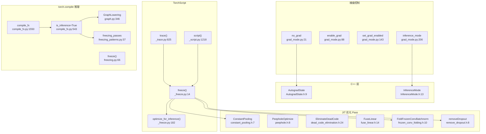

# 33. PyTorch 推理优化系统

## 目录

- [33.1 整体架构](#331-整体架构)
- [33.2 no_grad 与 enable_grad](#332-no_grad-与-enable_grad)
- [33.3 inference_mode 推理模式](#333-inference_mode-推理模式)
- [33.4 C++ InferenceMode 与 AutogradState](#334-c-inferencemode-与-autogradstate)
- [33.5 TorchScript 推理优化](#335-torchscript-推理优化)
- [33.6 TorchScript 优化 Pass](#336-torchscript-优化-pass)
- [33.7 torch.compile 推理路径](#337-torchcompile-推理路径)
- [33.8 Inductor FX Pass 与冻结优化](#338-inductor-fx-pass-与冻结优化)
- [33.9 设计权衡](#339-设计权衡)
- [33.10 关键文件索引](#3310-关键文件索引)

---

## 33.1 整体架构

PyTorch 推理优化分为多个层次：梯度禁用上下文、TorchScript 编译冻结、torch.compile 推理模式。



---

## 33.2 no_grad 与 enable_grad

### no_grad

```python
# torch/autograd/grad_mode.py:21
class no_grad(_NoParamDecoratorContextManager):
    """禁用梯度计算的上下文管理器
    可用作装饰器或 with 语句"""

    def __init__(self):  # 行 75
        pass

    def __enter__(self):  # 行 80
        self.prev = torch.is_grad_enabled()
        torch.set_grad_enabled(False)

    def __exit__(self, *args):  # 行 84
        torch.set_grad_enabled(self.prev)
```

### enable_grad

```python
# torch/autograd/grad_mode.py:88
class enable_grad(_NoParamDecoratorContextManager):
    """在 no_grad 内部重新启用梯度计算"""

    def __enter__(self):  # 行 135
        self.prev = torch.is_grad_enabled()
        torch.set_grad_enabled(True)
```

### set_grad_enabled

```python
# torch/autograd/grad_mode.py:143
class set_grad_enabled(_DecoratorContextManager):
    """显式设置梯度计算开关"""

    def __init__(self, mode):  # 行 184
        self.mode = mode

    def __enter__(self):  # 行 193
        self.prev = torch.is_grad_enabled()
        torch.set_grad_enabled(self.mode)
```

### 三者对比

| 上下文管理器 | 行号 | 作用 | 开销 |
|-------------|------|------|------|
| `no_grad` | 21 | 禁用梯度 | 低：仅设置标志 |
| `enable_grad` | 88 | 在 no_grad 内启用梯度 | 低 |
| `set_grad_enabled` | 143 | 显式设置模式 | 低 |
| `inference_mode` | 206 | 禁用梯度+版本计数+视图追踪 | 最低 |

---

## 33.3 inference_mode 推理模式

`inference_mode` 是比 `no_grad` 更激进的推理优化，禁用版本计数和视图追踪。

```python
# torch/autograd/grad_mode.py:206
class inference_mode(_DecoratorContextManager):
    """推理模式：禁用梯度 + 版本计数 + 视图追踪
    比 no_grad 更快，但输出的张量不能用于训练"""

    def __init__(self, mode=True):  # 行 259
        self.mode = mode

    def __enter__(self):  # 行 269
        self._inference_mode = torch._C._InferenceMode(self.mode)
        self._inference_mode.__enter__()
```

### 辅助函数

```python
# torch/autograd/grad_mode.py:283
def _enter_inference_mode(mode):
    """进入推理模式"""

# torch/autograd/grad_mode.py:289
def _exit_inference_mode(mode):
    """退出推理模式"""
```

### no_grad vs inference_mode

| 特性 | no_grad | inference_mode |
|------|---------|----------------|
| 梯度计算 | 禁用 | 禁用 |
| 版本计数 | 保留 | 禁用 |
| 视图追踪 | 保留 | 禁用 |
| Autograd 元数据 | 保留 | 不创建 |
| 输出张量可训练 | 是 | 否 |
| 性能 | 较好 | 最佳 |

---

## 33.4 C++ InferenceMode 与 AutogradState

### AutogradState

```cpp
// c10/core/AutogradState.h:9
struct AutogradState {
    static AutogradState get_tls_state();     // 行 10
    static void set_tls_state(AutogradState); // 行 11

    void set_inference_mode(bool enabled);    // 行 32
    bool get_inference_mode() const;          // 行 52
    // 管理线程局部的 autograd 状态
};
```

### InferenceMode

```cpp
// c10/core/InferenceMode.h:13
struct InferenceMode {
    // RAII 守卫：构造时启用推理模式，析构时恢复
    InferenceMode(bool enabled);    // 行 54
    ~InferenceMode();               // 行 81

    static bool is_enabled();       // 行 85
    // 设置 AutogradState::set_inference_mode
};
```

### 线程局部状态管理

```
AutogradState (TLS)
  ├── grad_mode: bool         → no_grad / enable_grad 控制
  ├── inference_mode: bool    → inference_mode 控制
  ├── fw_grad_mode: bool      → 前向模式 AD
  └── multi_device/iterator 等其他状态
```

---

## 33.5 TorchScript 推理优化

### trace

```python
# torch/jit/_trace.py:825
def trace(func, example_inputs, optimize=True, check_trace=True,
          check_inputs=None, check_tolerance=1e-5, strict=True,
          _force_outplace=False, _compile_dep=False, ...):
    """追踪模型：记录前向传播的操作序列
    适用于无控制流的模型
    """
```

### trace_module

```python
# torch/jit/_trace.py:1118
def trace_module(mod, inputs, optimize=True, check_trace=True, ...):
    """追踪模块：支持多方法追踪"""
```

### script

```python
# torch/jit/_script.py:1218
def script(obj, optimize=None, _frames_up=0, _rcb=None,
           example_inputs=None):
    """脚本化模型：分析 Python 源码生成 TorchScript IR
    适用于有控制流的模型
    """

# torch/jit/_script.py:348
def script_method(fn):
    """脚本化方法"""

# torch/jit/_script.py:1000
class RecursiveScriptClass:
    """脚本化的类"""
```

### freeze

```python
# torch/jit/_freeze.py:14
def freeze(mod, preservedAttrs=None, optimize_numerics=True):
    """冻结 TorchScript 模块
    将属性内联为常量，运行优化 Pass
    preservedAttrs: 不内联的属性列表
    optimize_numerics: 是否运行数值优化（Conv+BN 融合等）
    """

# torch/jit/_freeze.py:126
def run_frozen_optimizations(mod, optimize_numerics=True):
    """运行冻结优化"""

# torch/jit/_freeze.py:182
def optimize_for_inference(mod, other_methods=None):
    """为推理优化 TorchScript 模块
    应用冻结 + 专用推理优化 Pass
    """
```

---

## 33.6 TorchScript 优化 Pass

### 通用优化 Pass

| Pass | 头文件行号 | 说明 |
|------|-----------|------|
| `ConstantPooling` | constant_pooling.h:7 | 常量池化，减少重复常量内存 |
| `PeepholeOptimize` | peephole.h:8 | 窥孔优化（代数简化） |
| `FuseAddMM` | peephole.h:16 | addmm 融合 |
| `EliminateDeadCode` | dead_code_elimination.h:24 | 死代码消除 |
| `ConstantPropagation` | constant_propagation.h:13 | 常量传播 |
| `FuseLinear` | fuse_linear.h:14 | 线性层融合 |
| `SwapFunctionalLinear` | fuse_linear.h:18 | 函数式线性替换 |
| `FuseGraph` | graph_fuser.h:13 | 图融合 |
| `CustomFuseGraph` | graph_fuser.h:29 | 自定义图融合 |
| `removeDropout` | remove_dropout.h:8 | 移除 Dropout |

### 冻结专用 Pass

| Pass | 头文件行号 | 说明 |
|------|-----------|------|
| `OptimizeFrozenGraph` | frozen_graph_optimizations.h:16 | 冻结图优化入口 |
| `freeze_module` | freeze_module.h:21 | 模块冻结 |
| `FoldFrozenConvBatchnorm` | frozen_conv_folding.h:10 | Conv+BN 融合 |
| `FoldFrozenConvAddOrSub` | frozen_conv_folding.h:15 | Conv+Add 融合 |
| `FoldFrozenConvMulOrDiv` | frozen_conv_folding.h:20 | Conv+Mul 融合 |
| `FoldFrozenLinearBatchnorm` | frozen_linear_folding.h:10 | Linear+BN 融合 |
| `ConvertFrozenOpsToMKLDNN` | frozen_ops_to_mkldnn.h:11 | 转 MKL-DNN 算子 |
| `FuseFrozenConvAddRelu` | frozen_conv_add_relu_fusion.h:11 | Conv+Add+ReLU 融合 |
| `FrozenConcatLinear` | frozen_concat_linear.h:9 | 冻结 Concat+Linear 优化 |
| `FrozenLinearTranspose` | frozen_linear_transpose.h:9 | 冻结 Linear+Transpose 优化 |
| `FoldConvBatchNorm` | fold_conv_bn.h:13 | 非冻结 Conv+BN 融合 |

### C++ optimize_for_inference

```cpp
// torch/csrc/jit/api/module.h:344
Module optimize_for_inference(Module& module, ...);
```

---

## 33.7 torch.compile 推理路径

当 `torch.compile()` 在推理模式（`no_grad` 或 `inference_mode` 下）运行时，启用冻结优化路径。

### compile_fx 入口

```python
# torch/_inductor/compile_fx.py:1550
def compile_fx(model, example_inputs, ...):
    """主编译入口"""

# torch/_inductor/compile_fx.py:532
def compile_fx_inner(model, example_inputs, ...):
    """内部编译函数"""

# torch/_inductor/compile_fx.py:516
class _CompileFxKwargs:
    is_inference: bool = False  # 推理模式标志
```

### 推理编译器选择

```python
# torch/_inductor/compile_fx.py:1798
# 当 config.freezing 且 grad 未启用时，使用推理编译器
if config.freezing and not torch.is_grad_enabled():
    inference_compiler = functools.partial(
        fw_compiler_base, is_inference=True)  # 行 1809
```

### fw_compiler_base 推理分支

```python
# torch/_inductor/compile_fx.py:1713
def fw_compiler_base(gm, example_inputs, is_inference=False):
    if is_inference:  # 行 1719
        # 跳过反向图生成
        # 仅生成前向内核
```

### _recursive_post_grad_passes

```python
# torch/_inductor/compile_fx.py:331
def _recursive_post_grad_passes(gm, is_inference):
    """推理模式下的后向 Pass：跳过不需要的优化"""
```

---

## 33.8 Inductor FX Pass 与冻结优化

### GraphLowering 推理模式

```python
# torch/_inductor/graph.py:346
class GraphLowering:
    def __init__(self, ..., is_inference=False):  # 行 346
        self.is_inference = is_inference  # 行 363

    # 行 526: 推理模式标识
    if self.is_inference:
        return "inference"

    # 行 533: 推理模式布局优化
    @staticmethod
    def decide_layout_opt(gm, *, is_inference):  # 行 533
        if is_inference:  # 行 599
            # 推理模式布局优化启发式
```

### 冻结 Pass

```python
# torch/_inductor/fx_passes/freezing_patterns.py:37
def freezing_passes(gm, aot_example_inputs):
    """冻结优化 Pass：
    - Conv+BN 评估融合
    - 常量折叠
    - 二元折叠
    """

# 行 34: binary_folding_pass = PatternMatcherPass()

# torch/_inductor/fx_passes/efficient_conv_bn_eval.py:17
def efficient_conv_bn_eval(bn, conv, x):
    """Conv+BN 评估融合模式"""
```

### 其他推理相关 Pass

| Pass | 行号 | 说明 |
|------|------|------|
| `post_grad_passes` | post_grad.py:74 | 推理模式下跳过反向 Pass |
| `pre_grad_passes` | pre_grad.py:119 | 前向优化 |
| `fuse_fx` | pre_grad.py:315 | 融合入口（含冻结路径） |
| `joint_graph_passes` | joint_graph.py:445 | 联合图优化 |
| `group_batch_fusion_passes` | group_batch_fusion.py:1367 | 分组批融合 |
| `reinplace_inplaceable_ops` | reinplace.py:726 | 原地化优化 |
| `freeze()` | freezing.py:66 | Inductor 冻结入口 |

### 推理编译流程

```
用户: model = torch.compile(model)
      with torch.inference_mode():
          output = model(input)

1. Dynamo 捕获 → FX Graph
2. AOT Autograd: 检测 grad 未启用
   → 选择 inference_compiler (is_inference=True)
3. 冻结 Pass: Conv+BN 融合、常量折叠、二元折叠
4. GraphLowering: is_inference=True
   → 仅生成前向内核，不生成反向图
   → 推理友好的布局优化
5. Inductor 后端: 生成高效 Triton/C++ 内核
```

---

## 33.9 设计权衡

| 权衡点 | 选择 | 原因 |
|--------|------|------|
| inference_mode vs no_grad | 推理用 inference_mode | 禁用版本计数和视图追踪减少开销，但输出不可训练 |
| trace vs script | trace 简单/script 完整 | trace 不支持控制流但简单；script 支持控制流但有限制 |
| freeze 内联属性 | 冻结时内联 | 消除属性查找开销，但失去动态修改能力 |
| Conv+BN 融合 | 冻结时执行 | 减少推理计算量，但需确保 BN 统计量已收敛 |
| MKL-DNN 转换 | 可选 | 特定 CPU 上更快，但限制调试和可移植性 |
| Inductor 推理路径 | is_inference 标志 | 跳过反向图生成减少编译时间和内存，但不可中途切换训练 |
| 布局优化 | 推理模式更激进 | 推理不需要考虑梯度布局兼容性 |
| removeDropout | 冻结时移除 | Dropout 在推理时恒等，移除减少分支 |

---

## 33.10 关键文件索引

| 文件 | 核心内容 |
|------|----------|
| `torch/autograd/grad_mode.py` | no_grad、enable_grad、inference_mode |
| `c10/core/InferenceMode.h` | C++ InferenceMode RAII 守卫 |
| `c10/core/AutogradState.h` | C++ AutogradState 线程局部状态 |
| `torch/jit/_trace.py` | trace、trace_module |
| `torch/jit/_script.py` | script、script_method |
| `torch/jit/_freeze.py` | freeze、optimize_for_inference |
| `torch/csrc/jit/passes/` | 全部 JIT 优化 Pass |
| `torch/_inductor/compile_fx.py` | compile_fx、is_inference 推理路径 |
| `torch/_inductor/graph.py` | GraphLowering is_inference |
| `torch/_inductor/freezing.py` | Inductor 冻结入口 |
| `torch/_inductor/fx_passes/freezing_patterns.py` | 冻结优化 Pass |
| `torch/_inductor/fx_passes/efficient_conv_bn_eval.py` | Conv+BN 评估融合 |