# 34. PyTorch 损失函数系统

## 目录

- [34.1 整体架构](#341-整体架构)
- [34.2 基类与归约模式](#342-基类与归约模式)
- [34.3 回归损失](#343-回归损失)
- [34.4 分类损失](#344-分类损失)
- [34.5 排序与嵌入损失](#345-排序与嵌入损失)
- [34.6 分布匹配损失](#346-分布匹配损失)
- [34.7 序列损失](#347-序列损失)
- [34.8 函数式 API](#348-函数式-api)
- [34.9 C++ 原生实现](#349-c-原生实现)
- [34.10 设计权衡](#3410-设计权衡)
- [34.11 关键文件索引](#3411-关键文件索引)

---

## 34.1 整体架构

PyTorch 损失函数系统采用三层架构：Python Module 类（有状态）→ 函数式 API（无状态）→ C++ 原生实现（高性能）。

```mermaid
graph TB
    subgraph "Module 层 (torch.nn)"
        BL["_Loss<br/>loss.py:38"]
        WL["_WeightedLoss<br/>loss.py:49"]
        L1["L1Loss:62"]
        MS["MSELoss:548"]
        SM1["SmoothL1Loss:962"]
        HB["HuberLoss:1045"]
        NL["NLLLoss:131"]
        CE["CrossEntropyLoss:1146"]
        BC1["BCELoss:613"]
        BC2["BCEWithLogitsLoss:704"]
        KL["KLDivLoss:449"]
        PN["PoissonNLLLoss:278"]
        GN["GaussianNLLLoss:364"]
        CT["CTCLoss:1830"]
        HE["HingeEmbeddingLoss:830"]
        ML1["MultiLabelMarginLoss:898"]
        SM2["SoftMarginLoss:1105"]
        MLS["MultiLabelSoftMarginLoss:1305"]
        CE2["CosineEmbeddingLoss:1360"]
        MR["MarginRankingLoss:1430"]
        MM["MultiMarginLoss:1495"]
        TM["TripletMarginLoss:1589"]
        TD["TripletMarginWithDistanceLoss:1697"]
    end

    subgraph "Functional 层 (F.)"
        FL1["l1_loss:3776"]
        FMS["mse_loss:3835"]
        FSM["smooth_l1_loss:3648"]
        FHB["huber_loss:3696"]
        FNL["nll_loss:3094"]
        FCE["cross_entropy:3404"]
        FBC["binary_cross_entropy:3504"]
        FBL["binary_cross_entropy_with_logits:3572"]
        FKL["kl_div:3321"]
        FCT["ctc_loss:3015"]
    end

    subgraph "C++ 层"
        CL["Loss.cpp"]
        CNLL["LossNLL.cpp"]
        CCTC["LossCTC.cpp"]
        CMLM["LossMultiLabelMargin.cpp"]
        CMM["LossMultiMargin.cpp"]
        RED["Reduction.h:8"]
    end

    BL --> WL
    BL --> L1
    BL --> MS
    BL --> NL
    BL --> CE
    WL --> BC1
    L1 --> FL1
    MS --> FMS
    NL --> FNL
    CE --> FCE
    BC1 --> FBC
    FL1 --> CL
    FMS --> CL
    FNL --> CNLL
    FCT --> CCTC
```



---

## 34.2 基类与归约模式

### _Loss 基类

```python
# torch/nn/modules/loss.py:38
class _Loss(Module):
    reduction: str  # 行 39

    def __init__(self, size_average=None, reduce=None, reduction='mean'):  # 行 41
        # size_average/reduce: 已弃用参数
        # reduction: 'none' | 'mean' | 'sum'
```

### _WeightedLoss 基类

```python
# torch/nn/modules/loss.py:49
class _WeightedLoss(_Loss):
    def __init__(self, weight=None, size_average=None, reduce=None,
                 reduction='mean'):  # 行 50
        self.register_buffer('weight', weight)  # 行 58
```

### Reduction 枚举

```python
# Python 侧: torch/nn/_reduction.py:8
def get_enum(reduction: str) -> int:
    # "none" → 0  (行 10)
    # "mean" → 1  (行 12)
    # "sum"  → 2  (行 19)
```

```cpp
// C++ 侧: aten/src/ATen/core/Reduction.h:8
enum Reduction {
    None = 0,   // 行 9
    Mean = 1,   // 行 10
    Sum  = 2,   // 行 11
    END
};
```

### 归约模式说明

| 模式 | 公式 | 输出形状 |
|------|------|----------|
| `none` | 逐元素损失 | 与输入相同 |
| `mean` | `sum / N` | 标量 |
| `sum` | 逐元素求和 | 标量 |

---

## 34.3 回归损失

### L1Loss

```python
# torch/nn/modules/loss.py:62
class L1Loss(_Loss):
    """平均绝对误差: |input - target|"""
    def __init__(self, size_average=None, reduce=None, reduction='mean'):  # 行 124
    def forward(self, input, target):  # 行 127 → F.l1_loss
```

### MSELoss

```python
# torch/nn/modules/loss.py:548
class MSELoss(_Loss):
    """均方误差: (input - target)²"""
    def __init__(self, size_average=None, reduce=None, reduction='mean'):  # 行 606
    def forward(self, input, target):  # 行 609 → F.mse_loss
```

### SmoothL1Loss

```python
# torch/nn/modules/loss.py:962
class SmoothL1Loss(_Loss):
    """平滑 L1 损失（Huber Loss 的特例）:
    |x| < β: 0.5 * x² / β
    |x| ≥ β: |x| - 0.5 * β
    """
    def __init__(self, size_average=None, reduce=None, reduction='mean',
                 beta=1.0):  # 行 1035
    def forward(self, input, target):  # 行 1041 → F.smooth_l1_loss
```

### HuberLoss

```python
# torch/nn/modules/loss.py:1045
class HuberLoss(_Loss):
    """Huber 损失:
    |x| ≤ δ: 0.5 * x²
    |x| > δ: δ * (|x| - 0.5 * δ)
    """
    def __init__(self, reduction='mean', delta=1.0):  # 行 1097
    def forward(self, input, target):  # 行 1101 → F.huber_loss
```

### 回归损失对比

| 损失 | 行号 | 特点 | 对异常值 |
|------|------|------|----------|
| L1Loss | 62 | 绝对误差 | 鲁棒 |
| MSELoss | 548 | 平方误差 | 敏感 |
| SmoothL1Loss | 962 | L1/L2 平滑过渡 | 中等 |
| HuberLoss | 1045 | 参数化过渡 | 可调 |

---

## 34.4 分类损失

### NLLLoss

```python
# torch/nn/modules/loss.py:131
class NLLLoss(_WeightedLoss):
    """负对数似然损失: -log(prob)
    输入: log_softmax 的输出
    """
    def __init__(self, weight=None, size_average=None, ignore_index=-100,
                 reduce=None, reduction='mean'):  # 行 239
    def forward(self, input, target):  # 行 250 → F.nll_loss
```

### CrossEntropyLoss

```python
# torch/nn/modules/loss.py:1146
class CrossEntropyLoss(_WeightedLoss):
    """交叉熵损失 = LogSoftmax + NLLLoss
    最常用的分类损失
    """
    __constants__ = ['ignore_index', 'label_smoothing']  # 行 1277

    def __init__(self, weight=None, size_average=None, ignore_index=-100,
                 reduce=None, reduction='mean', label_smoothing=0.0):  # 行 1281
    def forward(self, input, target):  # 行 1294 → F.cross_entropy
```

### BCELoss

```python
# torch/nn/modules/loss.py:613
class BCELoss(_WeightedLoss):
    """二分类交叉熵: -[y*log(p) + (1-y)*log(1-p)]
    输入: sigmoid 后的概率
    """
    def __init__(self, weight=None, size_average=None, reduce=None,
                 reduction='mean'):  # 行 689
    def forward(self, input, target):  # 行 698 → F.binary_cross_entropy
```

### BCEWithLogitsLoss

```python
# torch/nn/modules/loss.py:704
class BCEWithLogitsLoss(_Loss):
    """Sigmoid + BCELoss 合并（数值更稳定）
    输入: logits（未经 sigmoid）
    """
    def __init__(self, weight=None, size_average=None, reduce=None,
                 reduction='mean', pos_weight=None):  # 行 806
    def forward(self, input, target):  # 行 820 → F.binary_cross_entropy_with_logits
```

### 分类损失对比

| 损失 | 行号 | 输入 | 适用场景 |
|------|------|------|----------|
| NLLLoss | 131 | log_softmax 输出 | 与 LogSoftmax 配合 |
| CrossEntropyLoss | 1146 | 原始 logits | 多分类（最常用） |
| BCELoss | 613 | sigmoid 输出 | 二分类 |
| BCEWithLogitsLoss | 704 | 原始 logits | 二分类（数值稳定） |
| SoftMarginLoss | 1105 | logits | 二分类（合页损失变体） |
| MultiLabelSoftMarginLoss | 1305 | logits | 多标签分类 |

---

## 34.5 排序与嵌入损失

### HingeEmbeddingLoss

```python
# torch/nn/modules/loss.py:830
class HingeEmbeddingLoss(_Loss):
    """合页嵌入损失:
    y=1:  max(0, margin - x)
    y=-1: x
    """
    def __init__(self, margin=1.0, size_average=None, ...):  # 行 882
```

### CosineEmbeddingLoss

```python
# torch/nn/modules/loss.py:1360
class CosineEmbeddingLoss(_Loss):
    """余弦嵌入损失:
    y=1:  1 - cos(x1, x2)
    y=-1: max(0, cos(x1, x2) - margin)
    """
    def __init__(self, margin=0.0, size_average=None, ...):  # 行 1414
```

### MarginRankingLoss

```python
# torch/nn/modules/loss.py:1430
class MarginRankingLoss(_Loss):
    """排序损失: max(0, -y * (x1 - x2) + margin)
    y=1:  x1 应大于 x2
    y=-1: x1 应小于 x2
    """
    def __init__(self, margin=0.0, size_average=None, ...):  # 行 1479
```

### TripletMarginLoss

```python
# torch/nn/modules/loss.py:1589
class TripletMarginLoss(_Loss):
    """三元组损失: max(0, d(anchor, positive) - d(anchor, negative) + margin)
    确保正样本距离 < 负样本距离 - margin
    """
    def __init__(self, margin=1.0, p=2, eps=1e-6, swap=False,
                 size_average=None, ...):  # 行 1664
```

### TripletMarginWithDistanceLoss

```python
# torch/nn/modules/loss.py:1697
class TripletMarginWithDistanceLoss(_Loss):
    """自定义距离函数的三元组损失"""
    def __init__(self, distance_function=None, margin=1.0, swap=False,
                 reduction='mean'):  # 行 1799
```

### MultiMarginLoss

```python
# torch/nn/modules/loss.py:1495
class MultiMarginLoss(_WeightedLoss):
    """多类合页损失: sum(max(0, margin - x[y] + x[j]))^p"""
    def __init__(self, p=1, margin=1.0, weight=None, ...):  # 行 1559
```

### MultiLabelMarginLoss

```python
# torch/nn/modules/loss.py:898
class MultiLabelMarginLoss(_Loss):
    """多标签合页损失"""
    def __init__(self, size_average=None, reduce=None, reduction='mean'):  # 行 955
```

---

## 34.6 分布匹配损失

### KLDivLoss

```python
# torch/nn/modules/loss.py:449
class KLDivLoss(_Loss):
    """KL 散度损失: target * (log(target) - log(input))
    注意: input 应为 log_probs，target 为 probs
    """
    def __init__(self, size_average=None, reduce=None, reduction='mean',
                 log_target=False):  # 行 532
```

### PoissonNLLLoss

```python
# torch/nn/modules/loss.py:278
class PoissonNLLLoss(_Loss):
    """泊松负对数似然: input - target * log(input) + log(target!)"""
    def __init__(self, log_input=True, full=False, size_average=None,
                 eps=1e-8, reduce=None, reduction='mean'):  # 行 339
```

### GaussianNLLLoss

```python
# torch/nn/modules/loss.py:364
class GaussianNLLLoss(_Loss):
    """高斯负对数似然: 0.5 * (log(var) + (input - target)² / var)"""
    def __init__(self, full=True, eps=1e-6, reduction='mean'):  # 行 434
```

---

## 34.7 序列损失

### CTCLoss

```python
# torch/nn/modules/loss.py:1830
class CTCLoss(_Loss):
    """连接时序分类损失
    用于语音识别等无对齐标签的序列学习
    """
    def __init__(self, blank=0, reduction='mean', zero_infinity=False):  # 行 1968
    def forward(self, log_probs, targets, input_lengths, target_lengths):
        # 行 1975 → F.ctc_loss
```

---

## 34.8 函数式 API

`torch.nn.functional` 提供与 Module 类对应的无状态函数。

### 完整函数索引

| 函数 | 行号 | 对应 Module |
|------|------|-------------|
| `l1_loss` | 3776 | L1Loss |
| `mse_loss` | 3835 | MSELoss |
| `smooth_l1_loss` | 3648 | SmoothL1Loss |
| `huber_loss` | 3696 | HuberLoss |
| `nll_loss` | 3094 | NLLLoss |
| `cross_entropy` | 3404 | CrossEntropyLoss |
| `binary_cross_entropy` | 3504 | BCELoss |
| `binary_cross_entropy_with_logits` | 3572 | BCEWithLogitsLoss |
| `kl_div` | 3321 | KLDivLoss |
| `poisson_nll_loss` | 3163 | PoissonNLLLoss |
| `gaussian_nll_loss` | 3230 | GaussianNLLLoss |
| `ctc_loss` | 3015 | CTCLoss |
| `hinge_embedding_loss` | 3947 | HingeEmbeddingLoss |
| `multilabel_margin_loss` | 3977 | MultiLabelMarginLoss |
| `soft_margin_loss` | 4005 | SoftMarginLoss |
| `multilabel_soft_margin_loss` | 4034 | MultiLabelSoftMarginLoss |
| `cosine_embedding_loss` | 4081 | CosineEmbeddingLoss |
| `margin_ranking_loss` | 3910 | MarginRankingLoss |
| `multi_margin_loss` | 4113 | MultiMarginLoss |
| `triplet_margin_loss` | 5337 | TripletMarginLoss |
| `triplet_margin_with_distance_loss` | 5379 | TripletMarginWithDistanceLoss |

### 调用关系

```
Module.forward(input, target)
  → F.xxx_loss(input, target, reduction=self.reduction, ...)
    → torch.xxx_loss(input, target, ...)  # C++ 绑定
      → aten/src/ATen/native/Loss*.cpp     # 原生实现
```

---

## 34.9 C++ 原生实现

### Loss.cpp

| C++ 函数 | 行号 | 说明 |
|----------|------|------|
| `smooth_l1_loss_out` | 112 | Smooth L1 损失 |
| `mse_loss_out` | 128 | MSE 损失 |
| `cosine_embedding_loss` | 144 | 余弦嵌入损失 |
| `hinge_embedding_loss` | 182 | 合页嵌入损失 |
| `triplet_margin_loss` | 199 | 三元组损失 |
| `margin_ranking_loss` | 225 | 排序损失 |
| `kl_div` | 238 | KL 散度 |
| `binary_cross_entropy_cpu` | 253 | BCE (CPU) |
| `binary_cross_entropy_with_logits` | 346 | BCE With Logits |
| `poisson_nll_loss` | 363 | 泊松 NLL |
| `soft_margin_loss` | 410 | Soft Margin |
| `huber_loss` | 439 | Huber 损失 |
| `huber_loss_backward` | 459 | Huber 反向 |
| `mse_loss_backward` | 476 | MSE 反向 |
| `l1_loss` | 494 | L1 损失 |

### LossNLL.cpp

| C++ 函数 | 行号 | 说明 |
|----------|------|------|
| `nll_loss_forward_out_cpu_template` | 299 | NLL 前向模板 |
| `nll_loss_backward_out_cpu_template` | 411 | NLL 反向模板 |
| `nll_loss_forward_out_cpu` | 455 | NLL 前向 |
| `nll_loss_backward_out_cpu` | 468 | NLL 反向 |
| `nll_loss_out` | 661 | NLL 输出 |

### LossCTC.cpp

| C++ 函数 | 行号 | 说明 |
|----------|------|------|
| `ctc_loss_allocate_outputs` | 56 | CTC 输出分配 |
| `ctc_loss_cpu_template` | 129 | CTC CPU 模板 |
| `ctc_loss_meta` | 407 | CTC 元数据 |
| `ctc_loss_cpu` | 423 | CTC CPU 实现 |
| `ctc_loss` (IntArrayRef) | 536 | CTC 入口 |
| `ctc_loss` (Tensor) | 541 | CTC 入口（重载） |

### 其他 C++ 文件

| 文件 | 关键函数 |
|------|----------|
| `LossMultiLabelMargin.cpp` | `multilabel_margin_loss` (行 325) |
| `LossMultiMargin.cpp` | `multi_margin_loss_cpu` (行 264) |
| `LossNLL2d.cpp` | NLL 2D 变体 |

---

## 34.10 设计权衡

| 权衡点 | 选择 | 原因 |
|--------|------|------|
| Module vs Functional | 两者并存 | Module 适合标准训练循环，Functional 适合自定义逻辑和 torch.func |
| 归约模式 | 统一 reduction 参数 | 替代已弃用的 size_average/reduce，更清晰 |
| BCEWithLogits vs BCE | 推荐 With Logits | 合并 sigmoid 避免数值不稳定（log-sum-exp 技巧） |
| CrossEntropyLoss vs NLLLoss+LogSoftmax | CrossEntropyLoss | 合并更高效且数值稳定 |
| C++ 独立文件 | 按类型分文件 | Loss.cpp / LossNLL.cpp / LossCTC.cpp 避免单文件过大 |
| ignore_index | 仅 NLL/CrossEntropy | 分类损失需要忽略特定标签（如 padding），回归损失不需要 |
| label_smoothing | 仅 CrossEntropy | 标签平滑正则化，其他分类损失可手动实现 |
| weight 参数 | 仅 _WeightedLoss 子类 | 类别加权仅在分类损失中有意义 |

---

## 34.11 关键文件索引

| 文件 | 核心内容 |
|------|----------|
| `torch/nn/modules/loss.py` | 全部 22 个损失 Module 类 |
| `torch/nn/functional.py` | 21 个损失函数式 API |
| `torch/nn/_reduction.py` | 归约模式转换逻辑 |
| `aten/src/ATen/core/Reduction.h` | C++ Reduction 枚举 |
| `aten/src/ATen/native/Loss.cpp` | 通用损失 C++ 实现 |
| `aten/src/ATen/native/LossNLL.cpp` | NLL 损失 C++ 实现 |
| `aten/src/ATen/native/LossCTC.cpp` | CTC 损失 C++ 实现 |
| `aten/src/ATen/native/LossMultiLabelMargin.cpp` | 多标签 Margin 损失 |
| `aten/src/ATen/native/LossMultiMargin.cpp` | 多 Margin 损失 |
| `aten/src/ATen/native/LossNLL2d.cpp` | NLL 2D 变体 |