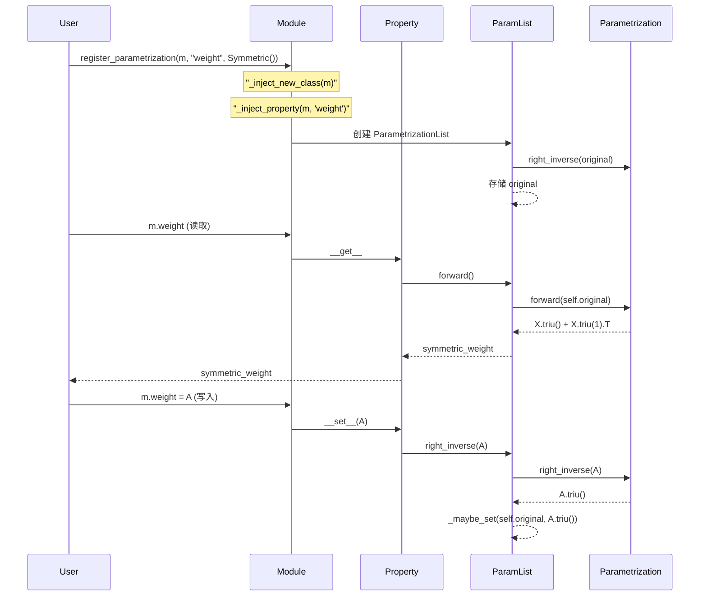

# 35. PyTorch 权重初始化与参数化系统

## 目录

- [35.1 整体架构](#351-整体架构)
- [35.2 nn.init 初始化函数](#352-nninit-初始化函数)
- [35.3 calculate_gain 与 Fan 计算](#353-calculate_gain-与-fan-计算)
- [35.4 Xavier 初始化 (Glorot)](#354-xavier-初始化-glorot)
- [35.5 Kaiming 初始化 (He)](#355-kaiming-初始化-he)
- [35.6 特殊初始化函数](#356-特殊初始化函数)
- [35.7 梯度裁剪](#357-梯度裁剪)
- [35.8 旧版 Weight Normalization](#358-旧版-weight-normalization)
- [35.9 旧版 Spectral Normalization](#359-旧版-spectral-normalization)
- [35.10 Parametrize 框架](#3510-parametrize-框架)
- [35.11 现代 Parametrizations](#3511-现代-parametrizations)
- [35.12 设计权衡](#3512-设计权衡)
- [35.13 关键文件索引](#3513-关键文件索引)

---

## 35.1 整体架构

PyTorch 权重初始化与参数化分为三层：底层初始化函数、中间层梯度裁剪、上层参数化框架。

```mermaid
graph TB
    subgraph "nn.init 初始化函数"
        UNI["uniform_<br/>init.py:142"]
        NOR["normal_<br/>init.py:169"]
        TN["trunc_normal_<br/>init.py:196"]
        CON["constant_<br/>init.py:227"]
        ONE["ones_<br/>init.py:245"]
        ZER["zeros_<br/>init.py:258"]
        EYE["eye_<br/>init.py:271"]
        DIR["dirac_<br/>init.py:292"]
        XU["xavier_uniform_<br/>init.py:366"]
        XN["xavier_normal_<br/>init.py:407"]
        KU["kaiming_uniform_<br/>init.py:456"]
        KN["kaiming_normal_<br/>init.py:521"]
        ORT["orthogonal_<br/>init.py:574"]
        SPR["sparse_<br/>init.py:625"]
    end

    subgraph "Fan/Gain 计算"
        CG["calculate_gain<br/>init.py:72"]
        CF["_calculate_fan_in_and_fan_out<br/>init.py:345"]
        CCF["_calculate_correct_fan<br/>init.py:446"]
    end

    subgraph "梯度裁剪"
        CGN["clip_grad_norm_<br/>clip_grad.py:176"]
        CGV["clip_grad_value_<br/>clip_grad.py:242"]
        GTN["_get_total_norm<br/>clip_grad.py:41"]
    end

    subgraph "Parametrize 框架"
        RP["register_parametrization<br/>parametrize.py:417"]
        IP["is_parametrized<br/>parametrize.py:631"]
        RMP["remove_parametrizations<br/>parametrize.py:653"]
        CAC["cached<br/>parametrize.py:32"]
        PL["ParametrizationList<br/>parametrize.py:92"]
    end

    subgraph "现代 Parametrizations"
        ORTH["orthogonal<br/>parametrizations.py:191"]
        WN["weight_norm<br/>parametrizations.py:334"]
        SN["spectral_norm<br/>parametrizations.py:527"]
    end

    subgraph "旧版 Hook 实现"
        OWN["WeightNorm<br/>weight_norm.py:14"]
        OSN["SpectralNorm<br/>spectral_norm.py:19"]
    end

    XU --> CF
    XN --> CF
    KU --> CCF
    KN --> CCF
    CCF --> CF
    KU --> CG
    KN --> CG
    CGN --> GTN
    ORTH --> RP
    WN --> RP
    SN --> RP
    RP --> PL
```



---

## 35.2 nn.init 初始化函数

### 内部 no_grad 包装

所有初始化函数内部使用 `no_grad` 包装，避免在初始化过程中构建计算图。

```python
# torch/nn/init.py:15
def _no_grad_uniform_(tensor, a, b, generator=None):
    with torch.no_grad():
        return tensor.uniform_(a, b, generator=generator)

# torch/nn/init.py:20
def _no_grad_normal_(tensor, mean, std, generator=None):
    with torch.no_grad():
        return tensor.normal_(mean, std, generator=generator)

# torch/nn/init.py:62
def _no_grad_fill_(tensor, val):
    with torch.no_grad():
        return tensor.fill_(val)

# torch/nn/init.py:67
def _no_grad_zero_(tensor):
    with torch.no_grad():
        return tensor.zero_()
```

### 基础分布初始化

| 函数 | 行号 | 分布 | 公式 |
|------|------|------|------|
| `uniform_` | 142 | 均匀分布 | U(a, b) |
| `normal_` | 169 | 正态分布 | N(mean, std²) |
| `trunc_normal_` | 196 | 截断正态 | N(mean, std²) 截断至 [a, b] |
| `constant_` | 227 | 常量 | val |
| `ones_` | 245 | 全 1 | 1.0 |
| `zeros_` | 258 | 全 0 | 0.0 |

### uniform_

```python
# torch/nn/init.py:142
def uniform_(tensor, a=0.0, b=1.0, generator=None):
    """均匀分布初始化 U(a, b)"""
    return _no_grad_uniform_(tensor, a, b, generator)
```

### normal_

```python
# torch/nn/init.py:169
def normal_(tensor, mean=0.0, std=1.0, generator=None):
    """正态分布初始化 N(mean, std²)"""
    return _no_grad_normal_(tensor, mean, std, generator)
```

### trunc_normal_

```python
# torch/nn/init.py:196
def trunc_normal_(tensor, mean=0.0, std=1.0, a=-2.0, b=2.0, generator=None):
    """截断正态分布初始化
    使用逆 CDF 变换法：
    1. 计算 l = norm_cdf((a - mean) / std), u = norm_cdf((b - mean) / std)
    2. 均匀填充 [2l-1, 2u-1]
    3. erfinv 变换为标准正态
    4. 缩放至 (mean, std) 并 clamp 至 [a, b]
    """
    return _no_grad_trunc_normal_(tensor, mean, std, a, b, generator)
```

### constant_ / ones_ / zeros_

```python
# torch/nn/init.py:227
def constant_(tensor, val):
    """填充常量值"""
    return _no_grad_fill_(tensor, val)

# torch/nn/init.py:245
def ones_(tensor):
    """填充 1.0"""
    return _no_grad_fill_(tensor, 1.0)

# torch/nn/init.py:258
def zeros_(tensor):
    """填充 0.0"""
    return _no_grad_zero_(tensor)
```

---

## 35.3 calculate_gain 与 Fan 计算

### calculate_gain

```python
# torch/nn/init.py:72
def calculate_gain(nonlinearity, param=None):
    """返回给定非线性函数的推荐增益值

    | 非线性函数 | 增益 |
    |-----------|------|
    | Linear/Identity/Conv/Sigmoid | 1 |
    | Tanh | 5/3 |
    | ReLU | √2 |
    | Leaky ReLU | √(2/(1 + negative_slope²)) |
    | SELU | 3/4 |
    """
```

### _calculate_fan_in_and_fan_out

```python
# torch/nn/init.py:345
def _calculate_fan_in_and_fan_out(tensor):
    """计算张量的 fan_in 和 fan_out
    fan_in = num_input_fmaps × receptive_field_size
    fan_out = num_output_fmaps × receptive_field_size
    """
    num_input_fmaps = tensor.size(1)    # 输入通道维度
    num_output_fmaps = tensor.size(0)   # 输出通道维度
    receptive_field_size = 1
    if tensor.dim() > 2:
        for s in tensor.shape[2:]:
            receptive_field_size *= s    # 卷积核大小的乘积
    fan_in = num_input_fmaps * receptive_field_size
    fan_out = num_output_fmaps * receptive_field_size
    return fan_in, fan_out
```

### _calculate_correct_fan

```python
# torch/nn/init.py:446
def _calculate_correct_fan(tensor, mode):
    """根据 mode 选择 fan_in 或 fan_out
    mode: "fan_in" 保持前向传播方差
          "fan_out" 保持反向传播方差
    """
    fan_in, fan_out = _calculate_fan_in_and_fan_out(tensor)
    return fan_in if mode == "fan_in" else fan_out
```

---

## 35.4 Xavier 初始化 (Glorot)

### xavier_uniform_

```python
# torch/nn/init.py:366
def xavier_uniform_(tensor, gain=1.0, generator=None):
    """Xavier 均匀初始化 (Glorot)
    std = gain × √(2 / (fan_in + fan_out))
    a = √3 × std
    采样自 U(-a, a)
    """
    fan_in, fan_out = _calculate_fan_in_and_fan_out(tensor)
    std = gain * math.sqrt(2.0 / float(fan_in + fan_out))
    a = math.sqrt(3.0) * std
    return _no_grad_uniform_(tensor, -a, a, generator)
```

### xavier_normal_

```python
# torch/nn/init.py:407
def xavier_normal_(tensor, gain=1.0, generator=None):
    """Xavier 正态初始化 (Glorot)
    std = gain × √(2 / (fan_in + fan_out))
    采样自 N(0, std²)
    """
    fan_in, fan_out = _calculate_fan_in_and_fan_out(tensor)
    std = gain * math.sqrt(2.0 / float(fan_in + fan_out))
    return _no_grad_normal_(tensor, 0.0, std, generator)
```

### Xavier 初始化原理

Xavier 初始化的核心思想是保持各层输入/输出的方差一致。假设权重和输入相互独立且均值为 0：

```
Var(y) = fan_in × Var(w) × Var(x)
```

令 `Var(y) = Var(x)`，则 `Var(w) = 1/fan_in`。兼顾反向传播，取 `Var(w) = 2/(fan_in + fan_out)`。

---

## 35.5 Kaiming 初始化 (He)

### kaiming_uniform_

```python
# torch/nn/init.py:456
def kaiming_uniform_(tensor, a=0, mode="fan_in", nonlinearity="leaky_relu",
                     generator=None):
    """Kaiming 均匀初始化 (He)
    gain = calculate_gain(nonlinearity, a)
    std = gain / √fan
    bound = √3 × std
    采样自 U(-bound, bound)
    """
    fan = _calculate_correct_fan(tensor, mode)
    gain = calculate_gain(nonlinearity, a)
    std = gain / math.sqrt(fan)
    bound = math.sqrt(3.0) * std
    with torch.no_grad():
        return tensor.uniform_(-bound, bound, generator=generator)
```

### kaiming_normal_

```python
# torch/nn/init.py:521
def kaiming_normal_(tensor, a=0, mode="fan_in", nonlinearity="leaky_relu",
                    generator=None):
    """Kaiming 正态初始化 (He)
    gain = calculate_gain(nonlinearity, a)
    std = gain / √fan
    采样自 N(0, std²)
    """
    fan = _calculate_correct_fan(tensor, mode)
    gain = calculate_gain(nonlinearity, a)
    std = gain / math.sqrt(fan)
    with torch.no_grad():
        return tensor.normal_(0, std, generator=generator)
```

### Kaiming vs Xavier

| 特性 | Xavier | Kaiming |
|------|--------|---------|
| 假设 | 线性激活 | ReLU 系激活 |
| 方差公式 | 2/(fan_in + fan_out) | 2/fan_in |
| 适用场景 | Sigmoid/Tanh | ReLU/LeakyReLU |
| mode 参数 | 无 | fan_in / fan_out |

---

## 35.6 特殊初始化函数

### eye_

```python
# torch/nn/init.py:271
def eye_(tensor):
    """单位矩阵初始化（仅 2D）
    保持 Linear 层输入的恒等性
    """
```

### dirac_

```python
# torch/nn/init.py:292
def dirac_(tensor, groups=1):
    """Dirac delta 初始化（3D/4D/5D）
    保持 Conv 层输入的恒等性
    在中心位置填充 1，其余为 0
    """
```

### orthogonal_

```python
# torch/nn/init.py:574
def orthogonal_(tensor, gain=1, generator=None):
    """正交矩阵初始化
    1. 生成随机矩阵
    2. QR 分解获得正交矩阵 Q
    3. 用对角线符号校正确保一致性
    4. 乘以 gain 缩放
    """
    flattened = tensor.new_empty((rows, cols)).normal_(0, 1, generator=generator)
    q, r = torch.linalg.qr(flattened)
    d = torch.diag(r, 0)
    ph = d.sign()
    q *= ph
```

### sparse_

```python
# torch/nn/init.py:625
def sparse_(tensor, sparsity, std=0.01, generator=None):
    """稀疏矩阵初始化（仅 2D）
    1. 先用 N(0, std) 填充
    2. 每列随机将 sparsity 比例的行置 0
    """
```

### 初始化函数总结

| 函数 | 行号 | 维度限制 | 典型场景 |
|------|------|---------|---------|
| `uniform_` | 142 | 任意 | 通用 |
| `normal_` | 169 | 任意 | 通用 |
| `trunc_normal_` | 196 | 任意 | Transformer |
| `constant_` | 227 | 任意 | 偏置初始化 |
| `ones_` | 245 | 任意 | 特殊需求 |
| `zeros_` | 258 | 任意 | 偏置初始化 |
| `eye_` | 271 | 2D | 恒等初始化 |
| `dirac_` | 292 | 3D/4D/5D | 卷积恒等初始化 |
| `xavier_uniform_` | 366 | ≥2D | Sigmoid/Tanh 网络 |
| `xavier_normal_` | 407 | ≥2D | Sigmoid/Tanh 网络 |
| `kaiming_uniform_` | 456 | ≥2D | ReLU 网络（默认初始化） |
| `kaiming_normal_` | 521 | ≥2D | ReLU 网络 |
| `orthogonal_` | 574 | ≥2D | RNN/LSTM |
| `sparse_` | 625 | 2D | 稀疏连接 |

---

## 35.7 梯度裁剪

### clip_grad_norm_

```python
# torch/nn/utils/clip_grad.py:176
def clip_grad_norm_(parameters, max_norm, norm_type=2.0,
                    error_if_nonfinite=False, foreach=None):
    """梯度范数裁剪（原地操作）
    1. 计算所有参数梯度的总范数
    2. 若总范数 > max_norm，按比例缩放梯度
       clip_coef = max_norm / (total_norm + 1e-6)
    3. 返回裁剪前的总范数
    """
```

### _get_total_norm

```python
# torch/nn/utils/clip_grad.py:41
def _get_total_norm(tensors, norm_type=2.0, error_if_nonfinite=False, foreach=None):
    """计算梯度总范数
    支持设备分组和 foreach 加速
    使用 torch._foreach_norm 批量计算
    """
```

### _clip_grads_with_norm_

```python
# torch/nn/utils/clip_grad.py:112
def _clip_grads_with_norm_(parameters, max_norm, total_norm, foreach=None):
    """给定预计算总范数进行梯度裁剪
    clip_coef = max_norm / (total_norm + 1e-6)
    clip_coef_clamped = clamp(clip_coef, max=1.0)
    """
```

### clip_grad_value_

```python
# torch/nn/utils/clip_grad.py:242
def clip_grad_value_(parameters, clip_value, foreach=None):
    """梯度值裁剪
    将梯度裁剪至 [-clip_value, clip_value] 范围
    使用 torch._foreach_clamp_min_ / clamp_max_ 加速
    """
```

### 梯度裁剪对比

| 函数 | 行号 | 方式 | 返回值 |
|------|------|------|--------|
| `clip_grad_norm_` | 176 | 范数裁剪（按比例缩放） | 裁剪前总范数 |
| `clip_grad_value_` | 242 | 值裁剪（硬截断） | None |
| `clip_grad_norm` | 225 | 已废弃 | 裁剪前总范数 |

---

## 35.8 旧版 Weight Normalization

### WeightNorm 类

```python
# torch/nn/utils/weight_norm.py:14
class WeightNorm:
    """旧版权重归一化 Hook（已废弃，推荐使用 parametrizations.weight_norm）
    w = g × v / ||v||

    将 weight 拆分为 weight_g（范数）和 weight_v（方向）
    通过 forward_pre_hook 在每次前向传播前重新计算 weight
    """

    def __init__(self, name, dim):           # 行 18
        self.name = name                     # 参数名
        self.dim = dim                       # 归一化维度

    def compute_weight(self, module):        # 行 25
        """计算归一化后的权重 g/||v|| × v"""
        g = getattr(module, self.name + "_g")
        v = getattr(module, self.name + "_v")
        return _weight_norm(v, g, self.dim)

    @staticmethod
    def apply(module, name, dim):            # 行 36
        """应用权重归一化：
        1. 获取原始 weight
        2. 删除 weight 参数
        3. 注册 weight_g 和 weight_v 参数
        4. 注册 forward_pre_hook
        """

    def remove(self, module):                # 行 69
        """移除权重归一化，恢复为普通参数"""

    def __call__(self, module, inputs):      # 行 76
        """forward_pre_hook：每次前向前重新计算 weight"""
```

### weight_norm / remove_weight_norm

```python
# torch/nn/utils/weight_norm.py:83
def weight_norm(module, name="weight", dim=0):
    """应用权重归一化（已废弃，推荐 parametrizations.weight_norm）"""

# torch/nn/utils/weight_norm.py:147
def remove_weight_norm(module, name="weight"):
    """移除权重归一化"""
```

---

## 35.9 旧版 Spectral Normalization

### SpectralNorm 类

```python
# torch/nn/utils/spectral_norm.py:19
class SpectralNorm:
    """旧版谱归一化 Hook（推荐使用 parametrizations.spectral_norm）
    W_SN = W / σ(W)，σ(W) 为 W 的谱范数（最大奇异值）

    使用幂迭代法近似计算谱范数：
    v = normalize(W^T @ u)
    u = normalize(W @ v)
    σ = u^T @ W @ v
    """

    def __init__(self, name="weight", n_power_iterations=1, dim=0, eps=1e-12):  # 行 34
        self.name = name
        self.n_power_iterations = n_power_iterations
        self.dim = dim
        self.eps = eps

    def reshape_weight_to_matrix(self, weight):    # 行 51
        """将多维权重重塑为 2D 矩阵用于幂迭代"""

    def compute_weight(self, module, do_power_iteration):  # 行 61
        """计算谱归一化后的权重
        训练时执行幂迭代更新 u 和 v
        推理时使用缓存的 u 和 v
        """

    @staticmethod
    def apply(module, name, n_power_iterations, dim, eps):  # 行 141
        """应用谱归一化：
        1. 获取原始 weight，重命名为 weight_orig
        2. 随机初始化 u 和 v 向量并注册为 buffer
        3. 注册 forward_pre_hook
        4. 注册 state_dict hook 处理版本兼容
        """
```

### SpectralNormStateDictHook

```python
# torch/nn/utils/spectral_norm.py:248
class SpectralNormStateDictHook:
    """保存 state_dict 时记录 spectral_norm 版本号"""

# torch/nn/utils/spectral_norm.py:189
class SpectralNormLoadStateDictPreHook:
    """加载旧版 state_dict 时的兼容处理
    版本 < 1：需要从 weight 和 weight_orig 反推 v
    """
```

### spectral_norm / remove_spectral_norm

```python
# torch/nn/utils/spectral_norm.py:265
def spectral_norm(module, name="weight", n_power_iterations=1, eps=1e-12, dim=None):
    """应用谱归一化（推荐使用 parametrizations.spectral_norm）"""

# torch/nn/utils/spectral_norm.py:337
def remove_spectral_norm(module, name="weight"):
    """移除谱归一化"""
```

---

## 35.10 Parametrize 框架

Parametrize 是 PyTorch 提供的现代参数化框架，通过属性描述符（property）将参数的访问与参数化计算解耦。

### register_parametrization

```python
# torch/nn/utils/parametrize.py:417
def register_parametrization(module, tensor_name, parametrization, *, unsafe=False):
    """注册参数化

    核心流程：
    1. 若参数已参数化：追加到 ParametrizationList
    2. 若参数未参数化：
       a. 创建 ParametrizationList
       b. 删除原始参数/缓冲区
       c. _inject_new_class：替换模块类为 Parametrized{ClassName}
       d. _inject_property：注入 property 描述符
       e. 将 ParametrizationList 注册到 module.parametrizations
    """
```

### ParametrizationList

```python
# torch/nn/utils/parametrize.py:92
class ParametrizationList(ModuleList):
    """参数化列表，管理原始张量和参数化模块

    属性：
    - original: 单输入时的原始张量
    - original0, original1, ...: 多输入时的原始张量序列
    - is_tensor: right_inverse 是否返回单个张量
    - unsafe: 是否跳过一致性检查
    """

    def __init__(self, modules, original, unsafe=False):  # 行 120
        """初始化：
        1. 调用各 parametrization 的 right_inverse
        2. 注册原始张量
        3. 一致性检查（forward(right_inverse(original)) 应与 original 一致）
        """

    def right_inverse(self, value):  # 行 232
        """调用参数化的 right_inverse（逆序），存储结果"""

    def forward(self):  # 行 295
        """计算参数化值：
        1. 如果 is_tensor: x = self[0](self.original)
        2. 否则: x = self[0](*originals)
        3. 依次应用后续参数化: x = self[i](x)
        """
```

### 属性注入机制

```python
# torch/nn/utils/parametrize.py:313
def _inject_new_class(module):
    """替换模块类：
    创建 Parametrized{ClassName} 继承原类
    添加 __getstate__（禁止 pickle）和 __deepcopy__
    """

# torch/nn/utils/parametrize.py:362
def _inject_property(module, tensor_name):
    """注入 property 描述符：
    - getter: 调用 parametrization.forward() 计算参数化值
              若启用缓存则使用缓存
    - setter: 调用 parametrization.right_inverse() 反向映射
    """
```

### 缓存机制

```python
# torch/nn/utils/parametrize.py:32
@contextmanager
def cached():
    """缓存上下文管理器
    启用后，参数化值在首次访问时计算并缓存
    退出上下文时清除缓存
    适用于多次访问同一参数化参数的场景（如 RNN 循环）
    """
    global _cache_enabled, _cache
    _cache_enabled += 1
    try:
        yield
    finally:
        _cache_enabled -= 1
        if not _cache_enabled:
            _cache = {}
```

### 辅助函数

```python
# torch/nn/utils/parametrize.py:631
def is_parametrized(module, tensor_name=None):
    """检查模块是否有参数化"""

# torch/nn/utils/parametrize.py:653
def remove_parametrizations(module, tensor_name, leave_parametrized=True):
    """移除参数化
    leave_parametrized=True: 保留参数化后的值（用 set_ 保持参数 id）
    leave_parametrized=False: 恢复原始值（仅单输入时可用）
    """

# torch/nn/utils/parametrize.py:746
def type_before_parametrizations(module):
    """返回参数化前的模块类型"""

# torch/nn/utils/parametrize.py:758
def transfer_parametrizations_and_params(from_module, to_module, tensor_name=None):
    """将参数化从一个模块迁移到另一个模块"""
```

### 参数化工作流序列



---

## 35.11 现代 Parametrizations

### orthogonal

```python
# torch/nn/utils/parametrizations.py:191
def orthogonal(module, name="weight", orthogonal_map=None, *, use_trivialization=True):
    """正交参数化
    orthogonal_map 选项：
    - "matrix_exp": Q = exp(A)，A 为斜对称矩阵
    - "cayley": Q = (I + A/2)(I - A/2)^{-1}
    - "householder": Householder 反射乘积

    use_trivialization=True:
    存储 base 矩阵，Q = base @ Q_local
    加速优化收敛（动态平凡化框架）
    """
```

### _Orthogonal 类

```python
# torch/nn/utils/parametrizations.py:41
class _Orthogonal(Module):
    """正交参数化实现

    forward:
    - matrix_exp/cayley: 从斜对称矩阵 A 构造正交 Q
      A = X.tril() - X.tril().mH（斜 Hermitian）
    - householder: 使用 Householder 反射构造

    right_inverse:
    - 有 base（trivialization）: 将 Q 设为 base，返回 -I
    - 无 base + householder: QR 分解获取 A
    - 无 base + expm/cayley: 抛出 NotImplementedError
    """
```

### weight_norm (现代版)

```python
# torch/nn/utils/parametrizations.py:334
def weight_norm(module, name="weight", dim=0):
    """基于 parametrize 的现代权重归一化
    w = g × v / ||v||

    使用 _WeightNorm 模块：
    - forward(weight_g, weight_v): 计算 g/||v|| × v
    - right_inverse(weight): 拆分为 (||v||, v)

    state_dict 兼容性：
    通过 _weight_norm_compat_hook 将旧版 weight_g/weight_v
    映射为 parametrizations.weight.original0/original1
    """
```

### _WeightNorm 类

```python
# torch/nn/utils/parametrizations.py:314
class _WeightNorm(Module):
    """现代权重归一化参数化
    forward(weight_g, weight_v): 调用 torch._weight_norm
    right_inverse(weight): 拆分 g = norm_except_dim(weight), v = weight
    """
```

### spectral_norm (现代版)

```python
# torch/nn/utils/parametrizations.py:527
def spectral_norm(module, name="weight", n_power_iterations=1, eps=1e-12, dim=None):
    """基于 parametrize 的现代谱归一化
    W_SN = W / σ(W)

    使用 _SpectralNorm 模块，训练时执行幂迭代
    """
```

### _SpectralNorm 类（现代版）

```python
# torch/nn/utils/parametrizations.py:401
class _SpectralNorm(Module):
    """现代谱归一化参数化

    __init__:                     # 行 402
    - 随机初始化 u 和 v 向量
    - 执行 15 次幂迭代预热
    - 注册 _u 和 _v 为 buffer

    _reshape_weight_to_matrix:    # 行 439
    - 将多维权重重塑为 2D

    _power_method:                # 行 452
    - 幂迭代更新 u 和 v（原地操作支持 DataParallel）

    forward:                      # 行 504
    - 1D: 直接 F.normalize
    - 多维: 幂迭代 + sigma = vdot(u, W @ v) + W / sigma

    right_inverse:                # 行 521
    - 直接返回 value（假设已满足约束）
    """
```

### 旧版 vs 现代对比

| 特性 | 旧版 (Hook) | 现代 (Parametrize) |
|------|-------------|-------------------|
| 实现方式 | forward_pre_hook | property 描述符 |
| 参数存储 | weight_g, weight_v | parametrizations.weight.original0/original1 |
| state_dict 兼容 | 原生 | 通过 hook 兼容 |
| 缓存 | 无 | cached() 上下文管理器 |
| 多参数化组合 | 不支持 | 支持链式组合 |
| 可微性 | 通过 hook | 通过 property |
| TorchScript | 部分支持 | 不支持 |

---

## 35.12 设计权衡

| 权衡点 | 选择 | 原因 |
|--------|------|------|
| no_grad 包装 | 所有 init 函数使用 | 初始化不需要梯度，避免不必要的计算图开销 |
| generator 参数 | 可选传入 | 允许用户控制随机数生成器以实现可重复性 |
| Kaiming 默认 mode | fan_in | 前向传播更常用，fan_in 保持前向方差稳定 |
| Kaiming 默认 nonlinearity | leaky_relu | 兼容 ReLU（a=0 的 LeakyReLU），同时支持 LeakyReLU |
| trunc_normal_ 实现 | 逆 CDF 变换 | 比拒绝采样更高效，但 mean 远离 [a,b] 时精度下降 |
| orthogonal_ 实现 | QR 分解 | 简单可靠，但需要 LAPACK 支持 |
| 旧版 WeightNorm 保留 | 已废弃但可用 | 向后兼容 state_dict |
| Parametrize 属性注入 | 替换类 + property | 透明拦截属性访问，但增加了类层次和序列化复杂度 |
| right_inverse 约束 | 非强制 | 允许非满射参数化，但可能丢失信息 |
| 缓存默认关闭 | 按需启用 | 避免陈旧缓存问题，但需要用户手动启用 |
| SpectralNorm 幂迭代 | 原地更新 | 支持 DataParallel 共享存储，但需要 clone 支持反向传播 |

---

## 35.13 关键文件索引

| 文件 | 核心内容 |
|------|----------|
| `torch/nn/init.py` | 全部初始化函数、calculate_gain、fan 计算 |
| `torch/nn/utils/clip_grad.py` | clip_grad_norm_、clip_grad_value_ |
| `torch/nn/utils/weight_norm.py` | 旧版 WeightNorm hook 实现 |
| `torch/nn/utils/spectral_norm.py` | 旧版 SpectralNorm hook 实现 |
| `torch/nn/utils/parametrize.py` | Parametrize 框架核心：register_parametrization、ParametrizationList、cached |
| `torch/nn/utils/parametrizations.py` | 现代参数化：orthogonal、weight_norm、spectral_norm |
| `torch/_weight_norm.py` | C++ 权重归一化内核 |