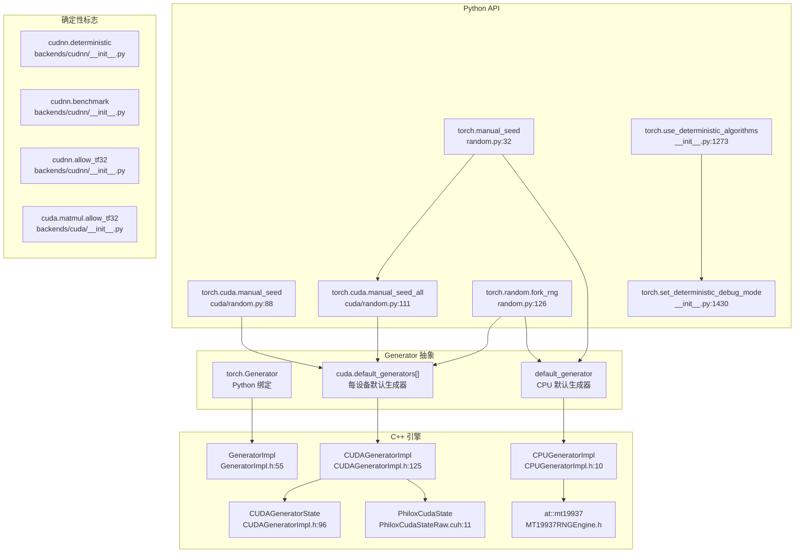

# 36. PyTorch 随机数生成与确定性系统

## 目录

- [36.1 整体架构](#361-整体架构)
- [36.2 CPU RNG：mt19937 引擎](#362-cpu-rngmt19937-引擎)
- [36.3 CUDA RNG：Philox 引擎](#363-cuda-rngphilox-引擎)
- [36.4 Generator 类层次](#364-generator-类层次)
- [36.5 Python RNG API](#365-python-rng-api)
- [36.6 fork_rng 与状态管理](#366-fork_rng-与状态管理)
- [36.7 CUDA Graph 安全的 RNG](#367-cuda-graph-安全的-rng)
- [36.8 确定性算法控制](#368-确定性算法控制)
- [36.9 cuDNN/cuBLAS 确定性标志](#369-cudnncublas-确定性标志)
- [36.10 设计权衡](#3610-设计权衡)
- [36.11 关键文件索引](#3611-关键文件索引)

---

## 36.1 整体架构

PyTorch 随机数生成系统分为三层：底层 C++ 引擎（mt19937/Philox）、中层 Generator 抽象、上层 Python API 与确定性控制。



---

## 36.2 CPU RNG：mt19937 引擎

### at::mt19937

```cpp
// aten/src/ATen/core/MT19937RNGEngine.h
// 基于 Mersenne Twister 算法的伪随机数生成器
// 自定义实现而非 std::mt19937，因为配合 at::uniform_real_distribution 更快

constexpr int MERSENNE_STATE_N = 624;    // 行 19: 状态数组大小
constexpr int MERSENNE_STATE_M = 397;    // 行 20: 递推偏移
constexpr uint32_t MATRIX_A = 0x9908b0df; // 行 21: 矩阵 A
constexpr uint32_t UMASK = 0x80000000;    // 行 22: 上掩码
constexpr uint32_t LMASK = 0x7fffffff;    // 行 23: 下掩码
```

### 为什么自定义 mt19937

PyTorch 选择自定义 `at::mt19937` 而非使用 `std::mt19937` 的原因：

1. `at::mt19937` + `at::uniform_real_distribution` 比 `std::mt19937` + `at::uniform_real_distribution` 更快
2. `std::uniform_real_distribution` 存在 [LWG2524 缺陷](http://open-std.org/JTC1/SC22/WG21/docs/lwg-active.html#2524)
3. 保持与现有分布测试的兼容性

### 默认种子

```cpp
// c10/core/GeneratorImpl.h:53
constexpr uint64_t default_rng_seed_val = 67280421310721;
// 选择一个具有良好 0/1 分布的大数
```

---

## 36.3 CUDA RNG：Philox 引擎

CUDA RNG 使用 Philox 随机数生成器（来自 cuRAND 库），与 CPU 的 mt19937 完全不同。

### Philox 的优势

- **并行友好**：每个线程可独立生成随机数，无需共享状态
- **可偏移**：通过 offset 参数确定性地跳转到序列中的任意位置
- **确定性**：给定相同 seed 和 offset，结果完全确定

### PhiloxCudaState

```cpp
// aten/src/ATen/cuda/detail/PhiloxCudaStateRaw.cuh:11
struct PhiloxCudaState {
    PhiloxCudaState() = default;

    // 非图捕获模式：直接传递 seed 和 offset
    PhiloxCudaState(uint64_t seed, uint64_t offset) {  // 行 14
        seed_.val = seed;
        offset_.val = offset;
    }

    // 图捕获模式：传递指针 + 图内偏移
    PhiloxCudaState(int64_t* seed,                     // 行 20
                    int64_t* offset_extragraph,
                    uint32_t offset_intragraph) {
        seed_.ptr = seed;
        offset_.ptr = offset_extragraph;
        offset_intragraph_ = offset_intragraph;
        captured_ = true;
    }

    union Payload {      // 行 32
        uint64_t val;    // 直接值模式
        int64_t* ptr;    // 指针模式（图捕获）
    };

    Payload seed_{};                    // 行 37
    Payload offset_{};                  // 行 38
    uint32_t offset_intragraph_ = 0;    // 行 39: 图内偏移
    bool captured_ = false;             // 行 40: 是否在图捕获中
};
```

### Philox 使用模式

```cpp
// 在 CUDA 内核中使用 PhiloxCudaState
__global__ void kernel(..., PhiloxCudaState philox_args) {
    auto seeds = at::cuda::philox::unpack(philox_args);
    curandStatePhilox4_32_10_t state;
    curand_init(
        std::get<0>(seeds),  // seed
        idx,                  // per-thread subsequence
        std::get<1>(seeds),  // offset in subsequence
        &state);
}

// 主机端调用
host_caller(...) {
    std::lock_guard<std::mutex> lock(gen->mutex_);
    PhiloxCudaState rng_engine_inputs = gen->philox_cuda_state(offset_increment);
    kernel<<<...>>>(..., rng_engine_inputs);
}
```

---

## 36.4 Generator 类层次

### GeneratorImpl（基类）

```cpp
// c10/core/GeneratorImpl.h:55
struct GeneratorImpl : public c10::intrusive_ptr_target {
    GeneratorImpl(Device device_in, DispatchKeySet key_set);  // 行 57

    // 纯虚方法
    virtual void set_current_seed(uint64_t seed) = 0;         // 行 70
    virtual void set_offset(uint64_t offset) = 0;             // 行 71
    virtual uint64_t get_offset() const = 0;                  // 行 72
    virtual uint64_t current_seed() const = 0;                // 行 73
    virtual uint64_t seed() = 0;                              // 行 74
    virtual void set_state(const TensorImpl& new_state) = 0;  // 行 75
    virtual intrusive_ptr<TensorImpl> get_state() const = 0;  // 行 76

    // CUDA Graph 安全方法
    virtual void graphsafe_set_state(                          // 行 77
        const intrusive_ptr<GeneratorImpl>& new_state);
    virtual intrusive_ptr<GeneratorImpl> graphsafe_get_state() const;  // 行 79

    Device device() const;                                     // 行 80
    std::mutex mutex_;                                         // 行 83: 线程安全锁

protected:
    Device device_;                                            // 行 98
    DispatchKeySet key_set_;                                   // 行 99
    PyObject* pyobj_ = nullptr;                                // 行 100: Python 对象指针
    virtual GeneratorImpl* clone_impl() const = 0;             // 行 102
};
```

### CPUGeneratorImpl

```cpp
// aten/src/ATen/CPUGeneratorImpl.h:10
struct CPUGeneratorImpl : public c10::GeneratorImpl {
    CPUGeneratorImpl(uint64_t seed_in = default_rng_seed_val); // 行 12

    void set_current_seed(uint64_t seed) override;             // 行 17
    void set_offset(uint64_t offset) override;                 // 行 18
    uint64_t get_offset() const override;                      // 行 19
    uint64_t current_seed() const override;                    // 行 20
    uint64_t seed() override;                                  // 行 21
    void set_state(const TensorImpl& new_state) override;      // 行 22
    intrusive_ptr<TensorImpl> get_state() const override;      // 行 23

    uint32_t random();                                         // 行 25
    uint64_t random64();                                       // 行 26
    std::optional<float> next_float_normal_sample();           // 行 27
    std::optional<double> next_double_normal_sample();          // 行 28
    at::mt19937 engine();                                      // 行 31
    void set_engine(at::mt19937 engine);                       // 行 32

private:
    at::mt19937 engine_;                                       // 行 36: Mersenne Twister 引擎
    std::optional<float> next_float_normal_sample_;            // 行 37: Box-Muller 缓存
    std::optional<double> next_double_normal_sample_;           // 行 38: Box-Muller 缓存
};
```

### CUDAGeneratorImpl

```cpp
// aten/src/ATen/cuda/CUDAGeneratorImpl.h:125
struct CUDAGeneratorImpl : public c10::GeneratorImpl {
    CUDAGeneratorImpl(DeviceIndex device_index = -1);           // 行 127
    CUDAGeneratorImpl(DeviceIndex device_index,
                       intrusive_ptr<CUDAGeneratorState> state_); // 行 128

    void set_current_seed(uint64_t seed) override;              // 行 135
    void set_offset(uint64_t offset) override;                  // 行 136
    uint64_t get_offset() const override;                       // 行 137
    uint64_t current_seed() const override;                     // 行 138
    uint64_t seed() override;                                   // 行 139

    void set_philox_offset_per_thread(uint64_t offset);         // 行 146
    uint64_t philox_offset_per_thread() const;                  // 行 147

    PhiloxCudaState philox_cuda_state(uint64_t increment);      // 行 154

    void register_graph(cuda::CUDAGraph* graph);                // 行 149
    void unregister_graph(cuda::CUDAGraph* graph);              // 行 150

private:
    intrusive_ptr<CUDAGeneratorState> state_;                   // 行 169
    std::atomic_flag no_reset_rnn_state_{};                     // 行 170
};
```

### CUDAGeneratorState

```cpp
// aten/src/ATen/cuda/CUDAGeneratorImpl.h:96
struct CUDAGeneratorState : public c10::intrusive_ptr_target {
    uint64_t seed_;                          // 行 97: Philox seed
    uint64_t philox_offset_per_thread_;      // 行 98: 每线程偏移
    uint32_t offset_intragraph_;             // 行 99: 图内偏移
    bool capturing_{};                       // 行 100: 是否在图捕获中
    std::unordered_set<cuda::CUDAGraph*> registered_graphs_;  // 行 101
    at::TensorBase seed_extragraph_{};       // 行 102: 图外 seed 张量
    at::TensorBase offset_extragraph_{};     // 行 103: 图外 offset 张量

    void increase(uint64_t increment);       // 行 113
    void capture_prologue();                 // 行 118
    uint64_t capture_epilogue();             // 行 120
    void replay_prologue(uint64_t increment); // 行 121
};
```

### Generator 实现对比

| 特性 | CPU (mt19937) | CUDA (Philox) |
|------|---------------|----------------|
| 引擎 | at::mt19937 | Philox 4x32-10 |
| 状态大小 | 624 × 32bit | seed(64bit) + offset(64bit) |
| 并行性 | 单线程 | 每线程独立 |
| 偏移支持 | 不直接支持 | 原生支持 offset |
| Graph 安全 | 不适用 | CUDAGeneratorState |
| 正态采样 | Box-Muller 缓存 | 内核内生成 |
| 默认实例 | default_generator | default_generators[device_id] |

---

## 36.5 Python RNG API

### torch.manual_seed

```python
# torch/random.py:32
def manual_seed(seed):
    """设置所有设备的随机种子
    1. 设置 CPU 默认生成器
    2. 设置所有 CUDA 设备
    3. 设置 MPS 设备
    4. 设置 XPU 设备
    5. 设置自定义设备（privateuse1）
    返回 CPU Generator 对象
    """
    seed = int(seed)
    if not torch.cuda._is_in_bad_fork():
        torch.cuda.manual_seed_all(seed)
    if not torch.mps._is_in_bad_fork():
        torch.mps.manual_seed(seed)
    if not torch.xpu._is_in_bad_fork():
        torch.xpu.manual_seed_all(seed)
    _seed_custom_device(seed)
    return default_generator.manual_seed(seed)
```

### torch.seed

```python
# torch/random.py:63
def seed():
    """使用非确定性随机数设置所有设备的种子
    返回用于种子的 64 位数值
    """
    seed = default_generator.seed()
    # 同步到所有设备...
    return seed
```

### torch.initial_seed

```python
# torch/random.py:113
def initial_seed():
    """返回 CPU 默认生成器的初始种子（Python long）"""
    return default_generator.initial_seed()
```

### torch.get_rng_state / set_rng_state

```python
# torch/random.py:22
def get_rng_state():
    """返回 CPU RNG 状态（ByteTensor）"""
    return default_generator.get_state()

# torch/random.py:10
def set_rng_state(new_state):
    """设置 CPU RNG 状态"""
    default_generator.set_state(new_state)
```

### CUDA RNG API

```python
# torch/cuda/random.py:88
def manual_seed(seed):
    """设置当前 GPU 的随机种子
    使用 _lazy_call 延迟执行，直到 CUDA 初始化
    """

# torch/cuda/random.py:111
def manual_seed_all(seed):
    """设置所有 GPU 的随机种子"""

# torch/cuda/random.py:23
def get_rng_state(device="cuda"):
    """返回指定 GPU 的 RNG 状态（ByteTensor）
    急切初始化 CUDA
    """

# torch/cuda/random.py:51
def set_rng_state(new_state, device="cuda"):
    """设置指定 GPU 的 RNG 状态
    克隆 new_state 避免共享内存问题
    """

# torch/cuda/random.py:45
def get_rng_state_all():
    """返回所有 GPU 的 RNG 状态列表"""

# torch/cuda/random.py:78
def set_rng_state_all(new_states):
    """设置所有 GPU 的 RNG 状态"""

# torch/cuda/random.py:130
def seed():
    """设置当前 GPU 的随机种子为非确定性随机数"""

# torch/cuda/random.py:149
def seed_all():
    """设置所有 GPU 的随机种子为相同的非确定性随机数"""

# torch/cuda/random.py:171
def initial_seed():
    """返回当前 GPU 的初始种子"""
```

### CUDA 延迟初始化

CUDA RNG 操作使用 `_lazy_call` 模式，避免在 CUDA 未初始化时触发错误：

```python
# torch/cuda/random.py:103
def manual_seed(seed):
    def cb():
        idx = current_device()
        default_generator = torch.cuda.default_generators[idx]
        default_generator.manual_seed(seed)
    _lazy_call(cb, seed=True)
```

`_is_in_bad_fork()` 检查防止在 fork 子进程中使用 CUDA（CUDA 不支持 fork 后使用）。

### API 汇总

| API | 位置 | 作用域 |
|-----|------|--------|
| `torch.manual_seed` | random.py:32 | 全部设备 |
| `torch.seed` | random.py:63 | 全部设备 |
| `torch.initial_seed` | random.py:113 | CPU |
| `torch.get_rng_state` | random.py:22 | CPU |
| `torch.set_rng_state` | random.py:10 | CPU |
| `torch.cuda.manual_seed` | cuda/random.py:88 | 当前 GPU |
| `torch.cuda.manual_seed_all` | cuda/random.py:111 | 所有 GPU |
| `torch.cuda.seed` | cuda/random.py:130 | 当前 GPU |
| `torch.cuda.seed_all` | cuda/random.py:149 | 所有 GPU |
| `torch.cuda.get_rng_state` | cuda/random.py:23 | 指定 GPU |
| `torch.cuda.set_rng_state` | cuda/random.py:51 | 指定 GPU |
| `torch.random.fork_rng` | random.py:126 | 指定设备 |

---

## 36.6 fork_rng 与状态管理

### fork_rng

```python
# torch/random.py:126
@contextlib.contextmanager
def fork_rng(devices=None, enabled=True, device_type="cuda"):
    """RNG 状态分叉上下文管理器

    1. 保存 CPU 和指定设备的 RNG 状态
    2. 执行用户代码
    3. 恢复保存的 RNG 状态

    用法：
    with torch.random.fork_rng():
        # 在此修改 RNG 状态
        a = torch.randn(3)
    # 离开后 RNG 状态恢复
    """
    cpu_rng_state = torch.get_rng_state()
    device_rng_states = [device_mod.get_rng_state(device) for device in devices]

    try:
        yield
    finally:
        torch.set_rng_state(cpu_rng_state)
        for device, device_rng_state in zip(devices, device_rng_states):
            device_mod.set_rng_state(device_rng_state, device)
```

### fork_rng 的使用场景

- **数据加载**：DataLoader worker 中的随机数生成
- **模型验证**：验证时使用独立 RNG 状态
- **测试**：确保测试不泄漏 RNG 状态
- **分布式训练**：保证不同进程的 RNG 独立性

### 多设备警告

```python
# torch/random.py:171
# 当设备数 > 1 且未指定 devices 时，fork_rng 发出警告：
# "CUDA reports that you have N available devices, and you have used
#  fork_rng without explicitly specifying which devices are being used.
#  For safety, we initialize *every* CUDA device by default..."
```

---

## 36.7 CUDA Graph 安全的 RNG

CUDA Graph 捕获期间的 RNG 处理是最复杂的部分。核心挑战：图内的 RNG 操作必须在每次重放时产生不同的结果，但图本身是固定的。

### 设计策略

```
图捕获阶段：
1. 记录所有 RNG 操作的 offset 增量
2. 使用 PhiloxCudaState 指针模式（captured_ = true）
3. seed 指向 seed_extragraph_ 张量
4. offset = offset_intragraph_ + *offset_extragraph_

图重放阶段：
1. 将当前 generator offset 填入 offset_extragraph_ 张量
2. 递增 generator offset（整个图的总量）
3. 图内各内核使用 intra-graph offset + *offset_extragraph
```

### CUDAGeneratorState 方法

```cpp
// CUDAGeneratorState 关键方法

void capture_prologue() {
    // 图捕获开始时调用
    // 重置 offset_intragraph_ = 0
    // 设置 capturing_ = true
}

uint64_t capture_epilogue() {
    // 图捕获结束时调用
    // 设置 capturing_ = false
    // 返回整个图的总 offset 增量（wholegraph_increment）
}

void replay_prologue(uint64_t wholegraph_increment) {
    // 图重放开始时调用
    // 将当前 offset 填入 offset_extragraph_ 张量
    // 递增 philox_offset_per_thread_ += wholegraph_increment
}
```

### PhiloxCudaState 双模式

| 模式 | seed 来源 | offset 来源 | 场景 |
|------|----------|------------|------|
| 直接值 | `seed_.val` (uint64_t) | `offset_.val` (uint64_t) | 正常执行 |
| 图捕获 | `seed_.ptr` (int64_t*) | `offset_.ptr` + `offset_intragraph_` | 图捕获/重放 |

---

## 36.8 确定性算法控制

### use_deterministic_algorithms

```python
# torch/__init__.py:1273
def use_deterministic_algorithms(mode, *, warn_only=False):
    """设置 PyTorch 操作是否必须使用确定性算法

    mode=True:
    - 有确定性实现的操作：使用确定性算法
    - 仅有非确定性实现的操作：抛出 RuntimeError

    mode=True, warn_only=True:
    - 仅有非确定性实现的操作：发出警告而非错误

    影响范围包括：
    - CUDA Conv1d/2d/3d: 使用确定性实现
    - CUDA ConvTranspose1d/2d/3d: 使用确定性实现
    - scatter_add_、index_add、gather 等: 确定性路径
    - AvgPool3d、MaxPool3d 等反向传播: 无确定性实现，抛出错误
    """
    _C._set_deterministic_algorithms(mode, warn_only=warn_only)
```

### 确定性 vs 非确定性操作分类

**有确定性实现的操作**（mode=True 时使用确定性路径）：

| 操作 | 条件 |
|------|------|
| Conv1d/2d/3d | CUDA 张量 |
| ConvTranspose1d/2d/3d | CUDA 张量 |
| scatter_add_ | CUDA 张量 |
| index_add | CUDA 张量 |
| gather | CUDA + requires_grad |
| index_put | accumulate=False 或 CPU |
| index_copy | CPU 或 CUDA |

**无确定性实现的操作**（mode=True 时抛出 RuntimeError）：

| 操作 | 条件 |
|------|------|
| AvgPool3d backward | CUDA |
| AdaptiveAvgPool2d/3d backward | CUDA |
| MaxPool3d backward | CUDA |
| FractionalMaxPool2d/3d | 任意 |
| interpolate backward | CUDA + linear/bilinear |
| NLLLoss | CUDA |
| CTCLoss backward | CUDA |
| EmbeddingBag backward | CUDA + mode='max' |

### set_deterministic_debug_mode

```python
# torch/__init__.py:1430
def set_deterministic_debug_mode(debug_mode):
    """确定性调试模式的替代接口

    | debug_mode | 行为 |
    |-----------|------|
    | "default" / 0 | 不检查非确定性 |
    | "warn" / 1 | 警告非确定性操作 |
    | "error" / 2 | 非确定性操作抛出错误 |
    """
```

### 查询函数

```python
# torch/__init__.py:1415
def are_deterministic_algorithms_enabled():
    """返回确定性算法是否启用"""

# torch/__init__.py:1422
def is_deterministic_algorithms_warn_only_enabled():
    """返回确定性算法是否仅警告模式"""

# torch/__init__.py:1474
def get_deterministic_debug_mode():
    """返回当前确定性调试模式值"""
```

### cuBLAS 确定性要求

```python
# CUDA 10.2+ 的某些操作需要设置环境变量：
# CUBLAS_WORKSPACE_CONFIG=:4096:8 或 CUBLAS_WORKSPACE_CONFIG=:16:8
# 影响 torch.mm、torch.mv、torch.bmm
```

---

## 36.9 cuDNN/cuBLAS 确定性标志

### cuDNN 标志

```python
# torch/backends/cudnn/__init__.py

# 行 127-130: 模块级状态
_benchmark = None         # 自动选择最优卷积算法
_benchmark_limit = None   # benchmark 搜索时间限制
_deterministic = None     # 强制确定性算法
_allow_tf32 = None        # 允许 TF32 精度

# 行 182-194: ContextProp 属性
deterministic = ContextProp(
    torch._C._get_cudnn_deterministic,
    torch._C._set_cudnn_deterministic
)

benchmark = ContextProp(
    torch._C._get_cudnn_benchmark,
    torch._C._set_cudnn_benchmark
)

allow_tf32 = ContextProp(
    torch._C._get_cudnn_allow_tf32,
    torch._C._set_cudnn_allow_tf32
)
```

### cuBLAS 标志

```python
# torch/backends/cuda/__init__.py

# 行 130-131: matmul.allow_tf32
class cuBLASModule:
    @property
    def allow_tf32(self):     # 行 130
        return torch._C._get_cublas_allow_tf32()

    @allow_tf32.setter        # 行 139
    def allow_tf32(self, value):
        torch._C._set_cublas_allow_tf32(value)
```

### 标志影响矩阵

| 标志 | 默认值 | 影响 |
|------|--------|------|
| `cudnn.deterministic` | False | True 时强制 cuDNN 使用确定性算法 |
| `cudnn.benchmark` | False | True 时自动搜索最快卷积算法（可能非确定性） |
| `cudnn.benchmark_limit` | 10 | benchmark 搜索时间限制（秒） |
| `cudnn.allow_tf32` | True | 允许 cuDNN 使用 TF32（精度较低但更快） |
| `cuda.matmul.allow_tf32` | True | 允许 cuBLAS matmul 使用 TF32 |

### 确定性配置建议

```python
# 完全确定性配置
torch.use_deterministic_algorithms(True)
torch.backends.cudnn.deterministic = True
torch.backends.cudnn.benchmark = False
# 注意：确定性算法通常更慢
```

---

## 36.10 设计权衡

| 权衡点 | 选择 | 原因 |
|--------|------|------|
| CPU 引擎 | 自定义 mt19937 | 配合自定义 uniform_real_distribution 更快，且避免 LWG2524 缺陷 |
| CUDA 引擎 | Philox | 并行友好，支持 offset，适合 GPU 架构 |
| 默认 Generator | 每设备一个 | 方便用户，但多线程共享需加锁 |
| Generator 线程安全 | mutex_ 保护 | 历史原因，性能不如无锁设计 |
| CUDA 延迟初始化 | _lazy_call | 避免在不需要 CUDA 时触发初始化开销 |
| fork_rng 默认全设备 | 安全优先 | 避免遗漏设备导致状态泄漏，但多设备时较慢 |
| 确定性 vs 性能 | 默认非确定性 | 确定性算法通常更慢，用户按需开启 |
| TF32 默认开启 | 性能优先 | TF32 精度降低但速度显著提升 |
| CUDA Graph RNG | 双模式 PhiloxCudaState | 兼顾正常执行和图捕获，但实现复杂 |
| Box-Muller 缓存 | optional 缓存 | 每两次调用生成一对正态样本，减少浪费 |
| philox_offset_per_thread | 每次操作递增 | 确保连续操作产生不同随机数，但需精确管理 |

---

## 36.11 关键文件索引

| 文件 | 核心内容 |
|------|----------|
| `torch/random.py` | manual_seed、seed、fork_rng、get/set_rng_state |
| `torch/cuda/random.py` | CUDA manual_seed、get/set_rng_state |
| `torch/__init__.py` | use_deterministic_algorithms、set_deterministic_debug_mode |
| `c10/core/GeneratorImpl.h` | GeneratorImpl 基类定义 |
| `aten/src/ATen/CPUGeneratorImpl.h` | CPUGeneratorImpl（mt19937 引擎） |
| `aten/src/ATen/cuda/CUDAGeneratorImpl.h` | CUDAGeneratorImpl、CUDAGeneratorState |
| `aten/src/ATen/cuda/detail/PhiloxCudaStateRaw.cuh` | PhiloxCudaState 定义 |
| `aten/src/ATen/core/MT19937RNGEngine.h` | at::mt19937 自定义实现 |
| `torch/backends/cudnn/__init__.py` | cuDNN deterministic/benchmark/allow_tf32 |
| `torch/backends/cuda/__init__.py` | cuBLAS matmul.allow_tf32 |