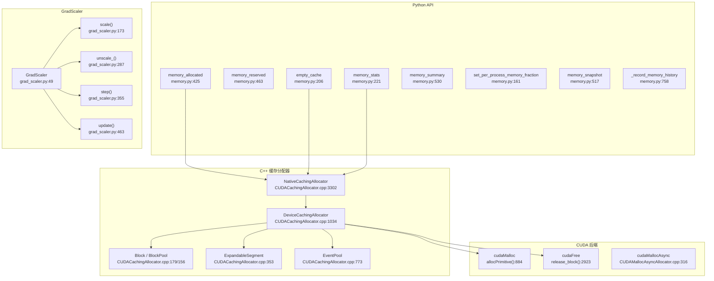
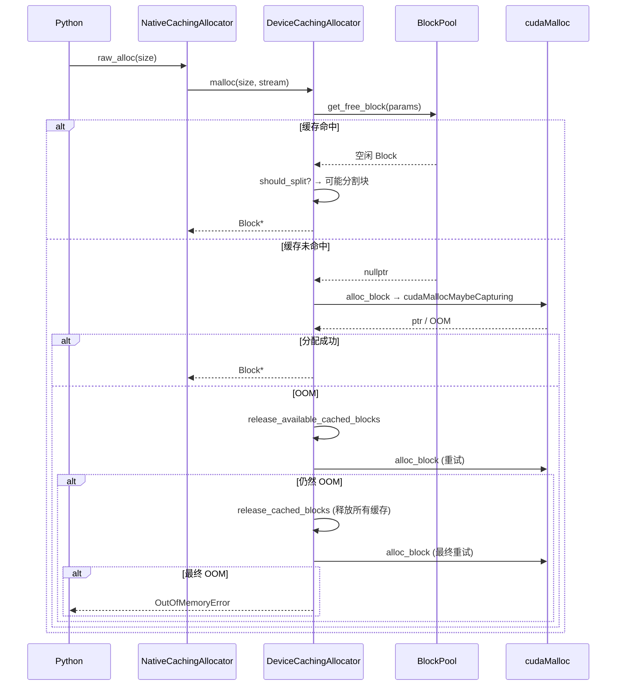

# 37. PyTorch CUDA 内存管理系统

## 目录

- [37.1 整体架构](#371-整体架构)
- [37.2 Caching Allocator 核心数据结构](#372-caching-allocator-核心数据结构)
- [37.3 DeviceCachingAllocator](#373-devicecachingallocator)
- [37.4 内存分配流程](#374-内存分配流程)
- [37.5 OOM 处理与重试机制](#375-oom-处理与重试机制)
- [37.6 ExpandableSegment](#376-expandablesegment)
- [37.7 CudaMallocAsync 后端](#377-cudamalloccasync-后端)
- [37.8 Python 内存 API](#378-python-内存-api)
- [37.9 内存快照与调试](#379-内存快照与调试)
- [37.10 GradScaler 混合精度](#3710-gradscaler-混合精度)
- [37.11 设计权衡](#3711-设计权衡)
- [37.12 关键文件索引](#3712-关键文件索引)

---

## 37.1 整体架构

PyTorch CUDA 内存管理采用缓存分配器（Caching Allocator）架构，避免频繁调用 cudaMalloc/cudaFree。



---

## 37.2 Caching Allocator 核心数据结构

### 关键常量

```cpp
// c10/cuda/CUDACachingAllocator.cpp
constexpr size_t kMinBlockSize = 512;           // 行 121: 最小块大小
constexpr size_t kSmallSize = 1048576;          // 行 123: 小块阈值 (1 MiB)
constexpr size_t kSmallBuffer = 2097152;        // 行 124: 小块段大小 (2 MiB)
constexpr size_t kLargeBuffer = 20971520;       // 行 51: 大块段大小 (20 MiB)
constexpr size_t kMinLargeAlloc = 10485760;     // 行 126: 大分配阈值 (10 MiB)
constexpr size_t kRoundLarge = 2097152;         // 行 128: 大块对齐 (2 MiB)
```

### Block

```cpp
// c10/cuda/CUDACachingAllocator.cpp:179
struct Block {
    int device;              // CUDA 设备号
    cudaStream_t stream;     // 关联的 CUDA 流
    size_t size;             // 块大小
    BlockPool* pool;         // 所属池
    void* ptr;               // GPU 内存指针
    bool allocated;          // 是否已分配
    Block* prev;             // 双向链表前驱
    Block* next;             // 双向链表后继
    int gc_count;            // GC 计数器
    ExpandableSegment* expandable_segment_;  // 行 205: 可扩展段

    Block(device, stream, size, pool, ptr);    // 行 206
    bool is_split();                           // 行 228: 是否被分割
    void splice(Block* other);                 // 行 231: 链表拼接
};
```

### BlockPool

```cpp
// c10/cuda/CUDACachingAllocator.cpp:156
struct BlockPool {
    BlockPool(bool small, DeviceCachingAllocator* allocator)
        : blocks(comparator), small(small), allocator(allocator) {}
    std::set<Block*, BlockComparator> blocks;  // 按 size 排序的空闲块集合
    bool small;                                 // 小块池 vs 大块池
    DeviceCachingAllocator* allocator;
};
```

### 每设备的两个 BlockPool

```
DeviceCachingAllocator
  ├── small_blocks: BlockPool(small=true)   → 管理小于 kSmallSize 的块
  └── large_blocks: BlockPool(small=false)  → 管理大于等于 kSmallSize 的块
```

### TraceEntry

```cpp
// c10/cuda/CUDACachingAllocator.h:95
struct TraceEntry {
    enum Action {
        ALLOC,            // 分配
        FREE_REQUESTED,   // 释放请求
        FREE_COMPLETED,   // 释放完成
        SEGMENT_ALLOC,    // 段分配（cudaMalloc）
        SEGMENT_FREE,     // 段释放（cudaFree）
        SEGMENT_MAP,      // 段映射
        SEGMENT_UNMAP,    // 段取消映射
        SNAPSHOT,         // 快照
        OOM               // 内存不足
    };
};
```

---

## 37.3 DeviceCachingAllocator

### 核心类

```cpp
// c10/cuda/CUDACachingAllocator.cpp:1034
class DeviceCachingAllocator {
    // === 分配与释放 ===
    Block* malloc(size_t size, cudaStream_t stream);               // 行 1185
    void free(Block* block);                                       // 行 1469
    void recordStream(Block* block, cudaStream_t stream);          // 行 1569

    // === 内存池管理 ===
    void setMemoryFraction(double fraction);                       // 行 1596
    void emptyCache();                                             // 行 1606
    void cacheInfo(int device_id, size_t* largest, size_t* total); // 行 1613

    // === 统计 ===
    DeviceStats getStats();                                        // 行 1631
    void resetAccumulatedStats();                                  // 行 1637
    void resetPeakStats();                                         // 行 1663

    // === 内部查找 ===
    Block* get_free_block(AllocParams* params);                    // 行 2560
    bool should_split(const Block* block, size_t size);            // 行 2540
    void free_block(Block* block);                                 // 行 2397
    void try_merge_blocks(Block* dst, Block* src, BlockPool* pool);// 行 2474

    // === 段管理 ===
    Block* alloc_block(AllocParams* params, ...);                  // 行 2693: 调用 cudaMalloc
    void release_cached_blocks();                                  // 行 2859: 释放缓存块
    void release_available_cached_blocks();                        // 行 2811: 释放可用缓存块
    void release_block(Block* block);                              // 行 2923: 释放单个块

    // === 事件同步 ===
    void synchronize_and_free_events();                            // 行 3077
    void process_events();                                         // 行 3177

    // === 可扩展段 ===
    Block* find_expandable_block(...);                             // 行 2239
    Block* try_allocate_expandable_block(...);                     // 行 2363

    // === OOM / 调试 ===
    void recordHistory(...);                                       // 行 1116
    void attachOutOfMemoryObserver(...);                           // 行 1165
    void attachAllocatorTraceTracker(...);                         // 行 1169
};
```

### NativeCachingAllocator

```cpp
// c10/cuda/CUDACachingAllocator.cpp:3302
class NativeCachingAllocator : public CUDAAllocator {
    void init(DeviceIdx device_count);                  // 行 3354
    void malloc(void** devPtr, int device, size_t size, // 行 3369
                cudaStream_t stream);
    void free(void* ptr);                               // 行 3389
    void setMemoryFraction(double fraction, int device);// 行 3415
    void emptyCache();                                  // 行 3486
    void enable(bool flag);                             // 行 3491
    bool isEnabled();                                   // 行 3495
    void* raw_alloc(size_t nbytes);                     // 行 3716
    void raw_delete(void* ptr);                         // 行 3786
    SnapshotInfo snapshot();                            // 行 3536
    const char* name() { return "native"; }             // 行 3907
};
```

---

## 37.4 内存分配流程

### malloc 主流程

```cpp
// c10/cuda/CUDACachingAllocator.cpp:1185
Block* DeviceCachingAllocator::malloc(size_t size, cudaStream_t stream) {
    // 1. 选择池（small 或 large）
    // 2. 尝试从缓存获取空闲块
    //    get_free_block(params)  → 行 2560
    // 3. 缓存未命中：尝试分配新段
    //    alloc_block(params)     → 行 2693
    // 4. OOM 重试：
    //    release_available_cached_blocks → 行 2811
    //    release_cached_blocks           → 行 2859
    // 5. 仍然 OOM：抛出 OutOfMemoryError
}
```

### 分配流程序列



### 块分割与合并

```
should_split(block, size):  // 行 2540
  当 block->size >= 2 * size 时，将块分割为两部分

free_block(block):  // 行 2397
  1. 标记 block 为未分配
  2. 尝试与相邻块合并 (try_merge_blocks)
  3. 将合并后的块放回 BlockPool
```

---

## 37.5 OOM 处理与重试机制

### OOM 重试逻辑

```cpp
// c10/cuda/CUDACachingAllocator.cpp:1234
block_found = alloc_block(params, false, context, lock)
    || (release_available_cached_blocks(params, context) &&
        alloc_block(params, false, context, lock))
    || (C10_LIKELY(captures_underway.empty()) &&
        release_cached_blocks(context) &&
        alloc_block(params, true, context, lock));
```

三阶段重试策略：

| 阶段 | 操作 | 说明 |
|------|------|------|
| 1 | alloc_block(false) | 直接尝试 cudaMalloc |
| 2 | release_available + alloc_block | 释放可用缓存后重试 |
| 3 | release_cached + alloc_block(true) | 释放所有缓存后最终重试 |

### OOM 错误报告

```cpp
// c10/cuda/CUDACachingAllocator.cpp:1261-1338
// 1. 记录 OOM trace
stats.num_ooms += 1;                          // 行 1268
c10::reportOutOfMemoryToProfiler();            // 行 1270

// 2. 通知 OOM 观察者
for (auto& obs : oom_observers) { obs(...); } // 行 1284, 1313

// 3. 抛出异常
TORCH_CHECK_WITH(OutOfMemoryError, false,     // 行 1338
    "CUDA out of memory. Tried to allocate %s ...");
```

### Python OutOfMemoryError

```python
# torch/cuda/__init__.py:273
OutOfMemoryError = torch._C.OutOfMemoryError
```

---

## 37.6 ExpandableSegment

ExpandableSegment 是一种可扩展的内存段，支持按需映射和取消映射虚拟内存。

```cpp
// c10/cuda/CUDACachingAllocator.cpp:353
struct ExpandableSegment {
    // 核心方法
    bool map(size_t size);                       // 行 384: 映射虚拟内存
    bool unmap(size_t size);                     // 行 427: 取消映射虚拟内存
    ShareableHandle share();                     // 行 442: 共享句柄
    static ExpandableSegment* fromShared(...);   // 行 462: 从共享句柄恢复
};
```

### ExpandableSegment 优势

- **按需增长**：不需要预先分配大量内存
- **按需收缩**：不再使用的内存可以取消映射
- **跨进程共享**：通过 ShareableHandle 支持

### 传统段 vs 可扩展段

| 特性 | 传统段 | ExpandableSegment |
|------|--------|-------------------|
| 分配方式 | cudaMalloc 整段 | 虚拟内存按需 map/unmap |
| 大小 | 固定 | 动态增长/收缩 |
| 碎片 | 段间可能产生碎片 | 减少段间碎片 |
| 性能 | 较快 | 略慢（需要映射操作） |

---

## 37.7 CudaMallocAsync 后端

PyTorch 支持使用 CUDA 内置的 cudaMallocAsync 作为替代后端。

```cpp
// c10/cuda/CUDAMallocAsyncAllocator.cpp

struct CudaMallocAsyncAllocator : public CUDAAllocator {  // 行 407
    void* allocate(size_t size);            // 行 408
    void init(int device_count);            // 行 429
    void setMemoryFraction(double frac);    // 行 467
    void emptyCache();                      // 行 498
    void cacheInfo(...);                    // 行 521
    void recordStream(...);                 // 行 609
};
```

### 核心函数

```cpp
// 行 316: 使用 cudaMallocAsync 分配
void* mallocAsync(size_t size, int device, cudaStream_t stream);

// 行 272: 使用 cudaFreeAsync 释放
void freeAsync(void* ptr, int device, cudaStream_t stream);
```

### Native vs CudaMallocAsync

| 特性 | Native (默认) | CudaMallocAsync |
|------|--------------|-----------------|
| 分配 | cudaMalloc | cudaMallocAsync |
| 释放 | cudaFree | cudaFreeAsync |
| 缓存管理 | 自定义 BlockPool | CUDA 驱动管理 |
| 流感知 | 手动 recordStream | 自动流同步 |
| 碎片控制 | 自定义合并策略 | 依赖驱动 |
| 启用方式 | 默认 | PYTORCH_CUDA_ALLOC_CONF=backend:cuda_malloc_async |

---

## 37.8 Python 内存 API

### 查询函数

```python
# torch/cuda/memory.py

# 行 425: 当前张量占用的 GPU 内存（字节）
def memory_allocated(device=None):
    return stats.allocation.current

# 行 442: 张量占用的最大 GPU 内存
def max_memory_allocated(device=None):
    return stats.allocation.peak

# 行 463: 缓存分配器管理的 GPU 内存（字节）
def memory_reserved(device=None):
    return stats.reserved.current

# 行 478: 缓存分配器管理的最大 GPU 内存
def max_memory_reserved(device=None):
    return stats.reserved.peak
```

### 控制函数

```python
# torch/cuda/memory.py

# 行 206: 释放未占用的缓存内存
def empty_cache():
    """调用 C++ 层 emptyCache()"""

# 行 161: 设置进程内存比例上限
def set_per_process_memory_fraction(fraction, device=None):
    """限制 CUDA 内存使用比例为 fraction (0.0-1.0)"""

# 行 190: 获取进程内存比例上限
def get_per_process_memory_fraction(device=None):

# 行 334: 重置累积统计
def reset_accumulated_memory_stats(device=None):

# 行 354: 重置峰值统计
def reset_peak_memory_stats(device=None):
```

### 统计函数

```python
# torch/cuda/memory.py

# 行 221: 返回内存统计字典
def memory_stats(device=None):
    """返回包含 allocation, allocated, segment, active, inactive 等统计"""

# 行 530: 人类可读的内存统计摘要
def memory_summary(device=None, abbreviated=False):
    """打印格式化的内存统计表"""

# 行 722: GPU 全局空闲和总内存
def mem_get_info(device=None):
    """调用 cudaMemGetInfo 返回 (free, total)"""
```

### 调试函数

```python
# torch/cuda/memory.py

# 行 657: 列出占用 GPU 内存的进程
def list_gpu_processes(device=None):
    """使用 nvidia-smi 或 amd-smi 查询"""

# 行 517: 内存快照
def memory_snapshot(device=None):
    """返回分配器状态的快照"""

# 行 758: 记录内存历史
def _record_memory_history(enabled, context, stacks, max_entries):
    """启用/禁用分配栈追踪"""
```

### 内存统计层次

```
memory_reserved    ─── 缓存分配器从 CUDA 申请的总内存
  ├── memory_allocated  ─── 张量实际占用的内存
  └── (空闲缓存)        ─── 可被 empty_cache 释放的部分
```

### MemPool 系统

```python
# torch/cuda/memory.py

class MemPool:                  # 行 1021: 内存池
class MemPoolContext:           # 行 1002: 内存池上下文
def use_mem_pool(pool):         # 行 1070: 使用指定内存池的上下文管理器
class CUDAPluggableAllocator:  # 行 947: 可插拔分配器
def change_current_allocator(): # 行 979: 切换分配器
```

---

## 37.9 内存快照与调试

### 内存快照数据结构

```cpp
// c10/cuda/CUDACachingAllocator.h

struct BlockInfo {       // 行 60
    int device;
    size_t size;
    bool allocated;
    bool expandable;
    bool requested_size;
};

struct SegmentInfo {     // 行 71
    int device;
    size_t allocated_size;
    size_t total_size;
    bool expandable;
    std::vector<BlockInfo> blocks;
};

struct SnapshotInfo {    // 行 164
    std::vector<SegmentInfo> segments;
    std::vector<TraceEntry> traces;
    std::unordered_map<std::string, std::string> device_traces;
};
```

### 记录配置

```cpp
// c10/cuda/CUDACachingAllocator.h

enum class RecordContext {   // 行 179
    NEVER,    // 不记录
    STATE,    // 仅记录状态
    ALLOC,    // 记录分配
    ALL       // 记录所有操作
};
```

### Python 快照 API

```python
# torch/cuda/memory.py

def _snapshot():               # 行 816: 详细内存快照
def _dump_snapshot(path):      # 行 893: 保存快照到文件
def _save_segment_usage(path): # 行 907: 段使用可视化
def _save_memory_usage(path):  # 行 914: 内存使用可视化
def _set_allocator_settings(): # 行 921: 配置分配器
def get_allocator_backend():   # 行 925: 返回分配器后端名
```

### 环境变量配置

```
PYTORCH_CUDA_ALLOC_CONF:
  - backend:cuda_malloc_async   → 使用 CudaMallocAsync 后端
  - max_split_size_mb:N         → 最大分割大小
  - expandable_segments:True    → 启用可扩展段
  - garbage_collection_threshold:N → GC 阈值

PYTORCH_NO_CUDA_MEMORY_CACHING=1 → 禁用缓存，直接 cudaMalloc
```

---

## 37.10 GradScaler 混合精度

### GradScaler 类

```python
# torch/amp/grad_scaler.py:49
class GradScaler:
    """混合精度训练的梯度缩放器
    防止 fp16 梯度下溢导致参数更新失败
    """
```

### 状态机

```python
# torch/amp/grad_scaler.py:39
class OptState(Enum):
    READY = 0      # 初始状态
    UNSCALED = 1   # unscale_() 已调用
    STEPPED = 2    # step() 已调用
```

### 核心方法

```python
# torch/amp/grad_scaler.py:119
def __init__(self, device="cuda", init_scale=2.**16,
             growth_factor=2.0, backoff_factor=0.5,
             growth_interval=1000, enabled=True):

# torch/amp/grad_scaler.py:173
def scale(self, outputs):
    """缩放输出（乘以 scale factor）"""

# torch/amp/grad_scaler.py:287
def unscale_(self, optimizer):
    """反缩放梯度（除以 scale factor）
    检查 inf/nan 梯度"""

# torch/amp/grad_scaler.py:355
def step(self, optimizer, *args, **kwargs):
    """执行优化器步骤
    若检测到 inf/nan：跳过此步
    否则：应用梯度更新
    """

# torch/amp/grad_scaler.py:463
def update(self, new_scale=None):
    """更新 scale factor
    若有 inf/nan：scale *= backoff_factor
    否则：growth_tracker += 1，达到 growth_interval 时 scale *= growth_factor
    """
```

### GradScaler 工作流

```mermaid
sequenceDiagram
    participant User
    participant GS as GradScaler
    participant Opt as Optimizer
    participant Model

    User->>GS: scaler.scale(loss)
    GS-->>User: loss * scale

    User->>GS: scaler.backward(scaled_loss)
    Note over Model: 梯度被缩放

    User->>GS: scaler.unscale_(optimizer)
    GS->>Opt: 梯度 /= scale
    GS->>GS: 检查 inf/nan

    User->>GS: scaler.step(optimizer)
    alt 无 inf/nan
        GS->>Opt: optimizer.step()
    else 有 inf/nan
        GS-->>User: 跳过此步
    end

    User->>GS: scaler.update()
    alt 无 inf/nan 且 growth_tracker >= interval
        GS->>GS: scale *= growth_factor
    else 有 inf/nan
        GS->>GS: scale *= backoff_factor
    end
```

### 辅助方法

```python
# torch/amp/grad_scaler.py
def get_scale(self):              # 行 536: 返回当前 scale
def get_growth_factor(self):      # 行 550
def set_growth_factor(self, f):   # 行 554
def get_backoff_factor(self):     # 行 562
def set_backoff_factor(self, f):  # 行 566
def get_growth_interval(self):    # 行 574
def set_growth_interval(self, i): # 行 578
def is_enabled(self):             # 行 595
def state_dict(self):             # 行 599
def load_state_dict(self, sd):    # 行 626
```

---

## 37.11 设计权衡

| 权衡点 | 选择 | 原因 |
|--------|------|------|
| 缓存分配器 vs 直接分配 | 缓存 | 减少 cudaMalloc/cudaFree 开销，但增加内存占用 |
| 双池设计 | small + large | 小块和大块分开管理减少碎片，但增加复杂度 |
| 块分割 | 按 512 字节对齐 | 减少内部碎片，但可能浪费少量空间 |
| OOM 重试 | 三阶段 | 尽可能满足分配请求，但增加延迟 |
| ExpandableSegment | 可选启用 | 减少段间碎片，但依赖虚拟内存 API |
| CudaMallocAsync 后端 | 可选 | 利用 CUDA 驱动优化，但调试困难 |
| 事件同步 | 延迟释放 | 等待流完成再释放块，避免竞态条件 |
| GradScaler 默认 init_scale | 2^16 | 适配 fp16 动态范围，但可能过大 |
| growth_factor = 2.0 | 指数增长 | 快速恢复 scale，但可能过冲 |
| backoff_factor = 0.5 | 减半 | 避免持续 inf/nan，但可能欠缩放 |
| 内存快照 | 按需开启 | 完整追踪开销大，仅在调试时启用 |
| per-process memory fraction | 可选限制 | 防止单进程占用全部 GPU 内存 |

---

## 37.12 关键文件索引

| 文件 | 核心内容 |
|------|----------|
| `c10/cuda/CUDACachingAllocator.h` | CUDAAllocator 接口、BlockInfo、TraceEntry、SnapshotInfo |
| `c10/cuda/CUDACachingAllocator.cpp` | DeviceCachingAllocator、NativeCachingAllocator、Block/BlockPool |
| `c10/cuda/CUDAMallocAsyncAllocator.cpp` | CudaMallocAsync 替代后端 |
| `c10/cuda/CUDAAllocatorConfig.h` | 分配器配置 |
| `c10/core/CachingDeviceAllocator.h` | DeviceStats 基类 |
| `torch/cuda/memory.py` | Python 内存 API（allocated/reserved/empty_cache/snapshot） |
| `torch/cuda/__init__.py` | OutOfMemoryError、utilization、device_memory_used |
| `torch/amp/grad_scaler.py` | GradScaler 实现 |
| `torch/cuda/amp/grad_scaler.py` | GradScaler 的 CUDA 兼容薄包装 |