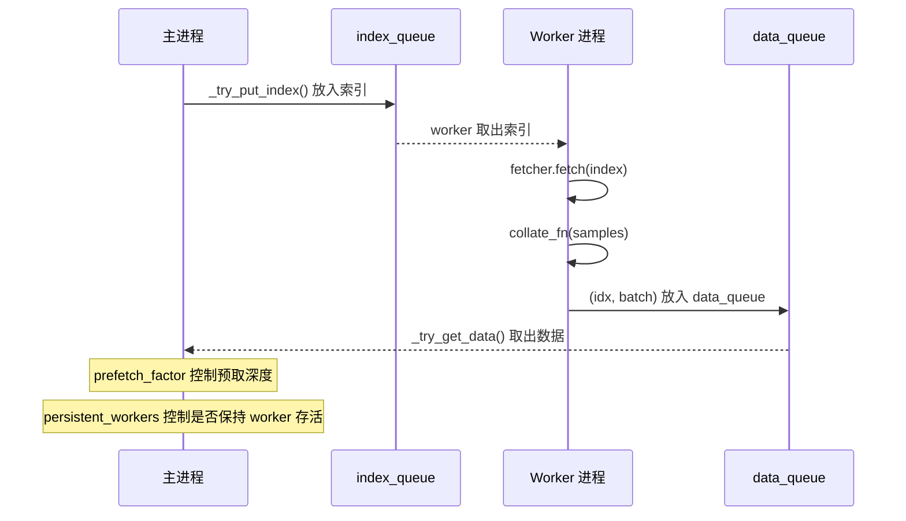

# 38. PyTorch DataLoader 与数据管道系统

## 目录

- [38.1 整体架构](#381-整体架构)
- [38.2 Dataset 类层次](#382-dataset-类层次)
- [38.3 Sampler 类层次](#383-sampler-类层次)
- [38.4 DataLoader 主类](#384-dataloader-主类)
- [38.5 迭代器实现](#385-迭代器实现)
- [38.6 Worker 多进程](#386-worker-多进程)
- [38.7 Collate 与 Fetcher](#387-collate-与-fetcher)
- [38.8 DistributedSampler](#388-distributedsampler)
- [38.9 设计权衡](#389-设计权衡)
- [38.10 关键文件索引](#3810-关键文件索引)

---

## 38.1 整体架构

DataLoader 是 PyTorch 数据加载的核心，连接 Dataset、Sampler、Collate 三个组件。

```mermaid
graph TB
    subgraph "Dataset"
        DS["Dataset<br/>dataset.py:42"]
        IDS["IterableDataset<br/>dataset.py:76"]
        TD["TensorDataset<br/>dataset.py:192"]
        SD["StackDataset<br/>dataset.py:216"]
        CD["ConcatDataset<br/>dataset.py:303"]
        CHD["ChainDataset<br/>dataset.py:360"]
        SUB["Subset<br/>dataset.py:392"]
        RS["random_split<br/>dataset.py:425"]
    end

    subgraph "Sampler"
        SAMP["Sampler<br/>sampler.py:31"]
        SEQ["SequentialSampler<br/>sampler.py:113"]
        RND["RandomSampler<br/>sampler.py:132"]
        SRS["SubsetRandomSampler<br/>sampler.py:207"]
        WRS["WeightedRandomSampler<br/>sampler.py:229"]
        BS["BatchSampler<br/>sampler.py:294"]
        DIST["DistributedSampler<br/>distributed.py:16"]
    end

    subgraph "DataLoader"
        DL["DataLoader<br/>dataloader.py:130"]
        SPI["_SingleProcessDataLoaderIter<br/>dataloader.py:740"]
        MPI["_MultiProcessingDataLoaderIter<br/>dataloader.py:770"]
    end

    subgraph "Worker"
        WL["_worker_loop<br/>worker.py:228"]
        WI["WorkerInfo<br/>worker.py:76"]
    end

    subgraph "Collate/Fetch"
        DC["default_collate<br/>collate.py:337"]
        CV["default_convert<br/>collate.py:23"]
        CL["collate()<br/>collate.py:118"]
        MF["_MapDatasetFetcher<br/>fetch.py:46"]
        IF["_IterableDatasetFetcher<br/>fetch.py:19"]
    end

    DL --> DS
    DL --> IDS
    DL --> SAMP
    DL --> SPI
    DL --> MPI
    MPI --> WL
    WL --> WI
    SPI --> MF
    SPI --> IF
    MF --> DC
    IF --> CV
```



---

## 38.2 Dataset 类层次

### Dataset（基类）

```python
# torch/utils/data/dataset.py:42
class Dataset(Generic[_T_co]):
    """所有数据集的基类
    子类必须实现 __getitem__ 和 __len__
    """
    def __getitem__(self, index) -> _T_co:   # 行 61
        raise NotImplementedError

    def __add__(self, other):                  # 行 68
        return ConcatDataset([self, other])
```

### IterableDataset

```python
# torch/utils/data/dataset.py:76
class IterableDataset(Dataset[_T_co], Iterable[_T_co]):
    """可迭代数据集
    适用于流式数据（如从网络/文件逐行读取）
    子类必须实现 __iter__
    """
    def __add__(self, other):                  # 行 185
        return ChainDataset([self, other])
```

### TensorDataset

```python
# torch/utils/data/dataset.py:192
class TensorDataset(Dataset[tuple[Tensor, ...]]):
    """将多个张量包装为数据集
    每个张量的第一维大小必须相同
    """
    def __init__(self, *tensors):              # 行 203
        assert all(t.shape[0] == tensors[0].shape[0] for t in tensors)

    def __getitem__(self, index):              # 行 209
        return tuple(tensor[index] for tensor in self.tensors)

    def __len__(self):                         # 行 212
        return self.tensors[0].size(0)
```

### StackDataset

```python
# torch/utils/data/dataset.py:216
class StackDataset(Dataset[_T_stack]):
    """将多个命名数据集堆叠
    支持不同类型的数据（如 image + label + mask）
    """
    def __init__(self, **named_datasets):      # 行 237
    def __getitem__(self, index):              # 行 257
    def __getitems__(self, indices):           # 行 262
    def __len__(self):                         # 行 299
```

### ConcatDataset

```python
# torch/utils/data/dataset.py:303
class ConcatDataset(Dataset[_T_co]):
    """拼接多个数据集
    自动计算累积大小和索引映射
    """
    @staticmethod
    def cumsum(sequence):                      # 行 316

    def __init__(self, datasets):              # 行 324
        self.datasets = datasets
        self.cumulative_sizes = self.cumsum(datasets)

    def __len__(self):                         # 行 334
        return self.cumulative_sizes[-1]

    def __getitem__(self, idx):                # 行 337
        # 通过二分查找定位到子数据集
        dataset_idx = bisect.bisect_right(self.cumulative_sizes, idx)
```

### ChainDataset

```python
# torch/utils/data/dataset.py:360
class ChainDataset(IterableDataset):
    """链接多个 IterableDataset
    依次迭代，不拼接索引
    """
    def __init__(self, datasets):              # 行 371
    def __iter__(self):                        # 行 375
        for dataset in self.datasets:
            yield from dataset
```

### Subset

```python
# torch/utils/data/dataset.py:392
class Subset(Dataset[_T_co]):
    """数据集子集
    通过索引列表选择子集
    """
    def __init__(self, dataset, indices):      # 行 404
    def __getitem__(self, idx):                # 行 408
        return self.dataset[self.indices[idx]]
    def __getitems__(self, indices):           # 行 413
    def __len__(self):                         # 行 421
```

### random_split

```python
# torch/utils/data/dataset.py:425
def random_split(dataset, lengths, generator=None):
    """随机分割数据集为多个不重叠子集"""
```

### Dataset 对比

| 类 | 行号 | 基类 | 访问方式 | 典型场景 |
|----|------|------|---------|---------|
| `Dataset` | 42 | Generic | `__getitem__(index)` | 自定义数据集 |
| `IterableDataset` | 76 | Dataset, Iterable | `__iter__()` | 流式数据 |
| `TensorDataset` | 192 | Dataset | `__getitem__` | 张量数据 |
| `StackDataset` | 216 | Dataset | `__getitem__` | 多模态数据 |
| `ConcatDataset` | 303 | Dataset | `__getitem__` | 拼接数据集 |
| `ChainDataset` | 360 | IterableDataset | `__iter__` | 链接流式数据 |
| `Subset` | 392 | Dataset | `__getitem__` | 子集选择 |

---

## 38.3 Sampler 类层次

### Sampler（基类）

```python
# torch/utils/data/sampler.py:31
class Sampler(Generic[_T_co]):
    """采样器基类
    子类必须实现 __iter__ 返回索引序列
    """
    def __init__(self, data_source=None):      # 行 73
    def __iter__(self):                        # 行 82
        raise NotImplementedError
```

### SequentialSampler

```python
# torch/utils/data/sampler.py:113
class SequentialSampler(Sampler[int]):
    """顺序采样：按索引 0, 1, 2, ... 顺序"""
    def __iter__(self):                        # 行 125
        return iter(range(len(self.data_source)))
```

### RandomSampler

```python
# torch/utils/data/sampler.py:132
class RandomSampler(Sampler[int]):
    """随机采样
    replacement=False: 无放回随机排列
    replacement=True: 有放回随机采样
    num_samples: 采样数量
    """
    def __init__(self, data_source, replacement=False,  # 行 147
                 num_samples=None, generator=None):

    @property
    def num_samples(self):                     # 行 170

    def __iter__(self):                        # 行 176
        if self.replacement:
            # 有放回: randperm 重复采样
        else:
            # 无放回: randperm 全排列
```

### SubsetRandomSampler

```python
# torch/utils/data/sampler.py:207
class SubsetRandomSampler(Sampler[int]):
    """对指定索引子集进行随机采样（无放回）"""
    def __init__(self, indices, generator=None):  # 行 217
    def __iter__(self):                            # 行 221
        return (self.indices[i] for i in torch.randperm(len(self.indices)))
```

### WeightedRandomSampler

```python
# torch/utils/data/sampler.py:229
class WeightedRandomSampler(Sampler[int]):
    """加权随机采样
    每个样本的采样概率由 weights 决定
    适用于类别不平衡问题
    """
    def __init__(self, weights, num_samples,     # 行 252
                 replacement=True, generator=None):
    def __iter__(self):                           # 行 284
        # 使用 torch.multinomial 进行加权采样
```

### BatchSampler

```python
# torch/utils/data/sampler.py:294
class BatchSampler(Sampler[List[int]]):
    """批量采样器
    将另一个采样器的索引组合成批次
    """
    def __init__(self, sampler, batch_size, drop_last):  # 行 310

    def __iter__(self):                                   # 行 335
        # 将 sampler 产出的索引按 batch_size 分组
        batch = []
        for idx in self.sampler:
            batch.append(idx)
            if len(batch) == self.batch_size:
                yield batch
                batch = []
        if batch and not self.drop_last:
            yield batch
```

### Sampler 对比

| 采样器 | 行号 | 放回 | 用途 |
|--------|------|------|------|
| `SequentialSampler` | 113 | — | 顺序遍历 |
| `RandomSampler` | 132 | 可选 | 随机采样 |
| `SubsetRandomSampler` | 207 | 否 | 子集随机 |
| `WeightedRandomSampler` | 229 | 默认是 | 类别平衡 |
| `BatchSampler` | 294 | — | 批量分组 |

---

## 38.4 DataLoader 主类

### DataLoader.__init__

```python
# torch/utils/data/dataloader.py:237
def __init__(self, dataset, batch_size=1, shuffle=False,
             sampler=None, batch_sampler=None,
             num_workers=0, collate_fn=None,
             pin_memory=False, drop_last=False,
             timeout=0, worker_init_fn=None,
             multiprocessing_context=None,
             generator=None, *, prefetch_factor=None,
             persistent_workers=False,
             pin_memory_device=""):
```

### 参数依赖关系

```
dataset 类型:
  ├── Dataset (Map-style)
  │     默认 sampler:
  │       shuffle=True  → RandomSampler
  │       shuffle=False → SequentialSampler
  │     batch_sampler:
  │       自动从 sampler + batch_size + drop_last 创建 BatchSampler
  │
  └── IterableDataset
        不使用 sampler/batch_sampler
        使用 _InfiniteConstantSampler (行 86)

约束:
  - 不能同时指定 sampler 和 shuffle
  - 不能同时指定 sampler 和 batch_sampler
  - 不能同时指定 batch_sampler 和 batch_size/shuffle/sampler/drop_last
```

### _DatasetKind

```python
# torch/utils/data/dataloader.py:70
class _DatasetKind:
    Map = 0       # Dataset
    Iterable = 1  # IterableDataset

    @staticmethod
    def create_fetcher(kind, dataset, auto_collation, collate_fn, drop_last):  # 行 75
```

### 关键属性

```python
# DataLoader 内部关键属性计算
@property
def _auto_collation(self):           # 行 494
    """是否自动批处理（batch_size != 1 或 batch_sampler 存在）"""

@property
def _index_sampler(self):            # 行 498
    """返回实际使用的采样器"""

def __len__(self):                   # 行 509
    """返回批次数量（仅 Map-style Dataset）"""
```

---

## 38.5 迭代器实现

### _BaseDataLoaderIter

```python
# torch/utils/data/dataloader.py:631
class _BaseDataLoaderIter:
    """迭代器基类"""
    def __init__(self, loader):               # 行 632
    def __iter__(self):                       # 行 682
    def _reset(self, loader, first_iter=True):# 行 685
    def _next_index(self):                    # 行 697
    def _next_data(self):                     # 行 700 (抽象)
    def __next__(self):                       # 行 703
    def __len__(self):                        # 行 728
```

### _SingleProcessDataLoaderIter

```python
# torch/utils/data/dataloader.py:740
class _SingleProcessDataLoaderIter(_BaseDataLoaderIter):
    """单进程迭代器（num_workers=0）
    直接在主进程中获取数据
    """
    def __init__(self, loader):               # 行 741
        # 创建 fetcher: _MapDatasetFetcher 或 _IterableDatasetFetcher

    def _next_data(self):                     # 行 762
        # 从 fetcher 获取下一个批次
```

### _MultiProcessingDataLoaderIter

```python
# torch/utils/data/dataloader.py:770
class _MultiProcessingDataLoaderIter(_BaseDataLoaderIter):
    """多进程迭代器（num_workers > 0）
    使用 multiprocessing workers 并行获取数据
    """

    def __init__(self, loader):               # 行 1080
        """初始化:
        1. 创建 worker 进程
        2. 为每个 worker 创建 index_queue 和 data_queue
        3. 启动 workers
        4. 预取初始索引
        """

    def _reset(self, loader, first_iter=True):# 行 1201
    def _try_get_data(self, timeout):         # 行 1243
    def _get_data(self):                      # 行 1394
    def _next_data(self):                     # 行 1429

    def _try_put_index(self):                 # 行 1489
        """尝试将索引放入 worker 的 index_queue
        遵守 prefetch_factor 限制
        """

    def _process_data(self, data):            # 行 1518
    def _mark_worker_as_unavailable(self, ...):# 行 1525
    def _shutdown_workers(self):              # 行 1553
    @staticmethod
    def _clean_up_worker(...):                # 行 1627
    def __del__(self):                        # 行 1634
```

### 多进程迭代器工作流



---

## 38.6 Worker 多进程

### _worker_loop

```python
# torch/utils/data/_utils/worker.py:228
def _worker_loop(dataset_kind, dataset, index_queue,
                 data_queue, done_event, auto_collation,
                 collate_fn, drop_last, base_seed,
                 init_fn, worker_id, num_workers,
                 persistent_workers, shared_seed):
    """Worker 进程主循环

    初始化流程：
    1. 设置信号处理                    # 行 253
    2. 设置线程名                      # 行 255
    3. torch.set_num_threads(1)        # 行 257
    4. 设置随机种子（random/torch/numpy）# 行 258-265
    5. 创建 WorkerInfo 实例            # 行 277
    6. 调用 init_fn(worker_id)         # 行 287
    7. 创建 fetcher                    # 行 289

    主循环：
    while True:
        1. 从 index_queue 取索引       # 行 315
        2. 处理 _ResumeIteration       # 行 318
        3. 处理 None（关闭信号）        # 行 333
        4. fetcher.fetch(index)        # 行 349
        5. 处理 StopIteration          # 行 352
        6. 放入 data_queue             # 行 367
    """
```

### WorkerInfo

```python
# torch/utils/data/_utils/worker.py:76
class WorkerInfo:
    """Worker 进程信息
    在 worker 内通过 get_worker_info() 获取
    """
    id: int               # Worker ID
    num_workers: int      # 总 worker 数
    seed: int             # 随机种子
    dataset: Dataset      # 数据集引用

    def __init__(self, id, num_workers, seed, dataset):  # 行 83

# torch/utils/data/_utils/worker.py:101
def get_worker_info():
    """在 worker 进程内调用，返回 WorkerInfo 实例
    在主进程中调用返回 None
    """
```

### _generate_state

```python
# torch/utils/data/_utils/worker.py:176
def _generate_state(base_seed, worker_id):
    """为每个 worker 生成独立的随机状态
    使用 LCG (Linear Congruential Generator) 从 base_seed 派生
    """
```

### Worker 种子管理

```
每个 worker 的种子派生：
  worker_seed = _generate_state(base_seed, worker_id)

  random.seed(worker_seed)
  torch.manual_seed(worker_seed)
  numpy.random.seed(worker_seed)  # 如果可用

base_seed 来自:
  DataLoader.__init__ 中的 generator 或随机生成
```

### Worker 进程创建

```python
# torch/utils/data/dataloader.py:1120
# 在 _MultiProcessingDataLoaderIter.__init__ 中创建 worker
w = multiprocessing_context.Process(
    target=_utils.worker._worker_loop,
    args=(dataset_kind, dataset, index_queue,
          data_queue, done_event, auto_collation,
          collate_fn, drop_last, base_seed,
          init_fn, i, num_workers,
          persistent_workers, shared_seed),
)
```

---

## 38.7 Collate 与 Fetcher

### default_collate

```python
# torch/utils/data/_utils/collate.py:337
def default_collate(batch):
    """默认 collate 函数
    将样本列表合并为一个批次
    - Tensor → 堆叠
    - NumPy 数组 → 转 Tensor 后堆叠
    - float/int → 转 Tensor
    - str → 保持列表
    - Mapping → 递归 collate
    - Sequence → 递归 collate
    """
    return collate(batch, collate_fn_map=default_collate_fn_map)
```

### collate (可扩展版)

```python
# torch/utils/data/_utils/collate.py:118
def collate(batch, *, collate_fn_map=None):
    """可扩展的 collate 函数
    通过 collate_fn_map 注册类型处理函数

    collate_fn_map 注册表：
    - torch.Tensor → collate_tensor_fn        # 行 243
    - numpy.ndarray → collate_numpy_array_fn  # 行 275
    - numpy.number → collate_numpy_scalar_fn  # 行 288
    - float → collate_float_fn                # 行 296
    - int → collate_int_fn                    # 行 304
    - str → collate_str_fn                    # 行 312
    """
```

### default_collate_fn_map

```python
# torch/utils/data/_utils/collate.py:320
default_collate_fn_map = {
    torch.Tensor: collate_tensor_fn,
    numpy.ndarray: collate_numpy_array_fn,
    # ...更多类型映射
}
```

### default_convert

```python
# torch/utils/data/_utils/collate.py:23
def default_convert(data):
    """非自动批处理时的转换函数
    将单个样本中的 NumPy 数组转为 Tensor
    """
```

### Fetcher 类

```python
# torch/utils/data/_utils/fetch.py:8
class _BaseDatasetFetcher:
    def __init__(self, dataset, auto_collation, collate_fn, drop_last):  # 行 9
    def fetch(self, possibly_batched_index):  # 行 15 (抽象)

# torch/utils/data/_utils/fetch.py:19
class _IterableDatasetFetcher(_BaseDatasetFetcher):
    """IterableDataset 数据获取器
    从迭代器中获取数据
    """
    def __init__(self, dataset, auto_collation, collate_fn, drop_last):  # 行 20
    def fetch(self, possibly_batched_index):  # 行 25
        # 对 IterableDataset，possibly_batched_index 忽略
        # 直接从迭代器获取下一个元素

# torch/utils/data/_utils/fetch.py:46
class _MapDatasetFetcher(_BaseDatasetFetcher):
    """Map Dataset 数据获取器
    通过索引获取数据
    """
    def fetch(self, possibly_batched_index):  # 行 47
        # auto_collation=True:  possibly_batched_index 是索引列表
        # auto_collation=False: possibly_batched_index 是单个索引
        dataset[possibly_batched_index]  # 调用 __getitem__
```

### 数据流路径

```
Map-style Dataset + batch_size > 1:
  sampler → 索引列表
  → BatchSampler → 批量索引列表
  → _MapDatasetFetcher.fetch(batch_indices)
  → [dataset[i] for i in batch_indices]
  → collate_fn(samples) → batched_tensor

Map-style Dataset + batch_size = 1:
  sampler → 单索引
  → _MapDatasetFetcher.fetch(index)
  → dataset[index]
  → default_convert(sample)

IterableDataset:
  无 sampler
  → _IterableDatasetFetcher.fetch(...)
  → next(iterator)
  → collate_fn 或 default_convert
```

---

## 38.8 DistributedSampler

```python
# torch/utils/data/distributed.py:16
class DistributedSampler(Sampler[_T_co]):
    """分布式采样器
    将数据均匀分配到各进程，避免重复训练

    核心机制：
    1. 数据按 num_replicas 均匀分片
    2. 每个进程（rank）只获取自己分片的数据
    3. 通过 set_epoch(epoch) 确保每轮打乱不同
    4. 通过 padding 确保每个分片大小相同
    """

    def __init__(self, dataset, num_replicas=None, rank=None,  # 行 65
                 shuffle=True, seed=0, drop_last=False):

    def __iter__(self):                                        # 行 106
        """
        1. 可选打乱整个数据集
        2. 填充至 num_replicas 的倍数
        3. 切片取 [rank::num_replicas]
        """

    def __len__(self):                                         # 行 135
        return (self.num_samples - self.num_replicas + self.rank) // self.num_replicas + 1

    def set_epoch(self, epoch):                                # 行 138
        """设置当前 epoch
        确保 shuffle 时每个 epoch 打乱方式不同
        """
        self.epoch = epoch
```

### DistributedSampler 分片示意

```
原始数据: [0, 1, 2, 3, 4, 5, 6, 7, 8, 9]
num_replicas=2, rank=0/1

epoch=0, shuffle: [7, 2, 4, 1, 9, 0, 8, 3, 5, 6]
  rank=0: [7, 4, 9, 8, 5]
  rank=1: [2, 1, 0, 3, 6]

epoch=1, shuffle: [3, 8, 1, 5, 0, 9, 6, 2, 4, 7]
  rank=0: [3, 1, 0, 6, 4]
  rank=1: [8, 5, 9, 2, 7]
```

---

## 38.9 设计权衡

| 权衡点 | 选择 | 原因 |
|--------|------|------|
| Dataset vs IterableDataset | 两种都支持 | Map-style 支持随机访问；Iterable-style 支持流式数据 |
| Sampler 与 DataLoader 耦合 | 独立 Sampler | 用户可自定义采样策略，但增加了参数约束复杂度 |
| BatchSampler 嵌套 | 自动创建 | 简化常见用法，但可能与自定义 sampler 冲突 |
| 多进程 vs 单进程 | 可选 num_workers | 多进程加速数据加载，但增加 IPC 开销和调试难度 |
| prefetch_factor | 默认 2 | 平衡预取深度和内存占用 |
| persistent_workers | 默认 False | 保持 worker 存活减少重启开销，但增加内存占用 |
| pin_memory | 默认 False | 锁页内存加速 CPU→GPU 传输，但占用更多 CPU 内存 |
| collate_fn 可扩展 | collate_fn_map 注册表 | 支持自定义类型，但默认实现覆盖常见场景 |
| DistributedSampler 填充 | 添加重复样本 | 确保各 rank 数据量相等，但可能引入偏差 |
| Worker 种子隔离 | 每 worker 独立种子 | 保证数据增强的多样性，但需用户注意种子管理 |
| drop_last | 默认 False | 不丢弃不完整批次避免数据浪费，但最后一个批次可能较小 |

---

## 38.10 关键文件索引

| 文件 | 核心内容 |
|------|----------|
| `torch/utils/data/dataset.py` | Dataset、IterableDataset、TensorDataset、ConcatDataset、Subset |
| `torch/utils/data/sampler.py` | Sampler、SequentialSampler、RandomSampler、WeightedRandomSampler、BatchSampler |
| `torch/utils/data/distributed.py` | DistributedSampler |
| `torch/utils/data/dataloader.py` | DataLoader、_SingleProcessDataLoaderIter、_MultiProcessingDataLoaderIter |
| `torch/utils/data/_utils/worker.py` | _worker_loop、WorkerInfo、get_worker_info |
| `torch/utils/data/_utils/collate.py` | default_collate、collate、default_collate_fn_map |
| `torch/utils/data/_utils/fetch.py` | _MapDatasetFetcher、_IterableDatasetFetcher |
| `torch/utils/data/_utils/__init__.py` | IS_WINDOWS、MP_STATUS_CHECK_INTERVAL 等常量 |