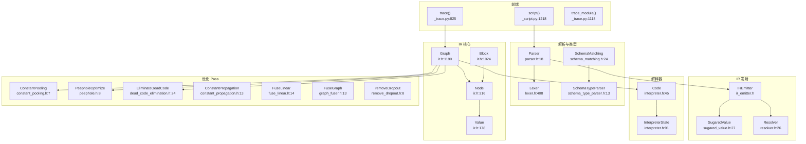
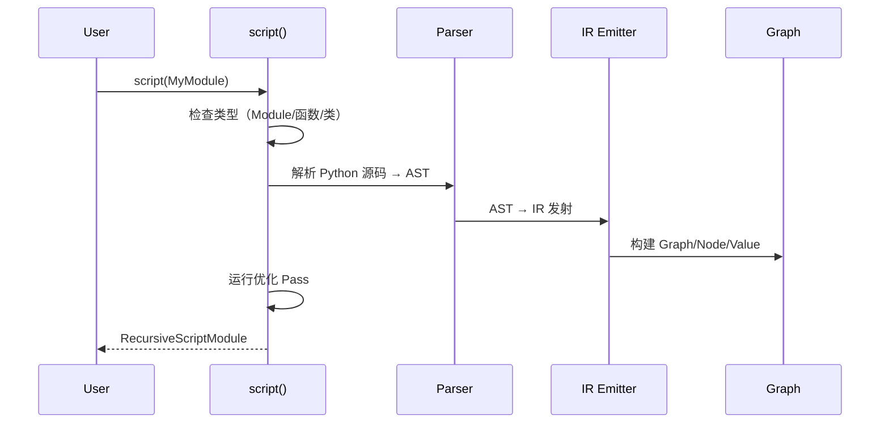

# 39. PyTorch TorchScript/JIT 编译器系统

## 目录

- [39.1 整体架构](#391-整体架构)
- [39.2 JIT IR：Graph/Node/Value/Block](#392-jit-irgraphnodevalueblock)
- [39.3 Script 前端](#393-script-前端)
- [39.4 Trace 前端](#394-trace-前端)
- [39.5 解析器与类型系统](#395-解析器与类型系统)
- [39.6 IR 发射与 SugaredValue](#396-ir-发射与-sugaredvalue)
- [39.7 JIT 解释器](#397-jit-解释器)
- [39.8 JIT 优化 Pass](#398-jit-优化-pass)
- [39.9 Python JIT API](#399-python-jit-api)
- [39.10 设计权衡](#3910-设计权衡)
- [39.11 关键文件索引](#3911-关键文件索引)

---

## 39.1 整体架构

TorchScript/JIT 是 PyTorch 内置的编译器系统，将 Python 模型转换为可序列化、可优化的中间表示。



---

## 39.2 JIT IR：Graph/Node/Value/Block

JIT IR 是 SSA 形式的图中间表示，核心由 Graph/Node/Value/Block 四个类组成。

### Value

```cpp
// torch/csrc/jit/ir/ir.h:178
struct Value {
    Value(Node* node_, size_t offset_);              // 行 180: 构造
    Value* setType(TypePtr type);                     // 行 195: 设置类型
    const TypePtr& type() const;                      // 行 199: 获取类型
    Value* setDebugName(const std::string& name);     // 行 221: 设置调试名
    Node* node();                                     // 行 229: 所属 Node
    const use_list& uses() const;                     // 行 249: 使用列表
    void replaceAllUsesWith(Value* newValue);         // 行 268: 替换所有使用
};
```

### Node

```cpp
// torch/csrc/jit/ir/ir.h:316
struct Node {
    Node(Graph* graph_, NodeKind kind_);              // 行 353: 构造
    NodeKind kind() const;                            // 行 396: 操作类型
    Value* output(size_t i) const;                    // 行 479: 第 i 个输出
    Value* input(size_t i) const;                     // 行 521: 第 i 个输入
    Value* addInput(Value* value);                    // 行 574: 添加输入
    Value* replaceInput(size_t i, Value* newValue);   // 行 586: 替换输入
    void replaceInputWith(Value* from, Value* to);    // 行 594: 替换特定输入
    Value* addOutput();                               // 行 596: 添加输出
    void eraseOutput(size_t i);                       // 行 600: 删除输出
    Block* addBlock();                                // 行 602: 添加子 Block
    void destroy();                                   // 行 743: 销毁
    void replaceAllUsesWith(Node* n);                 // 行 491: 替换所有使用
};
```

### Block

```cpp
// torch/csrc/jit/ir/ir.h:1024
struct Block {
    Block(Graph* graph_, Node* node_);                // 行 1029: 构造
    graph_node_list nodes();                          // 行 1044: 节点列表
    Node* return_node();                              // 行 1050: 返回节点
    Node* param_node();                               // 行 1056: 参数节点
    size_t registerOutput(Value* v);                  // 行 1095: 注册输出
    Node* prependNode(Node* n);                       // 行 1125: 前插节点
};
```

### Graph

```cpp
// torch/csrc/jit/ir/ir.h:1180
struct Graph : std::enable_shared_from_this<Graph> {
    Graph(ScopePtr scope_root = ...);                 // 行 1213: 构造
    Block* block();                                   // 行 1420: 顶层 Block
    ~Graph();                                         // 行 1432: 析构

    // 节点创建
    Node* create(NodeKind kind, size_t num_outputs);  // 行 1290
    Node* create(NodeKind kind, ArrayRef<Value*> inputs, ...); // 行 1291
    Node* createNone();                               // 行 1296
    Node* createUninitialized(TypePtr typ);           // 行 1298
    Node* createWithSubgraph(Symbol kind);            // 行 1299
    Node* createTuple(...);                           // 行 1301
    Node* createTupleUnpack(Value* v);                // 行 1304
    Node* createClone(...);                           // 行 1361

    // 常量与插入
    Value* insertConstant(...);                       // 行 1367
    Node* insertNode(Node* n);                        // 行 1396

    // 复制
    std::shared_ptr<Graph> copy();                    // 行 1442
};
```

### IR 示例

```
graph(%self : __torch__.MyModule,
      %x : Float(4, 4)):
  %1 : Float(4, 4) = aten::mm(%x, %self.weight)
  %2 : Float(4, 4) = aten::add(%1, %self.bias, %3)
  return (%2)
```

---

## 39.3 Script 前端

### script()

```python
# torch/jit/_script.py:1218
def script(obj, optimize=None, _frames_up=0, _rcb=None,
           example_inputs=None):
    """脚本化模型：分析 Python 源码生成 TorchScript IR
    支持 Module、函数、类
    """
```

### ScriptModule 类层次

```python
# torch/jit/_script.py

class ScriptMeta(type):                      # 行 277: 元类
class OrderedDictWrapper:                    # 行 193: 有序字典包装
class OrderedModuleDict:                     # 行 228: 有序模块字典

# 在 _try_get_wrapped_class 内部定义:
class RecursiveScriptClass:                  # 行 432: 脚本化的类
class ScriptModule(Module, metaclass=ScriptMeta):  # 行 510: 脚本模块基类
class RecursiveScriptModule(ScriptModule):   # 行 595: 递归脚本模块

# 模块级存根:
class RecursiveScriptClass:                  # 行 1000: 类型提示存根
class ScriptModule(torch.nn.Module):         # 行 1003: 类型提示存根
class RecursiveScriptModule(ScriptModule):   # 行 1007: 类型提示存根
```

### script_method

```python
# torch/jit/_script.py:348
def script_method(fn):
    """脚本化方法装饰器"""
```

### interface

```python
# torch/jit/_script.py:1520
def interface(obj):
    """声明接口类型（类似 Java interface）"""
```

### Script 工作流



---

## 39.4 Trace 前端

### trace()

```python
# torch/jit/_trace.py:825
def trace(func, example_inputs, optimize=True, check_trace=True,
          check_inputs=None, check_tolerance=1e-5, strict=True,
          _force_outplace=False, _compile_dep=False, ...):
    """追踪模型：记录前向传播的操作序列
    适用于无控制流的模型
    """
```

### trace_module()

```python
# torch/jit/_trace.py:1118
def trace_module(mod, inputs, optimize=True, check_trace=True, ...):
    """追踪模块：支持多方法追踪"""
```

### TracedModule

```python
# torch/jit/_trace.py
class TracedModule(ScriptModule):           # 行 1332: 追踪模块
class TopLevelTracedModule(TracedModule):   # 行 1424: 顶层追踪模块
class ONNXTracedModule(torch.nn.Module):    # 行 85: ONNX 追踪模块
class TracingCheckError(Exception):         # 行 299: 追踪检查错误
class TracerWarning(Warning):               # 行 593: 追踪警告
```

### C++ Trace 前端

```cpp
// torch/csrc/jit/frontend/tracer.h
struct TracingState {                        // 行 42: 追踪状态
    std::shared_ptr<Graph> graph;
};

const std::shared_ptr<TracingState>& getTracingState();  // 行 155
void setTracingState(std::shared_ptr<TracingState>);     // 行 156
inline bool isTracing();                                 // 行 158
pair<shared_ptr<TracingState>, Stack> trace(...);        // 行 219
```

### Script vs Trace

| 特性 | Script | Trace |
|------|--------|-------|
| 输入 | Python 源码 | 示例输入 |
| 控制流 | 支持（if/while/for） | 不支持（被固定） |
| 副作用 | 正确处理 | 可能丢失 |
| 精度 | 完整语义 | 仅追踪路径 |
| 难度 | 较难（需符合子集） | 较易（几乎任何模型） |
| 行号 | _script.py:1218 | _trace.py:825 |

---

## 39.5 解析器与类型系统

### Lexer

```cpp
// torch/csrc/jit/frontend/lexer.h:408
struct Lexer {
    explicit Lexer(shared_ptr<Source> source);  // 行 409
    // 词法分析：源码 → Token 流
};
```

### Parser

```cpp
// torch/csrc/jit/frontend/parser.h:18
struct Parser {
    explicit Parser(const shared_ptr<Source>& src);  // 行 19
    TreeRef parseFunction(bool is_method);           // parser.cpp:806
    TreeRef parseClass();                            // parser.cpp:809
};
```

### SchemaTypeParser

```cpp
// torch/csrc/jit/frontend/schema_type_parser.h:13
struct SchemaTypeParser {
    TypePtr parseBaseType();                               // 行 14
    pair<TypePtr, optional<AliasInfo>> parseType();        // 行 16
    TypePtr parseRefinedTensor();                          // 行 20
};
```

### SchemaMatching

```cpp
// torch/csrc/jit/frontend/schema_matching.h

bool isBlockListedSchema(const FunctionSchema&);           // 行 22
MatchedSchema matchSchema(...);                             // 行 24
pair<size_t, MatchedSchema> matchSchemas(...);             // 行 32
Value* emitBuiltinCall(...);                               // 行 47
```

### ScriptTypeParser

```cpp
// torch/csrc/jit/frontend/script_type_parser.h:15
class ScriptTypeParser {
    TypePtr parseTypeFromExpr(const Expr&);                // 行 21
    TypePtr parseType(const string&);                       // 行 26
    FunctionSchema parseSchemaFromDef(const Def&, bool);    // 行 28
};
```

### FunctionSchemaParser

```cpp
// torch/csrc/jit/frontend/function_schema_parser.h
variant<OperatorName, FunctionSchema> parseSchemaOrName(...);  // 行 15
FunctionSchema parseSchema(...);                                // 行 18
// 实现: function_schema_parser.cpp:416
```

### Tree / TreeView

```cpp
// torch/csrc/jit/frontend/tree.h:31
struct Tree : c10::intrusive_ptr_target {
    // AST 节点基类
};

// torch/csrc/jit/frontend/tree_views.h
struct Def : public TreeView;       // 行 404: 函数定义
struct ClassDef : public TreeView;  // 行 459: 类定义
struct If : public Stmt;            // 行 515: if 语句
struct While : public Stmt;         // 行 543: while 语句
struct Apply : public Expr;         // 行 960: 函数调用
```

---

## 39.6 IR 发射与 SugaredValue

### SugaredValue

```cpp
// torch/csrc/jit/frontend/sugared_value.h:27
struct SugaredValue {
    virtual shared_ptr<SugaredValue> attr(...);                    // 行 39: 属性访问
    virtual vector<shared_ptr<SugaredValue>> asTuple(...);         // 行 66: 元组拆包
    virtual SugaredValuePtr asTupleValue(...);                     // 行 74: 元组值
    virtual shared_ptr<SugaredValue> call(...);                    // 行 87: 函数调用
};
```

SugaredValue 是 Script 前端的核心抽象，将 Python 语义的"糖"映射到 IR 操作：

| SugaredValue 子类 | 语义 |
|-------------------|------|
| `SimpleValue` | 普通值（tensor, int, etc.） |
| `ModuleValue` | nn.Module 属性/方法 |
| `ClassValue` | 类构造 |
| `FunctionValue` | 函数调用 |
| `BuiltinFunction` | 内置函数（aten::*) |
| `SliceValue` | 切片操作 |

### Resolver

```cpp
// torch/csrc/jit/frontend/resolver.h:26
struct Resolver {
    virtual shared_ptr<SugaredValue> resolveValue(...);   // 行 32: 解析值
    virtual TypePtr resolveType(...);                      // 行 40: 解析类型
};

struct NativeResolver : public Resolver {                  // 行 46: 内置解析器
};
```

### IREmitter

```cpp
// torch/csrc/jit/frontend/ir_emitter.h
void runCleanupPasses(shared_ptr<Graph>&);    // 行 15: 清理 Pass
bool meaningfulName(const string&);           // 行 17: 有意义的命名
```

### 编译流水线

```
Python 源码
  → Lexer (词法分析) → Token 流
  → Parser (语法分析) → Tree (AST)
  → ScriptTypeParser (类型解析)
  → IREmitter + SugaredValue + Resolver
  → Graph (JIT IR)
  → 优化 Pass
  → Code (字节码) 或 GraphExecutor
```

---

## 39.7 JIT 解释器

### Code

```cpp
// torch/csrc/jit/runtime/interpreter.h:45
struct Code {
    Code(...);                                // 行 47, 51: 构造
    size_t num_inputs() const;                // 行 62: 输入数量
    size_t num_outputs() const;               // 行 63: 输出数量
    const vector<Instruction>& instructions() const;  // 行 67: 指令列表
};

struct MobileCode : Code {                    // 行 81: 移动端代码
};
```

### InterpreterState

```cpp
// torch/csrc/jit/runtime/interpreter.h:91
struct InterpreterState {
    InterpreterState(const Code& code, TaskLauncher);  // 行 92: 构造
    void run(Stack& stack);                            // 行 95: 同步执行
    intrusive_ptr<Future> runAsync(Stack& stack);      // 行 96: 异步执行
};

// torch/csrc/jit/runtime/interpreter.cpp
struct InterpreterStateImpl {                          // 行 124: 实现类
    void enterFrame(const Code& code, size_t base_pointer);  // 行 176
    void leaveFrame();                                       // 行 181
    void run(Stack& stack);                                  // 行 1104
};
```

### 解释器执行模型

```
Stack (IValue 向量) 作为操作数栈

指令类型：
  OP          → 调用算子
  LOAD        → 加载常量/输入
  STORE       → 存储输出
  JUMP        → 无条件跳转
  COND_JUMP   → 条件跳转
  CALL        → 调用子图
  RET         → 返回
  DROP        → 弹栈
  MOVE        → 移动栈元素
  LIST/Dict   → 构造列表/字典
  TUPLE       → 构造元组
```

---

## 39.8 JIT 优化 Pass

### 通用优化 Pass

| Pass | 头文件行号 | 实现行号 | 说明 |
|------|-----------|---------|------|
| `ConstantPooling` | constant_pooling.h:7 | constant_pooling.cpp:68 | 常量池化 |
| `PeepholeOptimize` | peephole.h:8 | peephole.cpp:456 | 窥孔优化 |
| `EliminateDeadCode` | dead_code_elimination.h:24 | dead_code_elimination.cpp:435 | 死代码消除 |
| `ConstantPropagation` | constant_propagation.h:13 | constant_propagation.cpp:362 | 常量传播 |
| `FuseLinear` | fuse_linear.h:14 | fuse_linear.cpp:8 | 线性层融合 |
| `FuseGraph` | graph_fuser.h:13 | graph_fuser.cpp:1255 | 图融合 |
| `CustomFuseGraph` | graph_fuser.h:29 | — | 自定义图融合 |
| `removeDropout` | remove_dropout.h:8 | remove_dropout.cpp:48 | 移除 Dropout |

### Pass 详细说明

```cpp
// ConstantPooling: 合并相同常量，减少内存
void ConstantPooling(const shared_ptr<Graph>&);           // constant_pooling.h:7

// PeepholeOptimize: 局部代数简化
bool PeepholeOptimize(const shared_ptr<Graph>&, ...);     // peephole.h:8
// 如: x + 0 → x, x * 1 → x, x * 0 → 0

// EliminateDeadCode: 移除无用的节点
void EliminateDeadCode(Block*, ...);                       // dead_code_elimination.h:24
void EliminateDeadCode(const shared_ptr<Graph>&, ...);     // dead_code_elimination.h:35

// ConstantPropagation: 编译时计算常量表达式
bool ConstantPropagation(...);                             // constant_propagation.h:13

// FuseLinear: 将 addmm + bias 融合为线性操作
void FuseLinear(shared_ptr<Graph>&);                       // fuse_linear.h:14

// FuseGraph: 将连续算子融合为 FusionGroup
void FuseGraph(shared_ptr<Graph>&, bool strict_fuser_check); // graph_fuser.h:13

// removeDropout: 移除推理时的 Dropout
void removeDropout(shared_ptr<Graph>&);                    // remove_dropout.h:8
void removeDropout(script::Module&);                       // remove_dropout.h:10
```

### 优化流水线

```
Graph 原始 IR
  → PeepholeOptimize     (代数简化)
  → ConstantPropagation   (常量传播)
  → ConstantPooling       (常量池化)
  → FuseLinear            (线性层融合)
  → FuseGraph             (算子融合)
  → EliminateDeadCode     (死代码消除)
  → removeDropout         (移除 Dropout, 推理时)
```

---

## 39.9 Python JIT API

### torch.jit.__init__.py 导出

```python
# torch/jit/__init__.py

# 核心函数 (行号指导入行)
script              # 行 42: 脚本化
trace               # 行 62: 追踪
trace_module        # 行 63: 模块追踪
freeze              # 行 26: 冻结
optimize_for_inference  # 行 26: 推理优化
save                # 行 51: 保存
load                # 行 50: 加载

# 类
ScriptModule        # 行 46: 脚本模块
ScriptFunction      # 行 44: 脚本函数
RecursiveScriptModule  # 行 41: 递归脚本模块
RecursiveScriptClass   # 行 40: 递归脚本类
CompilationUnit     # 行 38: 编译单元
Future              # 行 18: 异步 Future

# 装饰器/工具
export              # 行 16: 导出标记
ignore              # 行 19: 忽略脚本化
interface           # 行 39: 接口声明
is_scripting        # 行 20: 是否在脚本化中
Attribute           # 行 37: 属性声明
annotate            # 行 128: 类型标注
script_if_tracing   # 行 176: 追踪时脚本化
isinstance          # 行 198: 类型检查

# 异步
fork                # 行 23: 异步执行
wait                # 行 23: 等待结果

# 异常
Error = torch._C.JITException   # 行 120

# 其他
strict_fusion       # 行 241: 严格融合上下文
enable_onednn_fusion  # 行 281: 启用 oneDNN 融合
export_opnames      # 行 107: 导出算子名列表
```

---

## 39.10 设计权衡

| 权衡点 | 选择 | 原因 |
|--------|------|------|
| SSA 形式 | Graph/Value/Node | 简化数据流分析，但需管理使用链 |
| 双前端 | script + trace | script 支持控制流但限制 Python 子集；trace 简单但不支持控制流 |
| SugaredValue 抽象 | 运行时多态 | 灵活处理 Python 语义，但增加编译器复杂度 |
| 解释器 vs 编译 | 两者都有 | 解释器灵活，GraphExecutor 可 JIT 编译优化 |
| Stack 机器 | IValue 栈 | 简化调用约定，但需额外指令管理栈 |
| Python 子集限制 | 静态类型推断 | 保证可序列化和可优化，但用户需适配代码 |
| 常量传播 | 保守策略 | 避免副作用问题，但可能错过优化机会 |
| 算子融合 | FuseGraph | 减少内核启动开销，但融合规则有限 |
| 移动端支持 | MobileCode 子集 | 减少二进制大小，但功能受限 |

---

## 39.11 关键文件索引

| 文件 | 核心内容 |
|------|----------|
| `torch/jit/_script.py` | script()、ScriptModule、RecursiveScriptModule |
| `torch/jit/_trace.py` | trace()、trace_module()、TracedModule |
| `torch/jit/__init__.py` | Python JIT API 导出 |
| `torch/csrc/jit/ir/ir.h` | Graph、Node、Value、Block 核心 IR |
| `torch/csrc/jit/ir/irparser.h` | IR 文本解析器 |
| `torch/csrc/jit/frontend/lexer.h` | Lexer 词法分析 |
| `torch/csrc/jit/frontend/parser.h` | Parser 语法分析 |
| `torch/csrc/jit/frontend/sugared_value.h` | SugaredValue 语义抽象 |
| `torch/csrc/jit/frontend/resolver.h` | Resolver 名称解析 |
| `torch/csrc/jit/frontend/schema_matching.h` | Schema 匹配与重载解析 |
| `torch/csrc/jit/frontend/script_type_parser.h` | 类型解析 |
| `torch/csrc/jit/frontend/ir_emitter.h` | IR 发射 |
| `torch/csrc/jit/frontend/tracer.h` | C++ 追踪前端 |
| `torch/csrc/jit/frontend/tree_views.h` | AST 视图（Def/ClassDef/If/While） |
| `torch/csrc/jit/runtime/interpreter.h` | Code、InterpreterState |
| `torch/csrc/jit/runtime/interpreter.cpp` | 解释器实现 |
| `torch/csrc/jit/passes/constant_pooling.h` | 常量池化 Pass |
| `torch/csrc/jit/passes/peephole.h` | 窥孔优化 Pass |
| `torch/csrc/jit/passes/dead_code_elimination.h` | 死代码消除 Pass |
| `torch/csrc/jit/passes/constant_propagation.h` | 常量传播 Pass |
| `torch/csrc/jit/passes/fuse_linear.h` | 线性层融合 Pass |
| `torch/csrc/jit/passes/graph_fuser.h` | 图融合 Pass |
| `torch/csrc/jit/passes/remove_dropout.h` | 移除 Dropout Pass |
| `torch/csrc/jit/OVERVIEW.md` | JIT 系统完整概述文档 |