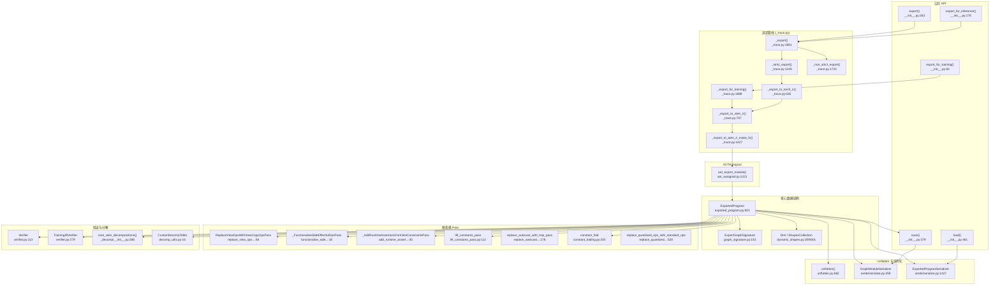
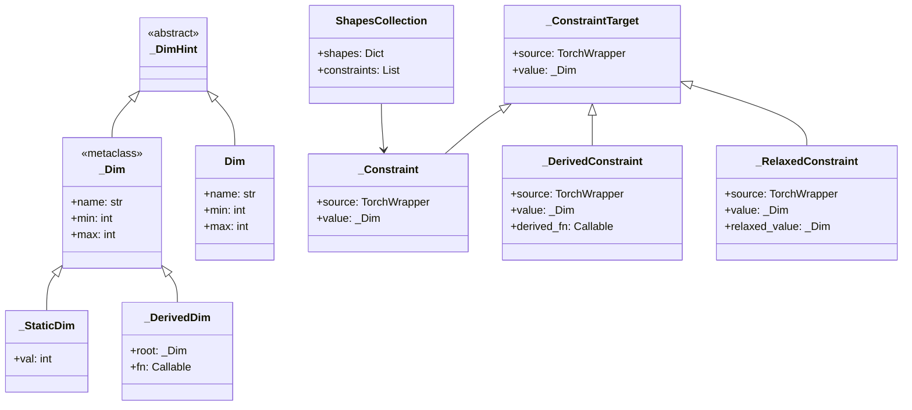
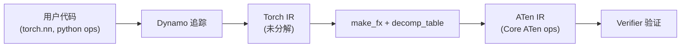
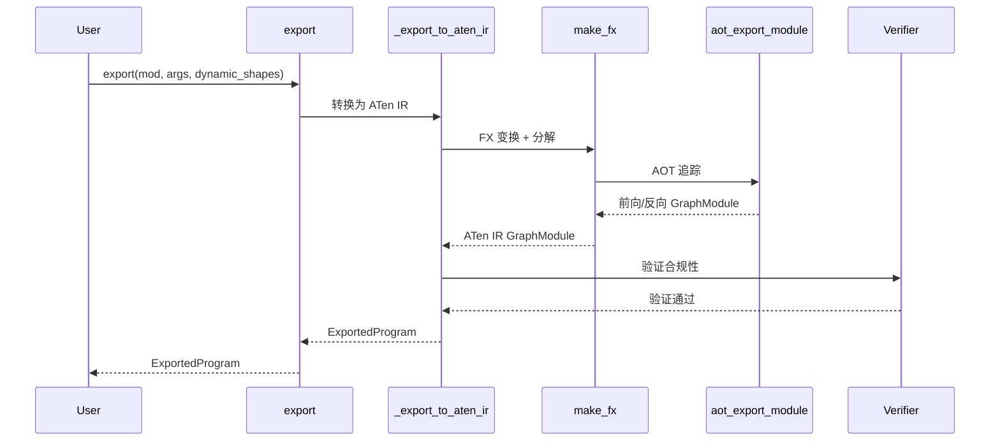

# 40. PyTorch torch.export 模型导出系统

## 目录

- [40.1 整体架构](#401-整体架构)
- [40.2 导出入口：export/export_for_training/export_for_inference](#402-导出入口exportexport_for_trainingexport_for_inference)
- [40.3 导出追踪管线](#403-导出追踪管线)
- [40.4 ExportedProgram](#404-exportedprogram)
- [40.5 动态形状系统](#405-动态形状系统)
- [40.6 Graph Signature](#406-graph-signature)
- [40.7 算子分解（Decomposition）](#407-算子分解decomposition)
- [40.8 图变换 Pass](#408-图变换-pass)
- [40.9 Verifier 与方言验证](#409-verifier-与方言验证)
- [40.10 Unflatten 与模块恢复](#4010-unflatten-与模块恢复)
- [40.11 序列化与反序列化](#4011-序列化与反序列化)
- [40.12 AOTAutograd 导出集成](#4012-aotautograd-导出集成)
- [40.13 设计权衡](#4013-设计权衡)
- [40.14 关键文件索引](#4014-关键文件索引)

---

## 40.1 整体架构

`torch.export` 是 PyTorch 2.x 的模型导出系统，将 `nn.Module` 转换为与 Python 无关的中间表示（ExportedProgram），支持动态形状、算子分解、后端部署。它构建在 TorchDynamo（字节码捕获）和 AOTAutograd（前向/反向分离）之上。



---

## 40.2 导出入口：export/export_for_training/export_for_inference

`torch/export/__init__.py` 提供三个导出入口函数，分别面向不同使用场景：

| 函数 | 行号 | 用途 | 输出方言 |
|------|------|------|----------|
| `export_for_training()` | :83 | 导出用于训练的 IR | Core ATen + Autograd |
| `export_for_inference()` | :178 | 导出用于推理的 IR | Core ATen (无反向图) |
| `export()` | :263 | 通用导出 (默认推理) | Core ATen |

### export() 详解 (`__init__.py:263`)

```python
def export(
    mod: torch.nn.Module,
    args: Tuple[Any, ...],
    kwargs: Optional[Dict[str, Any]] = None,
    *,
    dynamic_shapes: Optional[Union[Dict[str, Any], Tuple[Any, ...]]] = None,
    strict: bool = True,
    preserve_module_call_signature: Tuple[str, ...] = (),
) -> ExportedProgram:
```

关键参数：
- **`dynamic_shapes`**：指定动态维度约束，如 `{"x": {0: Dim("batch", min=1, max=64)}}`
- **`strict`**：`True` 使用严格模式（Dynamo 完整追踪），`False` 使用非严格模式（回退到 make_fx）
- **`preserve_module_call_signature`**：保留子模块调用签名，用于 unflatten 恢复

### save() 与 load() (`__init__.py:379/461`)

```python
def save(ep: ExportedProgram, f) -> None:  # :379
def load(f, *, expected_opset_version=None) -> ExportedProgram:  # :461
```

`save()` 将 ExportedProgram 序列化为 `.pt2` 文件；`load()` 从文件反序列化恢复。

---

## 40.3 导出追踪管线

### _export_to_torch_ir() (`_trace.py:635`)

第一阶段：通过 Dynamo 捕获 Python 字节码，生成 Torch IR（FX GraphModule）。

```python
def _export_to_torch_ir(
    mod: torch.nn.Module,
    args: Tuple[Any, ...],
    kwargs: Dict[str, Any],
    dynamic_shapes,
    preserve_module_call_signature,
    strict,
    pre_dispatch,
    decomposition_table,
) -> ExportDynamoResult:
```

流程：
1. 配置 Dynamo 追踪选项（`_dynamo.config`）
2. 通过 `torch._dynamo.export` 捕获 FX Graph
3. 对图应用初步变换（移除断言、规范化）
4. 返回 `ExportDynamoResult`（包含 GraphModule、输入/输出签名）

### _export_to_aten_ir() (`_trace.py:707`)

第二阶段：将 Torch IR 转换为 ATen IR，执行算子分解和函数化。

```python
def _export_to_aten_ir(
    export_result: ExportDynamoResult,
    decomposition_table,
    fake_args,
    num_params_buffers,
) -> ExportedProgram:
```

流程：
1. 调用 `_export_to_aten_ir_make_fx()` 进行 FX 变换
2. 应用图变换 Pass 链
3. 构造 `ExportedProgram`

### _export_to_aten_ir_make_fx() (`_trace.py:1427`)

核心 FX 变换入口，使用 `make_fx` 将 Torch IR 图转换为 ATen IR。

### _strict_export() (`_trace.py:1249`)

严格导出模式：使用 Dynamo 完整追踪，确保所有操作都被捕获。委托给 `_strict_export_lower_to_aten_ir()` (:1277)。

```python
def _strict_export(
    mod, args, kwargs, dynamic_shapes,
    preserve_module_call_signature, pre_dispatch,
    decomposition_table,
) -> ExportedProgram:
```

### _non_strict_export() (`_trace.py:1723`)

非严格导出模式：当 Dynamo 追踪失败时，回退到 `make_fx` 直接追踪。

```python
def _non_strict_export(
    mod, args, kwargs, dynamic_shapes,
    preserve_module_call_signature,
) -> ExportedProgram:
```

### _export() (`_trace.py:1981`)

统一导出入口，根据 `strict` 参数选择严格或非严格模式：

```python
def _export(
    mod, args, kwargs, dynamic_shapes,
    strict, preserve_module_call_signature, pre_dispatch,
) -> ExportedProgram:
```

### _export_for_training() (`_trace.py:1889`)

训练导出入口，导出包含反向图的完整训练 IR。

---

## 40.4 ExportedProgram

`ExportedProgram` (`exported_program.py:823`) 是导出系统的核心数据结构，封装了导出后的完整模型信息。

### 数据结构

```python
class ExportedProgram:  # :823
    def __init__(  # :839
        self,
        root_module: torch.nn.Module,      # 根模块（扁平化后的 GraphModule）
        graph_module: torch.fx.GraphModule, # FX 图模块
        graph_signature: ExportGraphSignature, # 输入/输出签名
        state_dict: Dict[str, Any],        # 模型参数与缓冲区
        range_constraints: Dict[sympy.Symbol, ValueRanges], # 动态形状范围约束
        ...
    ):
```

### 关键属性与方法

| 属性/方法 | 行号 | 说明 |
|-----------|------|------|
| `graph_module` (property) | :880 | 返回 FX GraphModule |
| `graph` (property) | :890 | 返回底层 FX Graph |
| `graph_signature` (property) | :900 | 返回 ExportGraphSignature |
| `range_constraints` (property) | :958 | 返回动态形状范围约束 |
| `__call__()` | :1147 | 直接调用导出模型 |
| `module()` | :1220 | 返回可调用的 nn.Module |
| `run_decompositions()` | :1249 | 对图应用算子分解 |
| `validate()` | :1423 | 验证导出程序合规性 |
| `_validate()` | :1428 | 内部验证实现 |

### run_decompositions() (`:1249`)

```python
def run_decompositions(
    self,
    decomp_table: Optional[Dict[torch._ops.OpOverload, Callable]] = None,
) -> "ExportedProgram":
```

对已导出程序应用算子分解表，返回新的 ExportedProgram。默认使用 `core_aten_decompositions()`。

---

## 40.5 动态形状系统

`torch/export/dynamic_shapes.py` 实现了完整的动态形状约束系统。

### 类型层次



### Dim() 函数 (`:209`)

```python
def Dim(name: str, *, min: Optional[int] = None, max: Optional[int] = None) -> _Dim:
```

创建动态维度约束。示例：`Dim("batch", min=1, max=64)` 表示名为 `batch` 的维度，取值范围 [1, 64]。

### 核心类

| 类 | 行号 | 说明 |
|----|------|------|
| `_DimHint` | :43 | 动态维度的抽象基类 |
| `_Dim` (metaclass) | :56 | 动态维度元类，支持算术运算生成 `_DerivedDim` |
| `_StaticDim` | :125 | 静态维度（编译期已知的整数） |
| `_DerivedDim` | :142 | 派生维度（如 `2 * batch + 1`） |
| `_ConstraintTarget` | :256 | 约束目标（关联维度与张量位置） |
| `_Constraint` | :266 | 基础约束 |
| `_DerivedConstraint` | :356 | 派生约束 |
| `_RelaxedConstraint` | :383 | 放松约束（允许更大范围） |
| `ShapesCollection` | :601 | 形状约束收集器，将嵌套结构映射到 `_Constraint` 列表 |

### ShapesCollection (`:601`)

```python
class ShapesCollection:
    def __init__(self):  # :602
        self.shapes: Dict[str, Any] = {}
        self.constraints: List[_Constraint] = []
```

将用户提供的 `dynamic_shapes` 规格解析为 `_Constraint` 列表，供 Dynamo 追踪时使用。

---

## 40.6 Graph Signature

`torch/export/graph_signature.py` 定义了导出图的输入/输出签名，用于映射扁平化 FX Graph 的参数与原始模块的参数/缓冲区/输入。

### 输入参数类型

| 类 | 行号 | 说明 |
|----|------|------|
| `TensorArgument` | :31 | 张量参数（指定 fqn 全限定名） |
| `TokenArgument` | :36 | Token 参数（副作用操作） |
| `SymIntArgument` | :41 | 符号整数参数 |
| `SymFloatArgument` | :46 | 符号浮点参数 |
| `SymBoolArgument` | :51 | 符号布尔参数 |
| `CustomObjArgument` | :56 | 自定义对象参数 |
| `ConstantArgument` | :63 | 常量参数（不含张量） |

### InputKind 枚举 (`:79`)

```python
class InputKind(Enum):
    USER_INPUT = auto()          # 用户输入
    PARAMETER = auto()           # 模型参数
    BUFFER = auto()              # 模型缓冲区
    CONSTANT_TENSOR = auto()     # 常量张量
    CUSTOM_OBJ = auto()          # 自定义对象
    TOKEN = auto()               # 副作用 Token
```

### OutputKind 枚举 (`:114`)

```python
class OutputKind(Enum):
    USER_OUTPUT = auto()         # 用户输出
    LOSS_OUTPUT = auto()         # 损失输出（训练用）
    GRADIENT_TO_PARAMETER = auto()  # 参数梯度
    GRADIENT_TO_USER_INPUT = auto() # 输入梯度
    BUFFER_MUTATION = auto()     # 缓冲区变异
    CUSTOM_OBJ_MUTATION = auto() # 自定义对象变异
    TOKEN = auto()               # 副作用 Token
```

### ExportGraphSignature (`:153`)

```python
@dataclass
class ExportGraphSignature:
    input_specs: List[InputSpec]     # 输入规格列表
    output_specs: List[OutputSpec]   # 输出规格列表

    # 便捷属性
    user_inputs         → 用户输入参数
    user_outputs        → 用户输出参数
    parameters          → 模型参数
    buffers             → 模型缓冲区
    lifted_tensor_constants → 提升的常量张量
    backward_signature  → 反向图签名（仅训练模式）
```

签名将扁平化 FX Graph 的位置参数映射回原始模块的语义化名称（如 `self.weight`、`self.bias`），使下游消费者无需了解内部图结构。

---

## 40.7 算子分解（Decomposition）

导出系统将高层 PyTorch 操作分解为 Core ATen 操作集，确保后端只需支持有限的算子集合。

### core_aten_decompositions() (`torch/_decomp/__init__.py:288`)

```python
def core_aten_decompositions() -> Dict[torch._ops.OpOverload, Callable]:
```

返回 Core ATen 方言的分解表，将非 Core ATen 操作分解为 Core ATen 操作。另有 `_core_aten_decompositions_post_autograd()` (:299) 用于 Autograd 之后的分解。

### CustomDecompTable (`decomp_utils.py:16`)

```python
class CustomDecompTable(MutableMapping):  # :16
    def __init__(self, decomp_table: Dict[OpOverload, Callable]):  # :33
```

自定义分解表，支持在导出时覆盖默认分解规则。继承 `MutableMapping`，支持字典式访问。

| 方法 | 行号 | 说明 |
|------|------|------|
| `__init__()` | :33 | 初始化，接受分解字典 |
| `materialize()` | :129 | 展开所有延迟分解为具体函数 |
| `_materialize_if_needed()` | :142 | 按需展开单个分解 |
| `keys()` | :58 | 返回所有算子键 |
| `items()` | :125 | 返回键值对迭代器 |

### 分解流程



---

## 40.8 图变换 Pass

导出系统在生成 ExportedProgram 前后应用一系列图变换 Pass，确保 IR 符合目标方言规范。

### Pass 概览

| Pass | 文件 | 行号 | 说明 |
|------|------|------|------|
| `ReplaceViewOpsWithViewCopyOpsPass` | replace_view_ops..._pass.py | :46 | 将 view 操作替换为 view_copy（消除别名） |
| `_FunctionalizeSideEffectfulOpsPass` | functionalize_side..._pass.py | :18 | 函数化副作用操作（如 mutation） |
| `_AddRuntimeAssertionsForInlineConstraintsPass` | add_runtime_assert..._pass.py | :45 | 为动态形状约束插入运行时断言 |
| `lift_constants_pass` | lift_constants_pass.py | :112 | 将常量提升为图输入 |
| `replace_autocast_with_hop_pass` | replace_autocast..._pass.py | :178 | 将 autocast 替换为更高阶操作 |
| `replace_set_grad_with_hop_pass` | replace_set_grad..._pass.py | :110 | 将 set_grad 替换为更高阶操作 |
| `constant_fold` | constant_folding.py | :205 | 常量折叠优化 |
| `replace_quantized_ops_with_standard_ops` | replace_quantized..._pass.py | :528 | 将量化操作替换为标准操作 |
| `remove_self_clone` | _remove_auto_functionalized_pass.py | :18 | 移除自克隆操作 |
| `unsafe_remove_auto_functionalized_pass` | _remove_auto_functionalized_pass.py | :25 | 不安全地移除自动函数化 |
| `_RemoveRuntimeAssertionsPass` | remove_runtime_assertions.py | :5 | 移除运行时断言（推理优化） |
| `CollectTracepointsPass` | collect_tracepoints_pass.py | :20 | 收集追踪点信息 |
| `insert_custom_op_guards` | insert_custom_op_guards.py | :11 | 插入自定义算子守卫 |
| `move_to_device_pass` | passes/__init__.py | :11 | 将操作移动到指定设备 |

### lift_constants_pass (`lift_constants_pass.py:112`)

将 FX Graph 中的 `get_attr` 节点（常量张量）提升为图输入，使其出现在 `ExportGraphSignature` 的 `CONSTANT_TENSOR` 条目中。这是使导出图完全自包含的关键步骤。

辅助类 `ConstantAttrMap` (:22) 管理常量名到全限定名的映射。

### _AddRuntimeAssertionsForInlineConstraintsPass (`add_runtime_assertions..._pass.py:45`)

为动态形状约束生成运行时断言。例如，若 `Dim("batch", min=1, max=64)`，则在图入口插入 `assert batch >= 1 and batch <= 64`。

关键辅助结构 `InputDim` (:20)：`NamedTuple` 关联输入张量位置与维度索引。

### constant_fold (`constant_folding.py:205`）

对图中的纯函数子图执行常量折叠，将可在编译期求值的操作预计算，减少运行时开销。

`replace_node_with_constant` (:20)：将节点替换为常量值。
`constant_graph_tag` (:248)：标记常量子图。
`run_and_get_constant_graph` (:264)：运行并获取常量子图结果。

---

## 40.9 Verifier 与方言验证

`torch/_export/verifier.py` 实现了导出 IR 的合规性验证。

### Verifier (`:113`)

```python
class Verifier(metaclass=_VerifierMeta):  # :113
    def check(self, gm: torch.fx.GraphModule) -> None:  # :159
    def _check_graph_module(self, gm) -> None:  # :165
    def allowed_builtin_ops(self) -> Set: ...  # :116
    def allowed_op_types(self) -> Set: ...     # :144
    def check_valid_op(self, op) -> None: ...  # :150
    def check_additional(self, gm) -> None: ... # :153
```

`_VerifierMeta` (:85) 是元类，自动注册验证器子类。

### 验证规则

Verifier 检查 FX GraphModule 是否符合目标方言：

1. **算子合法性**：所有算子必须属于 `allowed_builtin_ops()` 或 `allowed_op_types()`
2. **图结构**：无非法节点类型（如 Python 原生调用）
3. **元数据完整性**：每个节点必须有正确的元数据（shape、dtype 等）
4. **签名一致性**：graph_signature 与实际图输入/输出一致

### TrainingIRVerifier (`:279`)

```python
class TrainingIRVerifier(Verifier):  # :279
```

训练 IR 验证器，允许 Autograd 操作和反向图节点，相比推理验证器放宽了算子集合限制。

### SpecViolationError (`:26`)

```python
class SpecViolationError(Exception):  # :26
```

验证失败时抛出的异常，包含具体违规信息。

---

## 40.10 Unflatten 与模块恢复

`torch/export/unflatten.py` 实现了将扁平化的 ExportedProgram 恢复为嵌套模块结构的功能。

### InterpreterModule (`:130`)

```python
class InterpreterModule(_SubmoduleBase, torch.nn.Module):  # :130
```

解释器模块，封装 FX GraphModule 并通过解释器执行。支持将图中的 `call_module` 节点递归展开为子模块。

### UnflattenedModule (`:282`)

```python
class UnflattenedModule(torch.nn.Module):  # :282
```

恢复后的嵌套模块，保留原始模块层次结构。每个子模块对应原始模块的一个 `nn.Module` 子类实例。

### unflatten() (`:682`)

```python
def unflatten(
    exported_program: ExportedProgram,
    *,
    forward_signature: Optional[ExportGraphSignature] = None,
) -> UnflattenedModule:
```

将扁平化的 ExportedProgram 恢复为嵌套的 `UnflattenedModule`。利用 `graph_signature` 中的模块调用信息和 `preserve_module_call_signature` 保留的签名，重建模块层次。

流程：
1. 从 `graph_signature` 提取模块调用图
2. 为每个子模块创建 `InterpreterModule`
3. 组装为 `UnflattenedModule`
4. 恢复原始参数名和缓冲区名

---

## 40.11 序列化与反序列化

`torch/_export/serde/serialize.py` 实现了 ExportedProgram 的完整序列化/反序列化支持。

### GraphModuleSerializer (`:459`)

```python
class GraphModuleSerializer:  # :459
    def serialize_operator(self, node) -> Operator:  # :517
    def serialize_metadata(self, node) -> Metadata:  # :605
    def serialize_inputs(self, node) -> List[Argument]:  # :668
    def serialize_outputs(self, node) -> List[Argument]:  # :1191
    def serialize_signature(self, sig) -> GraphSignature: # :1139
    def serialize_graph(self, gm) -> Graph:  # :1381
    def serialize(self, gm, sig, ...) -> Artifact:  # :1415
```

将 FX GraphModule 序列化为 protobuf 风格的结构化数据：

| 方法 | 行号 | 序列化目标 |
|------|------|-----------|
| `serialize_operator` | :517 | 算子名称与重载 |
| `serialize_metadata` | :605 | 节点元数据（shape, dtype, stride 等） |
| `serialize_inputs` | :668 | 节点输入（张量/标量/SymInt） |
| `serialize_hoo_inputs` | :702 | 高阶操作输入 |
| `serialize_input_spec` | :1007 | 输入规格（InputKind + Argument） |
| `serialize_output_spec` | :1083 | 输出规格（OutputKind + Argument） |
| `serialize_signature` | :1139 | 完整 GraphSignature |
| `serialize_graph` | :1381 | 完整 Graph（节点列表 + 输入/输出） |
| `serialize` | :1415 | 完整序列化入口 |

### ExportedProgramSerializer (`:1427`)

```python
class ExportedProgramSerializer:  # :1427
    @classmethod
    def serialize(cls, ep) -> ExportedProgramArchive:  # :1435

    @classmethod
    def deserialize(cls, data) -> ExportedProgram:  # :1922
```

完整序列化入口，序列化/反序列化整个 ExportedProgram：

| 方法 | 行号 | 说明 |
|------|------|------|
| `serialize` | :1435 | 将 ExportedProgram 序列化为存档 |
| `deserialize` | :1922 | 从存档反序列化 ExportedProgram |
| `deserialize_graph` | :1682 | 反序列化 FX Graph |
| `deserialize_node` | :1758 | 反序列化节点 |
| `deserialize_input_spec` | :1818 | 反序列化输入规格 |
| `deserialize_output_spec` | :1870 | 反序列化输出规格 |
| `deserialize_signature` | :1916 | 反序列化签名 |

### 顶层序列化函数

| 函数 | 行号 | 说明 |
|------|------|------|
| `serialize()` | :2490 | 模块级序列化函数（保存到文件） |
| `deserialize()` | :2549 | 模块级反序列化函数（从文件加载） |
| `serialize_sym_int` | :232 | 序列化 SymInt |
| `serialize_sym_float` | :252 | 序列化 SymFloat |
| `serialize_tensor_meta` | :286 | 序列化张量元数据 |
| `serialize_range_constraints` | :399 | 序列化动态形状范围约束 |

---

## 40.12 AOTAutograd 导出集成

`torch/_functorch/aot_autograd.py` 中的 `aot_export_module()` 是导出系统与 AOTAutograd 的集成点。

### aot_export_module() (`:1221`)

```python
def aot_export_module(
    mod: torch.nn.Module,
    args: Tuple[Any, ...],
    *,
    decompositions: Optional[Dict] = None,
    trace_joint: bool = False,
    ...
) -> Tuple[GraphModule, GraphModule, ...]:
```

通过 AOTAutograd 追踪模块，分离前向和反向图。`trace_joint=True` 时追踪联合前向-反向图。

### 相关函数

| 函数 | 行号 | 说明 |
|------|------|------|
| `aot_export_joint_simple()` | :1428 | 简化的联合导出（支持更高阶操作） |
| `_aot_export_function()` | :1528 | 内部导出函数核心实现 |
| `aot_function()` | :841 | AOT 函数包装器 |
| `aot_module()` | :957 | AOT 模块包装器 |
| `aot_module_simplified()` | :1071 | 简化 AOT 模块包装器（Dynamo 使用） |
| `create_aot_dispatcher_function()` | :574 | 创建 AOT 调度器 |

### 导出流程中的 AOT 调用



---

## 40.13 设计权衡

### 1. 严格模式 vs 非严格模式

**选择**：提供 `_strict_export()` 和 `_non_strict_export()` 两种路径。

**原因**：严格模式使用 Dynamo 完整追踪，能捕获所有 Python 控制流，但对不支持的 Python 特性会失败。非严格模式回退到 `make_fx`，兼容性更好但可能丢失部分语义。默认使用严格模式确保语义保真。

**影响**：用户遇到 Dynamo 追踪失败时可通过 `strict=False` 回退，但需注意语义差异。

### 2. Core ATen 方言作为导出目标

**选择**：导出目标为 Core ATen 算子集（约 200 个操作），而非完整的 ATen 算子集（约 2000 个）。

**原因**：Core ATen 是所有后端必须支持的最小公共集合，大幅降低后端实现负担。非 Core ATen 操作通过分解表转换为 Core ATen 操作。

**影响**：某些操作的分解可能引入性能开销（如将复合操作分解为多个基本操作）。`CustomDecompTable` 允许用户自定义分解策略以优化特定后端。

### 3. 扁平化 GraphModule + GraphSignature 模式

**选择**：导出后的 GraphModule 是扁平化的（所有操作在同一层级），模块层次信息保存在 GraphSignature 中。

**原因**：扁平化简化了后端分析和变换，同时 GraphSignature 保留了语义信息，unflatten 可恢复原始层次。

**影响**：下游消费者可直接在扁平图上操作，无需处理嵌套结构。需要原始层次时使用 `unflatten()` 恢复。

### 4. 动态形状的一阶约束表达

**选择**：动态形状使用 `Dim` + `ShapesCollection` 的约束系统，而非任意符号表达式。

**原因**：一阶约束（线性关系 + 范围限制）足够表达大多数场景，且可高效验证和运行时检查。`_DerivedDim` 支持简单的算术派生（如 `2 * batch`），但避免复杂的符号推理。

**影响**：极少数需要复杂符号关系的场景（如非线性维度关系）无法直接表达，需通过重新设计模型接口规避。

### 5. 序列化采用自定义格式而非 ONNX

**选择**：自定义序列化格式（`.pt2`），而非依赖 ONNX 等外部格式。

**原因**：自定义格式可完整保留 PyTorch 特有语义（SymInt、动态形状约束、GraphSignature），不受 ONNX 算子集限制。

**影响**：需要独立实现序列化/反序列化逻辑（`GraphModuleSerializer`/`ExportedProgramSerializer`），但保证了信息无损。

### 6. 函数化副作用操作

**选择**：通过 `_FunctionalizeSideEffectfulOpsPass` 将副作用操作（in-place mutation）转换为函数化形式。

**原因**：函数化 IR 便于后端分析和优化，消除了数据依赖分析中的副作用问题。缓冲区变异通过 `BUFFER_MUTATION` 输出类型在签名中表达。

**影响**：所有 in-place 操作被替换为 out-of-place 等价操作 + 缓冲区更新，可能增加内存使用。

---

## 40.14 关键文件索引

| 文件路径 | 核心内容 |
|----------|----------|
| `torch/export/__init__.py` | 公共 API：`export`(:263), `export_for_training`(:83), `export_for_inference`(:178), `save`(:379), `load`(:461) |
| `torch/export/_trace.py` | 导出追踪管线：`_export_to_torch_ir`(:635), `_export_to_aten_ir`(:707), `_export_to_aten_ir_make_fx`(:1427), `_strict_export`(:1249), `_non_strict_export`(:1723), `_export`(:1981), `_export_for_training`(:1889) |
| `torch/export/exported_program.py` | `ExportedProgram`(:823)，`run_decompositions`(:1249), `module`(:1220), `__call__`(:1147), `validate`(:1423) |
| `torch/export/dynamic_shapes.py` | 动态形状：`Dim`(:209), `_DerivedDim`(:142), `_StaticDim`(:125), `ShapesCollection`(:601), `_Constraint`(:266) |
| `torch/export/graph_signature.py` | 签名系统：`ExportGraphSignature`(:153), `InputKind`(:79), `OutputKind`(:114), `TensorArgument`(:31) |
| `torch/export/unflatten.py` | 模块恢复：`unflatten`(:682), `UnflattenedModule`(:282), `InterpreterModule`(:130) |
| `torch/export/decomp_utils.py` | 自定义分解：`CustomDecompTable`(:16) |
| `torch/_decomp/__init__.py` | 分解注册：`core_aten_decompositions`(:288), `register_decomposition`(:185) |
| `torch/_export/verifier.py` | 验证器：`Verifier`(:113), `TrainingIRVerifier`(:279), `SpecViolationError`(:26) |
| `torch/_export/serde/serialize.py` | 序列化：`GraphModuleSerializer`(:459), `ExportedProgramSerializer`(:1427), `serialize`(:2490), `deserialize`(:2549) |
| `torch/_export/passes/lift_constants_pass.py` | 常量提升：`lift_constants_pass`(:112), `ConstantAttrMap`(:22) |
| `torch/_export/passes/add_runtime_assertions_for_constraints_pass.py` | 运行时断言：`_AddRuntimeAssertionsForInlineConstraintsPass`(:45) |
| `torch/_export/passes/replace_view_ops_with_view_copy_ops_pass.py` | View 替换：`ReplaceViewOpsWithViewCopyOpsPass`(:46) |
| `torch/_export/passes/functionalize_side_effectful_ops_pass.py` | 副作用函数化：`_FunctionalizeSideEffectfulOpsPass`(:18) |
| `torch/_export/passes/constant_folding.py` | 常量折叠：`constant_fold`(:205) |
| `torch/_export/passes/replace_autocast_with_hop_pass.py` | Autocast 替换：`replace_autocast_with_hop_pass`(:178) |
| `torch/_export/passes/replace_quantized_ops_with_standard_ops_pass.py` | 量化操作替换：`replace_quantized_ops_with_standard_ops`(:528) |
| `torch/export/_remove_auto_functionalized_pass.py` | 移除自动函数化：`remove_self_clone`(:18), `unsafe_remove_auto_functionalized_pass`(:25) |
| `torch/_functorch/aot_autograd.py` | AOT 导出：`aot_export_module`(:1221), `aot_export_joint_simple`(:1428), `_aot_export_function`(:1528) |
