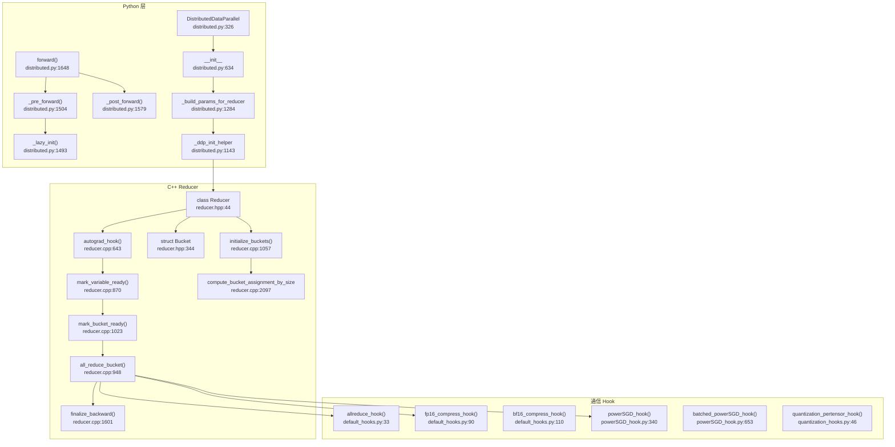
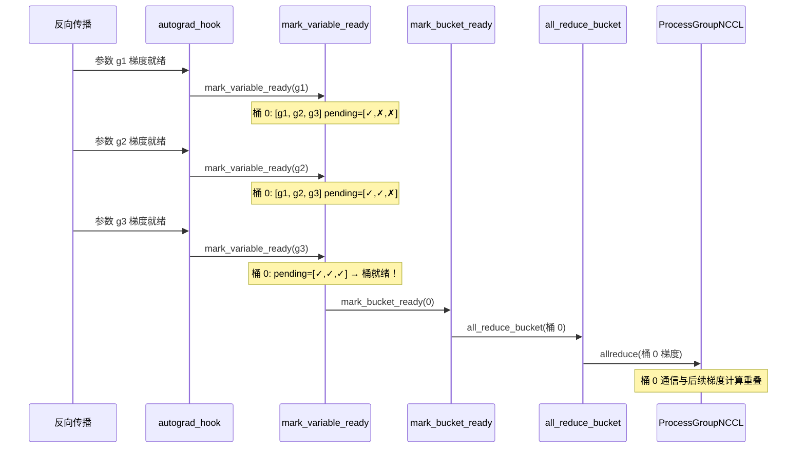
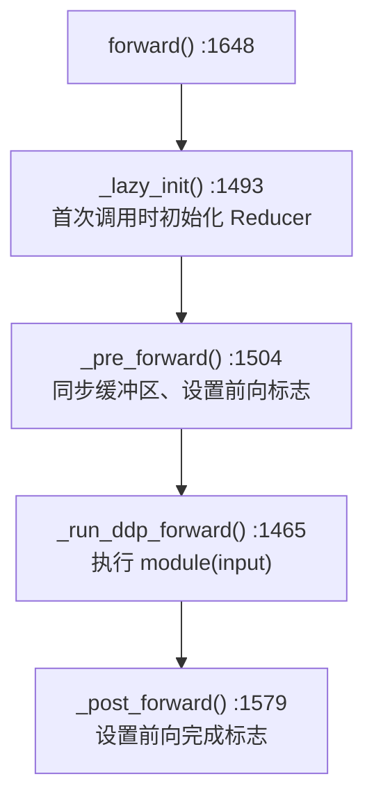
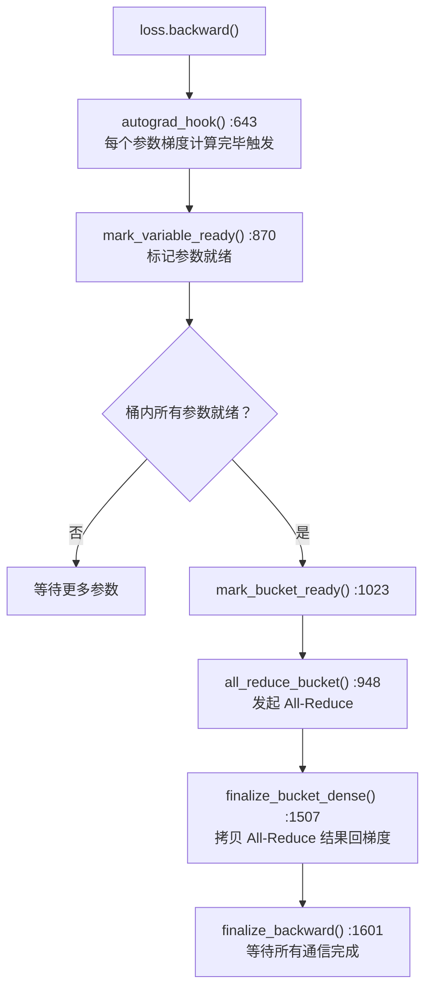

# 41. PyTorch DistributedDataParallel (DDP) 系统

## 目录

- [41.1 整体架构](#411-整体架构)
- [41.2 DistributedDataParallel 类](#412-distributeddataparallel-类)
- [41.3 Reducer：梯度同步引擎](#413-reducer梯度同步引擎)
- [41.4 Bucket 化与 All-Reduce 流水线](#414-bucket-化与-all-reduce-流水线)
- [41.5 前向/反向流程](#415-前向反向流程)
- [41.6 通信 Hook 系统](#416-通信-hook-系统)
- [41.7 find_unused_parameters 与 static_graph](#417-find_unused_parameters-与-static_graph)
- [41.8 Join 机制](#418-join-机制)
- [41.9 混合精度支持](#419-混合精度支持)
- [41.10 设计权衡](#4110-设计权衡)
- [41.11 关键文件索引](#4111-关键文件索引)

---

## 41.1 整体架构

DDP 是 PyTorch 的数据并行训练方案，在每个 GPU 上维护模型副本，通过梯度 All-Reduce 实现同步训练。核心架构分为 Python 层（`DistributedDataParallel`）和 C++ 层（`Reducer`）。



---

## 41.2 DistributedDataParallel 类

`DistributedDataParallel` (`distributed.py:326`) 继承 `Module` 和 `Joinable`，是 DDP 的 Python 入口。

### __init__() (`:634`)

```python
def __init__(
    self,
    module: Module,
    device_ids=None,
    output_device=None,
    dim=0,
    broadcast_buffers=True,
    process_group=None,
    bucket_cap_mb=25,
    find_unused_parameters=False,
    gradient_as_bucket_view=False,
    static_graph=False,
):
```

关键初始化步骤：

| 步骤 | 方法 | 行号 | 说明 |
|------|------|------|------|
| 1. 参数验证 | — | :634 | 验证 device_ids、process_group 等 |
| 2. 模块广播 | `_distributed_broadcast_coalesced` | :2121 | 将 rank 0 的参数广播到所有 rank |
| 3. 构建参数列表 | `_build_params_for_reducer` | :1284 | 收集所有需同步的参数 |
| 4. 创建 Reducer | `_ddp_init_helper` | :1143 | 初始化 C++ Reducer |
| 5. 注册通信 Hook | `register_comm_hook` | :1941 | 可选的自定义梯度通信 |

### 关键方法

| 方法 | 行号 | 说明 |
|------|------|------|
| `forward()` | :1648 | 前向传播入口，调用 `_run_ddp_forward` |
| `_run_ddp_forward()` | :1465 | 实际执行模块前向计算 |
| `_pre_forward()` | :1504 | 前向前：惰性初始化、同步缓冲区 |
| `_post_forward()` | :1579 | 前向后：设置前向完成标志 |
| `_lazy_init()` | :1493 | 惰性初始化 Reducer |
| `no_sync()` | :1420 | 上下文管理器，禁用梯度同步 |
| `register_comm_hook()` | :1941 | 注册自定义梯度通信 Hook |
| `_register_builtin_comm_hook()` | :2022 | 注册内置通信 Hook |

---

## 41.3 Reducer：梯度同步引擎

`Reducer` (`reducer.hpp:44`) 是 DDP 的 C++ 核心引擎，负责梯度桶化管理、All-Reduce 通信和梯度回写。

### 核心数据结构

**Bucket (`reducer.hpp:344`)**

```cpp
struct Bucket {
    std::vector<at::Tensor> gradients;       // :346 梯度张量
    std::vector<size_t> offsets;              // 参数在桶内的偏移
    std::vector<size_t> lengths_per_variable;// :367 每个变量的长度
    std::vector<c10::TensorOptions> options;  // 张量选项
    std::vector<VariableLocator> variable_locators; // :405
    at::Tensor bucket_views_in;              // :360 桶视图（输入）
    at::Tensor bucket_views_out;             // :361 桶视图（输出）
    std::vector<bool> pending;               // :379 未就绪参数标记
    std::shared_ptr<torch::jit::Future<c10::ivalue::Future>> future_work; // :386
};
```

**Reducer 关键方法**

| 方法 | 行号 | 说明 |
|------|------|------|
| `Reducer()` | :90 | 构造函数，初始化桶和 Hook |
| `autograd_hook()` | :643 | Autograd 回调，标记参数就绪 |
| `mark_variable_ready()` | :870 | 处理就绪参数，检查桶完成 |
| `mark_bucket_ready()` | :1023 | 桶就绪时发起 All-Reduce |
| `all_reduce_bucket()` | :948 | 对桶执行 All-Reduce |
| `finalize_backward()` | :1601 | 反向传播结束，等待所有通信完成 |
| `initialize_buckets()` | :1057 | 初始化/重建桶分配 |
| `prepare_for_backward()` | :1425 | 反向传播前准备 |
| `prepare_for_forward()` | :1316 | 前向传播前准备 |
| `rebuild_buckets()` | :1798 | 重建桶（静态图优化） |
| `sync_bucket_indices()` | :1721 | 同步桶索引跨 rank |

### 常量

| 常量 | 行号 | 值 | 说明 |
|------|------|-----|------|
| `kDefaultFirstBucketBytes` | :29 | 1MB | 首桶大小（更小以加速首次通信） |
| `kDefaultBucketBytesCap` | :30 | 25MB | 默认桶大小上限 |

---

## 41.4 Bucket 化与 All-Reduce 流水线

DDP 将参数梯度按大小分桶（Bucket），当一个桶内所有参数梯度就绪时，立即发起 All-Reduce，实现计算与通信重叠。

### compute_bucket_assignment_by_size() (`reducer.cpp:2097`)

```cpp
std::vector<std::vector<size_t>> compute_bucket_assignment_by_size(
    const std::vector<at::Tensor>& tensors,
    const std::vector<size_t>& bucket_sizes,
    ...
);
```

按参数大小和类型分配桶，优先将小参数合并到同一桶中，大参数单独成桶。

### 桶化流水线



### initialize_bucket_views() (`reducer.cpp:1227`)

创建桶的输入/输出视图。`bucket_views_in` 指向原始梯度内存；`bucket_views_out` 是 All-Reduce 结果的输出位置。当 `gradient_as_bucket_view=True` 时，输出视图直接覆盖梯度内存，避免额外拷贝。

---

## 41.5 前向/反向流程

### 前向传播



### 反向传播



### prepare_for_backward() (`reducer.cpp:1425`)

反向传播前的准备工作：
1. 重置桶计数器
2. 标记所有参数为未就绪
3. 若 `find_unused_parameters=True`，初始化未使用参数检测

---

## 41.6 通信 Hook 系统

DDP 的通信 Hook 允许用户自定义梯度通信策略，覆盖默认的 All-Reduce。

### 注册接口

```python
# 自定义 Hook :1941
ddp.register_comm_hook(state, hook)

# 内置 Hook :2022
ddp._register_builtin_comm_hook(hook_type)
```

### 内置 Hook（`default_hooks.py`）

| Hook | 行号 | 说明 |
|------|------|------|
| `allreduce_hook()` | :33 | 默认 All-Reduce（求平均） |
| `fp16_compress_hook()` | :90 | FP16 压缩后 All-Reduce |
| `bf16_compress_hook()` | :110 | BF16 压缩后 All-Reduce |
| `fp16_compress_wrapper()` | :131 | 包装任意 Hook，在其前后加 FP16 压缩/解压 |
| `bf16_compress_wrapper()` | :169 | 包装任意 Hook，在其前后加 BF16 压缩/解压 |

### PowerSGD Hook（`powerSGD_hook.py`）

| 类/函数 | 行号 | 说明 |
|---------|------|------|
| `PowerSGDState` | :122 | PowerSGD 压缩状态（P/Q 矩阵缓存） |
| `powerSGD_hook()` | :340 | PowerSGD 梯度压缩通信 |
| `batched_powerSGD_hook()` | :653 | 批量 PowerSGD（更高效） |
| `_orthogonalize()` | :20 | QR 分解正交化 |
| `_should_compress()` | :78 | 判断是否值得压缩 |

### 量化 Hook（`quantization_hooks.py`）

| Hook | 行号 | 说明 |
|------|------|------|
| `quantization_pertensor_hook()` | :46 | 逐张量量化 All-Reduce |
| `quantization_perchannel_hook()` | :121 | 逐通道量化 All-Reduce |

### Post-LocalSGD Hook（`post_localSGD_hook.py`）

| 类/函数 | 行号 | 说明 |
|---------|------|------|
| `PostLocalSGDState` | :13 | Post-LocalSGD 状态 |
| `post_localSGD_hook()` | :69 | 本地 SGD + 周期性全局同步 |

### Hook 枚举（`__init__.py`）

`DDPCommHookType` (:44) 枚举所有内置 Hook 类型，`register_ddp_comm_hook()` (:96) 按枚举值注册。

---

## 41.7 find_unused_parameters 与 static_graph

### find_unused_parameters

当模型中某些参数在某些迭代中不参与计算（如条件分支），其梯度不会在反向传播中被计算。DDP 需要知道哪些参数未使用，以正确标记桶完成。

**检测机制**（`reducer.cpp:1345`）：

1. `prepare_for_backward()` 初始化 `local_used_map`
2. `autograd_hook()` 标记已使用参数
3. `finalize_backward()` 检查是否有未标记的参数
4. 未使用参数自动标记为就绪，允许桶完成

**代价**：每次迭代需要额外的 `all_reduce` 同步 `local_used_map`，增加通信开销。

### static_graph

当计算图结构固定时（每次迭代使用相同参数），设置 `static_graph=True` 可优化：

1. 首次迭代记录参数使用模式
2. 后续迭代跳过 `local_used_map` 的 All-Reduce
3. `set_static_graph()` (`reducer.cpp:2057`) 固化桶分配
4. `rebuild_buckets()` (`reducer.cpp:1798`) 优化桶大小

---

## 41.8 Join 机制

`_DDPJoinHook` (`distributed.py:274`) 实现 Join 语义，允许不同 rank 有不同数量的输入批次。

### _DDPJoinHook (`:274`)

```python
class _DDPJoinHook(JoinHook):
    def main_hook(self):  # :287 — 模拟 All-Reduce
    def post_hook(self):  # :321 — 同步最终模型
```

- **main_hook**：当某 rank 已耗尽输入但其他 rank 仍在训练时，该 rank 模拟 All-Reduce 操作（发送零梯度），避免其他 rank 死锁
- **post_hook**：所有 rank 完成后，同步最终模型参数

### join() (`:1753`)

```python
@contextmanager
def join(self, divide_by_initial_world_size=True):
```

上下文管理器，包装训练循环以支持不均匀输入。

---

## 41.9 混合精度支持

### _MixedPrecision (`distributed.py:56`)

```python
@dataclass
class _MixedPrecision:
    param_dtype: Optional[torch.dtype]     # 参数精度
    reduce_dtype: Optional[torch.dtype]     # 梯度归约精度
    buffer_dtype: Optional[torch.dtype]     # 缓冲区精度
```

DDP 混合精度支持：
- 参数以 `param_dtype` 存储
- 梯度以 `reduce_dtype` 进行 All-Reduce
- 缓冲区以 `buffer_dtype` 同步

### _AllreduceUpcastHookState (`mixed_precision_hooks.py:10`)

```python
class _AllreduceUpcastHookState:  # :10
```

混合精度通信 Hook：先在低精度下 All-Reduce，再上转型回原始精度。

### Reducer 混合精度

`set_mixed_precision_param_dtype()` (`reducer.cpp:558`) 设置 Reducer 的混合精度参数类型。`set_divide_factor()` (:536) 根据 world_size 设置除法因子。

---

## 41.10 设计权衡

### 1. 桶化粒度 vs 通信延迟

**选择**：默认 25MB 桶大小（`kDefaultBucketBytesCap`），首桶 1MB（`kDefaultFirstBucketBytes`）。

**原因**：大桶减少 All-Reduce 次数（低延迟开销），但需等待更多参数就绪（减少重叠机会）。首桶更小以尽早开始通信。用户可通过 `bucket_cap_mb` 调节。

### 2. find_unused_parameters 的默认值

**选择**：默认 `find_unused_parameters=False`。

**原因**：大多数模型使用所有参数，启用此选项引入额外的 `local_used_map` All-Reduce 开销。仅在模型有条件分支时需启用。

### 3. gradient_as_bucket_view 优化

**选择**：默认 `gradient_as_bucket_view=False`，需显式启用。

**原因**：设为 `True` 时，桶的 All-Reduce 结果直接写入梯度内存（零拷贝），节省内存和拷贝开销。但梯度张量可能与桶视图共享内存，修改梯度会影响桶数据，用户需注意不要在 All-Reduce 完成前修改梯度。

### 4. C++ Reducer vs Python 实现

**选择**：核心梯度同步逻辑在 C++（Reducer）中实现。

**原因**：`autograd_hook` 在每次梯度计算完成时被调用，频率极高。C++ 实现避免了 Python GIL 和解释器开销，桶管理和 All-Reduce 调度延迟更低。

### 5. 首次迭代惰性初始化

**选择**：Reducer 在首次 `forward()` 时通过 `_lazy_init()` 初始化。

**原因**：避免在 `__init__` 中执行昂贵的操作（如跨 rank 参数同步），允许用户在 DDP 构造后、训练前调整模型。

---

## 41.11 关键文件索引

| 文件路径 | 核心内容 |
|----------|----------|
| `torch/nn/parallel/distributed.py` | `DistributedDataParallel`(:326), `__init__`(:634), `forward`(:1648), `_pre_forward`(:1504), `_post_forward`(:1579), `_ddp_init_helper`(:1143), `register_comm_hook`(:1941), `no_sync`(:1420), `join`(:1753), `_DDPSink`(:241), `_DDPJoinHook`(:274) |
| `torch/csrc/distributed/c10d/reducer.hpp` | `Reducer`(:44), `Bucket`(:344), `VariableLocator`(:405), `kDefaultFirstBucketBytes`(:29), `kDefaultBucketBytesCap`(:30), `compute_bucket_assignment_by_size`(:574) |
| `torch/csrc/distributed/c10d/reducer.cpp` | `Reducer()`(:90), `autograd_hook`(:643), `mark_variable_ready`(:870), `all_reduce_bucket`(:948), `mark_bucket_ready`(:1023), `initialize_buckets`(:1057), `prepare_for_backward`(:1425), `finalize_backward`(:1601), `finalize_bucket_dense`(:1507), `rebuild_buckets`(:1798), `compute_bucket_assignment_by_size`(:2097) |
| `torch/csrc/distributed/c10d/default_comm_hooks.hpp` | `BuiltinCommHookType`(:8), `AllReduceCommHook`(:13), `FP16CompressCommHook`(:24) |
| `torch/csrc/distributed/c10d/python_comm_hook.h` | `PythonCommHook`(:12) |
| `torch/distributed/algorithms/ddp_comm_hooks/default_hooks.py` | `allreduce_hook`(:33), `fp16_compress_hook`(:90), `bf16_compress_hook`(:110) |
| `torch/distributed/algorithms/ddp_comm_hooks/powerSGD_hook.py` | `PowerSGDState`(:122), `powerSGD_hook`(:340), `batched_powerSGD_hook`(:653) |
| `torch/distributed/algorithms/ddp_comm_hooks/quantization_hooks.py` | `quantization_pertensor_hook`(:46), `quantization_perchannel_hook`(:121) |
| `torch/distributed/algorithms/ddp_comm_hooks/post_localSGD_hook.py` | `PostLocalSGDState`(:13), `post_localSGD_hook`(:69) |
| `torch/distributed/algorithms/ddp_comm_hooks/debugging_hooks.py` | `noop_hook`(:10) |
| `torch/distributed/algorithms/ddp_comm_hooks/ddp_zero_hook.py` | `hook_with_zero_step`(:176), `hook_with_zero_step_interleaved`(:338) |
| `torch/distributed/algorithms/ddp_comm_hooks/mixed_precision_hooks.py` | `_AllreduceUpcastHookState`(:10), `_reducer_allreduce_and_upcast_hook`(:25) |
| `torch/distributed/algorithms/ddp_comm_hooks/optimizer_overlap_hooks.py` | `_apply_optim_in_backward_hook`(:49), `_hook_then_optimizer`(:130) |
