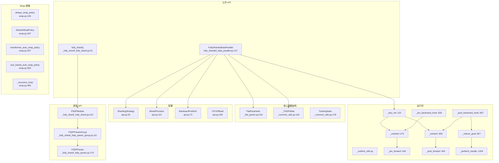
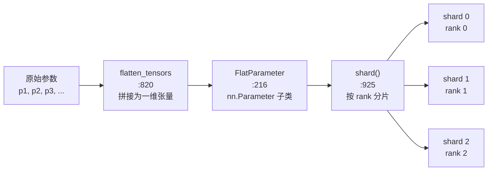
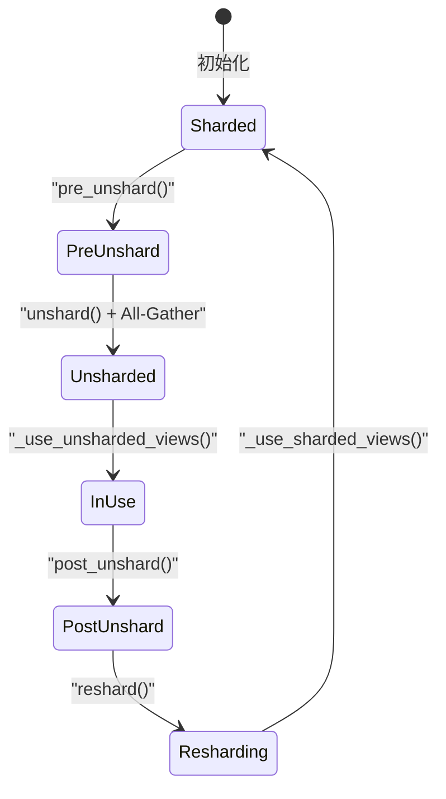
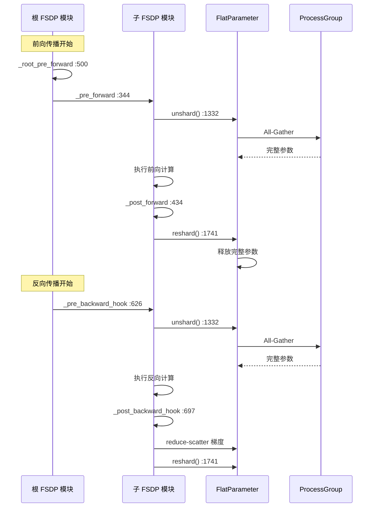

# 42. PyTorch FSDP (Fully Sharded Data Parallel) 系统

## 目录

- [42.1 整体架构](#421-整体架构)
- [42.2 FullyShardedDataParallel 类](#422-fullyshardeddataparallel-类)
- [42.3 FlatParameter：参数分片与重组](#423-flatparameter参数分片与重组)
- [42.4 Unshard/Reshard 运行时](#424-unshardreshard-运行时)
- [42.5 前向/反向 Hook 机制](#425-前向反向-hook-机制)
- [42.6 分片策略与混合精度](#426-分片策略与混合精度)
- [42.7 Wrap 策略](#427-wrap-策略)
- [42.8 梯度规约与反向预取](#428-梯度规约与反向预取)
- [42.9 状态字典](#429-状态字典)
- [42.10 新版 _fully_shard API](#4210-新版-_fully_shard-api)
- [42.11 设计权衡](#4211-设计权衡)
- [42.12 关键文件索引](#4212-关键文件索引)

---

## 42.1 整体架构

FSDP 是 PyTorch 的高级分片数据并行方案，将模型参数、梯度和优化器状态均匀分片到各 rank，显著降低单卡显存占用。与 DDP（每卡完整副本）不同，FSDP 仅在计算时 All-Gather 完整参数，计算后立即丢弃（reshard）。



---

## 42.2 FullyShardedDataParallel 类

`FullyShardedDataParallel` (`fully_sharded_data_parallel.py:127`) 继承 `nn.Module` 和 `_FSDPState`。

### __init__() (`:411`)

```python
def __init__(
    self,
    module: nn.Module,
    process_group=None,
    sharding_strategy: Optional[ShardingStrategy] = None,
    cpu_offload: Optional[CPUOffload] = None,
    auto_wrap_policy: Optional[Callable] = None,
    backward_prefetch: Optional[BackwardPrefetch] = None,
    mixed_precision: Optional[MixedPrecision] = None,
    ...
):
```

初始化流程：
1. 验证参数和设备
2. 递归包装子模块（`auto_wrap_policy`）
3. 将参数扁平化为 `FlatParameter`
4. 对 `FlatParameter` 执行分片（shard）
5. 注册前向/反向 Hook

### 关键方法

| 方法 | 行号 | 说明 |
|------|------|------|
| `forward()` | :842 | 前向传播入口 |
| `module` (property) | :528 | 返回被包装的原始模块 |
| `_flat_param` (property) | :542 | 返回 FlatParameter |
| `_lazy_init()` | — | 在 `_runtime_utils.py:110` |
| `no_sync()` | :1038 | 上下文管理器，禁用梯度同步 |
| `clip_grad_norm_()` | :1077 | 梯度裁剪（考虑分片） |
| `summon_full_params()` | :871 | 上下文管理器，临时恢复完整参数 |
| `register_comm_hook()` | :1997 | 注册自定义通信 Hook |

---

## 42.3 FlatParameter：参数分片与重组

`FlatParameter` (`_flat_param.py:216`) 是 FSDP 的核心数据结构，将多个原始参数拼接为一个扁平参数，然后按 rank 分片。

### 创建流程



### 关键方法

| 方法 | 行号 | 说明 |
|------|------|------|
| `__new__()` | :376 | 创建 FlatParameter 实例 |
| `__init__()` | :502 | 初始化，接收原始参数列表 |
| `_init_flat_param_and_metadata()` | :625 | 初始化扁平参数和元数据 |
| `flatten_tensors()` | :820 | 将参数列表拼接为扁平张量 |
| `shard()` | :925 | 对扁平参数执行分片 |
| `_init_shard_metadata()` | :958 | 初始化分片元数据 |
| `_get_shard()` | :1098 | 获取当前 rank 的分片 |
| `pre_unshard()` | :1281 | Unshard 前准备（如精度转换） |
| `unshard()` | :1332 | All-Gather 恢复完整参数 |
| `_all_gather_flat_param()` | :1413 | 执行 All-Gather 通信 |
| `_use_unsharded_flat_param()` | :1465 | 使用 unshard 后的完整参数 |
| `post_unshard()` | :1496 | Unshard 后清理 |
| `reshard()` | :1741 | 释放完整参数，保留本地分片 |
| `_free_unsharded_flat_param()` | :1780 | 释放完整参数内存 |
| `_use_sharded_flat_param()` | :1798 | 切换回分片视图 |
| `_use_unsharded_views()` | :1924 | 为原始参数创建 unshard 视图 |
| `_use_sharded_views()` | :2105 | 为原始参数创建分片视图 |
| `unflatten_as_params()` | :2088 | 将扁平参数反扁平化为原始参数 |
| `prepare_gradient_for_backward()` | :1587 | 为反向传播准备梯度 |
| `prepare_gradient_for_optim()` | :1653 | 为优化器步进准备梯度 |

### Unshard/Reshard 生命周期



---

## 42.4 Unshard/Reshard 运行时

`_runtime_utils.py` 包含 FSDP 的运行时核心逻辑。

### _lazy_init() (`:110`)

```python
def _lazy_init(state, module):
```

首次前向调用时初始化：
1. 设置进程组信息
2. 初始化 FlatParameter 分片
3. 注册前向/反向 Hook
4. 设置 CUDA 流

### _unshard() (`:273`)

```python
def _unshard(state, handle, async_op=True):
```

执行 All-Gather 恢复完整参数。`async_op=True` 时异步执行，允许计算与通信重叠。

### _reshard() (`:306`)

```python
def _reshard(state, handle, free_unsharded_flat_param=True):
```

释放完整参数，切回分片状态。`free_unsharded_flat_param=True` 时立即释放完整参数内存。

### _prefetch_handle() (`:1204`)

```python
def _prefetch_handle(state, handle, prefetch_handle_list):
```

反向传播中的预取机制：在当前参数的反向计算开始前，预取下一个需要的参数，实现反向计算与 All-Gather 通信的重叠。

---

## 42.5 前向/反向 Hook 机制

FSDP 通过注册模块 Hook 实现参数的自动 unshard/reshard。

### 前向 Hook

| Hook | 行号 | 说明 |
|------|------|------|
| `_root_pre_forward()` | :500 | 根模块前向前：设置训练状态、流同步 |
| `_pre_forward()` | :344 | 子模块前向前：unshard 参数 |
| `_pre_forward_unshard()` | :407 | 实际执行 unshard |
| `_post_forward()` | :434 | 子模块前向后：reshard 参数 |
| `_post_forward_reshard()` | :482 | 实际执行 reshard |

### 反向 Hook

| Hook | 行号 | 说明 |
|------|------|------|
| `_pre_backward_hook()` | :626 | 反向前：unshard 参数 |
| `_post_backward_hook()` | :697 | 反向后：reduce-scatter 梯度、reshard |
| `_post_backward_reshard_only_hook()` | :773 | 仅 reshard（不规约） |
| `_post_backward_reshard()` | :789 | 反向 reshard 实现 |
| `_post_backward_final_callback()` | :1080 | 最终回调：清理状态 |

### Hook 注册

| 注册函数 | 行号 | 说明 |
|----------|------|------|
| `_register_pre_forward_hook()` | :1299 | 注册前向前 Hook |
| `_register_post_forward_hook()` | :1319 | 注册前向后 Hook |
| `_register_root_pre_forward_hook()` | :1342 | 注册根前向 Hook |
| `_register_pre_backward_hooks()` | :1366 | 注册反向前 Hook |
| `_register_post_backward_hook()` | :1412 | 注册反向后 Hook |
| `_register_post_backward_final_callback()` | :1514 | 注册反向最终回调 |

### Hook 执行流程



---

## 42.6 分片策略与混合精度

### ShardingStrategy (`api.py:32`)

| 策略 | 行号 | 说明 | 内存节省 |
|------|------|------|----------|
| `FULL_SHARD` | :65 | 完全分片（参数+梯度+优化器） | 最高 |
| `SHARD_GRAD_OP` | :66 | 仅分片梯度和优化器状态 | 中等 |
| `NO_SHARD` | :67 | 不分片（等同于 DDP） | 无 |
| `HYBRID_SHARD` | :68 | 混合分片（节点内复制+节点间分片） | 高 |
| `_HYBRID_SHARD_ZERO2` | :69 | 混合分片 Zero2 模式 | 中高 |

### MixedPrecision (`api.py:112`)

```python
@dataclass
class MixedPrecision:
    param_dtype: Optional[torch.dtype]      # :220 参数存储精度
    reduce_dtype: Optional[torch.dtype]     # :221 梯度规约精度
    buffer_dtype: Optional[torch.dtype]     # :222 缓冲区精度
    keep_low_precision_grads: bool = False  # :223 保持低精度梯度
    cast_forward_inputs: bool = False       # :224 转换前向输入
    cast_root_forward_inputs: bool = True   # :225 转换根模块前向输入
```

### BackwardPrefetch (`api.py:72`)

| 策略 | 行号 | 说明 |
|------|------|------|
| `BACKWARD_PRE` | :107 | 反向前预取（更激进，通信与计算重叠更好） |
| `BACKWARD_POST` | :108 | 反向后预取（更保守，内存使用更少） |

### CPUOffload (`api.py:230`)

```python
@dataclass
class CPUOffload:
    offload_params: bool = False  # 将参数卸载到 CPU
```

---

## 42.7 Wrap 策略

FSDP 需要决定如何将模型层次化地包装为 FSDP 单元。`wrap.py` 提供多种自动包装策略。

### 策略列表

| 策略 | 行号 | 说明 |
|------|------|------|
| `always_wrap_policy` | :126 | 将每个子模块包装为独立 FSDP 单元 |
| `ModuleWrapPolicy` | :187 | 按模块类名包装 |
| `CustomPolicy` | :224 | 自定义策略 |
| `lambda_auto_wrap_policy` | :279 | 基于 lambda 函数的包装策略 |
| `transformer_auto_wrap_policy` | :307 | 针对Transformer 模型的包装策略 |
| `size_based_auto_wrap_policy` | :350 | 按参数量阈值包装 |
| `_or_policy` | :334 | 组合多个策略（任一满足即包装） |

### _recursive_wrap() (`:495`)

```python
def _recursive_wrap(module, auto_wrap_policy, ...):
```

递归遍历模块树，根据策略决定哪些子模块需要包装为 FSDP 单元。

### enable_wrap() / wrap() (`:410/:445`)

```python
def enable_wrap(policy=None, **kwargs):  # :410 上下文管理器
def wrap(module, **wrap_overrides):       # :445 包装函数
```

---

## 42.8 梯度规约与反向预取

### _reduce_grad() (`:827`)

```python
def _reduce_grad(state, handle):
```

梯度规约流程：
1. 将本地梯度 reduce-scatter 到各 rank
2. 每个 rank 仅保留属于自己的梯度分片
3. 若启用 `CPUOffload`，将梯度移至 CPU

### _reduce_grad_no_shard() (`:928`)

不分片模式下的梯度规约，直接 All-Reduce 取平均。

### _prefetch_handle() (`:1204`)

```python
def _prefetch_handle(state, handle, prefetch_handle_list):
```

反向传播预取：在当前层反向计算的同时，提前发起下一层参数的 All-Gather。预取目标通过 `_get_handle_to_prefetch()` (:1235) 确定。

### _FreeEventQueue (`_limiter_utils.py:7`)

管理已释放参数的 CUDA 事件队列，确保在 All-Gather 通信完成前不释放相关内存。

---

## 42.9 状态字典

FSDP 支持多种状态字典格式，适应不同的保存/加载场景。

### StateDictType (`api.py:244`)

| 类型 | 行号 | 说明 |
|------|------|------|
| `FULL_STATE_DICT` | — | 完整状态字典（所有 rank 相同） |
| `LOCAL_STATE_DICT` | — | 本地分片状态字典 |
| `SHARDED_STATE_DICT` | — | 分片状态字典 |

### 状态字典配置

| 配置类 | 行号 | 说明 |
|--------|------|------|
| `StateDictConfig` | :276 | 基础配置 |
| `FullStateDictConfig` | :293 | 完整状态字典配置 |
| `LocalStateDictConfig` | :330 | 本地状态字典配置 |
| `ShardedStateDictConfig` | :335 | 分片状态字典配置 |
| `StateDictSettings` | :408 | 状态字典设置组合 |

### 优化器状态字典

| 方法 | 行号 | 说明 |
|------|------|------|
| `full_optim_state_dict()` | :1375 | 获取完整优化器状态字典 |
| `sharded_optim_state_dict()` | :1451 | 获取分片优化器状态字典 |
| `shard_full_optim_state_dict()` | :1485 | 分片完整优化器状态字典 |
| `optim_state_dict()` | :1812 | 统一优化器状态字典 API |

---

## 42.10 新版 _fully_shard API

`torch/distributed/fsdp/_fully_shard/` 提供了新版 FSDP API，基于 `DTensor` 和更简洁的设计。

### fully_shard() (`_fully_shard.py:51`)

```python
def fully_shard(module, *, mesh=None, reshard_after_forward=True):
```

将模块包装为分片单元，支持 2D mesh（混合分片）。

### FSDPModule (`:210`)

```python
class FSDPModule(nn.Module):  # :210
```

新版 FSDP 模块包装器，替代 `FullyShardedDataParallel`。

### FSDPParamGroup (`_fsdp_param_group.py:111`)

```python
class FSDPParamGroup:  # :111
```

参数组管理，处理一组参数的 All-Gather 和 Reduce-Scatter 通信。

### FSDPParam (`_fsdp_param.py:179`)

```python
class FSDPParam:  # :179
```

单个参数的分片状态管理。

### 通信原语 (`_fsdp_collectives.py`)

| 函数 | 行号 | 说明 |
|------|------|------|
| `foreach_all_gather` | :131 | 批量 All-Gather |
| `foreach_reduce` | :323 | 批量 Reduce-Scatter |
| `foreach_reduce_scatter_copy_in` | :491 | 批量 Reduce-Scatter 前拷贝 |

---

## 42.11 设计权衡

### 1. 参数扁平化（FlatParameter）

**选择**：将多个参数拼接为单一 FlatParameter，然后分片。

**原因**：单一 All-Gather 通信代替多次小通信，大幅减少通信开销。代价是丢失参数边界信息，需要视图映射来恢复原始参数名。

### 2. 惰性初始化

**选择**：FSDP 在首次前向调用时通过 `_lazy_init()` 完成初始化。

**原因**：允许用户在构造 FSDP 后修改模型（如添加参数、更改设备），避免在 `__init__` 中执行昂贵的通信操作。代价是首次前向调用延迟较高。

### 3. 混合分片策略（HYBRID_SHARD）

**选择**：支持节点内复制、节点间分片的混合策略。

**原因**：节点内通信（NVLink）远快于节点间通信（InfiniBand），在节点内保持完整参数可避免频繁的 All-Gather，同时跨节点分片降低全局内存占用。

### 4. 反向预取时机

**选择**：提供 `BACKWARD_PRE` 和 `BACKWARD_POST` 两种预取策略。

**原因**：`BACKWARD_PRE` 在当前层反向计算开始前就发起下一层的 All-Gather，通信与计算重叠更好，但需要在内存中同时保存当前层和下一层的完整参数。`BACKWARD_POST` 更保守，内存占用更少但重叠机会更少。

### 5. 新版 vs 旧版 API

**选择**：保留 `FullyShardedDataParallel` 类的同时引入 `_fully_shard` 函数式 API。

**原因**：旧版 API 基于类继承，与 `torch.compile` 和 `torch.export` 存在兼容性问题。新版 API 基于 Hook 和状态管理，对 Dynamo 更友好，且支持 DTensor。两者在功能上等价，新版是未来发展方向。

---

## 42.12 关键文件索引

| 文件路径 | 核心内容 |
|----------|----------|
| `torch/distributed/fsdp/fully_sharded_data_parallel.py` | `FullyShardedDataParallel`(:127), `__init__`(:411), `forward`(:842), `summon_full_params`(:871), `no_sync`(:1038), `clip_grad_norm_`(:1077), `register_comm_hook`(:1997) |
| `torch/distributed/fsdp/_flat_param.py` | `FlatParameter`(:216), `shard`(:925), `unshard`(:1332), `reshard`(:1741), `flatten_tensors`(:820), `_all_gather_flat_param`(:1413), `_use_unsharded_views`(:1924), `_use_sharded_views`(:2105) |
| `torch/distributed/fsdp/api.py` | `ShardingStrategy`(:32), `MixedPrecision`(:112), `BackwardPrefetch`(:72), `CPUOffload`(:230), `StateDictType`(:244), `FullStateDictConfig`(:293), `StateDictSettings`(:408) |
| `torch/distributed/fsdp/_runtime_utils.py` | `_lazy_init`(:110), `_unshard`(:273), `_reshard`(:306), `_pre_forward`(:344), `_post_forward`(:434), `_pre_backward_hook`(:626), `_post_backward_hook`(:697), `_reduce_grad`(:827), `_prefetch_handle`(:1204), Hook 注册函数(:1299-1514) |
| `torch/distributed/fsdp/_common_utils.py` | `_FSDPState`(:118), `TrainingState`(:178), `HandleTrainingState`(:188) |
| `torch/distributed/fsdp/_optim_utils.py` | `FSDPParamInfo`(:67), `_OptimStateKey`(:122), `_flatten_optim_state_dict`(:416), `_optim_state_dict`(:1867) |
| `torch/distributed/fsdp/wrap.py` | `always_wrap_policy`(:126), `ModuleWrapPolicy`(:187), `transformer_auto_wrap_policy`(:307), `size_based_auto_wrap_policy`(:350), `wrap`(:445), `_recursive_wrap`(:495) |
| `torch/distributed/fsdp/_unshard_param_utils.py` | `_unshard_params`(:272), `_unshard_fsdp_state_params`(:159), `_writeback_to_local_shard`(:34) |
| `torch/distributed/fsdp/_state_dict_utils.py` | `_full_pre_state_dict_hook`(:286), `_local_pre_state_dict_hook`(:380), `_sharded_pre_state_dict_hook`(:506) |
| `torch/distributed/fsdp/_init_utils.py` | `_init_core_state`(:429), `_init_runtime_state`(:495), `_init_param_handle_from_module`(:572) |
| `torch/distributed/fsdp/_limiter_utils.py` | `_FreeEventQueue`(:7) |
| `torch/distributed/fsdp/_fully_shard/_fully_shard.py` | `fully_shard`(:51), `FSDPModule`(:210), `UnshardHandle`(:458) |
| `torch/distributed/fsdp/_fully_shard/_fsdp_param_group.py` | `FSDPParamGroup`(:111), `FSDPCommContext`(:49) |
| `torch/distributed/fsdp/_fully_shard/_fsdp_param.py` | `FSDPParam`(:179), `ShardedState`(:144) |
| `torch/distributed/fsdp/_fully_shard/_fsdp_collectives.py` | `foreach_all_gather`(:131), `foreach_reduce`(:323) |
| `torch/distributed/fsdp/_fully_shard/_fsdp_api.py` | `MixedPrecisionPolicy`(:9), `OffloadPolicy`(:51), `CPUOffloadPolicy`(:59) |
