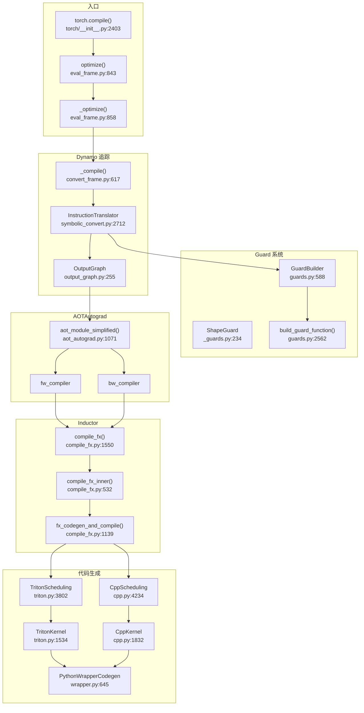
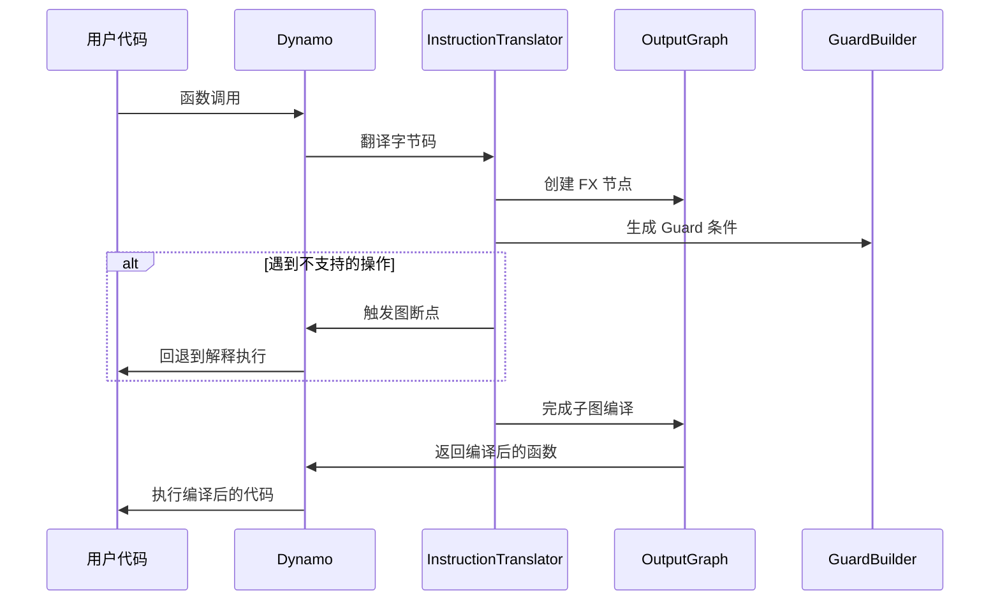
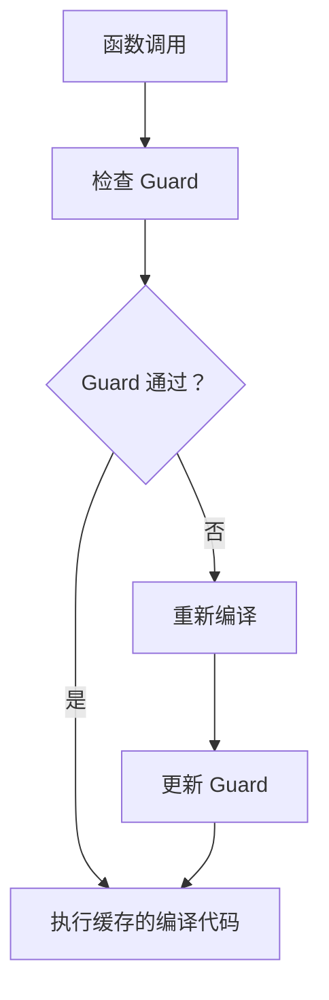
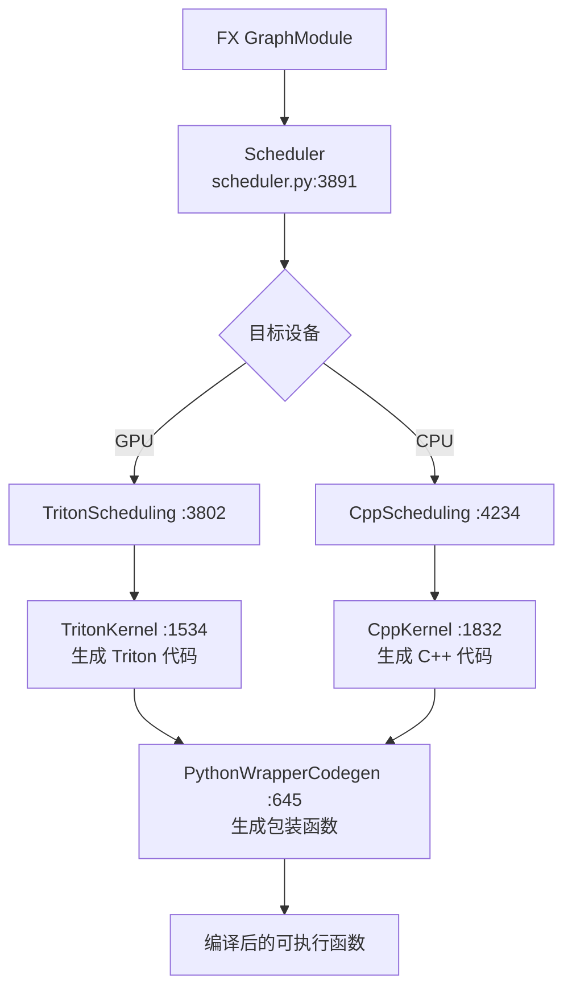

# 43. PyTorch torch.compile() 编译管线

## 目录

- [43.1 整体架构](#431-整体架构)
- [43.2 入口：torch.compile()](#432-入口torchcompile)
- [43.3 Dynamo 字节码捕获](#433-dynamo-字节码捕获)
- [43.4 Guard 系统](#434-guard-系统)
- [43.5 OutputGraph 与 FX 图生成](#435-outputgraph-与-fx-图生成)
- [43.6 AOTAutograd 前向/反向分离](#436-aotautograd-前向反向分离)
- [43.7 Inductor 后端编译](#437-inductor-后端编译)
- [43.8 Triton/C++ 代码生成](#438-tritonc-代码生成)
- [43.9 图断点与 Fallback](#439-图断点与-fallback)
- [43.10 设计权衡](#4310-设计权衡)
- [43.11 关键文件索引](#4311-关键文件索引)

---

## 43.1 整体架构

`torch.compile()` 是 PyTorch 2.x 的 JIT 编译入口，串联 Dynamo（字节码捕获）→ AOTAutograd（前向/反向分离）→ Inductor（代码生成）三大子系统。



---

## 43.2 入口：torch.compile()

### torch.compile() (`torch/__init__.py:2403`)

```python
def compile(
    model: Optional[Callable] = None, *,
    fullgraph: bool = False,
    dynamic: bool = False,
    backend: Union[str, Callable] = "inductor",
    mode: Optional[str] = None,
    options: Optional[Dict] = None,
    disable: bool = False,
) -> Union[Callable, _NullDecorator]:
```

关键参数：
- **`fullgraph`**：`True` 等同 `nopython=True`，任何图断点都会报错
- **`dynamic`**：启用动态形状支持
- **`backend`**：编译后端，默认 `"inductor"`；也支持 `"eager"`、`"aot_eager"`、自定义函数
- **`mode`**：预设优化模式（`"default"`、`"reduce-overhead"`、`"max-autotune"`）

### optimize() (`eval_frame.py:843`)

```python
def optimize(backend, nopython=False, dynamic=False, disable=False):
```

Dynamo 的核心入口，委托给 `_optimize()` (:858)。

### _optimize_catch_errors() (`eval_frame.py:775`)

```python
def _optimize_catch_errors(compile_fn, ...):
```

包装编译函数，捕获并报告 Dynamo 追踪错误，返回 `OptimizeContext` (:649)。

---

## 43.3 Dynamo 字节码捕获

Dynamo 通过拦截 Python 字节码执行，将操作转换为 FX 图。

### InstructionTranslator (`symbolic_convert.py:2712`)

```python
class InstructionTranslator(InstructionTranslatorBase):
```

主翻译器，逐条解释 Python 字节码：
- **LOAD/STORE 指令**：映射到变量栈操作
- **CALL 指令**：创建 FX 图节点或内联追踪
- **控制流指令**：生成 Guard 或触发图断点
- **BINARY_OP 指令**：翻译为张量/符号操作

### InliningInstructionTranslator (`:3102`)

```python
class InliningInstructionTranslator(InstructionTranslatorBase):
```

内联翻译器，追踪被调用的函数/方法，将其操作内联到当前 FX 图中。

### _compile() (`convert_frame.py:617`)

```python
def _compile(frame, ...):
```

编译入口：对给定的 Python 栈帧执行 Dynamo 追踪，生成 FX 图和 Guard。

### 字节码翻译流程



---

## 43.4 Guard 系统

Guard 系统确保编译后的代码在输入不变时安全复用，输入变化时重新编译。

### GuardBuilder (`guards.py:588`)

```python
class GuardBuilder(GuardBuilderBase):
```

主要 Guard 构建器，为每种数据类型生成检查代码：

| 数据类型 | Guard 内容 |
|----------|-----------|
| Tensor | shape、dtype、device、stride、requires_grad |
| NN Module | 属性类型、参数值 |
| Python 值 | 对象 ID、值相等性 |
| 全局状态 | `torch.is_grad_enabled()` 等 |

### ShapeGuard (`_guards.py:234`)

```python
class ShapeGuard(NamedTuple):
    symbol: sympy.Symbol
    source: GuardSource
```

专门跟踪形状约束的 Guard，关联 sympy 符号与具体来源。

### build_guard_function() (`guards.py:2562`)

```python
def build_guard_function(guards, ...):
```

将 Guard 列表编译为可执行的 Python 检查函数，用于运行时快速判断是否需要重新编译。

### Guard 检查流程



---

## 43.5 OutputGraph 与 FX 图生成

### OutputGraph (`output_graph.py:255`)

```python
class OutputGraph:
```

Dynamo 追踪过程中逐步构建的 FX 图，维护变量到 FX 节点的映射。

### 关键方法

| 方法 | 行号 | 说明 |
|------|------|------|
| `compile_subgraph()` | :964 | 完成子图编译，生成 GraphModule |
| `compile_and_call_fx_graph()` | :1306 | 编译并调用 FX 图 |
| `call_user_compiler()` | :1434 | 调用用户指定的后端编译器 |
| `create_proxy()` | :583 | 为操作创建 FX Proxy |
| `save_global_state()` | :636 | 保存全局状态（用于 Guard） |
| `restore_global_state()` | :1268 | 恢复全局状态 |
| `placeholders` (property) | :1427 | 获取图输入占位符 |

### 编译流程

1. `compile_subgraph()` 将当前追踪状态转为 FX GraphModule
2. `call_user_compiler()` 将 GraphModule 传给后端编译器
3. 后端返回优化后的可执行函数

---

## 43.6 AOTAutograd 前向/反向分离

AOTAutograd 将前向和反向计算分离，分别编译。

### aot_module_simplified() (`aot_autograd.py:1071`)

```python
def aot_module_simplified(mod, args, fw_compiler, bw_compiler, ...):
```

Dynamo 使用的 AOTAutograd 入口：
1. 使用 `make_fx` 追踪前向+反向联合图
2. 将联合图分区为前向图和反向图
3. 分别调用 `fw_compiler` 和 `bw_compiler` 编译

### 分区策略

- **前向分区**：包含所有前向计算节点
- **反向分区**：包含所有梯度计算节点
- **保存张量**：前向图输出中需要传给反向图的中间张量

---

## 43.7 Inductor 后端编译

### compile_fx() (`compile_fx.py:1550`)

```python
def compile_fx(
    model: torch.fx.GraphModule,
    example_inputs: List[torch.Tensor],
    ...,
) -> CompiledFxGraph:
```

Inductor 的主入口，编排整个编译流程：

1. **Pre-grad Pass**：`_recursive_pre_grad_passes()` (:303)
2. **AOT Autograd 分区**：前向/反向分离
3. **Post-grad Pass**：`_recursive_post_grad_passes()` (:331)
4. **调度与代码生成**：`fx_codegen_and_compile()` (:1139)
5. **包装**：生成可执行的 Python/C++ 包装函数

### compile_fx_inner() (`:532`)

```python
def compile_fx_inner(...):
```

内部编译函数，由 AOTAutograd 的 `fw_compiler`/`bw_compiler` 回调。

### fx_codegen_and_compile() (`:1139`)

```python
def fx_codegen_and_compile(gm, example_inputs, ...):
```

核心代码生成与编译：
1. 图优化 Pass（常量折叠、死代码消除等）
2. 调度（`Scheduler`）——将 IR 节点分配给核函数
3. 代码生成（`TritonKernel`/`CppKernel`）
4. 内存规划（`memory_planning`）

---

## 43.8 Triton/C++ 代码生成

### TritonKernel (`triton.py:1534`)

```python
class TritonKernel(SIMDKernel):
```

GPU 代码生成器，生成 Triton kernel 代码：

| 方法 | 行号 | 说明 |
|------|------|------|
| `load()` | :2051 | 生成张量加载代码 |
| `store()` | :2170 | 生成张量存储代码 |
| `reduction()` | :2300 | 生成归约操作代码 |
| `codegen_kernel()` | :3272 | 生成完整 kernel 代码 |

### TritonScheduling (`triton.py:3802`)

```python
class TritonScheduling(SIMDScheduling):
```

GPU 调度器，决定核函数划分、fusion 策略和执行顺序。

### CppKernel (`cpp.py:1832`)

```python
class CppKernel(Kernel):
```

CPU 代码生成器，生成优化的 C++ 向量化代码。

### CppScheduling (`cpp.py:4234`)

```python
class CppScheduling(BaseScheduling):
```

CPU 调度器，决定循环展开、向量化策略。

### PythonWrapperCodegen (`wrapper.py:645`)

```python
class PythonWrapperCodegen(CodeGen):
```

生成 Python 包装代码，调用编译后的 kernel 函数。

### 代码生成层次



---

## 43.9 图断点与 Fallback

### break_graph_if_unsupported() (`symbolic_convert.py:674`)

```python
def break_graph_if_unsupported(...):
```

当 Dynamo 遇到不支持的操作时，将当前子图提交编译，回退到解释执行，然后在下一个支持的操作处重新开始追踪。

### 图断点触发条件

| 条件 | 示例 |
|------|------|
| 不支持的 Python 特性 | `eval()`、动态类创建 |
| 数据依赖控制流 | `if tensor.item() > 0` |
| 不支持的外部库调用 | NumPy 操作（部分支持） |
| 副作用操作 | 文件 I/O、全局状态修改 |

### Fallback 执行

图断点后，Dynamo 将已追踪的子图编译，未追踪部分用原始 Python 解释执行。后续支持的操作会启动新的追踪子图。

---

## 43.10 设计权衡

### 1. 字节码拦截 vs 源码转换

**选择**：Dynamo 使用 CPython 的帧评估 API（`PEP 523`）拦截字节码，而非源码转换。

**原因**：字节码拦截无需修改用户代码，对任意 Python 代码透明。源码转换需要解析和重写源码，限制更多。代价是需要处理 CPython 版本差异。

### 2. Guard 驱动的缓存策略

**选择**：编译结果通过 Guard 条件缓存，Guard 失败时重新编译。

**原因**：避免对每个输入重新编译，同时保证语义正确。代价是某些 Guard 可能过于严格（如 `id` 匹配），导致不必要的重新编译。`dynamic=True` 可放宽形状 Guard。

### 3. AOT 编译 vs JIT 编译

**选择**：使用 AOT（Ahead-Of-Time）编译策略——在首次调用时编译，后续调用复用。

**原因**：AOT 编译允许跨操作全局优化（如算子融合），而 JIT 逐操作编译难以做到。代价是首次调用延迟较高（编译开销）。

### 4. Triton 作为 GPU 代码生成目标

**选择**：GPU 端使用 Triton 而非 CUDA C++ 作为代码生成目标。

**原因**：Triton 提供更高级的抽象（自动内存合并、block 级编程），生成的代码通常比手写 CUDA 更高效。同时 Triton 是 Python DSL，代码生成更简单。

### 5. 图断点容忍 vs 严格模式

**选择**：默认容忍图断点（`fullgraph=False`），遇到不支持的操作自动回退。

**原因**：大多数模型存在少量不支持的操作，严格模式会导致编译失败。容忍图断点使 `torch.compile()` 开箱即用，代价是回退部分的性能没有优化。

---

## 43.11 关键文件索引

| 文件路径 | 核心内容 |
|----------|----------|
| `torch/__init__.py` | `torch.compile`(:2403) |
| `torch/_dynamo/eval_frame.py` | `optimize`(:843), `_optimize`(:858), `_optimize_catch_errors`(:775), `OptimizeContext`(:649) |
| `torch/_dynamo/convert_frame.py` | `_compile`(:617) |
| `torch/_dynamo/symbolic_convert.py` | `InstructionTranslator`(:2712), `InliningInstructionTranslator`(:3102), `break_graph_if_unsupported`(:674) |
| `torch/_dynamo/output_graph.py` | `OutputGraph`(:255), `compile_subgraph`(:964), `call_user_compiler`(:1434) |
| `torch/_dynamo/guards.py` | `GuardBuilder`(:588), `build_guard_function`(:2562), `CheckFunctionManager`(:2215) |
| `torch/_guards.py` | `ShapeGuard`(:234), `Guard`(:241), `GuardsSet`(:601), `CompileContext`(:736) |
| `torch/_inductor/compile_fx.py` | `compile_fx`(:1550), `compile_fx_inner`(:532), `fx_codegen_and_compile`(:1139) |
| `torch/_inductor/codegen/triton.py` | `TritonKernel`(:1534), `TritonScheduling`(:3802), `TritonOverrides`(:813) |
| `torch/_inductor/codegen/cpp.py` | `CppKernel`(:1832), `CppScheduling`(:4234), `CppOverrides`(:612) |
| `torch/_inductor/codegen/wrapper.py` | `PythonWrapperCodegen`(:645) |
| `torch/_inductor/codegen/simd.py` | `SIMDKernel`(:336), `SIMDScheduling`(:1039) |
| `torch/_inductor/scheduler.py` | `BaseScheduling`(:3891) |
| `torch/_functorch/aot_autograd.py` | `aot_module_simplified`(:1071) |