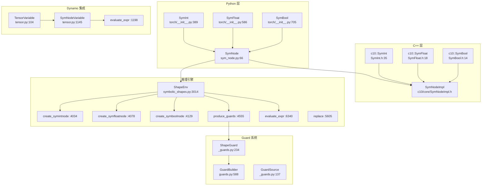

# 44. PyTorch SymInt/SymFloat 符号形状系统

## 目录

- [44.1 整体架构](#441-整体架构)
- [44.2 Python SymInt/SymFloat/SymBool](#442-python-symintsymfloatsymbool)
- [44.3 C++ SymInt/SymFloat/SymBool](#443-c-symintsymfloatsymbool)
- [44.4 SymNode：符号操作核心](#444-symnode符号操作核心)
- [44.5 ShapeEnv：形状推理引擎](#445-shapeenv形状推理引擎)
- [44.6 Guard 与约束系统](#446-guard-与约束系统)
- [44.7 Dynamo 中的符号追踪](#447-dynamo-中的符号追踪)
- [44.8 设计权衡](#448-设计权衡)
- [44.9 关键文件索引](#449-关键文件索引)

---

## 44.1 整体架构

SymInt/SymFloat/SymBool 是 PyTorch 的符号形状系统核心，支持在编译时表示动态维度（如 `batch_size`），实现形状感知的编译优化。



---

## 44.2 Python SymInt/SymFloat/SymBool

Python 层的 SymInt/SymFloat/SymBool 定义在 `torch/__init__.py` 中，是对底层 `SymNode` 的高层封装。

### SymInt (`torch/__init__.py:389`)

```python
class SymInt:
    def __init__(self, node):  # :396
    def __bool__(self):        # :401
    def __int__(self):         # :404
    def __index__(self):       # :407
```

支持完整的算术运算，所有运算委托给 `SymNode`：

| 运算 | 行号 | 说明 |
|------|------|------|
| `__add__` | :496 | 加法 |
| `__mul__` | :508 | 乘法 |
| `__sub__` | :541 | 减法 |
| `__truediv__` | :415 | 真除法 |
| `__floordiv__` | :429 | 整除 |
| `__mod__` | :505 | 取模 |
| `__pow__` | :447 | 幂运算 |
| `__neg__` | :538 | 取负 |

比较运算返回 `SymBool`：

| 运算 | 行号 | 说明 |
|------|------|------|
| `__eq__` | :481 | 等于 |
| `__lt__` | :484 | 小于 |
| `__gt__` | :487 | 大于 |
| `__le__` | :490 | 小于等于 |
| `__ge__` | :493 | 大于等于 |

符号特有运算：

| 运算 | 行号 | 说明 |
|------|------|------|
| `__sym_max__` | :529 | 符号最大值 |
| `__sym_min__` | :532 | 符号最小值 |
| `__sym_float__` | :535 | 转为 SymFloat |
| `_sympy_` | :556 | 转为 sympy 表达式 |

### SymFloat (`:586`)

```python
class SymFloat:
    def __init__(self, node):  # :593
    def __float__(self):       # :621
    def __bool__(self):        # :618
```

与 SymInt 类似，支持浮点运算。特有运算：

| 运算 | 行号 | 说明 |
|------|------|------|
| `__sym_max__` | :670 | 符号最大值 |
| `__sym_min__` | :673 | 符号最小值 |
| `__sym_int__` | :676 | 转为 SymInt |
| `is_integer` | :679 | 判断是否为整数 |

### SymBool (`:705`)

```python
class SymBool:
    def __init__(self, node):  # :715
    def __bool__(self):        # :720
```

支持逻辑运算：

| 运算 | 行号 | 说明 |
|------|------|------|
| `__and__` | :727 | 逻辑与 |
| `__or__` | :730 | 逻辑或 |
| `__sym_not__` | :750 | 逻辑非 |
| `__sym_ite__` | :753 | if-then-else |

### 全局辅助函数

| 函数 | 行号 | 说明 |
|------|------|------|
| `sym_not(a)` | :773 | 符号取反 |
| `sym_float(a)` | :790 | 转为 SymFloat |
| `sym_int(a)` | :805 | 转为 SymInt |
| `sym_max(a, b)` | :820 | 符号最大值 |

---

## 44.3 C++ SymInt/SymFloat/SymBool

C++ 层是符号类型的底层实现，Python 类型通过 `SymNode` 桥接到 C++。

### c10::SymInt (`SymInt.h:35`)

```cpp
class C10_API SymInt {
    // 构造
    SymInt(int64_t val);           // :41 — 具体整数
    SymInt(SymNode node);          // :48 — 符号整数
    SymInt(Unchecked, int64_t);    // :54 — 不检查构造

    // 查询
    bool is_symbolic() const;      // :164 — 是否为符号
    bool has_hint() const;         // :142 — 是否有具体值提示
    int64_t expect_int() const;    // :131 — 期望为具体整数
    int64_t guard_int(const char* file, int64_t line);  // :153 — 带 Guard 的整数

    // 算术
    SymInt operator+(SymInt) const;  // :180
    SymInt operator-(SymInt) const;  // :181
    SymInt operator*(SymInt) const;  // :182
    SymInt operator/(SymInt) const;  // :183
    SymInt operator%(SymInt) const;  // :184

    // 比较（返回 SymBool）
    SymBool sym_eq(SymInt) const;  // :191
    SymBool sym_lt(SymInt) const;  // :193
    SymBool sym_gt(SymInt) const;  // :195
    // ...
};
```

**内部表示**：使用指针标记方案——`data_` 的最低位标记是否为符号（`IS_SYM` mask :283-284）。具体整数直接存储在 `data_` 中，符号通过 `SymNode` 堆分配。

### c10::SymFloat (`SymFloat.h:18`)

```cpp
class C10_API SymFloat {
    SymFloat(double val);         // :20
    SymFloat(SymNode node);       // :21
    double expect_float() const;  // :41
    SymFloat sqrt() const;        // :81
    // 算术和比较运算类似 SymInt
};
```

### c10::SymBool (`SymBool.h:14`)

```cpp
class C10_API SymBool {
    SymBool(bool val);            // :16
    SymBool(SymNode node);        // :17
    bool expect_true() const;     // :60
    bool guard_bool() const;      // :59
    SymBool sym_not() const;      // :44

    // size-oblivious guard（不依赖具体值的 guard）
    bool guard_size_oblivious() const;  // :61
};
```

`guard_size_oblivious()` (:61) 和宏 `TORCH_GUARD_SIZE_OBLIVIOUS` (:107) 对形状无关的布尔守卫很有用——即使符号值未知，也能安全判断。

---

## 44.4 SymNode：符号操作核心

`SymNode` (`sym_node.py:66`) 是所有符号操作的实现层，连接 Python Sym 类型与 C++ SymNodeImpl。

### SymNode (`:66`)

```python
class SymNode:
    def __init__(self, node, pytype, hint, debug_name):  # :81
```

核心职责：
1. 委托算术/比较运算给 C++ `SymNodeImpl`
2. 管理 sympy 表达式与符号的对应关系
3. 在 `__bool__`/`__int__`/`__float__` 时注入 Guard

### _make_user_magic() (`:1538`)

```python
def _make_user_magic():
```

在导入时将 SymNode 的魔法方法安装到 SymInt/SymFloat/SymBool 中。这使得 `SymInt.__add__` 实际执行 `SymNode.__add__` 的逻辑。

### _make_node_magic() (`:1213`)

```python
def _make_node_magic():
```

安装 SymNode 自身的魔法方法，委托给 C++ 实现。

---

## 44.5 ShapeEnv：形状推理引擎

`ShapeEnv` (`symbolic_shapes.py:3014`) 是符号形状推理的核心引擎，维护符号变量、约束和 Guard。

### ShapeEnv.__init__() (`:3025`)

```python
class ShapeEnv:
    def __init__(self, ...):  # :3025
        self.guards = []           # :3144 Guard 列表
        self.var_to_val = {}       # :3148 符号→具体值映射
        self.var_to_range = {}     # :3160 符号→值范围映射
        self.replacements = {}     # :3169 符号替换表
```

### 符号创建方法

| 方法 | 行号 | 说明 |
|------|------|------|
| `create_symbol()` | :4273 | 创建新的符号变量 |
| `create_symintnode()` | :4034 | 创建 SymInt 节点 |
| `create_symfloatnode()` | :4078 | 创建 SymFloat 节点 |
| `create_symboolnode()` | :4129 | 创建 SymBool 节点 |
| `create_unbacked_symint()` | :4195 | 创建无数据支撑的 SymInt |
| `create_unbacked_symbool()` | :4221 | 创建无数据支撑的 SymBool |
| `create_unbacked_symfloat()` | :4173 | 创建无数据支撑的 SymFloat |
| `create_symbolic_sizes_strides_storage_offset()` | :3775 | 为张量创建符号化的形状/步幅/偏移 |

### Guard 生成与评估

| 方法 | 行号 | 说明 |
|------|------|------|
| `produce_guards()` | :4555 | 生成 Guard 列表 |
| `produce_guards_verbose()` | :4562 | 生成详细 Guard（含来源信息） |
| `evaluate_expr()` | :6340 | 评估符号表达式 |
| `evaluate_guards_for_args()` | :5338 | 对参数评估 Guard |
| `evaluate_guards_expression()` | :5330 | 评估 Guard 表达式 |
| `format_guards()` | :5424 | 格式化 Guard 为可读字符串 |

### 约束管理

| 方法 | 行号 | 说明 |
|------|------|------|
| `constrain_symbol_range()` | :6798 | 约束符号值范围 |
| `defer_runtime_assert()` | :6643 | 延迟运行时断言 |

### 符号简化

| 方法 | 行号 | 说明 |
|------|------|------|
| `replace()` | :5605 | 替换符号表达式 |
| `simplify()` | :5632 | 简化符号约束 |
| `size_hint()` | :5680 | 获取符号的具体值提示 |

### ShapeEnvSettings (`:2980`)

```python
@dataclass
class ShapeEnvSettings:
    allow_scalar_outputs: bool
    assume_static_by_default: bool
    specialize_zero_one: bool
    duck_shape: bool
```

### 约束类型

| 类 | 行号 | 说明 |
|----|------|------|
| `Constraint` | :1524 | 基础约束 |
| `StrictMinMaxConstraint` | :1529 | 严格最小最大值约束 |
| `RelaxedUnspecConstraint` | :1558 | 放松的未指定约束 |
| `EqualityConstraint` | :1589 | 等式约束 |

### 符号上下文

| 类 | 行号 | 说明 |
|----|------|------|
| `SymbolicContext` | :1731 | 符号上下文基类 |
| `StatelessSymbolicContext` | :1744 | 无状态符号上下文 |
| `StatefulSymbolicContext` | :1805 | 有状态符号上下文 |
| `SubclassSymbolicContext` | :1840 | 子类符号上下文 |

---

## 44.6 Guard 与约束系统

### ShapeGuard (`_guards.py:234`)

```python
class ShapeGuard(NamedTuple):
    symbol: sympy.Symbol
    source: GuardSource
```

将 sympy 符号与其来源关联，用于生成 Guard 检查代码。

### GuardSource (`_guards.py:137`)

```python
class GuardSource(enum.Enum):
    LOCAL = auto()
    GLOBAL = auto()
    NN_MODULE = auto()
    ...
```

标识 Guard 的来源类型。

### 全局 Guard 函数

| 函数 | 文件 | 行号 | 说明 |
|------|------|------|------|
| `guard_int()` | symbolic_shapes.py | :1432 | Guard 一个 SymInt 为具体值 |
| `guard_float()` | symbolic_shapes.py | :1439 | Guard 一个 SymFloat 为具体值 |
| `guard_bool()` | symbolic_shapes.py | :1425 | Guard 一个 SymBool 为具体值 |
| `guard_scalar()` | symbolic_shapes.py | :1236 | Guard 任意标量 |
| `guard_size_oblivious()` | symbolic_shapes.py | :401 | 不依赖具体值的 Guard |
| `hint_int()` | symbolic_shapes.py | :341 | 获取 SymInt 的提示值 |
| `definitely_true()` | symbolic_shapes.py | :1152 | 判断 SymBool 是否一定为真 |

---

## 44.7 Dynamo 中的符号追踪

### SymNodeVariable (`tensor.py:1145`)

```python
class SymNodeVariable(VariableTracker):  # :1145
    def __init__(self, sym_node, ...):    # :1175
    def evaluate_expr(self):              # :1198
```

Dynamo 中的符号变量追踪器，处理 SymInt/SymFloat/SymBool 的操作。

### TensorVariable 中的形状处理

| 方法 | 行号 | 说明 |
|------|------|------|
| `method_attr_shape()` | :324 | 追踪 `.shape` 属性 |
| `method_size()` | :599 | 追踪 `.size()` 调用 |
| `method_numel()` | :646 | 追踪 `.numel()` 调用 |
| `method_is_contiguous()` | :676 | 追踪 `.is_contiguous()` |

当 `dynamic=True` 时，这些方法返回 SymInt 而非具体整数，使 Dynamo 能够追踪动态形状。

---

## 44.8 设计权衡

### 1. 指针标记（Pointer Tagging）vs 联合体

**选择**：C++ SymInt 使用指针标记方案（`data_` 最低位区分具体/符号）。

**原因**：无需额外堆分配即可表示具体整数，热路径零开销。代价是最大可表示的具体整数受限于 `MAX_UNREPRESENTABLE_INT` (:288)，超过此值的整数必须堆分配。

### 2. 具体值提示（Hint）机制

**选择**：每个符号变量维护一个 `hint`（具体值提示）。

**原因**：某些操作必须获得具体值（如 `__bool__` 用于控制流），hint 允许在编译时获得具体值并生成 Guard，而非直接特化。代价是需要维护 hint 与符号的一致性。

### 3. Guard 时注入 vs 预先声明

**选择**：Guard 在 `__bool__`/`__int__` 被调用时按需注入，而非预先声明所有可能的 Guard。

**原因**：按需注入减少不必要的 Guard，避免过度特化。代价是 Guard 分散在追踪过程中，需要 ShapeEnv 统一管理。

### 4. sympy 作为符号推理后端

**选择**：使用 sympy 进行符号表达式简化。

**原因**：sympy 是成熟的符号数学库，提供丰富的简化规则。代价是 sympy 的性能开销较大，PyTorch 通过缓存和惰性求值缓解。

### 5. unbacked SymInt 的延迟绑定

**选择**：`create_unbacked_symint()` 创建没有对应输入数据的符号变量。

**原因**：数据依赖的形状（如 `torch.nonzero()` 的输出大小）在编译时无法确定，必须创建 unbacked 符号。这些符号在运行时通过 `set_unbacked_var_to_val()` (:3447) 绑定具体值。代价是 unbacked 符号上的操作可能产生 `GuardOnDataDependentSymNode` 异常。

---

## 44.9 关键文件索引

| 文件路径 | 核心内容 |
|----------|----------|
| `torch/__init__.py` | `SymInt`(:389), `SymFloat`(:586), `SymBool`(:705), `sym_not`(:773), `sym_float`(:790), `sym_int`(:805), `sym_max`(:820) |
| `c10/core/SymInt.h` | `c10::SymInt`(:35), `is_symbolic`(:164), `guard_int`(:153), `expect_int`(:131), 算术运算(:180-187), `IS_SYM` mask(:283) |
| `c10/core/SymFloat.h` | `c10::SymFloat`(:18), `expect_float`(:41), `sqrt`(:81), `guard_float`(:91) |
| `c10/core/SymBool.h` | `c10::SymBool`(:14), `guard_bool`(:59), `guard_size_oblivious`(:61), `sym_not`(:44), `TORCH_GUARD_SIZE_OBLIVIOUS`(:107) |
| `c10/core/SymNodeImpl.h` | `SymNodeImpl` C++ 符号节点实现 |
| `torch/fx/experimental/sym_node.py` | `SymNode`(:66), `_make_user_magic`(:1538), `_make_node_magic`(:1213) |
| `torch/fx/experimental/symbolic_shapes.py` | `ShapeEnv`(:3014), `create_symintnode`(:4034), `produce_guards`(:4555), `evaluate_expr`(:6340), `replace`(:5605), `simplify`(:5632), `defer_runtime_assert`(:6643), `Constraint`(:1524), `StrictMinMaxConstraint`(:1529), `SymbolicContext`(:1731) |
| `torch/_guards.py` | `ShapeGuard`(:234), `Guard`(:241), `GuardSource`(:137), `GuardsSet`(:601), `CompileContext`(:736) |
| `torch/_dynamo/guards.py` | `GuardBuilder`(:588), `build_guard_function`(:2562) |
| `torch/_dynamo/variables/tensor.py` | `TensorVariable`(:104), `SymNodeVariable`(:1145), `evaluate_expr`(:1198) |