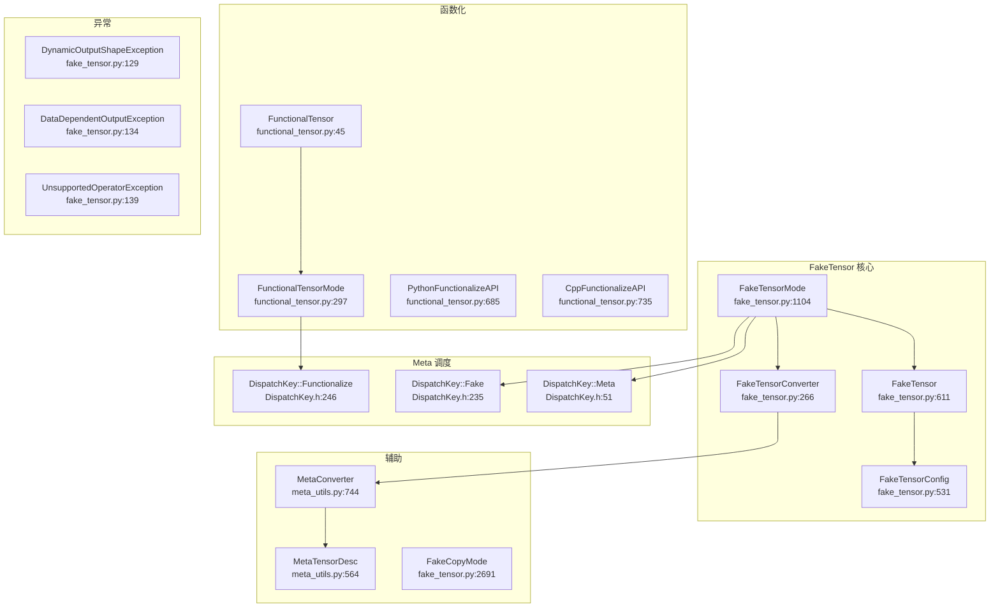

# 45. PyTorch FakeTensor 与 Meta 调度系统

## 目录

- [45.1 整体架构](#451-整体架构)
- [45.2 FakeTensor 类](#452-faketensor-类)
- [45.3 FakeTensorMode](#453-faketensormode)
- [45.4 FakeTensorConverter 与 MetaConverter](#454-faketensorconverter-与-metaconverter)
- [45.5 Meta 调度键与后端](#455-meta-调度键与后端)
- [45.6 FunctionalTensor 函数化张量](#456-functionaltensor-函数化张量)
- [45.7 DispatchCache 缓存机制](#457-dispatchcache-缓存机制)
- [45.8 异常体系](#458-异常体系)
- [45.9 设计权衡](#459-设计权衡)
- [45.10 关键文件索引](#4510-关键文件索引)

---

## 45.1 整体架构

FakeTensor 是 PyTorch 的形状/元数据推理核心，不持有实际数据，仅维护张量的 shape/dtype/device/stride 等元信息。FakeTensorMode 通过 `__torch_dispatch__` 拦截所有操作，在元数据层面执行推理，用于 Dynamo 追踪和 Inductor 编译。



---

## 45.2 FakeTensor 类

`FakeTensor` (`fake_tensor.py:611`) 继承 `torch.Tensor`，是一个不持有数据的张量子类。

### 核心结构

```python
class FakeTensor(Tensor):  # :611
    fake_mode: FakeTensorMode     # 所属的 FakeTensorMode
    constant: Optional[Tensor]    # 原始真实张量（可选，用于常量折叠）
    real_tensor: Optional[Tensor] # 对应的真实张量引用
```

### 关键方法

| 方法 | 行号 | 说明 |
|------|------|------|
| `from_tensor(t, fake_mode)` | :761 | 从真实张量创建 FakeTensor |
| `__torch_dispatch__(cls, func, types, args, kwargs)` | :766 | 拦截所有操作，委托给 FakeTensorMode |

### FakeTensorConfig (`:531`)

```python
class FakeTensorConfig:
    debug: bool
    cache: bool          # 启用 DispatchCache
    allow_non_fake_inputs: bool
    export: bool
    trace: bool
```

配置 FakeTensorMode 的行为。

---

## 45.3 FakeTensorMode

`FakeTensorMode` (`fake_tensor.py:1104`) 继承 `TorchDispatchMode`，是 FakeTensor 的核心执行引擎。

### __init__() (`:1128`)

```python
def __init__(
    self,
    *,
    allow_fallback_kernels=True,
    allowed_non_fake_inputs=(),
    shape_env=None,
    ...
):
```

关键参数：
- **`allow_fallback_kernels`**：当 Meta kernel 不可用时，是否回退到真实 kernel
- **`shape_env`**：关联的 ShapeEnv，用于符号形状推理
- **`export`**：是否在导出模式下运行

### __torch_dispatch__() (`:1264`)

```python
def __torch_dispatch__(self, func, types, args, kwargs):
```

所有张量操作的入口：
1. 将真实张量转换为 FakeTensor（`validate_and_convert_non_fake_tensors` :2425）
2. 尝试从 DispatchCache 获取结果
3. 若缓存未命中，调用 `dispatch()` 执行操作
4. 将结果缓存

### dispatch() (`:1788`)

```python
def dispatch(self, func, types, args, kwargs):
```

核心调度逻辑：
1. 查找 Meta kernel（`DenseMeta` 等）
2. 若 Meta kernel 存在，在 Meta 后端执行操作（仅计算元数据）
3. 若不存在，回退到真实 kernel（`run_fallback_kernel` :2625）
4. 验证输出元数据一致性

### from_tensor() (`:2594`)

```python
def from_tensor(self, tensor, *, static_shapes=False, source=None, symbolic_context=None, trace=None):
```

将真实张量转换为 FakeTensor：
- `static_shapes=True`：固定形状，不创建符号维度
- `symbolic_context`：提供符号化上下文（来自 ShapeEnv）

### __enter__() / __exit__() (`:1282/:347`)

进入/退出 FakeTensorMode 上下文，管理全局模式栈。

---

## 45.4 FakeTensorConverter 与 MetaConverter

### FakeTensorConverter (`fake_tensor.py:266`)

```python
class FakeTensorConverter:
    def from_real_tensor(self, fake_mode, t, ...):  # :331
```

将真实张量批量转换为 FakeTensor，维护转换缓存（`id_map`），避免重复转换。

### MetaConverter (`meta_utils.py:744`)

```python
class MetaConverter(Generic[_TensorT]):
```

将 `MetaTensorDesc` 转换回张量实例。支持 Meta 张量和 FakeTensor 两种输出类型。

### MetaTensorDesc (`meta_utils.py:564`)

```python
class MetaTensorDesc(Generic[_TensorT]):
```

张量的元数据描述，包含 shape、dtype、device、stride、storage_offset 等信息。用于在不持有数据的情况下完整描述张量。

### MetaStorageDesc (`meta_utils.py:476`)

```python
class MetaStorageDesc:
```

存储的元数据描述，与 MetaTensorDesc 配合使用。

---

## 45.5 Meta 调度键与后端

### DispatchKey 枚举 (`DispatchKey.h:135`)

Meta 作为后端组件（`BackendComponent`），通过宏展开生成 `DenseMeta`、`SparseMeta` 等 per-backend 调度键。

| 调度键 | 行号 | 说明 |
|--------|------|------|
| `Meta` (backend) | :51 | Meta 后端组件（`C10_FORALL_BACKEND_COMPONENTS` 最后一项） |
| `Fake` | :235 | Fake 分发键（外部 torchdistx 兼容） |
| `Functionalize` | :246 | 函数化分发键（消除别名/mutation） |
| `EndOfBackendKeys = MetaBit` | :101 | Meta 是最后一个后端键 |

### Meta Kernel 注册

Meta kernel 在 `aten/src/ATen/native/` 中通过 `REGISTER_META` 宏注册。例如：

```cpp
REGISTER_META(aten::add, add_meta);
```

这些 kernel 在 Meta 后端执行时，仅计算输出张量的元数据，不执行实际计算。

---

## 45.6 FunctionalTensor 函数化张量

`FunctionalTensor` (`functional_tensor.py:45`) 是函数化张量子类，用于消除 in-place 操作和别名。

### FunctionalTensor (`:45`)

```python
class FunctionalTensor(torch.Tensor):
    def __new__(cls, elem, mode):  # :97
    def __torch_dispatch__(self, func, types, args, kwargs):  # :162
    def to_functional(x):          # :209 — 将张量包装为 FunctionalTensor
    def from_functional(self):     # :233 — 解包为原始张量
    def replace_(self, output):    # :240 — 替换底层张量
    def commit_update(self):       # :243 — 提交更新
    def sync(self):                # :246 — 同步状态
```

### FunctionalTensorMode (`:297`)

```python
class FunctionalTensorMode(TorchDispatchMode):
    def __init__(self, pre_dispatch=False, export=False, ...):  # :298
    def __torch_dispatch__(self, func, types, args, kwargs):    # :352
```

函数化模式：
1. 将 in-place 操作转换为 out-of-place 等价操作
2. 跟踪别名关系
3. 将 mutation 转换为函数式替换

### 函数化 API

| 类 | 行号 | 说明 |
|----|------|------|
| `BaseFunctionalizeAPI` | :649 | 抽象基类 |
| `PythonFunctionalizeAPI` | :685 | Python 层函数化 API |
| `CppFunctionalizeAPI` | :735 | C++ 层函数化 API |

---

## 45.7 DispatchCache 缓存机制

FakeTensorMode 内置 DispatchCache，缓存已执行操作的输入-输出映射，避免重复计算元数据。

### 缓存数据结构

| 类 | 行号 | 说明 |
|----|------|------|
| `_DispatchCacheKey` | :1014 | 缓存键（算子 + 输入元数据） |
| `_DispatchCacheEntry` | :1059 | 缓存条目（输出元数据） |
| `_DispatchCacheEntryOutputInfo` | :1042 | 输出信息 |
| `DispatchCacheInfo` | :1084 | 缓存统计信息 |
| `_BypassDispatchCache` | :1074 | 绕过缓存的异常 |

### _cached_dispatch_impl() (`:1348`)

```python
def _cached_dispatch_impl(self, func, types, args, kwargs):
```

带缓存的分发实现：
1. 构造缓存键（`_DispatchCacheKey`）
2. 查找缓存
3. 若命中，直接返回缓存的输出元数据
4. 若未命中，调用 `dispatch()` 并缓存结果

### _validate_cache_key() (`:1425`)

```python
def _validate_cache_key(self, ...):
```

验证缓存键是否与当前输入匹配，处理 SymInt 变化等场景。

---

## 45.8 异常体系

FakeTensor 系统定义了多种异常，用于处理元数据推理中的特殊情况：

| 异常 | 行号 | 说明 |
|------|------|------|
| `UnsupportedFakeTensorException` | :124 | 不支持的 FakeTensor 操作 |
| `DynamicOutputShapeException` | :129 | 输出形状依赖运行时数据（如 nonzero） |
| `DataDependentOutputException` | :134 | 输出值依赖运行时数据 |
| `UnsupportedOperatorException` | :139 | 不支持的算子 |
| `MetadataMismatchError` | :144 | 元数据不匹配 |

这些异常由 Dynamo 和 Inductor 捕获，用于决定是否需要图断点或特殊处理。

---

## 45.9 设计权衡

### 1. FakeTensor vs Meta Tensor

**选择**：使用 FakeTensor（Python 层）而非纯 Meta Tensor（C++ 层）作为主要推理工具。

**原因**：FakeTensor 通过 `__torch_dispatch__` 在 Python 层拦截，能处理 Python 自定义操作和子类。Meta Tensor 仅在 C++ 调度层工作，无法拦截 Python 扩展。代价是 FakeTensor 的分发开销更高。

### 2. DispatchCache 的默认启用

**选择**：默认启用 DispatchCache（`FakeTensorConfig.cache=True`）。

**原因**：Dynamo 追踪和 Inductor 编译时，同一操作可能被多次 Fake 执行。缓存避免重复的元数据计算，显著提升编译速度。代价是缓存占用内存，且需要维护缓存一致性。

### 3. 回退到真实 Kernel

**选择**：`allow_fallback_kernels=True`，当 Meta kernel 不存在时回退到真实 kernel。

**原因**：并非所有操作都有 Meta kernel 注册，回退机制确保兼容性。代价是回退时执行真实计算，可能产生副作用（如 CUDA 内存分配）。Inductor 编译场景通常禁用回退（`allow_fallback_kernels=False`）。

### 4. FunctionalTensor 与 FakeTensor 的分离

**选择**：FunctionalTensor 和 FakeTensor 是独立的子类和模式。

**原因**：FakeTensor 用于形状推理（不改变操作语义），FunctionalTensor 用于消除副作用（改变操作语义）。两者职责不同，混合使用会增加复杂度。Dynamo 追踪时两者配合使用。

### 5. Meta 后端作为最终后端

**选择**：Meta 是 `C10_FORALL_BACKEND_COMPONENTS` 的最后一项。

**原因**：确保 Meta kernel 在其他后端之后注册，使得 TLS 中的 Meta 标志能正确触发 Meta kernel。如果 Meta 不是最后，其他后端的 kernel 可能优先匹配。

---

## 45.10 关键文件索引

| 文件路径 | 核心内容 |
|----------|----------|
| `torch/_subclasses/fake_tensor.py` | `FakeTensor`(:611), `FakeTensorMode`(:1104), `FakeTensorConverter`(:266), `FakeTensorConfig`(:531), `FakeCopyMode`(:2691), `dispatch`(:1788), `_cached_dispatch_impl`(:1348), `from_tensor`(:2594), 异常类(:124-144) |
| `torch/_subclasses/meta_utils.py` | `MetaConverter`(:744), `MetaTensorDesc`(:564), `MetaStorageDesc`(:476), `ViewFunc`(:492), `MetaTensorDescriber`(:205) |
| `torch/_subclasses/functional_tensor.py` | `FunctionalTensor`(:45), `FunctionalTensorMode`(:297), `PythonFunctionalizeAPI`(:685), `CppFunctionalizeAPI`(:735) |
| `torch/_subclasses/__init__.py` | 导出 `FakeTensor`, `FakeTensorMode`, `DynamicOutputShapeException` 等 |
| `c10/core/DispatchKey.h` | `DispatchKey` 枚举(:135), `Meta` 后端(:51), `Fake`(:235), `Functionalize`(:246) |