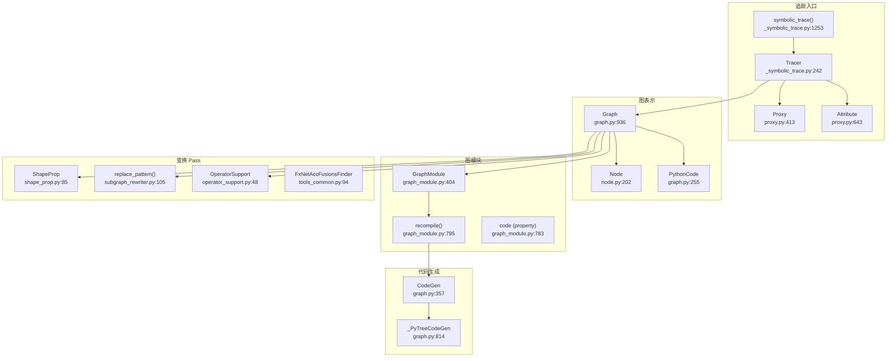

# 46. PyTorch FX 图变换框架

## 目录

- [46.1 整体架构](#461-整体架构)
- [46.2 Graph：图结构](#462-graph图结构)
- [46.3 Node：图节点](#463-node图节点)
- [46.4 GraphModule：图模块](#464-graphmodule图模块)
- [46.5 Proxy 与 Tracer：符号追踪](#465-proxy-与-tracer符号追踪)
- [46.6 symbolic_trace：符号追踪入口](#466-symbolic_trace符号追踪入口)
- [46.7 子图重写](#467-子图重写)
- [46.8 FX Pass 工具集](#468-fx-pass-工具集)
- [46.9 代码生成](#469-代码生成)
- [46.10 设计权衡](#4610-设计权衡)
- [46.11 关键文件索引](#4611-关键文件索引)

---

## 46.1 整体架构

FX 是 PyTorch 的 Python 级图变换框架，提供符号追踪、图表示、代码生成和变换 Pass 的完整工具链。



---

## 46.2 Graph：图结构

`Graph` (`graph.py:936`) 是 FX 的核心数据结构，表示一个有向无环图（DAG）。

### 节点创建方法

| 方法 | 行号 | 说明 |
|------|------|------|
| `placeholder()` | :1272 | 创建输入占位符节点 |
| `get_attr()` | :1305 | 创建属性获取节点 |
| `call_module()` | :1373 | 创建模块调用节点 |
| `call_method()` | :1423 | 创建方法调用节点 |
| `call_function()` | :1462 | 创建函数调用节点 |
| `output()` | :1536 | 创建输出节点 |
| `create_node()` | :1112 | 通用节点创建方法 |

### 图操作方法

| 方法 | 行号 | 说明 |
|------|------|------|
| `erase_node()` | :1182 | 删除节点 |
| `inserting_before()` | :1224 | 上下文管理器，在指定节点前插入 |
| `inserting_after()` | :1248 | 上下文管理器，在指定节点后插入 |
| `node_copy()` | :1501 | 从另一个图复制节点 |
| `eliminate_dead_code()` | :1816 | 死代码消除 |
| `lint()` | :1707 | 图合法性检查 |
| `print_tabular()` | :1685 | 以表格形式打印图 |

### 代码生成方法

| 方法 | 行号 | 说明 |
|------|------|------|
| `python_code()` | :1570 | 生成 Python 代码 |
| `on_generate_code()` | :1885 | 代码生成回调 |
| `set_codegen()` | :1881 | 设置代码生成器 |

### 属性

| 属性 | 行号 | 说明 |
|------|------|------|
| `nodes` | :1015 | 节点列表（双向链表） |
| `output_node` | :1030 | 输出节点 |
| `owning_module` | :1006 | 所属模块 |

---

## 46.3 Node：图节点

`Node` (`node.py:202`) 表示图中的一个操作节点。

### 核心属性

```python
class Node:
    def __init__(self, graph, name, op, target, args, kwargs, return_type):  # :244
```

| 属性 | 类型 | 说明 |
|------|------|------|
| `op` | str | 操作类型：`placeholder`/`call_function`/`call_method`/`call_module`/`get_attr`/`output` |
| `target` | Target | 操作目标（函数/方法名/模块名） |
| `name` | str | 节点名称（唯一标识符） |
| `args` | tuple | 位置参数 |
| `kwargs` | dict | 关键字参数 |

### 关键方法

| 方法 | 行号 | 说明 |
|------|------|------|
| `all_input_nodes` (property) | :491 | 返回所有输入节点 |
| `next` (property) | :359 | 返回后继节点 |
| `prev` (property) | :370 | 返回前驱节点 |
| `update_arg()` | :505 | 更新位置参数 |
| `replace_all_uses_with()` | :701 | 将所有使用替换为新节点 |
| `replace_input_with()` | :844 | 替换特定输入 |
| `format_node()` | :635 | 格式化节点信息 |

### 节点链表

Node 通过 `next`/`prev` 构成双向链表，表示执行顺序。`prepend()` (:381) 和 `append()` (:430) 方法用于在链表中插入节点。

### 辅助函数

| 函数 | 行号 | 说明 |
|------|------|------|
| `map_arg()` | :898 | 递归映射节点参数中的 Node 引用 |
| `map_aggregate()` | :907 | 递归聚合节点参数 |

---

## 46.4 GraphModule：图模块

`GraphModule` (`graph_module.py:404`) 将 `Graph` 与可执行代码结合，是 FX 的核心可执行单元。

### 核心方法

| 方法 | 行号 | 说明 |
|------|------|------|
| `__init__()` | :438 | 初始化，接收 root 模块和 Graph |
| `recompile()` | :795 | 从 Graph 重新生成 forward() 代码 |
| `code` (property) | :783 | 返回生成的 Python 代码字符串 |
| `graph` (property) | :543 | 获取/设置关联的 Graph |

### forward() 的生成

`recompile()` (:795) 执行以下步骤：
1. 调用 `Graph.python_code()` 生成 Python 源码
2. 通过 `exec()` 编译源码为 `forward` 方法
3. 动态设置 `cls.forward` (:810) 和 `cls.__call__` (:826)

### 子模块管理

| 方法 | 行号 | 说明 |
|------|------|------|
| `add_submodule()` | :646 | 添加子模块 |
| `delete_submodule()` | :686 | 删除子模块 |
| `delete_all_unused_submodules()` | :728 | 删除所有未使用的子模块 |

### 序列化

| 方法 | 行号 | 说明 |
|------|------|------|
| `__reduce__()` | :856 | Python pickle 支持 |
| `__reduce_deploy__()` | :832 | 部署模式序列化 |
| `__reduce_package__()` | :841 | 包模式序列化 |
| `to_folder()` | :563 | 导出为文件夹 |

---

## 46.5 Proxy 与 Tracer：符号追踪

### Proxy (`proxy.py:413`)

```python
class Proxy:
    def __init__(self, node, tracer):  # :443
    def __getattr__(self, k):          # :453
    def __call__(self, *args, **kwargs):  # :491
```

Proxy 是 Node 的代理对象，拦截所有操作并创建新的 FX 节点：
- `__getattr__` → 创建 `Attribute` 代理
- `__call__` → 创建 `call_function`/`call_method` 节点
- 算术运算 → 创建对应的函数调用节点

### Attribute (`proxy.py:643`)

```python
class Attribute(Proxy):
    def __init__(self, root, attr, tracer):  # :645
```

代理属性访问（如 `linear.weight`），在图中创建 `get_attr` 节点。

### TracerBase (`proxy.py:119`)

```python
class TracerBase:
    def create_node(self, ...):   # :144 — 创建节点
    def create_proxy(self, ...):  # :210 — 创建代理
    def create_arg(self, ...):    # :283 — 创建参数节点
    def proxy(self, node):        # :206 — 包装节点为代理
```

追踪器基类，提供节点创建和代理管理的基础设施。

---

## 46.6 symbolic_trace：符号追踪入口

### Tracer (`_symbolic_trace.py:242`)

```python
class Tracer(TracerBase):
    def trace(self, root, concrete_args=None):  # :712
```

完整追踪器，遍历模块的前向传播，生成 FX Graph：

| 方法 | 行号 | 说明 |
|------|------|------|
| `trace()` | :712 | 追踪模块，生成 Graph |
| `is_leaf_module()` | :439 | 判断是否为叶模块（不递归追踪） |
| `call_module()` | :491 | 处理模块调用 |
| `getattr()` | :550 | 处理属性访问 |
| `create_args_for_root()` | :614 | 创建根函数参数 |
| `_proxy_placeholder()` | :867 | 创建占位符代理 |
| `path_of_module()` | :464 | 获取模块路径 |

### symbolic_trace() (`:1253`)

```python
def symbolic_trace(
    root: Union[torch.nn.Module, Callable],
    concrete_args: Optional[Dict[str, Any]] = None,
) -> GraphModule:
```

便捷函数，创建 Tracer 并执行追踪。

### 辅助机制

| 类/函数 | 行号 | 说明 |
|---------|------|------|
| `_Patcher` | :1043 | 临时猴子补丁管理器 |
| `_PatchedFn` | :1006 | 单个补丁函数 |
| `wrap()` | :1189 | 标记函数为叶函数（不追踪内部） |
| `PH` | :214 | 占位符单例 |
| `is_fx_tracing()` | :50 | 查询当前是否在追踪中 |

---

## 46.7 子图重写

### replace_pattern() (`subgraph_rewriter.py:105`)

```python
def replace_pattern(
    graph_module: GraphModule,
    pattern: Callable,
    replacement: Callable,
    ...,
) -> List[Match]:
```

在 GraphModule 中查找与 `pattern` 匹配的子图，替换为 `replacement`。

### Match (`:36`)

```python
class Match(NamedTuple):
    anchor: Node           # 匹配的锚点节点
    nodes_map: Dict[Node, Node]  # 模式节点→图中节点的映射
```

### ReplacedPatterns (`:45`)

```python
class ReplacedPatterns(dataclass):
    anchor: Node
    nodes_map: Dict[Node, Node]
    replaced_nodes: List[Node]
```

### replace_pattern_with_filters() (`:235`)

带过滤器的替换版本，允许用户控制哪些匹配需要替换。

---

## 46.8 FX Pass 工具集

### ShapeProp (`shape_prop.py:85`)

```python
class ShapeProp(torch.fx.Interpreter):
    def __init__(self, gm, ...):  # :132
    def run_node(self, n):        # :156
    def propagate(self, *args):   # :193
```

形状传播 Pass，使用 FakeTensor 执行图，为每个节点推断输出形状。

### TensorMetadata (`:19`)

```python
class TensorMetadata(NamedTuple):
    shape
    dtype
    requires_grad
    stride
    memory_format
```

### OperatorSupport (`operator_support.py:48`)

```python
class OperatorSupport(OperatorSupportBase):
    def is_node_supported(self, submodules, node):  # :72
```

算子支持判断，用于后端分区——将支持的算子分配给加速器，不支持的回退到 CPU。

### FxNetAccFusionsFinder (`tools_common.py:94`)

```python
class FxNetAccFusionsFinder:
    def __call__(self):  # :175
```

融合分组查找器，识别可以融合执行的算子组。

### OperatorSupportBase (`operator_support.py:37`)

```python
class OperatorSupportBase(ABC):
    def is_node_supported(self, submodules, node):  # :41
```

算子支持判断的抽象基类。

---

## 46.9 代码生成

### CodeGen (`graph.py:357`)

```python
class CodeGen:
    def _gen_python_code(self, ...):  # :408
```

将 FX Graph 转换为 Python 源码。每个节点生成一行代码，如：

```python
add = torch.add(x, y)
relu = torch.relu(add)
```

### _PyTreeCodeGen (`graph.py:814`)

```python
class _PyTreeCodeGen(CodeGen):
```

支持 PyTree 输入/输出的代码生成器，处理嵌套的 dict/list/tuple 结构。

### 代码生成流程


---

## 46.10 设计权衡

### 1. Python 级 IR vs C++ IR

**选择**：FX 使用纯 Python 实现，Graph/Node 都是 Python 对象。

**原因**：Python 级 IR 允许用户用 Python 编写变换 Pass，降低使用门槛。与 TorchScript 的 C++ IR 相比，FX 更灵活但运行时性能较低。FX 定位为编译时工具，运行时性能不是首要目标。

### 2. 双向链表 vs SSA

**选择**：Node 使用双向链表维护执行顺序，而非纯 SSA 形式。

**原因**：双向链表支持高效的插入/删除操作，方便 Pass 修改图结构。纯 SSA 形式更适合编译器分析，但修改成本更高。FX 通过 `replace_all_uses_with()` 提供类似 SSA 的使用替换。

### 3. 动态代码生成 vs 解释执行

**选择**：GraphModule 通过 `exec()` 动态生成 `forward()` 方法。

**原因**：动态代码生成使编译后的 GraphModule 与手写模块性能一致（直接 Python 函数调用），避免了图遍历的解释器开销。代价是 `recompile()` 的编译延迟。

### 4. 符号追踪 vs JIT 追踪

**选择**：FX 使用符号追踪（Proxy 代理），而非 JIT 追踪（执行真实数据）。

**原因**：符号追踪不执行实际计算，不受数据依赖影响，能完整捕获控制流（通过 Guard）。JIT 追踪（如 `torch.jit.trace`）只记录单条执行路径，丢失控制流。代价是符号追踪对 Python 动态特性有限制。

### 5. 子图重写的匹配策略

**选择**：子图重写使用模式匹配（pattern matching），而非图同构（graph isomorphism）。

**原因**：模式匹配更直观（用户只需写一个示例函数），且效率足够。图同构更精确但计算复杂度更高。代价是模式匹配可能产生非预期的匹配（如匹配到语义不同的同名操作）。

---

## 46.11 关键文件索引

| 文件路径 | 核心内容 |
|----------|----------|
| `torch/fx/graph.py` | `Graph`(:936), `CodeGen`(:357), `_PyTreeCodeGen`(:814), `placeholder`(:1272), `call_function`(:1462), `call_module`(:1373), `output`(:1536), `eliminate_dead_code`(:1816), `python_code`(:1570), `lint`(:1707) |
| `torch/fx/node.py` | `Node`(:202), `replace_all_uses_with`(:701), `replace_input_with`(:844), `update_arg`(:505), `all_input_nodes`(:491), `format_node`(:635), `map_arg`(:898) |
| `torch/fx/graph_module.py` | `GraphModule`(:404), `recompile`(:795), `code`(:783), `add_submodule`(:646), `delete_all_unused_submodules`(:728), `to_folder`(:563) |
| `torch/fx/proxy.py` | `Proxy`(:413), `TracerBase`(:119), `Attribute`(:643), `MetaProxy`(:604), `create_proxy`(:210), `TraceError`(:408) |
| `torch/fx/_symbolic_trace.py` | `Tracer`(:242), `symbolic_trace`(:1253), `trace`(:712), `is_leaf_module`(:439), `wrap`(:1189), `_Patcher`(:1043) |
| `torch/fx/subgraph_rewriter.py` | `replace_pattern`(:105), `replace_pattern_with_filters`(:235), `Match`(:36), `ReplacedPatterns`(:45) |
| `torch/fx/passes/shape_prop.py` | `ShapeProp`(:85), `TensorMetadata`(:19) |
| `torch/fx/passes/operator_support.py` | `OperatorSupportBase`(:37), `OperatorSupport`(:48) |
| `torch/fx/passes/tools_common.py` | `FxNetAccFusionsFinder`(:94), `legalize_graph`(:247) |
| `torch/fx/passes/graph_drawer.py` | `FxGraphDrawer`(:63) |