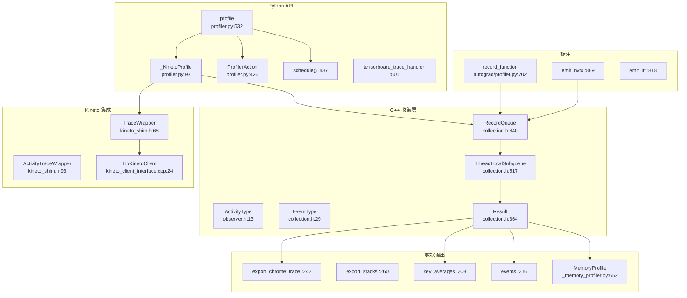

# 47. PyTorch Kineto Profiler 追踪系统

## 目录

- [47.1 整体架构](#471-整体架构)
- [47.2 Python Profiler API](#472-python-profiler-api)
- [47.3 ProfilerAction 与调度](#473-profileraction-与调度)
- [47.4 C++ 事件收集](#474-c-事件收集)
- [47.5 Kineto 集成](#475-kineto-集成)
- [47.6 事件树构建](#476-事件树构建)
- [47.7 record_function](#477-record_function)
- [47.8 内存分析](#478-内存分析)
- [47.9 设计权衡](#479-设计权衡)
- [47.10 关键文件索引](#4710-关键文件索引)

---

## 47.1 整体架构

PyTorch Profiler 基于 Kineto 库实现 CPU/GPU 性能追踪，通过 autograd hook 收集算子执行信息，与 Kineto/CUPTI 集成收集 GPU kernel 时间线。



---

## 47.2 Python Profiler API

### profile 类 (`profiler.py:532`)

```python
class profile(_KinetoProfile):
    def __init__(  # :668
        self,
        activities=None,        # ActivityType 列表
        schedule=None,          # 调度函数
        on_trace_ready=None,    # 追踪完成回调
        record_shapes=False,    # 记录张量形状
        profile_memory=False,   # 记录内存分配
        with_stack=False,       # 记录调用栈
        with_flops=False,       # 估算 FLOPs
        ...
    ):
```

### _KinetoProfile 类 (`:93`)

底层 profiler，直接与 C++ 层交互：

| 方法 | 行号 | 说明 |
|------|------|------|
| `__init__()` | :133 | 初始化 Kineto profiler |
| `start()` | :172 | 启动追踪 |
| `stop()` | :176 | 停止追踪 |
| `prepare_trace()` | :179 | 准备追踪（预分配资源） |
| `start_trace()` | :196 | 开始记录事件 |
| `stop_trace()` | :236 | 停止记录事件 |
| `export_chrome_trace()` | :242 | 导出 Chrome Trace JSON |
| `export_stacks()` | :260 | 导出调用栈 |
| `key_averages()` | :303 | 按算子名/形状/栈分组统计 |
| `events()` | :316 | 返回原始事件列表 |
| `add_metadata_json()` | :332 | 添加用户元数据 |

### profile 的关键方法

| 方法 | 行号 | 说明 |
|------|------|------|
| `__enter__()` | :791 | 进入上下文，启动追踪 |
| `__exit__()` | :795 | 退出上下文，停止追踪 |
| `step()` | :814 | 通知下一步开始（配合 schedule） |
| `_transit_action()` | :854 | 根据调度切换状态 |

---

## 47.3 ProfilerAction 与调度

### ProfilerAction 枚举 (`:426`)

| 值 | 行号 | 说明 |
|-----|------|------|
| `NONE` | :431 | 不记录 |
| `WARMUP` | :432 | 预热阶段（不计入结果） |
| `RECORD` | :433 | 记录阶段 |
| `RECORD_AND_SAVE` | :434 | 记录并保存（最后一个 step） |

### schedule() (`:437`)

```python
def schedule(wait=1, warmup=1, active=1, repeat=1):
```

创建调度函数，控制哪些 step 执行记录：
- **wait**：开始前等待的 step 数
- **warmup**：预热 step 数（丢弃结果）
- **active**：记录 step 数
- **repeat**：重复次数（0=无限）

### 调度示例

```python
# 每 5 个 step 记录 1 个
schedule(wait=2, warmup=1, active=1, repeat=0)
# Step 0,1: wait → Step 2: warmup → Step 3: record → Step 4,5: wait → ...
```

---

## 47.4 C++ 事件收集

### EventType 枚举 (`collection.h:29`)

| 类型 | 值 | 说明 |
|------|-----|------|
| `TorchOp` | 0 | PyTorch 算子 |
| `Backend` | 1 | 后端操作（如 CUDA kernel） |
| `Vulkan` | 2 | Vulkan 操作 |
| `Allocation` | 3 | 内存分配 |
| `OutOfMemory` | 4 | OOM 事件 |
| `PyCall` | 5 | Python 函数调用 |
| `PyCCall` | 6 | Python C 扩展调用 |
| `Kineto` | 7 | Kineto 追踪事件 |

### ActivityType 枚举 (`observer.h:13`)

| 类型 | 值 | 说明 |
|------|-----|------|
| `CPU` | 0 | CPU 活动 |
| `XPU` | 1 | XPU 活动 |
| `CUDA` | 2 | CUDA 活动 |
| `MTIA` | 3 | MTIA 活动 |

### Result (`collection.h:364`)

```cpp
struct Result {
    int64_t start_time_ns_;   // :403 开始时间（纳秒）
    uint32_t start_tid_;      // :404 开始线程 ID
    variant<ExtraFields<EventType::TorchOp>, ...> extra_fields_;  // :406 事件详情
    weak_ptr<Result> parent_; // :417 父节点
    vector<shared_ptr<Result>> children_; // :418 子节点
    bool finished_;           // :419 是否已完成
};
```

### ThreadLocalSubqueue (`collection.h:517`)

每个线程的事件存储区：

```cpp
class ThreadLocalSubqueue {
    TorchOpStorage;    // :570 算子存储（列表、编码器、栈、模块信息）
    begin_op();        // :521 开始记录算子
};
```

### RecordQueue (`collection.h:640`)

管理所有线程的事件队列：

```cpp
class RecordQueue {
    getRecords();  // :653 获取并清空所有线程的事件
};
```

---

## 47.5 Kineto 集成

### TraceWrapper (`kineto_shim.h:68`)

```cpp
struct TraceWrapper {
    addCPUActivity();       // :72 添加 CPU 活动
    transferCpuTrace();     // :80 传输 CPU 追踪到 kineto
};
```

### ActivityTraceWrapper (`:93`)

```cpp
struct ActivityTraceWrapper {
    save();  // :97 保存追踪到文件
};
```

### Kineto API 函数 (`kineto_shim.h:111-144`)

| 函数 | 行号 | 说明 |
|------|------|------|
| `prepareTrace()` | :111 | 准备 Kineto 追踪 |
| `startTrace()` | :118 | 开始追踪 |
| `stopTrace()` | :119 | 停止追踪 |
| `pushCorrelationId()` | :120 | 推入关联 ID（CPU↔GPU 事件关联） |
| `popCorrelationId()` | :122 | 弹出关联 ID |
| `recordThreadInfo()` | :124 | 记录线程信息 |
| `addMetadataJson()` | :140 | 添加 JSON 元数据 |
| `profilerStep()` | :144 | 通知 Kineto 步进 |

### LibKinetoClient (`kineto_client_interface.cpp:24`)

```cpp
class LibKinetoClient {
    start();  // :41 启动按需追踪
    stop();   // :57 停止按需追踪
};
```

---

## 47.6 事件树构建

### build_tree() (`collection.cpp:1195`)

将排序后的事件列表构建为树结构：
1. 按开始时间排序所有事件
2. 使用栈维护当前活跃的事件链
3. 事件的嵌套关系由时间包含决定
4. 父子关系通过 `parent_`/`children_` 链接

### CPU-GPU 关联

通过 `correlationID` 关联 CPU 算子调用和 GPU kernel 执行：
1. CPU 端 `pushCorrelationId()` 分配唯一 ID
2. GPU 端 CUPTI 捕获 kernel 启动时记录同一 ID
3. 事件合并时通过 ID 匹配 CPU 事件与 GPU 事件

---

## 47.7 record_function

### record_function (`autograd/profiler.py:702`)

```python
class record_function(_ContextDecorator):
    def __init__(self, name, args=None):  # :740
    def __enter__(self):                   # :751
    def __exit__(self, *exc):              # :757
```

用户标注代码块，在 Profiler 结果中显示为自定义操作：
- `__enter__`：调用 `torch.ops.profiler._record_function_enter_new`
- `__exit__`：调用 `torch.ops.profiler._record_function_exit`

`_call_end_callbacks_on_future()` (:773)：扩展异步操作的记录范围，直到 Future 完成时结束。

### emit_nvtx (`:889`)

NVIDIA NVTX 标注，用于 nsight 性能分析。

### emit_itt (`:818`)

Intel ITT 标注，用于 VTune 性能分析。

---

## 47.8 内存分析

### MemoryProfile (`_memory_profiler.py:652`)

```python
class MemoryProfile:
    def timeline(self):  # :668 内存时间线数据
```

内存分析器，追踪每个操作的张量分配和释放：
- **Category** (:31)：INPUT、TEMPORARY、ACTIVATION、GRADIENT、PARAMETER 等
- **Action** (:55)：CREATE、DESTROY、INCREMENT_VERSION
- **DataFlowGraph** (:503)：数据流分析，追踪张量的生命周期
- **SizeMap** (:328)：张量→字节大小映射

### MemoryProfileTimeline (`:975`)

```python
class MemoryProfileTimeline:
    def export_memory_timeline(self, ...):        # :1047 JSON 导出
    def export_memory_timeline_html(self, ...):   # :1124 HTML 导出
```

---

## 47.9 设计权衡

### 1. Kineto vs 自研后端

**选择**：使用 Kineto 库作为追踪后端，而非自研。

**原因**：Kineto 由 Meta 开源，已集成 CUPTI（CUDA Performance Tools Interface）支持，能自动捕获 GPU kernel 时间线。自研需要重复实现 GPU 追踪，维护成本高。

### 2. ThreadLocalSubqueue 无锁设计

**选择**：每个线程独立的事件存储区（`ThreadLocalSubqueue`），无需加锁。

**原因**：profiler 追踪是热路径（每个算子都会触发），加锁会严重干扰性能。thread-local 存储使写入零开销，代价是 `getRecords()` 时需要遍历所有线程。

### 3. 预热阶段（Warmup）

**选择**：支持 `WARMUP` 阶段，丢弃该阶段的数据。

**原因**：Python JIT 和 CUDA 的首次执行有额外开销（编译、缓存预热），导致前几步的数据不准确。预热阶段跳过这些噪声。

### 4. 按需追踪（On-demand Tracing）

**选择**：`LibKinetoClient` 支持远程启动/停止追踪。

**原因**：长时间运行的训练任务中，持续追踪会产生大量数据和性能开销。按需追踪允许在需要时（如检测到性能退化）动态启动，减少干扰。

---

## 47.10 关键文件索引

| 文件路径 | 核心内容 |
|----------|----------|
| `torch/profiler/profiler.py` | `profile`(:532), `_KinetoProfile`(:93), `ProfilerAction`(:426), `schedule`(:437), `tensorboard_trace_handler`(:501), `ExecutionTraceObserver`(:866) |
| `torch/profiler/_utils.py` | `BasicEvaluation`(:100), `EventMetrics`(:34), `EventKey`(:54) |
| `torch/profiler/_memory_profiler.py` | `MemoryProfile`(:652), `MemoryProfileTimeline`(:975), `DataFlowGraph`(:503), `Category`(:31) |
| `torch/autograd/profiler.py` | `profile`(:106), `record_function`(:702), `emit_nvtx`(:889), `emit_itt`(:818), `KinetoStepTracker`(:1101) |
| `torch/csrc/profiler/collection.h` | `EventType`(:29), `Result`(:364), `ThreadLocalSubqueue`(:517), `RecordQueue`(:640), `ExtraFields`(:138+) |
| `torch/csrc/profiler/collection.cpp` | `build_tree`(:1195), `begin_op`(:327), `getRecords`(:1411), `passEventsToKineto`(:856) |
| `torch/csrc/profiler/orchestration/observer.h` | `ActivityType`(:13), `ProfilerState`(:30), `ProfilerConfig`(:111), `ProfilerStateBase`(:143) |
| `torch/csrc/profiler/kineto_shim.h` | `TraceWrapper`(:68), `ActivityTraceWrapper`(:93), `prepareTrace`(:111), `startTrace`(:118), `stopTrace`(:119) |
| `torch/csrc/profiler/kineto_client_interface.cpp` | `LibKinetoClient`(:24), `global_kineto_init`(:75) |
| `torch/csrc/profiler/data_flow.h` | `TensorID`(:28), `AllocationID`(:31), `WeakTensor`(:73) |
| `torch/csrc/profiler/combined_traceback.h` | `CapturedTraceback`(:19), `SymbolizedTracebacks`(:11) |