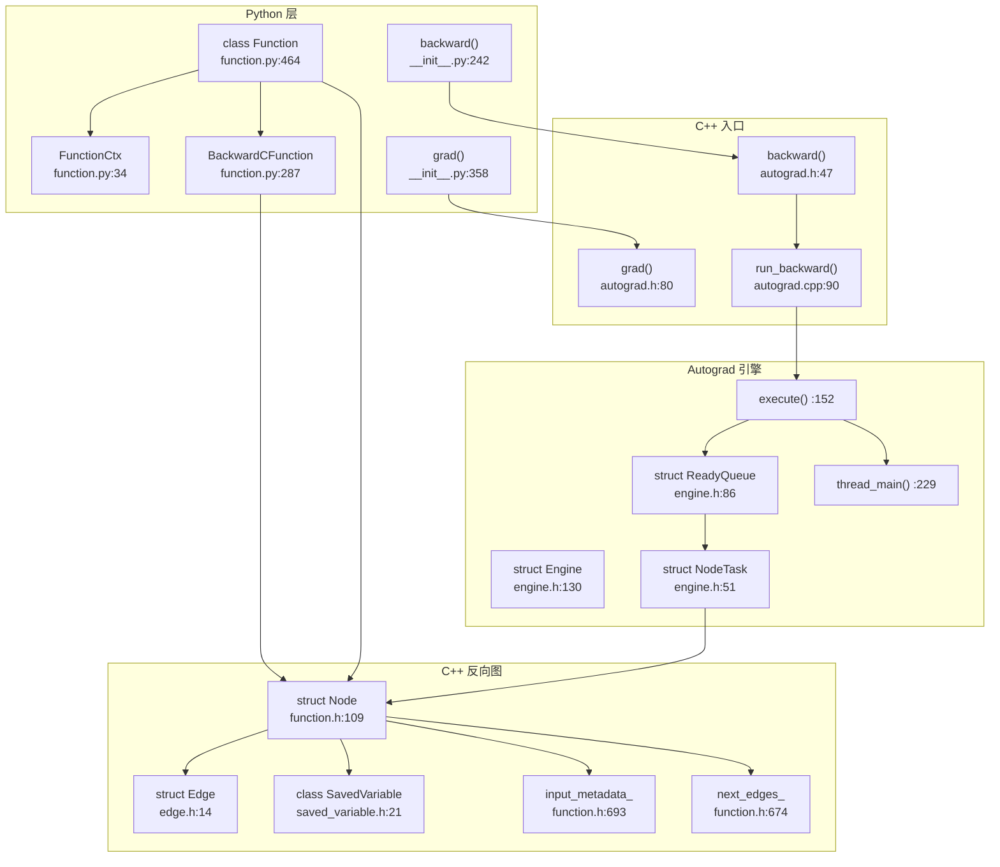
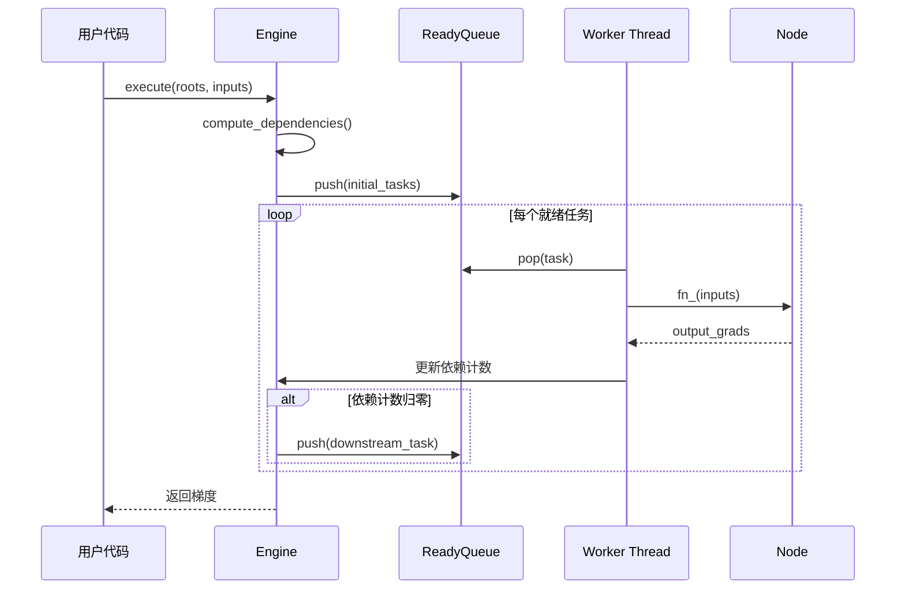

# 48. PyTorch Autograd Function/Node/SavedVariable 系统

## 目录

- [48.1 整体架构](#481-整体架构)
- [48.2 Function：自定义自动微分](#482-function自定义自动微分)
- [48.3 Node：C++ 反向图节点](#483-nodec-反向图节点)
- [48.4 Edge：计算图边](#484-edge计算图边)
- [48.5 SavedVariable：张量保存与恢复](#485-savedvariable张量保存与恢复)
- [48.6 Autograd 引擎](#486-autograd-引擎)
- [48.7 backward() 与 grad()](#487-backward-与-grad)
- [48.8 设计权衡](#488-设计权衡)
- [48.9 关键文件索引](#489-关键文件索引)

---

## 48.1 整体架构

Autograd 系统在 C++ 层构建反向计算图（DAG），每个前向操作创建一个 `Node`，通过 `Edge` 连接。反向传播时，Autograd 引擎按拓扑序执行 `Node`，计算梯度。



---

## 48.2 Function：自定义自动微分

`Function` (`function.py:464`) 是用户自定义自动微分操作的基类。

### FunctionMeta (`:320`)

```python
class FunctionMeta(type):
```

元类，在类创建时自动设置 `apply()` 方法和 `backward`/`forward` 的签名检查。

### Function 核心方法

| 方法 | 行号 | 说明 |
|------|------|------|
| `__init__()` | :498 | 初始化上下文 |
| `__call__()` | :508 | 调用入口，处理设置 |
| **`apply()`** | **:560** | 核心入口（classmethod），执行前向+注册反向 |
| `forward()` | — | 用户定义的前向计算（静态方法） |
| `backward()` | — | 用户定义的梯度计算（静态方法） |
| `vmap()` | :527 | vmap 变换支持 |
| `jvp()` | :441 | 前向自动微分支持 |

### FunctionCtx (`:34`)

```python
class FunctionCtx:
    def save_for_backward(self, *tensors):  # :35 保存反向传播所需张量
    def save_for_forward(self, *tensors):   # :94 保存前向自动微分所需张量
    def mark_dirty(self, *args):            # :148 标记被原地修改的张量
    def mark_non_differentiable(self, *args): # :194 标记不需要梯度的输出
    def set_materialize_grads(self, value): # :226 控制梯度物化行为
```

### apply() (`:560`)

```python
@classmethod
def apply(cls, *args, **kwargs):
```

执行流程：
1. 创建 FunctionCtx 实例
2. 调用 `cls.forward(ctx, *args, **kwargs)` 执行前向计算
3. 将 `ctx` 中保存的张量和 `backward` 函数封装为 C++ `Node`
4. 将 `Node` 注册到 Autograd 图中
5. 返回前向计算结果

### once_differentiable() (`:596`)

```python
def once_differentiable(fn):
```

装饰器，确保 backward 函数只被调用一次（不支持高阶导数），减少内存开销。

---

## 48.3 Node：C++ 反向图节点

`Node` (`function.h:109`) 是 C++ 层的反向图节点，对应一个需要执行梯度计算的函数。

### 核心成员

| 成员 | 行号 | 类型 | 说明 |
|------|------|------|------|
| `next_edges_` | :674 | `edge_list` | 输出边列表（连接下游 Node） |
| `input_metadata_` | :693 | `std::vector<InputMetadata>` | 输入张量元数据 |
| `sequence_nr_` | :617 | `const uint64_t` | 执行序列号 |
| `topological_nr_` | :620 | `uint64_t` | 拓扑排序号 |
| `thread_id_` | :628 | `uint64_t` | 创建线程 ID |
| `pyobj_` | :675 | `PyObject*` | Python 对象引用 |
| `pre_hooks_` | :688 | `std::vector<std::shared_ptr<FunctionPreHook>>` | 前置 Hook |
| `post_hooks_` | :692 | `std::vector<std::shared_ptr<FunctionPostHook>>` | 后置 Hook |

### 关键方法

| 方法 | 行号 | 说明 |
|------|------|------|
| `operator()()` | :150 | 执行 `apply()` |
| **`apply()`** | **:609** | 纯虚函数，子类实现具体梯度计算 |
| `name()` | :402 | 返回节点名称 |
| `next_edges()` | :314 | 返回输出边列表 |
| `input_metadata()` | :224 | 返回输入元数据 |
| `num_inputs()` | :220 | 返回输入数量 |
| `set_next_edge()` | :293 | 设置指定输出边 |
| `add_next_edge()` | :298 | 添加输出边 |
| `should_compute_output()` | :418 | 检查指定输出是否需要计算梯度 |
| `add_pre_hook()` | :510 | 添加前置 Hook |
| `add_post_hook()` | :483 | 添加后置 Hook |
| `release_variables()` | :559 | 释放保存的变量 |
| `compiled_args()` | :592 | 编译自动微分参数 |

### TraceableFunction (`:697`)

```cpp
struct TraceableFunction : public Node {
    // 标记该节点可被 TorchScript 追踪
};
```

### 辅助函数

| 函数 | 行号 | 说明 |
|------|------|------|
| `create_gradient_edge()` | :744 | 创建梯度边（variable → node） |
| `collect_next_edges()` | :762 | 收集变量的梯度边 |

---

## 48.4 Edge：计算图边

`Edge` (`edge.h:14`) 表示反向计算图中 Node 之间的连接。

```cpp
struct Edge {
    Edge();                                        // :15 默认构造（无效边）
    Edge(std::shared_ptr<Node> function, uint32_t input_nr);  // :17
    bool is_valid() const;                         // :21
    std::shared_ptr<Node> function;                // :35 目标 Node
    uint32_t input_nr;                             // :38 目标 Node 的输入索引
};
```

Edge 将一个 Node 的输出连接到另一个 Node 的输入。`input_nr` 指定这是目标 Node 的第几个输入。

---

## 48.5 SavedVariable：张量保存与恢复

`SavedVariable` (`saved_variable.h:21`) 在前向传播中保存张量，在反向传播中恢复。

### 核心方法

| 方法 | 行号 | 说明 |
|------|------|------|
| `SavedVariable(Variable&, bool, bool)` | :24 | 从变量构造 |
| **`unpack()`** | **:46** | 恢复保存的张量 |
| `register_hooks()` | :48 | 注册保存/恢复 Hook |
| `reset_data()` | :50 | 重置保存的数据 |

### 内部成员

| 成员 | 行号 | 说明 |
|------|------|------|
| `data_` | :76 | 保存的张量数据 |
| `fw_grad_` | :82 | 前向梯度 |
| `weak_grad_fn_` | :90 | 弱引用梯度函数 |
| `saved_version_` | :92 | 保存时的版本号 |
| `output_nr_` | :93 | 输出索引 |
| `is_inplace_on_view_` | :95 | 是否为视图上的原地操作 |
| `saved_original_` | :96 | 是否保存了原始变量 |
| `is_leaf_` | :97 | 是否为叶节点 |
| `hooks_` | :104 | 保存/恢复 Hook 列表 |

### 保存策略

SavedVariable 在保存时记录张量的版本号，在恢复时检查版本是否变化（检测非法的原地修改）。如果启用了 `retain_graph`，保存的是原始变量；否则保存弱引用以减少内存占用。

---

## 48.6 Autograd 引擎

`Engine` (`engine.h:130`) 是 Autograd 的执行引擎，按拓扑序执行反向图。

### 核心方法

| 方法 | 行号 | 说明 |
|------|------|------|
| **`execute()`** | **:152** | 主入口：执行反向传播 |
| `execute_with_graph_task()` | :165 | 带 GraphTask 的执行 |
| `thread_main()` | :229 | 工作线程主循环 |
| `compute_dependencies()` | :210 | 计算依赖关系 |
| `initialize_device_threads_pool()` | :186 | 初始化设备线程池 |
| `queue_callback()` | :192 | 注册回调 |

### NodeTask (`:51`)

```cpp
struct NodeTask {
    std::shared_ptr<GraphTask> base_;  // :52 所属 GraphTask
    std::shared_ptr<Node> fn_;         // :53 要执行的 Node
    InputBuffer inputs_;               // :57 输入梯度
    bool isShutdownTask_;              // :60 是否为关闭任务
};
```

### ReadyQueue (`:86`)

```cpp
struct ReadyQueue {
    void push(NodeTask&& task);         // :120 推入任务
    NodeTask pop();                     // :122 弹出任务
    std::priority_queue<NodeTask> heap_; // :112 优先队列（按 sequence_nr）
    std::mutex mutex_;                  // :110 互斥锁
    std::condition_variable not_empty_; // :108 条件变量
};
```

### 执行流程



### 设备线程

Engine 为每个设备（CPU、每个 GPU）创建独立的工作线程，实现设备间并行执行。任务优先分配到对应设备的 ReadyQueue。

---

## 48.7 backward() 与 grad()

### Python backward() (`__init__.py:242`)

```python
def backward(
    tensors,                # 需要梯度的张量
    grad_tensors=None,      # 初始梯度
    retain_graph=None,      # 是否保留计算图
    create_graph=False,     # 是否创建梯度计算图（高阶导数）
    grad_variables=None,    # 已弃用
    inputs=None,            # 仅计算指定输入的梯度
):
```

核心调用链：`backward()` → `_engine_run_backward()` (`graph.py:814`) → C++ `Engine::execute()`

### Python grad() (`__init__.py:358`)

```python
def grad(
    outputs,
    inputs,
    grad_outputs=None,
    retain_graph=None,
    create_graph=False,
    allow_unused=False,
):
```

与 `backward()` 类似，但返回梯度张量而非累加到 `.grad`。

### C++ backward() (`autograd.h:47`)

```cpp
void backward(
    const variable_list& tensors,
    const variable_list& grad_tensors,
    c10::optional<bool> retain_graph,
    bool create_graph,
    const c10::optional<variable_list>& inputs
);
```

### C++ run_backward() (`autograd.cpp:90`)

```cpp
static variable_list run_backward(
    const variable_list& outputs,
    const variable_list& grad_outputs,
    bool retain_graph,
    bool create_graph,
    const variable_list& inputs,
    bool allow_unused,
    bool accumulate_into_grad,
    const edge_list& output_edges
);
```

内部实现，构建 GraphTask 并调用 `Engine::execute()`。

---

## 48.8 设计权衡

### 1. 动态图 vs 静态图

**选择**：PyTorch 使用动态计算图（define-by-run），每次前向传播重建反向图。

**原因**：动态图允许 Python 控制流自然参与模型定义，更直观灵活。代价是每次迭代都需要重建反向图，增加开销。C++ 层通过对象池和预分配缓解。

### 2. 引擎的多线程并行

**选择**：每个设备一个工作线程，设备间并行执行反向传播。

**原因**：不同设备的计算（CPU + 多 GPU）可以重叠执行，减少反向传播总时间。代价是线程同步和任务调度的复杂度。同一设备内串行执行保证正确性。

### 3. SavedVariable 的内存管理

**选择**：默认保存原始张量，`release_variables()` 后仅保存弱引用。

**原因**：前向传播保存的张量占用大量内存（特别是激活值）。通过 `retain_graph=False`（默认），反向传播完成后自动释放保存的张量。`release_variables()` 在 Node 执行后立即释放，进一步减少峰值内存。

### 4. Function.apply() 作为 classmethod

**选择**：`apply()` 是 classmethod，用户不需要实例化 Function。

**原因**：Function 的调用方式 `MyFunction.apply(input)` 更简洁，且自动处理上下文管理。用户只需定义 `forward` 和 `backward` 静态方法。

### 5. 编译自动微分（Compiled Autograd）

**选择**：Node 支持 `compiled_args()` (:592) 和 `apply_with_saved()` (:600) 接口。

**原因**：允许 TorchInductor 编译反向图中的 Node，将多个 Node 融合为一个 kernel，减少 Python 开销。这是 PyTorch 编译自动微分（`torch._dynamo` 编译反向图）的基础。

---

## 48.9 关键文件索引

| 文件路径 | 核心内容 |
|----------|----------|
| `torch/autograd/function.py` | `Function`(:464), `FunctionCtx`(:34), `BackwardCFunction`(:287), `apply`(:560), `once_differentiable`(:596), `InplaceFunction`(:643), `NestedIOFunction`(:763) |
| `torch/autograd/__init__.py` | `backward`(:242), `grad`(:358) |
| `torch/autograd/graph.py` | `_engine_run_backward`(:814) |
| `torch/csrc/autograd/function.h` | `Node`(:109), `next_edges`(:314), `input_metadata`(:224), `apply`(:609), `name`(:402), `compiled_args`(:592), `TraceableFunction`(:697) |
| `torch/csrc/autograd/saved_variable.h` | `SavedVariable`(:21), `unpack`(:46), `register_hooks`(:48) |
| `torch/csrc/autograd/edge.h` | `Edge`(:14), `function`(:35), `input_nr`(:38) |
| `torch/csrc/autograd/engine.h` | `Engine`(:130), `ReadyQueue`(:86), `NodeTask`(:51), `execute`(:152), `thread_main`(:229) |
| `torch/csrc/autograd/autograd.h` | `backward`(:47), `grad`(:80) |
| `torch/csrc/autograd/autograd.cpp` | `run_backward`(:90), `backward`(:164), `grad`(:184) |