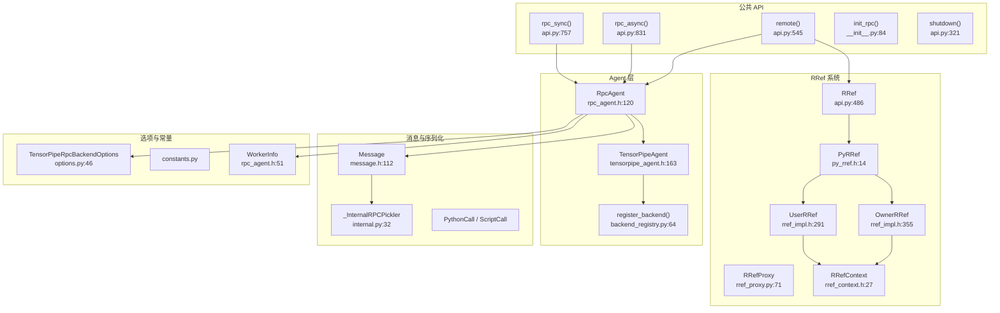

# 49. PyTorch RPC 远程过程调用框架

## 目录

- [49.1 整体架构](#491-整体架构)
- [49.2 公共 API](#492-公共-api)
- [49.3 RpcAgent 与 TensorPipeAgent](#493-rpcagent-与-tensorpipeagent)
- [49.4 RRef 远程引用](#494-rref-远程引用)
- [49.5 消息类型与序列化](#495-消息类型与序列化)
- [49.6 后端注册与初始化](#496-后端注册与初始化)
- [49.7 Autograd 跨 RPC](#497-autograd-跨-rpc)
- [49.8 设计权衡](#498-设计权衡)
- [49.9 关键文件索引](#499-关键文件索引)

---

## 49.1 整体架构

PyTorch RPC 框架支持跨进程/跨节点的远程过程调用，基于 TensorPipe 传输层实现，提供同步/异步/远程调用三种模式，并通过 RRef 支持远程对象引用。



---

## 49.2 公共 API

### rpc_sync() (`api.py:757`)

```python
def rpc_sync(
    to,                       # 目标 worker
    func,                     # 远程函数
    args=None,                # 位置参数
    kwargs=None,              # 关键字参数
    timeout=-1.0,             # 超时时间
):
```

同步 RPC 调用，阻塞等待远程函数返回结果。

### rpc_async() (`:831`)

```python
def rpc_async(
    to, func, args=None, kwargs=None, timeout=-1.0,
):
```

异步 RPC 调用，返回 `Future` 对象，不阻塞。

### remote() (`:545`)

```python
def remote(
    to, func, args=None, kwargs=None, timeout=-1.0,
):
```

远程调用，返回 `RRef` 引用而非结果值。远程函数在目标 worker 上异步执行。

### init_rpc() (`__init__.py:84`)

```python
def init_rpc(
    name=None,                # worker 名称
    backend=None,             # 后端类型（默认 TensorPipe）
    rank=None,                # 全局 rank
    world_size=None,          # 总 worker 数
    rpc_backend_options=None, # 后端选项
):
```

初始化 RPC 框架，创建 RpcAgent 实例。

### shutdown() (`api.py:321`)

```python
def shutdown(graceful=True, timeout=0):
```

关闭 RPC 框架。`graceful=True` 等待所有未完成 RPC 完成。

---

## 49.3 RpcAgent 与 TensorPipeAgent

### RpcAgent (`rpc_agent.h:120`)

```cpp
class RpcAgent {
    virtual std::shared_ptr<FutureMessage> send(...) = 0;  // :149 纯虚发送
    virtual void join();      // :198 等待完成
    virtual void sync();      // :201 同步
    virtual void start();     // :207 开始接受请求
    virtual void shutdown();  // :216 关闭
};
```

RPC Agent 的抽象基类，定义发送/接收接口。

### WorkerInfo (`:51`)

```cpp
struct WorkerInfo {
    static constexpr size_t MAX_NAME_LEN = 128;  // :60
    worker_id_t id_;
    std::string name_;
};
```

全局唯一的 worker 标识符，包含 ID 和名称。

### TensorPipeAgent (`tensorpipe_agent.h:163`)

```cpp
class TensorPipeAgent : public RpcAgent {
    void send() override;        // :178 发送消息
    void startImpl() override;   // :188 启动 TensorPipe
    void shutdownImpl() override; // :189 关闭 TensorPipe
};
```

基于 TensorPipe 的 RPC Agent 实现：
- 支持多种传输层（SHM、IBV、UV）
- 支持多种通道（CMA、Basic、CUDA basic）
- 内置线程池（默认 16 线程，`kDefaultNumWorkerThreads` :77）

### TensorPipeRpcBackendOptions (`options.py:46`)

```python
class TensorPipeRpcBackendOptions:
    def __init__(  # :80
        self,
        num_worker_threads=16,
        rpc_timeout=60,
        init_method="env://",
        device_maps=None,
        devices=None,
        ...
    ):
    def set_device_map(self, worker, device_map):  # :107
```

---

## 49.4 RRef 远程引用

RRef (Remote Reference) 是 RPC 框架的核心抽象，允许一个 worker 引用另一个 worker 上的对象。

### Python RRef (`api.py:486`)

```python
class RRef(PyRRef, Generic[T]):
```

Python 层 RRef，通过元类机制从 `PyRRef` 继承所有方法。

### PyRRef (`py_rref.h:14`)

```cpp
class PyRRef {
    bool isOwner();              // :23 是否为 owner
    WorkerInfo owner();          // :25 获取 owner 信息
    py::object toHere();         // :27 从 owner 获取值
    py::object localValue();     // :30 获取本地值
    void backward();             // :61 在 RRef 上执行反向传播
};
```

### UserRRef vs OwnerRRef

| 类 | 行号 | 说明 |
|----|------|------|
| `RRef` (基类) | :194 | RRef 接口，定义 owner/rrefId 等通用方法 |
| `UserRRef` | :291 | 非 owner 端的 RRef，通过 `toHere()` 获取值 |
| `OwnerRRef` | :355 | Owner 端的 RRef，持有实际值 |

### RRefContext (`rref_context.h:27`)

```cpp
class RRefContext {
    static RRefContext& getInstance();           // :29 单例
    OwnerRRef createOwnerRRef();                 // :99 创建 OwnerRRef
    UserRRef createUserRRef(worker_id_t, ...);   // :70 创建 UserRRef
    void addForkOfOwner(RRefId, ForkId);         // :126 注册 fork
    void delForkOfOwner(RRefId, ForkId);         // :140 删除 fork
};
```

管理所有 RRef 的生命周期，维护 fork 关系图。

### RRefProxy (`rref_proxy.py:71`)

```python
class RRefProxy:
    def __init__(self, rref, rpc_api, timeout):  # :72
    def __getattr__(self, name):                  # :77 动态属性访问
```

RRef 的代理对象，允许通过 `rref_proxy.method()` 直接调用远程对象的方法。

---

## 49.5 消息类型与序列化

### MessageType 枚举 (`message.h:28`)

| 类型 | 值 | 说明 |
|------|-----|------|
| `SCRIPT_CALL` | 0x100 | TorchScript 函数调用 |
| `SCRIPT_RET` | 0x200 | TorchScript 函数返回 |
| `PYTHON_CALL` | 0x300 | Python 函数调用 |
| `PYTHON_RET` | 0x400 | Python 函数返回 |
| `REMOTE_CALL` | 0x500 | 远程调用（返回 RRef） |
| `REMOTE_RET` | 0x600 | 远程调用返回 |
| `RREF_FETCH` | 0x700 | 获取 RRef 值 |
| `RREF_USER_DELETE` | 0x800 | 删除 UserRRef |
| `RREF_FORK_NOTIFY` | 0x900 | 通知 Owner fork 创建 |
| `RREF_CHILD_ACK` | 0xA00 | 子 RRef 确认 |
| `RREF_ACCEPT_SYNC` | 0xB00 | 同步确认 |

### Message (`message.h:112`)

```cpp
class Message {
    std::vector<char> payload_;           // 序列化数据
    std::vector<torch::Tensor> tensors_;  // 附加张量
    MessageType type_;                    // 消息类型
    int64_t id_;                          // 消息 ID
};
```

### _InternalRPCPickler (`internal.py:32`)

```python
class _InternalRPCPickler:
    def serialize(self, obj):     # :95 序列化
    def deserialize(self, bin):   # :148 反序列化
```

RPC 的序列化器，支持：
- 张量（通过 `_tensor_reducer`/:60 直接传输二进制）
- PyRRef（通过 `_py_rref_reducer`/:70 传输 fork 信息）
- ScriptModule（通过 `_script_module_reducer`/:87）

### RPCExecMode (`:25`)

```python
class RPCExecMode(Enum):
    SYNC = 0       # 同步
    ASYNC = 1      # 异步
    ASYNC_JIT = 2  # JIT 异步
    REMOTE = 3     # 远程（返回 RRef）
```

---

## 49.6 后端注册与初始化

### register_backend() (`backend_registry.py:64`)

```python
def register_backend(
    backend_name,           # 后端名称
    backend_handler,        # 初始化处理函数
    construct_rpc_backend_options_handler,  # 选项构造函数
):
```

注册新的 RPC 后端。默认注册了 `TENSORPIPE` (:428)。

### _tensorpipe_init_backend_handler() (`:340`)

TensorPipe 后端的初始化处理函数：
1. 验证设备映射
2. 交换所有 worker 的设备信息
3. 创建 `TensorPipeAgent` 实例
4. 调用 `agent.start()` 开始服务

---

## 49.7 Autograd 跨 RPC

RPC 框架支持跨 worker 的自动微分：

1. **前向传播**：`rpc_sync()`/`remote()` 执行远程计算时，自动传播 Autograd 上下文
2. **RRef.backward()** (`py_rref.h:61`)：在 RRef 上执行反向传播，梯度沿 RPC 链路传回
3. **梯度传播**：通过 `DIST_AUTOGRAAD` 消息类型在 worker 间传递梯度

### PythonUDF (`internal.py:284`)

```python
PythonUDF = namedtuple("PythonUDF", ("func", "args", "kwargs"))
```

远程执行的 Python 用户定义函数。

### RemoteException (`:285`)

```python
RemoteException = namedtuple("RemoteException", ("msg", "exception_type"))
```

远程异常的封装，确保异常信息能正确传回调用方。

---

## 49.8 设计权衡

### 1. TensorPipe 作为默认后端

**选择**：使用 TensorPipe 作为默认 RPC 传输层。

**原因**：TensorPipe 支持多种传输（SHM/IBV/UV）和通道（CMA/Basic/CUDA），自动选择最优路径。同一节点使用 SHM 实现零拷贝，跨节点使用 IBV 实现 RDMA。替代方案 ProcessGroupAgent 仅支持 ProcessGroup 通信，性能较低。

### 2. RRef 的 Fork 模型

**选择**：RRef 使用 Fork 模型管理远程引用，owner 持有原始值，非 owner 持有 fork。

**原因**：集中式 owner 模型简化了一致性管理——只有 owner 能修改值，fork 仅持有引用。代价是每次 `toHere()` 都需要与 owner 通信。

### 3. 同步/异步/远程三种模式

**选择**：提供 `rpc_sync`/`rpc_async`/`remote` 三种调用模式。

**原因**：不同场景有不同的延迟容忍度。同步模式适合需要立即结果的场景；异步模式适合流水线并行；远程模式适合参数服务器架构，仅需引用而非值。

### 4. 序列化的张量直传

**选择**：张量不经过 pickle，直接作为二进制数据传输。

**原因**：pickle 序列化张量的开销极大（需要逐元素转换）。通过 `Message.tensors_` 直接传输二进制，接收端零拷贝重建张量。

---

## 49.9 关键文件索引

| 文件路径 | 核心内容 |
|----------|----------|
| `torch/distributed/rpc/api.py` | `rpc_sync`(:757), `rpc_async`(:831), `remote`(:545), `shutdown`(:321), `RRef`(:486), `get_worker_info`(:420) |
| `torch/distributed/rpc/__init__.py` | `init_rpc`(:84), `_init_rpc_backend`(:219) |
| `torch/distributed/rpc/rref_proxy.py` | `RRefProxy`(:71) |
| `torch/distributed/rpc/backend_registry.py` | `register_backend`(:64), `init_backend`(:112), `_tensorpipe_init_backend_handler`(:340) |
| `torch/distributed/rpc/options.py` | `TensorPipeRpcBackendOptions`(:46) |
| `torch/distributed/rpc/internal.py` | `_InternalRPCPickler`(:32), `serialize`(:190), `deserialize`(:194), `PythonUDF`(:284), `RemoteException`(:285), `RPCExecMode`(:25) |
| `torch/distributed/rpc/constants.py` | `DEFAULT_RPC_TIMEOUT_SEC`(:13), `DEFAULT_NUM_WORKER_THREADS`(:18) |
| `torch/distributed/rpc/functions.py` | `async_execution`(:5) |
| `torch/csrc/distributed/rpc/rpc_agent.h` | `RpcAgent`(:120), `WorkerInfo`(:51), `RpcBackendOptions`(:36) |
| `torch/csrc/distributed/rpc/tensorpipe_agent.h` | `TensorPipeAgent`(:163), `TensorPipeRpcBackendOptions`(:79) |
| `torch/csrc/distributed/rpc/py_rref.h` | `PyRRef`(:14) |
| `torch/csrc/distributed/rpc/rref_impl.h` | `RRef`(:194), `UserRRef`(:291), `OwnerRRef`(:355), `RRefForkData`(:31) |
| `torch/csrc/distributed/rpc/rref_context.h` | `RRefContext`(:27) |
| `torch/csrc/distributed/rpc/message.h` | `Message`(:112), `MessageType`(:28), `RPCErrorType`(:10) |
| `torch/csrc/distributed/rpc/types.h` | `GloballyUniqueId`(:23), `RRefId`(:55), `ForkId`(:56) |