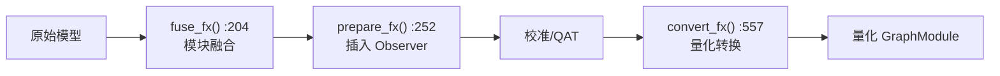

# 50. PyTorch 模型量化系统

## 目录

- [50.1 整体架构](#501-整体架构)
- [50.2 Eager 模式量化 API](#502-eager-模式量化-api)
- [50.3 Observer 观测器](#503-observer-观测器)
- [50.4 FakeQuantize 伪量化](#504-fakequantize-伪量化)
- [50.5 QConfig 配置](#505-qconfig-配置)
- [50.6 FX 图模式量化](#506-fx-图模式量化)
- [50.7 BackendConfig 后端配置](#507-backendconfig-后端配置)
- [50.8 PTQ 与 QAT 流程](#508-ptq-与-qat-流程)
- [50.9 设计权衡](#509-设计权衡)
- [50.10 关键文件索引](#5010-关键文件索引)

---

## 50.1 整体架构

PyTorch 量化系统提供 Eager 模式（手动）和 FX 图模式（自动）两种量化路径，支持训练后量化（PTQ）、量化感知训练（QAT）和动态量化。

```mermaid
graph TB
    subgraph "Eager 模式"
        PRE["prepare() :335<br/>quantize.py"]
        PREQ["prepare_qat() :564<br/>quantize.py"]
        CVT["convert() :616<br/>quantize.py"]
        QD["quantize_dynamic() :474<br/>quantize.py"]
    end

    subgraph "FX 图模式"
        PFX["prepare_fx() :252<br/>quantize_fx.py"]
        PQAT["prepare_qat_fx() :403<br/>quantize_fx.py"]
        CFX["convert_fx() :557<br/>quantize_fx.py"]
        FFX["fuse_fx() :204<br/>quantize_fx.py"]
    end

    subgraph "Observer"
        OB["ObserverBase :148<br/>observer.py"]
        MMO["MinMaxObserver :431"]
        MAMO["MovingAverageMinMaxObserver :577"]
        HO["HistogramObserver :974"]
        PO["PlaceholderObserver :1445"]
    end

    subgraph "FakeQuantize"
        FQB["FakeQuantizeBase :72<br/>fake_quantize.py"]
        FQ["FakeQuantize :130"]
        FQP["FixedQParamsFakeQuantize :320"]
        FMA["FusedMovingAvgObsFakeQuantize :358"]
    end

    subgraph "配置"
        QC["QConfig :85<br/>qconfig.py"]
        QCD["QConfigDynamic :119"]
        BCM["QConfigMapping<br/>qconfig_mapping.py"]
        BKC["BackendConfig :289<br/>backend_config.py"]
    end

    subgraph "FX 引擎"
        TRC["QuantizationTracer :21<br/>fx/tracer.py"]
        PH["QuantizeHandler :44<br/>fx/quantize_handler.py"]
        INS["insert_observers_for_model :1441<br/>fx/prepare.py"]
        CVT2["convert :986<br/>fx/convert.py"]
        LTN["_lower_to_native_backend :1327<br/>fx/_lower_to_native_backend.py"]
    end

    PRE --> OB
    PREQ --> FQ
    CVT --> QC
    PFX --> TRC
    PFX --> INS
    PQAT --> FQ
    CFX --> CVT2
    CVT2 --> LTN
    INS --> OB
    INS --> PH
    QC --> OB
    QC --> FQ
    BCM --> QC
    BKC --> CVT2
```



---

## 50.2 Eager 模式量化 API

### prepare() (`quantize.py:335`)

```python
def prepare(model, qconfig_dict=None, inplace=False, allow_list=None, ...):
```

训练后量化（PTQ）准备：
1. 根据 `qconfig_dict` 为每个模块分配 QConfig
2. 在模块前后插入 `QuantStub`/`DeQuantStub`
3. 将指定模块替换为 Observer 包装版本
4. 返回准备好的模型，用于校准数据收集

### prepare_qat() (`:564`)

```python
def prepare_qat(model, qconfig_dict=None, inplace=False, ...):
```

量化感知训练（QAT）准备：
1. 类似 `prepare()`，但使用 `FakeQuantize` 替代 Observer
2. 前向传播时模拟量化效果（伪量化）
3. 梯度通过伪量化节点回传

### convert() (`:616`)

```python
def convert(model, mapping=None, inplace=False, remove_qconfig=True, ...):
```

将 Observer/FakeQuantize 转换为实际的量化操作：
1. 将 `QuantStub` → `Quantize` 节点
2. 将 `DeQuantStub` → `DeQuantize` 节点
3. 将 `ObserverWrapper` → 量化模块（如 `QuantizedLinear`）
4. 移除 Observer/FakeQuantize

### quantize_dynamic() (`:474`)

```python
def quantize_dynamic(model, qconfig_spec=None, dtype=torch.qint8, ...):
```

动态量化：仅权重预量化，激活在推理时动态量化。适用于 RNN/Transformer 等动态形状模型。

---

## 50.3 Observer 观测器

Observer 在校准阶段收集张量的统计信息（min/max/直方图），用于确定量化参数（scale/zero_point）。

### ObserverBase (`observer.py:148`)

```python
class ObserverBase(Module):
    def forward(self, x):  # 观测张量
    def calculate_qparams(self):  # 计算量化参数
```

### 观测器类型

| 类 | 行号 | 说明 |
|----|------|------|
| `MinMaxObserver` | :431 | 记录全局 min/max，适用于均匀分布 |
| `MovingAverageMinMaxObserver` | :577 | 指数移动平均 min/max，适应分布漂移 |
| `HistogramObserver` | :974 | 构建直方图，使用 KL 散度选择最优截断 |
| `PlaceholderObserver` | :1445 | 占位观测器（不收集统计信息） |

### _PartialWrapper (`:75`)

```python
class _PartialWrapper:
```

延迟构造 Observer 的包装器，允许在 `QConfig` 中使用 `functools.partial` 延迟绑定参数。

### 量化参数计算

| 方法 | 说明 |
|------|------|
| `calculate_qparams()` | 从收集的统计信息计算 `scale` 和 `zero_point` |
| MinMaxObserver | `scale = (max - min) / (qmax - qmin)` |
| HistogramObserver | 使用 entropy/calibration 方法选择最优 min/max |

---

## 50.4 FakeQuantize 伪量化

FakeQuantize 在 QAT 中模拟量化效果：前向传播执行量化-反量化，反向传播使用直通估计器（STE）传递梯度。

### FakeQuantizeBase (`fake_quantize.py:72`)

```python
class FakeQuantizeBase(Module):
    def forward(self, x):  # 伪量化前向
```

### FakeQuantize (`:130`)

```python
class FakeQuantize(FakeQuantizeBase):
    def __init__(self, observer=MovingAverageMinMaxObserver, ...):
```

标准伪量化模块，结合 Observer 和伪量化操作：
1. Observer 收集 min/max
2. 计算 scale/zero_point
3. 前向：`x_q = quantize_dequantize(x, scale, zp)`
4. 反向：`grad ≈ grad`（STE，梯度直通）

### FixedQParamsFakeQuantize (`:320`)

```python
class FixedQParamsFakeQuantize(FakeQuantizeBase):
```

固定量化参数的伪量化，用于 scale/zero_point 已知的操作（如特定激活函数）。

### FusedMovingAvgObsFakeQuantize (`:358`)

```python
class FusedMovingAvgObsFakeQuantize(FakeQuantizeBase):
```

融合的移动平均观测+伪量化模块，将 Observer 和 FakeQuantize 合并为单一操作，减少内核启动开销。

---

## 50.5 QConfig 配置

### QConfig (`qconfig.py:85`)

```python
class QConfig(NamedTuple):
    activation: ObserverOrFakeQuantize  # 激活观测/伪量化
    weight: ObserverOrFakeQuantize      # 权重观测/伪量化
```

### QConfigDynamic (`:119`)

```python
class QConfigDynamic(NamedTuple):
    weight: ObserverOrFakeQuantize  # 仅权重量化
```

### 预定义配置

| 配置 | 行号 | 说明 |
|------|------|------|
| `default_qconfig` | :146 | 默认静态量化配置 |
| `default_dynamic_qconfig` | :165 | 默认动态量化配置 |

### get_default_qconfig() (`:252`)

```python
def get_default_qconfig(backend="x86", version=0):
```

根据后端返回默认 QConfig，适配不同硬件的量化特性。

### QConfigMapping (`qconfig_mapping.py`)

```python
class QConfigMapping:
```

细粒度的 QConfig 映射，支持按模块路径、模块类型、对象名称分配不同的 QConfig。

---

## 50.6 FX 图模式量化

FX 图模式量化通过 `torch.fx` 自动追踪模型，插入 Observer/FakeQuantize，并转换量化操作。

### prepare_fx() (`quantize_fx.py:252`)

```python
def prepare_fx(model, qconfig_mapping, example_inputs, ...):
```

1. 使用 `QuantizationTracer` 追踪模型
2. 自动融合模块（Conv+BN+ReLU 等）
3. 根据 QConfigMapping 插入 Observer
4. 返回带 Observer 的 GraphModule

### prepare_qat_fx() (`:403`)

```python
def prepare_qat_fx(model, qconfig_mapping, example_inputs, ...):
```

QAT 版本，插入 FakeQuantize 替代 Observer。

### convert_fx() (`:557`)

```python
def convert_fx(model, ...):
```

1. 将 Observer 替换为量化/反量化节点
2. 调用 `_lower_to_native_backend()` 转换为目标后端算子
3. 返回量化后的 GraphModule

### QuantizationTracer (`fx/tracer.py:21`)

```python
class QuantizationTracer:
```

专用于量化的 FX 追踪器，识别可融合的模块模式。

### QuantizeHandler (`fx/quantize_handler.py:44`)

```python
class QuantizeHandler:
```

量化处理器，决定每个匹配模式如何插入 Observer：

| Handler | 行号 | 说明 |
|---------|------|------|
| `BinaryOpQuantizeHandler` | :165 | 二元操作 |
| `ConvReluQuantizeHandler` | :174 | Conv+ReLU 融合 |
| `LinearReLUQuantizeHandler` | :179 | Linear+ReLU 融合 |
| `DefaultNodeQuantizeHandler` | :199 | 默认处理 |

### insert_observers_for_model() (`fx/prepare.py:1441`)

```python
def insert_observers_for_model(model, graph, qconfig_map, ...):
```

核心 Observer 插入逻辑，遍历 FX 图节点，按 QConfig 规则插入 Observer。

### _lower_to_native_backend() (`fx/_lower_to_native_backend.py:1327`)

```python
def _lower_to_native_backend(graph_module, backend_config):
```

将通用量化操作转换为目标后端的原生算子：
1. 权重折叠（`fold_weight` :445）
2. 静态/动态加权模块降低
3. 特殊模式替换

---

## 50.7 BackendConfig 后端配置

### BackendConfig (`backend_config.py:289`)

```python
class BackendConfig:
```

定义后端支持的量化模式、数据类型和算子映射。

### 核心配置类

| 类 | 行号 | 说明 |
|----|------|------|
| `ObservationType` | :53 | 观测类型（输出/输入） |
| `DTypeWithConstraints` | :77 | 带约束的数据类型 |
| `DTypeConfig` | :113 | 数据类型配置 |
| `BackendPatternConfig` | :437 | 后端模式配置 |

### 后端特化

| 函数 | 文件 | 行号 | 说明 |
|------|------|------|------|
| `get_fbgemm_backend_config()` | fbgemm.py | :85 | FBGEMM (x86) 后端 |
| `get_qnnpack_backend_config()` | qnnpack.py | :115 | QNNPACK (ARM) 后端 |
| `get_x86_backend_config()` | x86.py | :82 | x86 后端 |
| `get_onednn_backend_config()` | onednn.py | :620 | OneDNN 后端 |
| `get_native_backend_config()` | native.py | :169 | 原生后端 |
| `get_executorch_backend_config()` | executorch.py | :486 | ExecuTorch 后端 |

---

## 50.8 PTQ 与 QAT 流程

### 训练后量化（PTQ）


### 量化感知训练（QAT）


### FX 图模式量化



### 动态量化


---

## 50.9 设计权衡

### 1. Eager 模式 vs FX 图模式

**选择**：同时提供 Eager 模式（手动）和 FX 图模式（自动）。

**原因**：Eager 模式对任意 Python 模型通用，但需要手动管理 Observer 和量化/反量化插入。FX 图模式自动完成这些步骤，但依赖 `torch.fx` 的符号追踪能力，对动态模型支持有限。

### 2. Observer 与 FakeQuantize 的统一接口

**选择**：Observer 和 FakeQuantize 共享 `QConfig` 接口，`QConfig.activation`/`QConfig.weight` 可以是任一类型。

**原因**：PTQ 使用 Observer 收集统计，QAT 使用 FakeQuantize 模拟量化。统一接口允许同一套配置代码同时支持两种模式，切换时只需更换 `prepare`/`prepare_qat`。

### 3. 多后端配置系统

**选择**：通过 `BackendConfig` 为不同硬件提供独立的量化配置。

**原因**：不同硬件支持不同的量化数据类型（如 x86 支持 int8/int4，ARM 支持 int8）和算子融合模式。统一配置无法满足所有后端的需求。代价是配置系统复杂度增加。

### 4. 直通估计器（STE）的梯度近似

**选择**：FakeQuantize 反向传播使用 STE，将量化函数的梯度近似为 1。

**原因**：量化函数的精确梯度几乎处处为零，不可用于训练。STE 提供了合理的梯度近似，在实践中效果良好。代价是梯度近似可能引入训练不稳定性。

### 5. 权重折叠（Weight Folding）

**选择**：`_lower_to_native_backend()` 中通过 `fold_weight` (:445) 将 BN 参数折叠到 Conv 权重中。

**原因**：Conv+BN 融合是量化前的标准优化，减少推理时的计算量。折叠后的权重可以直接量化，无需在推理时额外处理 BN。代价是折叠后的权重值可能与原始权重分布差异较大，影响量化精度。

---

## 50.10 关键文件索引

| 文件路径 | 核心内容 |
|----------|----------|
| `torch/ao/quantization/quantize.py` | `prepare`(:335), `quantize_dynamic`(:474), `prepare_qat`(:564), `convert`(:616) |
| `torch/ao/quantization/observer.py` | `ObserverBase`(:148), `MinMaxObserver`(:431), `MovingAverageMinMaxObserver`(:577), `HistogramObserver`(:974), `PlaceholderObserver`(:1445), `_PartialWrapper`(:75) |
| `torch/ao/quantization/fake_quantize.py` | `FakeQuantizeBase`(:72), `FakeQuantize`(:130), `FixedQParamsFakeQuantize`(:320), `FusedMovingAvgObsFakeQuantize`(:358) |
| `torch/ao/quantization/qconfig.py` | `QConfig`(:85), `QConfigDynamic`(:119), `default_qconfig`(:146), `default_dynamic_qconfig`(:165), `get_default_qconfig`(:252) |
| `torch/ao/quantization/quantize_fx.py` | `prepare_fx`(:252), `prepare_qat_fx`(:403), `convert_fx`(:557), `fuse_fx`(:204), `_convert_fx`(:509) |
| `torch/ao/quantization/fx/prepare.py` | `insert_observers_for_model`(:1441), `prepare`(:1978) |
| `torch/ao/quantization/fx/convert.py` | `convert`(:986), `convert_weighted_module`(:735) |
| `torch/ao/quantization/fx/tracer.py` | `QuantizationTracer`(:21) |
| `torch/ao/quantization/fx/quantize_handler.py` | `QuantizeHandler`(:44), `DefaultNodeQuantizeHandler`(:199) |
| `torch/ao/quantization/fx/_lower_to_native_backend.py` | `_lower_to_native_backend`(:1327), `fold_weight`(:445) |
| `torch/ao/quantization/fx/custom_config.py` | `PrepareCustomConfig`(:46), `ConvertCustomConfig`(:374) |
| `torch/ao/quantization/backend_config.py` | `BackendConfig`(:289), `BackendPatternConfig`(:437), `DTypeConfig`(:113), `ObservationType`(:53) |
| `torch/ao/quantization/backend_config/fbgemm.py` | `get_fbgemm_backend_config`(:85) |
| `torch/ao/quantization/backend_config/qnnpack.py` | `get_qnnpack_backend_config`(:115) |
| `torch/ao/quantization/backend_config/x86.py` | `get_x86_backend_config`(:82) |
| `torch/ao/quantization/backend_config/onednn.py` | `get_onednn_backend_config`(:620) |