# PyTorch 代码实现架构全面解析

> 本文档全面阐述 PyTorch 的代码实现架构、设计理念、关键流程、核心机制与子领域，
> 涵盖从底层 C++ 核心到上层 Python API 的完整技术栈。

---

## 目录

1. [整体架构概览](#1-整体架构概览)
2. [c10 核心库](#2-c10-核心库)
3. [ATen 张量运算库](#3-aten-张量运算库)
4. [分发器机制 (Dispatcher)](#4-分发器机制-dispatcher)
5. [Autograd 自动微分系统](#5-autograd-自动微分系统)
6. [代码生成 (torchgen)](#6-代码生成-torchgen)
7. [torch.nn 模块系统](#7-torchnn-模块系统)
8. [JIT / TorchScript 编译系统](#8-jit--torchscript-编译系统)
9. [torch.compile 编译系统 (Dynamo + Inductor)](#9-torchcompile-编译系统-dynamo--inductor)
10. [分布式训练系统](#10-分布式训练系统)
11. [量化系统](#11-量化系统)
12. [导出系统 (torch.export)](#12-导出系统-torchexport)
13. [关键设计权衡与哲学](#13-关键设计权衡与哲学)

---

## 1. 整体架构概览

PyTorch 采用分层架构，从底层 C++ 核心到上层 Python API 逐层构建：

```
┌─────────────────────────────────────────────────────────┐
│                   Python 用户 API 层                      │
│  torch.nn / torch.autograd / torch.distributed / ...    │
├─────────────────────────────────────────────────────────┤
│               Python-C++ 绑定层 (pybind11)                │
│  torch/csrc/ → torch._C                                 │
├──────────────┬──────────────────────────────────────────┤
│  torch/csrc/ │  C++ 实现 + Python 绑定                    │
│  autograd/   │  反向模式自动微分引擎                       │
│  jit/        │  TorchScript JIT 编译器                    │
│  dynamo/     │  Dynamo C++ 集成                           │
│  inductor/   │  Inductor C++ 集成                         │
│  distributed/│  分布式训练 C++ 支持                        │
├──────────────┴──────────────────────────────────────────┤
│                      ATen 张量运算库                       │
│  算子声明 (native_functions.yaml) + 算子实现               │
│  CPU / CUDA / Sparse / Quantized / MKLDNN / XPU / MPS   │
├─────────────────────────────────────────────────────────┤
│                    c10 核心库                              │
│  TensorImpl / StorageImpl / Dispatcher / DispatchKey     │
│  SymInt / Scalar / Device / Allocator / IntrusivePtr     │
└─────────────────────────────────────────────────────────┘
```

**依赖规则**：c10 不依赖任何上层；ATen 仅依赖 c10；torch/csrc/ 依赖 c10 和 ATen，但 c10/ATen 不反向依赖 torch/csrc/。

### 整体数据流

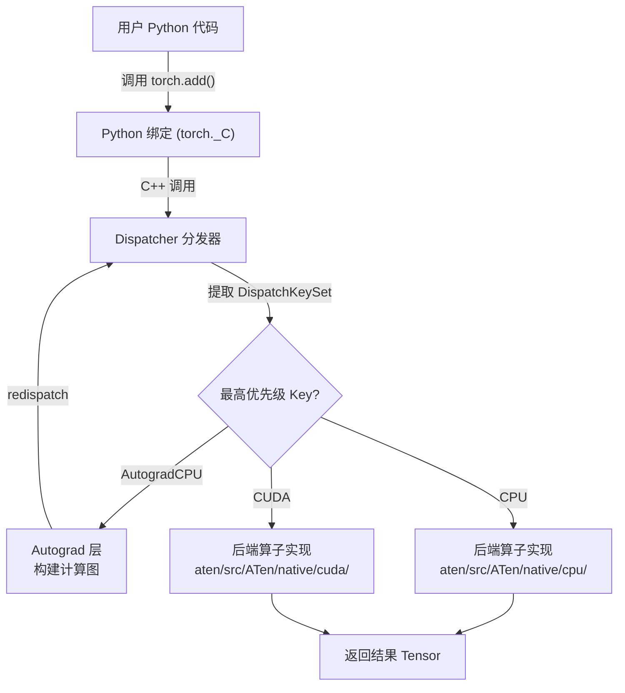

---

## 2. c10 核心库

c10 (C++ Ten) 是 PyTorch 最底层的核心库，提供所有上层组件共享的基础设施。

### 2.1 TensorImpl — 张量的核心表示

`TensorImpl` 是张量的底层实现，通过引用计数智能指针 `intrusive_ptr<TensorImpl>` 管理。

**核心成员变量**：

| 类别 | 成员 | 说明 |
|------|------|------|
| 数据 | `Storage storage_` | 底层数据缓冲区，持有 DataPtr |
| 形状 | `SizesAndStrides sizes_and_strides_` | 5 维以内内联存储，超出则堆分配 |
| 偏移 | `int64_t storage_offset_` | 元素级偏移（非字节偏移） |
| 元素数 | `int64_t numel_` | 所有维度之积 |
| 类型 | `caffe2::TypeMeta data_type_` | 数据类型（float, int64 等） |
| 设备 | `optional<Device> device_opt_` | CPU/CUDA/XPU 等 |
| 分发 | `DispatchKeySet key_set_` | 分发键集合，决定调用路径 |
| 自动微分 | `unique_ptr<AutogradMetaInterface> autograd_meta_` | 懒加载，梯度跟踪信息 |
| 额外元数据 | `unique_ptr<ExtraMeta> extra_meta_` | SymbolicShapeMeta、NamedTensor、BackendMeta 等 |
| 版本 | `VariableVersion version_counter_` | 原地修改计数，视图共享同一计数器 |
| Python | `PyObjectSlot pyobj_slot_` | 关联的 Python 对象 |

**存储与张量的关系**：

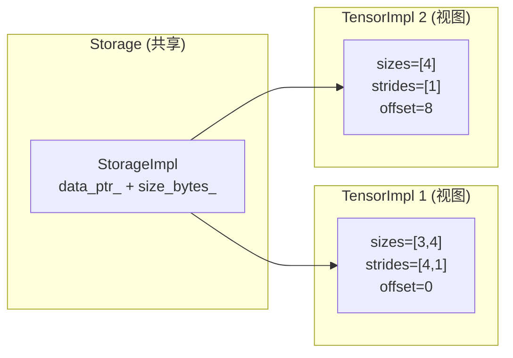

多个 TensorImpl 可共享同一 Storage（视图机制）。数据指针计算方式为 `storage_.data() + itemsize * storage_offset_`。

### 2.2 StorageImpl — 存储的实现

`StorageImpl` 表示底层的数据缓冲区，核心成员：
- `DataPtr data_ptr_` — 实际内存指针 + 删除器 + 设备信息
- `SymInt size_bytes_` — 字节数（支持符号大小）
- `bool size_bytes_is_heap_allocated_` — 优化标志
- `bool resizable_` — 是否可调整大小
- `bool received_cuda_` — 是否从其他进程接收
- `bool has_mutable_data_ptr_check_` — 守卫可变数据指针检查
- `bool throw_on_mutable_data_ptr_` / `throw_on_immutable_data_ptr_` / `warn_deprecated_on_mutable_data_ptr_` — 数据指针访问控制
- `Allocator* allocator_` — 内存分配器
- `PyObjectSlot pyobj_slot_` — Python 对象槽
- `unique_ptr<StorageExtraMeta> extra_meta_` — 额外元数据
- COW 支持：`maybe_materialize_cow()` 在可变访问时触发写时复制

**关键不变量**：两个非空 data_ptr 当且仅当来自同一 Storage 时才会别名。

### 2.3 IntrusivePtr — 引用计数智能指针

PyTorch 自研的引用计数智能指针，用于 TensorImpl 和 StorageImpl：

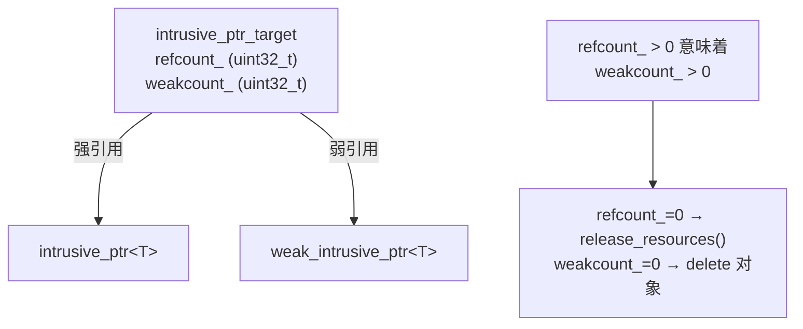

**引用计数规则**：
- `refcount_` = 强引用数
- `weakcount_` = 弱引用数 + 1（如果 refcount_ > 0）
- refcount_ 归零：调用 `release_resources()`（释放数据）
- weakcount_ 归零：delete 对象本身

### 2.4 DispatchKey 与 DispatchKeySet

DispatchKey 是 PyTorch 分发机制的核心概念，决定了算子调用时的执行路径。

**DispatchKey 分类**：

```mermaid
flowchart TD
    subgraph "后端组件键 (BackendComponent 15个)"
        B1["CPUBit"]
        B2["CUDABit"]
        B2b["HIPBit"]
        B3["XPUBit"]
        B4["MPSBit"]
        B5["MetaBit"]
        B6["XLABit / IPUBit / HPUBit / VEBit /<br/>LazyBit / MTIABit / PrivateUse1-3"]
    end
    subgraph "功能键 (Functionality Keys 按优先级从低到高)"
        F1["Dense — 密集张量 (per-backend)"]
        F1b["Quantized — 量化张量 (per-backend)"]
        F2["Sparse — 稀疏张量 (per-backend)"]
        F2b["SparseCsr — CSR稀疏 (per-backend)"]
        F2c["NestedTensor — 嵌套张量 (per-backend)"]
        F3["BackendSelect — 无张量参数时选择后端"]
        F4["Python — Python 内核"]
        F5["Functionalize — 别名/变异消除"]
        F5b["ADInplaceOrView — 原地/视图操作"]
        F6["AutogradFunctionality (per-backend)"]
        F7["... 以及 Autocast*, FuncTorch*,<br/>Tracer, PreDispatch, PythonDispatcher 等"]
    end
    subgraph "运行时键 (Per-Backend Runtime Keys)"
        R1["CPU = Dense + CPUBit"]
        R2["CUDA = Dense + CUDABit"]
        R3["AutogradCPU = AutogradFunctionality + CPUBit"]
        R4["AutogradCUDA = AutogradFunctionality + CUDABit"]
        R5["SparseCPU = Sparse + CPUBit"]
        R6["..."]
    end
    B1 --> R1
    F1 --> R1
    F6 --> R3
```

**DispatchKeySet** 是一个 64 位位图：
- 低位 (0~15)：后端组件位（InvalidBit=0, CPUBit=1, CUDABit=2, ..., MetaBit=15）
- 高位 (16~63)：功能位

**优先级规则**：功能键位索引越高，优先级越高，优先分发。

### 2.5 SymInt / SymBool / SymFloat — 符号类型

用于动态形状追踪：

- **SymInt**：使用单一 `int64_t data_` 字段，正数和小负数直接存储；大负数编码为指向 `SymNodeImpl` 的指针
- **SymBool**：`bool data_` + `SymNode ptr_`
- **SymFloat**：`double data_` + `SymNode ptr_`

`SymNodeImpl` 是抽象基类，定义了所有符号操作的虚方法。具体实现来自 torch.fx 和 `ConstantSymNodeImpl`。

### 2.6 Scalar — 标量类型

`Scalar` 是一个带标签的联合体 (tagged union)，可表示：
- `double` (HAS_d)
- `int64_t` (HAS_i)
- `uint64_t` (HAS_u)
- `complex<double>` (HAS_z)
- `bool` (HAS_b)
- `SymFloat` (HAS_sd), `SymInt` (HAS_si), `SymBool` (HAS_sb)

### 2.7 Allocator — 内存分配

```cpp
// 抽象接口
class Allocator {
    virtual DataPtr allocate(size_t n) = 0;
    virtual DeleterFnPtr raw_deleter() const;
    virtual void copy_data(void* dest, const void* src, size_t count) const = 0;
};
```

每个设备类型有全局注册的分配器（`SetAllocator` / `GetAllocator`），CPU 有专用的 `CPUAllocator` 和实验性的缓存分配器。

---

## 3. ATen 张量运算库

ATen (A Tensor Library) 是 PyTorch 的核心张量运算库，提供所有算子的声明与实现。

### 3.1 native_functions.yaml — 算子声明注册表

这是所有 PyTorch 算子的声明式注册中心，格式如下：

```yaml
- func: add.Tensor(Tensor self, Tensor other, *, Scalar alpha=1) -> Tensor
  structured_delegate: add.out
  dispatch:
    SparseCPU, SparseCUDA, SparseMeta: add_sparse
    MkldnnCPU: mkldnn_add
    ZeroTensor: add_zerotensor
    NestedTensorCPU, NestedTensorCUDA: NestedTensor_add_Tensor

- func: add.out(Tensor self, Tensor other, *, Scalar alpha=1, Tensor(a!) out) -> Tensor(a!)
  structured: True
  structured_inherits: TensorIteratorBase
  dispatch:
    CPU, CUDA: add_out
    MPS: add_out_mps
```

**关键字段**：
- `func`：函数签名，`*` 后为仅关键字参数，`(a!)` 表示原地修改
- `structured`：结构化内核，分为 META（计算输出形状）和 IMPL（执行计算）
- `dispatch`：将 DispatchKey 映射到内核函数名
- `variants`：`function`（`at::add()`）和/或 `method`（`tensor.add()`）
- `tags`：元数据标签（pointwise, core, inplace_view 等）

### 3.2 结构化内核模式

结构化内核将算子实现分为两个阶段：

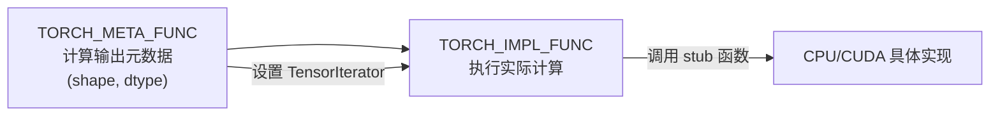

**以 add 为例**：

```cpp
// META：设置输出元数据
TORCH_META_FUNC2(add, Tensor)(const Tensor& self, const Tensor& other, const Scalar& alpha) {
    build_borrowing_binary_op(maybe_get_output(), self, other);
    native::alpha_check(dtype(), alpha);
}

// IMPL：委托给 stub
// 生成的 impl 函数调用 add_stub(device_type(), *this, alpha)
```

### 3.3 DispatchStub — CPU ISA 级分发

与主 Dispatcher 正交的另一层分发，针对 CPU 指令集优化：

```cpp
// 声明 (头文件)
DECLARE_DISPATCH(fn_type, add_stub)

// 注册 (CPU 内核文件)
REGISTER_DISPATCH(add_stub, &add_kernel)               // 默认
REGISTER_AVX2_DISPATCH(add_stub, &add_kernel_avx2)     // AVX2
REGISTER_AVX512_DISPATCH(add_stub, &add_kernel_avx512) // AVX512

// 使用
add_stub(device_type(), *this, alpha);
```

运行时自动检测 CPU 特性，选择最高性能的实现（AVX512 > AVX2 > DEFAULT）。

### 3.4 后端特定实现组织

```
aten/src/ATen/native/
  cpu/           → SIMD 向量化 CPU 内核 (编译多次: DEFAULT/AVX2/AVX512)
  cuda/          → CUDA GPU 内核 (~280 个 .cu 文件)
  sparse/        → 稀疏张量运算 (COO/CSR 格式)
  quantized/     → 量化张量运算
  mkldnn/        → Intel oneDNN 优化内核
  metal/         → Apple Metal GPU
  vulkan/        → Vulkan GPU
  xpu/           → Intel XPU (GPU)
  mps/           → Apple Metal Performance Shaders
```

### 3.5 ATen 核心类型

| 类型 | 说明 |
|------|------|
| `TensorBase` | 轻量基类，持有 `intrusive_ptr<TensorImpl>`，无代码生成方法 |
| `Tensor` | 继承 TensorBase，增加代码生成的算子方法 |
| `IValue` | 16 字节带标签联合体，JIT 解释器和装箱调用约定的通用值类型 |
| `Stack` | `vector<IValue>`，JIT 和装箱调用的操作栈 |
| `FunctionSchema` | 算子的类型签名（名称、参数、返回值） |

---

## 4. 分发器机制 (Dispatcher)

Dispatcher 是 PyTorch 算子调用的核心路由机制，将算子请求路由到正确的内核实现。

### 4.1 分发器架构

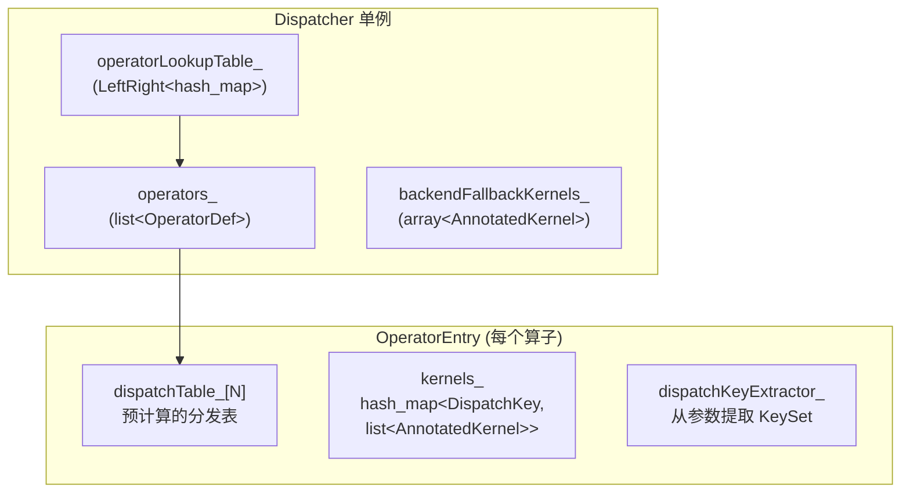

### 4.2 完整分发流程

以 `torch.add(tensor_a, tensor_b)` 为例（CPU 张量且 requires_grad=True）：

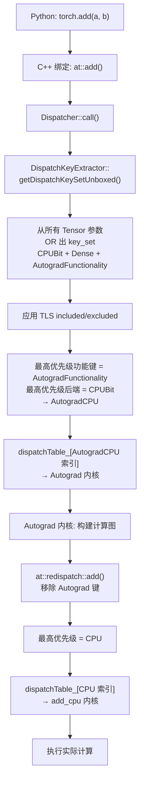

**热路径 (hot path) 的关键步骤只有三步**：
1. 从参数提取 DispatchKeySet
2. 查分发表（O(1) 数组索引）
3. 调用内核函数指针

### 4.3 DispatchKeySet 到分发表索引的映射

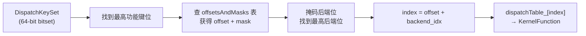

### 4.4 内核解析顺序

当某个运行时键没有直接注册的内核时，按以下顺序查找：

1. 直接注册到该键的内核
2. `CompositeExplicitAutogradNonFunctional` 别名
3. `CompositeExplicitAutograd` 别名
4. `CompositeImplicitAutograd` 别名（仅当无后端内核时）
5. `Autograd` 别名
6. 后端回退内核 (`backendFallbackKernels_`)
7. 报错

### 4.5 KernelFunction — 内核函数包装

`KernelFunction` 支持两种调用方式：
- **Unboxed**（类型化 C++ 调用）：直接调用函数指针，无装箱开销
- **Boxed**（栈式调用）：操作 IValue 栈，用于 JIT 解释器

内部存储三个函数指针：
- `boxed_kernel_func_`：始终存在
- `unboxed_kernel_func_`：快速路径
- `sym_unboxed_kernel_func_`：SymInt 变体

### 4.6 算子注册 API

```cpp
// 定义算子 schema
TORCH_LIBRARY(aten, m) {
    m.def("add.Tensor(Tensor self, Tensor other, *, Scalar alpha=1) -> Tensor");
}

// 注册特定 DispatchKey 的实现
TORCH_LIBRARY_IMPL(aten, CPU, m) {
    m.impl("add.Tensor", add_cpu);
}

// 注册回退
TORCH_LIBRARY_IMPL(aten, Autograd, m) {
    m.fallback(fallback_fn);
}
```

Python 端通过 `torch.library` 提供等效 API。

### 4.7 TLS 分发键操作

线程本地状态 (TLS) 可以修改分发行为：

- `IncludeDispatchKeyGuard`：临时包含某个键
- `ExcludeDispatchKeyGuard`：临时排除某个键
- `AutoDispatchBelowAutograd`：排除 Autograd 键（Autograd 内核 redispatch 时使用）
- `AutoDispatchBelowADInplaceOrView`：排除 ADInplaceOrView 键

---

## 5. Autograd 自动微分系统

### 5.1 计算图结构

PyTorch 使用动态计算图 (Define-by-Run)，在前向传播时自动构建反向传播图。

```mermaid
flowchart TD
    subgraph "前向传播 (构建图)"
        X["x (leaf)"] --> A["AddBackward0"]
        W["w (leaf)"] --> A
        A --> Y["y (interior)"]
        Y --> B["MulBackward0"]
        Z["z (leaf)"] --> B
        B --> O["output"]
    end
    subgraph "AutogradMeta"
        X -.->|"grad_fn_=nullptr<br/>grad_accumulator_=AccumulateGrad"| MX["x.grad"]
        W -.->|"grad_fn_=nullptr<br/>grad_accumulator_=AccumulateGrad"| MW["w.grad"]
        Y -.->|"grad_fn_=AddBackward0<br/>output_nr_=0"| MY[]
        Z -.->|"grad_fn_=nullptr<br/>grad_accumulator_=AccumulateGrad"| MZ["z.grad"]
    end
```

**关键组件**：

| 组件 | 文件 | 说明 |
|------|------|------|
| Node | torch/csrc/autograd/function.h | 计算图中的节点（反向函数） |
| Edge | torch/csrc/autograd/edge.h | 有向边 (function, input_nr) |
| AutogradMeta | torch/csrc/autograd/variable.h | 张量的自动微分元数据 |
| SavedVariable | torch/csrc/autograd/saved_variable.h | 为反向保存的张量快照 |
| AccumulateGrad | torch/csrc/autograd/functions/accumulate_grad.h | 叶子节点的梯度累加器 |

### 5.2 Node (Function) — 计算图节点

`Node` 是计算图中的顶点，核心成员：

- `next_edges_`：出边列表，指向"前向输入"对应的节点（反向图的"子节点"）
- `input_metadata_`：每个输入的 dtype/shape/device/stream
- `sequence_nr_`：单调递增序号，决定执行优先级（后执行的先反向）
- `topological_nr_`：到叶子的最长路径长度，用于 O(1) 剪枝
- `apply()`：纯虚函数，执行实际的反向计算

**梯度边系统**：
- 内部变量：`gradient_edge(var)` → `(grad_fn_, output_nr_)`
- 叶子变量：`gradient_edge(var)` → `(grad_accumulator_, 0)`
- `AccumulateGrad` 是弱引用持有，避免引用循环

### 5.3 反向传播执行引擎

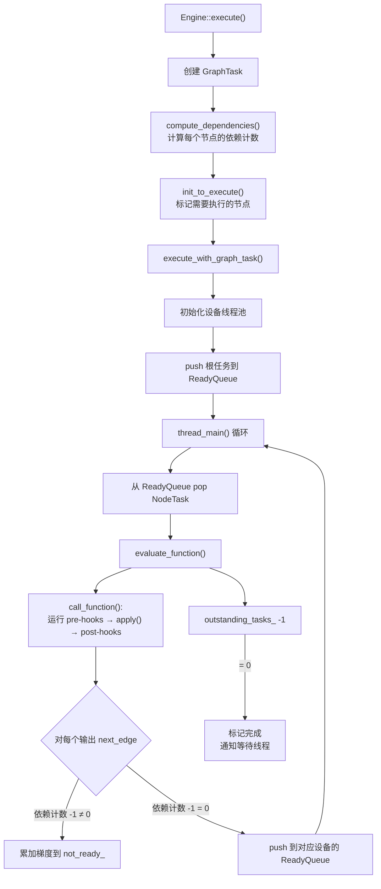

**线程架构**：
- CPU 线程：调用者线程同步驱动执行
- 加速器线程：每个设备一个专用线程，从设备专属 ReadyQueue 取任务
- 重入处理：重入深度 < MAX_DEPTH(60) 时递归调用 thread_main()；超过则委派给线程池

**梯度累加**：当多条边指向同一 (Node, input_nr) 时，`InputBuffer::add()` 隐式求和。

### 5.4 SavedVariable — 张量快照

SavedVariable 在前向时保存张量快照，反向时恢复使用：

- **保存**：记录版本号 `saved_version_`，区分是否为输出（避免引用循环）
- **解包**：检查版本号是否匹配（原地修改检测），恢复 grad_fn 或 requires_grad
- **自定义 Hook**：支持自定义 pack/unpack 逻辑（如保存到磁盘）

### 5.5 GradMode — 梯度模式控制

```python
with torch.no_grad():      # 禁用梯度追踪
with torch.enable_grad():   # 在 no_grad 块内启用
with torch.inference_mode(): # 更激进：禁用视图追踪和版本计数
```

底层原理：生成的 VariableType 分发代码在执行时检查 `GradMode::is_enabled()`。禁用时跳过创建 Node 和附加梯度边。

### 5.6 前向模式自动微分 (Forward AD)

与反向模式不同，前向模式 AD 在前向计算同时计算雅可比-向量积：

- `ForwardADLevel`：嵌套层级管理
- `ForwardGrad`：按层级存储切线值
- Python API：`enter_dual_level()`, `make_dual(tensor, tangent)`, `unpack_dual(tensor)`

### 5.7 导数定义 — derivatives.yaml

导数在 `tools/autograd/derivatives.yaml` 中声明式定义：

```yaml
- name: add.Tensor(Tensor self, Tensor other, *, Scalar alpha=1) -> Tensor
  self: handle_r_to_c(self.scalar_type(), grad)
  other: handle_r_to_c(other.scalar_type(), maybe_multiply(grad, alpha.conj()))
  result: self_t + maybe_multiply(other_t, alpha)

- name: relu(Tensor self) -> Tensor
  self: threshold_backward(grad, result, 0)
  result: auto_element_wise
```

torchgen 读取此文件，自动生成 `AddBackward0` 等 Node 子类。

---

## 6. 代码生成 (torchgen)

PyTorch 大量使用代码生成来连接声明式算子定义与具体实现。

### 6.1 代码生成管线

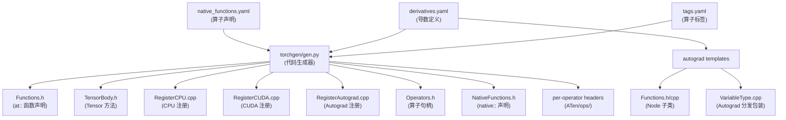

### 6.2 数据模型 (model.py)

`FunctionSchema` 是最核心的数据结构，完整表示一个算子签名：

- `OperatorName`：基础名 + 重载名
- `Arguments`：参数分类（pre_self, self, post_self, kwarg_only, out 等）
- `Returns`：返回值及别名注解
- `kind()`：分类为 `functional` / `inplace` / `out` / `mutable`
- `signature()`：归一化为核心函数签名

`NativeFunctionsGroup` 将同一基础名的 `functional + inplace + out + mutable` 变体归为一组。

### 6.3 生成的主要文件

| 生成文件 | 用途 |
|----------|------|
| `Functions.h` | `at::add()` 等内联函数声明 |
| `TensorBody.h` | `Tensor::add()` 等方法声明 |
| `Register{Key}.cpp` | 各 DispatchKey 的内核注册 |
| `Operators.h` | `at::_ops::add::call()` 声明 |
| `NativeFunctions.h` | `at::native::add()` 声明 |
| `MetaFunctions.h` | 结构化内核的 META 声明 |
| `Functions.h/cpp` (autograd) | 自动生成 Node 子类 |

---

## 7. torch.nn 模块系统

### 7.1 Module — 所有神经网络模块的基类

`Module` (`torch/nn/modules/module.py`) 的核心设计：

**自动注册机制** (`__setattr__`)：

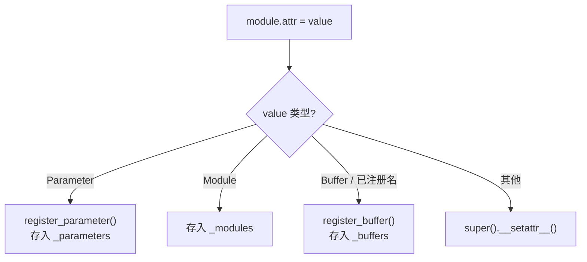

**forward 执行流程** (`_call_impl`)：

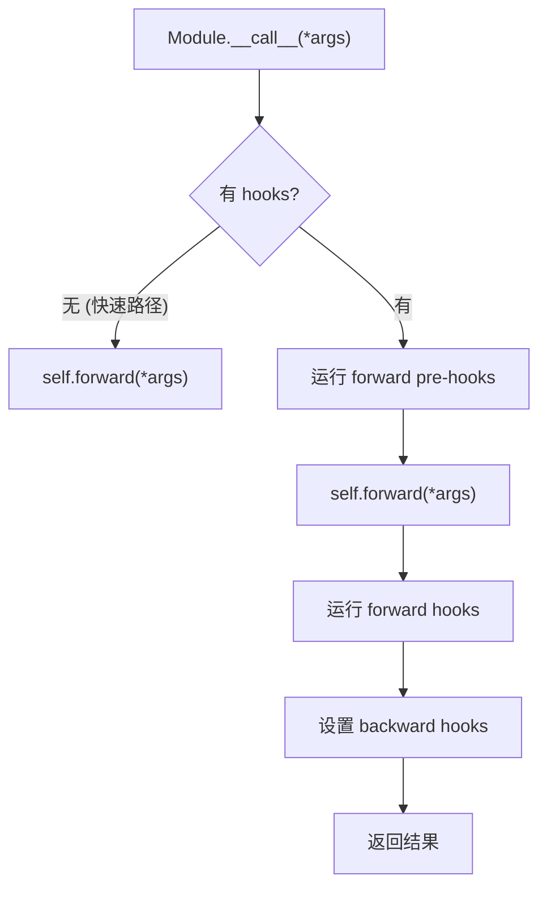

**Hook 体系**：

| Hook 类型 | 时机 | 用途 |
|-----------|------|------|
| `_forward_pre_hooks` | forward 前 | 修改输入 |
| `_forward_hooks` | forward 后 | 修改输出 |
| `_backward_pre_hooks` | backward 前 | 梯度预处理 |
| `_backward_hooks` | backward 后 | 梯度后处理 |

**state_dict / load_state_dict**：递归收集所有参数和持久化缓冲区，支持前缀命名。

**_apply**：`cuda()`, `cpu()`, `float()`, `to()` 等设备/类型转换的底层实现，递归应用到子模块。

### 7.2 Parameter 和 Buffer

| 类型 | 默认 requires_grad | 是否进入 state_dict | 说明 |
|------|-------------------|--------------------14---|------|
| `Parameter` | True | 是 | 可学习参数 |
| `Buffer(persistent=True)` | False | 是 | 非学习状态（如 BatchNorm 统计量） |
| `Buffer(persistent=False)` | False | 否 | 临时状态 |

### 7.3 模块实现模式

以 `Linear` 为例：

```python
class Linear(Module):
    def __init__(self, in_features, out_features, bias=True):
        self.weight = Parameter(torch.empty((out_features, in_features)))
        if bias:
            self.bias = Parameter(torch.empty(out_features))
        self.reset_parameters()

    def forward(self, input):
        return F.linear(input, self.weight, self.bias)
```

模块只负责参数管理和形状逻辑，实际计算委托给 `torch.nn.functional`，后者直接调用 C++ 实现。

---

## 8. JIT / TorchScript 编译系统

TorchScript 是 PyTorch 的模型编译和序列化系统，可将 Python 模型转换为可独立运行的表示。

### 8.1 IR 表示

JIT 使用 SSA (Single Static Assignment) 中间表示：

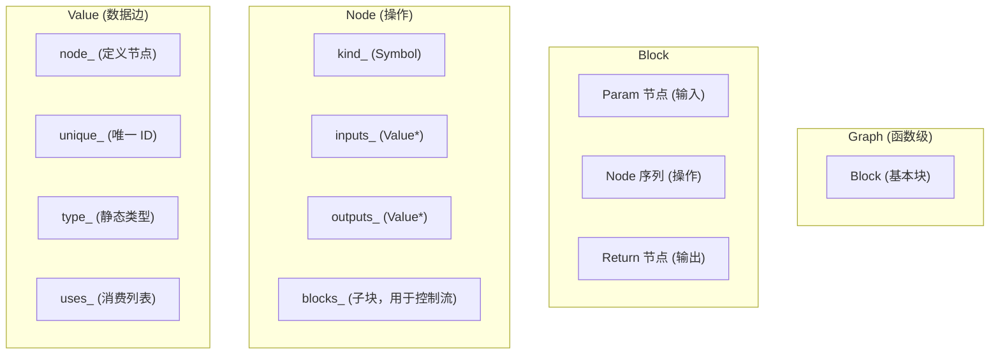

**控制流表示**：
- `prim::If`：两个子块 (true/false)，输出充当 phi 节点
- `prim::Loop`：一个子块 (循环体)，含最大迭代次数、初始条件、循环变量
- `prim::With`：两个子块 (body/exit)

### 8.2 编译管线

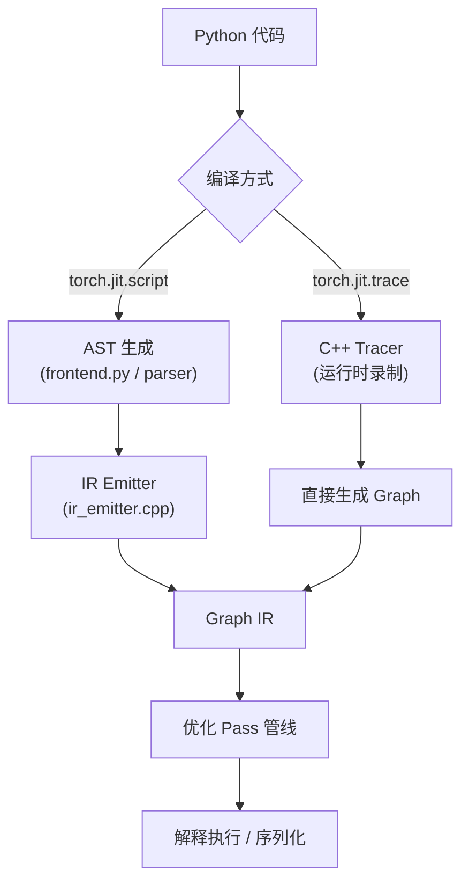

**脚本编译的详细阶段**：

1. **AST 生成**：将 Python 代码转为 Tree 对象
2. **SugaredValue 解析**：`self`、模块、内置函数等不直接进入 Graph，而是通过 SugaredValue 层次结构脱糖
3. **IR 发射**：将 AST 转为 Graph IR，同时进行作用域检查和类型检查
4. **SSA 转换**：处理控制流中的变量读写，转为 SSA 形式
5. **Exit 变换**：处理 break/continue/return

**SugaredValue 层次**：

| 类型 | 说明 |
|------|------|
| `SimpleValue` | 包装常规 Value* |
| `BuiltinFunction` | 映射到 aten/prim 算子 |
| `BuiltinModule` | torch, math 等 |
| `ModuleValue` | 模块中的 self |
| `ClassValue` | 类构造器 |
| `SpecialFormValue` | isinstance, fork, annotate |

### 8.3 优化 Pass 管线

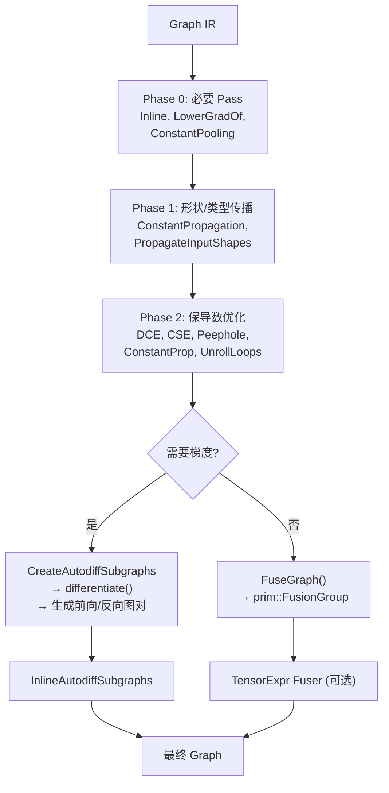

**关键 Pass**：

| Pass | 功能 |
|------|------|
| `Inline()` | 内联函数调用 |
| `ConstantPropagation()` | 对常量输入预计算 |
| `EliminateDeadCode()` | 逆标记-扫描删除死代码 |
| `EliminateCommonSubexpression()` | 公共子表达式消除 |
| `PeepholeOptimize()` | 局部代数重写 |
| `FuseGraph()` | 将可融合算子组成 FusionGroup |
| `CreateAutodiffSubgraphs()` | 将可微算子分组，生成前向/反向图 |

### 8.4 解释器 — 栈机执行

JIT 解释器是一个基于寄存器的栈机：

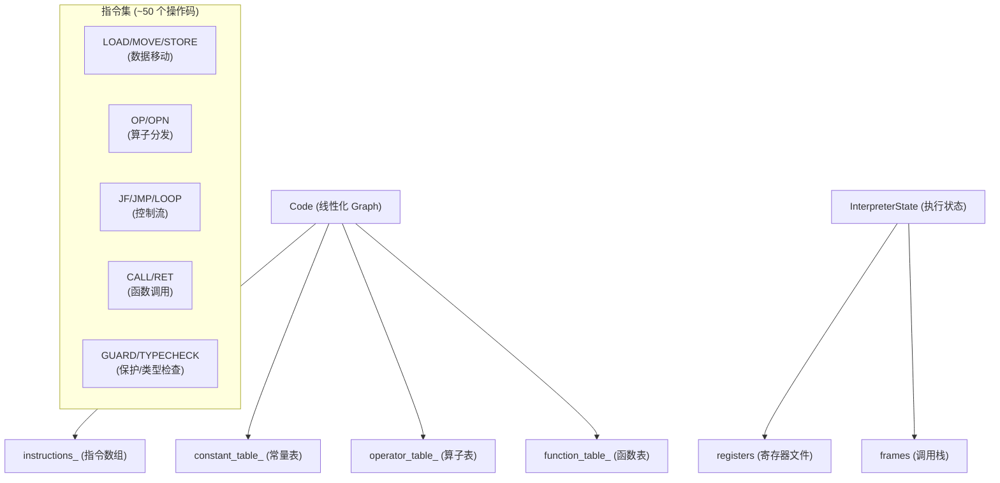

**关键设计**：
- `MOVE` vs `LOAD`：`MOVE` 转移所有权（清空寄存器），用于最后使用时立即释放内存
- 使用 computed gotos (GCC/Clang) 加速分发
- 8 字节指令格式：`OpCode + unused + N + X`

### 8.5 序列化

两种格式：
1. **源码格式**：Graph → Python 风格代码（可读，后向兼容）
2. **字节码格式**：FlatBuffers 序列化的 Code（紧凑，快速加载，适合移动端）

---

## 9. torch.compile 编译系统 (Dynamo + Inductor)

`torch.compile()` 是 PyTorch 2.x 的核心编译功能，由 Dynamo（前端捕获）和 Inductor（后端编译）组成。

### 9.1 端到端编译流程

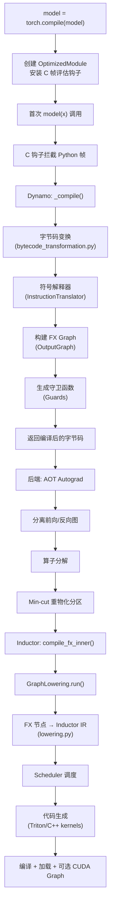

### 9.2 Dynamo — 字节码捕获与变换

#### 符号解释器

Dynamo 的核心是一个 Python 字节码的符号解释器：

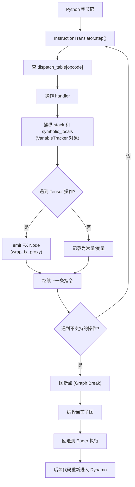

**VariableTracker 层次**：

| 变量类型 | 说明 |
|----------|------|
| `TensorVariable` | torch.Tensor，持有 FX proxy 和元数据 |
| `ConstantVariable` | Python 常量 (int, float, str, None) |
| `NNModuleVariable` | nn.Module 实例 |
| `ListVariable / TupleVariable` | 容器类型 |
| `UserFunctionVariable` | 用户自定义函数 |
| `BuiltinVariable` | Python 内置函数 |
| `LazyVariableTracker` | 延迟创建，直到实际使用 |

#### 守卫系统 (Guards)

Guards 是 Dynamo 判断编译代码是否仍然有效的机制：

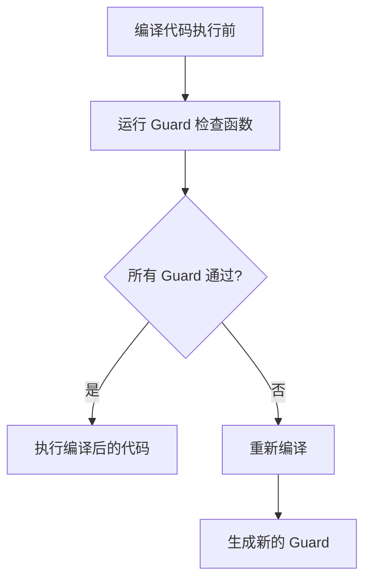

**Guard 类型**：

| 类型 | 检查内容 |
|------|----------|
| TENSOR_MATCH | dtype, device, requires_grad, dispatch key, size, stride |
| TYPE_MATCH | `type(x) is expected_type` |
| ID_MATCH | `id(x) == expected_id` |
| DICT_VERSION | 字典版本号 |
| NN_MODULE | 模块参数是否变化 |

### 9.3 FX Graph — 中间表示

FX 是 Dynamo 和 Inductor 之间的 IR：

**Node 类型**：

| 类型 | 说明 | 示例 |
|------|------|------|
| `placeholder` | 函数输入 | `x` |
| `get_attr` | 模块参数/缓冲区 | `self.weight` |
| `call_function` | 自由函数调用 | `torch.add(x, y)` |
| `call_method` | 方法调用 | `x.sin()` |
| `call_module` | 模块 forward 调用 | `self.linear(x)` |
| `output` | 函数输出 | `return out` |

**GraphModule**：将 FX Graph 编译为 Python 源代码，然后 `exec()` 生成真实的 `forward` 函数。无解释开销。

### 9.4 FakeTensor — 抽象解释

`FakeTensor` 是不含实际数据的张量，仅携带元数据 (shape, dtype, device, stride)。

`FakeTensorMode` 拦截所有张量操作，运行 meta 内核计算输出元数据，返回 FakeTensor。这使 Dynamo/Inductor 能在不分配真实内存的情况下追踪整个模型。

### 9.5 Inductor — 后端编译器

#### IR 层次

```mermaid
flowchart TD
    A["TensorBox<br/>(顶层 IR，表示 torch.Tensor)"] --> B["StorageBox<br/>(引入 Layout 概念)"]
    B --> C["Buffer<br/>(1D 分配 + Layout)"]
    C --> D["ComputedBuffer<br/>(data = 操作)"]
    D --> E["Pointwise<br/>(逐元素操作)"]
    D --> F["Reduction<br/>(归约操作)"]
    B --> G["ExternKernel<br/>(外部 ATen 内核)"]
```

**关键方法**：
- `realize()`：将延迟操作 (Pointwise/Reduction) 转为 ComputedBuffer
- `Buffer.name`：全局唯一的缓冲区名称

#### 调度器 (Scheduler)

```mermaid
flowchart TD
    A["IR 操作列表"] --> B["创建 SchedulerNode"]
    B --> C["计算依赖 (读写关系)"]
    C --> D["拓扑排序"]
    D --> E["死节点消除"]
    E --> F["创建 foreach 节点<br/>(批量张量操作)"]
    F --> G["算子融合<br/>(垂直 + 水平)"]
    G --> H["循环合并"]
    H --> I["内存优化重排"]
    I --> J["生成后端代码"]
```

**融合策略**：
- `can_fuse_vertical()`：生产者-消费者融合（逐元素 → 逐元素）
- `can_fuse_horizontal()`：独立操作融合（共享输入的多个逐元素操作）

#### 代码生成

```mermaid
flowchart TD
    A["Scheduler 输出"] --> B{"目标设备"}
    B -->|"GPU"| C["Triton 代码生成<br/>(codegen/triton.py)"]
    B -->|"CPU"| D["C++ 代码生成<br/>(codegen/cpp.py)"]
    C --> E["Triton Kernel<br/>+ Autotune"]
    D --> F["OpenMP 循环"]
    E --> G["Python Wrapper<br/>(codegen/wrapper.py)"]
    F --> G
    G --> H["编译 + 加载"]
```

**Triton 内核模板**：`kernel/mm.py`（矩阵乘法）、`kernel/conv.py`（卷积）、`kernel/bmm.py`（批量矩阵乘法）等，带有自动调优 (autotune) 配置。

---

## 10. 分布式训练系统

### 10.1 整体架构

```mermaid
flowchart TD
    subgraph "Python API 层"
        A["DDP<br/>(DistributedDataParallel)"]
        B["FSDP<br/>(FullyShardedDataParallel)"]
        C["RPC<br/>(远程过程调用)"]
        D["Pipeline<br/>(流水线并行)"]
        E["Tensor Parallel<br/>(张量并行)"]
    end
    subgraph "通信原语"
        F["ProcessGroup (c10d)"]
        G["NCCL / Gloo / MPI"]
        H["Store (TCPStore)"]
    end
    subgraph "弹性训练"
        I["Elastic Agent"]
        J["Rendezvous"]
    end
    A --> F
    B --> F
    C --> F
    D --> F
    E --> F
    F --> G
    F --> H
    I --> J
```

### 10.2 ProcessGroup — 通信原语

`ProcessGroup` 是所有分布式通信的基础抽象：

**核心集合通信操作**：

| 操作 | 说明 |
|------|------|
| `broadcast` | 一到多，root 广播到所有 rank |
| `allreduce` | 全规约，所有 rank 得到相同结果 |
| `allgather` | 全收集，每个 rank 收到所有 rank 的数据 |
| `reduce_scatter` | 规约后分散，每个 rank 得到一部分 |
| `alltoall` | 个性化全交换 |
| `send / recv` | 点对点通信 |
| `barrier` | 同步屏障 |

**ProcessGroupNCCL** 的关键设计：
- 异步操作模型：所有 NCCL 操作调度到独立 CUDA 流
- 通信器缓存：`devNCCLCommMap_` 按设备键缓存 NCCL 通信器
- Watchdog 线程：监控 NCCL 错误和超时
- `ncclCommSplit`：高效创建子组，无需完整 `ncclCommInit`

### 10.3 DDP (DistributedDataParallel)

```mermaid
flowchart TD
    subgraph "初始化"
        A["收集参数"] --> B["构建 Bucket<br/>(按逆序分组)"]
        B --> C["创建 C++ Reducer"]
        C --> D["注册 autograd hook<br/>到每个参数的梯度累加器"]
    end
    subgraph "前向传播"
        E["broadcast_buffers()<br/>(同步 BatchNorm 等)"]
        E --> F["module.forward()"]
    end
    subgraph "反向传播"
        G["autograd_hook() 触发<br/>(每个梯度计算完成时)"]
        G --> H["将梯度拷入 Bucket 视图"]
        H --> I{"Bucket 内所有梯度就绪?"}
        I -->|"是"| J["触发 all-reduce"]
        I -->|"否"| K["等待其他梯度"]
        J --> L["所有 Bucket 完成"]
        L --> M["将结果拷回 .grad"]
    end
```

**Bucket 机制**：
- 参数按逆序分组为 Bucket（默认 25 MiB/Bucket）
- 逆序是因为反向传播中最后计算的梯度最先就绪
- 每个 Bucket 的所有梯度就绪后才触发 all-reduce
- `gradient_as_bucket_view=True` 时梯度直接指向 Bucket 内存

### 10.4 FSDP (FullyShardedDataParallel)

```mermaid
flowchart TD
    subgraph "分片策略"
        A1["FULL_SHARD (ZeRO-3)<br/>分片参数+梯度+优化器"]
        A2["SHARD_GRAD_OP (ZeRO-2)<br/>分片梯度+优化器"]
        A3["NO_SHARD (DDP-like)<br/>全复制，all-reduce 梯度"]
        A4["HYBRID_SHARD<br/>节点内全分片，节点间复制"]
    end

    subgraph "前向传播 (FULL_SHARD)"
        B["all-gather 分片参数"] --> C["计算 forward"]
        C --> D["释放全参数，保留分片"]
    end

    subgraph "反向传播 (FULL_SHARD)"
        E["all-gather 分片参数"] --> F["计算梯度"]
        F --> G["reduce-scatter 梯度"]
        G --> H["释放全参数和全梯度"]
    end
```

**FlatParameter 设计**：将多个原始参数拼接为单一扁平张量再分片，减少通信次数。

**CUDA 流重叠**：
- `_default_stream`：计算
- `_unshard_stream`：all-gather 操作（高优先级）
- `_post_backward_stream`：梯度 reduce-scatter（高优先级）
- `_pre_unshard_stream`：CPU 卸载和混合精度转换

**BackwardPrefetch**：
- `BACKWARD_PRE`：在当前梯度计算前预取下一组参数（更多重叠，更多内存）
- `BACKWARD_POST`：在当前梯度计算后预取（更少重叠，更少内存）

### 10.5 DTensor 与张量并行

DTensor (Distributed Tensor) 是张量并行的基础设施：

- `DeviceMesh`：N 维设备网格
- `Placement`：`Shard(dim)` 或 `Replicate()`
- `distribute_tensor()`：将张量按 Placement 分片
- `redistribute()`：改变 DTensor 的分布（如 Shard → Replicate 通过 all-gather）

**并行风格**：

| 风格 | 权重分片 | 输入分片 | 输出分片 |
|------|----------|----------|----------|
| ColwiseParallel | dim 0 (列) | Replicated | Shard last dim |
| RowwiseParallel | dim 1 (行) | Shard last dim | Replicated |
| SequenceParallel | 序列维度 | 序列维度 | 序列维度 |

### 10.6 弹性训练

```mermaid
flowchart TD
    A["Elastic Agent<br/>(控制平面)"] --> B["启动 Worker 进程"]
    B --> C["Rendezvous<br/>(对等发现+同步)"]
    C --> D["Worker 训练循环"]
    D --> E{"Worker 故障?"}
    E -->|"是"| F["重新 Rendezvous"]
    F --> G["重启 Worker"]
    E -->|"否"| D
```

---

## 11. 量化系统

PyTorch 量化支持三种模式：

| 模式 | 说明 |
|------|------|
| Eager Mode Quantization | 手动插入量化和反量化 |
| FX Graph Mode Quantization | 自动追踪和量化 (torch.ao.quantization) |
| JIT Quantization | 通过 TorchScript Pass 量化 |

量化算子在 `aten/src/ATen/native/quantized/` 中实现，支持 QInt8, QUInt8, QInt32 等量化类型。

---

## 12. 导出系统 (torch.export)

`torch.export` 将模型导出为独立于 Python 的表示，用于 AOT 编译和跨平台部署：

1. 使用 Dynamo 捕获计算图
2. 应用分解和规范化
3. 生成 `ExportedProgram`，包含 GraphModule + 输入/输出签名
4. 支持动态形状 (SymInt)

---

## 13. 关键设计权衡与哲学

### 13.1 Eager 优先 (Eager-first)

PyTorch 的核心设计哲学是"先跑起来"：每个操作立即执行，不依赖编译。这使得调试和交互式开发极其自然。torch.compile 是可选的加速手段，而非必需。

### 13.2 动态图 vs 静态图

动态图 (Define-by-Run) 使控制流自然，每次前向传播构建新图。代价是难以全局优化。torch.compile 通过 Dynamo 的守卫机制在动态图上实现类似静态图的优化。

### 13.3 分发器的多层设计

Dispatcher 的分层设计（Autograd → Backend）使得自动微分与后端实现完全解耦。Autograd 内核只需构建计算图然后 redispatch 到后端，后端内核无需关心自动微分。

### 13.4 代码生成 vs 手写代码

PyTorch 大量使用代码生成（torchgen）来：
- 避免手写数以千计的算子绑定和注册代码
- 确保声明式定义 (native_functions.yaml) 与实现的一致性
- 自动生成导数函数 (derivatives.yaml)

手写代码保留给需要特殊逻辑的地方（如 convolution 的反向函数）。

### 13.5 FakeTensor 与抽象解释

FakeTensor 使编译时无需分配真实内存，极大地降低了编译开销。代价是需要确保 meta 内核与实际内核的行为一致。

### 13.6 引用计数 vs 垃圾回收

C++ 层使用引用计数 (`intrusive_ptr`) 而非垃圾回收，提供确定性的内存释放。Python 层的 GC 与 C++ 引用计数通过 pybind11 桥接。

### 13.7 性能关键路径的优化

- 分发器热路径：3 步（提取 KeySet → 数组索引 → 调用函数指针）
- JIT 解释器：computed gotos + MOVE 指令立即释放内存
- Autograd 引擎：设备专用线程 + ReadyQueue 优先级调度
- CPU 算子：DispatchStub 运行时选择最优 ISA 实现
- Inductor：自动调优 (autotune) 选择最优 Triton 内核配置

---

## 附录：核心文件索引

| 子系统 | 关键文件 |
|--------|----------|
| **c10 核心** | `c10/core/TensorImpl.h`, `c10/core/StorageImpl.h`, `c10/core/DispatchKey.h`, `c10/core/DispatchKeySet.h`, `c10/util/intrusive_ptr.h` |
| **ATen** | `aten/src/ATen/native/native_functions.yaml`, `aten/src/ATen/core/dispatch/Dispatcher.h`, `aten/src/ATen/core/dispatch/OperatorEntry.h` |
| **Autograd** | `torch/csrc/autograd/engine.cpp`, `torch/csrc/autograd/function.h`, `torch/csrc/autograd/variable.h`, `tools/autograd/derivatives.yaml` |
| **JIT** | `torch/csrc/jit/ir/ir.h`, `torch/csrc/jit/frontend/ir_emitter.cpp`, `torch/csrc/jit/runtime/interpreter.cpp`, `torch/csrc/jit/OVERVIEW.md` |
| **Dynamo** | `torch/_dynamo/convert_frame.py`, `torch/_dynamo/symbolic_convert.py`, `torch/_dynamo/bytecode_transformation.py`, `torch/_dynamo/guards.py` |
| **Inductor** | `torch/_inductor/compile_fx.py`, `torch/_inductor/lowering.py`, `torch/_inductor/ir.py`, `torch/_inductor/scheduler.py` |
| **FX** | `torch/fx/graph.py`, `torch/fx/node.py`, `torch/fx/_symbolic_trace.py`, `torch/fx/graph_module.py` |
| **nn** | `torch/nn/modules/module.py`, `torch/nn/parameter.py`, `torch/nn/functional.py` |
| **分布式** | `torch/distributed/distributed_c10d.py`, `torch/nn/parallel/distributed.py`, `torch/distributed/fsdp/fully_sharded_data_parallel.py` |
| **代码生成** | `torchgen/gen.py`, `torchgen/model.py`, `tools/autograd/templates/` |
