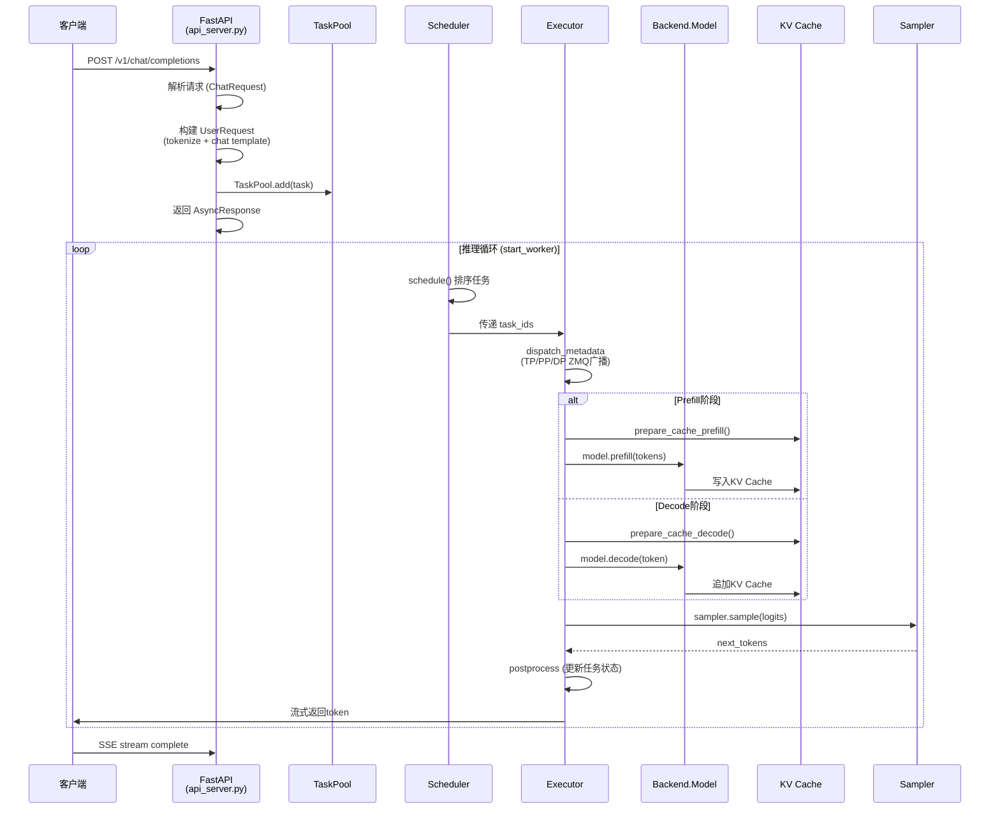
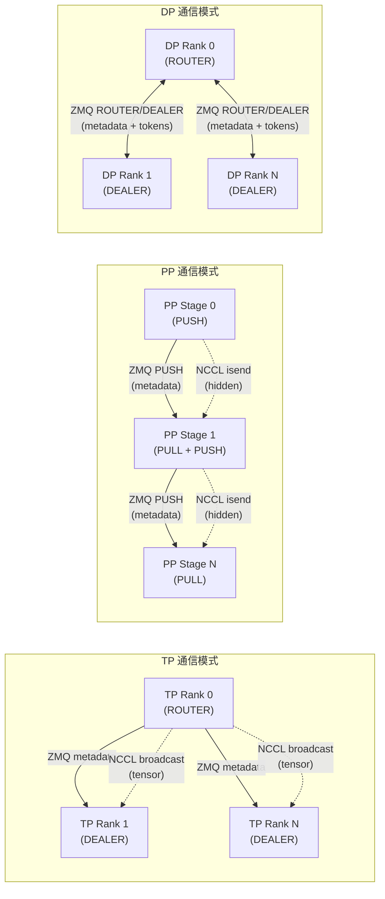
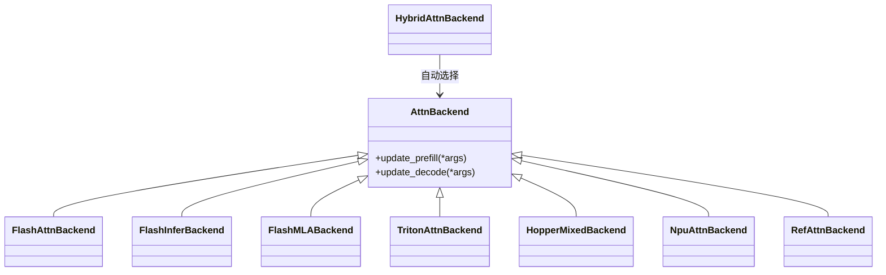
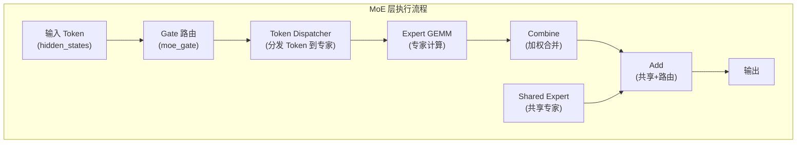
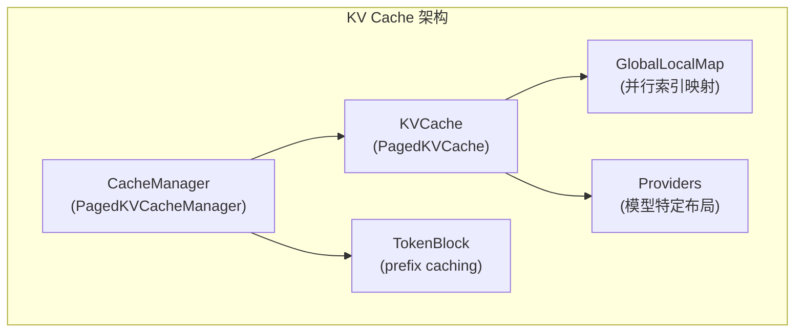
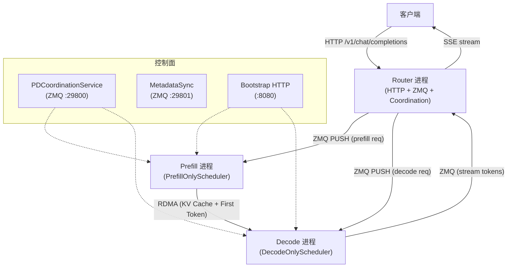

# 赤兔（Chitu）高性能大模型推理框架 —— 代码架构深度分析

> 基于代码仓库 `/root/workspace/chitu` 的详尽分析
> 分析时间：2026-04-10

---

## 目录

1. [项目概述](#1-项目概述)
2. [整体架构总览](#2-整体架构总览)
3. [请求处理全流程](#3-请求处理全流程)
4. [Serving 层（HTTP API 与服务管理）](#4-serving-层http-api-与服务管理)
5. [调度系统（Scheduler）](#5-调度系统scheduler)
6. [执行器（Executor）与并行通信](#6-执行器executor与并行通信)
7. [模型层（Models）](#7-模型层models)
8. [注意力机制后端（Attention Backend）](#8-注意力机制后端attention-backend)
9. [MoE（混合专家）系统](#9-moe混合专家系统)
10. [KV Cache 系统](#10-kv-cache-系统)
11. [量化系统（Quantization）](#11-量化系统quantization)
12. [算子层（Operations）](#12-算子层operations)
13. [分布式系统](#13-分布式系统)
14. [PD 分离架构（Prefill-Decode Disaggregation）](#14-pd-分离架构prefill-decode-disaggregation)
15. [Sampling 采样器](#15-sampling-采样器)
16. [Tool Call 工具调用](#16-tool-call-工具调用)
17. [CPU 推理（cpuinfer）](#17-cpu-推理cpuinfer)
18. [权重布局（Native Layout）](#18-权重布局native-layout)
19. [监控指标（Metrics）](#19-监控指标metrics)
20. [硬件适配策略](#20-硬件适配策略)
21. [第三方库依赖与原理](#21-第三方库依赖与原理)

---

## 1. 项目概述

**赤兔（Chitu）** 是由清华大学 PACMAN 团队开发的开源高性能大语言模型推理框架，专注于：

- **多元算力适配**：NVIDIA GPU（Ampere/Hopper/Blackwell）、华为昇腾 NPU、沐曦 Metax GPU、海光 Hygon DCU、摩尔线程 GPU
- **全场景可伸缩**：从纯 CPU 部署、单 GPU 到大规模集群
- **生产级稳定性**：支持高并发业务流量长时间运行

**支持的模型系列**：DeepSeek（V3/R1/V3.1/V3.2）、Qwen（2.5/3/3.5/Coder）、GLM（4/4.5/4.6/4.7/5/Z1）、Llama（3/3.3）、Mixtral、Kimi K2.5、GPT-OSS 等

**核心特性**：
- FP8/FP4/INT8 在线量化与高效推理
- MoE（混合专家）专家并行与负载均衡
- MLA（Multi-head Latent Attention）注意力吸收优化
- CUDA Graph 加速 Decode 阶段
- Prefill-Decode 分离部署
- CPU+GPU 异构混合推理（单卡跑 671B）
- Pipeline Parallelism + Tensor Parallelism + Data Parallelism + Expert Parallelism

---

## 2. 整体架构总览

```
┌─────────────────────────────────────────────────────────────┐
│                    客户端 (HTTP / SSE)                        │
└───────────────────────────┬─────────────────────────────────┘
                            │
                   ┌────────▼────────┐
                   │  FastAPI (Uvicorn)│  ← api_server.py
                   │  /v1/chat/completions  /v1/messages       │
                   │  /v1/responses  /tokenize  /detokenize    │
                   └────────┬────────┘
                            │
              ┌─────────────▼──────────────┐
              │      TaskPool (任务池)       │ ← task.py
              │  submit_request() → Task    │
              └─────────────┬──────────────┘
                            │
           ┌────────────────▼────────────────┐
           │    Scheduler (调度器)            │ ← scheduler.py
           │  FCFS / PrefillFirst / Stride   │
           │  / Deadline / PrefixAlign       │
           └────────────────┬────────────────┘
                            │ task_ids
              ┌─────────────▼──────────────┐
              │    Executor (执行器)        │ ← executor.py
              │  ┌ TP Dispatcher (ZMQ)     │ ← Tensor Parallel
              │  ├ PP Dispatcher (ZMQ)     │ ← Pipeline Parallel
              │  └ DP Dispatcher (ZMQ)     │ ← Data Parallel
              └─────────────┬──────────────┘
                            │
           ┌────────────────▼────────────────┐
           │     Backend (推理后端)            │ ← backend.py
           │  ┌ Model (模型前向)              │ ← models/
           │  │  ├ EmbedTokens               │
           │  │  ├ TransformerLayers          │
           │  │  │  ├ RMSNorm                 │
           │  │  │  ├ Attention (AttnBackend) │ ← attn_backend/
           │  │  │  │  ├ FlashMLA             │
           │  │  │  │  ├ FlashAttention       │
           │  │  │  │  ├ FlashInfer           │
           │  │  │  │  ├ Triton               │
           │  │  │  │  ├ HopperMixed          │
           │  │  │  │  └ NPU                  │
           │  │  │  ├ MoE / MLP               │ ← moe/
           │  │  │  │  ├ Gate (路由)           │
           │  │  │  │  ├ TokenDispatcher      │
           │  │  │  │  ├ Experts (GEMM)       │
           │  │  │  │  └ LoadBalancer         │
           │  │  │  └ RMSNorm                 │
           │  │  ├ LM Head                    │
           │  │  └ MTP (Multi-Token Pred)     │
           │  ├ KV Cache (PagedKVCache)       │ ← kv_cache/
           │  ├ Quantization (FP8/FP4/...)    │ ← quantization/
           │  ├ Sampler (采样)                │ ← sampling/
           │  └ CUDA Kernels                  │ ← csrc/cuda/
           └─────────────────────────────────┘
```

---

## 3. 请求处理全流程



### 关键入口

- **启动入口**：`chitu/serve/main.py` → 使用 Hydra 框架解析配置，调用 `chitu_init()` → `warmup_engine()` → 启动 Uvicorn + Worker 循环
- **Worker 循环**：`start_worker()` → 循环调用 `chitu_run()`，每次循环完成一次 schedule → execute → update 周期
- **初始化流程**（`chitu_init`）：
  1. 参数解析与自动配置（`auto` 参数处理）
  2. 分布式环境初始化（`Backend._init_distributed`）
  3. 模型构建、权重加载、量化配置（`Backend.build`）
  4. KV Cache 分配
  5. Warmup 预热（模拟 prefill + decode 以触发 CUDA Graph 捕获和内存自动规划）

---

## 4. Serving 层（HTTP API 与服务管理）

### 4.1 API Server（`chitu/serve/api_server.py`）

基于 **FastAPI** + **Uvicorn** 的 HTTP 服务层，提供兼容 OpenAI 的 API 接口：

| 端点 | 功能 |
|------|------|
| `POST /v1/chat/completions` | 主要推理端点，支持流式/非流式 |
| `POST /v1/completions` | 补全接口 |
| `GET /v1/models` | 列出可用模型 |
| `POST /tokenize` | 文本→token |
| `POST /detokenize` | token→文本 |
| `POST /init` | 延迟初始化 |
| `POST /terminate_engine` | 优雅终止 |
| `POST /status`, `/ping`, `/health` | 健康检查 |
| `POST /profile/start`, `/stop` | 性能分析 |

**请求模型**（`ChatRequest`）：
- 支持 `messages`、`tools`、`tool_choice`、`stream`、`temperature`、`top_p`、`top_k`、`frequency_penalty`、`max_tokens` 等参数
- 支持 `enable_thinking`（思考模式/reasoning）
- 兼容 OpenAI 的 `stream_options.include_usage`

**过载保护**：中间件 `reject_overload` 检查当前在途请求数，超过 `max_concurrent_requests` 时返回 503。

**DP 模式**：当 `dp_config.enabled=True` 时，请求经过 Router → Enhanced Scheduler 分发，使用 ZMQ 进行跨进程通信。

### 4.2 Anthropic API（`chitu/serve/anthropic_api.py`）

兼容 Anthropic Messages API 的路由，支持 `/v1/messages` 端点。

### 4.3 Responses API（`chitu/serve/responses_api.py`）

兼容 OpenAI Responses API 的路由，支持 `/v1/responses` 端点。

### 4.4 事件循环（`chitu/serve/event_loop.py`）

使用 **uvloop** 替代标准 asyncio 事件循环，提供更高性能的异步 I/O。

### 4.5 通用工具（`chitu/serve/common.py`）

- `submit_request(user_req)` → 创建 Task 并加入 TaskPool，返回 AsyncResponse
- `start_worker()` → Rank 0 的主推理循环，不断调用 `chitu_run()`
- Profile 管理、OOM Hook、内存快照等

---

## 5. 调度系统（Scheduler）

### 5.1 调度器核心（`chitu/scheduler.py`）

调度器负责从 TaskPool 中选择合适的任务提交给执行器。

**调度算法**（可组合使用，逗号分隔）：

| 算法 | 说明 |
|------|------|
| `fcfs` / `fifo` | 先来先服务，按到达时间排序 |
| `prefill_first` | Prefill 任务优先于 Decode |
| `request_preset` | 按请求预设优先级排序 |
| `stride` | 加权时间片轮转，P * elapsed_time |
| `deadline` | 按截止时间 DDL 排序 |
| `prefix_align` | 按输入长度相似度聚合，提升前缀缓存命中 |

**PD 分离模式**：
- `prefill_only` → 只调度 Prefill 任务（映射为 `prefill_first`）
- `decode_only` → 只调度 Decode 任务（映射为 `fcfs`）

**调度流程**：

1. `schedule()` 被调用 → 切换到下一个 scheduler group
2. 收集可调度任务（`can_schedule()` 检查）
3. 按 scorer 函数排序
4. 根据最高优先级任务类型（Prefill 或 Decode）分支调度
5. Prefill：受 `prefill_chunk_size` 和 KV Cache 可用块数约束
6. Decode：受 `decode_num_tasks` 约束，必要时逐出低优先级任务
7. 分配 scheduler group 并返回 task_ids

**KV Cache 拥塞控制**：
- 调度时检查可用 KV Cache 块数
- 不足时触发任务逐出（evict），被逐出任务重置为 Prefill 状态
- 拥塞窗口 `kvcache_block_threshold` 减半以防止持续拥塞

### 5.2 SkewScheduler

用于 PP > 1 的场景，采用固定 slot 分配策略，每个 PP stage slot 有独立的任务容量。

### 5.3 SchedulerGroupList

管理 PP 场景下的调度组轮转，每个 scheduler group 对应一个 PP slot。

---

## 6. 执行器（Executor）与并行通信

### 6.1 Executor（`chitu/executor.py`）

执行器是推理引擎的核心驱动，负责：

1. **任务分发**：通过 ZMQ 将任务元数据广播到所有参与的 rank
2. **模型执行**：调用 `Backend.model.prefill()` 或 `Backend.model.decode()`
3. **采样**：调用 `Sampler.sample()` 生成下一个 token
4. **后处理**：同步采样结果，更新任务状态，发送 token 给客户端

**关键方法**：
- `step(tasks)` → 一次完整的推理步骤
- `prefill_step(tasks)` → Prefill 阶段执行
- `decode_step(tasks)` → Decode 阶段执行
- `postprocess_sync_part()` → GPU→CPU 同步采样结果
- `postprocess_async_part()` → 异步更新任务 token 列表

**CUDA Graph 集成**：Decode 阶段使用 CUDA Graph 捕获和重放固定的 GPU 操作序列，避免 kernel launch overhead。

**MTP（Multi-Token Prediction）支持**：当 `mtp_size > 1` 时，一次 Decode 步骤可生成多个 token，提升吞吐。

### 6.2 TasksDispatcher（并行通信抽象）

基类 `TasksDispatcher` 定义了 `dispatch_metadata`、`recv_payload`、`send_payload` 三个抽象方法。

**通信协议**：使用 **ZMQ**（ZeroMQ）进行 rank 间通信，支持：
- **IPC**（`ipc://`）：同节点使用 Unix 域套接字，零拷贝高性能
- **TCP**（`tcp://`）：跨节点通信

#### 6.2.1 TensorDispatcher（TP）

- 使用 **ROUTER/DEALER** 模式
- TP 主 rank（rank 0）作为 ROUTER bind，其他 rank 作为 DEALER connect
- metadata 通过 msgpack 序列化后 ZMQ 传输
- tensor 数据通过 `torch.distributed.broadcast` 同步

#### 6.2.2 PipeDispatcher（PP）

- 使用 **PUSH/PULL** 模式（点对点单向传输）
- Stage N PUSH bind → Stage N+1 PULL connect
- 隐藏状态（hidden states）通过 `torch.distributed.isend/recv` 传输
- 采样结果（generated_result）也通过 NCCL 传输回第一个 stage

#### 6.2.3 ExpertDataDispatcher（DP）

- 使用 **ROUTER/DEALER** 模式
- DP 主 rank 收集所有 rank 的采样结果（token list），合并后分发给各 rank
- 支持 MTP token 列表和 PD 首 token 传输



---

## 7. 模型层（Models）

### 7.1 模型基类（`chitu/models/model.py`）

`Model` 是所有模型实现的基类，核心职责：

**关键组件**：
- `RMSNorm`：Root Mean Square Layer Normalization，使用自定义 CUDA/Triton 实现
- `LayerNorm`：标准 Layer Normalization
- `VocabParallelEmbedding`：词表并行 Embedding
- `ColumnParallelLinear` / `RowParallelLinear`：TP 切分的线性层
- `Attention`：注意力机制实现（委托给 AttnBackend）
- `MoELayer` / `MLP`：FFN 层，MoE 或标准 MLP

**前向执行**：
- `prefill(tokens, output_token_offsets)` → 处理完整 prompt，返回 logits
- `decode(tokens, batch_size)` → 逐 token 生成

**模型并行处理**：
- 按 `local_begin_layer_id` / `local_end_layer_id` 确定本 rank 负责的层范围（PP）
- 权重按 TP/EP 切分加载
- 支持 `mla_absorb` 模式（MLA 吸收 KV 投影矩阵到 Q 中，减少 KV Cache 大小）

### 7.2 模型注册表（`chitu/models/registry.py`）

使用 `ModelType` 枚举注册不同模型类型：

| ModelType | 对应模型 |
|-----------|---------|
| `DEEPSEEK_V3` | DeepSeek V3/R1/V3.1/V3.2 |
| `KIMI_K2_5` | Kimi K2.5 |
| `HF_LLAMA` | Llama 3/3.3 |
| `HF_QWEN_3_MOE` | Qwen3 MoE 系列 |
| `HF_QWEN3_VL` / `HF_QWEN3_VL_MOE` | Qwen3 视觉语言模型 |
| `HF_QWEN3_NEXT` | Qwen3-Next |
| `HF_QWEN3_5` | Qwen3.5 系列 |
| `HF_QWEN2_VL` | Qwen2-VL |
| `HF_GLM_4_MOE` | GLM-4.5 MoE |
| `HF_GLM_Z1` | GLM-Z1 |
| `HF_GPT_OSS` | GPT-OSS |
| `HF_MIXTRAL` | Mixtral 8x7B |
| `LLAMA` | 原始 Llama（.pth 格式） |

### 7.3 模型实现

每个模型实现文件定义了特定模型的 Transformer 层和前向计算逻辑：

- **`model_deepseek_v3.py`**：DeepSeek V3 架构，包含 MLA 注意力、MoE（256 路路由专家 + 共享专家）、aux-loss-free 负载均衡
- **`model_hf_qwen_3_moe.py`**：Qwen3 MoE，含 group routing 和 shared experts
- **`model_hf_qwen3_5.py`**：Qwen3.5 架构，支持 MTP 和 MoE
- **`model_hf_llama.py`**：标准 Llama 架构（GQA + SwiGLU MLP）
- **`model_kimi_k25.py`**：Kimi K2.5，MLA 注意力 + MoE
- **`model_hf_glm_4_moe.py`**：GLM-4.5 MoE，特殊 interleaved rotary embedding

---

## 8. 注意力机制后端（Attention Backend）

### 8.1 架构设计（`chitu/attn_backend/`）

注意力后端采用抽象基类 + 多实现的策略，运行时根据模型和硬件自动选择：



### 8.2 各后端详解

| 后端 | 适用场景 | 底层库 |
|------|---------|--------|
| **FlashMLABackend** | DeepSeek V3 / Kimi K2.5（MLA 架构） | FlashMLA |
| **FlashAttnBackend** | 通用注意力 | FlashAttention 2/3 |
| **FlashInferBackend** | 通用 PagedKV 注意力 | FlashInfer |
| **TritonAttnBackend** | 无 CUDA 库时的 fallback | Triton |
| **HopperMixedBackend** | NVIDIA Hopper (H100/H200) + FP8 KV | 自定义 Triton + CUTLASS |
| **HybridAttnBackend** | 自动混合策略 | 根据场景组合以上后端 |
| **NpuAttnBackend** | 华为昇腾 NPU | torch_npu + 自定义算子 |
| **RefAttnBackend** | CPU 推理 / 调试 | PyTorch 原生 |

**MLA（Multi-head Latent Attention）吸收模式**：
- `absorb`：将 KV 的低秩投影吸收到 Q 的计算中
- `absorb-without-precomp`：不预计算吸收矩阵，在推理时动态计算（DeepSeek V3 默认）
- 通过减少 KV Cache 的维度（从 `num_heads * head_dim` 降到 `kv_lora_rank`），大幅降低显存占用

---

## 9. MoE（混合专家）系统

### 9.1 整体架构（`chitu/moe/`）



### 9.2 MoE 实现（`chitu/moe/impl.py`）

两种实现：

- **`MoEImplNoEP`**：无专家并行（EP=1），所有专家在同一 rank 上计算
- **`MoEImplEP`**：有专家并行（EP>1），专家分布在多个 rank 上，需要 Token Dispatcher 进行跨 rank 的 token 路由

### 9.3 Token Dispatcher（`chitu/moe/token_dispatchers/`）

Token Dispatcher 负责 token 的跨 rank 分发和结果收集：

| Dispatcher | 说明 |
|-----------|------|
| `MoEAllGatherTokenDispatcher` | AllGather 方式，所有 rank 持有全部 token 的副本 |
| `MoENormalTokenDispatcher` | 基于 DeepEP 的标准 AlltoAll，低通场景 |
| `MoELowLatencyTokenDispatcher` | 基于 DeepEP 的低延迟 AlltoAll，高通场景 |
| `MoENpuAllToAllTokenDispatcher` | 昇腾 NPU 上的 AlltoAll 实现 |
| `MoENpuDistributeTokenDispatcher` | 昇腾 NPU 上的分布式分发 |
| `BufferController` | 管理 token 缓冲区分配 |

**DeepEP** 是深度Seek 开发的高性能 AlltoAll 通信库，支持 NVLink 和 IB 的高效 token 路由。

### 9.4 Expert 计算（`chitu/moe/experts/`）

| 实现 | 说明 |
|------|------|
| `deepgemm_contiguous` | 使用 DeepGEMM 的连续内存 GEMM（FP8） |
| `deepgemm_masked` | 使用 DeepGEMM 的 masked GEMM（FP8，支持变长） |
| `triton_batched_experts` | Triton 实现的批量专家 GEMM |
| `triton_fused_experts` | Triton 实现的融合专家 GEMM |

### 9.5 Load Balancer（`chitu/moe/load_balancer/`）

MoE 负载均衡器动态调整专家在 EP rank 间的分布，解决专家负载不均问题：

- **`MoESlotCntLoadBalancer`**：基于 slot 计数的负载均衡器
- **`DynamicPlannerImpl`**：动态规划器，根据专家负载统计生成分配方案
- **`LargeScaleBalancer`**：大规模集群的负载均衡器
- **`Executor`**：负载均衡执行器，负责专家权重的跨 rank 迁移

工作原理：
1. 统计每个专家在每个 rank 上的 token 数量（`expert_stats`）
2. 定期（`moe_lb_trigger` 间隔）触发规划
3. 规划器生成专家迁移计划
4. 执行器通过 `ExpertParamAccessor` 迁移专家权重

---

## 10. KV Cache 系统

### 10.1 架构（`chitu/kv_cache/`）



### 10.2 KV Cache 类型

| 类型 | 说明 |
|------|------|
| **PagedKVCache** | 分页 KV Cache，类似 vLLM 的 PagedAttention |
| **DenseKVCache** | 密集 KV Cache（固定 slot 分配，用于 PP skew 模式） |
| **SingletonPagedKVCache** | 单例分页 Cache |
| **MMPagedKVCache** | 多模态分页 Cache |

### 10.3 分页管理（PagedKVCacheManager）

核心概念：
- **Block（块）**：KV Cache 按固定大小的块（默认 512 tokens）分配
- **Page Table（页表）**：每个请求维护一个页表，映射逻辑块到物理块
- **TokenBlock**：前缀缓存的基本单元，通过哈希值去重

**块分配策略**：
1. 优先从 `free_cache_ids`（空闲块池）分配
2. 空闲池空时从 `cached_idle_blocks`（LRU 空闲块）回收
3. 前缀缓存启用时，相同前缀的块可复用

**生命周期**：
- `prepare_metadata_before_prefill()` → 分配块，准备 prefill 元数据
- `prepare_cache_prefill()` → 写入 prefill KV 数据
- `prepare_metadata_before_decode()` → 准备 decode 元数据
- `prepare_cache_decode()` → 写入 decode KV 数据
- `finalize_metadata_all_decode()` → 释放已完成任务的块

### 10.4 前缀缓存（Prefix Caching）

通过 TokenBlock 的哈希值实现：
- 对每个满容量的 block 计算哈希
- 新请求匹配已有 block 时直接复用，跳过 prefill 计算
- 使用 `WeakValueDictionary` 管理，引用计数为零时自动释放

### 10.5 KV Cache Provider（`chitu/kv_cache/providers/`）

不同模型的 KV Cache 布局不同：

| Provider | 模型 | 布局说明 |
|----------|------|---------|
| `default` | 通用 | 标准 K/V 分离布局 |
| `deepseek_v3` | DeepSeek V3 | MLA 布局：kv_a + k_pe 分离 |
| `qwen` | Qwen 系列 | 标准布局 + 可选 FP8 KV 量化 |

### 10.6 自动 KV Cache 容量规划

`_auto_set_num_blocks_after_warmup()` 在 warmup 后自动调整：
1. 统计每个 block 的内存开销
2. 计算可用 GPU 显存
3. 联合求解 main cache 和 indexer cache 的最优分配
4. 跨 rank 同步，取最小值确保所有 rank 一致

---

## 11. 量化系统（Quantization）

### 11.1 量化注册表（`chitu/quantization/`）

通过 `QuantizationRegistry` 管理所有量化方案的注册和查找。

### 11.2 支持的量化方案

| 方案 | 说明 | 适用场景 |
|------|------|---------|
| **BlockFP8** | FP8 块量化（128 block size），E4M3 格式 | NVIDIA Hopper+，最高性能 |
| **BlockFP4** | FP4 块量化（NVIDIA NVFP4 格式） | 极致显存节省 |
| **Marlin** | INT4 Marlin 格式（GPTQ 兼容） | NVIDIA Ampere+，低显存 |
| **AutoAWQ** | AWQ 量化格式 | 通用 GPU |
| **GPTQModel** | GPTQ 量化格式 | 通用 GPU |
| **BlockInt4** | INT4 块量化 | 昇腾 NPU |
| **SimpleW8A8** | W8A8 对称量化 | 通用 |
| **SimpleW8A8Muxi** | W8A8 沐曦专用 | 沐曦 GPU |
| **AscendW8A8** | W8A8 昇腾专用 | 昇腾 NPU |
| **MixQ** | 混合量化（不同层不同精度） | 灵活配置 |
| **Q4KM** | Q4_K_M 量化（GGUF 格式） | CPU 混合推理 |
| **W4A8 Per Token Per Channel** | W4 权重 + A8 激活，per-token/channel | 特定量化模型 |
| **W4A8 Per Token Per Group** | W4 权重 + A8 激活，per-token/group | 特定量化模型 |
| **W4 G128 Symm A8** | W4 权重（G128 对称）+ A8 激活 | QServe 格式 |

### 11.3 FP8 量化原理

BlockFP8 采用 128 元素为一块的量化策略：
- 对每个 128×128 块计算最大绝对值
- 缩放因子 = max_abs / 448（E4M3 最大值）
- 权重和激活分别量化为 FP8 E4M3FN
- 矩阵乘法使用 DeepGEMM 或 Triton 实现

### 11.4 在线量化

支持从 BF16 权重在线转换为 FP8/FP4：
- FP8：在 checkpoint 加载时即时转换（`quant_fp8()` 函数）
- FP4：使用 NVIDIA NVFP4 量化核（`csrc/cuda/hard_fp4/`）

---

## 12. 算子层（Operations）

### 12.1 算子组织（`chitu/ops/`）

| 算子 | 文件 | 说明 |
|------|------|------|
| `rms_norm` | `norm.py` | RMS Normalization |
| `rotary` | `rotary.py` | 旋转位置编码（RoPE） |
| `moe_gate` | `moe_gate.py` | MoE 门控（Top-K 路由） |
| `moe_sum` | `moe_sum.py` | MoE 专家输出加权求和 |
| `add_shared_experts` | `add_shared_experts.py` | 共享专家结果叠加 |
| `sampling` | `sampling.py` | Top-K/Top-P 采样 |
| `kv_cache` | `kv_cache.py` | KV Cache 读写操作 |
| `causal_conv` | `causal_conv.py` | 因果卷积（视觉模型） |
| `fused_g` | `fused_g.py` | 融合 SwiGLU 门控 |
| `norm_gate` | `norm_gate.py` | 融合 Norm + Gate |
| `hadamard` | `hadamard.py` | Hadamard 变换（量化前处理） |
| `mla_prologue` | `mla_prologue.py` | MLA 吸收的预计算 |
| `linear_attn` | `linear_attn.py` | 线性注意力 |
| `activation` | `activation.py` | 激活函数（SiLU、GeLU） |
| `topk` | `topk.py` | Top-K 选择 |

### 12.2 Triton 算子（`chitu/ops/triton_ops/`）

使用 OpenAI Triton 编写的 GPU kernel，作为 CUDA 的替代方案：

- **注意力**：`attn/prefill.py`（prefill）、`attn/decode.py`（decode）、`attn/mla_decode.py`（MLA decode）
- **量化 GEMM**：`quant/blockfp8/matmul.py`（FP8 矩阵乘）、`quant_gemm.py`
- **Norm**：`norm.py`、`norm_gate.py`
- **RoPE**：`rotary.py`
- **采样**：`sampling.py`
- **MoE**：`moe_sum.py`、`batched_routed_activation.py`

### 12.3 CUDA 算子（`csrc/cuda/`）

使用 CUDA C++ 编写的高性能 kernel：

| 模块 | 功能 |
|------|------|
| `norm/rms_norm.cu` | RMS Normalization |
| `rotary/rotary_pos_emb_llama.cu` | RoPE 位置编码 |
| `moe/group_topk.cu` | MoE Group Top-K |
| `moe/moe_align_kernel.cu` | MoE 对齐 |
| `moe/vllm_topk_softmax.cu` | Top-K Softmax |
| `moe/fused_shared_experts_kernel.cu` | 融合共享专家 |
| `marlin/` | Marlin INT4 GEMM（来自 vLLM/TensorRT-LLM） |
| `dequant/dequant.cu` | 反量化 |
| `allreduce/` | 自定义 AllReduce（基于 vLLM） |
| `gemm/w4a8_per_group_gemm_cuda.cu` | W4A8 GEMM |
| `hard_fp4/` | NVIDIA NVFP4 量化与 GEMM |
| `response_append/response_append.cu` | 响应拼接 |
| `frequency_penalty/frequency_penalty.cu` | 频率惩罚 |
| `topk/topk.cu` | Top-K 选择 |
| `weight_layout/weight_layout_change.cu` | 权重布局转换 |

---

## 13. 分布式系统

### 13.1 并行状态管理（`chitu/distributed/parallel_state.py`）

维护全局并行组的状态：

```python
# 4D 并行关系
world_size = TP × DP × PP
# 其中 expert_tensor_parallel_size = TP × DP / EP
# 即 EP 从 TP×DP 的总 rank 中划分
```

| 并行组 | 说明 |
|--------|------|
| `_WORLD_GROUP` | 全局通信组 |
| `_TP_GROUP` | Tensor Parallelism 组 |
| `_DP_GROUP` | Data Parallelism 组 |
| `_ETP_GROUP` | Expert Tensor Parallelism 组 |
| `_EP_GROUP` | Expert Parallelism 组 |
| `_PP_GROUP` | Pipeline Parallelism 组 |
| `_EMBED_TOKENS_LM_HEAD_TP_GROUP` | Embedding/LM Head 的专用 TP 组 |

### 13.2 通信组（`chitu/distributed/comm_group.py`）

`CommGroup` 封装了 `torch.distributed` 的 ProcessGroup，提供：
- `barrier()`：同步屏障
- `broadcast()` / `all_reduce()` / `all_gather()`：集合通信
- `is_first_rank` / `rank_in_group`：rank 信息查询

### 13.3 自定义 AllReduce（`chitu/distributed/custom_ar_chitu.py`）

针对 NVIDIA GPU 的自定义 AllReduce 实现：
- 基于 vLLM 的 custom allreduce
- 利用 NVLink 的高带宽特性
- 支持 P2P 通信的直接内存访问

### 13.4 分区策略（`chitu/distributed/partition.py`）

- `compute_layer_dist_in_pp()`：计算 PP 模式下每个 rank 负责的层范围
- `compute_local_batch_size_dist_in_dp()`：计算 DP 模式下每个 rank 的批大小

### 13.5 TCP/IP 工具（`chitu/distributed/tcp_ip.py`）

提供节点间 IP:Port 发现和动态端口分配功能。

---

## 14. PD 分离架构（Prefill-Decode Disaggregation）

### 14.1 架构总览

PD 分离将 Prefill（预填充）和 Decode（解码）部署在不同进程/节点上，通过 RDMA 传输 KV Cache。



### 14.2 请求生命周期

1. **Router 分发**：同时将请求发送给 Prefill 和 Decode
2. **Decode 准备**：向 Prefill 注册显存指针，发送目标页索引（TRANSFER_INFO）
3. **Prefill 计算**：执行 prefill，产出 KV Cache + 首 token
4. **RDMA 传输**：通过 Mooncake Transfer Engine 进行 Device-to-Device 直传
5. **Decode 执行**：接收 KV Cache 后开始 decode 循环
6. **Token 回传**：Decode 生成的 token 通过 ZMQ 回传 Router

### 14.3 KV Manager（`kv_transfer/kv_manager.py`）

KV 传输的核心管理器：

- **Prefill 模式**：
  - control rank（pp=0, tp=0）对外暴露 ZMQ 端口
  - 接收 Decode 的 DECODE_REGISTER 和 TRANSFER_INFO
  - 通过 PUB/SUB 广播给所有 PP/TP ranks
  - 后台传输线程执行 RDMA 写入
  - 所有 rank 完成后汇总发送 KVPoll.Success

- **Decode 模式**：
  - 后台线程发现 Prefill engine_rank
  - 向目标 Prefill 发送 DECODE_REGISTER（显存指针注册）
  - per-request 发送 TRANSFER_INFO（页索引）
  - 轮询 request_status 等待 KVPoll.Success

### 14.4 Mooncake Transfer Engine（`kv_transfer/mooncake/`）

Mooncake 是基于 RDMA 的高性能数据传输引擎：
- **TransferEngine**：封装 Mooncake 的 RDMA 传输能力
- **MetadataBuffers**：管理 aux buffer（用于传输首 token）
- **BootstrapServer**：轻量 HTTP 服务，提供 endpoint 注册和发现

**RDMA 传输流程**：
1. Decode 通过 Bootstrap 发现 Prefill 的 endpoint
2. Decode 注册本地显存指针到 Prefill
3. Prefill 通过 `register_buffer_to_engine()` 注册源端 buffer
4. 调用 `transfer_batch()` 执行 RDMA 写入
5. 按层并行传输，支持连续块聚合减少 RDMA 调用

### 14.5 PDCoordinationService（`pd_coordination.py`）

运行在 Router 进程中的协调服务：
- `coordination_socket`（ZMQ PULL :29800）：接收 P/D 的协调消息
- `metadata_socket`（ZMQ REP :29801）：endpoint 注册/查询

### 14.6 PD Scheduler（`pd_scheduler.py`）

继承自 `Scheduler`：

**PrefillOnlyScheduler 队列模型**：
```
请求到达 → _prefill_incoming_q → _prefill_bootstrap_q → _prefill_ready_q → TaskPool → 执行
                                   (等待 TRANSFER_INFO)    (可调度)
```

**DecodeOnlyScheduler 队列模型**：
```
请求到达 → _decode_incoming_q → _decode_prealloc_q → _decode_ready_q → TaskPool → 执行
             (发送 PREPARE)      (等待 KVPoll.Success)   (可调度)
```

---

## 15. Sampling 采样器

### 15.1 Sampler（`chitu/sampling/sampler.py`）

采样器负责从模型输出的 logits 中生成下一个 token。

**采样流程**：

1. **同步上一步 token**：`_sync_tokens()` → GPU→CPU 异步同步
2. **更新 Grammar 状态**：`_apply_grammars()` → 使用 xgrammar 的 GrammarMatcher
3. **更新频率惩罚**：`_apply_frequency_penalty()` → 基于 CUDA kernel
4. **采样 token**：`_sample_tokens()` → Top-K/Top-P/温度采样
5. **记录 token**：`_store_tokens()` → 异步 GPU→CPU 拷贝

**特性**：
- **Grammar 约束**：使用 xgrammar 实现结构化输出（JSON、正则等）
- **频率惩罚**：基于 CUDA kernel 的高效实现
- **Top-K/Top-P 采样**：使用自定义 CUDA/Triton kernel
- **异步 token 同步**：使用 `AsyncCPUTensor` 实现 GPU→CPU 的异步拷贝

---

## 16. Tool Call 工具调用

### 16.1 架构（`chitu/tool_call/`）

支持两种工具调用解析模式：

**Parse 模式**（`tool_call/parse/`）：
- 流式解析工具调用
- `StreamParse`：增量解析
- `Context`：解析上下文管理

**Grammar 模式**（`tool_call/grammar/`）：
- 使用 xgrammar 进行约束生成
- 确保工具调用的输出格式正确

### 16.2 模型专用 Parser

| Parser | 模型 |
|--------|------|
| `deepseekv3_parser` | DeepSeek V3 |
| `deepseekv31_parser` | DeepSeek V3.1 |
| `deepseekv32_parser` | DeepSeek V3.2 |
| `qwen3_parser` | Qwen3 |
| `qwen3_coder_parser` | Qwen3 Coder |
| `glm45_parser` | GLM-4.5 |
| `glm47_parser` | GLM-4.7 |
| `dummy_parser` | 无工具调用 |

---

## 17. CPU 推理（cpuinfer）

### 17.1 架构（`csrc/cpuinfer/`）

C++ 实现的 CPU 推理算子，用于 CPU+GPU 异构混合推理：

| 文件 | 功能 |
|------|------|
| `affinity.cpp/h` | CPU 亲和性绑定（NUMA） |
| `linear.cpp/h` | CPU 线性层（GEMM） |
| `rmsnorm.cpp/h` | CPU RMS Normalization |
| `rotary.cpp/h` | CPU RoPE 位置编码 |
| `silu_and_mul.cpp/h` | CPU SiLU + Mul（SwiGLU） |
| `moe_gate.cpp/h` | CPU MoE 门控 |
| `moe.cpp/h` | CPU MoE 专家计算 |
| `shared_mem_buffer.cpp/h` | 共享内存缓冲区 |
| `conversion.h` | 数据类型转换 |

### 17.2 CPU+GPU 异构推理

赤兔支持将 MoE 的专家层放在 CPU 上运行，其余层在 GPU 上运行：

- 使用 **llamafile** 的 SGEMM 实现（`third_party/llamafile/`）进行高效 CPU 矩阵乘法
- llamafile 使用运行时 CPU 特性检测，选择最优的 SIMD 实现：
  - x86: AVX2、AVX-512、Zen4 优化
  - ARM: NEON、SVE 优化
- 支持 **GGUF** 量化格式（Q4_K_M 等），进一步减少 CPU 内存占用
- 通过 `CPUParameter` 标记 CPU 上的参数，在模型加载时跳过 GPU 转移
- NUMA 绑定确保 CPU 推理线程访问本地内存

### 17.3 架构原理

```
GPU 上运行的层:     EmbedTokens + Attention + Norm + Gate + SharedExperts + LM Head
CPU 上运行的层:     Routed Experts (MoE)
通信方式:          GPU→CPU (hidden_states) → CPU Expert GEMM → CPU→GPU (output)
```

这允许在单张 GPU 上运行 DeepSeek-R1 671B 等超大模型。

---

## 18. 权重布局（Native Layout）

### 18.1 架构（`chitu/native_layout/`）

不同硬件平台对权重张量的内存布局要求不同，Native Layout 模块处理这些差异：

| 文件 | 硬件 | 布局说明 |
|------|------|---------|
| `base.py` | 通用 | 基础布局抽象 |
| `common.py` | 通用 | 通用布局工具 |
| `cutlass.py` | NVIDIA | CUTLASS FP8 布局 |
| `deep_gemm.py` | NVIDIA | DeepGemm FP8 布局（需要特定的 scale 格式） |
| `marlin.py` | NVIDIA | Marlin INT4 布局 |
| `npu.py` | 昇腾 NPU | NPU 权重布局 |
| `metax.py` | 沐曦 Metax | Metax GPU 布局 |
| `hygon.py` | 海光 Hygon | Hygon DCU 布局 |

### 18.2 权重预处理

在 `Backend._load_checkpoint()` 加载权重时：
- 根据量化方案和硬件类型选择合适的布局
- 执行权重重排、转置、padding 等预处理
- 某些方案（如 Marlin）需要离线预处理

---

## 19. 监控指标（Metrics）

### 19.1 架构（`chitu/metrics/`）

| 组件 | 功能 |
|------|------|
| `prometheus_collector.py` | Prometheus 指标收集器（单例） |
| `prometheus_manager.py` | Prometheus HTTP Server 管理 |
| `grafana_manager.py` | Grafana Dashboard 管理 |
| `metrics_monitor.py` | 指标监控主循环 |
| `task_stats.py` | 任务统计 |
| `cache_stats.py` | KV Cache 统计 |

### 19.2 核心指标

| 指标 | 类型 | 说明 |
|------|------|------|
| `chitu_prompt_tokens_total` | Counter | 处理的 prompt token 总数 |
| `chitu_generated_tokens_total` | Counter | 生成的 token 总数 |
| `chitu_hit_tokens_total` | Counter | 前缀缓存命中 token 数 |
| `chitu_completed_requests_total` | Counter | 完成的请求数 |
| `chitu_active_requests` | Gauge | 活跃请求数 |
| `chitu_gpu_used_bytes` | Gauge | GPU 显存使用量 |
| `chitu_kv_cache_usage_ratio` | Gauge | KV Cache 使用率 |
| `chitu_task_eviction_total` | Counter | 任务逐出次数 |

### 19.3 Grafana 集成

预置了 Grafana Dashboard 配置（`chitu/metrics/grafana/dashboards/chitu_overview.json`），可直接导入 Grafana 使用。

---

## 20. 硬件适配策略

### 20.1 NVIDIA GPU

**计算能力要求**：
- Ampere（SM 80，A100/A10）→ FP8 不支持，使用 BF16 + Marlin INT4
- Hopper（SM 90，H100/H200）→ FP8 BlockFP8 + DeepGemm + FlashMLA
- Blackwell（SM 100，B200）→ NVFP4 + HopperMixed Backend

**自动选择策略**：
- FlashMLA：DeepSeek V3 / Kimi K2.5（MLA 架构）
- HopperMixed：Hopper 架构 + FP8 KV Cache
- FlashAttention/FlashInfer：其他模型
- CUDA Graph：Decode 阶段自动启用（某些模型/并行配置除外）

### 20.2 华为昇腾 NPU

- 使用 `torch_npu` 替代 CUDA
- 自定义 NPU 注意力后端（`NpuAttnBackend`）
- NPU 专用 AlltoAll Dispatcher
- INT8 量化方案（`AscendW8A8`、`BlockInt4`）
- 自定义 AscendC 算子（`cinfer_ascendc`）

### 20.3 沐曦 Metax GPU

- 使用 MUSA（沐曦统一计算架构）替代 CUDA
- 自定义权重布局（`metax.py`）
- 专用 W8A8 量化方案

### 20.4 海光 Hygon DCU

- 使用 DTK（海光开发工具包）
- 自定义权重布局（`hygon.py`）
- 特殊的量化工具（`hygon_utils.py`）

### 20.5 CPU

- 使用 llamafile 的 SGEMM（`third_party/llamafile/`）
- 支持多种 SIMD 指令集：AVX2、AVX-512、Zen4、ARM NEON
- NUMA 绑定优化内存访问
- GGUF 格式支持（`custom_gguf.py`）

---

## 21. 第三方库依赖与原理

### 21.1 FlashAttention

- **功能**：高效的注意力计算 CUDA kernel
- **原理**：通过分块计算（tiling）减少 HBM 访问次数，使用 SRAM 作为中间存储
- **版本**：支持 FlashAttention 2 和 FlashAttention 3（Hopper 专用）
- **在赤兔中**：作为通用注意力后端 `FlashAttnBackend` 使用

### 21.2 FlashInfer

- **功能**：高性能注意力推理库，支持 PagedKV
- **原理**：针对推理场景优化的注意力 kernel，原生支持变长序列和分页 KV Cache
- **在赤兔中**：作为 `FlashInferBackend` 使用，需要预分配 max_num_blocks

### 21.3 FlashMLA

- **功能**：MLA（Multi-head Latent Attention）专用注意力 kernel
- **原理**：针对 DeepSeek V3 的 MLA 架构优化，支持吸收模式的 KV Cache 压缩
- **在赤兔中**：作为 `FlashMLABackend` 使用，DeepSeek V3 和 Kimi K2.5 的默认后端

### 21.4 Triton

- **功能**：OpenAI 开发的 GPU 编程语言和编译器
- **原理**：类似 CUDA 但更高层，自动管理共享内存和线程调度
- **在赤兔中**：
  - 作为 CUDA 的替代方案编写自定义 kernel（`ops/triton_ops/`）
  - FP8 GEMM、Norm、RoPE、采样等 kernel 的 Triton 实现
  - 不依赖预编译 CUDA 库，运行时 JIT 编译

### 21.5 CUTLASS

- **功能**：NVIDIA 的 CUDA 模板库，用于高效 GEMM
- **原理**：基于 warp-level 的矩阵乘法，自动流水线化
- **在赤兔中**：通过 `native_layout/cutlass.py` 提供权重布局支持

### 21.6 DeepGEMM

- **功能**：高性能 FP8 矩阵乘法库
- **原理**：针对 NVIDIA Hopper GPU 优化的 FP8 GEMM，利用 TMA（Tensor Memory Accelerator）和 WGMM（Warp Group Matrix Multiply-Accumulate）指令
- **在赤兔中**：作为 FP8 MoE 专家 GEMM 和通用 FP8 矩阵乘法的首选后端

### 21.7 Marlin

- **功能**：高吞吐 INT4 GEMM kernel
- **原理**：将 INT4 权重以特定布局存储，利用 GPU 的 DP4A 指令进行高效 INT4×INT8 矩阵乘法
- **在赤兔中**：通过 `csrc/cuda/marlin/` 提供 Marlin GEMM，支持 INT4 量化模型

### 21.8 DeepEP

- **功能**：高性能 AlltoAll 通信库
- **原理**：针对 MoE 场景优化，支持 NVLink + IB 混合拓扑
- **在赤兔中**：作为 EP（Expert Parallelism）的 Token Dispatcher 通信后端
- **两种模式**：Normal（高吞吐）和 Low-Latency（低延迟）

### 21.9 Mooncake

- **功能**：基于 RDMA 的高性能数据传输引擎
- **原理**：
  - 利用 RDMA（Remote Direct Memory Access）实现 GPU 显存之间的零拷贝传输
  - 绕过 CPU，直接在网卡和 GPU 显存之间传输数据
  - 支持多路径传输和批量聚合
- **在赤兔中**：PD 分离架构中用于 Prefill→Decode 的 KV Cache 传输

### 21.10 llamafile / llama.cpp

- **功能**：CPU 推理优化库
- **原理**：
  - 运行时 CPU 特性检测（AVX2/AVX-512/NEON）
  - 汇编级优化的 SGEMM（单精度通用矩阵乘法）
  - 量化推理支持（Q4_K_M 等格式）
- **在赤兔中**：`third_party/llamafile/` 中的 SGEMM 和量化矩阵乘法，用于 CPU 混合推理

### 21.11 xgrammar

- **功能**：结构化生成的 grammar 约束库
- **原理**：将 JSON Schema / 正则表达式编译为 CFG（上下文无关文法），在采样时约束 token 选择
- **在赤兔中**：用于 Tool Call 的 grammar 约束和结构化输出

### 21.12 Hydra

- **功能**：配置管理框架
- **原理**：基于 YAML 的层次化配置，支持命令行 override 和多配置组合
- **在赤兔中**：管理模型配置、推理参数、调度策略等所有配置

### 21.13 ZMQ（ZeroMQ）

- **功能**：高性能异步消息队列库
- **原理**：
  - 提供多种通信模式：PUB/SUB、PUSH/PULL、ROUTER/DEALER、REQ/REP
  - 无需独立 broker，进程间直接通信
  - 支持 IPC（Unix 域套接字）、TCP、inproc 等传输协议
- **在赤兔中**：
  - TP/PP/DP 的 metadata 广播
  - PD 分离的控制面通信
  - 使用 msgpack 序列化保证高效

### 21.14 vLLM

- **功能**：开源 LLM 推理引擎
- **在赤兔中**：参考和复用了以下组件：
  - 自定义 AllReduce（`csrc/cuda/allreduce/`）
  - TopK Softmax（`csrc/cuda/moe/vllm_topk_softmax.cu`）
  - PagedKVCache 的设计理念

---

## 附录：关键配置参数

| 参数 | 默认值 | 说明 |
|------|--------|------|
| `infer.max_batch_size` | - | 最大批处理大小 |
| `infer.max_seq_len` | - | 最大序列长度 |
| `infer.tp_size` | 1 | Tensor Parallelism 大小 |
| `infer.pp_size` | 1 | Pipeline Parallelism 大小 |
| `infer.dp_size` | 1 | Data Parallelism 大小 |
| `infer.ep_size` | 1 | Expert Parallelism 大小 |
| `infer.prefill_chunk_size` | auto | Prefill 分块大小 |
| `infer.cache_type` | paged | KV Cache 类型（paged/skew） |
| `infer.use_cuda_graph` | auto | 是否使用 CUDA Graph |
| `infer.mtp_size` | 1 | Multi-Token Prediction 大小 |
| `infer.attn_type` | auto | 注意力后端类型 |
| `infer.mla_absorb` | auto | MLA 吸收模式 |
| `scheduler.type` | fcfs | 调度算法 |
| `float_16bit_variant` | bfloat16 | 16位浮点格式 |

---

> 文档基于代码分析自动生成，涵盖赤兔推理框架的核心架构、实现细节和设计原理。
