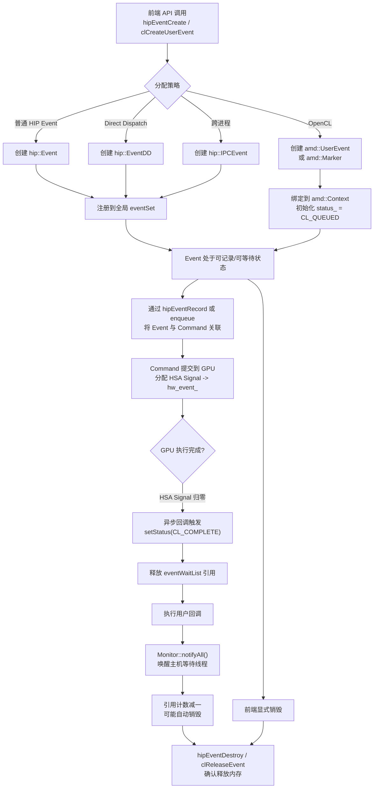
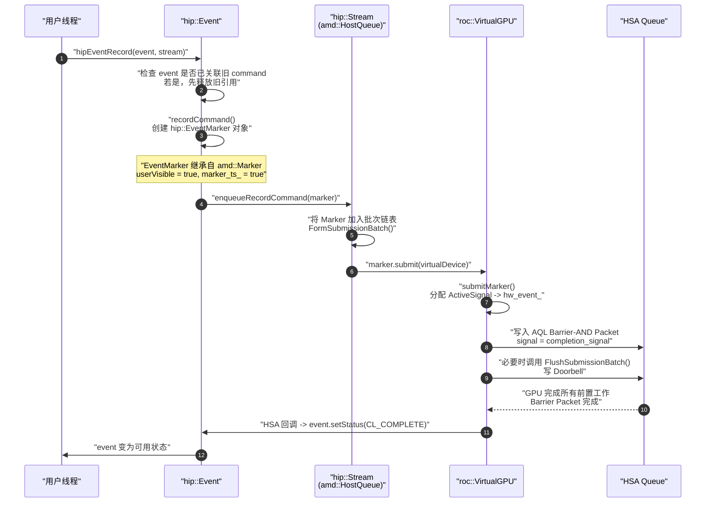
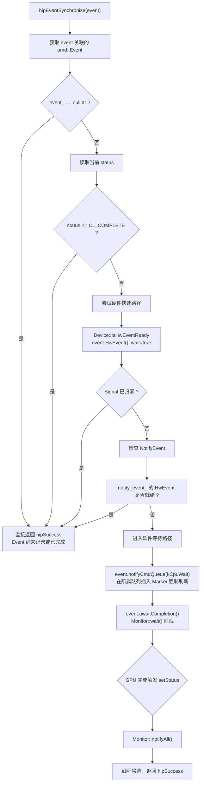
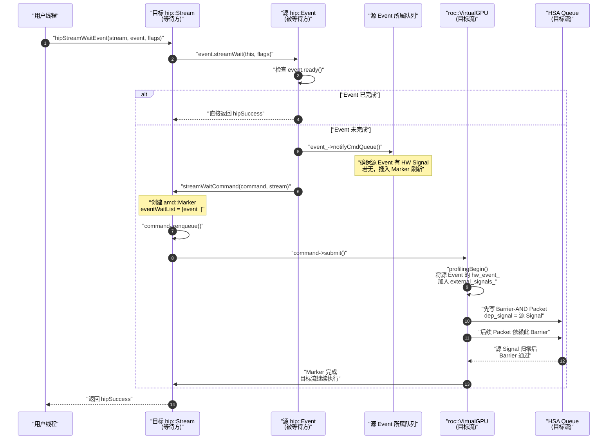
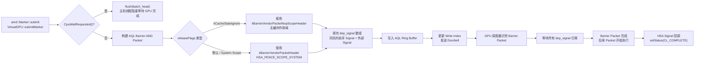
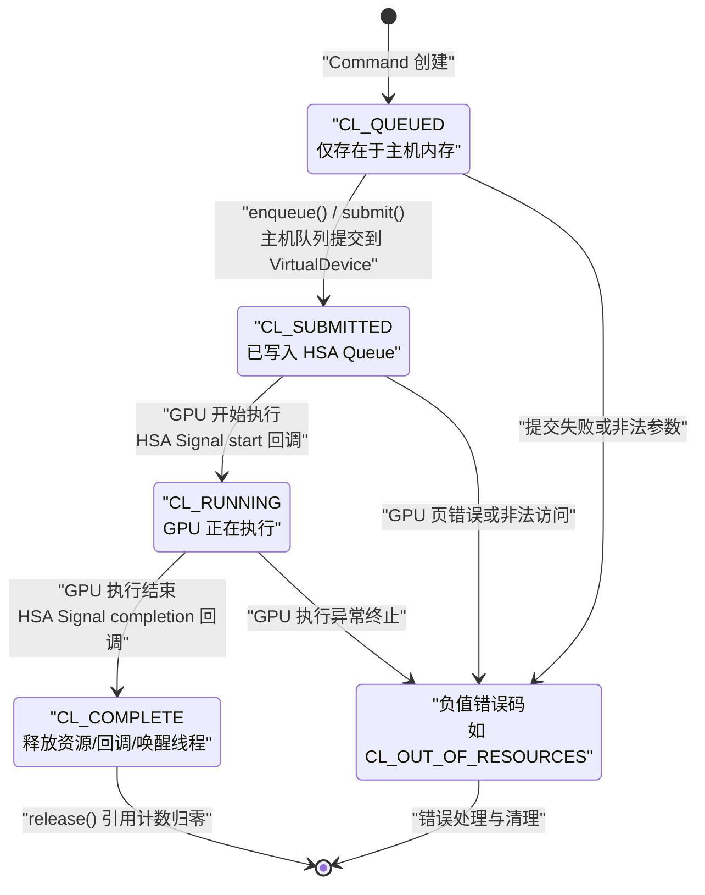

# AMD CLR Event 机制深度解析

## 1. 概述与目的

在 AMD CLR（Compute Language Runtime）中，**Event** 机制是整个 GPU 计算运行时的心脏。它不仅是 HIP 与 OpenCL 两大前端共享的底层同步原语，也是连接主机端（Host）与设备端（Device）、连接软件调度层与硬件执行层的关键桥梁。

Event 机制的核心目的可以概括为以下几点：

- **命令状态追踪**：每一个提交到 GPU 的操作（内核启动、内存拷贝、内存填充等）都对应一个 Event 对象，用于精确追踪该命令从入队（Queued）、提交（Submitted）、执行（Running）到完成（Complete）的全生命周期状态。
- **主机-设备同步**：允许主机线程以阻塞或非阻塞方式等待一个或多个 GPU 操作完成，这是 `hipEventSynchronize`、`clWaitForEvents` 等 API 的根基。
- **流间/队列间同步**：支持不同执行流（HIP Stream / OpenCL Command Queue）之间的显式依赖管理，例如 `hipStreamWaitEvent` 和 OpenCL 的 `eventWaitList`。
- **性能剖析（Profiling）**：Event 对象承载了高精度的时间戳信息（Queued、Submitted、Start、End），为 `hipEventElapsedTime` 和 OpenCL Profiling 提供数据来源。
- **跨进程通信（IPC）**：通过 HIP 的 `hipEventInterprocess` 标志，Event 可以被导出为 IPC 句柄，实现多进程间的 GPU 执行同步。

从架构视角来看，Event 机制统一了 HIP 的 Stream 语义和 OpenCL 的 Command Queue 语义。无论是 HIP 用户还是 OpenCL 用户，其最终都落地到同一套 `amd::Event` / `amd::Command` 体系之上，通过 HSA/ROCr 的 Signal 与 AQL Barrier Packet 实现硬件级同步。

---

## 2. 设计目标

CLR Event 机制在设计上遵循了以下关键目标：

### 2.1 统一抽象

HIP 与 OpenCL 的前端 API 风格迥异，但底层运行时（ROCclr）要求共享同一套设备抽象。Event 机制必须同时满足：
- HIP 的隐式流内同步（in-order stream）与显式 `hipStreamWaitEvent`。
- OpenCL 的细粒度 `eventWaitList`、User Event、Marker 与 Barrier。

因此，`amd::Event` 被设计为与具体前端无关的基础类，而 `amd::Command` 继承自 `amd::Event`，将“同步原语”与“命令执行”天然绑定。

### 2.2 零开销（Zero-overhead）的常规路径

对于最常见的单流顺序执行场景，Event 机制应避免不必要的同步开销：
- **Direct Dispatch 模式**（HIP 默认）下，命令直接由调用线程提交到 GPU，不经过额外的队列线程转发，Event 的状态转换也尽量在硬件信号回调中完成，避免主机锁竞争。
- 只有在涉及**跨队列依赖**或**主机显式等待**时，才按需创建 Marker 或 HSA Signal。

### 2.3 精确的状态机与内存序

Event 状态转换涉及多线程并发（主机业务线程、队列线程、HSA 信号中断处理线程）。设计采用了 `std::atomic<int32_t>` 配合 Compare-And-Swap（CAS）操作，确保状态从 `CL_QUEUED` → `CL_SUBMITTED` → `CL_RUNNING` → `CL_COMPLETE` 的单调前进。

### 2.4 可扩展的硬件后端

CLR 需要同时支持 Linux 上的 HSA/ROCr 后端与 Windows 上的 PAL 后端。Event 的硬件抽象通过 `void* hw_event_`（在 ROCr 后端实际为 `roc::ProfilingSignal*`）实现，上层代码不直接依赖 HSA 头文件，从而保持后端无关性。

### 2.5 回调与通知机制

OpenCL 规范要求支持 `clSetEventCallback`，HIP 生态也有异步回调需求。Event 内部维护了一个无锁链表 `std::atomic<CallBackEntry*> callbacks_`，允许在状态到达特定阈值时触发用户回调，同时保证回调注册的线程安全。

---

## 3. 核心架构与概念

### 3.1 Event 类层次结构

CLR 中的 Event 相关类构成了一个清晰的分层体系：

```
RuntimeObject
└── amd::Event                         // 基础同步对象
    └── amd::Command                   // 带执行语义的事件
        ├── amd::UserEvent             // 主机端显式控制的 OpenCL User Event
        ├── amd::ClGlEvent             // OpenGL Interop Event
        ├── amd::OneMemoryArgCommand   // 单内存参数命令族
        │   ├── ReadMemoryCommand
        │   ├── WriteMemoryCommand
        │   ├── FillMemoryCommand
        │   ├── MapMemoryCommand
        │   └── SignalCommand
        ├── amd::TwoMemoryArgsCommand  // 双内存参数命令族
        │   └── CopyMemoryCommand
        ├── amd::NDRangeKernelCommand  // 内核启动命令
        ├── amd::NativeFnCommand       // 主机线程回调命令
        ├── amd::Marker                // 零操作同步命令（Barrier 核心）
        ├── amd::AccumulateCommand
        ├── amd::MigrateMemObjectsCommand
        └── ... (SVM, Batch, PerfCounter, ThreadTrace 等)
```

在 HIP 前端，还封装了更高层的对象：

```
hip::Event
├── hip::EventDD          // Direct Dispatch 优化版本
├── hip::EventMarker      // 继承自 amd::Marker，附加缓存作用域信息
└── hip::IPCEvent         // 支持跨进程共享的 Event
```

### 3.2 Event 与 Command 的“一体两面”

在 CLR 的设计哲学中，**“没有无 Event 的 Command，也没有无 Command 的 Event（纯 Marker 除外）”**。

- `amd::Event` 负责维护**状态**、**时间戳**、**回调**、**硬件信号**和**等待线程的通知**。
- `amd::Command` 在此基础上增加了**队列归属**（`HostQueue*`）、**等待列表**（`EventWaitList`）、**批次链接**（`next_`、`batch_head_`）以及**具体提交到硬件虚拟设备**的接口（`submit(device::VirtualDevice&)`）。

这种设计的巨大优势在于：**任何需要等待的操作，天然就有一个 Event 与之关联**。例如，当用户调用 `hipStreamWaitEvent` 时，底层只需要将这个 Event 加入后续 Command 的 `eventWaitList`，无需额外创建同步对象。

### 3.3 HostQueue 与 VirtualGPU

- **`amd::HostQueue`**：代表主机端的命令队列。它维护了一个命令批次链表（Direct Dispatch 模式下为 `head_` / `tail_`）或线程安全的并发队列（`ConcurrentLinkedQueue`，非 Direct Dispatch 模式）。HIP 的 `hip::Stream` 直接继承自 `amd::HostQueue`。
- **`device::VirtualDevice`**（如 `roc::VirtualGPU`）：代表与物理 GPU 对应的软件虚拟设备。`HostQueue` 通过 `virtualDevice_` 指针将命令最终提交到 GPU。
- **`HwQueueTracker`**：内嵌于 `VirtualGPU`，负责管理 HSA Signal 的分配、回收以及 Barrier Packet 的构建。

### 3.4 Hardware Signal（硬件信号）

在 ROCr 后端，真正的 GPU 完成通知依赖于 **HSA Signal**：
- 每个需要独立追踪完成状态的 Command，在提交时由 `HwQueueTracker::ActiveSignal()` 分配一个 `ProfilingSignal`（内含 `hsa_signal_t`）。
- 该 Signal 的句柄被存入 `amd::Event::hw_event_`。
- AQL Packet（如内核分发包）的 `completion_signal` 字段指向此 Signal。
- 当 GPU 硬件执行完该 Packet 后，会自动将 Signal 值减至 `0`。
- CLR 注册了一个 HSA 回调或轮询机制，在 Signal 归零后调用 `amd::Event::setStatus(CL_COMPLETE)`。

对于不需要独立追踪的命令（例如批次中间的命令），它们可能共享同一个 Signal 或根本不分配 Signal，从而节省资源。

### 3.5 Marker 与 Barrier 的统一

`amd::Marker` 是一个特殊的 `Command`，它没有任何实际的 GPU 计算或内存操作，唯一的目的是**制造一个执行顺序上的边界**。

在 ROCr 后端，Marker 被翻译为 **HSA AQL Barrier-AND Packet**。该 Packet 的 `dep_signal` 列表可以引用多个前置 Signal（来自同队列的前序命令，或来自其他队列的外部事件）。GPU 硬件保证：在该 Barrier Packet 完成之前，其依赖的所有 Signal 都必须归零；而在 Barrier Packet 完成之后，后续的所有 Packet 才能开始执行。

**在 CLR 的当前架构中，Marker 与 Barrier 本质上是同一操作**。这是因为 CLR 的队列默认是 in-order 的，加上 Barrier-AND Packet 已经足以表达“等待某些事件完成后再继续”的语义。OpenCL 的 `clEnqueueMarkerWithWaitList` 和 `clEnqueueBarrierWithWaitList` 在底层都映射为 `amd::Marker`。

### 3.6 Event 类型总览

在 CLR 中，**Event 是一个广义概念**。从最底层的硬件 Signal，到中间的 `amd::Event` 状态对象，再到承载具体 GPU 操作的 `amd::Command`，以及 HIP/OpenCL 前端的各类封装，整个体系涵盖了数十种不同的类型。下表按照软件栈层次进行了全面梳理。

> **说明**：`amd::Command` 继承自 `amd::Event`，因此下表中所有 Command 子类本质上也是一种 Event（具备状态、可等待、可剖析）。表格中的“类别”列用于区分其语义角色：`Event 基类` 与 `显式事件` 属于纯同步对象；`Command 基类` 与 `Command 子类` 属于带执行语义的事件；`HIP 封装` 是前端面向用户的对象；`Backend 抽象` 则对应硬件信号与设备调度结构。

#### Platform 层 — 基础 Event 与显式事件（`rocclr/platform/`）

| 类型名称 | 父类 | 类别 | 说明 |
|---------|------|------|------|
| `amd::Event` | `RuntimeObject` | Event 基类 | 所有同步对象的根基。封装状态机、时间戳、回调链表、硬件信号句柄 `hw_event_`。 |
| `amd::Command` | `amd::Event` | Command 基类 | 所有可提交 GPU 操作的抽象基类。增加队列归属、等待列表 `eventWaitList_`、批次链接与 `submit()` 接口。 |
| `amd::UserEvent` | `amd::Command` | 显式事件 | OpenCL 用户事件。由主机端通过 `clCreateUserEvent` 创建，并显式调用 `clSetUserEventStatus` 触发状态变更。 |
| `amd::ClGlEvent` | `amd::Command` | 显式事件 | OpenCL-OpenGL 互操作围栏同步对象。用于在 OpenCL 与 OpenGL 共享对象之间建立执行顺序。 |
| `amd::Marker` | `amd::Command` | 同步命令 | 零操作同步命令。仅用于制造执行边界，在 ROCr 后端被翻译为 AQL Barrier-AND Packet。 |

#### Platform 层 — 具体 Command 子类（`rocclr/platform/`）

| 类型名称 | 父类 | 类别 | 说明 |
|---------|------|------|------|
| `amd::ReadMemoryCommand` | `OneMemoryArgCommand` | 内存命令 | 从设备内存（Buffer/Image）读取数据到主机内存。 |
| `amd::WriteMemoryCommand` | `OneMemoryArgCommand` | 内存命令 | 从主机内存写入数据到设备内存（Buffer/Image）。 |
| `amd::FillMemoryCommand` | `OneMemoryArgCommand` | 内存命令 | 以指定模式填充设备内存区域。 |
| `amd::CopyMemoryCommand` | `TwoMemoryArgsCommand` | 内存命令 | 设备内部内存拷贝（Buffer ↔ Buffer，Image ↔ Image 等）。 |
| `amd::CopyMemoryP2PCommand` | `CopyMemoryCommand` | 内存命令 | 点对点（Peer-to-Peer）跨设备内存拷贝。 |
| `amd::MapMemoryCommand` | `OneMemoryArgCommand` | 内存命令 | 映射设备内存对象到主机可访问地址空间。 |
| `amd::UnmapMemoryCommand` | `OneMemoryArgCommand` | 内存命令 | 解除先前映射的设备内存对象。 |
| `amd::MigrateMemObjectsCommand` | `amd::Command` | 内存命令 | 将一组内存对象迁移到目标设备，以优化访问局部性。 |
| `amd::StreamOperationCommand` | `OneMemoryArgCommand` | 流内存命令 | 流式等待值（wait-value）或写值（write-value）操作，用于细粒度设备内存信号。 |
| `amd::BatchMemoryOperationCommand` | `amd::Command` | 流内存命令 | 批量执行多个流内存操作（如多个 wait/write），合并为单次提交以减少开销。 |
| `amd::BatchCopyMemoryCommand` | `amd::Command` | 流内存命令 | 批量执行多个 Buffer-to-Buffer 拷贝，合并为单次提交。 |
| `amd::SignalCommand` | `OneMemoryArgCommand` | 流内存命令 | 在设备内存指定偏移处写入一个 32-bit 标记值，用于轻量级信号通知。 |
| `amd::NDRangeKernelCommand` | `amd::Command` | 计算命令 | NDRange 内核启动命令。支持普通内核、合作组（cooperative groups）及多设备联合启动。 |
| `amd::NativeFnCommand` | `amd::Command` | 计算命令 | 在主机队列线程上执行一个原生主机函数回调（Host Callback）。 |
| `amd::ExternalSemaphoreCmd` | `amd::Command` | 计算命令 | 对外部信号量（如 Vulkan/DX12 semaphore）执行等待或信号操作。 |
| `amd::AccumulateCommand` | `amd::Command` | 分析命令 | 累积前序命令的剖析时间戳与内核名称，用于汇总统计。 |
| `amd::PerfCounterCommand` | `amd::Command` | 分析命令 | 开始或结束性能计数器采集。 |
| `amd::ThreadTraceCommand` | `amd::Command` | 分析命令 | 控制线程追踪的 begin/end/pause/resume。 |
| `amd::ThreadTraceMemObjectsCommand` | `amd::Command` | 分析命令 | 为线程追踪机制绑定内存对象。 |
| `amd::AcquireExtObjectsCommand` | `ExtObjectsCommand` | 外部对象命令 | 从外部 API（如 OpenGL）获取共享对象的访问权。 |
| `amd::ReleaseExtObjectsCommand` | `ExtObjectsCommand` | 外部对象命令 | 将共享对象释放回外部 API。 |
| `amd::SvmFreeMemoryCommand` | `amd::Command` | SVM 命令 | 释放一组 SVM 指针。支持通过用户回调异步执行释放。 |
| `amd::SvmCopyMemoryCommand` | `amd::Command` | SVM 命令 | 在两个 SVM 指针之间执行拷贝。 |
| `amd::SvmFillMemoryCommand` | `amd::Command` | SVM 命令 | 对 SVM 区域执行模式填充。 |
| `amd::SvmMapMemoryCommand` | `amd::Command` | SVM 命令 | 映射 SVM 共享缓冲区以供主机访问。 |
| `amd::SvmUnmapMemoryCommand` | `amd::Command` | SVM 命令 | 解除 SVM 共享缓冲区的映射。 |
| `amd::SvmPrefetchAsyncCommand` | `amd::Command` | SVM 命令 | 异步预取 SVM 内存到指定设备或主机。 |
| `amd::SvmPrefetchBatchAsyncCommand` | `amd::Command` | SVM 命令 | 批量异步预取多个 SVM 区间到各自的目标设备。 |
| `amd::VirtualMapCommand` | `amd::Command` | 虚拟内存命令 | 为指针执行虚拟内存映射或解除映射（用于 VA 预留机制）。 |
| `amd::MakeBuffersResidentCommand` | `amd::Command` | 虚拟内存命令 | 使一组缓冲区常驻（resident），暴露总线地址以支持 P2P 访问。 |

#### HIP 层 — Event 封装与扩展（`hipamd/src/`）

| 类型名称 | 父类/关联基类 | 类别 | 说明 |
|---------|--------------|------|------|
| `hip::Event` | — | HIP 封装 | 标准 HIP Event 包装器。内部持有 `amd::Event*`（通常指向一个 Marker 的 event），提供 `record`、`query`、`synchronize` 和 `elapsedTime`。 |
| `hip::EventDD` | `hip::Event` | HIP 封装 | Direct Dispatch 优化版 Event。绕过部分软件路径，直接通过硬件事件查询与时间戳采集，降低主机开销。 |
| `hip::IPCEvent` | `hip::Event` | HIP 封装 | 跨进程事件。基于 POSIX 共享内存（`ihipIpcEventShmem_t`）维护一个 32 槽 GPU Signal 环形缓冲区，实现多进程间的执行同步。 |
| `hip::EventMarker` | `amd::Marker` | HIP 封装 | HIP 专用的 Marker 命令。在 `amd::Marker` 基础上增加缓存作用域（cache scope）控制和 profiling 标志，用于 `hipEventRecord`。 |
| `hip::StreamCallback` | — | 回调封装 | 流回调抽象基类。定义了回调在队列线程上的执行接口。 |
| `hip::StreamAddCallback` | `StreamCallback` | 回调封装 | 包装传统的 `hipStreamCallback_t` 回调。 |
| `hip::LaunchHostFuncCallback` | `StreamCallback` | 回调封装 | 包装 `hipHostFn_t` 回调，用于 `hipLaunchHostFunc`。 |
| `hip::GraphEventWaitNode` | `hip::GraphNode` | 图节点 | HIP Graph 中的事件等待节点。图执行时在该点插入对指定 `hipEvent_t` 的等待。 |
| `hip::GraphEventRecordNode` | `hip::GraphNode` | 图节点 | HIP Graph 中的事件记录节点。图执行时在指定流中记录 `hipEvent_t`。 |
| `hip::FreeAsyncCommand` | `amd::Command` | 图命令 | 延迟释放命令。用于 `hipFreeAsync`，避免与图内存分配发生竞争。 |
| `hip::VirtualMemAllocNode` | `amd::VirtualMapCommand` | 图命令 | 图内部命令：先分配物理内存，再将其映射到预留的虚拟地址（VA）中。 |
| `hip::VirtualMemFreeNode` | `amd::VirtualMapCommand` | 图命令 | 图内部命令：先解除 VA 映射，再释放底层物理内存分配。 |

#### OpenCL 层

OpenCL 前端**没有定义独立的 C++ Event 子类**，而是直接复用 Platform 层的 `amd::Event`、`amd::Command`、`amd::UserEvent` 和 `amd::ClGlEvent`。`cl_event` 在实现层面就是一个指向 `amd::Event` 实例的不透明句柄。

#### Device / Backend 层 — 硬件 Signal 与调度抽象

| 类型名称 | 所属/父类 | 类别 | 说明 |
|---------|----------|------|------|
| `amd::device::Signal` | `HeapObject` | Signal 基类 | 后端无关的信号抽象。定义等待条件（equal/less-than/greater-than 等）与状态查询接口。 |
| `amd::roc::Signal` | `device::Signal` | ROCr Signal | Linux ROCr 后端的 HSA Signal 包装器。直接封装 `hsa_signal_t`，提供原子等待与加载操作。 |
| `amd::pal::Signal` | `device::Signal` | PAL Signal | Windows PAL 后端的信号实现。包装 `amd_signal_t` 与 `Util::Event`。 |
| `amd::roc::ProfilingSignal` | `ReferenceCountedObject` | ROCr Signal | 带引用计数的 HSA Signal，缓存时间戳数据（queued/submitted/start/end），用于 profiling 分发。 |
| `amd::roc::Timestamp` | `ReferenceCountedObject` | ROCr 计时 | 追踪单个命令的 GPU 开始/结束时间。可聚合多个 `ProfilingSignal` 的时间戳。 |
| `amd::roc::VirtualGPU::HwQueueTracker` | `VirtualGPU` 内嵌 | 队列追踪 | 管理 HSA Signal 池（`signal_list_`）与外部信号列表（`external_signals_`）。负责为每个提交分配 `ActiveSignal` 并构建 Barrier Packet。 |
| `amd::roc::AmdEvent` | — | 设备调度 | ROCr 设备端调度结构。用于设备入队（device enqueue）场景，描述子队列中的事件状态与计数器。 |
| `amd::roc::AmdAqlWrap` | — | 设备调度 | ROCr AQL 包包装器。为设备端调度附加状态机信息。 |
| `amd::roc::SchedulerParam` | — | 设备调度 | ROCr 调度核函数的参数块，用于控制子队列分发。 |
| `amd::pal::AmdEvent` | — | 设备调度 | PAL 设备端事件结构。功能与 ROCr 的 `AmdEvent` 对应，用于 PAL 后端的设备调度与 profiling。 |
| `amd::pal::AmdAqlWrap` | — | 设备调度 | PAL AQL 包包装器。功能与 ROCr 的 `AmdAqlWrap` 对应。 |
| `amd::pal::SchedulerParam` | — | 设备调度 | PAL 调度核函数的参数块。 |
| `pal::GpuEvent` | — | PAL 描述符 | PAL GPU 事件描述符。包含事件 ID、修改位与引擎 ID，用于 PAL 命令缓冲区提交。 |
| `amd::Device::HwEventPatch` | `Device` 内嵌 | 硬件补丁 | 描述在 AQL 包或 Barrier 包中需要补丁写入硬件事件句柄的位置。用于 Direct Dispatch 下的快速路径。 |

---

## 4. 实现机制详解

### 4.1 Event 状态机

`amd::Event` 内部维护一个原子变量 `status_`，其状态值遵循 OpenCL 规范定义（HIP 内部复用了同样的枚举值）：

| 状态值 | 宏定义 | 含义 |
|--------|--------|------|
| 3 | `CL_QUEUED` | 命令已创建并加入主机队列 |
| 2 | `CL_SUBMITTED` | 命令已从主机队列取出，提交给 HSA/PAL |
| 1 | `CL_RUNNING` | 命令开始在 GPU 上执行 |
| 0 | `CL_COMPLETE` | 命令执行完毕 |
| <0 | 错误码 | 执行过程中发生错误 |

状态转换规则：
- **只允许数值递减**（从 3 → 0），不允许回退。
- 使用 `compare_exchange_strong` 进行原子更新，确保多线程竞争下的正确性。
- 当状态到达 `CL_COMPLETE` 时，触发一连串收尾动作：
  1. 释放 `eventWaitList` 中对其他 Event 的引用（`releaseResources`）。
  2. 调用用户注册的回调（`processCallbacks`）。注意：HIP 与 OpenCL 的回调触发时机略有不同，HIP 在状态 CAS 之前触发，OpenCL 在之后。
  3. 通过 `Monitor::notifyAll()` 唤醒所有在 `awaitCompletion()` 中阻塞的主机线程。
  4. 减少 Event 的引用计数（`release()`），如果降至零则自动销毁。

### 4.2 Direct Dispatch 与 Threaded Queue

CLR 支持两种命令提交流程，它们对 Event 的生命周期有直接影响：

#### Direct Dispatch（HIP 默认）

在此模式下，`Command::enqueue()` 直接由用户调用线程执行：
1. 将 Command 加入 `HostQueue` 的批次链表（`head_` / `tail_`）。
2. 如果命令带有 `eventWaitList`，遍历列表并调用 `event->notifyCmdQueue()`，确保被等待的事件产生对应的硬件 Signal。
3. 调用 `FormSubmissionBatch()` 构建提交批次。
4. 直接调用 `command->submit(*vdev())`，将 AQL Packet 写入 HSA Queue。
5. 如果是 Marker 或批次已满，调用 `FlushSubmissionBatch()`，触发 HSA Doorbell。

**特点**：低延迟、无锁（大多数情况下）、Event 状态转换路径短。

#### Threaded Queue（OpenCL 传统模式）

在此模式下，`HostQueue` 内部运行一个独立的 `loop()` 线程：
1. 用户调用 `enqueue()` 将 Command 放入 `ConcurrentLinkedQueue`。
2. `loop()` 线程不断出队。
3. 对于跨队列依赖，`loop()` 线程会调用 `awaitCompletion()` 阻塞等待外部 Event 完成。
4. 外部 Event 完成后，`loop()` 线程继续将当前 Command 提交到 `VirtualDevice`。

**特点**：适合复杂的跨队列依赖场景，但引入了线程上下文切换和锁竞争。

### 4.3 跨队列同步的实现

当 Command A 在 Queue 1 执行，而 Command B 在 Queue 2 执行且需要等待 A 完成时，CLR 采用以下策略：

1. **Signal 传播**：Command A 提交时分配了 HSA Signal `S_A`。
2. **外部 Signal 注册**：在 Command B 提交到 `VirtualGPU` 时，`roc::VirtualGPU::profilingBegin()` 遍历 B 的 `eventWaitList`，将 A 的 Signal `S_A` 加入 `HwQueueTracker::external_signals_` 列表。
3. **Barrier-AND Packet 注入**：Command B 在写入其 AQL Packet 之前，会先写入一个 Barrier-AND Packet，其 `dep_signal` 数组包含 `S_A`。
4. **硬件等待**：ROCr 驱动保证 Barrier-AND Packet 在 `S_A` 归零前不会通过，从而确保 Command B 及其后续操作严格等待 Command A。

如果 Command A 尚未分配硬件 Signal（例如 A 还在主机队列中未刷新），CLR 会先在 A 的队列中插入一个 `amd::Marker`（通过 `notifyCmdQueue()`），强制 A 的队列刷新并产生 Signal。

### 4.4 主机等待策略（CPU Wait）

当主机线程调用 `hipEventSynchronize` 或 `clWaitForEvents` 时，CLR 采用分层等待策略：

1. **快速路径**：检查 `amd::Event::hw_event_` 是否已分配。如果已分配，调用 `Device::IsHwEventReady(..., wait=true)`，后者通过 `hsa_signal_wait_scacquire` 或自旋/退让（spin/yield）策略在**不持有软件锁**的情况下等待硬件 Signal。这是最轻量的路径。
2. **通知路径**：如果该 Event 没有硬件 Signal（例如命令尚未刷新到 GPU），调用 `Event::notifyCmdQueue(kCpuWait)`。这会在 Event 所属的队列中插入一个内部 Marker，强制队列刷新。Marker 提交后会分配 Signal。
3. **软件锁路径**：如果硬件 Signal 仍然不可用（例如某些特殊的 CPU-wait Marker），主机线程进入 `Event::awaitCompletion()`，在 `Monitor`（条件变量）上睡眠，直到 `setStatus(CL_COMPLETE)` 被调用并触发 `notifyAll()`。

### 4.5 Profiling 时间戳

`amd::Event::profilingInfo_` 维护四个关键时间点：
- `queued_`：`Command` 对象创建的时间。
- `submitted_`：命令从主机队列提交到 `VirtualDevice` 的时间。
- `start_`：GPU 硬件实际开始执行的时间（通过 HSA Signal 的 `start` 回调或 ATOMIC_ADD Packet 捕获）。
- `end_`：GPU 硬件执行完成的时间（通过 HSA Signal 的 `completion` 回调捕获）。

HIP 的 `hipEventElapsedTime` 计算的是两个 `hip::Event` 之间 `end_` 与 `start_` 的差值（单位为毫秒）。

---

## 5. 关键流程图

### 5.1 Event 生命周期总览



### 5.2 hipEventRecord 内部流程



### 5.3 hipEventSynchronize 等待流程



### 5.4 hipStreamWaitEvent 跨流同步流程



### 5.5 Barrier/Marker 提交到 GPU 的硬件流程



### 5.6 Event 状态转换时序



---

## 6. Event、同步与 Barrier 的关系

在 GPU 编程模型中，Event、Synchronization 和 Barrier 是三个紧密耦合但又层次分明的概念。在 CLR 中，它们的关系可以归纳为：

### 6.1 Event 是“状态”，同步是“动作”，Barrier 是“机制”

- **Event（状态）**：回答“某个操作完成了吗？”这个问题。它是一个被动对象，通过 `status_` 和 `hw_event_` 暴露完成状态。
- **同步（动作）**：回答“如何让两个操作按顺序发生？”这个问题。它是一个主动行为，可以是主机等待（`hipEventSynchronize`）、流等待（`hipStreamWaitEvent`）或命令等待列表（`eventWaitList`）。
- **Barrier（机制）**：回答“GPU 硬件如何保证顺序？”这个问题。它是实现同步的底层硬件机制，具体表现为 HSA AQL Barrier-AND Packet。

**三者的协作链**：
> 用户发起同步动作（如 `hipStreamWaitEvent`）→ 运行时创建/复用 Event（追踪被等待操作的状态）→ 运行时通过 Barrier 机制（Marker/Barrier Packet）让 GPU 硬件强制执行顺序。

### 6.2 流内隐式同步 vs 流间显式同步

- **流内隐式同步**：在 HIP 中，同一个 Stream 内的命令天然按入队顺序执行。CLR 通过 in-order 的 HSA Queue 和批次提交保证这一点，**不需要为每个命令创建独立的 Event 或 Barrier**。只有在需要精确 Profiling 或主机等待时，才为特定命令分配 Signal。
- **流间显式同步**：当 Stream A 需要等待 Stream B 的某个事件时，CLR 必须在 Stream A 的 HSA Queue 中插入一个 Barrier Packet，让其 `dep_signal` 指向 Stream B 中对应命令的 Signal。这是 Event 与 Barrier 结合最典型的场景。

### 6.3 Barrier 与 Marker 的等价性

在传统的 OpenCL 1.x 中，Marker（标记点）和 Barrier（屏障）有细微区别：
- **Marker**：等待一个事件列表完成后，本身变成完成状态，但**不阻塞**队列中后续命令。
- **Barrier**：等待一个事件列表完成后，本身变成完成状态，并且**阻塞**队列中后续命令直到 Barrier 完成。

然而，在 CLR 的当前架构中，由于队列是 in-order 的，Marker Packet 一旦被提交到 HSA Queue，它天然就会阻塞后续 Packet（因为 HSA Queue 顺序消费）。因此：

> **CLR 中 Marker 与 Barrier 是同一实现**。`clEnqueueMarkerWithWaitList` 和 `clEnqueueBarrierWithWaitList` 都映射到 `amd::Marker`，其底层都生成 Barrier-AND Packet。唯一的区别可能在于前端 API 是否暴露 `cl_event` 给用户查询。

### 6.4 主机同步 vs 设备同步

| 维度 | 主机同步（Host-side Sync） | 设备同步（Device-side Sync） |
|------|--------------------------|---------------------------|
| 代表 API | `hipEventSynchronize`、`clWaitForEvents` | `hipStreamWaitEvent`、`eventWaitList` |
| 阻塞对象 | 主机线程（CPU） | GPU 硬件执行管线 |
| 实现机制 | `Monitor` 条件变量、`hsa_signal_wait` | HSA Barrier-AND Packet、`dep_signal` |
| 性能影响 | 主机线程挂起/唤醒开销 | 零主机开销，纯硬件调度 |
| 适用场景 | 需要 CPU 读取 GPU 结果、同步多线程 | 流间依赖、DAG 执行图 |

CLR 的设计尽量让设备同步走硬件路径，只有当主机必须介入（如 CPU 等待或 Signal 尚未分配）时才退回到软件锁路径。

---

## 7. Event 机制的用法与适用场景

### 7.1 HIP API 用法

#### 基本生命周期

```cpp
// 1. 创建 Event
hipEvent_t start, stop;
hipEventCreate(&start);
hipEventCreate(&stop);

// 2. 记录 Event（插入到 Stream 中）
hipEventRecord(start, stream);
kernel<<<grid, block, 0, stream>>>(...);
hipEventRecord(stop, stream);

// 3. 同步等待（主机阻塞）
hipEventSynchronize(stop);

// 4. 计算耗时
float elapsed_ms;
hipEventElapsedTime(&elapsed_ms, start, stop);

// 5. 销毁
hipEventDestroy(start);
hipEventDestroy(stop);
```

#### 流间同步

```cpp
hipStream_t streamA, streamB;
hipStreamCreate(&streamA);
hipStreamCreate(&streamB);
hipEvent_t event;
hipEventCreate(&event);

// Stream A 执行一些工作
kernelA<<<..., streamA>>>(...);
hipEventRecord(event, streamA);

// Stream B 在继续前等待 Stream A 的 event
hipStreamWaitEvent(streamB, event, 0);
kernelB<<<..., streamB>>>(...);  // 保证在 kernelA 完成后才开始
```

#### 跨进程 Event（IPC）

```cpp
// 进程 A：创建并导出 Event
hipEvent_t ipcEvent;
hipEventCreateWithFlags(&ipcEvent, hipEventInterprocess | hipEventDisableTiming);
hipIpcEventHandle_t handle;
hipIpcGetEventHandle(&handle, ipcEvent);
// 通过 socket/shared memory 将 handle 发送给进程 B

// 进程 B：导入并使用 Event
hipIpcEventHandle_t handle;  // 从进程 A 接收
hipEvent_t importedEvent;
hipIpcOpenEventHandle(&importedEvent, handle);
hipStreamWaitEvent(localStream, importedEvent, 0);
```

### 7.2 OpenCL API 用法

```cpp
// 创建 User Event（主机端控制）
cl_event userEvent = clCreateUserEvent(context, &err);

// 将 User Event 作为依赖提交到队列
cl_event kernelEvent;
clEnqueueNDRangeKernel(queue, kernel, ..., 1, &userEvent, &kernelEvent);

// 主机端在某个时机手动触发 Event
clSetUserEventStatus(userEvent, CL_COMPLETE);

// 等待单个或多个 Event
clWaitForEvents(1, &kernelEvent);

// Marker / Barrier（在当前 CLR 中行为一致）
cl_event markerEvent;
clEnqueueMarkerWithWaitList(queue, 1, &kernelEvent, &markerEvent);
clEnqueueBarrierWithWaitList(queue, 1, &kernelEvent, NULL);
```

### 7.3 适用场景总结

| 场景 | 推荐做法 | 底层机制 |
|------|---------|---------|
| 测量单个 Kernel 执行时间 | `hipEventRecord` 前后各一个 Event | Marker + Profiling Signal |
| 测量多 Stream 流水线总耗时 | 在首尾 Stream 记录 Event | 同上 |
| Stream A 产出数据，Stream B 消费 | `hipStreamWaitEvent` | Barrier-AND + external_signal |
| 主机线程等待 GPU 某一步完成 | `hipEventSynchronize` | `hsa_signal_wait` / `Monitor` |
| 多进程共享 GPU 执行顺序 | `hipIpcEventHandle` + `hipStreamWaitEvent` | 共享内存 Signal |
| OpenCL 主机端控制异步流 | `clCreateUserEvent` + `clSetUserEventStatus` | UserEvent 手动 setStatus |
| 构建复杂 DAG 执行图 | `eventWaitList` 组合 | 多 external_signal + Barrier |

---

## 8. 性能考量与最佳实践

### 8.1 避免过度创建 Event

每个 `hip::Event`（尤其是非 `EventDD` 模式）都涉及主机内存分配、引用计数管理和可能的 HSA Signal 分配。在高频调用的循环中，应复用 Event 对象（池化），而非每次都 `create/destroy`。

### 8.2 谨慎使用 `hipEventSynchronize`

`hipEventSynchronize` 会阻塞主机线程。如果只是为了流间同步，优先使用 `hipStreamWaitEvent`，让同步在 GPU 硬件层面完成，不占用 CPU 资源。

### 8.3 Direct Dispatch 下的批次行为

在 Direct Dispatch 模式下，命令是批量提交的。`hipEventRecord` 会隐式刷新当前批次（因为 Marker 需要产生 Signal），这可能导致比预期更频繁的 Doorbell 写入。如果连续记录大量 Event，可能会增加主机开销。建议在高吞吐量场景下减少不必要的 Event 记录。

### 8.4 IPC Event 的局限性

IPC Event 依赖共享内存和进程间信号可见性。它仅保证执行顺序，**不保证内存一致性**（除非配合显式的内存拷贝或统一虚拟寻址）。在多进程场景下，通常需要 IPC Event + `hipMemcpy`/`hipMemcpyPeer` 组合使用。

### 8.5 Profiling 与并发

`hipEventElapsedTime` 要求两个 Event 都开启了 Timing 支持。如果创建 Event 时使用了 `hipEventDisableTiming`，则无法获取时间戳。此外，在大量并发 Stream 中，HSA Signal 池的容量可能成为瓶颈（虽然通常很大）。

### 8.6 错误处理

Event 可能因 GPU 异常（如页错误、非法指令）而进入错误状态。主机等待 API（`hipEventSynchronize`）在错误状态下也会返回，但错误码需要通过 `hipGetLastError` 获取。长时间挂起的 Event 应设置超时或检查设备健康状态。

---

## 9. 总结

AMD CLR 的 Event 机制是一个高度统一、层次分明的同步体系：

- **软件层**：`amd::Event` / `amd::Command` 提供了与前端无关的状态追踪、回调管理和主机通知能力。
- **调度层**：`amd::HostQueue` 与 `hip::Stream` 通过 Direct Dispatch 或 Threaded Queue 将命令高效地喂给 GPU。
- **硬件层**：`roc::VirtualGPU` 与 `HwQueueTracker` 利用 HSA Signal 和 Barrier-AND Packet 实现了低开销的硬件同步。

Event、同步与 Barrier 三者相辅相成：Event 提供“是否完成”的查询能力，同步是用户显式要求的“顺序保证”动作，而 Barrier 是运行时落实在硬件上的“顺序 enforcement”机制。理解这一链条，有助于开发者写出既正确又高性能的 GPU 程序。

---

*本文档基于 AMD CLR 代码库中 `rocclr/platform/`、`hipamd/src/` 及 `opencl/amdocl/` 等模块的源码分析整理而成。*
