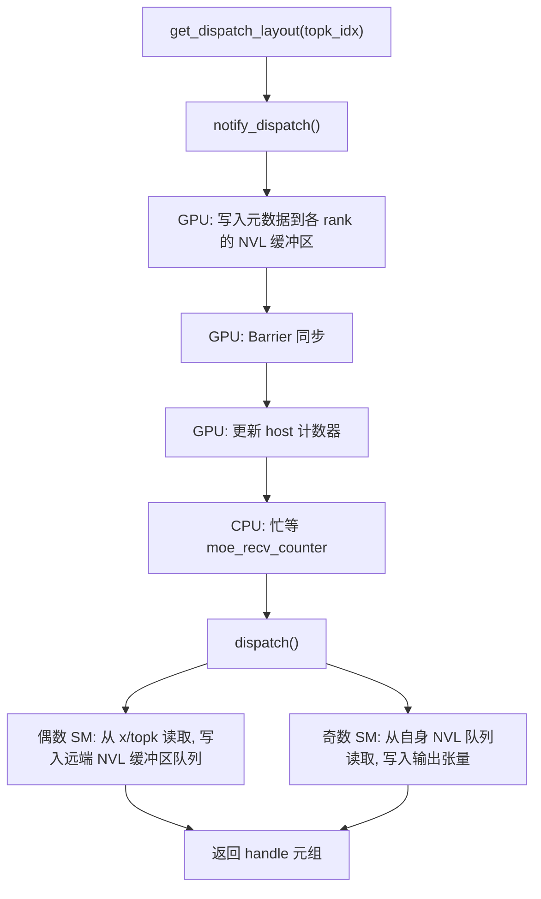
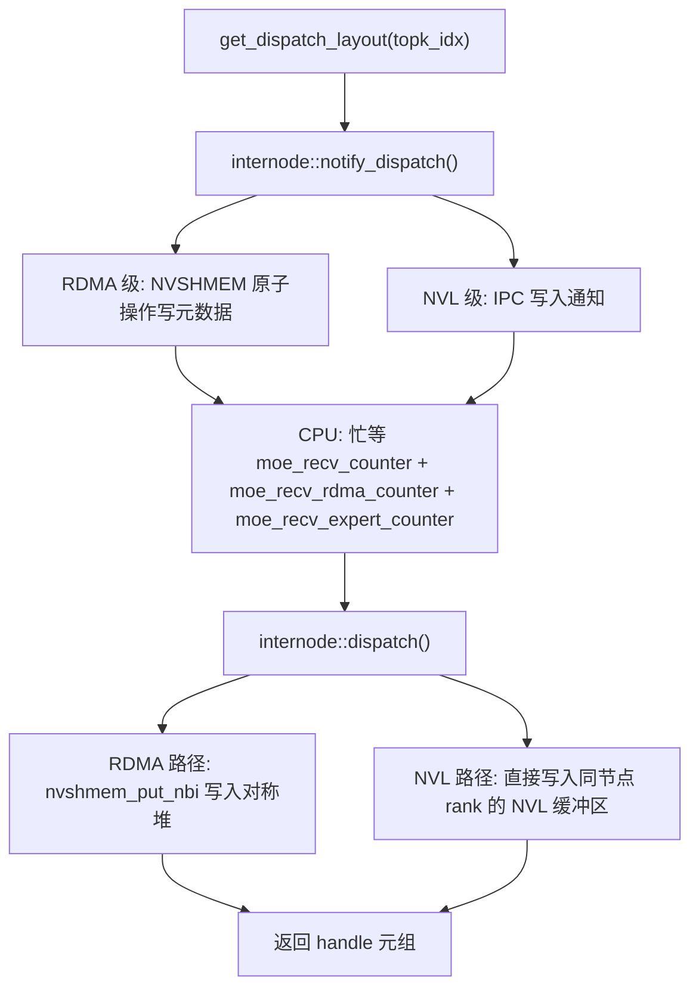
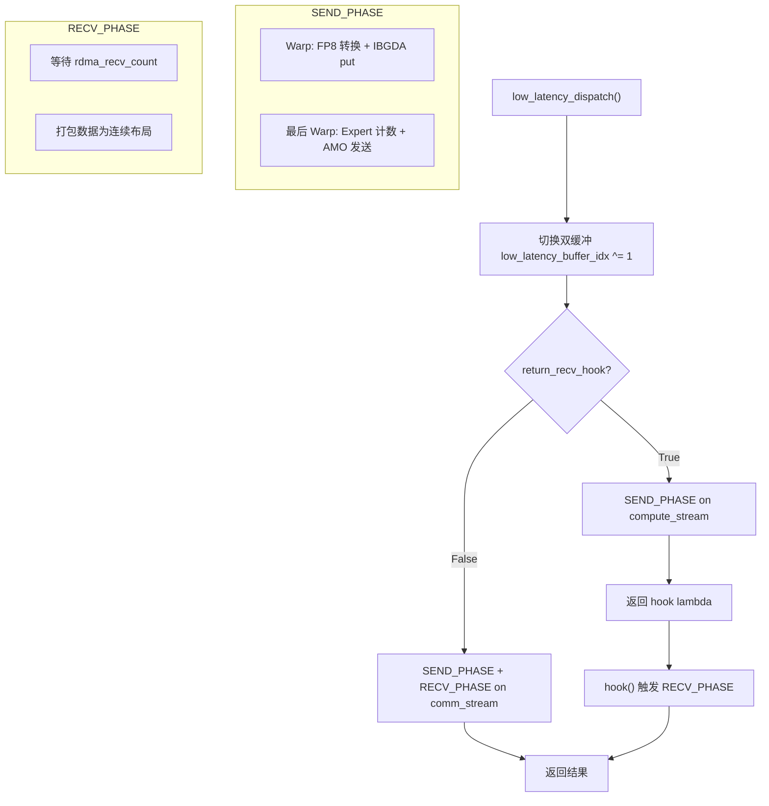
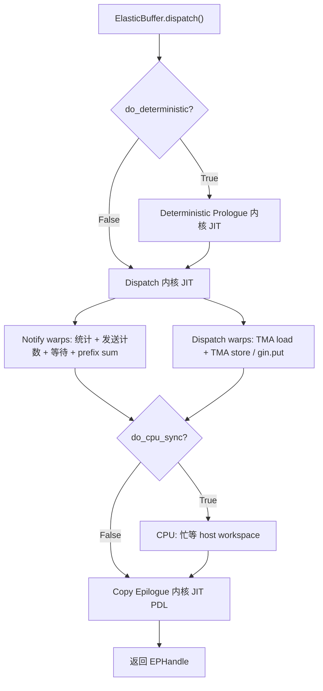
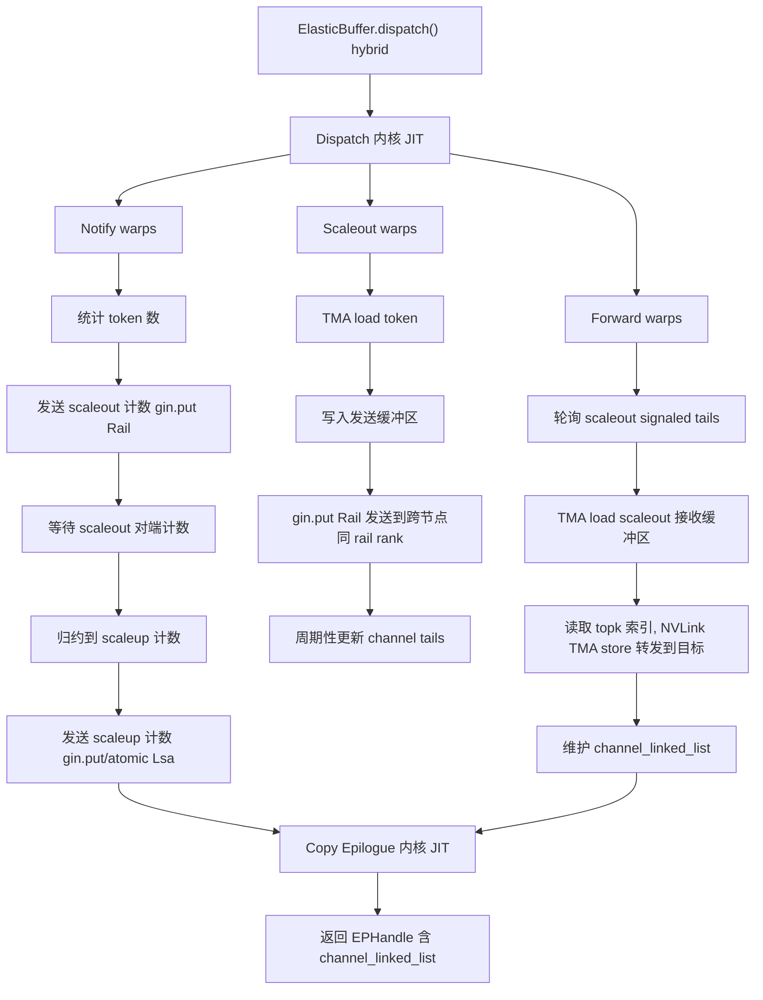
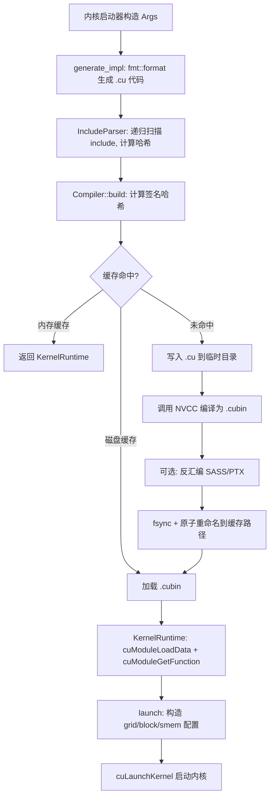
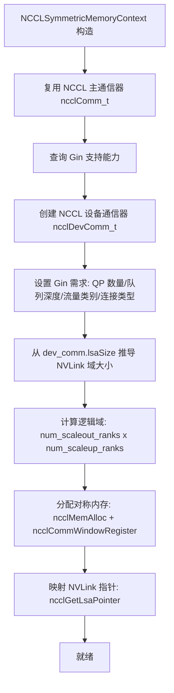
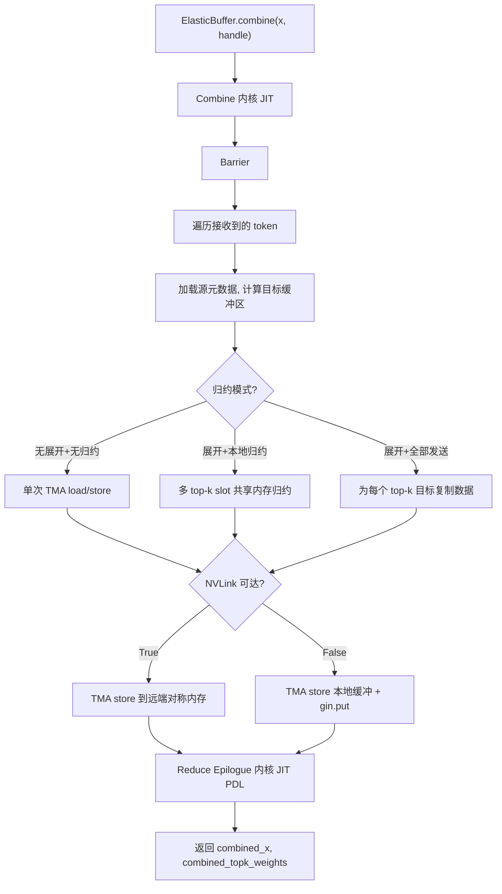
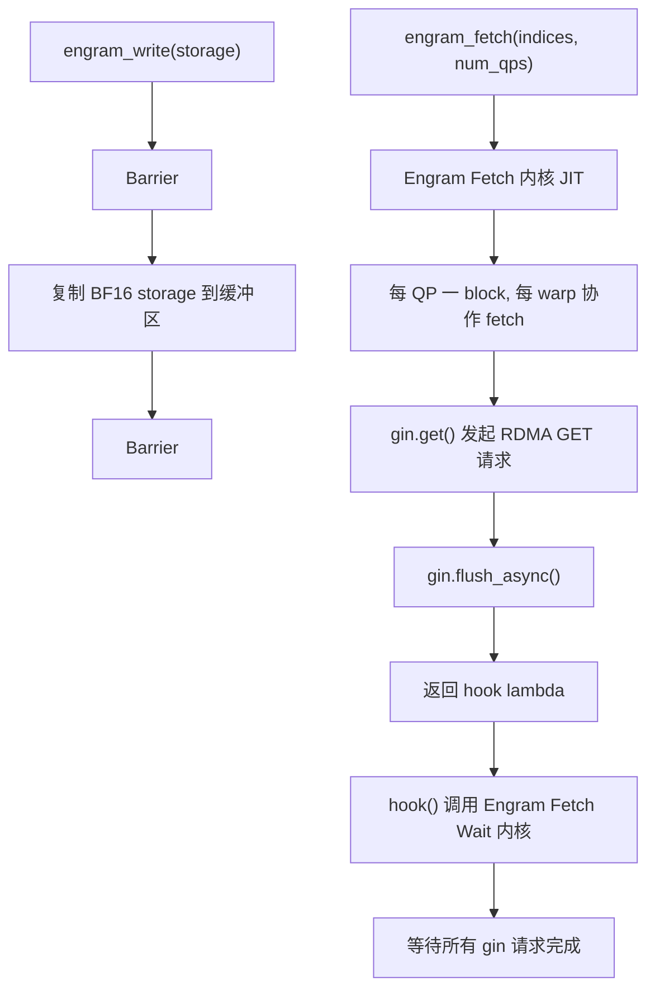
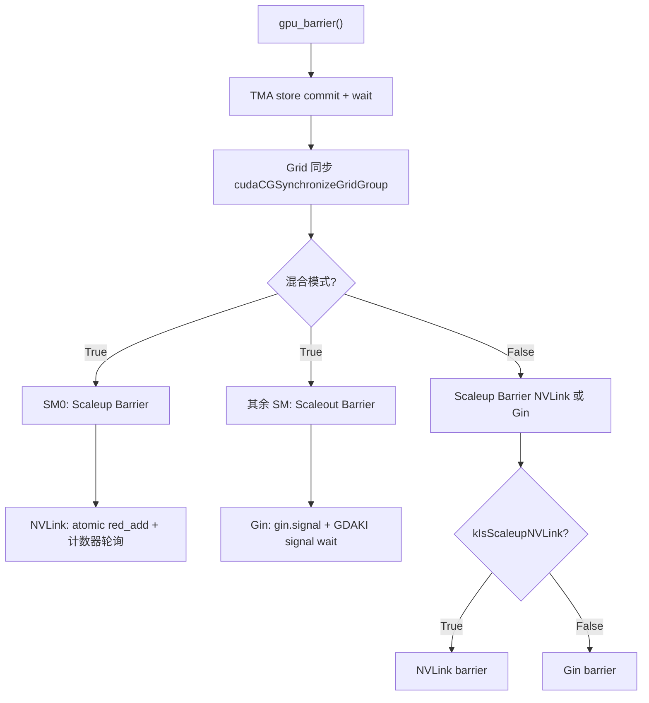

# DeepEP: main 分支与 epv2-release 分支全面对比分析

---

## 目录

1. [概述](#1-概述)
2. [main 分支（V1）全面介绍](#2-main-分支v1全面介绍)
3. [epv2-release 分支（V2）全面介绍](#3-epv2-release-分支v2全面介绍)
4. [详细对比](#4-详细对比)
5. [核心流程图](#5-核心流程图)
6. [总结](#6-总结)

---

## 1. 概述

DeepEP 是一个面向 Mixture-of-Experts（MoE）专家并行（EP）的通信库，提供高吞吐和低延迟的全互联 GPU 内核（dispatch 和 combine）。

- **main 分支（V1）**：基于 NVSHMEM 的实现，包含三种内核模式（intranode / internode / low-latency），所有 CUDA 内核在安装时预编译（AOT）。
- **epv2-release 分支（V2）**：基于 NCCL Gin 的重构版本，引入 JIT 编译系统、ElasticBuffer 统一通信原语、混合（Hybrid）层级通信模式，以及 Engram / PP / AGRS 等新功能。V2 同时保留了 V1 的全部功能作为 Legacy 模式。

---

## 2. main 分支（V1）全面介绍

### 2.1 架构总览

V1 采用两层架构：**C++/CUDA 内核层** + **Python API 层**。

- C++ 层通过 PyBind11 绑定暴露 `Buffer` 类，管理 NVLink IPC 共享内存和 NVSHMEM RDMA 缓冲区
- Python 层提供 `Buffer`、`EventOverlap`、`Config` 等用户接口
- 所有 CUDA 内核在 `python setup.py build/install` 时编译为 `.so` 扩展模块

### 2.2 通信后端

V1 使用两种通信后端：

| 后端 | 用途 | 机制 |
|------|------|------|
| **CUDA IPC + NVLink** | Intranode 通信 | `cudaIpcMemHandle_t`（或 `CUmemFabricHandle`）共享 GPU 内存，通过 NVLink 直接写入远端 GPU 缓冲区 |
| **NVSHMEM** | Internode 通信 | NVSHMEM 对称堆（symmetric heap）分配 RDMA 缓冲区，GPU 端通过 `nvshmem_put_nbi` 等 API 发起 RDMA 写入；低延迟模式使用 IBGDA（InfiniBand GPU-Direct Async） |

### 2.3 拓扑结构

```
rank = rdma_rank * 8 + nvl_rank
```

- 固定 `NUM_MAX_NVL_PEERS = 8`：每个 NVLink 域最多 8 个 GPU
- `NUM_MAX_RDMA_PEERS = 20`：最多 20 个 RDMA 组
- `rdma_rank = rank / 8`，`nvl_rank = rank % 8`
- 同一 `rdma_rank` 内的 GPU 通过 NVLink 直连；不同 `rdma_rank` 的 GPU 通过 RDMA 通信

### 2.4 缓冲区管理

#### NVL 缓冲区（`num_nvl_bytes`）

- 每个 rank 分配独立的 GPU 缓冲区
- 通过 IPC 句柄（`cudaIpcMemHandle_t` 或 `CUmemFabricHandle`）共享给同 NVLink 域的其他 rank
- 布局包含：数据区、源索引、topk 索引/权重、FP8 缩放因子、队列 head/tail 指针、barrier 信号

#### RDMA 缓冲区（`num_rdma_bytes`）

- 通过 `nvshmem_align` 在 NVSHMEM 对称堆上分配
- 所有 rank 的对称地址相同
- 包含：RDMA 数据区、通道前缀矩阵、rank 前缀和

#### 工作区（`workspace`）

- 32 MiB 本地 GPU 内存分配

#### MoE 计数器

- 3 个 pinned host memory 计数器，GPU 写入、CPU 轮询：
  - `moe_recv_counter`（int64_t）：总接收 token 数
  - `moe_recv_expert_counter`（int[1024]）：每 expert 接收 token 数
  - `moe_recv_rdma_counter`（int）：RDMA 层接收 token 数

### 2.5 三种内核模式

#### 2.5.1 Intranode 模式（NVLink）

**适用场景**：单节点内通信（≤8 GPU）

**Dispatch 流程**：

1. `get_dispatch_layout(topk_idx, num_experts)` → GPU 内核计算每 rank/expert 的 token 统计
2. `notify_dispatch()` → 每个 rank 将元数据（rank prefix matrix、expert counts）直接写入其他 rank 的 NVL 缓冲区；barrier 同步；更新 host 计数器
3. CPU 忙等 `moe_recv_counter` 和 `moe_recv_expert_counter`
4. `dispatch()` → GPU 内核执行数据搬移：
   - 偶数 SM = 发送方，奇数 SM = 接收方（channel 配对）
   - 发送方：读取 x / topk_idx / topk_weights，写入远端 rank 的 NVL 缓冲区队列
   - 接收方：从自身 NVL 缓冲区读取，写入输出张量
   - 使用分块队列协议（chunked queue），每通道有 head/tail 指针

**Combine 流程**：

1. `cached_notify_combine()` → barrier + 重置队列 head/tail
2. `combine()` → GPU 内核执行反向数据搬移 + 加权归约

#### 2.5.2 Internode 模式（RDMA + NVLink 转发）

**适用场景**：多节点通信

**两阶段转发机制**：
- 阶段 1（RDMA）：同一 `nvl_rank` 跨节点的 GPU 之间通过 RDMA 传输数据
- 阶段 2（NVLink）：节点内通过 NVLink 将数据转发到目标 rank

**SourceMeta 结构**（8 字节）：
- `src_rdma_rank`（int）：来源 RDMA 组
- `is_token_in_nvl_rank_bits`（int）：位掩码，标记哪些 NVL rank 需要该 token

**Dispatch 流程**：

1. `get_dispatch_layout()` → 增加 `num_tokens_per_rdma_rank` 统计
2. `internode::notify_dispatch()` → 两级通知：先 RDMA 级（通过 NVSHMEM 原子操作），再 NVL 级
3. CPU 忙等三个计数器（总计、RDMA、per-expert）
4. `internode::dispatch()` → 双路径：
   - RDMA 路径：`nvshmem_put_nbi` 写入对称堆
   - NVL 路径：直接写入同节点 rank 的 NVL 缓冲区

**Combine 流程**：反向双路径 → NVL 汇聚 → RDMA 归约

#### 2.5.3 Low-Latency 模式（纯 RDMA / IBGDA）

**适用场景**：推理解码阶段，延迟敏感

**关键特性**：
- 使用 IBGDA（InfiniBand GPU-Direct Async）实现 GPU 端直接发起 RDMA，无需 CPU 介入
- **双缓冲**：交替使用 `low_latency_buffer_idx ^= 1`
- **Hook 机制**：`return_recv_hook=True` 时，dispatch/combine 分为 SEND_PHASE 和 RECV_PHASE，通过 hook 实现通信-计算重叠，不占用 SM
- **CUDA Graph 兼容**：无 CPU-GPU 同步（除 hook 外）
- **Mask 机制**：支持故障容错，超时 rank 可被 mask 掉

**LowLatencyLayout 结构**：

```
双缓冲 × {dispatch: send + recv_data + recv_count
           combine: send + recv_data + recv_flag}
```

每条消息格式：
- Dispatch：`sizeof(int4) + max(hidden * bf16, hidden + num_scales * float)`
- Combine：`num_scales * sizeof(nv_bfloat162) + hidden * sizeof(nv_bfloat16)`

**Dispatch 流程**：

1. 发送阶段（SEND_PHASE）：
   - 各 warp 进行 FP8 转换（warp 级 amax 归约 + 缩放计算）
   - 写入 RDMA 发送缓冲区
   - 通过 IBGDA `nvshmemi_ibgda_put_nbi_warp` 或 NVLink P2P 发送
   - 最后一 warp：统计 expert 计数，通过 IBGDA AMO 或 NVLink release store 发送计数信号
2. 接收阶段（RECV_PHASE）：
   - 等待 `rdma_recv_count`（超时机制）
   - 将接收数据打包为连续布局

### 2.6 配置系统

**`Config` 结构**（5 个字段）：
- `num_sms`：使用的 SM 数量（必须为偶数，用于通道配对）
- `num_max_nvl_chunked_send_tokens` / `num_max_nvl_chunked_recv_tokens`
- `num_max_rdma_chunked_send_tokens` / `num_max_rdma_chunked_recv_tokens`

关键约束：
- `send_tokens < recv_tokens`（避免死锁）
- `rdma_send_tokens <= rdma_recv_tokens / 2`（RDMA 惰性 head 更新）

**自动调优**：`Buffer.get_dispatch_config(num_ranks)` 和 `Buffer.get_combine_config(num_ranks)` 返回针对 DeepSeek 内部集群调优的预设配置（支持 rank 2-160）。

### 2.7 事件与重叠机制

**`EventOverlap` 类**：
- 封装 `EventHandle`（基于 `torch::Event`）
- 支持 Python `with` 语句上下文管理器，实现通信-计算重叠
- `current_stream_wait()`：使当前流等待通信事件完成

### 2.8 构建系统

```bash
# 带完整功能构建
NVSHMEM_DIR=/path/to/nvshmem python setup.py build

# 无 NVSHMEM 构建（仅 intranode）
python setup.py build

# SM80 构建（禁用 FP8/TMA/NVSHMEM）
DISABLE_SM90_FEATURES=1 python setup.py build
```

**编译源文件**（带 NVSHMEM）：
- `csrc/deep_ep.cpp`、`csrc/kernels/runtime.cu`、`csrc/kernels/layout.cu`
- `csrc/kernels/intranode.cu`、`csrc/kernels/internode.cu`、`csrc/kernels/internode_ll.cu`

**环境变量**：

| 变量 | 默认值 | 说明 |
|------|--------|------|
| `NVSHMEM_DIR` | 自动检测 `nvidia.nvshmem` pip 包 | 未设置且无 pip 包则禁用 internode/低延迟 |
| `DISABLE_SM90_FEATURES` | `0` | 设为 `1` 禁用 FP8/TMA，强制 SM80 |
| `TORCH_CUDA_ARCH_LIST` | `9.0` 或 `8.0` | 目标 CUDA 架构 |
| `DISABLE_AGGRESSIVE_PTX_INSTRS` | 非 9.0 架构为 `1` | 启用/禁用 UB PTX `ld.global.nc.L1::no_allocate` |
| `TOPK_IDX_BITS` | 64 | topk_idx 数据类型位宽（32 或 64） |

版本号：`1.2.1 + git_revision`

### 2.9 测试

- `tests/test_intranode.py`：intranode dispatch/combine，BF16 和 FP8，基准测试
- `tests/test_internode.py`：internode dispatch/combine，group-limited gating（DeepSeek-V3 风格）
- `tests/test_low_latency.py`：低延迟 dispatch/combine，hook 重叠，mask 缓冲区，shrink 模式

---

## 3. epv2-release 分支（V2）全面介绍

### 3.1 架构总览

V2 是一次根本性的架构重构，引入以下核心变化：

1. **NCCL Gin 替代 NVSHMEM** 作为主要 RDMA 后端
2. **JIT 编译替代 AOT 编译**，弹性内核全部运行时编译
3. **ElasticBuffer 统一通信原语**，整合 dispatch/combine/barrier/engram/PP/AGRS
4. **混合（Hybrid）层级通信模式**替代 V1 的两阶段转发
5. **Legacy 模式完全保留** V1 功能

### 3.2 目录结构

```
csrc/
  python_api.cpp              -- PyBind11 模块入口
  jit/                        -- JIT 编译系统
    compiler.hpp              -- NVCC JIT 编译器
    cache.hpp                 -- 内核运行时缓存
    handle.hpp                -- CUmodule/CUfunction 封装
    kernel_runtime.hpp        -- 加载 .cubin，发现内核符号
    launch_runtime.hpp        -- CRTP 基类：generate → build → launch
    include_parser.hpp        -- #include 依赖哈希（缓存失效）
    device_runtime.hpp        -- GPU 设备属性查询
    api.hpp                   -- JIT 初始化与注册
  elastic/                    -- 弹性缓冲区（V2 核心）
    buffer.hpp                -- ElasticBuffer C++ 类
    utils.hpp                 -- 工具函数
  legacy/                     -- 传统缓冲区（V1 兼容）
    buffer.hpp                -- Buffer C++ 类
    config.hpp                -- Config / LowLatencyLayout
  kernels/
    backend/                  -- 通信后端抽象
      api.cuh                 -- NCCL / NVSHMEM / CUDA Driver API
      nccl.cu                 -- NCCL 后端实现
      nvshmem.cu              -- NVSHMEM 后端实现
      cuda_driver.cu          -- cuStreamBatchMemOp 封装
    elastic/                  -- 弹性内核 JIT 启动器
      api.hpp, barrier.hpp, dispatch.hpp, combine.hpp,
      engram.hpp, pp_send_recv.hpp
    legacy/                   -- 传统内核（预编译）
      api.cuh, buffer.cuh, compiled.cuh, ibgda_device.cuh,
      launch.cuh, layout.cu, intranode.cu, internode.cu, internode_ll.cu
  utils/                      -- 工具库
    event.hpp, format.hpp, hash.hpp, lazy_driver.hpp,
    lazy_init.hpp, shared_memory.hpp, system.hpp
  indexing/
    main.cu                   -- IDE 索引用（仅 include 所有 .cuh）

deep_ep/
  __init__.py                 -- 包初始化：检查 NCCL、初始化 JIT
  buffers/
    elastic.py                -- ElasticBuffer + EPHandle
    legacy.py                 -- Buffer（V1）
  utils/
    comm.py, envs.py, event.py, gate.py, math.py,
    refs.py, semantic.py, testing.py, find_pkgs.py
  include/deep_ep/            -- JIT 编译使用的 .cuh 头文件
    common/                   -- 公共头文件
      comm.cuh, handle.cuh, layout.cuh, math.cuh,
      ptx.cuh, compiled.cuh, exception.cuh
    impls/                    -- 内核实现头文件
      barrier.cuh, dispatch.cuh, hybrid_dispatch.cuh,
      combine.cuh, hybrid_combine.cuh, combine_utils.cuh,
      combine_reduce_epilogue.cuh, dispatch_copy_epilogue.cuh,
      dispatch_deterministic_prologue.cuh, engram_fetch.cuh, pp_send_recv.cuh

tests/
  elastic/                    -- V2 测试
    test_ep.py, test_engram.py, test_barrier.py, test_pp.py, test_agrs.py
  legacy/                     -- V1 测试
    test_intranode.py, test_internode.py, test_low_latency.py
```

### 3.3 JIT 编译系统

这是 V2 最重要的架构创新。所有弹性内核不再预编译，而是在运行时按需生成并编译。

#### 3.3.1 编译流程

1. **初始化**：包导入时调用 `init_jit(library_root, cuda_home, nccl_root)`，设置编译器路径和包含路径
2. **代码生成**：内核启动器（如 `DispatchRuntime`）使用 `fmt::format` 生成一个 `.cu` 文件，包含：
   - `#include <deep_ep/impls/dispatch.cuh>` 等实现头文件
   - 显式模板实例化函数
3. **依赖哈希**：`IncludeParser` 递归扫描所有 `#include <deep_ep/*>` 指令，计算组合哈希，作为缓存键的一部分
4. **缓存检查**：`Compiler::build()` 计算签名哈希 `(name, signature, flags, code)`，先查内存缓存（`KernelRuntimeCache`），再查磁盘缓存（`~/.deep_ep/cache/`）
5. **编译**：缓存未命中时：
   - 创建临时目录，写入 `.cu` 文件
   - 调用 NVCC 编译为 `.cubin`
   - 可选反汇编为 SASS/PTX（调试用）
   - `fsync` 目录（确保分布式文件系统可见性）
   - 原子重命名临时目录为最终缓存路径
6. **加载**：`KernelRuntime` 通过 CUDA Driver API（`cuModuleLoadData`/`cuModuleGetFunction`）或 Runtime API（`cudaLibraryLoadFromFile`/`cudaLibraryGetKernel`）加载 `.cubin`
7. **启动**：`LaunchRuntime::launch()` 构造启动配置（grid/block/smem/cluster/cooperative/PDL），调用 `cuLaunchKernel`

#### 3.3.2 缓存策略

- **内存缓存**：`KernelRuntimeCache` 映射路径到已加载内核，进程内有效
- **磁盘缓存**：`~/.deep_ep/cache/kernel.<name>.<hash>/`，跨进程持久化
- **原子重命名**：确保分布式文件系统（NFS）上的缓存一致性
- **环境变量控制**：
  - `EP_JIT_CACHE_DIR`：自定义缓存目录
  - `EP_JIT_DEBUG`：打印编译命令
  - `EP_JIT_DUMP_ASM` / `EP_JIT_DUMP_SASS`：反汇编输出
  - `EP_JIT_PTXAS_VERBOSE`：PTXAS 详细输出
  - `EP_JIT_NVCC_COMPILER`：自定义 NVCC 路径
  - `EP_JIT_USE_RUNTIME_API`：使用 CUDA Runtime API 而非 Driver API 加载

#### 3.3.3 设计理由

- **按需特化**：模板参数（rank 数、hidden 维度、top-k 数等）烘焙进生成代码，产生高度特化的内核
- **避免安装时编译爆炸**：V1 需要为所有参数组合预编译，V2 只编译实际使用的组合
- **快速迭代**：修改 `.cuh` 头文件后无需重新安装，JIT 会自动检测变更（通过 include 哈希）

### 3.4 通信后端抽象

V2 引入三层后端抽象：

#### 3.4.1 NCCL 后端（核心）

**`NCCLSymmetricMemoryContext`** 是 V2 的核心后端，替代 V1 的 NVSHMEM：

```
NCCLSymmetricMemoryContext 构造流程：
1. 复用 NCCL 主通信器（ncclComm_t）
2. 查询 Gin 支持能力（ncclCommQueryProperties）
3. 创建 NCCL 设备通信器（ncclDevComm_t）：
   - Gin 需求：QP 数量、独占上下文、队列深度（1024）、
     流量类别（SL index）、信号数量、连接类型
   - 连接类型：RAIL（混合模式）或 FULL（直连模式）
4. 从 dev_comm.lsaSize 推导 NVLink 域大小
5. 计算逻辑域：num_scaleout_ranks × num_scaleup_ranks
6. 分配对称内存：ncclMemAlloc + ncclCommWindowRegister
7. 映射 NVLink 可访问指针：ncclGetLsaPointer
```

**NCCLGin 句柄**（GPU 端通信核心）：

```cpp
struct NCCLGin {
    ncclDevComm dev_comm;
    ncclWindow  window;
    ncclGin     gin;         // Gin 上下文
    ncclTeam    team_world;  // 全局 team
    ncclTeam    team_lsa;    // NVLink team
    ncclTeam    team_rail;   // RDMA rail team

    // 关键方法：
    is_nvlink_accessible<team_t>(dst_rank)  // 判断是否 NVLink 可达
    get_sym_ptr<team_t>(ptr, dst_rank)      // 获取远端对称指针
    put<team_t>(...)                         // RDMA PUT
    get<team_t>(...)                         // RDMA GET
    red_add_rel<team_t>(sym_ptr, value, dst) // 原子加
    put_value<team_t>(...)                   // 发送小值
    signal<team_t>(...)                      // 发信号
    flush_async()                            // 刷新待处理操作
};
```

**Team 路由**：
- `ncclTeamTagLsa`：NVLink 域内通信（同节点）
- `ncclTeamTagRail`：RDMA Rail 域通信（跨节点同 rail 位置）
- `ncclTeamTagWorld`：全局通信

#### 3.4.2 NVSHMEM 后端（Legacy）

保留给 V1 Legacy Buffer 使用，提供 `init/alloc/free/barrier/finalize` 封装。

#### 3.4.3 CUDA Driver 后端

提供 `batched_write()`、`batched_wait()`、`batched_write_and_wait()` 基于 `cuStreamBatchMemOp`，用于 AGRS 信号通知。

### 3.5 逻辑拓扑与物理拓扑

V2 引入逻辑/物理拓扑分离：

| 概念 | 说明 |
|------|------|
| **物理域** | 硬件实际拓扑：`num_rdma_ranks`（RDMA 组数）× `num_nvl_ranks`（NVLink 组内 GPU 数） |
| **逻辑域** | 通信域划分：`num_scaleout_ranks`（跨节点通信的 rank 数）× `num_scaleup_ranks`（节点内通信的 rank 数） |

- 直连模式（`num_scaleout_ranks == 1`）：所有 rank 在一个 NVLink 域，无需 RDMA
- 混合模式（`num_scaleout_ranks > 1`）：需要 RDMA + NVLink 层级通信

NCCL 自动发现物理拓扑（从 `dev_comm.lsaSize` 获取 NVLink 域大小），逻辑域大小可由用户指定。

### 3.6 ElasticBuffer 系统

**`ElasticBuffer`** 是 V2 的统一通信原语，替代 V1 的 `Buffer`。

#### 3.6.1 缓冲区管理

- **单一统一缓冲区**：不再分 NVL/RDMA 两个缓冲区，使用一个 NCCL 对称内存窗口
- **缓冲区大小**：取 dispatch 和 combine 所需大小的最大值
- **工作区**：`WorkspaceLayout` 固定布局，包含：
  - NVLink barrier 信号
  - Notify 归约工作区
  - Scaleup rank/expert 计数（发送+接收）
  - Scaleout rank/expert 计数
  - Scaleout 通道元数据
  - AGRS 信号

#### 3.6.2 TokenLayout / BufferLayout

**TokenLayout**：描述单个 token 的内存布局
- 隐藏层字节 + SF（缩放因子）字节 + 元数据（top-k 索引 + 权重 + 源 token 全局索引 + 链表索引）
- 可选 mbarrier（TMA 同步）
- 所有段落 TMA 对齐（32 字节）

**BufferLayout\<kWithMBarrier\>**：描述缓冲区中 rank × max_tokens_per_rank 的 token 网格

### 3.7 弹性内核详解

#### 3.7.1 Barrier 内核

```
GPU Barrier 流程：
1. TMA store commit + wait（刷新所有待处理 TMA 操作）
2. Grid 同步（cudaCGSynchronizeGridGroup）
3. 并行执行 scaleup 和 scaleout barrier：
   - Scaleup：NVLink barrier（原子 red_add + 计数器轮询）
   - Scaleout：Gin barrier（gin.signal + GDAKI signal wait）
   - 混合模式下 SM0 做 scaleup，其余 SM 做 scaleout
```

#### 3.7.2 Dispatch 内核（直连模式）

**两种 warp 角色**：

1. **Notify warps**（4 个 warp）：
   - 在共享内存中统计每 rank/expert 的 token 数
   - 跨 SM 归约（全局内存原子操作）
   - 发送 scaleup rank/expert 计数到远端 rank
   - 等待远端计数到达
   - 计算 prefix sum
   - 写入 host workspace（供 CPU 同步使用）

2. **Dispatch warps**（可变数量）：
   - 遍历 token，TMA 加载数据 + SF + top-k 元数据到共享内存
   - 去重目标 rank
   - 分配缓冲区 slot（原子或缓存）
   - NVLink 可达：TMA store 到远端对称内存
   - RDMA 目标：TMA store 到本地发送缓冲区，然后 `gin.put()` 发送

#### 3.7.3 Dispatch 内核（混合模式）

**三种 warp 角色**：

1. **Notify warps**：
   - 同直连模式，但额外通过 `ncclTeamTagRail` 发送 scaleout rank/expert 计数
   - 等待 scaleout 对端计数
   - 将 scaleout 计数归约到 scaleup 计数
   - 通过 `ncclTeamTagLsa` 发送 scaleup 计数

2. **Scaleout warps**：
   - 遍历 token，TMA 加载
   - 写入发送缓冲区
   - 通过 `gin.put<ncclTeamTagRail>()` 发送到同 rail 位置的 scaleout 对端
   - 周期性更新已发送的 channel tail

3. **Forward warps**：
   - 轮询已到达的 scaleout 数据（检查 signaled tails）
   - TMA 加载 scaleout 接收缓冲区中的数据
   - 读取 top-k 索引，通过 NVLink TMA store 转发到最终 scaleup 目标
   - 维护 `token_metadata_at_forward` 和 `channel_linked_list`（供 combine 使用）

#### 3.7.4 Combine 内核（直连模式）

- Barrier 后遍历接收到的 token
- 对每个 token：加载源元数据，计算目标缓冲区位置
- 三种归约模式：
  1. **无展开 + 无归约**：单次 TMA load/store
  2. **展开 + 本地归约**：多个 top-k slot 在共享内存中归约
  3. **展开 + 全部发送**：为每个 top-k 目标复制数据
- NVLink 可达：TMA store 到远端对称内存
- RDMA 目标：TMA store 到本地发送缓冲区，`gin.put()` 发送

#### 3.7.5 Combine 内核（混合模式）

**两种 warp 角色**：

1. **Scaleup warps**：
   - 遍历 channel linked list
   - 计算目标 NVLink 缓冲区
   - TMA load + 归约 + TMA store 到远端 scaleup 缓冲区
   - 周期性更新 tails

2. **Forward warps**：
   - 重放 dispatch 元数据
   - 等待 scaleup tails 到达
   - 从 scaleup 缓冲区加载
   - 跨 scaleup 对端归约
   - TMA store 到 scaleout 发送缓冲区
   - 通过 `gin.put<ncclTeamTagRail>()` 发送到 scaleout 对端

### 3.8 PDL（Programmatic Dependent Launch）

V2 引入 PDL 机制优化内核间重叠：

- **Dispatch 流**：主 dispatch 内核 → `cudaTriggerProgrammaticLaunchCompletion()` → Copy Epilogue 内核可提前开始
- **Combine 流**：主 combine 内核 → Reduce Epilogue 内核
- PDL 允许 epilogue 内核在主内核的最终 barrier 完成前就开始部分工作，提高 GPU 利用率

### 3.9 EPHandle 与缓存机制

V2 用结构化的 `EPHandle` 类替代 V1 的元组句柄：

```python
class EPHandle:
    do_expand: bool
    num_experts: int
    expert_alignment: int
    num_max_tokens_per_rank: int     # 每 rank 最大 token 数
    num_sms: int                     # dispatch 使用的 SM 数
    topk_idx: torch.Tensor           # 克隆的 top-k 索引
    psum_num_recv_tokens_per_scaleup_rank: torch.Tensor
    psum_num_recv_tokens_per_expert: torch.Tensor
    num_recv_tokens_per_expert_list: list  # 每 expert 接收 token 数列表
    num_recv_tokens: int             # 总接收 token 数
    recv_src_metadata: torch.Tensor
    dst_buffer_slot_idx: torch.Tensor  # 缓存的 slot 分配
    token_metadata_at_forward: torch.Tensor  # 混合模式专用
    channel_linked_list: torch.Tensor        # 混合模式专用
```

**缓存模式**：当 dispatch 使用相同的 top-k 路由模式时，可复用 `EPHandle` 中的 slot 分配和路由元数据，跳过 CPU 同步。

### 3.10 Engram（远程 KV 缓存获取）

V2 新增功能，支持通过 RDMA GET 从远端 rank 获取 KV 缓存条目：

- `engram_write(storage)`：将 BF16 存储写入缓冲区（带 barrier）
- `engram_fetch(indices, num_qps)`：发起 NCCL Gin GET 请求，返回等待 hook
- **0-SM Engram**：RDMA 数据传输不需要 SM 参与

### 3.11 Pipeline Parallel（PP）Send/Recv

V2 新增功能，支持环形拓扑中相邻 rank 的点对点通信：

- `pp_send(x)`：等待缓冲区 slot 释放（GDAKI 信号）→ TMA 复制 → RDMA put with signal
- `pp_recv(x)`：等待数据到达（GDAKI 信号）→ TMA 复制到输出 → 信号释放缓冲区
- 支持多 in-flight 张量的流控

### 3.12 AGRS（All-Gather Reduce-Scatter）

V2 新增功能，提供集合通信会话：

- `create_agrs_session()` / `destroy_agrs_session()`：会话管理
- `agrs_get_inplace_tensor()`：获取原地张量（避免额外内存分配）
- `all_gather()`：使用 NVLink 对称内存批量复制

### 3.13 分析型 SM/QP 计算

V2 用分析模型替代 V1 的手动调优：

- `get_theoretical_num_sms()`：基于带宽瓶颈建模计算最优 SM 数
- `get_theoretical_num_qps()`：基于 SM 数和模式（直连/混合）计算 QP 数

消除了 V1 中 `get_dispatch_config()` / `get_combine_config()` 的手动预设配置。

### 3.14 Python API 变化

| V1 | V2 |
|----|----|
| `Buffer(group, nvl_bytes, rdma_bytes, ...)` | `ElasticBuffer(group, num_bytes, ...)` |
| `Buffer.dispatch(x, topk_idx, ...)` | `ElasticBuffer.dispatch(x, topk_idx, ...)` |
| `Buffer.combine(x, handle, ...)` | `ElasticBuffer.combine(x, handle, ...)` |
| `Buffer.low_latency_dispatch(...)` | （无低延迟模式，使用少量 SM 的普通内核） |
| `Buffer.get_dispatch_config(n)` | `ElasticBuffer.get_theoretical_num_sms(...)` |
| Handle = 元组 | Handle = `EPHandle` 类 |
| `EventOverlap` | `EventOverlap`（增强版） |
| `Config` 类 | 无（分析计算替代） |

### 3.15 构建系统

```bash
# V2 构建
python setup.py build   # 只编译轻量运行时
# 弹性内核在首次使用时 JIT 编译
```

**编译源文件**（大幅减少）：
- `csrc/python_api.cpp`、`csrc/kernels/backend/nccl.cu`、`csrc/kernels/backend/nvshmem.cu`、`csrc/kernels/backend/cuda_driver.cu`
- Legacy 内核（保留 V1 内核用于 Legacy 模式）
- `csrc/indexing/main.cu`（仅 IDE 索引）

**新增依赖**：
- NCCL（核心依赖）
- `fmt` 库（作为 git submodule，用于代码生成）

**包数据**：`deep_ep/include/deep_ep/**/*`（.cuh 头文件随 Python 包分发）

**构建时生成**：`deep_ep/utils/envs.py`（从模板注入环境变量）

版本号：`2.0.0`

---

## 4. 详细对比

### 4.1 架构对比

| 维度 | V1（main） | V2（epv2-release） |
|------|-----------|-------------------|
| **编译模式** | AOT（安装时编译全部内核） | JIT + AOT 混合（弹性内核运行时编译，Legacy 内核安装时编译） |
| **通信后端** | NVSHMEM + CUDA IPC | NCCL Gin + NVSHMEM（Legacy）+ CUDA Driver |
| **缓冲区模型** | 双缓冲区（NVL + RDMA 分离） | 统一缓冲区（单一 NCCL 对称内存窗口） |
| **拓扑抽象** | 固定 8 GPU/NVLink 域，rank = rdma_rank * 8 + nvl_rank | 逻辑/物理拓扑分离，NCCL 自动发现物理拓扑 |
| **句柄机制** | 不透明元组 | 结构化 `EPHandle` 类 |
| **SM 调优** | 手动预设配置（`get_dispatch_config`） | 分析型计算（`get_theoretical_num_sms`） |
| **版本** | 1.2.1 | 2.0.0 |

### 4.2 内核模式对比

| 内核模式 | V1 | V2 |
|---------|----|----|
| **Intranode** | CUDA IPC + NVLink 直接存储 | NCCL 对称内存 + NVLink TMA store |
| **Internode** | NVSHMEM RDMA + NVLink 两阶段转发 | NCCL Gin + 混合层级通信（Hybrid） |
| **Low-Latency** | IBGDA 纯 RDMA，0-SM，双缓冲 hook | 已移除（使用少量 SM 的普通内核替代） |
| **Barrier** | 基于 IPC 信号数组的简单 barrier | 层级 GPU barrier（NVLink + Gin 并行） |

### 4.3 Dispatch 流程对比

#### V1 Intranode Dispatch

1. `get_dispatch_layout()` → GPU 内核计算布局
2. `notify_dispatch()` → IPC 写入元数据 + barrier + host 计数器
3. CPU 忙等 host 计数器
4. `dispatch()` → 偶数 SM 发送（IPC 写入），奇数 SM 接收
5. 返回元组 handle

#### V2 直连 Dispatch

1. （可选）Deterministic prologue 内核
2. Dispatch 内核（JIT）：
   - Notify warps：统计 + 发送计数 + 等待 + prefix sum
   - Dispatch warps：TMA load + TMA store / gin.put
3. （可选）CPU 同步
4. Copy epilogue 内核（JIT，PDL 重叠）
5. 返回 `EPHandle`

#### V1 Internode Dispatch（两阶段转发）

1. `get_dispatch_layout()` → 增加 RDMA rank 统计
2. `internode::notify_dispatch()` → 两级通知
3. CPU 忙等三个计数器
4. `internode::dispatch()` → RDMA put + NVL 转发

#### V2 混合 Dispatch（层级通信）

1. Dispatch 内核（JIT）：
   - Notify warps：scaleout + scaleup 两级计数
   - Scaleout warps：`gin.put<ncclTeamTagRail>()` 跨节点
   - Forward warps：从 scaleout 接收缓冲区读取 → NVLink TMA store 转发到目标
2. Copy epilogue 内核
3. 返回 `EPHandle`（含 channel_linked_list 等混合模式元数据）

### 4.4 Combine 流程对比

| 维度 | V1 | V2 |
|------|----|----|
| **数据搬移** | IPC 读取 / NVSHMEM put | TMA load/store + gin.put |
| **归约** | 单次归约 | 支持多次归约（`allow_multiple_reduction`） |
| **展开模式** | 不支持 | 支持 `do_expand`（每 expert 对齐连续 slot） |
| **混合模式** | NVL 汇聚 → RDMA 归约 | Scaleup warps + Forward warps 层级通信 |
| **Epilogue** | 无 | PDL 驱动的 Reduce Epilogue 内核 |

### 4.5 缓冲区管理对比

| 维度 | V1 | V2 |
|------|----|----|
| **NVL 缓冲区** | IPC 共享，每 rank 独立分配 | NCCL 对称内存窗口，统一分配 |
| **RDMA 缓冲区** | NVSHMEM 对称堆，单独分配 | 包含在同一对称内存窗口中 |
| **大小计算** | `Config.get_nvl/rdma_buffer_size_hint()` | `ElasticBuffer.calculate_buffer_size()`（统一计算） |
| **布局** | 自定义队列式（head/tail 指针） | `TokenLayout` + `BufferLayout` 结构化布局 |
| **双缓冲** | 低延迟模式专用 | 无（普通内核少量 SM 即可） |

### 4.6 通信原语对比

| 原语 | V1 | V2 |
|------|----|----|
| **NVLink 写入** | `cudaMemcpy` / 直接 P2P store | TMA store（`st.async.bulk.global.shared::cta`） |
| **RDMA 写入** | `nvshmem_put_nbi` | `gin.put<team_t>()` |
| **RDMA 读取** | 不支持 | `gin.get<team_t>()`（Engram） |
| **原子操作** | NVSHMEM AMO | `gin.red_add_rel<team_t>()` / `gin.signal<team_t>()` |
| **信号通知** | IPC barrier 信号 + host 计数器 | Gin signal + GDAKI wait + CUDA Driver batched write |
| **同步** | CPU 忙等 host 计数器 | 可选 CPU 同步 + GPU barrier |
| **Barrier** | IPC 信号数组轮询 | 层级 GPU barrier（NVLink + Gin 并行） |

### 4.7 FP8 支持对比

| 维度 | V1 | V2 |
|------|----|----|
| **FP8 格式** | E4M3（dispatch + combine） | E4M3（dispatch + combine） |
| **缩放因子** | per-token FP32 scale | `sf_pack_t`：FP32 或 UE8M0x4 打包 |
| **低延迟 FP8** | 专用 IBGDA FP8 路径 | 无低延迟模式 |
| **TMA 对齐** | 无 | SF 按 TMA 对齐（16/32 字节） |

### 4.8 新功能对比（V2 独有）

| 功能 | 说明 | 使用场景 |
|------|------|---------|
| **Engram** | 远程 KV 缓存 RDMA GET | 推理阶段获取远端 KV 缓存 |
| **PP Send/Recv** | 环形拓扑点对点通信 | Pipeline Parallel |
| **AGRS** | All-Gather Reduce-Scatter 会话 | 集合通信 |
| **Deterministic prologue** | 预计算 slot 分配，确保确定性路由 | 需要确定性结果的场景 |
| **Expanding layout** | 每 expert 对齐连续 slot | SwiGLU 风格 MoE |
| **Multiple reduction** | Combine 多次归约 | 精度与带宽权衡 |
| **PDL** | Programmatic Dependent Launch | 内核间重叠优化 |
| **分析型 SM/QP 计算** | 带宽瓶颈建模 | 消除手动调优 |

### 4.9 移除/变更的功能

| V1 功能 | V2 状态 | 原因 |
|---------|---------|------|
| **Low-latency 模式** | 移除（使用少量 SM 的普通内核替代） | NCCL Gin 普通内核足够高效 |
| **双缓冲 hook** | 移除 | 无低延迟模式 |
| **Mask/shrink 模式** | 移除（弹性模式） | 新架构下不再需要 |
| **手动 Config 预设** | 替换为分析型计算 | 更通用，不依赖特定集群调优 |
| **IBGDA 直接调用** | 替换为 NCCL Gin | 统一抽象层 |
| **get_dispatch_layout() 独立调用** | 集成进 dispatch | 简化 API |

### 4.10 构建系统对比

| 维度 | V1 | V2 |
|------|----|----|
| **编译源文件数** | 6 个 CUDA 文件 | 4 个 + Legacy 内核 |
| **安装时编译时间** | 较长（全部内核） | 较短（仅运行时 + Legacy） |
| **首次运行编译** | 无 | JIT 编译弹性内核（有缓存） |
| **NCCL 依赖** | 无 | 核心依赖 |
| **NVSHMEM 依赖** | 核心依赖 | 可选（仅 Legacy 模式） |
| **fmt 依赖** | 无 | git submodule（代码生成） |
| **包数据** | 无 | `deep_ep/include/**/*.cuh` |

### 4.11 错误处理对比

| 维度 | V1 | V2 |
|------|----|----|
| **GPU 端断言** | `EP_DEVICE_ASSERT`（trap） | `EP_DEVICE_ASSERT` + 超时诊断 |
| **超时机制** | 固定 100s / 200G cycles | 可配置（`num_cpu_timeout_secs` / `num_gpu_timeout_cycles`） |
| **超时行为** | trap | 打印诊断信息后 trap（更易调试） |
| **Mask 容错** | 支持（低延迟模式） | 不支持 |

---

## 5. 核心流程图

### 5.1 V1 Intranode Dispatch 流程



### 5.2 V1 Internode Dispatch 流程



### 5.3 V1 Low-Latency Dispatch 流程



### 5.4 V2 直连 Dispatch 流程



### 5.5 V2 混合 Dispatch 流程



### 5.6 V2 JIT 编译流程



### 5.7 V2 NCCL Symmetric Memory Context 初始化



### 5.8 V2 Combine 流程（直连模式）



### 5.9 V2 Engram 流程



### 5.10 V2 GPU Barrier 流程



---

## 6. 总结

### 6.1 核心演进路线

| 演进方向 | V1 → V2 |
|---------|---------|
| **通信后端** | NVSHMEM → NCCL Gin |
| **编译模式** | AOT → JIT |
| **缓冲区模型** | 分离 → 统一 |
| **拓扑抽象** | 固定 → 灵活（逻辑/物理分离） |
| **调优方式** | 手动预设 → 分析型计算 |
| **句柄机制** | 元组 → 结构化类 |
| **数据搬移** | IPC/NVSHMEM 直接调用 → TMA + Gin 抽象 |
| **同步机制** | CPU 忙等 → 可选 + GPU barrier |
| **功能范围** | MoE EP → MoE EP + Engram + PP + AGRS |

### 6.2 V2 的核心优势

1. **JIT 编译**：按需特化内核，避免安装时编译爆炸；修改内核头文件无需重新安装
2. **NCCL Gin**：复用现有 NCCL 通信器，减少外部依赖；统一 NVLink 和 RDMA 的编程模型
3. **混合层级通信**：Rail-aware RDMA + NVLink 层级转发，更高效的多节点通信
4. **PDL 优化**：Programmatic Dependent Launch 提高内核间重叠效率
5. **扩展功能**：Engram / PP / AGRS 扩展了 EP 库的适用范围
6. **向后兼容**：Legacy 模式完全保留 V1 功能

### 6.3 V1 的保留优势

1. **低延迟模式**：0-SM IBGDA + 双缓冲 hook，极致延迟优化
2. **Mask/Shrink 容错**：支持 rank 级别故障 mask
3. **成熟稳定**：生产环境验证
4. **安装即用**：无需 JIT 编译环境（NVCC >= 12.3）

### 6.4 迁移注意事项

- V2 需要 NCCL Gin 支持（较新版本 NCCL）
- V2 需要 NVCC >= 12.3（JIT 编译）
- 低延迟场景需评估 V2 普通内核少量 SM 的延迟是否满足需求
- V2 的 `ElasticBuffer` API 与 V1 `Buffer` API 不兼容，需适配代码
- V2 Legacy 模式提供完全向后兼容的 `Buffer` 类
